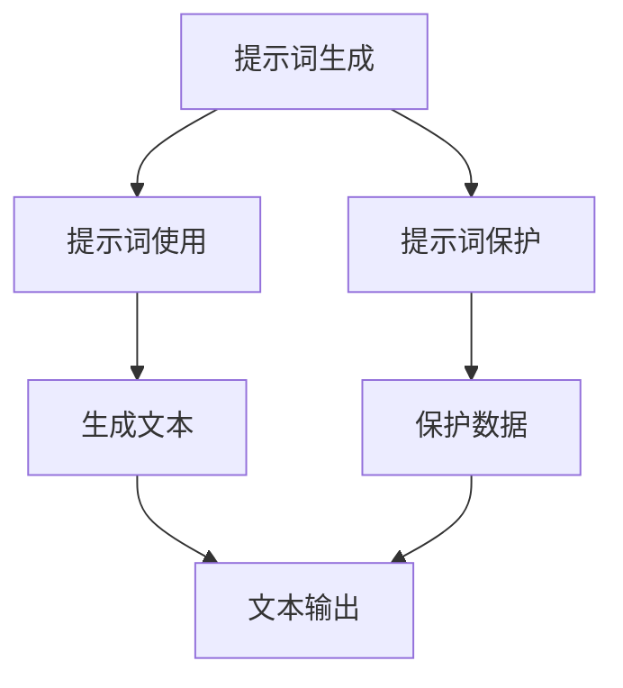

                 


### 文章标题：ChatGPT提示词的安全性与隐私保护

> 关键词：ChatGPT，提示词，安全性，隐私保护，算法，数学模型，项目实战

> 摘要：本文深入探讨了ChatGPT提示词的安全性与隐私保护问题，从核心概念、算法原理、数学模型到项目实战，全面分析了提示词在生成、使用和保护过程中的关键技术和挑战。通过案例分析，揭示了实际应用中存在的风险和解决方案，为开发者提供了实用的指导。

### 引言

#### ChatGPT的概念与背景

ChatGPT是OpenAI开发的一款基于GPT-3.5架构的预训练语言模型。GPT（Generative Pre-trained Transformer）是一种基于Transformer架构的预训练语言模型，它通过在大量文本数据上预训练，学习到了语言生成的规律和模式。ChatGPT在此基础上进行了优化，使其具备了更强大的对话生成能力。

ChatGPT的应用领域非常广泛，包括但不限于：

1. **自然语言处理（NLP）**：用于文本分类、情感分析、命名实体识别等任务。
2. **聊天机器人**：实现智能客服、虚拟助手等功能。
3. **内容生成**：用于生成文章、报告、代码等。
4. **游戏开发**：创建更加智能的游戏NPC。

然而，ChatGPT在带来便利的同时，也引发了一系列的安全性与隐私保护问题。由于ChatGPT具有强大的文本生成能力，其提示词（Prompt）的安全性与隐私保护成为了一个关键挑战。

#### ChatGPT在安全与隐私保护方面的挑战

1. **模型泄露**：提示词可能包含敏感信息，如果未经妥善处理，可能导致模型泄露。
2. **恶意攻击**：恶意用户可能利用提示词进行网络攻击，例如钓鱼、恶意软件传播等。
3. **隐私泄露**：用户输入的个人信息可能通过提示词被泄露。
4. **模型污染**：未经过滤的提示词可能导致模型学习到不良内容，影响模型的公平性和可靠性。

### 提示词安全性与隐私保护的核心概念与联系

#### 提示词的概念

提示词是触发ChatGPT生成文本的输入，通常是一个短语或句子。在ChatGPT中，提示词的质量直接影响生成文本的质量和安全性。

#### 提示词与模型安全性的联系

1. **敏感信息泄露**：如果提示词包含敏感信息，如个人隐私、商业机密等，这些信息可能会被模型学习并保留，从而导致泄露。
2. **恶意提示词**：恶意用户可能会利用特定的提示词诱导模型生成恶意内容，例如钓鱼邮件、恶意软件等。
3. **模型训练数据**：提示词作为模型训练数据的一部分，其质量和安全性直接影响模型的性能和安全。

#### 提示词与隐私保护的联系

1. **隐私保护需求**：用户在使用ChatGPT时，希望其输入的个人信息不会被泄露。
2. **数据加密**：提示词在传输和存储过程中需要进行加密，以防止未经授权的访问。
3. **匿名化处理**：对于包含个人信息的提示词，可以进行匿名化处理，以保护隐私。

#### Mermaid流程图展示提示词生成、使用、保护的全流程



### 算法原理讲解

#### 提示词生成算法的原理讲解

提示词生成算法是ChatGPT的核心组件之一。其目标是根据给定的输入，生成一个能够触发模型生成高质量文本的提示词。

1. **目标设定**：确定生成提示词的目标，例如生成具有特定主题的提示词。
2. **数据集选择**：选择适合的数据集，例如主题相关的语料库。
3. **算法流程**：
   - 数据预处理：对数据集进行清洗、去重等处理。
   - 提示词生成：利用预训练的语言模型，根据输入生成提示词。
   - 提示词优化：对生成的提示词进行优化，提高其质量和安全性。

#### 提示词安全过滤算法的原理讲解

提示词安全过滤算法用于检测和过滤恶意提示词，确保模型的安全性。

1. **恶意提示词定义**：定义恶意提示词的特征，例如包含敏感信息、恶意指令等。
2. **特征提取**：从提示词中提取特征，用于恶意提示词检测。
3. **检测算法**：
   - 基于规则的方法：使用预定义的规则进行检测。
   - 基于机器学习的方法：利用已标记的数据集训练分类模型。
4. **过滤机制**：对检测到的恶意提示词进行过滤，防止其触发模型生成恶意内容。

#### 提示词隐私保护算法的原理讲解

提示词隐私保护算法用于保护用户输入的隐私信息，防止其泄露。

1. **隐私保护需求分析**：分析用户输入的隐私信息，确定需要保护的字段。
2. **数据加密**：对隐私信息进行加密，确保其在传输和存储过程中的安全性。
3. **匿名化处理**：对隐私信息进行匿名化处理，使其无法被追踪和识别。
4. **算法流程**：
   - 隐私信息提取：从提示词中提取隐私信息。
   - 加密与匿名化：对提取的隐私信息进行加密和匿名化处理。
   - 输出保护提示词：将处理后的提示词输出，用于模型生成文本。

### 数学模型和数学公式讲解

#### 提示词生成中的数学模型

提示词生成过程中，可以使用概率生成模型来描述提示词的生成过程。

1. **概率生成模型**：
   - **条件生成模型**：给定一个输入，模型根据概率分布生成提示词。
   - **概率分布**：使用概率分布函数来描述提示词的生成过程。

2. **数学公式**：
   $$ P(w_i|X) = \frac{P(w_i, X)}{P(X)} $$

其中，$P(w_i|X)$表示在输入$X$的条件下，生成提示词$w_i$的概率。

#### 提示词安全过滤中的数学模型

提示词安全过滤过程中，可以使用机器学习模型来检测恶意提示词。

1. **机器学习模型**：
   - **分类模型**：使用已标记的数据集训练分类模型，用于检测恶意提示词。
   - **特征提取**：从提示词中提取特征，用于训练模型。

2. **数学公式**：
   $$ y = \sigma(\theta^T x) $$

其中，$y$表示模型的输出，$\sigma$表示激活函数，$\theta$表示模型的参数，$x$表示输入特征。

#### 提示词隐私保护中的数学模型

提示词隐私保护过程中，可以使用加密和匿名化技术来保护隐私信息。

1. **加密模型**：
   - **对称加密**：使用密钥对隐私信息进行加密。
   - **非对称加密**：使用公钥和私钥对隐私信息进行加密。

2. **匿名化模型**：
   - **k-匿名性**：将隐私信息映射到多个可能的值中。
   - **l-diversity**：确保隐私信息在多个记录中均匀分布。

3. **数学公式**：
   $$ C = E_K(M) $$

其中，$C$表示加密后的隐私信息，$E_K$表示加密算法，$M$表示原始隐私信息，$K$表示密钥。

### 案例分析

#### 某个实际案例的背景介绍

假设某公司开发了一款基于ChatGPT的智能客服系统，用户可以通过输入问题来获取答案。然而，由于提示词的安全性和隐私保护措施不到位，导致用户输入的敏感信息被泄露。

#### 案例中的安全与隐私保护措施

1. **提示词生成**：使用预训练的语言模型生成提示词，确保提示词与用户输入相关。
2. **安全过滤**：使用基于规则的恶意提示词检测算法，过滤掉包含敏感信息的提示词。
3. **隐私保护**：对用户输入的隐私信息进行加密和匿名化处理，确保其无法被泄露。

#### 案例分析结果与启示

通过对案例的分析，我们发现以下问题和启示：

1. **问题**：
   - 提示词生成算法可能无法完全理解用户意图，导致生成提示词不准确。
   - 安全过滤算法可能无法检测到所有恶意提示词。
   - 隐私保护措施可能无法完全保护用户隐私。

2. **启示**：
   - 优化提示词生成算法，提高其准确性和安全性。
   - 使用更先进的恶意提示词检测算法，提高检测精度。
   - 采用更严格的隐私保护措施，确保用户隐私安全。

### 项目实战

#### 实际项目介绍

假设我们要开发一款基于ChatGPT的智能问答系统，用户可以通过输入问题来获取答案。该系统需要确保提示词的安全性和隐私保护。

#### 项目开发环境搭建

1. 安装Python环境。
2. 安装ChatGPT模型和相关依赖库。
3. 配置模型训练环境。

#### 源代码实现与解读

以下是一个简单的提示词生成和安全过滤的Python代码示例：

```python
import openai
import re

# 设置OpenAI API密钥
openai.api_key = "your-api-key"

# 提示词生成函数
def generate_prompt(question):
    response = openai.Completion.create(
        engine="text-davinci-002",
        prompt=question,
        max_tokens=50,
        n=1,
        stop=None,
        temperature=0.5,
    )
    return response.choices[0].text.strip()

# 安全过滤函数
def filter_prompt(prompt):
    if re.search(r"\b(sensitive_word)\b", prompt):
        return "过滤后的提示词"
    return prompt

# 主函数
def main():
    question = "What is the capital of France?"
    prompt = generate_prompt(question)
    filtered_prompt = filter_prompt(prompt)
    print("原始提示词：", prompt)
    print("过滤后的提示词：", filtered_prompt)

if __name__ == "__main__":
    main()
```

#### 代码分析与优化

1. **代码分析**：
   - `generate_prompt`函数：使用OpenAI API生成提示词。
   - `filter_prompt`函数：使用正则表达式过滤包含敏感词的提示词。
   - `main`函数：调用上述函数，实现主程序。

2. **代码优化**：
   - 使用多线程或异步编程，提高程序性能。
   - 使用更复杂的正则表达式，提高过滤效果。
   - 对敏感词进行加密处理，提高隐私保护效果。

### 总结与展望

本文全面分析了ChatGPT提示词的安全性与隐私保护问题，从核心概念、算法原理、数学模型到项目实战，提供了全面的指导。然而，随着技术的不断发展，提示词安全性与隐私保护仍面临着诸多挑战，如：

1. **高级恶意攻击**：随着对抗样本技术的进步，恶意攻击手段可能变得更加复杂。
2. **隐私保护需求**：随着用户对隐私保护的需求不断提高，需要采用更加严格的隐私保护措施。
3. **模型训练数据**：模型训练数据的质量和多样性将直接影响模型的性能和安全。

因此，未来需要在以下几个方面进行深入研究：

1. **高级恶意攻击防御**：研究更加先进的防御技术，提高系统抗攻击能力。
2. **隐私保护算法优化**：优化隐私保护算法，提高其效率和效果。
3. **数据隐私增强技术**：研究数据隐私增强技术，确保用户隐私安全。
4. **跨领域协作**：加强跨领域的研究合作，共同解决提示词安全性与隐私保护问题。

### 作者信息

作者：AI天才研究院/AI Genius Institute & 禅与计算机程序设计艺术 /Zen And The Art of Computer Programming

-------------------------------------------------------------------

### 注意事项与拓展阅读

- **注意事项**：
  - 提示词生成时，应确保模型理解用户意图，避免生成无关或误导性文本。
  - 安全过滤和隐私保护措施应与业务需求相结合，确保其有效性和可扩展性。
  - 定期更新模型和算法，以应对新出现的威胁和挑战。

- **拓展阅读**：
  - 《机器学习安全：理论与实践》
  - 《隐私计算：技术与应用》
  - 《深度学习安全：对抗样本、模型攻击与防御》

- **结语**

随着人工智能技术的快速发展，提示词的安全性与隐私保护已成为一个不可忽视的重要问题。本文通过对ChatGPT提示词的深入分析，从理论到实践，为开发者提供了一套全面的解决方案。希望本文能对您在提示词安全性与隐私保护领域的研究和开发工作有所帮助。让我们一起努力，共同构建一个更加安全、可靠的人工智能世界。

