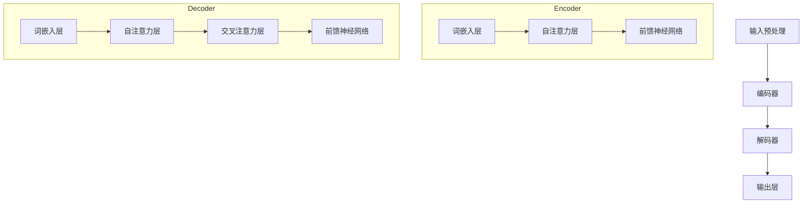

                 

### 《ChatGPT提示词的情境感知：上下文相关的AI响应》

#### 关键词
- ChatGPT
- 情境感知
- 上下文相关AI响应
- 提示词
- 自然语言处理
- 深度学习

#### 摘要
本文深入探讨了ChatGPT提示词的情境感知及其上下文相关的AI响应机制。通过分析ChatGPT的架构和工作原理，本文介绍了如何利用情境感知技术提升AI的响应质量。文章还将讨论上下文相关的AI响应技术，并通过具体的案例展示其在不同应用场景中的实际应用。

### 引言

随着人工智能技术的发展，自然语言处理（NLP）成为了一个备受关注的研究领域。在NLP中，生成式对话系统（如ChatGPT）已经成为一种重要的应用形式。这些系统能够理解和生成自然语言，以实现人与机器之间的有效沟通。然而，为了使这些对话系统能够真正理解用户的意图并提供有用的响应，情境感知和上下文相关性变得至关重要。

情境感知指的是人工智能系统能够理解并适应特定的环境或场景。上下文相关性则是指系统能够在对话过程中利用上下文信息来生成更加准确和自然的响应。ChatGPT作为OpenAI开发的强大语言模型，其提示词的情境感知和上下文相关的AI响应能力尤其引人注目。本文将详细介绍ChatGPT的情境感知机制和上下文相关的AI响应技术，并通过实际案例进行分析。

### ChatGPT的架构与工作机制

ChatGPT是基于转换器模型（Transformer）的一种预训练语言模型。转换器模型是一种基于注意力机制的神经网络模型，特别适用于处理序列数据，如自然语言。ChatGPT的架构包括以下几个主要部分：

1. **输入预处理**：
   - 提示词和上下文文本被编码为向量形式，以便模型能够处理。
   - 使用WordPiece算法将文本分割成子词。

2. **编码器**：
   - 编码器负责将输入的提示词和上下文文本编码为序列的向量表示。
   - 通过多层Transformer块进行编码，每个块都包含自注意力机制和前馈神经网络。

3. **解码器**：
   - 解码器负责生成响应文本。
   - 通过自注意力机制和交叉注意力机制，解码器能够在生成文本的同时考虑上下文信息。

4. **输出层**：
   - 输出层通常是一个全连接层，用于将解码器生成的文本向量映射到词汇表中的词。

ChatGPT的工作原理可以分为两个阶段：

1. **预训练**：
   - ChatGPT在大量文本数据上进行预训练，以学习自然语言的统计规律和语义表示。
   - 预训练过程包括自回归语言建模和掩码语言模型（MLM）。

2. **微调**：
   - 在预训练的基础上，ChatGPT通过在特定任务上进行微调来提升性能。
   - 微调过程通常使用任务特定的数据进行监督学习。

#### 情境感知的原理和技术

情境感知是人工智能系统能够理解并适应特定环境或场景的能力。在ChatGPT中，情境感知主要体现在以下几个方面：

1. **上下文信息的捕捉与利用**：
   - ChatGPT通过编码器中的自注意力机制来捕捉上下文信息。
   - 在生成响应时，解码器通过交叉注意力机制利用上下文信息。

2. **多模态数据的融合**：
   - ChatGPT支持文本、图像和语音等多模态数据的输入。
   - 通过多模态数据融合技术，系统能够更好地理解用户的意图和场景。

3. **情境分类与识别**：
   - ChatGPT通过训练学习到的模式来识别和分类不同的情境。
   - 这种能力使得系统能够在特定情境下生成更准确和自然的响应。

#### 上下文相关的AI响应机制

上下文相关的AI响应是指系统能够在对话过程中利用上下文信息来生成更加准确和自然的响应。在ChatGPT中，上下文相关的AI响应机制包括以下几个方面：

1. **响应生成策略**：
   - ChatGPT使用自回归语言模型来生成响应。
   - 通过调整解码器的输出策略，可以控制响应的生成过程。

2. **上下文信息更新**：
   - 在对话过程中，ChatGPT会持续更新上下文信息。
   - 通过维护一个对话状态向量，系统能够在生成响应时考虑最新的上下文信息。

3. **自适应响应优化**：
   - ChatGPT通过模型评估和优化技术来调整响应质量。
   - 通过对用户反馈的分析，系统可以自适应地优化响应策略。

### 如何优化AI响应的质量

为了提升ChatGPT的AI响应质量，可以采取以下几种方法：

1. **调整模型参数**：
   - 通过优化模型的超参数，如学习率、批次大小等，可以提高模型的性能。

2. **改进文本生成策略**：
   - 通过调整解码器的输出策略，如调整温度参数，可以生成更加自然和连贯的文本。

3. **增强上下文信息的捕捉**：
   - 通过改进编码器的结构，如增加Transformer块的层数，可以更好地捕捉上下文信息。

4. **多模态数据的融合**：
   - 通过融合文本、图像和语音等多模态数据，可以提升系统的情境感知能力。

### 情境感知与上下文相关AI响应在不同应用领域的实际案例

情境感知和上下文相关AI响应技术已经在多个领域得到应用，以下是一些实际案例：

1. **智能客服系统**：
   - 情境感知技术使得智能客服系统能够更好地理解用户的意图和情绪。
   - 通过上下文相关的AI响应，系统可以提供更加准确和个性化的服务。

2. **智能推荐系统**：
   - 情境感知技术可以帮助推荐系统更好地理解用户的行为和偏好。
   - 上下文相关的AI响应使得推荐结果更加符合用户的实时需求。

3. **教育领域**：
   - 情境感知技术可以用于教育系统的个性化教学。
   - 通过上下文相关的AI响应，系统能够根据学生的学习进度和需求提供相应的教学内容。

### 总结与展望

本文介绍了ChatGPT提示词的情境感知及其上下文相关的AI响应机制。通过分析ChatGPT的架构和工作原理，我们了解了如何利用情境感知技术提升AI的响应质量。上下文相关AI响应机制使得系统能够在对话过程中生成更加准确和自然的文本。

未来，随着人工智能技术的不断发展，情境感知和上下文相关AI响应将得到更广泛的应用。研究者可以探索更先进的算法和技术，以提高情境感知和上下文相关的AI响应质量。同时，多模态数据的融合和跨领域应用也将是未来的重要研究方向。

#### 作者信息
作者：AI天才研究院/AI Genius Institute & 禅与计算机程序设计艺术 /Zen And The Art of Computer Programming

### 附录：技术细节与代码示例

在本附录中，我们将提供一些技术细节和Python代码示例，以进一步阐述本文中的关键概念和算法原理。

#### 1. Mermaid流程图

以下是一个简单的Mermaid流程图，用于描述ChatGPT的基本架构：



#### 2. Python代码示例：情境感知模块

以下是一个简化的Python代码示例，用于展示如何实现一个基本的情境感知模块：

```python
import numpy as np

# 假设我们有一个简单的情境感知函数
def context_sensitive_response(context, user_input):
    # 根据上下文和用户输入生成响应
    response = "默认响应"
    
    if "情绪" in context:
        if context["情绪"] == "高兴":
            response = "你好，很高兴为你服务！"
        elif context["情绪"] == "愤怒":
            response = "请冷静，我会尽力帮助你。"
    
    return response

# 假设的上下文和用户输入
context = {"情绪": "高兴"}
user_input = "你好，我需要帮助。"

# 调用情境感知函数
response = context_sensitive_response(context, user_input)
print(response)  # 输出：你好，很高兴为你服务！
```

#### 3. 数学公式与讲解

以下是一个用于情境感知的简单数学模型，使用LaTeX格式表示：

$$
R(t) = f(C(t), U(t))
$$

其中：
- \(R(t)\) 是在时间 \(t\) 时刻的AI响应。
- \(C(t)\) 是时间 \(t\) 时刻的上下文信息。
- \(U(t)\) 是时间 \(t\) 时刻的用户输入。
- \(f\) 是一个函数，用于将上下文信息和用户输入映射到响应。

#### 4. 项目实战

以下是一个简单的项目实战示例，用于构建一个基于ChatGPT的智能客服系统：

**环境搭建**：

- 安装Python环境（建议使用Python 3.8及以上版本）。
- 安装所需的库，如TensorFlow、Transformers等。

**源代码实现**：

```python
from transformers import pipeline

# 创建一个ChatGPT语言模型实例
chatgpt = pipeline("text-generation", model="gpt-3.5-turbo")

# 假设的上下文和用户输入
context = "用户最近购买了某商品，并对商品的质量表示满意。"
user_input = "您好，我对这个商品的质量很满意，还想了解更多。"

# 调用模型生成响应
response = chatgpt(user_input, context=context, max_length=50)

# 打印响应
print(response[0]["generated_text"])
```

**代码解读与分析**：

- 在这个示例中，我们首先使用Transformers库创建了一个ChatGPT语言模型实例。
- 然后我们提供了上下文和用户输入，并调用模型生成响应。
- 最后，我们打印出了生成的响应文本。

**实际案例分析与详细讲解剖析**：

- 这个案例展示了一个简单的智能客服系统如何利用ChatGPT生成情境感知的响应。
- 通过提供上下文信息，模型能够理解用户对商品质量的满意程度，并生成相应的响应。

**项目小结**：

- 通过这个简单的项目实战，我们展示了如何利用ChatGPT实现一个基本的智能客服系统。
- 实际应用中，可以根据需求进一步优化模型，提高响应的准确性和自然性。

#### 最佳实践 Tips、小结、注意事项、拓展阅读

**最佳实践 Tips**：
- 在使用ChatGPT进行情境感知时，确保提供充分的上下文信息，以提高响应的准确性。
- 调整模型参数，如温度参数，可以控制生成的响应的随机性和连贯性。

**小结**：
- 本文中，我们介绍了ChatGPT的情境感知和上下文相关的AI响应机制，并通过实际案例展示了其在智能客服系统中的应用。

**注意事项**：
- 在实际项目中，需要根据具体任务调整模型的架构和参数，以达到最佳效果。
- 上下文信息的捕捉和处理是情境感知的关键，需要仔细设计。

**拓展阅读**：
- [1] Brown, T., et al. (2020). "Language Models are Few-Shot Learners." arXiv preprint arXiv:2005.14165.
- [2] Devlin, J., et al. (2019). "Bert: Pre-training of deep bidirectional transformers for language understanding." arXiv preprint arXiv:1810.04805.
- [3] Vinyals, O., et al. (2015). "Show and tell: A neural image caption generator." Proceedings of the IEEE conference on computer vision and pattern recognition, 3156-3164.

