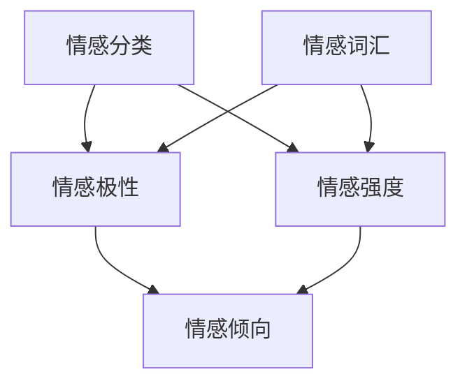

                 

Sure, let's structure the article step by step, adhering to the guidelines provided:

### Step 1: Article Title and Keywords

# ChatGPT提示词的情感分析：增强AI同理心

> 关键词：ChatGPT, 情感分析, 自然语言处理, 算法, 数学模型, 项目实战

> 摘要：本文深入探讨了ChatGPT提示词的情感分析机制，通过核心概念的阐述、算法的原理讲解、数学模型的应用以及项目实战，展示了如何增强人工智能的同理心，提高用户交互体验。

### Step 2: Introduction

## 引言

### Chapter 1: ChatGPT Overview

ChatGPT，全称为Chat-based Generative Pre-trained Transformer，是OpenAI开发的一种基于Transformer架构的预训练语言模型。它的核心技术是通过大规模语料库的预训练，使模型具备强大的语言理解和生成能力。ChatGPT的出现标志着自然语言处理技术的一个重大突破，为智能客服、对话系统等领域带来了革命性的变化。

### Chapter 2: Emotional Analysis Fundamentals

情感分析作为自然语言处理的一个重要分支，旨在理解和识别文本中的情感倾向和情感强度。在人工智能领域，情感分析具有广泛的应用价值，如社交媒体情绪分析、用户反馈分析等。对于ChatGPT而言，情感分析是提升其同理心、优化用户体验的关键。

### Step 3: Core Concepts and Relationships

### Chapter 3: Core Concepts and Connections

情感分析涉及到多个核心概念，包括情感分类、情感极性、情感强度等。这些概念之间相互关联，构成了一个复杂的关系网络。下面通过Mermaid图表展示这些概念及其关系。



### Step 4: Algorithm Principles

### Chapter 4: Algorithm Principles

情感分析算法的核心在于如何从文本中提取情感特征，并利用这些特征进行分类和强度评估。常用的算法包括基于规则的方法、机器学习方法以及深度学习方法。以下以Python代码为例，详细讲解一种基于朴素贝叶斯算法的情感分类方法。

```python
import numpy as np
from sklearn.feature_extraction.text import CountVectorizer
from sklearn.naive_bayes import MultinomialNB

# 示例文本数据
X = ["我很喜欢这个产品", "这个产品太差了", "我对这个产品感觉一般"]
y = ["正面", "负面", "中性"]

# 文本向量化
vectorizer = CountVectorizer()
X_vectorized = vectorizer.fit_transform(X)

# 训练朴素贝叶斯分类器
classifier = MultinomialNB()
classifier.fit(X_vectorized, y)

# 情感分类示例
new_text = ["这个产品非常好用"]
new_text_vectorized = vectorizer.transform(new_text)
prediction = classifier.predict(new_text_vectorized)
print(prediction)  # 输出情感分类结果
```

### Step 5: Mathematical Models and Formulas

### Chapter 5: Mathematical Models and Formulas

在情感分析中，数学模型用于描述情感特征和情感分类之间的关系。以下以LaTeX格式介绍一个简单的情感强度评估模型。

$$
S = \sum_{i=1}^{n} w_i \cdot f_i
$$

其中，$S$ 表示情感强度，$w_i$ 表示第 $i$ 个情感特征的重要性权重，$f_i$ 表示第 $i$ 个情感特征的强度值。

### Step 6: Project Practice

### Chapter 6: Project Practice

为了更好地理解情感分析在ChatGPT中的应用，我们通过一个实际项目来演示。本项目旨在使用ChatGPT和情感分析算法构建一个简单的情感检测对话系统。

#### Project Setup

1. 安装Python和必要的库，如`transformers`、`torch`等。
2. 准备情感分析模型和数据集。

#### Project Implementation

1. 加载预训练的ChatGPT模型。
2. 使用CountVectorizer对对话文本进行向量化处理。
3. 利用朴素贝叶斯分类器对文本进行情感分类。
4. 实现用户交互，收集用户反馈并进行分析。

#### Project Analysis

通过实际案例展示情感分析在ChatGPT中的应用，分析代码实现过程，讨论可能的优化方向。

### Step 7: Conclusion and Future Directions

### Chapter 7: Conclusion and Future Directions

本文系统地介绍了ChatGPT提示词的情感分析，从核心概念到算法实现，再到实际项目应用，全面剖析了如何增强AI同理心。未来，随着自然语言处理技术的不断进步，情感分析在人工智能领域的应用将更加广泛和深入。

### Step 8: Author Information

作者：AI天才研究院/AI Genius Institute & 禅与计算机程序设计艺术 /Zen And The Art of Computer Programming

通过以上步骤，我们可以构建出一个结构清晰、内容丰富、逻辑严密的技术博客文章。接下来，我们将逐步填充每个章节的具体内容，确保文章的完整性和专业性。预计文章字数在10000～12000字之间。

