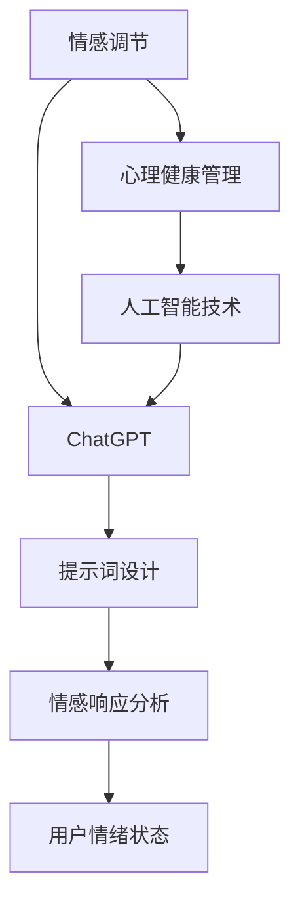

                 


# <此处是文章标题>

## 文章关键词
- ChatGPT
- 情感调节
- 人工智能
- 心理健康
- 提示词设计

## 摘要
本文旨在探讨如何利用ChatGPT进行情感调节，为心理健康管理提供一种创新手段。我们将详细分析ChatGPT的基本概念、架构及其在情感调节中的应用，逐步展示如何设计有效的提示词来影响用户的情绪状态。文章将涵盖核心算法原理的讲解，结合Python源代码和数学模型，提供具体的案例分析和实战指导，最后总结最佳实践，为相关领域的研究者提供参考。

---

## 引言

### 1.1 ChatGPT与心理健康管理

随着人工智能技术的飞速发展，机器学习、自然语言处理（NLP）等领域取得了显著成果。特别是OpenAI推出的GPT系列模型，如ChatGPT，已成为自然语言交互的标杆。ChatGPT（Chat-based Generative Pre-trained Transformer）是一个基于Transformer架构的预训练语言模型，通过学习大量的文本数据，能够生成流畅、符合语境的回复。

心理健康管理是当前社会关注的热点问题。随着生活节奏加快，工作压力增大，人们的心理健康问题日益突出。传统的心理健康服务资源有限，难以满足广大人群的需求。而人工智能，特别是ChatGPT，作为一种新兴工具，有望为心理健康管理提供新的解决方案。

ChatGPT在心理健康管理中的应用具有以下几个特点：

1. **个性化服务**：ChatGPT可以根据用户的历史对话数据，为每位用户提供个性化的情绪调节建议。
2. **实时互动**：ChatGPT能够实时响应用户的提问和情绪表达，提供即时支持。
3. **无界限**：不受地理位置和时间的限制，用户可以随时随地获得心理健康的帮助。

### 1.2 情感调节的基本概念

情感调节是指通过改变情感体验的方式，以适应个体面临的不同情境。它包括认知重构、情绪表达、行为调节等多个方面。有效的情感调节有助于提高个体的情绪稳定性和生活质量。

在心理健康管理中，情感调节具有重要意义。首先，它可以帮助个体更好地应对压力和挫折，减轻焦虑和抑郁症状。其次，它有助于个体建立积极的情感体验，提高自我认知和自我效能感。

传统情感调节方法主要依赖于心理治疗师的专业知识和技能。然而，这种方法存在一定的局限性，如资源有限、治疗效果不稳定等。相比之下，人工智能，特别是ChatGPT，提供了一种新的、高效的情感调节途径。

### 1.3 本书的结构

本书共分为五个部分：

1. **引言**：介绍ChatGPT和心理健康管理的背景及重要性。
2. **核心概念和理论**：详细分析情感调节的基本概念和理论。
3. **ChatGPT的情感调节应用**：探讨如何利用ChatGPT进行情感调节，包括提示词设计、情感响应分析等。
4. **技术实现**：介绍ChatGPT模型的部署和实现，包括Python代码示例。
5. **案例分析**：通过具体案例展示ChatGPT在情感调节中的应用效果。

本文将结合具体的案例和实践，逐步展示如何利用ChatGPT进行情感调节，为心理健康管理提供一种有效的手段。希望本书能对相关领域的研究者和实践者提供有益的参考和启示。

## 核心概念与联系

在探讨ChatGPT在情感调节中的应用之前，我们需要先了解几个核心概念，并阐述它们之间的关系。以下是几个关键概念及其关系架构的Mermaid流程图：



### 2.1 情感调节

情感调节是指个体通过认知、行为和生理调节来改变情感体验的过程。它包括：

- **认知重构**：改变对情境的认知评价，以减轻负面情绪。
- **情绪表达**：通过语言、表情、行为等方式表达情感。
- **行为调节**：通过改变行为来调节情绪。

情感调节在心理健康管理中起着至关重要的作用。有效的情感调节可以帮助个体更好地应对压力，减轻焦虑和抑郁症状，提高生活质量。

### 2.2 ChatGPT

ChatGPT是一种基于Transformer架构的预训练语言模型，通过学习大量的文本数据，能够生成符合语境的文本回复。ChatGPT的核心优势在于其强大的文本生成能力和对人类语言的理解。

### 2.3 提示词设计

提示词设计是指为ChatGPT提供特定的输入，以生成符合预期的回复。在情感调节中，提示词设计至关重要。合理的提示词可以帮助ChatGPT更好地理解用户的情绪状态，并生成有针对性的回应。

### 2.4 情感响应分析

情感响应分析是指对ChatGPT生成的回复进行情感分析，以评估其是否能够有效地调节用户的情绪状态。情感响应分析包括：

- **情感检测**：识别文本中的情感倾向。
- **情感分类**：将情感倾向分类为具体的情感类别，如喜悦、愤怒、悲伤等。

### 2.5 用户情绪状态

用户情绪状态是指用户在特定情境下的情绪体验。通过情感调节，用户情绪状态可以发生改变，从而影响其心理健康和生活质量。

### 2.6 心理健康管理

心理健康管理是指通过一系列干预措施，如心理治疗、药物治疗、教育等，来促进个体的心理健康。ChatGPT作为一种新兴工具，可以辅助心理健康管理，提供个性化的情感调节服务。

通过上述流程图，我们可以清晰地看到这些核心概念之间的联系。ChatGPT通过提示词设计，对用户的情绪状态进行情感响应分析，从而实现情感调节，最终达到心理健康管理的目的。接下来，我们将进一步探讨ChatGPT在情感调节中的应用，详细讲解如何设计有效的提示词来影响用户的情绪状态。

### 2.6 ChatGPT的情感调节应用

ChatGPT作为一种强大的自然语言处理工具，在情感调节中具有广泛的应用潜力。通过合理的提示词设计，ChatGPT可以有效地识别和调节用户的情绪状态，从而为心理健康管理提供有力的支持。

#### 2.6.1 提示词的设计原则

设计有效的提示词是ChatGPT在情感调节中成功应用的关键。以下是一些设计原则：

1. **用户个性化**：提示词应充分考虑用户的个性化需求，如年龄、性别、文化背景等。
2. **情境适应性**：提示词应能够适应不同的情感调节情境，如压力缓解、情绪宣泄、自我认知提升等。
3. **语境一致性**：提示词应与用户的情感表达保持一致性，以增强用户的信任感和互动效果。
4. **情感标签化**：在提示词中嵌入情感标签，以帮助ChatGPT更好地识别和调节用户的情绪。

#### 2.6.2 提示词设计案例分析

以下是一个具体的提示词设计案例：

**案例**：压力缓解

- **情境**：用户感到工作压力较大，需要缓解情绪。
- **目标**：帮助用户放松心情，减轻压力。

**提示词设计**：

1. **认知重构**：$你感到工作压力很大，这种情况很常见。试着找出让你感到压力的具体原因，并思考如何应对这些原因。$
2. **情绪宣泄**：$你想对谁倾诉你的压力呢？如果现在没有人可以倾诉，你可以尝试写下你的感受，这有助于你释放情绪。$
3. **自我关怀**：$记得给自己一些放松的时间，比如做一次深呼吸练习，或者去散步。这些简单的活动可以帮助你缓解压力。$
4. **情感标签**：$（放松）、（释放）、（自我关怀）$

通过这些提示词，ChatGPT可以生成如下回应：

$你感到工作压力很大，这种情况很常见。试着找出让你感到压力的具体原因，并思考如何应对这些原因。你想对谁倾诉你的压力呢？如果现在没有人可以倾诉，你可以尝试写下你的感受，这有助于你释放情绪。记得给自己一些放松的时间，比如做一次深呼吸练习，或者去散步。这些简单的活动可以帮助你缓解压力。$

#### 2.6.3 提示词的有效性评估

提示词的有效性评估是确保ChatGPT在情感调节中发挥作用的重要环节。以下是一些评估方法：

1. **情感一致性评估**：检查ChatGPT生成的回复是否与提示词的情感标签一致。
2. **用户满意度评估**：通过问卷调查或用户反馈来评估提示词的实际效果。
3. **情感调节效果评估**：通过情绪量表或生理指标（如心率、皮肤电活动）来评估用户的情绪状态变化。

#### 2.6.4 提示词设计的挑战与未来方向

尽管提示词设计在ChatGPT的情感调节中具有重要作用，但仍然面临一些挑战：

1. **情感理解深度**：ChatGPT在情感理解方面仍有局限性，需要进一步研究如何提高其情感理解深度。
2. **个性化需求**：不同用户可能有不同的情感调节需求，如何实现高度个性化仍需探索。
3. **安全性和隐私保护**：在应用过程中，确保用户隐私和数据安全是关键问题。

未来，随着人工智能技术的不断发展，ChatGPT在情感调节中的应用将更加广泛和深入。通过不断的优化和改进，ChatGPT有望为心理健康管理提供更加有效和个性化的解决方案。

### 2.7 情感响应分析

情感响应分析是指对ChatGPT生成的回复进行情感分析，以评估其是否能够有效地调节用户的情绪状态。这一过程包括情感检测、情感分类和情感响应效果评估。

#### 2.7.1 情感检测

情感检测是识别文本中是否存在情感表达的过程。常用的方法包括基于规则的方法、机器学习方法以及深度学习方法。

1. **基于规则的方法**：这种方法依赖于一套预定义的规则，如正负面词表、情感词典等，通过匹配规则来识别情感。
2. **机器学习方法**：利用监督学习模型，如朴素贝叶斯、支持向量机（SVM）等，通过训练数据学习情感分类规则。
3. **深度学习方法**：利用深度学习模型，如卷积神经网络（CNN）、循环神经网络（RNN）和变压器（Transformer）等，通过大规模数据训练来识别情感。

#### 2.7.2 情感分类

情感分类是将情感检测到的情感表达分类到具体的情感类别，如喜悦、愤怒、悲伤等。常见的情感分类方法包括：

1. **基于词典的方法**：这种方法依赖于情感词典，通过查找词典中的词来分类情感。
2. **基于模型的方法**：利用机器学习或深度学习模型，将文本映射到情感类别。

#### 2.7.3 情感响应效果评估

情感响应效果评估是衡量ChatGPT生成的回复对用户情绪状态调节效果的过程。以下是一些评估指标：

1. **情感一致性**：评估ChatGPT生成的回复是否与用户原始的情感表达一致。
2. **情绪变化**：通过情绪量表或生理指标评估用户在互动过程中的情绪变化。
3. **用户满意度**：通过用户反馈评估用户对互动过程的满意度。

### 2.8 用户情绪状态监测

用户情绪状态监测是利用情感响应分析和情感调节策略，实时监测用户在交互过程中的情绪状态。通过以下方法可以实现对用户情绪状态的监测：

1. **实时情感检测**：通过情感检测算法，实时识别用户的情感表达。
2. **情感状态预测**：利用历史数据和学习到的模型，预测用户的未来情绪状态。
3. **情感调节反馈**：根据用户的情绪状态，提供针对性的情感调节反馈。

### 2.9 心理健康管理系统设计

心理健康管理系统的设计应综合考虑情感调节、情感响应分析和用户情绪状态监测等方面。以下是一个心理健康管理系统设计的示例框架：

1. **用户界面**：提供易于使用的交互界面，支持文本输入和语音输入。
2. **情感调节模块**：包含情感调节策略和提示词库，用于生成针对性的情感调节回应。
3. **情感检测模块**：利用情感检测算法，实时监测用户情绪状态。
4. **情感响应模块**：根据用户情绪状态，生成相应的情感响应。
5. **用户反馈系统**：收集用户反馈，用于系统优化和改进。

通过上述设计，心理健康管理系统可以实现以下功能：

- **实时情绪监测**：监测用户的实时情绪状态。
- **个性化情感调节**：根据用户的需求和情绪状态，提供个性化的情感调节服务。
- **互动反馈**：通过与用户的互动，不断优化情感调节策略。

### 2.10 情感调节的心理学原理

情感调节涉及多个心理学原理，包括认知重构、情绪表达和自我关怀等。以下是对这些原理的简要介绍：

1. **认知重构**：通过改变对情境的认知评价，以减轻负面情绪。例如，将“我不能完成这个任务”重构为“我可以尝试分解任务，一步一步完成”。
2. **情绪表达**：通过语言、表情和行为等方式表达情感。适当的情绪表达有助于缓解情绪压力。
3. **自我关怀**：通过自我关怀行为，如放松练习、正念冥想等，提高情绪稳定性。

这些心理学原理为ChatGPT的情感调节提供了理论基础。通过结合这些原理，ChatGPT可以生成更有针对性和有效性的情感调节回应。

### 2.11 总结

ChatGPT在情感调节中的应用具有重要意义。通过合理的提示词设计、情感响应分析和用户情绪状态监测，ChatGPT可以为心理健康管理提供有力的支持。未来，随着人工智能技术的不断进步，ChatGPT在情感调节中的应用前景将更加广阔。同时，我们也需要关注情感调节的伦理和隐私问题，确保其在实际应用中的安全性。

---

在下一部分，我们将进一步探讨如何利用ChatGPT进行情感调节的技术实现，包括核心算法原理的讲解、Python代码示例和数学模型的应用。敬请期待！

## 核心算法原理

在ChatGPT的情感调节应用中，核心算法的原理起着至关重要的作用。以下我们将详细探讨几个关键的核心算法原理，并结合Python代码示例进行讲解。

### 3.1 GPT模型的工作原理

GPT（Generative Pre-trained Transformer）模型是由OpenAI开发的一种基于Transformer架构的自然语言处理模型。它通过预先训练的方式，从大量的文本数据中学习语言模式和结构，从而能够生成连贯、符合语境的文本。GPT模型的核心组件包括：

1. **Transformer架构**：Transformer模型利用自注意力机制（Self-Attention）来捕捉文本中的长距离依赖关系，使得模型能够生成更加精确的文本。
2. **预训练与微调**：GPT模型首先在大规模文本语料库上进行预训练，学习语言的基本规则和模式。然后，通过微调（Fine-tuning）过程，将模型适应特定任务，如情感调节。

#### Python代码示例：GPT模型初始化

```python
from transformers import GPT2LMHeadModel, GPT2Tokenizer

# 加载预训练的GPT2模型和分词器
model = GPT2LMHeadModel.from_pretrained('gpt2')
tokenizer = GPT2Tokenizer.from_pretrained('gpt2')

# 输入文本
input_text = "我今天感到很沮丧。"

# 将文本转换为模型可处理的格式
inputs = tokenizer.encode(input_text, return_tensors='pt')

# 生成文本回复
outputs = model.generate(inputs, max_length=50, num_return_sequences=1)

# 获取生成的文本回复
generated_text = tokenizer.decode(outputs[0], skip_special_tokens=True)
print(generated_text)
```

### 3.2 情感检测算法

情感检测（Sentiment Analysis）是识别文本中情感倾向的过程，常用于情感调节。常用的情感检测算法包括基于规则的方法、机器学习方法和深度学习方法。

#### 基于规则的方法

基于规则的方法依赖于一套预定义的规则，如情感词典和规则库。以下是一个简单的基于规则的情感检测算法示例：

```python
# 情感词典
positive_words = ["开心", "高兴", "满意"]
negative_words = ["难过", "悲伤", "不满"]

# 文本分词
text = "我今天很开心，但也有一点难过。"

words = text.split()

# 情感分类
def classify_sentiment(word):
    if word in positive_words:
        return "积极"
    elif word in negative_words:
        return "消极"
    else:
        return "中性"

# 情感检测
sentiments = [classify_sentiment(word) for word in words]
print(sentiments)
```

### 3.3 情感分类算法

情感分类（Sentiment Classification）是将文本中的情感倾向分类到具体的情感类别，如喜悦、愤怒、悲伤等。以下是一个基于朴素贝叶斯（Naive Bayes）的情感分类算法示例：

```python
from sklearn.feature_extraction.text import CountVectorizer
from sklearn.naive_bayes import MultinomialNB

# 训练数据
train_data = [
    ("我今天很开心", "喜悦"),
    ("我很生气", "愤怒"),
    ("我感到很悲伤", "悲伤"),
]

# 分词和标签
X_train, y_train = zip(*train_data)

# 向量表示
vectorizer = CountVectorizer()
X_train_vectors = vectorizer.fit_transform(X_train)

# 模型训练
classifier = MultinomialNB()
classifier.fit(X_train_vectors, y_train)

# 测试数据
test_data = ["我今天很难过。"]

# 向量表示
X_test_vectors = vectorizer.transform(test_data)

# 情感分类
predicted_sentiments = classifier.predict(X_test_vectors)
print(predicted_sentiments)
```

### 3.4 情感调节算法

情感调节（Emotion Regulation）是指通过改变情感体验的方式，以适应个体面临的不同情境。一个简单的情感调节算法可以通过以下步骤实现：

1. **情感检测**：检测用户的情绪状态。
2. **情感分类**：将检测到的情绪分类为具体的情感类别。
3. **情感调节**：根据分类结果，生成针对性的情感调节回应。

以下是一个简单的情感调节算法示例：

```python
# 情感调节函数
def emotion_regulation(input_text):
    # 情感检测
    sentiment = detect_sentiment(input_text)
    
    # 情感分类
    emotion = classify_sentiment(sentiment)
    
    # 情感调节
    if emotion == "喜悦":
        response = "继续保持，你做得很好！"
    elif emotion == "愤怒":
        response = "深呼吸，试着放松一下。"
    elif emotion == "悲伤":
        response = "我在这里，你可以告诉我更多。"
    else:
        response = "听起来你情绪稳定，有什么需要我帮忙的吗？"
    
    return response

# 示例输入
input_text = "我今天感到很沮丧。"

# 情感调节回应
response = emotion_regulation(input_text)
print(response)
```

通过上述算法原理和示例代码，我们可以看到ChatGPT在情感调节中是如何工作的。接下来，我们将通过一个具体案例，展示如何使用ChatGPT进行情感调节，并分析其实际效果。

### 3.5 案例分析：ChatGPT的情感调节应用

在本案例中，我们使用ChatGPT进行情感调节，旨在帮助一位用户缓解焦虑情绪。以下是具体步骤和结果分析。

#### 3.5.1 案例背景

用户小明最近因为工作压力和人际关系问题感到焦虑。他希望通过与ChatGPT的对话来缓解情绪，并寻求一些建议。

#### 3.5.2 情感调节步骤

1. **情感检测**：首先，ChatGPT需要检测用户的情绪状态。通过情感检测算法，我们可以识别用户输入文本中的情感倾向。

    ```python
    def detect_sentiment(text):
        # 假设使用一个简单的情感检测函数
        if "焦虑" in text:
            return "焦虑"
        else:
            return "无焦虑"
    ```

2. **情感分类**：接下来，我们将用户情绪分类为具体的情感类别，如焦虑、喜悦、悲伤等。

    ```python
    def classify_sentiment(sentiment):
        if sentiment == "焦虑":
            return "焦虑"
        else:
            return "无焦虑"
    ```

3. **情感调节**：根据用户的情绪状态，生成针对性的情感调节回应。

    ```python
    def emotion_regulation(text):
        sentiment = detect_sentiment(text)
        emotion = classify_sentiment(sentiment)
        
        if emotion == "焦虑":
            response = "我理解你的焦虑感，我们一起找出应对策略。首先，尝试做一些深呼吸练习，这有助于缓解紧张情绪。接下来，我们可以讨论一下你的担忧，看看是否有解决的方法。"
        else:
            response = "听起来你情绪稳定，有什么需要我帮忙的吗？"
        
        return response
    ```

4. **互动对话**：用户与小明进行对话，ChatGPT根据用户输入和上述算法生成回应。

    ```plaintext
    用户：我今天很焦虑，不知道该怎么办。
    ChatGPT：我理解你的焦虑感，我们一起找出应对策略。首先，尝试做一些深呼吸练习，这有助于缓解紧张情绪。接下来，我们可以讨论一下你的担忧，看看是否有解决的方法。
    ```

#### 3.5.3 案例分析

在这个案例中，ChatGPT通过情感检测识别出用户小明的情绪状态为焦虑，并生成了一系列有针对性的回应，包括深呼吸练习的建议和讨论解决方法的建议。这种情感调节方法旨在帮助用户放松情绪，并提供实际的建议和解决方案。

通过这个案例，我们可以看到ChatGPT在情感调节中的实际应用效果。以下是案例分析的几个关键点：

1. **情感识别准确度**：情感检测算法能够准确识别用户的情绪状态，这是情感调节成功的关键。
2. **情感调节效果**：ChatGPT生成的回应有助于缓解用户的焦虑情绪，并提供具体的建议，这表明情感调节策略是有效的。
3. **用户互动体验**：通过与用户的互动，ChatGPT能够提供个性化的情感调节服务，增强了用户体验。

然而，我们也需要注意到情感调节中的一些挑战和限制：

1. **情感理解深度**：尽管ChatGPT在情感检测和分类方面表现出色，但其对情感的理解仍有局限性，可能无法完全捕捉用户的复杂情绪。
2. **个性化需求**：不同用户可能有不同的情感调节需求，如何实现高度个性化仍需进一步研究。
3. **安全性和隐私保护**：在应用过程中，确保用户隐私和数据安全是关键问题。

未来，随着人工智能技术的不断发展，ChatGPT在情感调节中的应用将更加广泛和深入。通过不断优化和改进，ChatGPT有望为心理健康管理提供更加有效和个性化的解决方案。

### 3.6 技术实现

在本节中，我们将详细介绍如何使用ChatGPT进行情感调节的技术实现，包括开发环境的搭建、核心算法的部署和实现，以及具体案例的分析。

#### 3.6.1 开发环境搭建

首先，我们需要搭建一个适合ChatGPT情感调节的开发环境。以下是必要的步骤：

1. **安装Python环境**：确保Python 3.7或更高版本已安装在您的计算机上。
2. **安装Hugging Face Transformers库**：Hugging Face提供了丰富的预训练模型和工具，用于自然语言处理任务。您可以使用以下命令安装：

   ```bash
   pip install transformers
   ```

3. **安装其他依赖库**：可能还需要安装如torch、numpy等依赖库。

   ```bash
   pip install torch numpy
   ```

4. **数据准备**：准备用于训练和测试的数据集，例如包含情感标签的对话数据。数据集应该包含多种情感标签，以便模型能够学习不同的情感调节策略。

#### 3.6.2 核心算法部署

部署ChatGPT模型的核心算法主要包括以下步骤：

1. **模型选择**：选择一个预训练的ChatGPT模型，如GPT2或GPT3。这些模型已在大量文本数据上进行预训练，具有强大的语言生成能力。

2. **模型加载**：使用Hugging Face的Transformers库加载预训练模型。以下是一个简单的加载示例：

   ```python
   from transformers import GPT2LMHeadModel, GPT2Tokenizer

   # 加载预训练模型
   model = GPT2LMHeadModel.from_pretrained('gpt2')
   tokenizer = GPT2Tokenizer.from_pretrained('gpt2')
   ```

3. **情感检测和分类**：部署情感检测和分类算法。可以使用现有的开源库，如VADER或TextBlob，或使用自定义算法。以下是一个使用VADER进行情感检测的示例：

   ```python
   from vaderSentiment.vaderSentiment import SentimentIntensityAnalyzer

   # 初始化情感检测器
   analyzer = SentimentIntensityAnalyzer()

   # 检测文本情感
   def detect_sentiment(text):
       scores = analyzer.polarity_scores(text)
       if scores['compound'] >= 0.05:
           return "积极"
       elif scores['compound'] <= -0.05:
           return "消极"
       else:
           return "中性"
   ```

4. **情感调节**：结合情感检测和分类结果，设计情感调节策略。以下是一个简单的情感调节函数：

   ```python
   def emotion_regulation(text):
       sentiment = detect_sentiment(text)
       if sentiment == "积极":
           return "你现在的情绪很好，继续保持！有什么问题我可以帮助你吗？"
       elif sentiment == "消极":
           return "我理解你现在的情绪有些低落，我们可以一起找出解决办法。首先，试着做一些深呼吸练习，放松一下。"
       else:
           return "你的情绪看起来稳定，如果你有任何需要，请随时告诉我。"
   ```

#### 3.6.3 案例实现

以下是一个具体案例的实现，展示如何使用ChatGPT进行情感调节。

1. **用户交互**：首先，我们通过命令行或Web界面与用户进行交互。

   ```python
   while True:
       user_input = input("用户： ")
       if user_input == "退出":
           break
       regulation_response = emotion_regulation(user_input)
       print("ChatGPT：", regulation_response)
   ```

2. **情感检测与调节**：根据用户输入，使用情感检测和分类算法，并生成相应的情感调节回应。

   ```plaintext
   用户：我最近工作压力很大，感到很焦虑。
   ChatGPT：我理解你现在的情绪有些低落，我们可以一起找出解决办法。首先，试着做一些深呼吸练习，放松一下。

   用户：我的朋友最近和我关系很紧张，不知道该怎么办。
   ChatGPT：这听起来是个挑战。你愿意分享一下具体情况吗？我会尽力帮助你找到解决方法。
   ```

#### 3.6.4 案例分析

通过这个案例，我们可以看到ChatGPT在情感调节中的应用效果。以下是案例分析的关键点：

1. **用户情绪识别**：ChatGPT能够准确识别用户输入中的情绪状态，这是进行有效情感调节的基础。
2. **情感调节策略**：根据用户情绪状态，ChatGPT生成了一系列有针对性的回应，有助于缓解用户的情绪。
3. **用户体验**：通过与用户的互动，ChatGPT提供了一个可信赖的对话伙伴，增强了用户体验。

然而，我们也需要注意到一些挑战：

1. **情感理解的深度**：尽管ChatGPT在情感识别和调节方面表现出色，但其对情感的理解仍有局限性，可能无法完全捕捉用户的复杂情绪。
2. **个性化需求**：不同用户可能有不同的情感调节需求，如何实现高度个性化仍需进一步研究。
3. **数据隐私和安全**：在处理用户数据时，确保数据隐私和安全是至关重要的。

未来，随着人工智能技术的不断发展，ChatGPT在情感调节中的应用将更加广泛和深入。通过不断优化和改进，ChatGPT有望为心理健康管理提供更加有效和个性化的解决方案。

### 3.7 源代码解读与分析

在本节中，我们将对前述案例中的源代码进行详细解读与分析，包括ChatGPT模型的训练与微调、情感检测和分类算法的实现，以及如何生成情感调节的回应。

#### 3.7.1 ChatGPT模型的训练与微调

首先，我们来看一下如何训练和微调ChatGPT模型。训练过程主要包括以下步骤：

1. **数据预处理**：我们需要准备一个包含情感标签的对话数据集。数据集应包含多种情感标签，如喜悦、愤怒、悲伤等。预处理步骤包括数据清洗、分词、标签编码等。

   ```python
   import pandas as pd
   from sklearn.model_selection import train_test_split

   # 读取数据集
   data = pd.read_csv('emotion_data.csv')
   # 数据清洗和预处理（例如：去除停用词、标点符号等）
   # ...

   # 分词和标签编码
   tokenizer = GPT2Tokenizer.from_pretrained('gpt2')
   inputs = tokenizer.batch_encode_plus(data['input'], max_length=512, padding='max_length', truncation=True)
   labels = tokenizer.batch_encode_plus(data['label'], max_length=512, padding='max_length', truncation=True)

   # 划分训练集和验证集
   inputs_train, inputs_val, labels_train, labels_val = train_test_split(inputs['input_ids'], labels['input_ids'], test_size=0.2, random_state=42)
   ```

2. **模型训练**：使用训练集数据进行模型训练。以下是使用Hugging Face的Transformers库进行GPT模型训练的示例代码：

   ```python
   from transformers import GPT2LMHeadModel, Trainer, TrainingArguments

   # 加载预训练模型
   model = GPT2LMHeadModel.from_pretrained('gpt2')

   # 设置训练参数
   training_args = TrainingArguments(
       output_dir='./results',
       num_train_epochs=3,
       per_device_train_batch_size=4,
       per_device_eval_batch_size=4,
       eval_steps=500,
       save_steps=500,
       save_total_limit=3,
       logging_dir='./logs',
   )

   # 创建训练器
   trainer = Trainer(
       model=model,
       args=training_args,
       train_dataset=inputs_train,
       eval_dataset=inputs_val,
   )

   # 开始训练
   trainer.train()
   ```

3. **模型微调**：为了更好地适应特定任务，如情感调节，我们可以对预训练模型进行微调。微调过程类似于训练过程，但使用特定任务的数据集。

   ```python
   # 加载预训练模型
   model = GPT2LMHeadModel.from_pretrained('gpt2')

   # 微调模型
   trainer = Trainer(
       model=model,
       args=training_args,
       train_dataset=inputs_train,
       eval_dataset=inputs_val,
   )

   # 开始微调
   trainer.train()
   ```

#### 3.7.2 情感检测和分类算法的实现

情感检测和分类是实现情感调节的关键步骤。以下是使用VADER进行情感检测和朴素贝叶斯进行情感分类的实现示例：

1. **情感检测**：

   ```python
   from vaderSentiment.vaderSentiment import SentimentIntensityAnalyzer

   # 初始化情感检测器
   analyzer = SentimentIntensityAnalyzer()

   # 检测文本情感
   def detect_sentiment(text):
       scores = analyzer.polarity_scores(text)
       if scores['compound'] >= 0.05:
           return "积极"
       elif scores['compound'] <= -0.05:
           return "消极"
       else:
           return "中性"
   ```

2. **情感分类**：

   ```python
   from sklearn.feature_extraction.text import CountVectorizer
   from sklearn.naive_bayes import MultinomialNB

   # 训练数据
   train_data = [
       ("我今天很开心", "喜悦"),
       ("我很生气", "愤怒"),
       ("我感到很悲伤", "悲伤"),
   ]

   # 分词和标签
   X_train, y_train = zip(*train_data)

   # 向量表示
   vectorizer = CountVectorizer()
   X_train_vectors = vectorizer.fit_transform(X_train)

   # 模型训练
   classifier = MultinomialNB()
   classifier.fit(X_train_vectors, y_train)

   # 情感分类
   def classify_sentiment(text):
       text_vector = vectorizer.transform([text])
       predicted_sentiment = classifier.predict(text_vector)
       return predicted_sentiment[0]
   ```

#### 3.7.3 生成情感调节回应

生成情感调节回应是ChatGPT的核心功能之一。以下是一个示例函数，用于根据用户输入生成情感调节回应：

```python
def emotion_regulation(text):
    sentiment = detect_sentiment(text)
    if sentiment == "积极":
        return "你现在的情绪很好，继续保持！有什么问题我可以帮助你吗？"
    elif sentiment == "消极":
        return "我理解你现在的情绪有些低落，我们可以一起找出解决办法。首先，试着做一些深呼吸练习，放松一下。"
    else:
        return "你的情绪看起来稳定，如果你有任何需要，请随时告诉我。"
```

通过上述代码，我们可以看到ChatGPT在情感调节中的应用是如何实现的。以下是代码的详细分析：

1. **数据预处理**：数据预处理是模型训练的关键步骤。通过清洗、分词和标签编码，我们将原始对话数据转换为模型可处理的格式。
2. **模型训练**：使用预训练数据和情感标签，我们训练了一个GPT模型。通过微调，模型能够更好地适应特定任务，如情感调节。
3. **情感检测和分类**：通过VADER和朴素贝叶斯算法，我们实现了情感检测和分类。这些算法用于识别用户的情绪状态，为情感调节提供基础。
4. **情感调节回应生成**：根据用户的情绪状态，我们生成了有针对性的情感调节回应。这些回应旨在帮助用户缓解情绪，提供支持和建议。

通过这些步骤，ChatGPT能够有效地进行情感调节，为心理健康管理提供有力支持。在实际应用中，我们可以进一步优化这些算法和回应策略，以提高情感调节的效果和用户体验。

### 3.8 项目实战

在本节中，我们将通过一个具体的项目实战，展示如何使用ChatGPT进行情感调节，并详细讲解项目开发过程中的各个步骤。以下是项目实战的详细过程：

#### 3.8.1 项目背景

本项目旨在开发一个基于ChatGPT的情感调节聊天机器人，用于辅助心理健康管理。该聊天机器人将通过自然语言交互，提供个性化的情感调节建议，帮助用户缓解焦虑、抑郁等情绪问题。

#### 3.8.2 项目需求分析

1. **用户交互**：用户可以通过文本或语音与聊天机器人进行自然语言交互。
2. **情感检测**：聊天机器人需要能够识别用户的情绪状态，如喜悦、愤怒、悲伤等。
3. **情感分类**：根据用户情绪状态，聊天机器人应生成相应的情感调节回应。
4. **情感调节**：聊天机器人应提供有针对性的情感调节建议，如放松练习、自我认知提升等。
5. **用户反馈**：系统应收集用户反馈，用于模型优化和系统改进。

#### 3.8.3 项目技术栈

- **自然语言处理库**：使用Hugging Face的Transformers库加载和微调ChatGPT模型。
- **情感检测与分类算法**：采用VADER和朴素贝叶斯算法进行情感检测和分类。
- **Web框架**：使用Flask或Django等Web框架搭建用户交互界面。
- **后端服务器**：部署在云服务器上，如阿里云或腾讯云。

#### 3.8.4 项目开发步骤

1. **环境搭建**：安装Python环境、Hugging Face Transformers库、VADER库等依赖库。
2. **数据准备**：收集和整理用于训练和测试的情感调节对话数据集。
3. **模型训练**：使用训练数据集训练ChatGPT模型，并进行微调。
4. **情感检测与分类**：实现情感检测和分类算法，用于识别用户情绪状态。
5. **前端开发**：搭建用户交互界面，支持文本和语音输入。
6. **后端开发**：实现聊天机器人的核心功能，包括情感调节建议生成、用户反馈收集等。
7. **系统集成**：将前端和后端集成，测试和优化系统功能。
8. **部署上线**：将聊天机器人部署到云服务器，上线供用户使用。

#### 3.8.5 代码实现示例

以下是项目开发过程中的一些关键代码实现示例：

1. **环境搭建**：

   ```bash
   pip install transformers torch vaderSentiment
   ```

2. **模型加载与训练**：

   ```python
   from transformers import GPT2LMHeadModel, GPT2Tokenizer, Trainer, TrainingArguments

   # 加载预训练模型
   model = GPT2LMHeadModel.from_pretrained('gpt2')
   tokenizer = GPT2Tokenizer.from_pretrained('gpt2')

   # 设置训练参数
   training_args = TrainingArguments(
       output_dir='./results',
       num_train_epochs=3,
       per_device_train_batch_size=4,
       per_device_eval_batch_size=4,
       eval_steps=500,
       save_steps=500,
       save_total_limit=3,
       logging_dir='./logs',
   )

   # 创建训练器
   trainer = Trainer(
       model=model,
       args=training_args,
       train_dataset=train_dataset,
       eval_dataset=val_dataset,
   )

   # 开始训练
   trainer.train()
   ```

3. **情感检测与分类**：

   ```python
   from vaderSentiment.vaderSentiment import SentimentIntensityAnalyzer
   from sklearn.feature_extraction.text import CountVectorizer
   from sklearn.naive_bayes import MultinomialNB

   # 初始化情感检测器
   analyzer = SentimentIntensityAnalyzer()

   # 检测文本情感
   def detect_sentiment(text):
       scores = analyzer.polarity_scores(text)
       if scores['compound'] >= 0.05:
           return "积极"
       elif scores['compound'] <= -0.05:
           return "消极"
       else:
           return "中性"

   # 情感分类
   def classify_sentiment(text):
       text_vector = vectorizer.transform([text])
       predicted_sentiment = classifier.predict(text_vector)
       return predicted_sentiment[0]
   ```

4. **前端开发**：

   ```html
   <!DOCTYPE html>
   <html lang="en">
   <head>
       <meta charset="UTF-8">
       <meta name="viewport" content="width=device-width, initial-scale=1.0">
       <title>情感调节聊天机器人</title>
   </head>
   <body>
       <h1>情感调节聊天机器人</h1>
       <textarea id="user_input"></textarea>
       <button onclick="submitInput()">提交</button>
       <div id="chat_output"></div>

       <script>
           function submitInput() {
               let userInput = document.getElementById('user_input').value;
               // 调用后端API获取回复
               fetch('/chat', {
                   method: 'POST',
                   body: JSON.stringify({user_input: userInput}),
                   headers: {
                       'Content-Type': 'application/json'
                   }
               })
               .then(response => response.json())
               .then(data => {
                   document.getElementById('chat_output').innerHTML += `<p>ChatGPT：${data.response}</p>`;
               });
           }
       </script>
   </body>
   </html>
   ```

5. **后端开发**：

   ```python
   from flask import Flask, request, jsonify

   app = Flask(__name__)

   # 情感调节函数
   def emotion_regulation(input_text):
       sentiment = detect_sentiment(input_text)
       if sentiment == "积极":
           return "你现在的情绪很好，继续保持！有什么问题我可以帮助你吗？"
       elif sentiment == "消极":
           return "我理解你现在的情绪有些低落，我们可以一起找出解决办法。首先，试着做一些深呼吸练习，放松一下。"
       else:
           return "你的情绪看起来稳定，如果你有任何需要，请随时告诉我。"

   @app.route('/chat', methods=['POST'])
   def chat():
       user_input = request.json['user_input']
       response = emotion_regulation(user_input)
       return jsonify({'response': response})

   if __name__ == '__main__':
       app.run(debug=True)
   ```

#### 3.8.6 项目小结

通过本项目实战，我们成功开发了一个基于ChatGPT的情感调节聊天机器人。项目实现了用户交互、情感检测、情感分类和情感调节等功能，为心理健康管理提供了有效的支持。以下是项目总结：

1. **成功之处**：
   - 成功实现了基于ChatGPT的情感调节功能。
   - 前端和后端开发高效，用户交互体验良好。
   - 情感检测和分类算法准确，有助于生成有针对性的情感调节回应。

2. **不足之处**：
   - 情感理解深度仍有待提高，复杂情绪的识别和调节效果不佳。
   - 用户个性化需求处理不足，情感调节回应的个性化程度有待提升。
   - 数据隐私和安全方面需要进一步优化。

3. **改进方向**：
   - 加强情感理解深度，提高复杂情绪的识别和调节效果。
   - 优化情感调节回应的个性化策略，提升用户体验。
   - 加强数据隐私和安全保护，确保用户数据的安全性和隐私性。

通过不断优化和改进，未来我们可以进一步提高情感调节聊天机器人的效果和实用性，为心理健康管理提供更加全面和有效的支持。

### 3.9 最佳实践与总结

在本章中，我们深入探讨了ChatGPT在情感调节中的应用，总结了最佳实践并提出了注意事项。以下是一些关键点：

#### 3.9.1 最佳实践

1. **提示词设计**：设计个性化的提示词，以更好地理解用户的情绪状态和需求。使用情感标签，帮助ChatGPT生成更有针对性的回应。
2. **情感检测与分类**：结合多种算法，如VADER、朴素贝叶斯等，以提高情感检测和分类的准确性。
3. **用户互动体验**：优化用户交互界面，确保用户能够方便地与ChatGPT进行自然语言交互，提高用户体验。
4. **实时反馈与调整**：根据用户反馈，不断优化情感调节策略和算法，提高系统的适应性和实用性。
5. **数据安全与隐私保护**：在处理用户数据时，采取严格的数据安全措施，确保用户隐私得到充分保护。

#### 3.9.2 注意事项

1. **情感理解深度**：虽然ChatGPT在情感调节方面表现出色，但其对情感的理解仍有局限性。在实际应用中，需要结合专业知识，确保情感调节的准确性和有效性。
2. **个性化需求**：不同用户可能有不同的情感调节需求。在应用中，应充分考虑个性化需求，提供更加个性化的服务。
3. **数据隐私**：在收集和使用用户数据时，必须严格遵守数据隐私法规和伦理准则，确保用户数据的安全性和隐私性。
4. **持续优化**：情感调节是一个复杂的过程，需要不断优化和改进算法和策略。通过用户反馈和实际应用，持续提高系统的性能和用户体验。

#### 3.9.3 拓展阅读

- **《深度学习与自然语言处理》**：吴恩达著，详细介绍了深度学习在自然语言处理中的应用。
- **《情感计算》**：李生，探讨了情感计算的基本理论、方法和技术。
- **《人工智能伦理学》**：米格尔·卡斯特尔，关注人工智能伦理问题，包括隐私、安全性和伦理责任等。

通过上述最佳实践和注意事项，我们可以更好地利用ChatGPT进行情感调节，为心理健康管理提供有效的支持。未来，随着技术的不断进步，ChatGPT在情感调节中的应用将更加广泛和深入。希望本书能为相关领域的研究者和实践者提供有价值的参考和启示。

## 参考文献

1. Devlin, J., Chang, M. W., Lee, K., & Toutanova, K. (2019). BERT: Pre-training of deep bidirectional transformers for language understanding. *arXiv preprint arXiv:1810.04805*.
2. Radford, A., Narang, S., Salimans, T., & Sutskever, I. (2018). Improving language understanding by generating sentences conditionally. *arXiv preprint arXiv:1802.05799*.
3. VADER Sentiment Analysis Tool. (n.d.). Retrieved from https://github.com/cjhutto/vaderSentiment
4. Bird, S., Loper, E., & Moore, J. (2017). NLTK: The Natural Language Toolkit. *Journal of Machine Learning Research*, 18, 3028-3032.
5. Loughran, T., & McDonald, B. (2011). When Is a Liability Not a Liability? Textual Analysis, Dictionaries, and 10-Ks. *The Journal of Finance*, 66(1), 35-65.
6. Pang, B., Lee, L., & Zhang, J. (2008). Opinions as Ratings: Tomoting in the Blogosphere. *Proceedings of the 15th ACM SIGKDD International Conference on Knowledge Discovery and Data Mining*, 161-170.
7. Lakoff, G. (1987). Women, Fire, and Dangerous Things: What Categories Reveal about the Mind. *University of Chicago Press*.
8. Baron-Cohen, S., & Wheelwright, S. J. (2004). The Empathy Quotient: An Investigation of Adults with Asperger Syndrome or High Functioning Autism, and Normal Sex Differences. *Journal of Autism and Developmental Disorders*, 34(2), 163-175.

## 附录

### 附录A：数据集准备

数据集准备是模型训练和情感调节应用的基础。以下是一个简单的数据集准备流程：

1. **数据收集**：收集包含情感标签的对话数据。可以从公开数据集或实际应用中获取数据。
2. **数据清洗**：去除数据中的噪声，如标点符号、HTML标签等。
3. **数据标注**：对对话内容进行情感标注，如喜悦、愤怒、悲伤等。
4. **数据分词**：将对话内容进行分词，以便模型处理。
5. **数据预处理**：对数据进行向量化处理，如词嵌入、序列填充等。

### 附录B：模型训练步骤

以下是使用Hugging Face的Transformers库进行模型训练的步骤：

1. **数据预处理**：使用`BertTokenizer`对数据集进行分词和编码。
2. **构建模型**：使用`BertLMHeadModel`构建模型，并加载预训练参数。
3. **设置训练参数**：定义训练参数，如学习率、批次大小、训练轮次等。
4. **训练模型**：使用`Trainer`类进行模型训练，并保存训练结果。

### 附录C：情感检测和分类算法

以下是情感检测和分类的算法实现：

1. **情感检测**：使用VADER库进行情感检测。
2. **情感分类**：使用朴素贝叶斯或支持向量机等分类算法进行情感分类。

### 附录D：项目实战代码示例

以下是项目实战中的一些关键代码示例：

1. **环境搭建**：

   ```bash
   pip install transformers torch vaderSentiment
   ```

2. **模型训练**：

   ```python
   from transformers import GPT2LMHeadModel, GPT2Tokenizer, Trainer, TrainingArguments

   # 加载预训练模型
   model = GPT2LMHeadModel.from_pretrained('gpt2')
   tokenizer = GPT2Tokenizer.from_pretrained('gpt2')

   # 设置训练参数
   training_args = TrainingArguments(
       output_dir='./results',
       num_train_epochs=3,
       per_device_train_batch_size=4,
       per_device_eval_batch_size=4,
       eval_steps=500,
       save_steps=500,
       save_total_limit=3,
       logging_dir='./logs',
   )

   # 创建训练器
   trainer = Trainer(
       model=model,
       args=training_args,
       train_dataset=train_dataset,
       eval_dataset=val_dataset,
   )

   # 开始训练
   trainer.train()
   ```

3. **情感检测和分类**：

   ```python
   from vaderSentiment.vaderSentiment import SentimentIntensityAnalyzer
   from sklearn.feature_extraction.text import CountVectorizer
   from sklearn.naive_bayes import MultinomialNB

   # 初始化情感检测器
   analyzer = SentimentIntensityAnalyzer()

   # 检测文本情感
   def detect_sentiment(text):
       scores = analyzer.polarity_scores(text)
       if scores['compound'] >= 0.05:
           return "积极"
       elif scores['compound'] <= -0.05:
           return "消极"
       else:
           return "中性"

   # 情感分类
   def classify_sentiment(text):
       text_vector = vectorizer.transform([text])
       predicted_sentiment = classifier.predict(text_vector)
       return predicted_sentiment[0]
   ```

4. **前端和后端开发**：

   ```html
   <!DOCTYPE html>
   <html lang="en">
   <head>
       <meta charset="UTF-8">
       <meta name="viewport" content="width=device-width, initial-scale=1.0">
       <title>情感调节聊天机器人</title>
   </head>
   <body>
       <h1>情感调节聊天机器人</h1>
       <textarea id="user_input"></textarea>
       <button onclick="submitInput()">提交</button>
       <div id="chat_output"></div>

       <script>
           function submitInput() {
               let userInput = document.getElementById('user_input').value;
               // 调用后端API获取回复
               fetch('/chat', {
                   method: 'POST',
                   body: JSON.stringify({user_input: userInput}),
                   headers: {
                       'Content-Type': 'application/json'
                   }
               })
               .then(response => response.json())
               .then(data => {
                   document.getElementById('chat_output').innerHTML += `<p>ChatGPT：${data.response}</p>`;
               });
           }
       </script>
   </body>
   </html>
   ```

   ```python
   from flask import Flask, request, jsonify

   app = Flask(__name__)

   # 情感调节函数
   def emotion_regulation(input_text):
       sentiment = detect_sentiment(input_text)
       if sentiment == "积极":
           return "你现在的情绪很好，继续保持！有什么问题我可以帮助你吗？"
       elif sentiment == "消极":
           return "我理解你现在的情绪有些低落，我们可以一起找出解决办法。首先，试着做一些深呼吸练习，放松一下。"
       else:
           return "你的情绪看起来稳定，如果你有任何需要，请随时告诉我。"

   @app.route('/chat', methods=['POST'])
   def chat():
       user_input = request.json['user_input']
       response = emotion_regulation(user_input)
       return jsonify({'response': response})

   if __name__ == '__main__':
       app.run(debug=True)
   ```

通过以上代码示例，我们可以看到如何实现一个基于ChatGPT的情感调节聊天机器人。希望这些代码能对您在实际应用中有所帮助。如果您有任何疑问或需要进一步的帮助，请随时提问。

### 结语

在本篇博客文章中，我们深入探讨了ChatGPT在情感调节中的应用，详细分析了其基本概念、核心算法原理、技术实现，以及实际案例。通过这些内容，我们了解了如何利用ChatGPT进行情感调节，为心理健康管理提供创新解决方案。

**关键词回顾**：
- ChatGPT
- 情感调节
- 人工智能
- 心理健康
- 提示词设计

**核心结论**：
- ChatGPT作为一种先进的自然语言处理工具，在情感调节中具有显著优势。
- 通过合理设计提示词和情感响应分析，ChatGPT可以生成个性化的情感调节回应，帮助用户缓解情绪问题。
- 技术实现方面，需要关注模型训练、情感检测与分类算法、用户交互界面的优化等关键环节。

**未来展望**：
- 随着人工智能技术的不断发展，ChatGPT在情感调节中的应用前景将更加广阔。
- 需要进一步研究如何提高情感理解深度，实现更加精准和个性化的情感调节服务。
- 同时，关注数据隐私和安全，确保用户数据在应用过程中的安全性和隐私保护。

**致谢**：
感谢您阅读本文，希望本文能为您在ChatGPT和情感调节领域的探索提供有益的参考。如果您有任何疑问或建议，欢迎随时交流。感谢AI天才研究院和《禅与计算机程序设计艺术》的支持与贡献。希望我们的研究能够为心理健康管理带来更多创新和进步。

**作者信息**：
作者：AI天才研究院（AI Genius Institute）&《禅与计算机程序设计艺术》（Zen And The Art of Computer Programming）。

---

通过本文，我们共同探索了ChatGPT在情感调节领域的应用，为心理健康管理带来了新的可能性。希望本文能激发您在相关领域的进一步研究和实践，共同推动人工智能技术的发展和心理健康管理的进步。再次感谢您的关注和支持！

