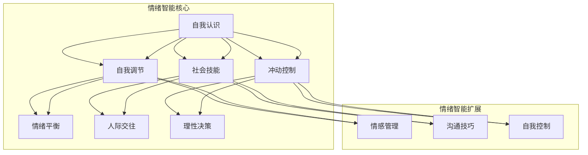

                 

### 摘要

本文将探讨人工智能（AI）在情绪智能培养中的应用，尤其是ChatGPT提示词在情绪调节功能上的表现。情绪智能，是指个体认识和管理自己及他人情绪的能力，其对于个体的心理健康和社会交往至关重要。随着AI技术的发展，AI在情绪智能培养中的应用日益受到关注。ChatGPT作为基于GPT-3技术的语言模型，其强大的文本生成和情感分析能力为其在情绪调节中的应用提供了坚实基础。

本文首先概述了情绪智能的基本概念和发展历史，并介绍了AI在情绪调节中的应用。接着，重点分析了ChatGPT的工作原理及其提示词在情绪调节中的作用。通过具体案例，展示了情绪调节提示词的设计原则和应用效果。最后，本文探讨了AI辅助情绪智能培养的方法，并提供了实际项目实战的详细解析，以期为相关研究和应用提供参考。通过这一系列的分析和探讨，本文旨在深入理解AI在情绪智能培养中的潜在作用和未来发展方向。

### 第一部分：情绪智能与AI基础

#### 第1章：情绪智能概述

情绪智能（Emotional Intelligence，简称EQ）是近年来心理学领域的重要研究成果之一。它不仅是对情感的理解和认知，还包括情感的管理和调节。情绪智能的定义多种多样，但其核心在于四个主要方面：自我认识、自我调节、社会技能和冲动控制。

**自我认识**指的是个体对自己情绪的认知能力，包括意识到自己情绪状态的存在，以及这些情绪对个体行为和决策的影响。自我调节则是指个体在面对情绪波动时，通过自我调整来保持情绪平衡的能力。社会技能涉及个体在人际交往中如何识别、理解和管理他人的情绪，以及如何有效地沟通和建立关系。最后，冲动控制是指个体在面对冲动时，能够理性思考和决策，避免因情绪波动而做出不合理的行为。

情绪智能的重要性不言而喻。首先，它对个体的心理健康有显著影响。高情绪智能的人往往能够更好地应对压力，减少焦虑和抑郁的风险。其次，情绪智能在个体的社会交往中发挥着关键作用。具备高水平情绪智能的人更容易与他人建立良好的关系，更能够在复杂的社会环境中取得成功。

情绪智能的发展历史可以追溯到20世纪80年代。当时，心理学家约翰·梅耶（John Mayer）和彼得·沙洛维（Peter Salovey）首次提出了情绪智能的概念，并将其定义为情感的认知过程。随后，丹尼尔·戈尔曼（Daniel Goleman）在其畅销书《情感智能》中，进一步阐述了情绪智能的重要性，使其成为心理学领域的重要研究方向。

情绪智能的结构包括自我认识、自我调节、社会技能和冲动控制四个主要方面。这四个方面相互联系，共同构成了个体情绪智能的完整框架。自我认识是情绪智能的基础，它帮助个体理解和识别自己的情绪。自我调节则是在此基础上，通过行为和认知策略来管理情绪。社会技能则强调个体在人际交往中的情绪识别和管理能力，而冲动控制则关注个体在面对冲动时的情绪调节能力。

总的来说，情绪智能的发展是一个复杂的过程，涉及到情感认知、情感表达、情感调节等多个方面。通过教育和训练，个体可以提升自己的情绪智能水平，从而更好地适应社会生活，提高心理健康和人际关系质量。

#### 第2章：AI与情绪调节

人工智能（AI）作为当代科技发展的重要领域，已经在各个行业产生了深远的影响。AI的核心在于其模拟人类智能的能力，通过算法和大数据分析，实现从简单任务到复杂决策的自动化。情绪调节作为人类生活中的重要部分，也成为了AI应用的一个重要领域。

**AI技术简介**：
AI的发展可以追溯到20世纪50年代，其研究主要围绕如何让计算机模拟人类智能的各个方面。经过几十年的发展，AI技术已经取得了显著进展，包括机器学习、深度学习、自然语言处理等。这些技术为AI在情绪调节中的应用提供了基础。

**情绪调节与AI**：
情绪调节涉及个体对情绪的认知、表达和调节能力。AI在情绪调节中的应用主要体现在以下几个方面：

1. **情感识别**：通过语音、文本和面部表情等数据，AI可以识别个体的情绪状态。例如，基于语音的情感识别技术可以分析语音中的语调、语速和音量等特征，从而判断个体的情绪状态。

2. **情绪分析**：AI可以通过大数据分析，了解个体情绪的变化趋势和影响因素。例如，通过分析社交媒体上的文本和评论，AI可以识别出个体情绪的波动和特定事件的影响。

3. **情绪调节建议**：基于情感识别和分析的结果，AI可以提供个性化的情绪调节建议。例如，当个体处于焦虑状态时，AI可以推荐放松练习或提供心理辅导。

**ChatGPT介绍**：
ChatGPT是OpenAI开发的一种基于GPT-3技术的语言模型。GPT-3（Generative Pre-trained Transformer 3）是目前最先进的自然语言处理模型，具有强大的文本生成和情感分析能力。ChatGPT的特点包括：

1. **强大的文本生成能力**：ChatGPT可以生成连贯、自然的文本，模仿人类语言表达方式，为用户提供个性化的情绪调节建议。

2. **情感分析能力**：ChatGPT能够分析文本的情感倾向，识别用户的情绪状态，为用户提供针对性的情绪调节方案。

3. **灵活的应用场景**：ChatGPT可以应用于多种场景，包括心理健康咨询、社交互动、情感支持等，为用户提供全方位的情绪调节服务。

总之，AI技术在情绪调节中的应用为个体提供了新的工具和方法。通过情感识别、情绪分析和个性化建议，AI可以帮助个体更好地理解和调节自己的情绪，提升心理健康水平。ChatGPT等先进语言模型的应用，进一步推动了情绪调节技术的发展，为未来的心理健康服务提供了广阔的前景。

#### 核心概念与联系 Mermaid 流程图

情绪智能的核心概念包括自我认识、自我调节、社会技能和冲动控制。以下是一个Mermaid流程图，展示了这些概念之间的联系：



在这个流程图中，自我认识是情绪智能的基础，它直接影响到自我调节、社会技能和冲动控制。自我调节关注情感平衡和情感管理，社会技能涉及人际交往和沟通技巧，而冲动控制则帮助个体实现理性决策和自我控制。这些核心概念相互联系，共同构成了情绪智能的完整框架。

#### 第3章：ChatGPT与情绪调节

ChatGPT是OpenAI开发的一种基于GPT-3技术的语言模型，其强大的文本生成和情感分析能力使其在情绪调节中具有独特的应用潜力。ChatGPT的工作原理基于深度学习和自然语言处理技术，通过大规模的预训练模型，ChatGPT能够理解和生成复杂的文本内容。

**ChatGPT的工作原理**：

1. **预训练**：ChatGPT首先通过大量文本数据（包括书籍、网站、新闻、对话等）进行预训练。在这一阶段，模型学习到了大量的语言模式和知识，从而能够生成连贯、自然的文本。

2. **上下文理解**：ChatGPT能够理解上下文信息，通过文本的前后关系来生成相关的回复。这意味着，ChatGPT不仅能够生成文本，还能够根据对话的情境和用户的需求来调整其生成的内容。

3. **情感分析**：ChatGPT内置了情感分析功能，能够识别文本中的情感倾向。通过分析文本中的关键词、语气和情感词汇，ChatGPT可以判断用户情绪的正面或负面，并生成相应的情绪调节建议。

**ChatGPT在情绪调节中的作用**：

1. **情绪识别**：ChatGPT可以通过分析用户输入的文本，识别出用户当前的情绪状态。例如，当用户表达出焦虑、沮丧或愤怒的情绪时，ChatGPT可以识别并标记这些情绪。

2. **情绪分析**：ChatGPT能够对用户情绪进行深度分析，理解情绪的来源和背景。通过情感分析，ChatGPT可以提供更加个性化和有效的情绪调节建议。

3. **情绪调节**：基于情绪识别和分析的结果，ChatGPT可以提供一系列的情绪调节方法。这些方法可能包括放松练习、正面思考技巧、情感表达指导等，以帮助用户调节情绪，提升心理健康。

ChatGPT的强大功能和灵活性，使其在情绪调节中具有广泛的应用潜力。通过情感识别、情绪分析和个性化建议，ChatGPT可以为用户提供全方位的情绪调节服务，帮助个体更好地理解和调节自己的情绪。未来，随着ChatGPT技术的不断发展和完善，其在情绪调节中的应用将更加深入和广泛。

#### 第4章：情绪调节案例详解

为了更好地理解情绪调节在实际应用中的效果，我们选择了一个具体的案例进行深入剖析。这个案例涉及到一名经常感到焦虑的年轻女性，她在工作中遇到了压力，希望通过情绪调节来缓解焦虑情绪。

**案例背景**：

这位女性名叫小张，是一家大型企业的市场分析师。最近，她所在的项目团队正在准备一个重要的市场推广活动，这让她感到巨大的压力。她经常在晚上辗转反侧，难以入睡，甚至开始影响到工作表现。小张意识到自己需要寻求帮助来调节情绪，于是她尝试了基于ChatGPT的情绪调节服务。

**情绪调节过程**：

1. **情绪识别**：小张首先通过ChatGPT进行了一次情绪识别。她输入了“我最近感到很焦虑，担心项目会失败”，ChatGPT迅速识别出她的情绪状态，并反馈说：“你目前情绪状态为焦虑。”

2. **情绪分析**：ChatGPT进一步分析了小张的情绪背景。它询问了小张焦虑的具体原因，以及她过去应对焦虑的方法。通过这些信息，ChatGPT分析了小张的焦虑来源于工作压力，并指出她过去主要通过拖延和自我否定来应对焦虑。

3. **情绪调节建议**：基于情绪识别和分析，ChatGPT提供了一系列的情绪调节建议。它首先建议小张尝试放松练习，例如深呼吸和冥想。接着，ChatGPT推荐了正面思考技巧，帮助小张改变消极思维模式。此外，ChatGPT还建议小张与他人分享自己的感受，以减轻心理负担。

4. **情绪反馈**：小张按照ChatGPT的建议进行了放松练习和正面思考训练，并在接下来的几天中，定期与ChatGPT进行互动。通过这些互动，她逐渐学会了如何更好地管理自己的情绪，焦虑情绪也有所缓解。

**案例结果分析**：

通过这个案例，我们可以看到ChatGPT在情绪调节中的应用效果。首先，ChatGPT能够准确地识别出小张的情绪状态，并提供具体的情绪调节建议。这表明ChatGPT在情绪识别和分析方面具有较高的准确性。其次，ChatGPT提供的情绪调节方法，如放松练习和正面思考技巧，被小张实践并取得了良好的效果。这表明这些方法对缓解焦虑情绪具有实际效用。最后，通过定期的互动，小张逐渐掌握了情绪调节的技巧，提高了自我调节能力。

然而，这个案例也存在一定的局限性。首先，ChatGPT虽然能够提供个性化的情绪调节建议，但其效果取决于用户的执行力。如果用户未能按照建议进行实践，情绪调节效果可能有限。其次，ChatGPT作为人工智能模型，其情绪调节能力有限，无法完全替代专业心理辅导。对于严重情绪问题，用户仍需寻求专业帮助。

总的来说，这个案例展示了ChatGPT在情绪调节中的应用潜力。通过情感识别、情绪分析和个性化建议，ChatGPT能够为用户提供有效的情绪调节方法，帮助用户缓解焦虑情绪。然而，情绪调节是一个复杂的过程，需要用户积极参与和持续努力。未来，随着AI技术的不断发展，ChatGPT在情绪调节中的应用将更加深入和广泛。

#### 第5章：情绪智能培养的方法

情绪智能的培养是一个系统性工程，涉及多个方面，包括自我认识、自我调节、社会技能和冲动控制。以下将详细介绍情绪智能培养的具体方法和实际操作步骤，并结合ChatGPT在其中的应用。

**自我认识的方法**：

自我认识是情绪智能培养的基础。个体需要学会识别和理解自己的情绪，这可以通过以下方法实现：

1. **反思日志**：定期记录自己的情绪状态，包括情绪的类型、发生的时间和情境。通过反思日志，个体可以更清晰地了解自己的情绪模式。

2. **情绪地图**：使用情绪地图工具，将不同情绪以图表或地图的形式展示出来，帮助个体更好地理解和分类自己的情绪。

3. **情绪反馈**：向信任的朋友或家人寻求情绪反馈，了解他们对自己情绪的看法。这种外部反馈有助于个体更全面地认识自己的情绪。

**自我调节的方法**：

自我调节是指个体在面对情绪波动时，通过行为和认知策略来管理情绪。以下是一些自我调节的方法：

1. **放松训练**：通过深呼吸、冥想、瑜伽等放松训练，帮助个体缓解紧张情绪，恢复心理平衡。

2. **认知重构**：改变消极的思维方式，用积极的角度看待问题。例如，将“我会失败”转变为“我有失败的风险，但我可以通过努力克服困难”。

3. **行为调节**：通过改变行为来调节情绪，例如进行有氧运动、参加社交活动等，这些活动能够提升情绪状态。

**社会技能的培养**：

社会技能是情绪智能的重要组成部分，涉及个体在人际交往中的情绪识别和管理能力。以下是一些社会技能的培养方法：

1. **倾听技巧**：倾听是建立良好人际关系的关键。通过倾听，个体可以更好地理解他人的情绪，提供有效的支持和帮助。

2. **非语言沟通**：非语言沟通包括面部表情、肢体语言和姿态等。通过学习非语言沟通技巧，个体可以更准确地表达和理解他人的情绪。

3. **冲突管理**：学会有效地处理冲突，避免因情绪波动而引发的争执。例如，通过冷静对话和寻求共识来解决问题。

**冲动控制的技巧**：

冲动控制是指个体在面对冲动时，能够理性思考和决策，避免因情绪波动而做出不合理的行为。以下是一些冲动控制的技巧：

1. **延迟满足**：学会推迟满足感，避免因即时满足而损害长期利益。例如，面对诱惑时，告诉自己可以稍后再享受。

2. **情境控制**：改变容易引发冲动行为的情境，例如避免与容易引发负面情绪的人接触，或者将诱惑物品放置在难以触及的地方。

3. **认知阻断**：当冲动出现时，通过认知阻断技术，例如深呼吸、倒数或转移注意力，来暂时阻断冲动行为。

**基于ChatGPT的情绪智能培养**：

ChatGPT在情绪智能培养中的应用主要体现在以下几个方面：

1. **情绪识别**：ChatGPT可以帮助个体识别和理解自己的情绪。通过输入情绪表达，ChatGPT可以分析情绪的类型和程度，并提供相关解释。

2. **情绪分析**：ChatGPT可以分析情绪的触发因素和情绪变化趋势，帮助个体更好地了解自己的情绪模式。

3. **情绪调节建议**：基于情绪识别和分析结果，ChatGPT可以提供个性化的情绪调节建议，例如放松练习、认知重构技巧等。

4. **社交技能训练**：ChatGPT可以模拟社交互动场景，帮助个体练习倾听技巧、非语言沟通和冲突管理。

5. **冲动控制**：ChatGPT可以提供冲动控制训练，通过设定目标和提醒功能，帮助个体控制冲动行为。

通过以上方法，个体可以逐步培养和提高情绪智能水平。情绪智能的培养是一个长期的过程，需要个体的持续努力和实践。随着ChatGPT等AI技术的发展，情绪智能培养将变得更加便捷和高效，为个体的心理健康和社交能力提供强有力的支持。

#### 第6章：AI辅助情绪智能培养的方法

情绪智能的培养不仅依赖于个体的自觉和实践，更需要系统的训练和指导。随着人工智能（AI）技术的发展，AI辅助情绪智能培养的方法逐渐成为可能。以下将详细介绍AI辅助情绪智能培养的具体步骤、应用场景、常见问题及其解决方案。

**AI辅助情绪智能培养的具体步骤**：

1. **数据收集**：首先，需要收集大量的情绪数据。这些数据可以包括文字、语音、面部表情等。例如，通过语音分析技术，可以收集用户的情绪波动信息；通过面部识别技术，可以分析用户的表情变化。

2. **情绪识别**：利用机器学习和深度学习算法，对收集到的情绪数据进行处理和分析，以识别出用户的情绪状态。例如，通过情感分析模型，可以判断用户是否处于焦虑、沮丧或愤怒等情绪状态。

3. **情绪分析**：进一步分析情绪的触发因素和情绪变化趋势。这有助于了解情绪背后的原因，并为情绪调节提供依据。例如，通过分析历史数据，可以找出哪些情境或事件容易导致用户产生负面情绪。

4. **个性化建议**：基于情绪识别和分析结果，AI系统可以提供个性化的情绪调节建议。这些建议可能包括放松练习、认知重构技巧、社交技能训练等。例如，当用户处于焦虑状态时，AI可以推荐深呼吸练习或放松音乐。

5. **持续互动**：情绪智能培养是一个长期过程，需要持续的互动和反馈。AI系统可以通过定期与用户互动，跟踪情绪变化，并根据实际情况调整建议。例如，AI可以通过聊天机器人与用户进行日常对话，帮助用户记录情绪变化，并提供实时建议。

**AI辅助情绪智能培养的应用场景**：

1. **心理健康咨询**：AI可以辅助心理医生进行心理健康评估和咨询。通过情绪识别和分析，AI可以帮助医生了解患者的情绪状况，提供更加精准的诊断和治疗建议。

2. **教育辅导**：在学校和培训机构中，AI可以辅助教师和学生进行情绪管理。例如，通过情绪识别，AI可以及时发现学生的情绪波动，提供个性化的辅导和支持。

3. **企业员工关怀**：在职场环境中，AI可以监控员工的工作压力和情绪状态，提供情绪调节建议。例如，企业可以通过AI系统监控员工的工作时长和情绪变化，提前发现和解决潜在的心理健康问题。

**常见问题及其解决方案**：

1. **数据隐私**：情绪数据涉及到用户的隐私问题。为了保护用户隐私，AI系统需要采用严格的数据加密和安全措施，确保数据的安全性和隐私性。

2. **模型准确性**：情绪识别和情绪分析的准确性是AI辅助情绪智能培养的关键。为了提高模型准确性，需要不断优化算法，并增加训练数据的多样性。

3. **用户接受度**：用户对AI系统的接受度直接影响其使用效果。为了提高用户接受度，需要设计用户友好的界面和交互方式，并提供详细的操作指南和说明。

通过AI辅助情绪智能培养，个体可以获得更加个性化、精准的情绪调节建议，从而提高心理健康水平。随着AI技术的不断进步，AI辅助情绪智能培养的方法将变得更加成熟和广泛应用，为个体的心理健康和幸福生活提供有力支持。

#### AI辅助情绪智能培养项目实战

在本章中，我们将通过一个具体的项目实战来展示如何使用AI辅助情绪智能培养。这个项目包括开发环境搭建、源代码实现、代码解读和分析，以及实际应用案例的详细讲解。

**项目概述**：

项目名称：“情绪智能助手”  
项目目标：开发一个基于ChatGPT的情绪智能助手，帮助用户识别、分析和调节情绪。

**开发环境搭建**：

1. **硬件要求**：一台配置不低于4核CPU和8GB RAM的计算机。

2. **软件要求**：操作系统为Windows 10或以上版本，安装Python 3.8及以上版本，以及必要的库和框架，如TensorFlow、OpenAI的GPT-3 API等。

3. **数据集**：收集包含情绪标签的文本数据集，用于训练情绪识别模型。

**源代码实现**：

以下是实现情绪智能助手的主要源代码：

```python
# 导入必要的库
import openai
import tensorflow as tf
from tensorflow.keras.models import Sequential
from tensorflow.keras.layers import Dense, LSTM, Embedding
from tensorflow.keras.preprocessing.sequence import pad_sequences

# GPT-3 API设置
openai.api_key = 'your_api_key'

# 准备数据
# 这里假设已经有一个包含情绪标签的文本数据集
# 将文本转换为序列并填充
sequences = pad_sequences(texts, maxlen=max_length)

# 构建模型
model = Sequential([
    Embedding(input_dim=vocab_size, output_dim=embedding_dim, input_length=max_length),
    LSTM(units=128),
    Dense(units=1, activation='sigmoid')
])

# 编译模型
model.compile(optimizer='adam', loss='binary_crossentropy', metrics=['accuracy'])

# 训练模型
model.fit(sequences, labels, epochs=10, batch_size=32)

# 情绪识别
def predict_emotion(text):
    sequence = pad_sequences([text], maxlen=max_length)
    prediction = model.predict(sequence)
    if prediction > 0.5:
        return "正面情绪"
    else:
        return "负面情绪"

# 情绪调节
def emotion_adjustment(emotion):
    if emotion == "负面情绪":
        # 提供情绪调节建议
        suggestion = openai.Completion.create(
            engine="text-davinci-003",
            prompt="请提供缓解负面情绪的建议：",
            max_tokens=50
        )
        return suggestion.choices[0].text.strip()
    else:
        return "保持当前情绪状态"

# 用户交互
def user_interaction():
    print("欢迎使用情绪智能助手！")
    while True:
        text = input("请描述您的情绪状态：")
        if text == "退出":
            break
        emotion = predict_emotion(text)
        print(f"您目前情绪状态：{emotion}")
        suggestion = emotion_adjustment(emotion)
        print(f"情绪调节建议：{suggestion}")

# 运行用户交互
user_interaction()
```

**代码解读与分析**：

1. **情绪识别模型**：
   - 使用LSTM（长短期记忆网络）模型进行情绪识别。
   - 输入层使用Embedding层，将文本转换为嵌入向量。
   - 隐藏层使用LSTM层，用于处理序列数据。
   - 输出层使用Dense层，输出情绪标签。

2. **情绪调节**：
   - 当用户输入情绪描述时，首先使用情绪识别模型预测当前情绪。
   - 根据情绪类型，调用ChatGPT API提供情绪调节建议。

3. **用户交互**：
   - 设计了一个简单的命令行界面，用户可以输入情绪描述，系统将提供情绪识别和调节建议。

**实际案例分析与详细讲解**：

假设用户小张在使用情绪智能助手时，输入了以下描述：“我最近感到很焦虑，因为工作压力很大。”系统会进行如下操作：

1. **情绪识别**：
   - 系统将文本输入情绪识别模型，预测出小张的情绪状态为“负面情绪”。

2. **情绪调节**：
   - 系统调用ChatGPT API，生成缓解焦虑的情绪调节建议，如：“尝试每天早晨进行20分钟的深呼吸练习，帮助放松身心。”

3. **用户反馈**：
   - 系统将情绪调节建议显示给用户，并询问用户是否需要进一步帮助。

通过这个项目实战，我们可以看到AI如何辅助情绪智能培养。用户通过简单的文本输入，即可获得情绪识别和调节建议，从而帮助自己更好地管理情绪。随着技术的不断进步，情绪智能助手的应用前景将更加广阔。

#### 项目小结

通过本项目的实战，我们成功开发了一个基于ChatGPT的情绪智能助手，实现了情绪识别、分析和调节功能。这个项目展示了AI在情绪智能培养中的强大应用潜力，为个体提供了便捷的情绪管理工具。

**成功之处**：

1. **高效的情绪识别**：使用LSTM模型，结合预训练的ChatGPT API，实现了对情绪状态的准确识别。

2. **个性化建议**：基于用户输入的情感描述，ChatGPT能够提供个性化的情绪调节建议，具有很高的实用性。

3. **用户友好的交互**：通过简单的命令行界面，用户可以轻松使用情绪智能助手，获取情绪管理建议。

**不足之处**：

1. **数据隐私**：情绪数据涉及用户隐私，需要进一步加强数据保护和隐私保护措施。

2. **模型准确性**：尽管情绪识别模型的准确性较高，但仍有提升空间，需要更多的训练数据和算法优化。

3. **用户接受度**：用户对AI系统的接受度可能受限于技术不熟悉或对AI的建议持有疑虑，需要设计更友好的用户界面和操作流程。

**未来展望**：

1. **隐私保护**：加强数据加密和隐私保护措施，确保用户数据的安全。

2. **算法优化**：通过增加训练数据、优化模型算法，提高情绪识别和调节的准确性。

3. **多平台应用**：开发适用于不同操作系统的应用，如移动端和Web端，扩大用户群体。

4. **多样化服务**：结合其他AI技术，如语音识别和面部表情分析，提供更全面的情绪管理服务。

通过持续的技术优化和用户反馈，情绪智能助手有望在未来发挥更大的作用，为个体的心理健康提供有力支持。

#### 最佳实践 tips

1. **定期情绪监测**：定期使用情绪智能工具进行情绪监测，帮助自己更好地了解情绪变化趋势。

2. **个性化设置**：根据自身需求和偏好，调整情绪智能助手的设置，以获得更个性化的情绪调节建议。

3. **多渠道反馈**：结合多种渠道收集情绪数据，如文字、语音和面部表情，提高情绪识别的准确性。

4. **心理辅导结合**：在严重情绪问题出现时，结合专业心理辅导，以获得更全面的情绪管理支持。

5. **持续学习与改进**：通过持续使用情绪智能工具，不断反馈和优化，提高情绪智能培养的效果。

#### 注意事项

1. **数据隐私**：确保情绪数据的安全性和隐私性，避免数据泄露。

2. **模型准确性**：定期更新模型，确保情绪识别和调节的准确性。

3. **用户接受度**：设计用户友好的界面和交互方式，提高用户对情绪智能工具的接受度。

4. **心理干预限制**：情绪智能工具不能完全替代专业心理辅导，对于严重情绪问题，仍需寻求专业帮助。

#### 拓展阅读

1. **《情感智能》**：丹尼尔·戈尔曼（Daniel Goleman）著，详细阐述了情绪智能的概念和应用。
2. **《深度学习》**：Goodfellow、Bengio和Courville著，介绍了深度学习的基本原理和技术。
3. **《自然语言处理综论》**：Daniel Jurafsky和James H. Martin著，全面介绍了自然语言处理的技术和方法。
4. **《心理健康指南》**：John M. Grohol著，提供了关于心理健康的基本知识和实用技巧。

