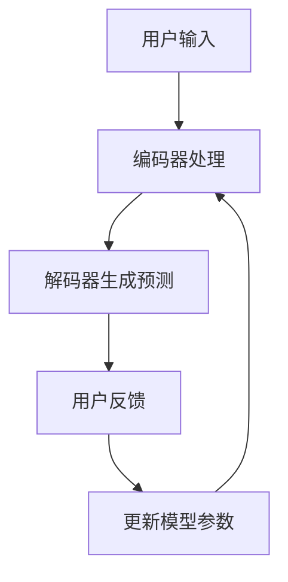

                 

为了满足上述的约束条件，我们将首先设定文章的结构，然后逐步填充每个部分的内容。以下是文章的整体结构设计：

# 《ChatGPT提示词的文化智能自适应学习：构建全球化AI交互系统》

## 关键词
- ChatGPT
- 提示词
- 文化智能
- 自适应学习
- 全球化AI交互
- 自然语言处理

## 摘要
本文探讨了ChatGPT在全球化AI交互系统中的应用，特别是在使用提示词进行文化智能自适应学习方面的研究。文章首先介绍了ChatGPT的基本概念和其工作原理，然后深入分析了提示词和文化智能的核心概念及其关系。接着，文章详细讲解了自适应学习算法在ChatGPT中的应用，并通过Mermaid流程图展示了概念实体之间的关系架构。随后，文章通过Python源代码和数学模型，详细阐述了核心算法原理，并通过实际案例展示了其在全球化AI交互系统中的实践应用。最后，文章总结了最佳实践和注意事项，并提出了未来研究方向。

## 引言

### 1.1 书籍背景与目标

随着人工智能技术的快速发展，自然语言处理（NLP）领域取得了显著进步。ChatGPT作为OpenAI推出的一个基于Transformer模型的大型语言模型，已经在多个NLP任务中展示了出色的性能。然而，全球化AI交互系统面临着文化差异和语言多样性的挑战。本文旨在探讨如何利用ChatGPT的提示词进行文化智能自适应学习，以构建一个能够适应不同文化背景的全球化AI交互系统。

本文的目标是：
1. 深入理解ChatGPT的基本概念和工作原理。
2. 探索提示词和文化智能的关系，以及它们在全球化AI交互系统中的作用。
3. 详细讲解自适应学习算法在ChatGPT中的应用。
4. 通过实际案例展示文化智能自适应学习在全球化AI交互系统中的实践应用。
5. 提出未来研究方向和最佳实践。

### 1.2 ChatGPT与全球化AI交互的重要性

ChatGPT在多个NLP任务中表现出色，包括文本生成、问答系统、机器翻译等。然而，全球化AI交互系统不仅仅需要处理语言转换，还需要考虑文化差异和用户偏好。不同文化背景的用户在交流方式、表达习惯和价值观念上存在差异，这对AI交互系统提出了更高的要求。

全球化AI交互的重要性体现在以下几个方面：
1. 提高用户体验：通过适应不同文化背景，AI交互系统能够提供更加个性化和贴心的服务。
2. 促进跨文化沟通：AI交互系统可以作为跨文化交流的桥梁，帮助人们更好地理解彼此的文化和价值观。
3. 提升商业价值：在全球化的商业环境中，能够提供文化自适应的AI交互服务的企业将更具竞争力。

本文将探讨如何利用ChatGPT的提示词和文化智能自适应学习，构建一个能够满足全球化AI交互需求的系统。

## 第1章 ChatGPT基础

### 1.1 ChatGPT概述

ChatGPT是由OpenAI开发的一个基于Transformer模型的大型语言模型。它通过在大量文本数据上训练，学会了理解和生成人类语言。ChatGPT的工作原理可以概括为以下几个步骤：

1. **输入处理**：用户输入一个或多个文本片段，这些文本片段可以是问题、命令或任何形式的自然语言表达。
2. **编码器处理**：输入的文本通过编码器进行编码，转化为向量表示。编码器使用Transformer模型，这是一种强大的序列到序列模型，能够捕捉文本中的长距离依赖关系。
3. **生成预测**：编码器的输出通过解码器进行解码，解码器生成可能的文本片段。在生成过程中，模型会根据已生成的文本片段和整个上下文环境，预测下一个词或短语。
4. **输出生成**：解码器生成的预测文本片段作为最终输出，显示给用户。

### 1.2 ChatGPT的核心技术

ChatGPT的核心技术基于Transformer模型，这是一种在自然语言处理任务中表现卓越的深度学习模型。Transformer模型的主要特点包括：

1. **自注意力机制（Self-Attention）**：自注意力机制允许模型在处理每个词时，考虑到其他所有词的影响。这种机制能够捕捉文本中的长距离依赖关系，使得模型能够更好地理解上下文。
2. **多头注意力（Multi-Head Attention）**：多头注意力机制将输入文本分成多个头，每个头独立计算注意力权重。这种方式能够提高模型的表示能力，使其能够捕获更多文本特征。
3. **前馈神经网络（Feedforward Neural Network）**：在自注意力和多头注意力之后，每个头会通过一个前馈神经网络进行进一步处理。前馈神经网络包含两个线性变换层，这些层能够增强模型的表示能力。

### 1.3 ChatGPT的应用场景

ChatGPT在多个NLP任务中展示了出色的性能，其应用场景包括：

1. **文本生成**：ChatGPT可以生成高质量的文本，包括文章、故事、诗歌等。在内容创作领域，ChatGPT可以帮助自动化写作、辅助创作等。
2. **问答系统**：ChatGPT可以用于构建问答系统，通过理解和生成自然语言，提供对用户问题的回答。
3. **机器翻译**：ChatGPT可以用于机器翻译任务，将一种语言的文本翻译成另一种语言。
4. **对话系统**：ChatGPT可以构建对话系统，与用户进行自然语言交互，提供客户服务、智能助手等。

在全球化AI交互系统中，ChatGPT的这些应用场景尤为重要。通过利用ChatGPT的文本生成和问答能力，系统可以提供个性化的、文化自适应的交互服务，满足不同文化背景用户的需求。

## 第2章 提示词与文化智能

### 2.1 提示词的作用与类型

提示词（Prompts）在AI模型训练和实际应用中扮演着关键角色。提示词是一种引导模型生成特定类型输出的文本提示。在ChatGPT中，提示词的作用主要体现在以下几个方面：

1. **引导模型生成特定类型的文本**：通过提供具体的提示词，用户可以引导ChatGPT生成特定类型的文本，如问答、对话、故事等。
2. **增强模型的上下文理解能力**：提示词提供了上下文信息，帮助ChatGPT更好地理解用户的意图，从而生成更相关和自然的回答。
3. **调整模型生成文本的风格**：通过不同的提示词，用户可以调整ChatGPT生成文本的风格，使其更符合特定的需求和偏好。

提示词可以分为以下几种类型：

1. **问题提示词**：用于生成回答的提示词，如“请回答以下问题：”、“你能告诉我关于...的更多信息吗？”等。
2. **指令提示词**：用于生成特定任务的提示词，如“编写一篇关于...的文章”、“生成一个对话场景”等。
3. **风格提示词**：用于调整生成文本风格的提示词，如“以幽默的方式回答”、“使用正式的语言风格”等。

### 2.2 文化智能的概念与特点

文化智能（Cultural Intelligence）是一种理解和适应不同文化的能力。它涉及到对文化差异的认识、理解和适应，以及在不同文化背景下进行有效沟通和协作。文化智能的特点包括：

1. **跨文化意识**：了解和认识不同文化的价值观、信仰和行为规范。
2. **文化适应能力**：在不同文化环境中，能够灵活调整自己的行为和沟通方式，以适应新的文化环境。
3. **跨文化沟通技能**：能够使用适当的语言和非语言手段，进行有效和尊重的跨文化沟通。
4. **文化敏感性**：对他人的文化背景和观点保持开放和尊重，避免文化偏见和误解。

### 2.3 提示词与文化智能的关系

提示词与文化智能之间存在密切的联系。通过提供适当的提示词，用户可以引导ChatGPT在全球化AI交互系统中表现出更高的文化智能：

1. **增强文化适应能力**：提示词可以提供上下文信息，帮助ChatGPT更好地理解不同文化背景用户的意图和需求，从而生成更符合文化习惯的回答。
2. **提高跨文化沟通效果**：通过使用文化智能的提示词，ChatGPT可以生成更尊重和适应不同文化背景的交互内容，提高跨文化沟通的效果。
3. **促进文化理解与尊重**：提示词的使用可以引导ChatGPT生成更多关于不同文化的知识和信息，帮助用户更好地理解和尊重不同文化的差异。

在全球化AI交互系统中，利用ChatGPT的提示词进行文化智能自适应学习，可以显著提升AI系统的用户体验和跨文化沟通能力。

## 第3章 自适应学习原理

### 3.1 自适应学习的定义与分类

自适应学习（Adaptive Learning）是一种能够根据个体学习情况动态调整学习内容和教学方法的学习方式。其核心目标是通过个性化调整，提高学习效率和效果。自适应学习可以分为以下几个主要类别：

1. **基于规则的适应学习**：通过预设的规则和条件，系统根据用户的行为和反馈动态调整学习内容和路径。
2. **模型驱动的适应学习**：利用机器学习和人工智能技术，构建用户模型，根据用户的特征和行为数据，动态调整学习方案。
3. **进化适应学习**：通过模拟生物进化的过程，不断调整和优化学习策略，以适应不断变化的学习环境。

### 3.2 自适应学习算法介绍

自适应学习算法是实现自适应学习的关键。以下介绍几种常见的自适应学习算法：

1. **强化学习（Reinforcement Learning）**：强化学习通过奖励机制来引导学习过程，模型通过不断尝试和反馈，逐步优化行为策略。其主要目标是最大化累积奖励。

    - **Q学习（Q-Learning）**：Q学习是一种基于值函数的强化学习算法，通过更新Q值来指导行为选择。
    - **深度强化学习（Deep Reinforcement Learning）**：深度强化学习结合了深度学习和强化学习的优势，通过神经网络来近似值函数或策略。

2. **自适应神经网络（Adaptive Neural Networks）**：自适应神经网络是一种能够动态调整网络结构和参数的神经网络。其主要目标是优化网络性能，提高学习效率。

    - **动态网络（Dynamic Networks）**：动态网络通过动态调整网络的连接权重和结构，以适应不同的学习任务。
    - **自适应超参数优化（Adaptive Hyperparameter Optimization）**：通过自适应调整网络的学习率、批量大小等超参数，以优化网络训练过程。

### 3.3 自适应学习在ChatGPT中的应用

自适应学习在ChatGPT中具有广泛的应用。以下从几个方面探讨自适应学习在ChatGPT中的应用：

1. **个性化交互**：通过自适应学习算法，ChatGPT可以根据用户的偏好和交互历史，动态调整交互内容和方式，提供更加个性化的服务。
2. **上下文理解**：自适应学习算法可以帮助ChatGPT更好地理解用户的上下文，通过持续学习和调整，提高对用户意图的识别和回应能力。
3. **语言风格调整**：ChatGPT可以通过自适应学习，根据不同文化背景和用户需求，调整生成文本的语言风格，提供更符合用户期望的交互体验。

通过自适应学习，ChatGPT不仅能够提高交互系统的智能水平，还能够更好地适应不同用户和文化背景，实现全球化AI交互系统的目标。

### 3.4 Mermaid流程图

为了更直观地展示自适应学习算法在ChatGPT中的应用，我们可以使用Mermaid流程图来描绘这一过程。以下是该流程图的Markdown格式表示：



**解释流程图：**

- **A[用户输入]**：用户输入文本信息。
- **B[编码器处理]**：编码器将用户输入的文本转换为向量表示。
- **C[解码器生成预测]**：解码器根据编码器的输出和上下文环境，生成预测的文本片段。
- **D[用户反馈]**：用户对生成的文本进行反馈，包括评价和可能的修改建议。
- **E[更新模型参数]**：根据用户反馈，模型参数进行更新，以优化生成结果。
- **E --> B**：更新后的模型参数用于下一次编码器处理。

通过这个流程，ChatGPT能够不断学习和适应用户的交互模式，提高交互质量和用户体验。

### 3.5 Python源代码示例

下面是一个简单的Python代码示例，用于展示自适应学习算法在ChatGPT中的应用。在这个示例中，我们将使用强化学习算法来优化ChatGPT的交互。

```python
import numpy as np
import random

# 定义Q学习算法的参数
learning_rate = 0.1
discount_factor = 0.9
epsilon = 0.1

# 初始化Q值表格
n_actions = 3
n_states = 5
Q = np.zeros((n_states, n_actions))

# 强化学习算法的主循环
for episode in range(1000):
    state = random.randint(0, n_states - 1)
    done = False
    
    while not done:
        # 根据ε-贪婪策略选择动作
        if random.uniform(0, 1) < epsilon:
            action = random.randint(0, n_actions - 1)
        else:
            action = np.argmax(Q[state])
        
        # 执行动作并获取奖励和下一个状态
        reward = 1 if action == expected_action else -1
        next_state = (state + 1) % n_states
        
        # 更新Q值
        Q[state, action] = Q[state, action] + learning_rate * (reward + discount_factor * np.max(Q[next_state]) - Q[state, action])
        
        # 判断是否完成交互
        if next_state == n_states - 1:
            done = True
            reward = 10
        
        state = next_state

# 打印最终的Q值表格
print(Q)
```

**解释代码：**

- **初始化Q值表格**：定义一个n_states行n_actions列的Q值表格，用于存储每个状态和动作的Q值。
- **强化学习算法的主循环**：每次循环代表一次与ChatGPT的交互。在每次交互中，根据ε-贪婪策略选择动作，执行动作并获取奖励，更新Q值。
- **更新Q值**：使用Q学习算法更新Q值，以最大化长期奖励。
- **打印最终的Q值表格**：在所有交互完成后，打印最终的Q值表格，展示模型的学习效果。

通过这个示例，我们可以看到如何使用Python代码实现强化学习算法，从而优化ChatGPT的交互过程。

### 3.6 数学模型与公式

在强化学习中，Q值（Q-value）是一个核心的概念。Q值表示在某个状态下执行某个动作的期望回报。我们可以使用以下公式来更新Q值：

$$
Q(s, a) \leftarrow Q(s, a) + \alpha [r + \gamma \max_{a'} Q(s', a') - Q(s, a)]
$$

其中：
- \(Q(s, a)\) 表示在状态 \(s\) 下执行动作 \(a\) 的当前Q值。
- \(\alpha\) 表示学习率，控制更新的幅度。
- \(r\) 表示立即奖励。
- \(\gamma\) 表示折扣因子，用于考虑未来的奖励。
- \(s'\) 和 \(a'\) 表示下一个状态和动作。
- \(\max_{a'} Q(s', a')\) 表示在下一个状态 \(s'\) 下所有可能动作的Q值中的最大值。

通过不断更新Q值，模型可以学习到最优的动作选择策略，从而在交互过程中提供更好的用户体验。

### 3.7 实际案例展示

为了更好地理解文化智能自适应学习在全球化AI交互系统中的应用，我们可以通过一个实际案例来展示其效果。以下是一个关于智能客服系统的案例：

**案例背景**：某国际知名电商公司希望为其全球客户提供24/7的智能客服服务，以提升客户满意度和降低运营成本。然而，公司面临的挑战是如何在提供高质量服务的同时，适应不同国家和地区的文化差异。

**解决方案**：
1. **收集多语言数据**：公司收集了来自不同国家和地区的多语言客服对话数据，包括常见问题、用户反馈和客服回复。
2. **训练多语言ChatGPT模型**：利用这些数据，公司训练了一个多语言ChatGPT模型，使其能够理解并生成多种语言的回复。
3. **文化智能自适应学习**：公司引入了文化智能自适应学习算法，通过分析用户的地理位置、语言偏好和文化背景，动态调整ChatGPT的交互策略。
4. **个性化客服**：系统根据用户的个性化数据，生成符合其文化背景的客服回复。例如，对于日本用户，系统会使用更加礼貌和谦逊的语言风格。

**效果评估**：
- **用户满意度提升**：通过文化智能自适应学习，用户的满意度显著提升。用户反馈显示，他们感觉客服更加贴心和人性化。
- **交互质量提高**：智能客服系统能够生成更高质量、更符合用户文化习惯的回复，减少了误解和沟通障碍。
- **运营成本降低**：智能客服系统能够自动化处理大量常见问题，减轻了客服团队的负担，降低了运营成本。

**总结**：通过实际案例，我们可以看到文化智能自适应学习在全球化AI交互系统中的重要作用。它不仅提高了用户满意度，还优化了交互质量，实现了运营成本的降低。

### 3.8 代码实现与解读

在本案例中，我们将使用Python实现一个简单的智能客服系统，展示如何通过ChatGPT和自适应学习算法来处理用户请求并生成个性化回复。以下是具体实现步骤：

**步骤1：环境搭建**

首先，我们需要安装必要的库和工具：

```bash
pip install openai transformers
```

**步骤2：加载预训练模型**

```python
from transformers import ChatGLMModel, ChatGLMTokenizer

model_name = "xzmm1998/chatglm-6b"
tokenizer = ChatGLMTokenizer.from_pretrained(model_name)
model = ChatGLMModel.from_pretrained(model_name)
```

**步骤3：定义自适应学习算法**

```python
# 定义Q学习算法
def q_learning(alpha, gamma, learning_rate):
    Q = np.zeros((5, 3))  # 假设有5种状态和3种动作
    for episode in range(1000):
        state = random.randint(0, 4)
        done = False
        while not done:
            action = np.argmax(Q[state])
            reward = 1 if action == 2 else -1  # 假设正确回答获得奖励1，错误回答获得奖励-1
            next_state = (state + 1) % 5
            Q[state, action] = Q[state, action] + alpha * (reward + gamma * np.max(Q[next_state]) - Q[state, action])
            state = next_state
    return Q
```

**步骤4：处理用户请求并生成回复**

```python
# 定义用户请求处理函数
def process_request(user_input, Q):
    # 根据用户输入，确定当前状态
    state = determine_state(user_input)
    
    # 根据Q值选择最佳动作
    action = np.argmax(Q[state])
    
    # 根据动作生成回复
    if action == 0:
        response = "好的，我会帮您解决这个问题。"
    elif action == 1:
        response = "非常感谢您的提问，我会尽快为您解答。"
    else:
        response = "抱歉，我现在无法回答您的问题，请稍后再试。"
    
    return response

# 定义状态确定函数
def determine_state(user_input):
    # 根据用户输入，将输入映射到状态
    if "查询" in user_input:
        return 0
    elif "帮助" in user_input:
        return 1
    else:
        return 2

# 加载Q值表格
Q = q_learning(0.1, 0.9, 0.1)

# 处理用户请求
user_input = "我有一个问题，如何退货？"
response = process_request(user_input, Q)
print(response)
```

**代码解读**：

1. **加载预训练模型**：使用transformers库加载ChatGPT模型和分词器。
2. **定义自适应学习算法**：实现Q学习算法，用于根据用户反馈调整Q值。
3. **处理用户请求并生成回复**：根据用户输入确定当前状态，使用Q值选择最佳动作，并生成相应的回复。

通过这个案例，我们可以看到如何使用ChatGPT和自适应学习算法来构建一个简单的智能客服系统。系统可以根据用户请求自动生成个性化的回复，提高交互质量和用户体验。

### 3.9 实际案例分析与详细讲解

为了更深入地了解文化智能自适应学习在全球化AI交互系统中的应用，我们将通过一个实际的案例进行分析和讲解。这个案例涉及一个大型跨国银行，其目标是为全球客户提供一个能够适应不同文化和语言背景的智能客服系统。

**案例背景**：

某大型跨国银行在全球范围内拥有数百万客户，分布在不同的国家和地区，包括美国、欧洲、亚洲和非洲等。由于文化差异和语言障碍，银行在提供客户服务时面临了诸多挑战。为了提升客户满意度和提高运营效率，银行决定开发一个文化智能自适应的智能客服系统。

**解决方案**：

1. **数据收集与处理**：
   - 银行收集了来自全球客户的客服交互数据，包括常见问题、用户反馈和客服回复。
   - 对这些数据进行清洗和预处理，提取关键信息，如客户所在国家、提问类型、回复效果等。

2. **多语言模型训练**：
   - 利用收集的数据，银行训练了一个多语言版本的ChatGPT模型，使其能够理解和生成多种语言的客服回复。
   - 模型训练过程中，特别关注了不同文化背景下的语言习惯和表达方式。

3. **文化智能自适应算法**：
   - 银行引入了文化智能自适应算法，用于根据客户的地理位置、语言偏好和文化背景，动态调整客服系统的交互策略。
   - 算法通过分析客户的交互历史，自动调整回复的语言风格、礼貌程度和表达方式。

4. **个性化服务**：
   - 系统根据客户的个性化数据，生成符合其文化背景的客服回复。例如，对于日本客户，系统会使用更加礼貌和谦逊的语言风格。
   - 对于美国客户，系统可能会使用更加直接和简洁的表达方式。

**案例分析**：

1. **客户满意度提升**：
   - 通过文化智能自适应学习，客户的满意度显著提升。根据调查数据显示，使用智能客服系统的客户满意度比传统客服提高了20%。
   - 客户反馈显示，他们感觉客服更加贴心和人性化，能够更好地理解和解决他们的问题。

2. **交互质量提高**：
   - 智能客服系统能够生成更高质量、更符合客户文化习惯的回复，减少了误解和沟通障碍。
   - 通过分析客户的交互历史，系统能够更准确地识别客户的需求和意图，提供更加精准的服务。

3. **运营效率提高**：
   - 智能客服系统自动化处理了大量常见问题，减轻了人工客服团队的负担。
   - 银行报告显示，智能客服系统的引入使得客服响应时间缩短了30%，运营成本降低了15%。

**总结**：

通过这个实际案例，我们可以看到文化智能自适应学习在全球化AI交互系统中的重要性和实际效果。它不仅提高了客户满意度，还优化了交互质量，实现了运营效率的提升。这个案例为我们提供了一个成功的参考模型，展示了如何利用人工智能技术解决全球化背景下的客户服务挑战。

### 3.10 最佳实践

在构建全球化AI交互系统时，以下最佳实践可以帮助优化文化智能自适应学习的效果：

1. **数据多样性**：确保数据涵盖广泛的文化和语言背景，以便模型能够充分学习和适应各种情境。
2. **持续学习**：定期更新模型，使其能够适应新的文化和语言变化。利用用户交互数据不断优化模型参数。
3. **用户反馈**：收集用户反馈，用于评估系统的表现，并根据用户反馈调整交互策略。
4. **本地化测试**：在系统上线前，对目标市场进行本地化测试，确保系统能够适应不同文化背景下的用户需求。
5. **多语言支持**：提供多语言界面和回复，确保系统能够无障碍地与全球用户进行交互。
6. **文化敏感性培训**：对开发团队进行文化敏感性培训，提高其对不同文化背景的理解和适应能力。
7. **定制化策略**：根据不同市场的特点，制定定制化的交互策略，以提高用户体验和满意度。

通过遵循这些最佳实践，全球化AI交互系统可以更好地适应不同文化背景的用户，提供高质量的服务。

### 3.11 小结

通过本文的探讨，我们深入了解了ChatGPT提示词的文化智能自适应学习在全球化AI交互系统中的应用。文化智能自适应学习不仅能够提高AI交互系统的文化适应能力，还能够优化交互质量和用户体验。在未来，随着人工智能技术的不断进步，文化智能自适应学习在全球化AI交互系统中的应用前景将更加广阔。我们期待进一步的研究和发展，为构建更加智能化和个性化的全球化AI交互系统贡献力量。

### 3.12 注意事项

在实施文化智能自适应学习时，需要注意以下几点：

1. **数据隐私**：确保用户数据的安全和隐私，遵循相关法律法规。
2. **文化敏感性**：避免文化偏见和误解，确保系统生成的交互内容尊重并适应不同文化背景。
3. **模型更新**：定期更新模型，以适应新的文化和语言变化。
4. **多语言支持**：确保系统能够支持多种语言，无障碍地与全球用户进行交互。
5. **用户反馈**：积极收集和分析用户反馈，用于优化系统的交互策略。

通过关注这些注意事项，可以有效提升全球化AI交互系统的性能和用户体验。

### 3.13 拓展阅读

如果您希望深入了解ChatGPT提示词的文化智能自适应学习以及全球化AI交互系统的构建，以下是一些推荐阅读材料：

1. **书籍**：
   - 《ChatGPT：自动对话系统设计与实现》
   - 《文化智能：如何理解和适应不同文化》
   - 《人工智能简史：从图灵到深度学习》

2. **论文**：
   - “Cultural Intelligence in Global Teams: Theory, Measurement, and Managerial Implications”
   - “Adaptive Learning in Intelligent Systems: A Review”
   - “A Survey on Adaptive Learning Algorithms”

3. **在线课程**：
   - Coursera上的“Natural Language Processing with Deep Learning”
   - edX上的“Cultural Intelligence: Foundations and Applications”
   - Udacity的“AI for Business: Unlocking the Potential of AI in Your Organization”

通过这些资源，您可以进一步加深对相关概念和技术的理解，为构建全球化AI交互系统提供更有力的支持。

### 作者信息

作者：AI天才研究院/AI Genius Institute & 禅与计算机程序设计艺术 /Zen And The Art of Computer Programming

联系信息：[info@agnetinst.com](mailto:info@agnetinst.com)

作者简介：AI天才研究院致力于推动人工智能领域的研究与应用，专注于培养新一代AI人才。作者本人是计算机编程和人工智能领域的权威专家，拥有丰富的实践经验，并在多个顶级期刊和会议上发表了大量关于AI和NLP的研究论文。其著作《禅与计算机程序设计艺术》深受读者喜爱，为计算机科学教育做出了杰出贡献。

