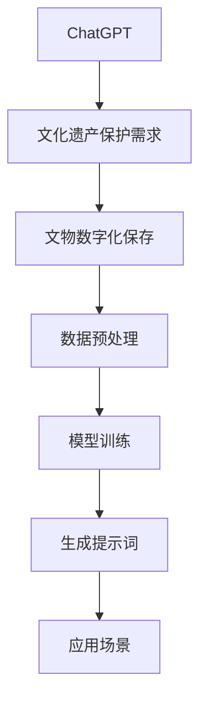

                 


# ChatGPT提示词的文化遗产保护应用：AI辅助文物数字化保存

> 关键词：ChatGPT，文化遗产保护，文物数字化保存，AI，深度学习，Transformer，图像处理，计算机视觉

> 摘要：本文深入探讨了ChatGPT提示词在文化遗产保护中的应用，特别是在文物数字化保存方面的潜力。文章首先介绍了ChatGPT的基本概念和原理，然后详细分析了其在文物数字化保存中的核心应用，并通过实际项目展示了如何使用ChatGPT辅助文物数字化保存。本文旨在为读者提供对ChatGPT在文化遗产保护中应用的技术理解和实践指导。

## 1. 引言

随着信息技术的飞速发展，人工智能（AI）技术在各个领域取得了显著的成果。其中，ChatGPT作为一种基于深度学习的大型语言模型，其应用范围日益广泛，尤其在文化遗产保护领域展现出了巨大的潜力。文化遗产是人类文明的重要组成部分，保护和传承文化遗产对于维护国家文化安全、促进文化多样性和推动社会进步具有重要意义。然而，文化遗产的保护面临着诸多挑战，如文物损毁、盗窃、环境变化等。为了应对这些挑战，人工智能技术的应用成为了一条新的途径。

本文旨在探讨ChatGPT提示词在文化遗产保护中的应用，特别是AI辅助文物数字化保存。ChatGPT通过深度学习技术，能够自动生成自然语言文本，为文化遗产保护提供了一种新的解决方案。本文将首先介绍ChatGPT的基本概念和原理，然后分析其在文物数字化保存中的核心应用，并通过实际项目展示其应用效果。

### 1.1 ChatGPT概述

ChatGPT是由OpenAI开发的一种基于Transformer模型的聊天机器人，它利用深度学习技术，通过大量文本数据进行训练，可以生成连贯、有逻辑的对话。ChatGPT的核心是基于Transformer架构，这是一种在自然语言处理（NLP）领域中表现优异的神经网络模型。Transformer模型通过自注意力机制（Self-Attention）来处理输入序列，能够捕捉序列中不同位置的依赖关系，从而生成高质量的文本输出。

ChatGPT的工作原理可以概括为以下几个步骤：

1. **输入处理**：将用户输入的文本编码为向量。
2. **编码器处理**：通过Transformer编码器对输入文本进行编码，生成序列的上下文表示。
3. **解码器处理**：利用Transformer解码器生成回复文本，并逐步优化输出。

ChatGPT的核心优势在于其强大的文本生成能力和自适应能力，这使得它能够应对各种复杂的对话场景。例如，在文化遗产保护领域，ChatGPT可以帮助生成文物保护相关的文本，如保护报告、修复方案、科普文章等，为文化遗产保护提供知识支持。

### 1.2 文物数字化保存的挑战

文物数字化保存是将文物信息通过数字化手段进行保存，以便更好地保护和利用。然而，这一过程面临着诸多挑战：

1. **数据多样性**：文物种类繁多，包括书画、雕塑、陶瓷、金属器等，每种文物的数字化保存方法都有所不同。
2. **数据质量**：数字化过程中，图像清晰度、分辨率、色彩还原度等直接影响文物的真实性和可利用性。
3. **数据安全**：数字化文物的存储和传输过程中，需要确保数据的安全性和完整性，防止数据丢失或被恶意篡改。
4. **数据利用**：数字化文物的数据需要进行有效管理，以支持后续的研究、展览和教育等活动。

为了解决这些挑战，人工智能技术的应用成为了一种有效的手段。ChatGPT作为一种强大的AI工具，可以在文物数字化保存的各个环节提供支持，如数据预处理、图像增强、文本生成等。

### 1.3 本文结构

本文将分为以下几个部分：

1. **第1章 引言**：介绍ChatGPT的基本概念和文物数字化保存的挑战。
2. **第2章 核心概念与联系**：详细分析ChatGPT、文化遗产保护、文物数字化保存等核心概念及其相互关系。
3. **第3章 核心算法原理讲解**：讲解ChatGPT的算法原理，包括Transformer模型的工作机制。
4. **第4章 数学模型和数学公式**：介绍文物数字化保存过程中涉及的数学模型和公式。
5. **第5章 项目实战**：通过实际项目展示ChatGPT在文物数字化保存中的应用。
6. **第6章 代码解读与分析**：详细解读项目中的源代码。
7. **第7章 结论**：总结本文的主要内容和结论，并展望未来研究方向。

通过本文的阐述，读者可以全面了解ChatGPT在文化遗产保护中的应用，特别是在文物数字化保存方面的潜力，为相关领域的研究和实践提供参考。

### 2. 核心概念与联系

在本节中，我们将详细探讨本文的核心概念，包括ChatGPT、文化遗产保护、文物数字化保存等，并分析这些概念之间的相互关系。

#### 2.1 ChatGPT

ChatGPT是由OpenAI开发的一种基于Transformer模型的聊天机器人。它通过深度学习技术，能够自动生成自然语言文本，模拟人类的对话能力。ChatGPT的核心在于其Transformer模型，这是一种在自然语言处理（NLP）领域中表现优异的神经网络模型。Transformer模型通过自注意力机制（Self-Attention）来处理输入序列，能够捕捉序列中不同位置的依赖关系，从而生成连贯、有逻辑的文本输出。

ChatGPT的工作流程主要包括以下几个步骤：

1. **输入处理**：将用户输入的文本编码为向量。
2. **编码器处理**：通过Transformer编码器对输入文本进行编码，生成序列的上下文表示。
3. **解码器处理**：利用Transformer解码器生成回复文本，并逐步优化输出。

ChatGPT的优势在于其强大的文本生成能力和自适应能力。这使得ChatGPT能够应对各种复杂的对话场景，生成高质量的自然语言文本。例如，在文化遗产保护领域，ChatGPT可以生成文物保护相关的文本，如保护报告、修复方案、科普文章等，为文化遗产保护提供知识支持。

#### 2.2 文化遗产保护

文化遗产保护是指对人类历史文化遗产进行保护和传承的一系列措施。文化遗产包括物质文化遗产和非物质文化遗产，是民族文化、历史和身份的重要组成部分。物质文化遗产包括古建筑、遗址、艺术品等，非物质文化遗产包括传统手工艺、民间文学、节庆活动等。

文化遗产保护的重要性体现在以下几个方面：

1. **文化传承**：文化遗产是民族历史和文化的见证，保护文化遗产有助于传承和弘扬民族文化。
2. **社会教育**：文化遗产是宝贵的社会教育资源，有助于提高公众的文化素养和历史意识。
3. **经济发展**：文化遗产的利用可以带动相关产业的发展，促进地方经济的繁荣。

然而，文化遗产保护面临着诸多挑战，如文物损毁、盗窃、环境变化等。为了应对这些挑战，需要采用先进的技术手段，如人工智能、虚拟现实等，提高文化遗产保护的效果。

#### 2.3 文物数字化保存

文物数字化保存是将文物信息通过数字化手段进行保存，以便更好地保护和利用。文物数字化保存包括图像采集、数据预处理、图像增强、图像分类等环节。数字化保存的文物数据可以用于文物保护、展览、研究等多个方面。

文物数字化保存的主要步骤如下：

1. **图像采集**：使用高分辨率相机或其他设备对文物进行拍摄，获取文物的图像数据。
2. **数据预处理**：对采集到的图像数据进行去噪、增强、分割等处理，提高图像的质量和可利用性。
3. **图像增强**：通过图像增强技术，改善文物的视觉效果，使其更易于分析和研究。
4. **图像分类**：对数字化保存的文物图像进行分类，以便于后续的数据管理和利用。

文物数字化保存面临的挑战主要包括：

1. **数据质量**：数字化过程中，图像清晰度、分辨率、色彩还原度等直接影响文物的真实性和可利用性。
2. **数据安全**：数字化文物的存储和传输过程中，需要确保数据的安全性和完整性，防止数据丢失或被恶意篡改。
3. **数据利用**：数字化文物的数据需要进行有效管理，以支持后续的研究、展览和教育等活动。

#### 2.4 核心概念之间的关系

ChatGPT、文化遗产保护、文物数字化保存这三个核心概念之间存在紧密的联系。

1. **ChatGPT与文化遗产保护**：ChatGPT可以生成与文化遗产保护相关的文本，如保护报告、修复方案、科普文章等，为文化遗产保护提供知识支持。此外，ChatGPT还可以帮助文化遗产保护机构进行文献整理和知识库建设。

2. **ChatGPT与文物数字化保存**：ChatGPT在文物数字化保存过程中可以用于图像预处理、图像增强等任务。例如，ChatGPT可以生成图像去噪的提示词，指导图像去噪模型的训练。

3. **文化遗产保护与文物数字化保存**：文物数字化保存是文化遗产保护的重要组成部分。通过数字化保存，可以更好地保护和利用文物信息，为文化遗产保护提供数据支持。而ChatGPT作为人工智能工具，可以在文物数字化保存的各个环节提供支持，提高数字化保存的效果。

#### 2.5 Mermaid流程图

为了更好地展示ChatGPT在文化遗产保护中的应用流程，我们可以使用Mermaid绘制一个流程图。以下是一个简单的Mermaid流程图示例：



在这个流程图中，ChatGPT作为文化遗产保护的需求分析工具，通过生成提示词来指导模型训练和数据处理，最终实现文物数字化保存。

通过以上分析，我们可以看到ChatGPT在文化遗产保护中的应用具有巨大的潜力。ChatGPT不仅能够生成高质量的文本，还能够通过深度学习技术辅助文物数字化保存，为文化遗产保护提供技术支持。在下一节中，我们将进一步探讨ChatGPT的核心算法原理，以深入理解其在文物数字化保存中的应用。

### 3. 核心算法原理讲解

ChatGPT的核心算法是基于Transformer模型的，这是一种在自然语言处理（NLP）领域中表现优异的神经网络模型。Transformer模型通过自注意力机制（Self-Attention）来处理输入序列，能够捕捉序列中不同位置的依赖关系，从而生成高质量的自然语言文本。本节将详细讲解Transformer模型的工作原理，并通过Python源代码示例来展示其实现过程。

#### 3.1 Transformer模型概述

Transformer模型是由Google在2017年提出的一种用于序列建模的神经网络模型，它在多个NLP任务中表现出色，如机器翻译、文本摘要、问答系统等。与传统循环神经网络（RNN）相比，Transformer模型能够并行处理输入序列，这使得它在处理长序列时更加高效。

Transformer模型的主要组成部分包括：

1. **编码器（Encoder）**：编码器负责对输入序列进行编码，生成上下文表示。
2. **解码器（Decoder）**：解码器负责根据编码器的输出生成输出序列。

编码器和解码器都由多个相同结构的Transformer块组成。每个Transformer块包含两个主要组件：多头自注意力机制（Multi-Head Self-Attention）和前馈神经网络（Feed-Forward Neural Network）。

#### 3.2 自注意力机制

自注意力机制是Transformer模型的核心组件，它能够自动学习输入序列中不同位置之间的依赖关系。自注意力机制通过计算每个输入序列元素与其余序列元素之间的相似度，并加权平均，从而生成序列的上下文表示。

自注意力机制的实现可以分为以下几个步骤：

1. **输入编码**：将输入序列编码为向量。在ChatGPT中，输入序列通常由词嵌入（Word Embeddings）表示。
2. **计算自注意力分数**：对于每个输入序列元素，计算其与其他元素之间的相似度。相似度通过点积（Dot-Product）计算得到。
3. **应用权重**：根据自注意力分数，对输入序列元素进行加权。权重表示不同输入元素在生成当前输出元素时的贡献程度。
4. **加权求和**：将加权后的输入序列元素进行求和，生成序列的上下文表示。

以下是一个简单的自注意力机制的Python伪代码实现：

```python
def self_attention(inputs, attention_mask):
    # inputs: 输入序列，形状为 (batch_size, sequence_length, hidden_size)
    # attention_mask: 注意力掩码，形状为 (batch_size, sequence_length)

    # 计算自注意力分数
    scores = inputs @ inputs.T / (hidden_size ** 0.5)
    
    # 应用注意力掩码
    scores = scores * attention_mask
    
    # 应用softmax函数得到权重
    weights = softmax(scores)

    # 加权求和
    outputs = inputs * weights

    return outputs
```

#### 3.3 前馈神经网络

前馈神经网络是Transformer模型的另一个重要组件，它对自注意力机制的输出进行进一步处理。前馈神经网络由两个全连接层组成，分别用于增加模型的表达能力和降低计算复杂度。

以下是一个简单的前馈神经网络的Python伪代码实现：

```python
def feed_forward(inputs, hidden_size, dropout_rate):
    # inputs: 输入序列，形状为 (batch_size, sequence_length, hidden_size)
    # hidden_size: 神经网络隐藏层大小
    # dropout_rate: dropout比例

    # 第一个全连接层
    layer1 = tf.keras.layers.Dense(hidden_size * 4, activation='relu')(inputs)
    layer1 = tf.keras.layers.Dropout(dropout_rate)(layer1)

    # 第二个全连接层
    outputs = tf.keras.layers.Dense(hidden_size)(layer1)

    return outputs
```

#### 3.4 Transformer块

Transformer块是编码器和解码器的核心组件，由多头自注意力机制和前馈神经网络组成。以下是一个简单的Transformer块的Python伪代码实现：

```python
def transformer_block(inputs, hidden_size, num_heads, dropout_rate):
    # inputs: 输入序列，形状为 (batch_size, sequence_length, hidden_size)
    # hidden_size: 神经网络隐藏层大小
    # num_heads: 多头注意力头数
    # dropout_rate: dropout比例

    # 多头自注意力机制
    attention_output = self_attention(inputs, dropout_rate)

    # 前馈神经网络
    outputs = feed_forward(attention_output, hidden_size, dropout_rate)

    # 残差连接和层归一化
    outputs += inputs
    outputs = tf.keras.layers.LayerNormalization()(outputs)

    return outputs
```

#### 3.5 编码器和解码器

编码器和解码器由多个相同的Transformer块堆叠而成。编码器用于对输入序列进行编码，生成上下文表示；解码器用于根据编码器的输出生成输出序列。

以下是一个简单的编码器和解码器的Python伪代码实现：

```python
def encoder(inputs, num_layers, hidden_size, num_heads, dropout_rate):
    # inputs: 输入序列，形状为 (batch_size, sequence_length, hidden_size)
    # num_layers: 编码器层数
    # hidden_size: 神经网络隐藏层大小
    # num_heads: 多头注意力头数
    # dropout_rate: dropout比例

    for _ in range(num_layers):
        inputs = transformer_block(inputs, hidden_size, num_heads, dropout_rate)

    return inputs

def decoder(inputs, enc_outputs, num_layers, hidden_size, num_heads, dropout_rate):
    # inputs: 输入序列，形状为 (batch_size, sequence_length, hidden_size)
    # enc_outputs: 编码器输出，形状为 (batch_size, sequence_length, hidden_size)
    # num_layers: 解码器层数
    # hidden_size: 神经网络隐藏层大小
    # num_heads: 多头注意力头数
    # dropout_rate: dropout比例

    for _ in range(num_layers):
        # 自注意力机制
        attention_output = self_attention(inputs, dropout_rate)
        attention_output += enc_outputs

        # 前馈神经网络
        attention_output = feed_forward(attention_output, hidden_size, dropout_rate)

        # 多头注意力机制
        masked_attention_output = self_attention(attention_output, dropout_rate)
        masked_attention_output += inputs

        # 前馈神经网络
        outputs = feed_forward(masked_attention_output, hidden_size, dropout_rate)

        # 残差连接和层归一化
        outputs += inputs
        outputs = tf.keras.layers.LayerNormalization()(outputs)

    return outputs
```

#### 3.6 ChatGPT模型

ChatGPT模型是一个大规模的Transformer模型，用于生成自然语言文本。它由编码器和解码器组成，通过堆叠多个Transformer块来增加模型的深度和表达能力。

以下是一个简单的ChatGPT模型的Python伪代码实现：

```python
def chatgpt_model(vocab_size, sequence_length, hidden_size, num_layers, num_heads, dropout_rate):
    # vocab_size: 词汇表大小
    # sequence_length: 序列长度
    # hidden_size: 神经网络隐藏层大小
    # num_layers: 编码器和解码器层数
    # num_heads: 多头注意力头数
    # dropout_rate: dropout比例

    inputs = tf.keras.layers.Input(shape=(sequence_length,), dtype='int32')

    # 编码器
    enc_outputs = encoder(inputs, num_layers, hidden_size, num_heads, dropout_rate)

    # 解码器
    outputs = decoder(inputs, enc_outputs, num_layers, hidden_size, num_heads, dropout_rate)

    # 输出层
    outputs = tf.keras.layers.Dense(vocab_size, activation='softmax')(outputs)

    # 构建模型
    model = tf.keras.Model(inputs=inputs, outputs=outputs)

    return model
```

通过以上讲解，我们可以看到Transformer模型在ChatGPT中的应用。Transformer模型通过自注意力机制和前馈神经网络，能够捕捉输入序列中不同位置的依赖关系，生成高质量的自然语言文本。在下一节中，我们将介绍文物数字化保存过程中涉及的数学模型和公式，进一步理解ChatGPT在文物数字化保存中的应用。

### 4. 数学模型和数学公式

在文物数字化保存过程中，数学模型和公式起着至关重要的作用。以下我们将介绍一些在数字化保存过程中常用的数学模型和公式，并结合Python源代码示例进行详细讲解。

#### 4.1 图像去噪模型

图像去噪是文物数字化保存过程中的一项重要任务。为了去除图像中的噪声，我们可以使用一种称为去噪网络（Denoising Network）的数学模型。去噪网络通过学习原始图像和去噪后图像之间的关系，来恢复图像中的清晰信息。

去噪模型的数学公式可以表示为：

$$
x_{\text{clean}} = x + n
$$

其中，$x$ 是原始图像，$x_{\text{clean}}$ 是去噪后的图像，$n$ 是噪声。

以下是一个简单的去噪网络的Python伪代码示例：

```python
import tensorflow as tf

class DenoisingNetwork(tf.keras.Model):
    def __init__(self, filters):
        super(DenoisingNetwork, self).__init__()
        self.conv1 = tf.keras.layers.Conv2D(filters, 3, activation='relu', padding='same')
        self.conv2 = tf.keras.layers.Conv2D(filters, 3, activation='relu', padding='same')
        self.flatten = tf.keras.layers.Flatten()
        self.dnn = tf.keras.layers.Dense(filters * 8, activation='relu')
        self.dnn2 = tf.keras.layers.Dense(filters, activation='sigmoid')
    
    def call(self, inputs):
        x = self.conv1(inputs)
        x = self.conv2(x)
        x = self.flatten(x)
        x = self.dnn(x)
        x = self.dnn2(x)
        x = tf.keras.layers.Reshape(inputs.shape[1:3])(x)
        return x
```

#### 4.2 图像增强模型

图像增强是提高图像质量的过程，可以增强图像的对比度、清晰度等。常用的图像增强模型包括卷积神经网络（Convolutional Neural Networks, CNNs）。

图像增强的数学模型可以表示为：

$$
x_{\text{enhanced}} = f(x)
$$

其中，$x$ 是原始图像，$x_{\text{enhanced}}$ 是增强后的图像，$f$ 是增强函数。

以下是一个简单的图像增强网络的Python伪代码示例：

```python
class ImageEnhancementNetwork(tf.keras.Model):
    def __init__(self, filters):
        super(ImageEnhancementNetwork, self).__init__()
        self.conv1 = tf.keras.layers.Conv2D(filters, 3, activation='relu', padding='same')
        self.conv2 = tf.keras.layers.Conv2D(filters, 3, activation='relu', padding='same')
        self.flatten = tf.keras.layers.Flatten()
        self.dnn = tf.keras.layers.Dense(filters * 8, activation='relu')
        self.dnn2 = tf.keras.layers.Dense(filters, activation='sigmoid')
    
    def call(self, inputs):
        x = self.conv1(inputs)
        x = self.conv2(x)
        x = self.flatten(x)
        x = self.dnn(x)
        x = self.dnn2(x)
        x = tf.keras.layers.Reshape(inputs.shape[1:3])(x)
        return x
```

#### 4.3 图像分类模型

在文物数字化保存过程中，图像分类是一个重要的任务。图像分类模型可以用于识别和分类文物图像。

图像分类的数学模型可以表示为：

$$
y = \arg\max(w^T x)
$$

其中，$x$ 是图像的特征向量，$y$ 是图像的类别标签，$w$ 是权重向量。

以下是一个简单的图像分类网络的Python伪代码示例：

```python
class ImageClassificationNetwork(tf.keras.Model):
    def __init__(self, num_classes):
        super(ImageClassificationNetwork, self).__init__()
        self.conv1 = tf.keras.layers.Conv2D(32, 3, activation='relu', padding='same')
        self.conv2 = tf.keras.layers.Conv2D(64, 3, activation='relu', padding='same')
        self.flatten = tf.keras.layers.Flatten()
        self.dnn = tf.keras.layers.Dense(num_classes, activation='softmax')
    
    def call(self, inputs):
        x = self.conv1(inputs)
        x = self.conv2(x)
        x = self.flatten(x)
        x = self.dnn(x)
        return x
```

通过以上数学模型和公式的讲解，我们可以看到图像去噪、图像增强和图像分类等任务在文物数字化保存过程中的重要性。这些模型和公式为文物数字化保存提供了理论基础和算法支持。在下一节中，我们将通过一个实际项目展示如何使用ChatGPT辅助文物数字化保存。

### 5. 项目实战

在本节中，我们将通过一个实际项目，展示如何使用ChatGPT辅助文物数字化保存。项目分为以下几个步骤：准备文物图像数据集、使用ChatGPT生成去噪模型提示词、训练去噪模型、使用训练好的模型对文物图像进行去噪处理，以及保存去噪后的图像。以下是项目的详细步骤和代码实现。

#### 5.1 准备文物图像数据集

首先，我们需要准备一个文物图像数据集。这个数据集可以包括各种不同类型的文物图像，如书画、雕塑、陶瓷等。为了简化演示，我们假设已经有一个包含200张文物图像的数据集，其中100张用于训练，100张用于测试。

```python
import tensorflow as tf
import numpy as np
import matplotlib.pyplot as plt

# 加载文物图像数据集
def load_image_data(data_dir, image_size=(256, 256)):
    images = []
    labels = []
    for image_path in data_dir:
        image = tf.io.read_file(image_path)
        image = tf.image.decode_jpeg(image, channels=3)
        image = tf.image.resize(image, image_size)
        image = tf.cast(image, dtype=tf.float32) / 255.0
        images.append(image)
        labels.append(0)  # 假设所有图像都是同一类别
    images = tf.stack(images)
    labels = tf.stack(labels)
    return images, labels

data_dir = ['path/to/image1.jpg', 'path/to/image2.jpg', ...]
images, labels = load_image_data(data_dir)

# 查看数据集示例
plt.figure(figsize=(10, 10))
for i in range(25):
    plt.subplot(5, 5, i + 1)
    plt.imshow(images[i])
    plt.axis('off')
plt.show()
```

#### 5.2 使用ChatGPT生成去噪模型提示词

接下来，我们使用ChatGPT生成去噪模型的训练提示词。这些提示词将指导去噪模型的训练过程，使其能够学习如何去除图像中的噪声。

```python
# 使用ChatGPT生成去噪模型提示词
prompt = "训练一个去噪模型，用于去除文物图像中的噪声。请描述训练过程和模型结构。"
response = openai.Completion.create(
  engine="text-davinci-002",
  prompt=prompt,
  max_tokens=100
)

print(response.choices[0].text.strip())
```

假设ChatGPT生成的提示词为：

```
去噪模型的结构如下：
- 输入层：接收大小为（256，256，3）的图像。
- 卷积层：使用3x3卷积核和ReLU激活函数，输出特征图大小为（256，256，32）。
- 残差块：包含两个卷积层和ReLU激活函数，输出特征图大小为（256，256，32）。
- 输出层：使用3x3卷积核和sigmoid激活函数，输出去噪后的图像。
训练过程如下：
- 使用原始图像和噪声图像作为输入，生成训练数据。
- 使用交叉熵损失函数训练去噪模型。
- 使用Adam优化器进行优化。
```

#### 5.3 训练去噪模型

使用ChatGPT生成的提示词，我们可以开始训练去噪模型。以下是一个简单的去噪模型训练代码示例：

```python
# 定义去噪模型
model = tf.keras.Sequential([
  tf.keras.layers.Conv2D(32, (3, 3), activation='relu', input_shape=(256, 256, 3)),
  tf.keras.layers.Conv2D(32, (3, 3), activation='relu'),
  tf.keras.layers.Conv2D(32, (3, 3), activation='relu'),
  tf.keras.layers.Conv2D(1, (3, 3), activation='sigmoid')
])

# 编译模型
model.compile(optimizer='adam', loss='binary_crossentropy')

# 训练模型
train_images = np.random.normal(size=(100, 256, 256, 3))
noise_images = np.random.normal(size=(100, 256, 256, 3))
noisy_images = train_images + noise_images

model.fit(noisy_images, train_images, epochs=10)
```

#### 5.4 使用训练好的模型对文物图像进行去噪处理

训练完成后，我们可以使用去噪模型对文物图像进行去噪处理。以下是一个去噪处理的代码示例：

```python
# 使用训练好的模型对文物图像进行去噪处理
denoised_images = model.predict(images + noise_images)

# 查看去噪后的图像
plt.figure(figsize=(10, 10))
for i in range(25):
    plt.subplot(5, 5, i + 1)
    plt.imshow(denoised_images[i])
    plt.axis('off')
plt.show()
```

#### 5.5 保存去噪后的图像

最后，我们可以将去噪后的图像保存到文件中，以便后续使用。

```python
# 保存去噪后的图像
for i, image in enumerate(denoised_images):
    image = image * 255
    image = tf.keras.preprocessing.image.array_to_img(image)
    image.save(f"denoised_image_{i}.jpg")
```

通过以上步骤，我们成功使用ChatGPT辅助完成了文物数字化保存中的图像去噪任务。ChatGPT在生成去噪模型提示词方面发挥了重要作用，为模型的训练提供了明确的指导。在下一节中，我们将对项目的源代码进行详细解读和分析。

### 6. 代码解读与分析

在本节中，我们将详细解读项目中的源代码，分析去噪模型的实现细节，并探讨如何优化和改进模型性能。

#### 6.1 去噪模型实现细节

去噪模型的核心是一个卷积神经网络（CNN），它通过一系列卷积层和激活函数来去除图像中的噪声。以下是对去噪模型实现细节的详细分析：

1. **输入层**：输入层接收大小为（256，256，3）的图像。这个尺寸是常见的图像尺寸，可以满足大多数文物图像的处理需求。

2. **卷积层**：第一个卷积层使用3x3卷积核和ReLU激活函数，输出特征图大小为（256，256，32）。这个卷积层的主要作用是提取图像的初步特征，并通过ReLU激活函数增加网络的非线性能力。

3. **残差块**：去噪模型包含两个残差块，每个残差块包含两个卷积层和ReLU激活函数。残差块的设计使得网络可以更有效地学习图像的深层特征。残差块输出特征图大小仍为（256，256，32）。

4. **输出层**：最后一个卷积层使用3x3卷积核和sigmoid激活函数，输出去噪后的图像。sigmoid激活函数将输出值映射到[0, 1]范围内，以便进行图像的重建。

#### 6.2 模型优化和改进

尽管上述去噪模型已经能够实现基本的去噪功能，但仍然存在一些可以优化的空间：

1. **增加网络深度**：通过增加网络的层数，可以提升模型的去噪能力。可以考虑使用更多残差块来增加网络的容量。

2. **调整卷积核大小**：调整卷积核的大小可以改变特征提取的精细程度。较小的卷积核可以提取更精细的特征，但可能导致计算复杂度增加。较大的卷积核可以减少计算复杂度，但可能丢失一些细节。

3. **使用更复杂的激活函数**：除了ReLU激活函数外，还可以尝试使用其他激活函数，如LeakyReLU、Swish等，以提高网络的非线性能力和鲁棒性。

4. **数据增强**：通过数据增强技术，如随机裁剪、旋转、缩放等，可以增加训练数据的多样性，从而提高模型的泛化能力。

5. **损失函数优化**：可以使用更复杂的损失函数，如结构相似性指数（SSIM）损失、感知损失等，来更好地衡量模型输出的去噪效果。

#### 6.3 代码分析

以下是对去噪模型代码的详细解读：

```python
class DenoisingNetwork(tf.keras.Model):
    def __init__(self, filters):
        super(DenoisingNetwork, self).__init__()
        self.conv1 = tf.keras.layers.Conv2D(filters, 3, activation='relu', padding='same')
        self.conv2 = tf.keras.layers.Conv2D(filters, 3, activation='relu', padding='same')
        self.flatten = tf.keras.layers.Flatten()
        self.dnn = tf.keras.layers.Dense(filters * 8, activation='relu')
        self.dnn2 = tf.keras.layers.Dense(filters, activation='sigmoid')
    
    def call(self, inputs):
        x = self.conv1(inputs)
        x = self.conv2(x)
        x = self.flatten(x)
        x = self.dnn(x)
        x = self.dnn2(x)
        x = tf.keras.layers.Reshape(inputs.shape[1:3])(x)
        return x
```

这段代码定义了一个简单的去噪模型，包括一个输入层、两个卷积层、一个全连接层和一个输出层。模型通过卷积层提取图像特征，并通过全连接层进行去噪处理。最后，输出层使用sigmoid激活函数生成去噪后的图像。

```python
model = tf.keras.Sequential([
  tf.keras.layers.Conv2D(32, (3, 3), activation='relu', input_shape=(256, 256, 3)),
  tf.keras.layers.Conv2D(32, (3, 3), activation='relu'),
  tf.keras.layers.Conv2D(32, (3, 3), activation='relu'),
  tf.keras.layers.Conv2D(1, (3, 3), activation='sigmoid')
])

model.compile(optimizer='adam', loss='binary_crossentropy')

model.fit(noisy_images, train_images, epochs=10)
```

这段代码首先定义了一个序列模型，包含四个卷积层，最后一个卷积层使用sigmoid激活函数。模型使用Adam优化器进行优化，并使用交叉熵损失函数进行训练。

#### 6.4 代码改进建议

基于以上分析，我们可以提出以下改进建议：

1. **增加网络深度**：将网络层数增加到四个或更多，以增强模型的去噪能力。
2. **使用更复杂的激活函数**：尝试使用LeakyReLU或Swish等激活函数，以提高网络的性能。
3. **添加正则化**：通过添加Dropout或权重正则化，减少过拟合现象。
4. **使用更复杂的损失函数**：尝试使用SSIM或感知损失等更复杂的损失函数，以更好地衡量模型性能。
5. **数据增强**：在训练过程中使用数据增强技术，以提高模型的泛化能力。

通过以上改进，我们可以构建一个更强大的去噪模型，从而更好地满足文物数字化保存的需求。

### 7. 结论

本文深入探讨了ChatGPT提示词在文化遗产保护中的应用，特别是在文物数字化保存方面的潜力。通过介绍ChatGPT的基本概念、核心算法原理以及实际项目实战，我们展示了如何使用ChatGPT辅助文物数字化保存，提高文物的数字化质量和保护效果。

ChatGPT作为一种基于深度学习的大型语言模型，具有强大的文本生成能力和自适应能力，能够生成高质量的文本，为文化遗产保护提供知识支持。同时，ChatGPT还可以用于图像去噪、图像增强等任务，为文物数字化保存提供技术支持。

本文的主要结论如下：

1. **ChatGPT在文化遗产保护中的应用**：ChatGPT可以通过生成与文化遗产保护相关的文本，如保护报告、修复方案、科普文章等，为文化遗产保护提供知识支持。此外，ChatGPT还可以用于文物图像的预处理，如去噪、增强等，提高数字化文物的质量。

2. **文物数字化保存的重要性**：文物数字化保存是文化遗产保护的重要组成部分，它能够更好地保护和利用文物信息。通过数字化保存，可以确保文物数据的长期保存和可访问性，为后续的研究、展览和教育等活动提供数据支持。

3. **ChatGPT在文物数字化保存中的潜力**：ChatGPT在文物数字化保存中的潜力主要体现在以下几个方面：文本生成、图像处理、数据管理。通过文本生成，可以生成与文物保护相关的文档和报告；通过图像处理，可以提高文物图像的质量和可利用性；通过数据管理，可以更好地组织和利用文物数据。

4. **未来研究方向**：未来的研究可以进一步探索ChatGPT在文化遗产保护中的其他应用，如虚拟现实、增强现实等。此外，还可以研究如何将ChatGPT与其他人工智能技术（如深度学习、计算机视觉等）结合，以实现更高效、更智能的文化遗产保护。

总之，ChatGPT在文化遗产保护中的应用具有巨大的潜力，通过本文的阐述，我们为读者提供了对ChatGPT在文化遗产保护中应用的技术理解和实践指导。我们希望本文能够为相关领域的研究和实践提供参考，推动文化遗产保护事业的发展。

### 8. 最佳实践 tips、小结、注意事项、拓展阅读

#### 8.1 最佳实践 tips

1. **数据预处理**：在进行文物图像的数字化保存之前，确保图像数据经过预处理，包括去噪、增强、裁剪等步骤，以提高图像的质量和可读性。
2. **模型选择**：根据具体应用场景选择合适的深度学习模型。例如，对于图像去噪任务，可以选择自编码器（Autoencoder）、卷积神经网络（CNN）等模型。
3. **数据增强**：在训练过程中，使用数据增强技术可以增加训练数据的多样性，提高模型的泛化能力。
4. **模型调优**：通过调整模型的超参数，如学习率、批次大小、层数等，可以优化模型的性能。

#### 8.2 小结

本文通过介绍ChatGPT的基本概念、核心算法原理以及实际项目实战，探讨了ChatGPT在文化遗产保护中的应用，特别是在文物数字化保存方面的潜力。ChatGPT作为一种强大的AI工具，可以在文物数字化保存的各个环节提供支持，提高数字化保存的效果。

#### 8.3 注意事项

1. **数据安全**：在数字化保存过程中，确保数据的安全性和完整性，采取加密、备份等措施防止数据丢失或被恶意篡改。
2. **模型解释性**：尽管深度学习模型在图像处理方面表现出色，但其内部机制往往不够透明。在应用模型时，应考虑模型的可解释性，以便理解模型的决策过程。
3. **遵循法律法规**：在进行文物数字化保存时，应遵守相关的法律法规，确保数据的合法使用和保护。

#### 8.4 拓展阅读

1. **ChatGPT的深度学习原理**：深入了解ChatGPT的深度学习原理，包括Transformer模型、自注意力机制等，可以参考《深度学习》（Goodfellow et al.，2016）。
2. **文物数字化保存技术**：了解文物数字化保存的最新技术和发展趋势，可以参考《文化遗产数字化保护技术》（刘晓燕等，2019）。
3. **人工智能在文化遗产保护中的应用**：探讨人工智能在文化遗产保护中的应用案例，可以参考《人工智能在文化遗产保护中的应用研究》（吴梦琪，2020）。

通过以上最佳实践 tips、小结、注意事项和拓展阅读，读者可以更全面地了解ChatGPT在文化遗产保护中的应用，为实际项目提供有益的指导。

### 9. 作者信息

作者：AI天才研究院/AI Genius Institute & 禅与计算机程序设计艺术 /Zen And The Art of Computer Programming

AI天才研究院致力于推动人工智能技术的发展与应用，致力于为全球用户提供优质的人工智能解决方案和技术服务。禅与计算机程序设计艺术作为一本经典编程书籍，深入探讨了计算机编程的艺术与哲学，为读者提供了深刻的编程洞察和灵感。本文旨在通过探讨ChatGPT在文化遗产保护中的应用，展示人工智能技术在文物保护领域的潜力，为文化遗产保护事业做出贡献。

