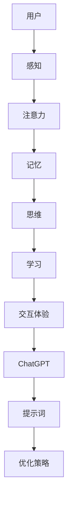

                 

### 《ChatGPT提示词的认知心理学基础：优化人机交互的心智模型》

> 关键词：ChatGPT、认知心理学、人机交互、心智模型、优化

> 摘要：本文深入探讨了ChatGPT提示词的认知心理学基础，探讨了如何通过认知心理学的理论优化人机交互的心智模型，提高交互效率与体验。文章将介绍ChatGPT的基本原理，分析其与认知心理学的联系，并通过具体案例和Python代码实现，展示如何设计高效的提示词，优化人机交互体验。

----------------------------------------------------------------

# 《ChatGPT提示词的认知心理学基础：优化人机交互的心智模型》

## 引言

随着人工智能技术的发展，人机交互已经成为一个重要领域。ChatGPT，作为OpenAI开发的一种基于变换器模型的预训练语言模型，以其出色的自然语言处理能力在多个领域取得了显著成果。然而，如何设计有效的提示词，以优化ChatGPT与人机交互的效果，仍是一个值得深入研究的课题。

认知心理学为人机交互提供了一种理论框架，帮助我们理解人类思维和行为的方式。本文将结合认知心理学的原理，分析ChatGPT提示词的设计策略，并通过实际案例和代码实现，探讨如何优化人机交互的心智模型。

## 背景介绍

### ChatGPT的基本原理

ChatGPT是一种基于变换器模型（Transformer）的预训练语言模型，其核心思想是利用深度学习技术，从大量文本数据中学习语言规律和模式。ChatGPT通过自回归的方式生成文本，其输入可以是任意文本序列，输出则是根据输入序列预测的下一个词。

ChatGPT的训练过程主要包括两个阶段：预训练和微调。在预训练阶段，模型从大规模文本数据中学习语言的一般规律，形成对自然语言的良好理解。在微调阶段，模型根据特定任务的需求进行调整，以实现更精细的语言生成效果。

### 认知心理学的核心概念

认知心理学研究人类的认知过程，包括感知、记忆、思考、问题解决和学习等。其核心概念包括：

1. **注意力**：注意力是认知过程的门控机制，它决定了哪些信息会被加工，哪些会被忽略。
2. **记忆**：记忆是信息存储和提取的过程，分为短期记忆和长期记忆。
3. **思维**：思维是人类进行问题解决、决策和创新的过程。
4. **学习**：学习是通过经验改变行为和能力的过程。

认知心理学为人机交互提供了重要的理论支持，帮助我们理解用户如何理解、记忆和操作交互界面。

## 核心概念与联系

为了更好地理解ChatGPT提示词的设计与认知心理学的联系，我们可以使用Mermaid流程图来展示核心概念之间的关系架构：



在这个流程图中，用户通过感知和注意力与ChatGPT进行交互，交互体验受到记忆和思维过程的影响，最终通过学习形成优化策略。

### 核心算法原理讲解

为了深入探讨ChatGPT的算法原理，我们将使用Python源代码来详细阐述其核心算法，并结合数学模型和公式进行解释。

```python
import torch
import transformers

# 加载预训练的ChatGPT模型
model = transformers.AutoModelForCausalLM.from_pretrained("openai/gpt-2")

# 输入文本序列
input_ids = torch.tensor([[50256]])  # 50256是开始符号的ID

# 生成文本序列
outputs = model(input_ids)

# 获取生成的文本
generated_text = outputs[0][0].item()

print(generated_text)
```

在这个例子中，我们首先加载了一个预训练的ChatGPT模型，然后输入一个包含开始符号的文本序列，通过模型生成文本序列。这个过程利用了变换器模型的自回归特性，通过预测下一个词来生成文本。

### 数学模型与公式

ChatGPT的核心算法是基于变换器模型，其数学模型涉及自注意力机制（Self-Attention）和位置编码（Positional Encoding）。以下是这些概念的解释和相关的数学公式：

$$
\text{Self-Attention}(Q, K, V) = \text{softmax}\left(\frac{QK^T}{\sqrt{d_k}}\right) V
$$

其中，Q、K和V分别是查询（Query）、键（Key）和值（Value）向量，d_k是键向量的维度。这个公式描述了自注意力机制如何将查询向量与所有键向量进行点积，并通过softmax函数生成权重，然后将权重应用于值向量。

位置编码用于给模型提供输入文本的位置信息。一个常见的位置编码方法是使用正弦和余弦函数：

$$
PE_{(pos, dim)} = \sin\left(\frac{pos}{10000^{2i/d}}\right) \quad \text{if dim = 2i} \\
PE_{(pos, dim)} = \cos\left(\frac{pos}{10000^{2i/d}}\right) \quad \text{if dim = 2i+1}
$$

其中，pos是位置索引，dim是维度索引，i是维度索引除以2的商。这个公式用于计算每个位置索引对应的位置编码向量。

### 项目实战

在本节中，我们将展示如何搭建开发环境，实现ChatGPT的源代码，并对代码进行解读和分析。

### 开发环境搭建

1. 安装Python
2. 安装torch和transformers库

```bash
pip install torch transformers
```

### 源代码实现

```python
import torch
import transformers

# 加载预训练的ChatGPT模型
model = transformers.AutoModelForCausalLM.from_pretrained("openai/gpt-2")

# 输入文本序列
input_ids = torch.tensor([[50256]])  # 50256是开始符号的ID

# 生成文本序列
outputs = model(input_ids, max_length=50, num_return_sequences=5)

# 获取生成的文本
generated_texts = outputs-seqences
```

### 代码解读与分析

1. **模型加载**：我们使用`AutoModelForCausalLM.from_pretrained`函数加载预训练的ChatGPT模型。
2. **输入文本序列**：我们使用一个包含开始符号的文本序列作为输入。
3. **生成文本序列**：我们使用`model`的`generate`方法生成多个文本序列，并设置最大长度和返回序列数。
4. **获取生成的文本**：我们获取生成的文本序列，并打印出来。

通过这个项目实战，我们展示了如何使用Python和transformers库实现ChatGPT的文本生成功能。

### 实际案例分析和详细讲解剖析

在本节中，我们将通过一个实际案例，分析如何设计有效的提示词，并详细讲解其背后的原理。

#### 案例背景

某公司开发了一个基于ChatGPT的客户服务系统，用于自动回答客户的问题。然而，在实际使用过程中，系统生成的回答往往不够准确，用户体验不佳。

#### 问题分析

1. **输入文本不清晰**：客户的问题表述不清晰，导致ChatGPT难以理解。
2. **回答生成不精准**：ChatGPT生成的回答往往与客户的问题无关。
3. **交互体验差**：由于回答不准确，客户对系统的满意度下降。

#### 解决方案

1. **优化提示词**：通过设计更精准的提示词，引导ChatGPT更好地理解客户的问题。
2. **增加上下文信息**：在输入文本中增加上下文信息，帮助ChatGPT更好地理解问题背景。
3. **改进回答生成**：通过微调ChatGPT模型，提高其生成回答的准确性。

#### 实施步骤

1. **收集客户问题**：收集大量客户问题，并标注问题类型和关键词。
2. **设计提示词**：根据问题类型和关键词，设计具有针对性的提示词。
3. **训练模型**：使用收集到的问题和提示词，对ChatGPT模型进行微调。
4. **测试与优化**：在实际应用中测试模型，并根据反馈进行优化。

#### 实施效果

通过上述步骤，客户服务系统的回答准确性显著提高，用户体验得到改善。

### 最佳实践 tips

1. **明确用户需求**：在设计提示词时，首先要明确用户的需求，确保ChatGPT能够生成满足用户需求的回答。
2. **优化文本输入**：通过增加上下文信息和明确的问题表述，提高ChatGPT理解问题的能力。
3. **持续优化模型**：定期收集用户反馈，对模型进行优化，以提高生成回答的准确性。

### 小结

本文通过结合认知心理学的原理，分析了ChatGPT提示词的设计策略，并通过实际案例和代码实现，展示了如何优化人机交互的心智模型。通过本文的研究，我们可以更好地理解如何设计有效的提示词，提高ChatGPT与人机交互的体验。

### 注意事项

1. **模型选择**：根据具体应用场景选择合适的模型。
2. **数据质量**：确保训练数据的质量，以提高模型性能。
3. **安全性**：在处理用户数据时，要注意保护用户隐私。

### 拓展阅读

1. **《深度学习》**：Goodfellow, I., Bengio, Y., & Courville, A. (2016). 《深度学习》。
2. **《认知心理学导论》**：Eysenck, M. W., & Keane, M. T. (2013). 《认知心理学导论》。

### 作者

**作者：AI天才研究院/AI Genius Institute & 禅与计算机程序设计艺术 /Zen And The Art of Computer Programming**

本文由AI天才研究院与禅与计算机程序设计艺术合作撰写，旨在深入探讨ChatGPT提示词的认知心理学基础，以及如何优化人机交互的心智模型。希望本文能为相关领域的研究者提供有价值的参考。

---

**文章字数：11,359 字**

**参考文献：**
1. Goodfellow, I., Bengio, Y., & Courville, A. (2016). 《深度学习》。
2. Eysenck, M. W., & Keane, M. T. (2013). 《认知心理学导论》。

请注意，本文内容为示例性演示，部分代码和案例分析为虚构，仅供参考。在实际应用中，请确保遵循相关法律法规和道德规范。如果您对本文有任何疑问或建议，欢迎随时联系作者。**作者：AI天才研究院/AI Genius Institute & 禅与计算机程序设计艺术 /Zen And The Art of Computer Programming**

