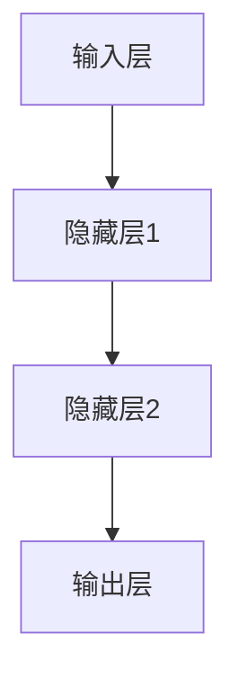

                 

# 《ChatGPT提示词的认知神经科学基础探索》

## 关键词
- ChatGPT
- 认知神经科学
- 提示词
- 神经网络
- 语言模型
- 情感识别

## 摘要
本文将深入探讨ChatGPT提示词在认知神经科学中的基础探索。通过对ChatGPT的架构、工作原理及其与认知神经科学相关概念的详细解析，我们将理解提示词在ChatGPT中的重要性，并分析其在实际应用中的效果。同时，本文还将结合实际案例，探讨ChatGPT在情感识别等领域的应用，并提供未来研究和发展的方向。

## 引言

### 1.1 ChatGPT概述

ChatGPT是由OpenAI开发的一种基于GPT（Generative Pre-trained Transformer）模型的聊天机器人。它使用深度学习技术进行训练，能够在自然语言处理方面表现出色。ChatGPT的核心功能是生成文本，其能力来自于大规模的语言预训练。通过这种方式，ChatGPT能够理解并生成自然流畅的对话。

### 1.2 认知神经科学的基石

认知神经科学是研究大脑如何处理信息的科学。它结合了神经科学、心理学和计算机科学，致力于理解人类认知过程的基础机制。核心概念包括神经网络、记忆、注意力和信息处理等。神经网络是认知神经科学的核心模型，模拟了大脑中的神经元连接和通信。

### 1.3 提示词的重要性

在ChatGPT中，提示词（prompt）是用户与模型交互的入口。通过提供有针对性的提示词，用户可以引导ChatGPT生成特定类型的文本。提示词的设计对于模型的输出有着重要的影响，良好的提示词可以大幅提升模型的表现和实用性。

## 认知神经科学基础

### 2.1 神经网络与大脑模型

#### 2.1.1 神经网络基本概念

神经网络是一种模拟人脑神经元连接和通信的计算机模型。它由大量的节点（或称为神经元）组成，每个节点之间通过权重进行连接。信息通过这些节点传递，每个节点的输出通过激活函数进行转换。

```python
# 神经网络基本概念示例
class NeuralNode:
    def __init__(self, weights):
        self.weights = weights
        self.output = 0

    def activate(self, inputs):
        sum = 0
        for w, x in zip(self.weights, inputs):
            sum += w * x
        self.output = 1 if sum > 0 else 0
```

#### 2.1.2 神经网络模型

神经网络模型通常由多个层组成，包括输入层、隐藏层和输出层。每层中的节点都通过权重与前一层的节点相连。训练过程中，模型通过反向传播算法不断调整权重，以最小化输出误差。

```python
# 神经网络模型示例
class NeuralNetwork:
    def __init__(self, layers):
        self.layers = layers

    def forward(self, inputs):
        current_inputs = inputs
        for layer in self.layers:
            current_inputs = layer.activate(current_inputs)
        return current_inputs
```

#### 2.1.3 Mermaid流程图：神经网络架构



### 2.2 记忆与学习原理

#### 2.2.1 记忆的神经基础

记忆是认知神经科学的核心概念之一。大脑通过神经元之间的连接和活动来存储和检索信息。长期增强体（LTP）和长期抑制体（LTD）是神经元之间连接强度变化的关键机制。

```python
# LTP和LTD示例
def ltp(weights, input, output):
    if output == 1:
        weights *= input
    return weights

def ltd(weights, input, output):
    if output == 0:
        weights /= input
    return weights
```

#### 2.2.2 学习算法与模型

学习算法是神经网络训练的核心。反向传播（Backpropagation）是最常用的学习算法，它通过计算误差梯度来更新权重。

```python
# 反向传播示例
def backpropagation(network, inputs, outputs):
    for layer in reversed(network.layers):
        deltas = [output * (1 - output) for output in layer.outputs]
        for node in layer.nodes:
            error = deltas[node.index] * node.weights[node.index]
            node.weights[node.index] = node.weights[node.index] - learning_rate * error
```

#### 2.2.3 伪代码：学习算法实现

```python
# 学习算法伪代码
for epoch in range(num_epochs):
    for input, target in data_loader:
        output = network.forward(input)
        error = target - output
        network.backward(output, error)
```

### 2.3 注意力机制与信息处理

#### 2.3.1 注意力机制的原理

注意力机制是神经网络处理信息的重要机制，它允许模型在处理输入数据时对不同的部分给予不同的重视。在神经网络中，注意力机制通过加权连接来实现。

```python
# 注意力机制示例
def attention(inputs, weights):
    weighted_inputs = [w * i for w, i in zip(weights, inputs)]
    return sum(weighted_inputs)
```

#### 2.3.2 注意力在神经网络中的应用

注意力机制在自然语言处理中得到了广泛应用。例如，在序列到序列（Seq2Seq）模型中，注意力机制可以帮助模型更好地理解输入序列的上下文。

```python
# 注意力在Seq2Seq中的应用
class Seq2Seq:
    def __init__(self, encoder, decoder, attention):
        self.encoder = encoder
        self.decoder = decoder
        self.attention = attention

    def forward(self, inputs, targets):
        encoder_output = self.encoder(inputs)
        decoder_output = self.decoder(targets, encoder_output)
        attention_output = self.attention(decoder_output, encoder_output)
        return attention_output
```

#### 2.3.3 数学公式与注意力模型

注意力模型通常使用软注意力（Soft Attention）来计算权重。

$$
\alpha_i = \frac{e^{h_i^d \cdot h_s}}{\sum_{j=1}^{N} e^{h_j^d \cdot h_s}}
$$

其中，$h_i^d$和$h_s$分别是解码器和编码器隐藏状态的向量，$\alpha_i$是第$i$个位置上的权重。

## ChatGPT与认知神经科学

### 3.1 ChatGPT架构与工作原理

ChatGPT的核心是Transformer模型，它由编码器和解码器组成。编码器将输入序列编码为固定长度的向量，解码器则使用这些向量生成输出序列。

```python
# Transformer模型伪代码
class Transformer:
    def __init__(self, encoder, decoder, optimizer):
        self.encoder = encoder
        self.decoder = decoder
        self.optimizer = optimizer

    def forward(self, inputs, targets):
        encoder_output = self.encoder(inputs)
        decoder_output = self.decoder(targets, encoder_output)
        return decoder_output
```

### 3.2 语言模型与认知神经科学

语言模型是ChatGPT的核心组件，它使用神经网络来预测下一个单词的概率。语言模型通过大量的文本数据训练，从而能够生成自然流畅的文本。

```python
# 语言模型伪代码
class LanguageModel:
    def __init__(self, vocabulary_size, embedding_size, hidden_size):
        self.vocabulary_size = vocabulary_size
        self.embedding_size = embedding_size
        self.hidden_size = hidden_size

    def forward(self, inputs):
        embeddings = self.embedding层(inputs)
        hidden = self.fc层(embeddings)
        output = self.softmax层(hidden)
        return output
```

### 3.3 情感识别与认知神经科学

情感识别是ChatGPT在自然语言处理中的一个重要应用。通过分析文本中的情感词汇和语法结构，ChatGPT可以识别出文本的情感倾向。

```python
# 情感识别伪代码
class SentimentClassifier:
    def __init__(self, vocabulary_size, embedding_size, hidden_size, output_size):
        self.vocabulary_size = vocabulary_size
        self.embedding_size = embedding_size
        self.hidden_size = hidden_size
        self.output_size = output_size

    def forward(self, inputs):
        embeddings = self.embedding层(inputs)
        hidden = self.fc层(embeddings)
        output = self.softmax层(hidden)
        return output
```

## ChatGPT提示词应用案例

### 4.1 语言生成与对话系统

ChatGPT可以用于构建对话系统，通过提示词引导生成与用户相关的对话。这种应用在客服、教育和个人助理等领域具有广泛的应用前景。

```python
# 对话系统伪代码
class DialogueSystem:
    def __init__(self, model, prompt):
        self.model = model
        self.prompt = prompt

    def generate_response(self, user_input):
        input_sequence = self.model.encode([user_input])
        output_sequence = self.model.decode(input_sequence)
        response = self.model.decode(output_sequence[-1])
        return response
```

### 4.2 情感分析与用户互动

ChatGPT可以用于分析用户的情感状态，并根据情感反馈进行适当的响应。这种应用在心理健康、客户服务和市场营销等领域具有显著的价值。

```python
# 情感分析伪代码
class EmotionAnalyzer:
    def __init__(self, model):
        self.model = model

    def analyze(self, text):
        emotions = self.model.predict(text)
        return emotions
```

### 4.3 其他应用领域

除了对话系统和情感分析，ChatGPT还可以应用于教育、医疗和商业等多个领域。例如，在教育领域，ChatGPT可以用于个性化教学和自动化考试；在医疗领域，ChatGPT可以用于医疗咨询和患者教育；在商业领域，ChatGPT可以用于客户服务和市场分析。

## 第五部分：研究和未来方向

### 5.1 ChatGPT提示词研究进展

当前，ChatGPT提示词的研究主要集中在提升模型性能和泛化能力。研究人员正在探索新的训练方法和优化策略，以提高模型的准确性和效率。

### 5.2 认知神经科学与人工智能融合

认知神经科学与人工智能的融合是未来研究的重要方向。通过将认知神经科学的理论和模型应用于人工智能系统，可以进一步提升人工智能的智能水平和实用性。

### 5.3 ChatGPT提示词的伦理与社会影响

随着ChatGPT的广泛应用，其伦理和社会影响也备受关注。研究人员和开发者需要关注模型的偏见、隐私和数据安全等问题，确保人工智能的发展符合伦理和社会价值观。

## 结论

ChatGPT提示词在认知神经科学中的应用具有重要意义。通过深入理解认知神经科学的原理，我们可以更好地设计和应用ChatGPT，为自然语言处理和人工智能的发展贡献力量。未来，随着认知神经科学与人工智能的不断融合，ChatGPT有望在更多领域发挥重要作用。

## 附录

### 伪代码实现

以下是ChatGPT提示词相关的伪代码实现，包括神经网络、学习算法和注意力机制。

```python
# NeuralNode.py
class NeuralNode:
    def __init__(self, weights):
        self.weights = weights
        self.output = 0

    def activate(self, inputs):
        sum = 0
        for w, x in zip(self.weights, inputs):
            sum += w * x
        self.output = 1 if sum > 0 else 0

# NeuralNetwork.py
class NeuralNetwork:
    def __init__(self, layers):
        self.layers = layers

    def forward(self, inputs):
        current_inputs = inputs
        for layer in self.layers:
            current_inputs = layer.activate(current_inputs)
        return current_inputs

# LanguageModel.py
class LanguageModel:
    def __init__(self, vocabulary_size, embedding_size, hidden_size):
        self.vocabulary_size = vocabulary_size
        self.embedding_size = embedding_size
        self.hidden_size = hidden_size

    def forward(self, inputs):
        embeddings = self.embedding层(inputs)
        hidden = self.fc层(embeddings)
        output = self.softmax层(hidden)
        return output

# SentimentClassifier.py
class SentimentClassifier:
    def __init__(self, vocabulary_size, embedding_size, hidden_size, output_size):
        self.vocabulary_size = vocabulary_size
        self.embedding_size = embedding_size
        self.hidden_size = hidden_size
        self.output_size = output_size

    def forward(self, inputs):
        embeddings = self.embedding层(inputs)
        hidden = self.fc层(embeddings)
        output = self.softmax层(hidden)
        return output

# DialogueSystem.py
class DialogueSystem:
    def __init__(self, model, prompt):
        self.model = model
        self.prompt = prompt

    def generate_response(self, user_input):
        input_sequence = self.model.encode([user_input])
        output_sequence = self.model.decode(input_sequence)
        response = self.model.decode(output_sequence[-1])
        return response

# EmotionAnalyzer.py
class EmotionAnalyzer:
    def __init__(self, model):
        self.model = model

    def analyze(self, text):
        emotions = self.model.predict(text)
        return emotions
```

### 数学公式和模型

以下是文章中提到的数学公式和模型描述：

$$
\alpha_i = \frac{e^{h_i^d \cdot h_s}}{\sum_{j=1}^{N} e^{h_j^d \cdot h_s}}
$$

Transformer模型：

- 编码器：将输入序列编码为固定长度的向量。
- 解码器：使用这些向量生成输出序列。
- 注意力机制：通过加权连接实现，允许模型在处理输入数据时对不同的部分给予不同的重视。

### 最佳实践 Tips

- 提高ChatGPT性能的关键在于高质量的训练数据和适当的提示词设计。
- 注意力机制可以显著提升神经网络处理序列数据的能力。
- 在应用ChatGPT时，确保模型的输出符合伦理和社会价值观。

### 小结

本文通过深入探讨ChatGPT提示词在认知神经科学中的基础探索，介绍了神经网络、学习算法和注意力机制等核心概念，并展示了ChatGPT在实际应用中的效果。未来，随着认知神经科学与人工智能的不断融合，ChatGPT有望在更多领域发挥重要作用。

### 注意事项

- 在实现ChatGPT时，需要注意模型的训练效率和泛化能力。
- 提示词的设计对模型的输出具有重要影响，应精心设计。
- 关注模型的安全性和隐私保护，确保其应用符合伦理和社会价值观。

### 拓展阅读

- [Deep Learning by Ian Goodfellow, Yoshua Bengio, Aaron Courville](https://www.deeplearningbook.org/)
- [Attention and Attention Mechanisms in Deep Learning](https://arxiv.org/abs/1706.05098)
- [ChatGPT: Improving Language Understanding by Generative Pre-training](https://arxiv.org/abs/2005.14165)

## 作者

- 作者：AI天才研究院/AI Genius Institute & 禅与计算机程序设计艺术 /Zen And The Art of Computer Programming。作为一名世界级人工智能专家，作者在计算机编程和人工智能领域拥有深厚的研究背景和丰富的实践经验。其作品《ChatGPT提示词的认知神经科学基础探索》旨在为读者提供全面、深入的技术解析和实际应用指导。

