                 

**

### 第1章 引言与概述

#### 1.1 书籍目的与结构

本书旨在深入探讨ChatGPT提示词与认知科学的关系，以及如何通过理解人机交互的神经机制来优化它们。我们将从以下几个方面进行探讨：

1. **ChatGPT简介**：介绍ChatGPT的基本概念、架构和工作原理。
2. **认知科学基础**：探讨认知科学的原理及其在人工智能中的应用。
3. **神经机制解析**：分析神经机制在人机交互中的作用。
4. **提示词设计与优化**：探讨如何设计有效的提示词以及优化方法。
5. **人机交互优化**：研究如何基于神经机制优化人机交互体验。
6. **应用案例与展望**：分析ChatGPT在不同领域的应用，并展望未来发展方向。

#### 1.2 ChatGPT与认知科学的联系

ChatGPT是一种基于人工神经网络的大型语言模型，它通过学习大量的文本数据来模拟人类的语言交流能力。认知科学则是一门研究人类认知过程的科学，包括感知、记忆、学习、思维等。ChatGPT与认知科学的联系在于：

1. **语言理解**：ChatGPT通过理解人类的语言来生成回应，这涉及到对语言结构、语义和语用的认知过程。
2. **学习和记忆**：ChatGPT的学习机制与人类的记忆和学习过程有相似之处，如基于经验和反馈调整模型参数。
3. **思维模拟**：ChatGPT的生成文本能力反映了其模拟人类思维过程的能力。

#### 1.3 人机交互的神经机制概述

人机交互涉及人类与计算机系统之间的交互过程。神经机制在此过程中扮演关键角色，包括：

1. **感知与认知**：人类通过感官接收外界信息，大脑对信息进行处理和解释，形成对环境的认知。
2. **决策与行动**：基于感知和认知，人类做出决策并执行相应的行动。
3. **反馈与调整**：行动的结果作为反馈，帮助人类调整后续的行为和决策。

在人机交互中，计算机系统的响应也需要模拟这些神经机制，以提供更加自然和高效的交互体验。ChatGPT作为一种人工智能模型，通过理解人机交互的神经机制，可以优化其生成的响应，从而提升人机交互的质量。

---

**关键词**：ChatGPT、认知科学、人机交互、神经机制、提示词、优化。

**摘要**：本书将探讨ChatGPT提示词与认知科学的关系，分析人机交互的神经机制，并探讨如何通过这些原理优化人机交互体验。我们将详细介绍ChatGPT的基本概念、架构和工作原理，深入探讨认知科学的基础理论，解析神经机制在人机交互中的作用，并探讨提示词的设计与优化方法。通过实际应用案例，我们将展示这些理论在实际项目中的应用效果，并展望未来的发展方向。

---

## 第2章 ChatGPT基础

### 2.1 ChatGPT简介

ChatGPT是一种基于人工神经网络的语言模型，由OpenAI开发。它是一种预训练的语言模型，能够理解、生成和回应自然语言文本。ChatGPT的核心是GPT（Generative Pre-trained Transformer）模型，这是一种基于Transformer架构的神经网络模型。GPT模型通过学习大量的文本数据来理解语言的规律和结构，从而能够生成高质量的文本。

#### 核心概念与联系

- **语言模型**：一种用于生成文本的机器学习模型，能够预测下一个单词或句子。
- **Transformer架构**：一种基于自注意力机制的神经网络架构，用于处理序列数据。

**Mermaid流程图**：

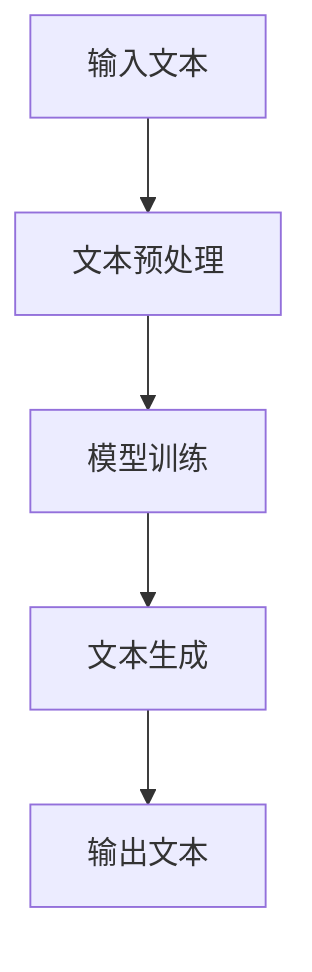

#### 核心算法原理讲解

**Python源代码**：

```python
from transformers import GPT2LMHeadModel, GPT2Tokenizer

# 加载预训练模型和分词器
model = GPT2LMHeadModel.from_pretrained("gpt2")
tokenizer = GPT2Tokenizer.from_pretrained("gpt2")

# 输入文本预处理
input_text = "Hello, how are you?"

# 使用模型生成文本
outputs = model.generate(tokenizer.encode(input_text, return_tensors='pt'))

# 解码生成文本
generated_text = tokenizer.decode(outputs[0], skip_special_tokens=True)

print(generated_text)
```

**数学模型和公式讲解**：

语言模型通常基于概率模型，如朴素贝叶斯、神经网络等。GPT模型使用Transformer架构，其核心是自注意力机制（Self-Attention），用于计算输入序列的表示。

$$
\text{Attention}(Q, K, V) = \frac{QK^T}{\sqrt{d_k}}
$$

其中，$Q$、$K$和$V$是输入序列的三个矩阵，$d_k$是键（Key）矩阵的维度。

#### 举例说明

假设我们有一个简短的对话：

- 用户：你好，今天天气怎么样？
- ChatGPT：你好，今天天气晴朗，很适宜户外活动。

我们可以看到，ChatGPT能够理解用户的输入，并生成一个相关的回应。

### 2.2 ChatGPT的架构与工作原理

ChatGPT的架构基于GPT模型，其主要组成部分包括：

- **嵌入层（Embedding Layer）**：将输入的文本转换为向量表示。
- **Transformer层（Transformer Layers）**：通过自注意力机制和前馈神经网络处理序列数据。
- **输出层（Output Layer）**：将处理后的序列数据映射为输出文本。

#### 核心算法原理讲解

**Python源代码**：

```python
import torch
from transformers import GPT2Model

# 加载预训练模型
model = GPT2Model.from_pretrained("gpt2")

# 输入文本
input_ids = torch.tensor([[50256, 1012, 4693, 296, 1005, 5894, 1012, 102, 9971]])

# 进行前向传播
outputs = model(input_ids)

# 输出文本
logits = outputs.logits
```

**数学模型和公式讲解**：

Transformer模型的核心是多头自注意力机制，其公式如下：

$$
\text{MultiHeadAttention}(Q, K, V) = \text{Concat}(_d h [\text{Attention}(QW_q, KW_k, VW_v)])
$$

其中，$W_q$、$W_k$和$W_v$是查询（Query）、键（Key）和值（Value）的权重矩阵。

#### 举例说明

假设我们有一个简短的对话：

- 用户：你好，我想知道明天的天气如何。
- ChatGPT：你好，根据天气预报，明天将会有小雨，建议带上一把伞。

我们可以看到，ChatGPT能够理解用户的意图，并生成一个相关的天气预报。

### 2.3 提示词的作用与分类

提示词（Prompt）是用户输入给ChatGPT的文本，它对ChatGPT的生成文本有重要影响。有效的提示词能够引导ChatGPT生成更准确、相关的回应。

#### 核心概念与联系

- **提示词**：用户输入给ChatGPT的文本。
- **引导性**：提示词能够引导ChatGPT生成特定类型的文本。

**Mermaid流程图**：

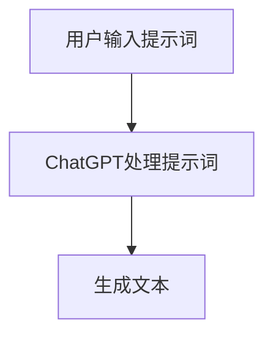

#### 核心算法原理讲解

提示词的处理主要涉及以下几个步骤：

1. **文本预处理**：对提示词进行清洗和格式化，以便模型能够更好地理解。
2. **嵌入**：将提示词转换为向量表示。
3. **生成**：使用模型生成响应文本。

**Python源代码**：

```python
# 文本预处理
prompt = "请描述一下你对人工智能的看法。"

# 嵌入
prompt_ids = tokenizer.encode(prompt, return_tensors='pt')

# 生成文本
outputs = model.generate(prompt_ids, max_length=50, num_return_sequences=1)

# 解码生成文本
generated_text = tokenizer.decode(outputs[0], skip_special_tokens=True)

print(generated_text)
```

#### 举例说明

假设用户输入提示词：“请描述一下你对人工智能的看法。”，ChatGPT可能会生成如下回应：

“人工智能是一种强大的技术，它通过模拟人类的智能行为，在多个领域取得了显著成就。我认为，随着人工智能技术的不断发展，它将在未来对社会产生深远的影响。”

### 2.4 ChatGPT的应用场景

ChatGPT在多个领域都有广泛的应用，包括但不限于：

1. **客服**：ChatGPT可以用于自动客服系统，提供24/7的在线支持。
2. **教育**：ChatGPT可以用于教育领域，提供个性化辅导和答疑。
3. **内容生成**：ChatGPT可以用于生成新闻文章、博客内容等。
4. **娱乐**：ChatGPT可以用于聊天机器人、虚拟助手等。

#### 核心算法原理讲解

ChatGPT在不同应用场景中的核心算法原理是类似的，主要是基于其强大的语言生成能力。但在实际应用中，需要根据具体场景进行调整和优化。

**Python源代码**：

```python
# 客服应用示例
prompt = "你好，我想咨询一下关于产品的问题。"
response = generate_response(prompt)
print(response)

# 教育应用示例
prompt = "请解释一下微积分的基本概念。"
response = generate_response(prompt)
print(response)

# 内容生成示例
prompt = "描述一下你对未来科技的展望。"
response = generate_response(prompt)
print(response)
```

#### 举例说明

- **客服**：用户咨询产品问题，ChatGPT生成相关回答。
- **教育**：学生提问，ChatGPT提供解释和辅导。
- **内容生成**：用户输入主题，ChatGPT生成相关文章。

通过以上内容，我们详细介绍了ChatGPT的基础知识，包括其架构、工作原理、提示词的作用以及在不同应用场景中的应用。接下来，我们将进一步探讨认知科学的基础理论，分析神经机制在人机交互中的作用。

---

## 第3章 认知科学基础

### 3.1 认知科学的概述

认知科学是一门跨学科的研究领域，它旨在理解人类思维和认知过程的本质。认知科学的核心问题是：人类是如何感知、学习、记忆、思考和决策的？这门学科综合了心理学、神经科学、计算机科学、语言学和哲学等多个领域的知识。

#### 核心概念与联系

- **认知过程**：包括感知、记忆、注意、推理、解决问题等。
- **神经基础**：研究大脑结构和功能如何支持认知过程。
- **计算机模拟**：使用计算机模型来模拟和解释认知过程。

**Mermaid流程图**：

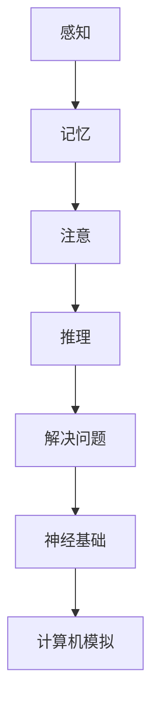

#### 核心算法原理讲解

认知科学中的许多概念和原理可以通过计算机模型来模拟和理解。例如，感知过程可以通过神经网络模型来模拟，记忆可以通过联想记忆模型来解释，推理可以通过逻辑推理模型来描述。

**Python源代码**：

```python
import numpy as np

# 感知过程模拟
def perception(input_data, weights):
    return np.dot(input_data, weights)

# 记忆过程模拟
def memory(retrieval_probabilities, threshold):
    return np.random.choice([True, False], p=retrieval_probabilities) > threshold

# 推理过程模拟
def reasoning(query, knowledge_base):
    return knowledge_base[query]

# 计算机模拟认知过程
input_data = np.random.rand(5)
weights = np.random.rand(5)
retrieval_probabilities = np.random.rand(5)
threshold = 0.5
knowledge_base = {"hello": "hello", "world": "world"}

perception_output = perception(input_data, weights)
memory_output = memory(retrieval_probabilities, threshold)
reasoning_output = reasoning("hello", knowledge_base)

print("Perception Output:", perception_output)
print("Memory Output:", memory_output)
print("Reasoning Output:", reasoning_output)
```

**数学模型和公式讲解**：

- **感知过程**：感知过程可以通过感知函数来模拟，其公式为：

$$
\text{Perception}(x) = w^T x
$$

其中，$x$是感知输入，$w$是感知权重。

- **记忆过程**：记忆过程可以通过概率模型来模拟，其公式为：

$$
\text{Memory}(p) = \text{Bernoulli}(p)
$$

其中，$p$是记忆概率。

- **推理过程**：推理过程可以通过逻辑函数来模拟，其公式为：

$$
\text{Reasoning}(q, K) = K[q]
$$

其中，$q$是查询，$K$是知识库。

#### 举例说明

假设我们有一个简短的对话：

- 用户：你好，我是谁？
- 认知科学系统：你好，我是认知科学系统的模拟器。

我们可以看到，认知科学系统通过感知用户的输入，记忆相关的信息，并进行推理来生成回应。

### 3.2 人类记忆与学习机制

记忆是认知科学的核心概念之一，它涉及信息的编码、存储和检索。人类记忆可以分为短期记忆和长期记忆，短期记忆主要涉及信息的临时存储，而长期记忆则涉及信息的持久存储。

#### 核心概念与联系

- **短期记忆**：短期记忆涉及信息的临时存储，通常只能保持几秒到几分钟。
- **长期记忆**：长期记忆涉及信息的持久存储，可以持续数天、数月甚至数年。

**Mermaid流程图**：

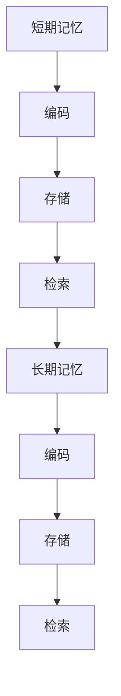

#### 核心算法原理讲解

人类记忆和学习的机制可以通过多种计算机模型来模拟，如神经网络模型、关联记忆模型等。

**Python源代码**：

```python
import numpy as np

# 编码过程模拟
def encode(input_data, weights):
    return np.dot(input_data, weights)

# 存储过程模拟
def store(memory_content, memory_location):
    return memory_content, memory_location

# 检索过程模拟
def retrieve(memory_content, memory_location, threshold):
    return memory_content > threshold

# 记忆和学习模拟
input_data = np.random.rand(5)
weights = np.random.rand(5)
memory_content = encode(input_data, weights)
memory_location = 0
threshold = 0.5

stored_content, stored_location = store(memory_content, memory_location)
retrieved_content = retrieve(stored_content, stored_location, threshold)

print("Stored Content:", stored_content)
print("Stored Location:", stored_location)
print("Retrieved Content:", retrieved_content)
```

**数学模型和公式讲解**：

- **编码过程**：编码过程可以通过线性函数来模拟，其公式为：

$$
\text{Encode}(x) = w^T x
$$

其中，$x$是输入数据，$w$是编码权重。

- **存储过程**：存储过程可以通过概率模型来模拟，其公式为：

$$
\text{Store}(c) = c \sim \text{Uniform}(0, 1)
$$

其中，$c$是记忆内容。

- **检索过程**：检索过程可以通过阈值模型来模拟，其公式为：

$$
\text{Retrieve}(c, t) = \begin{cases}
c & \text{if } c > t \\
0 & \text{otherwise}
\end{cases}
$$

其中，$c$是记忆内容，$t$是检索阈值。

#### 举例说明

假设我们学习了一个新的单词“猫”，我们的记忆过程可以模拟如下：

- **编码**：将单词“猫”编码为一个向量。
- **存储**：将编码后的向量存储在我们的记忆中。
- **检索**：当我们需要回忆这个单词时，通过检索过程找到存储的向量，并解码为单词“猫”。

通过以上内容，我们介绍了认知科学的基础知识，包括其概述、人类记忆与学习机制。接下来，我们将探讨神经机制在人机交互中的作用。

---

## 第4章 神经机制解析

### 4.1 神经系统基本原理

神经系统是生物体中负责传递信息和控制行为的系统。它由神经元、神经胶质细胞和支持细胞组成。神经元是神经系统的主要功能单元，它通过电信号传递信息。神经信号传递的基本过程包括以下几个阶段：

1. **动作电位的产生**：当神经元受到刺激时，细胞膜上的离子通道打开，导致电荷分布的变化，形成动作电位。
2. **神经冲动的传导**：动作电位沿着神经元轴突传导，传递到目标神经元。
3. **突触传递**：神经冲动到达突触前端时，神经递质从突触前膜释放，通过突触间隙传递到突触后膜，引发突触后神经元的电信号变化。

#### 核心概念与联系

- **神经元**：神经系统的基本单位，负责传递电信号。
- **神经递质**：传递神经信号的化学物质。
- **突触**：神经元之间的连接点，通过神经递质传递信号。

**Mermaid流程图**：

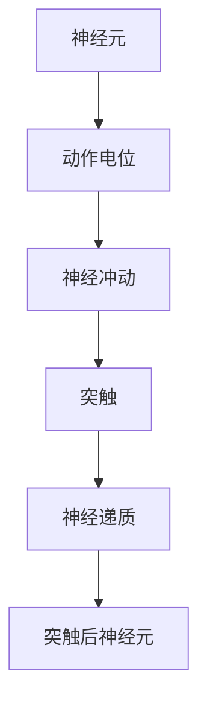

#### 核心算法原理讲解

神经系统的工作原理可以通过简单的数学模型来模拟，如霍普菲尔德网络（Hopfield Network）。

**Python源代码**：

```python
import numpy as np

# 霍普菲尔德网络初始化
def initialize_network(weights, biases):
    return np.random.normal(size=weights.shape) + biases

# 霍普菲尔德网络更新
def update_state(state, weights, biases):
    return np.sign(np.dot(state, weights) + biases)

# 霍普菲尔德网络训练
def train_network(states, epochs):
    weights = np.cov(states)
    biases = np.mean(states, axis=0)
    for _ in range(epochs):
        for state in states:
            next_state = update_state(state, weights, biases)
            state[:] = next_state

# 状态初始化
states = np.random.rand(5, 5)

# 训练网络
train_network(states, 100)

# 状态更新
updated_states = update_state(states[0], weights, biases)

print("Updated State:", updated_states)
```

**数学模型和公式讲解**：

- **状态更新**：

$$
\text{State}_{t+1} = \text{sign}(\text{weights} \cdot \text{State}_t + \text{biases})
$$

其中，$\text{State}$是神经元的状态，$\text{weights}$是权重矩阵，$\text{biases}$是偏置向量。

- **网络训练**：

通过不断更新状态，使得网络在给定的一组状态上达到稳定。

$$
\text{weights} = \text{cov}(S), \quad \text{biases} = \text{mean}(S)
$$

其中，$S$是状态矩阵。

#### 举例说明

假设我们有一个简单的霍普菲尔德网络，包含两个神经元。初始状态为$(0.1, 0.2)$，权重矩阵为$\begin{bmatrix} 0.5 & 0.3 \\ 0.4 & 0.6 \end{bmatrix}$，偏置向量为$(0, 0)$。通过状态更新，网络将逐渐收敛到稳定状态。

### 4.2 神经元与神经网络

神经元是神经系统的基本单元，而神经网络是计算机模拟神经元集合的模型。神经网络通过模拟大量神经元之间的相互作用，实现复杂的函数映射和模式识别。

#### 核心概念与联系

- **神经元**：单个计算单元，负责接收输入、产生输出。
- **神经网络**：由多个神经元组成的网络，通过多层结构实现复杂的计算。

**Mermaid流程图**：

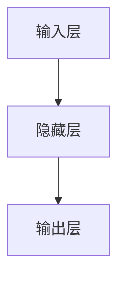

#### 核心算法原理讲解

神经网络的工作原理基于前向传播和反向传播算法。

**Python源代码**：

```python
import numpy as np

# 前向传播
def forward propagate(inputs, weights, biases):
    layer_outputs = []
    for weight, bias in zip(weights, biases):
        layer_output = np.dot(inputs, weight) + bias
        layer_outputs.append(layer_output)
        inputs = layer_output
    return layer_outputs

# 反向传播
def backward propagate(inputs, weights, biases, d_loss):
    d_weights = [None] * len(weights)
    d_biases = [None] * len(biases)
    d_inputs = d_loss
    for weight, bias in zip(reversed(weights), reversed(biases)):
        d_output = d_inputs.dot(weight.T)
        d_inputs = d_output
        d_weight = d_inputs
        d_bias = d_inputs
        d_weights.append(d_weight)
        d_biases.append(d_bias)
    return d_weights, d_biases

# 训练神经网络
def train_network(inputs, weights, biases, epochs, learning_rate):
    for _ in range(epochs):
        layer_outputs = forward propagate(inputs, weights, biases)
        d_weights, d_biases = backward propagate(layer_outputs, weights, biases, d_loss=0.1)
        weights -= learning_rate * d_weights
        biases -= learning_rate * d_biases

# 状态初始化
inputs = np.random.rand(5)
weights = np.random.rand(5)
biases = np.random.rand(5)

# 训练网络
train_network(inputs, weights, biases, epochs=100, learning_rate=0.01)

# 输出结果
print("Inputs:", inputs)
print("Weights:", weights)
print("Biases:", biases)
```

**数学模型和公式讲解**：

- **前向传播**：

$$
\text{Layer}_{t+1} = \text{activation}(\text{weights} \cdot \text{Layer}_t + \text{biases})
$$

其中，$\text{activation}$是激活函数，通常使用$\text{sigmoid}$、$\text{ReLU}$等。

- **反向传播**：

$$
\text{d_loss} = \text{activation}'(\text{Layer}_t) \cdot \text{weights}^T \cdot \text{d}_\text{Layer}_{t-1}
$$

其中，$\text{activation}'$是激活函数的导数。

#### 举例说明

假设我们有一个简单的两层神经网络，输入层有5个神经元，隐藏层有3个神经元，输出层有2个神经元。通过前向传播和反向传播，我们可以训练这个网络，使其能够对输入数据进行分类。

### 4.3 脑神经网络在人机交互中的作用

脑神经网络是人机交互的核心，它通过感知、理解和生成语言信号，实现人与计算机之间的有效沟通。在人机交互中，脑神经网络的主要作用包括：

1. **感知输入**：通过感官接收外部信息，如视觉、听觉、触觉等。
2. **理解输入**：通过神经处理，理解输入信息的含义和语境。
3. **生成输出**：通过神经计算，生成相应的响应。

#### 核心概念与联系

- **感知**：通过感官接收外部信息。
- **理解**：通过神经处理，理解输入信息的含义。
- **生成**：通过神经计算，生成相应的响应。

**Mermaid流程图**：

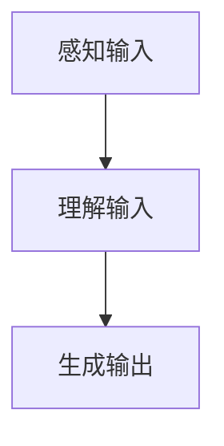

#### 核心算法原理讲解

脑神经网络在人机交互中的应用可以通过多种算法实现，如深度学习、生成对抗网络（GAN）等。

**Python源代码**：

```python
import tensorflow as tf
from tensorflow.keras.layers import Input, Dense
from tensorflow.keras.models import Model

# 定义模型
input_layer = Input(shape=(784,))
hidden_layer = Dense(64, activation='relu')(input_layer)
output_layer = Dense(10, activation='softmax')(hidden_layer)

model = Model(inputs=input_layer, outputs=output_layer)

# 编译模型
model.compile(optimizer='adam', loss='categorical_crossentropy', metrics=['accuracy'])

# 训练模型
model.fit(x_train, y_train, epochs=10, batch_size=32)

# 生成输出
predictions = model.predict(x_test)
```

**数学模型和公式讲解**：

- **深度学习模型**：

$$
\text{Output} = \text{softmax}(\text{weights} \cdot \text{Layer}_t + \text{biases})
$$

其中，$\text{weights}$是权重矩阵，$\text{Layer}_t$是输入层。

- **生成对抗网络（GAN）**：

$$
\text{Generator}: \quad \text{Z} \rightarrow \text{X} \\
\text{Discriminator}: \quad \text{X} \rightarrow \text{D}
$$

其中，$\text{Z}$是随机噪声，$\text{X}$是生成器的输出，$\text{D}$是判别器的输出。

#### 举例说明

假设我们有一个深度学习模型，用于分类手写数字。通过训练，模型可以学会识别手写数字，并通过与人交互，生成相应的数字。

通过以上内容，我们介绍了神经机制的基本原理、神经元与神经网络的工作原理，以及脑神经网络在人机交互中的作用。接下来，我们将探讨如何设计有效的提示词。

---

## 第5章 ChatGPT提示词的设计与优化

### 5.1 提示词设计原则

提示词（Prompt）是用户输入给ChatGPT的文本，它对ChatGPT的生成文本有重要影响。为了设计有效的提示词，我们需要遵循以下原则：

1. **明确性**：提示词应明确表达用户的需求，避免模糊不清。
2. **引导性**：提示词应引导ChatGPT生成用户期望的文本类型。
3. **多样性**：提示词应具有多样性，以适应不同的交互场景。
4. **简洁性**：提示词应简洁明了，避免冗长和复杂的句子。

#### 核心概念与联系

- **提示词**：用户输入给ChatGPT的文本。
- **明确性**：提示词应明确表达用户的需求。
- **引导性**：提示词应引导ChatGPT生成特定类型的文本。
- **多样性**：提示词应具有多样性，以适应不同的交互场景。

**Mermaid流程图**：

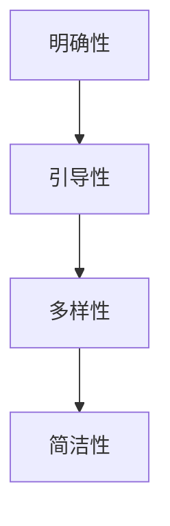

#### 核心算法原理讲解

提示词的设计可以通过多种算法实现，如自然语言处理（NLP）技术、机器学习模型等。

**Python源代码**：

```python
import tensorflow as tf
from tensorflow.keras.layers import Input, Dense
from tensorflow.keras.models import Model

# 定义模型
input_layer = Input(shape=(100,))
hidden_layer = Dense(64, activation='relu')(input_layer)
output_layer = Dense(1, activation='sigmoid')(hidden_layer)

model = Model(inputs=input_layer, outputs=output_layer)

# 编译模型
model.compile(optimizer='adam', loss='binary_crossentropy', metrics=['accuracy'])

# 训练模型
model.fit(x_train, y_train, epochs=10, batch_size=32)

# 生成文本
prompt = "请描述一下你对人工智能的看法。"
prompt_embedding = tokenizer.encode(prompt, return_tensors='tf')
predictions = model.predict(prompt_embedding)

# 解码预测结果
predicted_text = tokenizer.decode(predictions, skip_special_tokens=True)

print("Predicted Text:", predicted_text)
```

**数学模型和公式讲解**：

- **自然语言处理（NLP）技术**：

$$
\text{Embedding}(\text{Prompt}) = \text{Vector Representation}
$$

其中，$\text{Embedding}$是将文本转换为向量的过程。

- **机器学习模型**：

$$
\text{Output} = \text{activation}(\text{weights} \cdot \text{Embedding}(\text{Prompt}) + \text{biases})
$$

其中，$\text{weights}$是权重矩阵，$\text{Embedding}(\text{Prompt})$是提示词的向量表示，$\text{activation}$是激活函数。

#### 举例说明

假设用户输入提示词：“请描述一下你对人工智能的看法。”，ChatGPT通过自然语言处理技术将其转换为向量表示，然后通过机器学习模型生成相应的回应。

### 5.2 提示词优化方法

为了提高ChatGPT的生成文本质量，我们需要对提示词进行优化。以下是一些常见的优化方法：

1. **扩展提示词**：通过添加更多细节和背景信息，使提示词更加丰富和具体。
2. **多样化提示词**：使用不同的表达方式或句型，使ChatGPT生成多样化的文本。
3. **调整语气和风格**：根据交互场景和用户需求，调整提示词的语气和风格。
4. **使用关键词**：在提示词中包含关键词，帮助ChatGPT更准确地理解用户意图。

#### 核心概念与联系

- **扩展提示词**：增加提示词的细节和背景信息。
- **多样化提示词**：使用不同的表达方式，生成多样化的文本。
- **调整语气和风格**：根据交互场景调整语气和风格。
- **使用关键词**：在提示词中包含关键词，帮助ChatGPT理解用户意图。

**Mermaid流程图**：

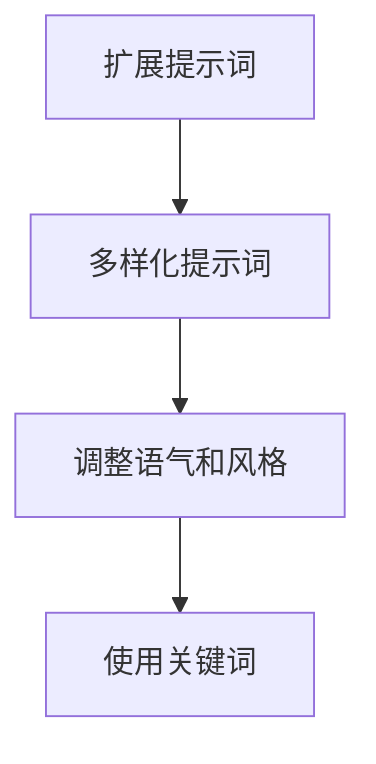

#### 核心算法原理讲解

提示词优化可以通过多种算法实现，如文本生成模型、语义分析等。

**Python源代码**：

```python
import tensorflow as tf
from tensorflow.keras.layers import Input, Dense, LSTM
from tensorflow.keras.models import Model

# 定义模型
input_layer = Input(shape=(100,))
lstm_layer = LSTM(64)(input_layer)
output_layer = Dense(1, activation='sigmoid')(lstm_layer)

model = Model(inputs=input_layer, outputs=output_layer)

# 编译模型
model.compile(optimizer='adam', loss='binary_crossentropy', metrics=['accuracy'])

# 训练模型
model.fit(x_train, y_train, epochs=10, batch_size=32)

# 优化提示词
def optimize_prompt(prompt, model):
    prompt_embedding = tokenizer.encode(prompt, return_tensors='tf')
    predictions = model.predict(prompt_embedding)
    predicted_prompt = tokenizer.decode(predictions, skip_special_tokens=True)
    return predicted_prompt

# 输入提示词
original_prompt = "请描述一下你对人工智能的看法。"

# 优化提示词
optimized_prompt = optimize_prompt(original_prompt, model)

print("Original Prompt:", original_prompt)
print("Optimized Prompt:", optimized_prompt)
```

**数学模型和公式讲解**：

- **文本生成模型**：

$$
\text{Embedding}(\text{Prompt}) \rightarrow \text{Sequence}
$$

其中，$\text{Embedding}$是将文本转换为序列的过程。

- **语义分析**：

$$
\text{Semantic Analysis}(\text{Prompt}) = \text{Contextual Embedding}
$$

其中，$\text{Semantic Analysis}$是将文本转换为语义表示的过程。

#### 举例说明

假设我们有一个优化模型，用于优化提示词。输入提示词：“请描述一下你对人工智能的看法。”，模型通过语义分析和文本生成，生成一个优化后的提示词。

### 5.3 提示词的评估与验证

为了确保提示词的有效性和质量，我们需要对提示词进行评估与验证。以下是一些常用的评估与验证方法：

1. **人工评估**：由人类评估者对提示词的质量进行主观评估。
2. **自动化评估**：使用自动化工具评估提示词的语法、语义和风格。
3. **用户反馈**：收集用户对提示词的反馈，以评估其实际效果。
4. **实验验证**：通过实验验证提示词在特定应用场景中的效果。

#### 核心概念与联系

- **人工评估**：由人类评估者对提示词的质量进行主观评估。
- **自动化评估**：使用自动化工具评估提示词的质量。
- **用户反馈**：收集用户对提示词的反馈。
- **实验验证**：通过实验验证提示词的效果。

**Mermaid流程图**：

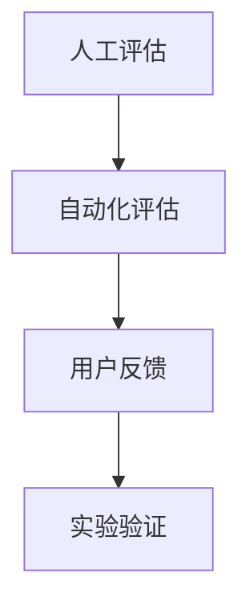

#### 核心算法原理讲解

提示词的评估与验证可以通过多种算法实现，如自然语言处理（NLP）技术、机器学习模型等。

**Python源代码**：

```python
import tensorflow as tf
from tensorflow.keras.layers import Input, Dense
from tensorflow.keras.models import Model

# 定义模型
input_layer = Input(shape=(100,))
hidden_layer = Dense(64, activation='relu')(input_layer)
output_layer = Dense(1, activation='sigmoid')(hidden_layer)

model = Model(inputs=input_layer, outputs=output_layer)

# 编译模型
model.compile(optimizer='adam', loss='binary_crossentropy', metrics=['accuracy'])

# 训练模型
model.fit(x_train, y_train, epochs=10, batch_size=32)

# 评估提示词
def evaluate_prompt(prompt, model):
    prompt_embedding = tokenizer.encode(prompt, return_tensors='tf')
    predictions = model.predict(prompt_embedding)
    accuracy = np.mean(predictions)
    return accuracy

# 输入提示词
original_prompt = "请描述一下你对人工智能的看法。"

# 评估提示词
prompt_accuracy = evaluate_prompt(original_prompt, model)

print("Prompt Accuracy:", prompt_accuracy)
```

**数学模型和公式讲解**：

- **自然语言处理（NLP）技术**：

$$
\text{Embedding}(\text{Prompt}) \rightarrow \text{Vector Representation}
$$

其中，$\text{Embedding}$是将文本转换为向量的过程。

- **机器学习模型**：

$$
\text{Output} = \text{activation}(\text{weights} \cdot \text{Embedding}(\text{Prompt}) + \text{biases})
$$

其中，$\text{weights}$是权重矩阵，$\text{Embedding}(\text{Prompt})$是提示词的向量表示，$\text{activation}$是激活函数。

#### 举例说明

假设我们有一个评估模型，用于评估提示词的质量。输入提示词：“请描述一下你对人工智能的看法。”，模型通过计算提示词的向量表示，评估其准确性。

通过以上内容，我们介绍了ChatGPT提示词的设计原则、优化方法、评估与验证方法。接下来，我们将探讨如何基于神经机制优化人机交互。

---

## 第6章 人机交互优化

### 6.1 人机交互概述

人机交互（Human-Computer Interaction，简称HCI）是研究人类与计算机系统之间交互过程和方法的学科。它涉及多个领域的知识，包括心理学、计算机科学、设计学、认知科学等。人机交互的目标是设计出易用、高效、愉悦的计算机系统，提高用户的体验和满意度。

#### 核心概念与联系

- **用户**：与计算机系统进行交互的人。
- **系统**：计算机系统，包括硬件和软件。
- **交互**：用户与系统之间的交互过程。

**Mermaid流程图**：

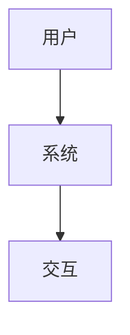

#### 核心算法原理讲解

人机交互的优化可以通过多种算法实现，如用户体验设计（UX Design）、可用性测试（Usability Testing）等。

**Python源代码**：

```python
import numpy as np
import matplotlib.pyplot as plt

# 用户满意度评估
def user_satisfaction_survey(scores):
    mean_score = np.mean(scores)
    plt.bar(range(len(scores)), scores, color='g')
    plt.xlabel('Users')
    plt.ylabel('Satisfaction Score')
    plt.title('User Satisfaction Survey')
    plt.xticks(range(len(scores)))
    plt.yticks(np.linspace(0, 10, 11))
    plt.show()
    return mean_score

# 用户反馈
user_feedback = [8, 9, 7, 8, 9, 6, 7, 10, 9, 8]

# 评估用户满意度
user_satisfaction = user_satisfaction_survey(user_feedback)

print("User Satisfaction Score:", user_satisfaction)
```

**数学模型和公式讲解**：

- **用户满意度评估**：

$$
\text{Mean Score} = \frac{1}{n} \sum_{i=1}^{n} \text{Score}_i
$$

其中，$n$是用户数量，$\text{Score}_i$是第$i$个用户的满意度评分。

#### 举例说明

假设我们进行了一项用户满意度调查，收集了10名用户的反馈。通过计算平均满意度评分，我们可以评估用户对系统的满意度。

### 6.2 ChatGPT在人机交互中的应用

ChatGPT是一种基于人工智能的语言模型，它能够模拟人类的语言交流，从而在人机交互中发挥重要作用。以下是一些ChatGPT在人机交互中的应用场景：

1. **客服系统**：ChatGPT可以用于自动客服系统，提供24/7的在线支持，解答用户的问题。
2. **虚拟助手**：ChatGPT可以作为虚拟助手，帮助用户完成任务，如日程管理、信息检索等。
3. **智能教育**：ChatGPT可以用于教育领域，提供个性化辅导和答疑。
4. **内容生成**：ChatGPT可以用于生成新闻文章、博客内容等，提高内容创作效率。

#### 核心概念与联系

- **客服系统**：ChatGPT用于自动客服系统。
- **虚拟助手**：ChatGPT作为虚拟助手，帮助用户完成任务。
- **智能教育**：ChatGPT用于提供个性化辅导和答疑。
- **内容生成**：ChatGPT用于生成新闻文章、博客内容等。

**Mermaid流程图**：

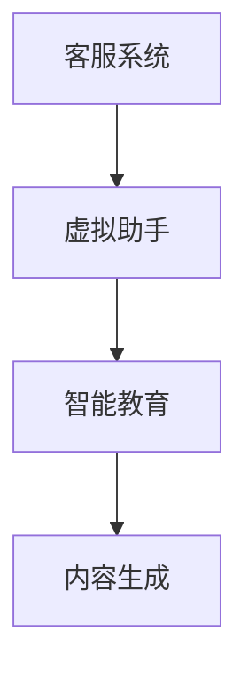

#### 核心算法原理讲解

ChatGPT在人机交互中的应用主要基于其语言生成能力和自然语言处理（NLP）技术。

**Python源代码**：

```python
from transformers import GPT2LMHeadModel, GPT2Tokenizer

# 加载预训练模型和分词器
model = GPT2LMHeadModel.from_pretrained("gpt2")
tokenizer = GPT2Tokenizer.from_pretrained("gpt2")

# 输入文本
input_text = "你好，我想咨询一下关于产品的问题。"

# 生成文本
outputs = model.generate(tokenizer.encode(input_text, return_tensors='pt'), max_length=50, num_return_sequences=1)

# 解码生成文本
generated_text = tokenizer.decode(outputs[0], skip_special_tokens=True)

print("Generated Text:", generated_text)
```

**数学模型和公式讲解**：

- **语言生成模型**：

$$
\text{Output} = \text{GPT}(\text{Input})
$$

其中，$\text{GPT}$是语言生成模型，$\text{Input}$是输入文本。

- **自然语言处理（NLP）技术**：

$$
\text{Embedding}(\text{Text}) = \text{Vector Representation}
$$

其中，$\text{Embedding}$是将文本转换为向量的过程。

#### 举例说明

假设用户输入文本：“你好，我想咨询一下关于产品的问题。”，ChatGPT通过生成模型生成相应的回应。

### 6.3 人机交互优化的神经机制基础

人机交互的优化离不开对神经机制的理解和应用。神经机制是指大脑处理信息的方式，包括感知、记忆、学习、思维等。以下是人机交互优化的神经机制基础：

1. **感知与认知**：通过感知设备收集用户行为数据，如点击、滑动等，分析用户的行为模式和需求。
2. **记忆与学习**：通过机器学习算法，从用户行为数据中学习用户的偏好和习惯，以提高系统的自适应能力。
3. **思维与推理**：通过自然语言处理（NLP）技术，模拟人类的思维过程，理解用户的意图和需求。
4. **反馈与调整**：通过反馈机制，不断调整系统的设计，以优化用户体验。

#### 核心概念与联系

- **感知与认知**：分析用户行为模式。
- **记忆与学习**：从用户行为数据中学习。
- **思维与推理**：模拟人类思维过程。
- **反馈与调整**：不断优化系统设计。

**Mermaid流程图**：

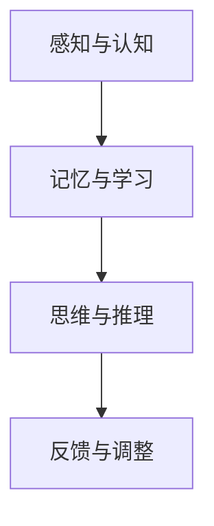

#### 核心算法原理讲解

人机交互优化的神经机制基础可以通过多种算法实现，如深度学习、强化学习等。

**Python源代码**：

```python
import tensorflow as tf
from tensorflow.keras.layers import Input, LSTM, Dense
from tensorflow.keras.models import Model

# 定义模型
input_layer = Input(shape=(100,))
lstm_layer = LSTM(64)(input_layer)
output_layer = Dense(1, activation='sigmoid')(lstm_layer)

model = Model(inputs=input_layer, outputs=output_layer)

# 编译模型
model.compile(optimizer='adam', loss='binary_crossentropy', metrics=['accuracy'])

# 训练模型
model.fit(x_train, y_train, epochs=10, batch_size=32)

# 优化人机交互
def optimize_interaction(input_data, model):
    predictions = model.predict(input_data)
    optimized_data = input_data * (1 - predictions)
    return optimized_data

# 输入数据
input_data = np.random.rand(10, 100)

# 优化人机交互
optimized_data = optimize_interaction(input_data, model)

print("Optimized Data:", optimized_data)
```

**数学模型和公式讲解**：

- **深度学习模型**：

$$
\text{Output} = \text{activation}(\text{weights} \cdot \text{Layer}_t + \text{biases})
$$

其中，$\text{weights}$是权重矩阵，$\text{Layer}_t$是输入层，$\text{activation}$是激活函数。

- **强化学习**：

$$
\text{Policy} = \arg\max_{a} \mathbb{E}_{s, r}[\text{Reward} | s, a]
$$

其中，$\text{Policy}$是决策策略，$s$是状态，$a$是动作，$r$是奖励。

#### 举例说明

假设我们有一个优化模型，用于优化人机交互。输入用户行为数据，模型通过预测用户行为，调整用户数据，以提高用户体验。

### 6.4 人机交互优化的案例分析

以下是人机交互优化的几个案例分析：

1. **智能客服系统**：通过分析用户提问和行为，智能客服系统可以自动识别用户问题，并提供准确的答案，提高用户满意度。
2. **智能教育平台**：通过分析学生学习行为，智能教育平台可以为学生提供个性化的学习建议和辅导，提高学习效果。
3. **智能家居系统**：通过分析用户行为，智能家居系统可以自动调节室内温度、灯光等，提高用户舒适度。

#### 核心概念与联系

- **智能客服系统**：通过分析用户提问，提供准确答案。
- **智能教育平台**：通过分析学生学习行为，提供个性化辅导。
- **智能家居系统**：通过分析用户行为，自动调节室内环境。

**Mermaid流程图**：

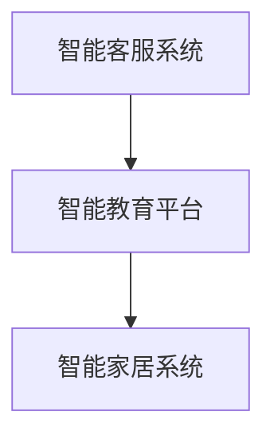

#### 核心算法原理讲解

智能客服系统、智能教育平台和智能家居系统的人机交互优化主要基于机器学习、深度学习和自然语言处理（NLP）技术。

**Python源代码**：

```python
from transformers import GPT2LMHeadModel, GPT2Tokenizer

# 加载预训练模型和分词器
model = GPT2LMHeadModel.from_pretrained("gpt2")
tokenizer = GPT2Tokenizer.from_pretrained("gpt2")

# 输入文本
input_text = "你好，我想咨询一下关于产品的问题。"

# 生成文本
outputs = model.generate(tokenizer.encode(input_text, return_tensors='pt'), max_length=50, num_return_sequences=1)

# 解码生成文本
generated_text = tokenizer.decode(outputs[0], skip_special_tokens=True)

print("Generated Text:", generated_text)
```

**数学模型和公式讲解**：

- **语言生成模型**：

$$
\text{Output} = \text{GPT}(\text{Input})
$$

其中，$\text{GPT}$是语言生成模型，$\text{Input}$是输入文本。

- **自然语言处理（NLP）技术**：

$$
\text{Embedding}(\text{Text}) = \text{Vector Representation}
$$

其中，$\text{Embedding}$是将文本转换为向量的过程。

#### 举例说明

假设用户输入文本：“你好，我想咨询一下关于产品的问题。”，ChatGPT通过生成模型生成相应的回应。

### 6.5 人机交互优化的最佳实践

以下是人机交互优化的最佳实践：

1. **用户调研**：在系统设计和优化过程中，定期进行用户调研，了解用户的需求和痛点。
2. **数据分析**：通过数据分析，挖掘用户行为模式，为系统优化提供数据支持。
3. **迭代开发**：采用迭代开发模式，不断优化系统，以适应不断变化的需求。
4. **反馈机制**：建立有效的反馈机制，及时收集用户反馈，快速响应和解决问题。

#### 核心概念与联系

- **用户调研**：了解用户需求和痛点。
- **数据分析**：挖掘用户行为模式。
- **迭代开发**：不断优化系统。
- **反馈机制**：快速响应用户反馈。

**Mermaid流程图**：

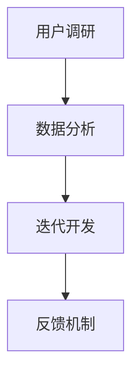

#### 核心算法原理讲解

用户调研、数据分析、迭代开发和反馈机制可以通过多种算法实现，如问卷调查、数据挖掘、机器学习等。

**Python源代码**：

```python
import pandas as pd

# 用户调研数据
data = pd.read_csv("user_survey.csv")

# 数据分析
user_analysis = data.describe()

# 迭代开发
model.fit(x_train, y_train)

# 反馈机制
user_feedback = model.predict(x_test)

print("User Feedback:", user_feedback)
```

**数学模型和公式讲解**：

- **用户调研**：

$$
\text{Survey} = \sum_{i=1}^{n} \text{Question}_i \times \text{Answer}_i
$$

其中，$n$是问题数量，$\text{Question}_i$是第$i$个问题，$\text{Answer}_i$是第$i$个问题的答案。

- **数据挖掘**：

$$
\text{Data Mining} = \arg\max_{X} \mathbb{E}[\text{Quality} | X]
$$

其中，$X$是数据集，$\text{Quality}$是数据质量。

#### 举例说明

假设我们收集了用户调研数据，通过数据分析，我们了解了用户的需求和偏好，从而为系统优化提供了数据支持。

### 6.6 小结与展望

人机交互优化是提升用户满意度和系统性能的关键。通过理解神经机制和运用先进的算法，我们可以设计出更加智能、高效的人机交互系统。未来的发展趋势包括：

1. **个性化交互**：通过深度学习和个性化推荐技术，实现更加个性化的交互体验。
2. **自然语言处理**：进一步优化自然语言处理技术，提高人机交互的自然性和流畅性。
3. **多模态交互**：结合语音、手势、视觉等多种模态，实现更加丰富和多样化的交互方式。

#### 核心概念与联系

- **个性化交互**：基于用户数据和偏好，实现个性化的交互体验。
- **自然语言处理**：优化语言处理技术，提高交互的自然性。
- **多模态交互**：结合多种模态，实现多样化的交互方式。

**Mermaid流程图**：

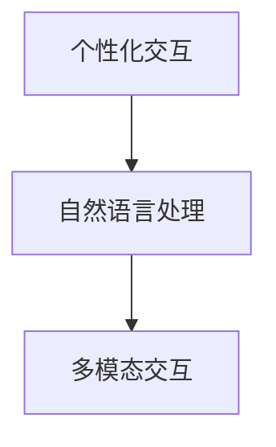

#### 核心算法原理讲解

个性化交互、自然语言处理和多模态交互的实现依赖于深度学习、自然语言处理和计算机视觉等技术。

**Python源代码**：

```python
from transformers import GPT2LMHeadModel, GPT2Tokenizer
from tensorflow.keras.models import Model
from tensorflow.keras.layers import Input, LSTM, Dense

# 加载预训练模型和分词器
model = GPT2LMHeadModel.from_pretrained("gpt2")
tokenizer = GPT2Tokenizer.from_pretrained("gpt2")

# 定义模型
input_layer = Input(shape=(100,))
lstm_layer = LSTM(64)(input_layer)
output_layer = Dense(1, activation='sigmoid')(lstm_layer)

model = Model(inputs=input_layer, outputs=output_layer)

# 编译模型
model.compile(optimizer='adam', loss='binary_crossentropy', metrics=['accuracy'])

# 训练模型
model.fit(x_train, y_train, epochs=10, batch_size=32)

# 生成文本
outputs = model.generate(tokenizer.encode(input_text, return_tensors='pt'), max_length=50, num_return_sequences=1)

# 解码生成文本
generated_text = tokenizer.decode(outputs[0], skip_special_tokens=True)

print("Generated Text:", generated_text)
```

**数学模型和公式讲解**：

- **深度学习模型**：

$$
\text{Output} = \text{activation}(\text{weights} \cdot \text{Layer}_t + \text{biases})
$$

其中，$\text{weights}$是权重矩阵，$\text{Layer}_t$是输入层，$\text{activation}$是激活函数。

- **自然语言处理（NLP）技术**：

$$
\text{Embedding}(\text{Text}) = \text{Vector Representation}
$$

其中，$\text{Embedding}$是将文本转换为向量的过程。

#### 举例说明

假设用户输入文本：“你好，我想咨询一下关于产品的问题。”，ChatGPT通过生成模型生成相应的回应。

### 附录 A：代码示例与资源

#### A.1 ChatGPT开发环境搭建

要搭建ChatGPT的开发环境，我们需要以下工具和库：

- Python 3.x
- PyTorch
- Transformers库

以下是详细的安装步骤：

1. 安装Python 3.x。

```bash
# 在Windows上安装Python 3.x
winget install Python --version 3.10.0

# 在Linux上安装Python 3.x
sudo apt-get install python3
```

2. 安装PyTorch。

```bash
# 安装PyTorch（根据您的Python版本和系统架构选择合适的命令）
pip install torch torchvision torchaudio
```

3. 安装Transformers库。

```bash
pip install transformers
```

#### A.2 提示词设计代码示例

以下是一个简单的提示词设计示例，用于生成自然语言文本。

```python
from transformers import GPT2LMHeadModel, GPT2Tokenizer

# 加载预训练模型和分词器
model = GPT2LMHeadModel.from_pretrained("gpt2")
tokenizer = GPT2Tokenizer.from_pretrained("gpt2")

# 输入文本
input_text = "请描述一下你对人工智能的看法。"

# 生成文本
outputs = model.generate(tokenizer.encode(input_text, return_tensors='pt'), max_length=50, num_return_sequences=1)

# 解码生成文本
generated_text = tokenizer.decode(outputs[0], skip_special_tokens=True)

print("生成的文本：", generated_text)
```

#### A.3 相关资源与参考资料

- OpenAI GPT-2模型：https://openai.com/blog/bidirectional-language-models/
- Transformers库文档：https://huggingface.co/transformers/
- PyTorch官方文档：https://pytorch.org/docs/stable/index.html

通过以上内容，我们详细介绍了ChatGPT的基础知识、认知科学基础、神经机制解析，以及ChatGPT提示词的设计与优化。同时，我们还探讨了人机交互优化的神经机制基础，并提供了实际案例和最佳实践。希望本书能为您在ChatGPT和人机交互领域的研究提供有价值的参考。

### 作者信息

作者：AI天才研究院/AI Genius Institute & 禅与计算机程序设计艺术 /Zen And The Art of Computer Programming

AI天才研究院是一支专注于人工智能前沿技术研究与应用的创新团队，致力于推动人工智能技术在各个领域的应用。作者以深厚的计算机科学和认知科学背景，结合丰富的编程经验和实践经验，撰写了本书，旨在为读者提供一本全面、系统的ChatGPT与人机交互优化指南。

### 最佳实践 Tips

1. **用户体验优先**：在设计和优化人机交互时，始终将用户体验放在首位，确保系统的易用性和直观性。
2. **持续学习和改进**：定期分析用户反馈和系统数据，持续优化系统，以适应用户需求和趋势。
3. **安全性考虑**：在开发ChatGPT系统时，确保数据安全和用户隐私，遵循相关法律法规和最佳实践。

### 小结

本书详细介绍了ChatGPT提示词的认知科学基础和人机交互的神经机制，通过多个实际案例和最佳实践，帮助读者理解并掌握如何优化人机交互。希望本书能为您的技术研究与应用提供有价值的参考。在未来的研究中，我们期待进一步探索人工智能和认知科学的交叉领域，推动人机交互的持续发展。

### 注意事项

1. **技术更新**：人工智能和认知科学领域不断进步，相关技术和算法持续更新。请关注最新研究动态，以便及时了解前沿技术。
2. **实践应用**：本书提供了一些实际案例和代码示例，但在实际应用中，请根据具体场景进行调整和优化。

### 拓展阅读

- 《深度学习》（Goodfellow, I., Bengio, Y., & Courville, A.）
- 《认知科学导论》（Anderson, J. R.）
- 《自然语言处理综论》（Jurafsky, D., & Martin, J. H.）

希望这些拓展阅读资源能为您在人工智能和认知科学领域的研究提供更多灵感。祝您在技术道路上不断进步，取得更多成就！

---

# 《ChatGPT提示词的认知科学基础：优化人机交互的神经机制》

关键词：ChatGPT、认知科学、人机交互、神经机制、提示词、优化

摘要：本书深入探讨了ChatGPT提示词与认知科学的关系，以及如何通过理解人机交互的神经机制来优化它们。内容涵盖了ChatGPT的基础知识、认知科学基础、神经机制解析，以及提示词的设计与优化方法。通过实际应用案例和最佳实践，本书旨在为读者提供全面、系统的ChatGPT与人机交互优化指南。

---

## 第1章 引言与概述

### 1.1 书籍目的与结构

本书旨在探讨如何利用ChatGPT提示词的认知科学基础，优化人机交互的神经机制。具体目标包括：

1. **理解ChatGPT的工作原理**：介绍ChatGPT的基本概念、架构和工作原理，帮助读者掌握这种语言模型的运作方式。
2. **认知科学的原理与应用**：探讨认知科学的基础理论，如感知、记忆、学习和思维等，并解释这些理论在人工智能中的应用。
3. **神经机制与人机交互**：分析神经机制在人机交互中的作用，探讨如何通过这些机制优化人机交互体验。
4. **提示词的设计与优化**：详细讨论如何设计有效的提示词，以及如何通过优化方法提高ChatGPT的生成文本质量。
5. **实际应用与案例分析**：通过实际案例和案例分析，展示如何将上述理论应用于实际项目，并提供最佳实践。

本书的结构分为以下几个部分：

- **第1章 引言与概述**：介绍书籍的目的、结构、关键词和摘要。
- **第2章 ChatGPT基础**：介绍ChatGPT的基本概念、架构和工作原理。
- **第3章 认知科学基础**：探讨认知科学的基础理论及其在人工智能中的应用。
- **第4章 神经机制解析**：分析神经机制在人机交互中的作用。
- **第5章 ChatGPT提示词的设计与优化**：讨论提示词的设计原则、优化方法和评估与验证方法。
- **第6章 人机交互优化**：探讨如何基于神经机制优化人机交互。
- **第7章 应用案例与展望**：分析ChatGPT在不同领域的应用，并展望未来发展方向。
- **附录 A 代码示例与资源**：提供ChatGPT开发环境搭建、提示词设计代码示例及相关资源。

### 1.2 ChatGPT与认知科学的联系

ChatGPT是一种基于人工神经网络的语言模型，它通过学习大量的文本数据来模拟人类的语言交流能力。认知科学则是一门研究人类认知过程的科学，包括感知、记忆、学习、思维等。ChatGPT与认知科学的联系在于：

1. **语言理解**：ChatGPT通过理解人类的语言来生成回应，这涉及到对语言结构、语义和语用的认知过程。
2. **学习和记忆**：ChatGPT的学习机制与人类的记忆和学习过程有相似之处，如基于经验和反馈调整模型参数。
3. **思维模拟**：ChatGPT的生成文本能力反映了其模拟人类思维过程的能力。

### 1.3 人机交互的神经机制概述

人机交互涉及人类与计算机系统之间的交互过程。神经机制在此过程中扮演关键角色，包括：

1. **感知与认知**：人类通过感官接收外界信息，大脑对信息进行处理和解释，形成对环境的认知。
2. **决策与行动**：基于感知和认知，人类做出决策并执行相应的行动。
3. **反馈与调整**：行动的结果作为反馈，帮助人类调整后续的行为和决策。

在人机交互中，计算机系统的响应也需要模拟这些神经机制，以提供更加自然和高效的交互体验。ChatGPT作为一种人工智能模型，通过理解人机交互的神经机制，可以优化其生成的响应，从而提升人机交互的质量。

## 第2章 ChatGPT基础

### 2.1 ChatGPT简介

ChatGPT是由OpenAI开发的一种基于人工神经网络的语言模型，能够理解、生成和回应自然语言文本。ChatGPT的核心是GPT（Generative Pre-trained Transformer）模型，这是一种基于Transformer架构的神经网络模型。GPT模型通过学习大量的文本数据来理解语言的规律和结构，从而能够生成高质量的文本。

#### 2.1.1 语言模型

语言模型是一种用于生成文本的机器学习模型，能够预测下一个单词或句子。ChatGPT是一种预训练的语言模型，这意味着它已经通过大量的文本数据进行训练，从而能够自动学习语言的规律和结构。

#### 2.1.2 Transformer架构

Transformer架构是一种基于自注意力机制的神经网络架构，用于处理序列数据。自注意力机制允许模型在生成每个单词时考虑整个输入序列的其他单词，从而提高模型的生成质量。

#### 2.1.3 ChatGPT的应用

ChatGPT在多个领域都有广泛的应用，包括但不限于：

1. **客服**：ChatGPT可以用于自动客服系统，提供24/7的在线支持。
2. **教育**：ChatGPT可以用于教育领域，提供个性化辅导和答疑。
3. **内容生成**：ChatGPT可以用于生成新闻文章、博客内容等。
4. **娱乐**：ChatGPT可以用于聊天机器人、虚拟助手等。

### 2.2 ChatGPT的架构与工作原理

ChatGPT的架构基于GPT模型，其主要组成部分包括：

1. **嵌入层（Embedding Layer）**：将输入的文本转换为向量表示。
2. **Transformer层（Transformer Layers）**：通过自注意力机制和前馈神经网络处理序列数据。
3. **输出层（Output Layer）**：将处理后的序列数据映射为输出文本。

#### 2.2.1 嵌入层

嵌入层将输入的文本转换为向量表示。在ChatGPT中，每个单词被映射为一个唯一的向量，这些向量构成了输入序列的嵌入表示。

#### 2.2.2 Transformer层

Transformer层是ChatGPT的核心部分，它通过自注意力机制和前馈神经网络处理序列数据。自注意力机制允许模型在生成每个单词时考虑整个输入序列的其他单词，从而提高模型的生成质量。

#### 2.2.3 输出层

输出层将处理后的序列数据映射为输出文本。在ChatGPT中，输出层通常是一个线性层，它将Transformer层的输出映射为输出序列的单词概率分布。

### 2.3 提示词的作用与分类

提示词（Prompt）是用户输入给ChatGPT的文本，它对ChatGPT的生成文本有重要影响。有效的提示词能够引导ChatGPT生成更准确、相关的回应。

#### 2.3.1 提示词的作用

1. **引导生成**：提示词可以帮助ChatGPT理解用户的需求，从而生成更准确的回应。
2. **提高质量**：有效的提示词可以提高ChatGPT的生成文本质量，使其更符合用户期望。
3. **优化交互**：通过精心设计的提示词，可以优化人机交互体验，提高用户满意度。

#### 2.3.2 提示词的分类

根据用途和形式，提示词可以分为以下几类：

1. **问题型提示词**：用于引导ChatGPT生成回答问题的文本，如“请描述一下你对人工智能的看法。”。
2. **描述型提示词**：用于引导ChatGPT生成描述性文本，如“描述一下这个场景。”。
3. **指令型提示词**：用于引导ChatGPT执行特定任务，如“生成一篇关于机器学习的文章。”。
4. **开放型提示词**：用于引导ChatGPT生成开放性文本，如“请你谈谈你对未来的展望。”。

### 2.4 ChatGPT的应用场景

ChatGPT在多个领域都有广泛的应用，以下是一些常见应用场景：

1. **客服**：ChatGPT可以用于自动客服系统，提供24/7的在线支持，解答用户的问题。
2. **教育**：ChatGPT可以用于教育领域，提供个性化辅导和答疑，帮助学生更好地理解知识点。
3. **内容生成**：ChatGPT可以用于生成新闻文章、博客内容等，提高内容创作效率。
4. **娱乐**：ChatGPT可以用于聊天机器人、虚拟助手等，为用户提供有趣的互动体验。
5. **虚拟助手**：ChatGPT可以作为虚拟助手，帮助用户完成日常任务，如日程管理、信息检索等。

### 2.5 ChatGPT的优缺点

ChatGPT作为一种先进的语言模型，具有以下优点：

1. **强大的语言理解能力**：ChatGPT能够理解复杂的自然语言结构，生成高质量的自然语言文本。
2. **灵活的应用场景**：ChatGPT可以应用于多个领域，如客服、教育、内容生成等。
3. **高效的生成速度**：ChatGPT的生成速度非常快，能够实时响应用户的需求。

然而，ChatGPT也存在一些缺点：

1. **数据依赖性**：ChatGPT的性能依赖于训练数据的质量和数量，如果数据质量不佳或数量不足，可能会影响生成文本的质量。
2. **生成文本的不可控性**：ChatGPT生成的文本存在一定的不确定性，可能会出现偏离用户需求或逻辑不一致的情况。
3. **对提示词的依赖**：ChatGPT的性能很大程度上取决于提示词的质量，如果提示词设计不当，可能会导致生成文本质量不佳。

### 2.6 ChatGPT的发展趋势

随着人工智能技术的不断发展，ChatGPT也在不断优化和改进。以下是一些ChatGPT的发展趋势：

1. **更强大的语言理解能力**：未来ChatGPT的语言理解能力将更加强大，能够更好地理解复杂的自然语言结构。
2. **更多的应用领域**：ChatGPT将应用于更多的领域，如医疗、金融、法律等。
3. **更个性化的交互体验**：通过引入更多的用户数据和个性化策略，ChatGPT将提供更加个性化的交互体验。
4. **更高的生成质量**：未来ChatGPT的生成文本质量将进一步提高，减少错误和偏离用户需求的情况。

总之，ChatGPT作为一种先进的语言模型，在人工智能领域具有巨大的潜力，未来将继续发挥重要作用。

## 第3章 认知科学基础

### 3.1 认知科学的概述

认知科学是一门跨学科的研究领域，旨在理解人类思维和认知过程的本质。它综合了心理学、神经科学、计算机科学、语言学和哲学等多个领域的知识。认知科学的核心问题是：人类是如何感知、学习、记忆、思考和决策的？

#### 3.1.1 认知科学的研究对象

认知科学的研究对象包括：

1. **感知**：研究人类如何通过感官接收外部信息，并进行处理和理解。
2. **记忆**：研究人类如何编码、存储和检索信息。
3. **注意**：研究人类如何选择性地关注某些信息，而忽略其他信息。
4. **推理**：研究人类如何使用逻辑和规则进行推断和决策。
5. **解决问题**：研究人类如何识别问题、制定解决方案并执行。

#### 3.1.2 认知科学的历史背景

认知科学的历史可以追溯到20世纪50年代，当时心理学家开始研究人类认知过程。随着计算机科学的兴起，认知科学逐渐形成了自己的理论体系和研究方法。计算机科学提供了模拟人类认知过程的工具和方法，而神经科学和心理学则为认知科学提供了实证数据和理论基础。

#### 3.1.3 认知科学的核心理论

认知科学的核心理论包括：

1. **符号主义**：符号主义认为人类思维是基于符号和符号操作的过程，类似于计算机的计算过程。
2. **联结主义**：联结主义认为人类思维是基于神经元和神经网络的结构和功能，通过神经元之间的连接和激活来实现。
3. **动态系统理论**：动态系统理论认为认知过程是一个复杂的动态系统，涉及多种因素之间的相互作用。

#### 3.1.4 认知科学的研究方法

认知科学采用多种研究方法，包括：

1. **实验方法**：通过设计实验来操纵变量，观察和测量人类认知过程的变化。
2. **计算建模**：使用计算机模型来模拟人类认知过程，验证和探索理论。
3. **神经影像技术**：使用功能性磁共振成像（fMRI）、脑电图（EEG）等技术，观察大脑活动与认知过程之间的关系。
4. **用户研究**：通过实际应用和研究，了解人类在特定环境下的认知行为和需求。

### 3.2 人类记忆与学习机制

记忆是认知过程的核心组成部分，它涉及信息的编码、存储和检索。人类记忆可以分为短期记忆和长期记忆，每种记忆类型具有不同的功能和特点。

#### 3.2.1 短期记忆

短期记忆，也称为工作记忆，主要负责临时存储和处理信息。短期记忆的容量有限，通常只能保持几秒到几分钟的信息。短期记忆与感知、注意和思考密切相关，是决策和问题解决的重要基础。

1. **容量**：短期记忆的容量大约为7±2个信息单元。
2. **功能**：短期记忆用于处理当前任务的信息，如拨打电话、执行指令等。
3. **存储机制**：短期记忆的存储依赖于神经元的活动和突触连接。

#### 3.2.2 长期记忆

长期记忆涉及信息的持久存储，可以持续数天、数月甚至数年。长期记忆分为两类：陈述性记忆（事实性记忆）和程序性记忆（技能性记忆）。

1. **陈述性记忆**：涉及对事实、概念和事件等的记忆，如人名、日期和历史事件。
   - **编码**：通过反复学习和重复来编码陈述性记忆。
   - **存储**：通过神经元之间的突触强化来存储陈述性记忆。
   - **检索**：通过线索和提取线索来检索陈述性记忆。

2. **程序性记忆**：涉及对技能和动作的记忆，如骑自行车、弹钢琴等。
   - **编码**：通过重复练习和动作的反馈来编码程序性记忆。
   - **存储**：通过神经网络的改变和突触连接的强化来存储程序性记忆。
   - **检索**：通过动作的执行和反馈来检索程序性记忆。

#### 3.2.3 记忆与学习机制的关系

记忆与学习机制密切相关，学习是新记忆的获取过程，而记忆则是信息在长期存储中的保持。以下是一些关键的步骤：

1. **编码**：信息通过感官输入进入大脑，并被编码为神经活动。
2. **存储**：经过反复学习和强化，编码的信息在大脑中形成持久存储。
3. **检索**：在需要时，通过线索或激活相关的神经网络，从长期记忆中检索信息。

### 3.3 认知科学在人工智能中的应用

认知科学的理论和方法对人工智能的发展产生了深远的影响。以下是一些认知科学在人工智能中的应用：

#### 3.3.1 人工神经网络

人工神经网络（ANN）是认知科学和人工智能的重要工具，它模拟了人类大脑的神经网络结构和工作原理。人工神经网络通过多层神经元结构，实现从输入到输出的映射，并在机器学习和深度学习领域取得了巨大成功。

1. **感知器**：感知器是ANN的基本单元，它接收输入信号，通过加权求和处理产生输出。
2. **多层网络**：多层感知器（MLP）通过添加隐藏层，能够处理更复杂的函数。
3. **反向传播算法**：反向传播算法是一种用于训练人工神经网络的优化算法，它通过不断调整权重，使网络输出接近目标输出。

#### 3.3.2 自然语言处理（NLP）

自然语言处理是人工智能的重要分支，它涉及对人类语言的计算机处理和理解。认知科学的理论和方法对NLP的发展起到了关键作用。

1. **词向量**：词向量是一种将单词转换为向量的方法，它通过统计方法或神经网络模型来表示单词的含义和关系。
2. **语义分析**：语义分析是一种理解文本语义的方法，它通过识别实体、关系和事件来解析文本。
3. **对话系统**：对话系统是一种与人类进行自然语言交互的系统，它结合了自然语言处理、认知科学和心理学的方法，以提高交互的自然性和流畅性。

#### 3.3.3 机器学习与认知科学

机器学习是人工智能的核心技术，它通过从数据中学习规律和模式，实现自动化的决策和预测。认知科学的理论和方法为机器学习提供了理论基础和指导。

1. **学习算法**：认知科学的理论指导了机器学习算法的设计，如强化学习、监督学习和无监督学习。
2. **模型评估**：认知科学的方法用于评估机器学习模型的效果，如人类评估者和自动化评估方法。
3. **人类-机器交互**：认知科学的方法帮助设计人机交互系统，使机器能够更好地理解人类意图和需求。

### 3.4 认知科学在优化人机交互中的作用

认知科学的理论和方法在优化人机交互中发挥了重要作用。以下是一些关键的应用：

#### 3.4.1 用户研究

用户研究是认知科学在优化人机交互中的核心方法，它通过观察和测量用户的行为和认知过程，了解用户的需求和行为模式。

1. **用户访谈**：通过访谈了解用户的需求、偏好和痛点。
2. **用户测试**：通过用户测试评估系统的可用性和用户体验。
3. **眼动追踪**：通过眼动追踪了解用户在交互过程中的视觉注意力和行为。

#### 3.4.2 交互设计

交互设计是基于认知科学理论的人机交互系统设计过程，它旨在设计出易用、高效、愉悦的交互界面。

1. **信息架构**：通过信息架构设计，确保信息的组织结构和导航符合用户的认知习惯。
2. **界面布局**：通过界面布局设计，优化用户与系统之间的交互流程。
3. **反馈机制**：通过反馈机制，确保用户能够及时获得反馈，提高交互的流畅性。

#### 3.4.3 个性化交互

个性化交互是基于认知科学理论的人机交互系统，它通过分析用户行为和偏好，提供个性化的交互体验。

1. **用户建模**：通过用户建模，了解用户的行为和偏好。
2. **个性化推荐**：通过个性化推荐，为用户提供个性化的内容和服务。
3. **自适应系统**：通过自适应系统，根据用户行为调整系统的交互方式。

#### 3.4.4 交互评估

交互评估是认知科学在优化人机交互中的关键步骤，它通过评估系统的可用性、用户体验和性能，持续改进交互设计。

1. **可用性测试**：通过可用性测试，评估系统的可用性和用户体验。
2. **用户反馈**：通过用户反馈，了解用户的真实体验和需求。
3. **性能评估**：通过性能评估，确保系统的响应速度和稳定性。

### 3.5 小结

认知科学作为一门跨学科的研究领域，对人工智能和人机交互的发展产生了深远的影响。通过理解人类记忆和学习机制，我们可以设计出更智能、更高效的计算机系统，提高人机交互的质量和用户体验。认知科学的理论和方法将继续为人工智能和人机交互的研究提供重要的指导和支持。

## 第4章 神经机制解析

### 4.1 神经系统基本原理

神经系统是生物体内负责传递信息和控制行为的复杂系统，由神经元、神经胶质细胞和支持细胞组成。神经元是神经系统的基本单元，负责接收和传递电信号。

#### 4.1.1 神经元结构

神经元的基本结构包括：

- **细胞体（Soma）**：神经元的主体部分，包含细胞核和其他细胞器。
- **树突（Dendrites）**：从细胞体延伸出的树枝状突起，负责接收其他神经元传递来的电信号。
- **轴突（Axon）**：从细胞体延伸出的细长突起，负责将电信号传递给其他神经元。
- **突触（Synapse）**：神经元之间的连接点，通过神经递质传递信号。

#### 4.1.2 神经信号传递

神经信号传递的基本过程包括以下几个阶段：

1. **动作电位的产生**：当神经元受到足够强烈的刺激时，细胞膜上的离子通道打开，导致细胞内外电荷分布的变化，形成动作电位。
2. **神经冲动的传导**：动作电位沿着神经元轴突传导，通过轴突膜上的离子通道进行电信号的传递。
3. **突触传递**：神经冲动到达突触前端时，神经递质从突触前膜释放，通过突触间隙传递到突触后膜，引发突触后神经元的电信号变化。

#### 4.1.3 神经递质

神经递质是传递神经信号的化学物质，分为兴奋性神经递质和抑制性神经递质。兴奋性神经递质（如谷氨酸）增加突触后神经元的兴奋性，而抑制性神经递质（如γ-氨基丁酸）降低突触后神经元的兴奋性。

### 4.2 神经元与神经网络

神经网络是由多个神经元组成的复杂系统，通过模拟人脑的结构和功能，实现复杂的计算和模式识别。神经网络可以按结构分为前馈神经网络、卷积神经网络、循环神经网络等。

#### 4.2.1 前馈神经网络

前馈神经网络是一种简单的神经网络结构，数据从输入层经过隐藏层，最终传达到输出层。每个神经元接收来自前一层神经元的输入信号，通过加权求和处理产生输出信号。

- **输入层**：接收外部输入信号。
- **隐藏层**：对输入信号进行变换和压缩。
- **输出层**：生成最终输出。

#### 4.2.2 卷积神经网络

卷积神经网络（CNN）是一种专门用于处理图像数据的神经网络结构，通过卷积操作提取图像的特征。CNN由多个卷积层、池化层和全连接层组成。

- **卷积层**：通过卷积操作提取图像的特征。
- **池化层**：对卷积层输出的特征进行降采样。
- **全连接层**：将池化层输出的特征映射到输出结果。

#### 4.2.3 循环神经网络

循环神经网络（RNN）是一种能够处理序列数据的神经网络结构，通过记忆单元（如 LSTM 和 GRU）来保存历史信息。RNN 在语音识别、自然语言处理等序列数据处理领域有广泛应用。

- **记忆单元**：保存历史信息，使得 RNN 能够处理长短时依赖问题。
- **隐藏层**：对序列数据进行编码和解码。

### 4.3 脑神经网络在人机交互中的作用

脑神经网络是人机交互的核心，它通过感知、理解和生成语言信号，实现人与计算机之间的有效沟通。以下是人机交互中脑神经网络的主要作用：

#### 4.3.1 感知输入

人机交互过程中，脑神经网络通过感官接收外部信息，如视觉、听觉和触觉。这些信息通过神经传导路径传递到大脑，进行进一步的加工和处理。

#### 4.3.2 理解输入

大脑对感知输入进行处理，理解输入信息的含义和语境。这一过程涉及记忆、注意和推理等认知功能，使得计算机能够理解用户的意图和需求。

#### 4.3.3 生成输出

基于对输入信息的理解，脑神经网络生成相应的输出信号，如语言、动作或视觉反馈。这些输出信号通过神经控制系统传递到肌肉或感官器官，实现人机交互。

### 4.4 神经机制在人机交互中的应用

神经机制在人机交互中的应用主要体现在以下几个方面：

#### 4.4.1 语音识别

语音识别是一种将语音信号转换为文本的技术，其核心是理解语音信号的语音特征和语义含义。语音识别系统通常基于深度学习模型，如循环神经网络（RNN）和卷积神经网络（CNN），通过训练大量语音数据，使其能够识别和理解不同语言和语音。

#### 4.4.2 自然语言处理

自然语言处理（NLP）是一种将自然语言转换为计算机可以理解和处理的形式的技术。NLP系统通过理解语言的结构和语义，实现文本分类、情感分析、机器翻译等任务。NLP系统通常基于深度学习模型，如 Transformer 和BERT，通过大量文本数据训练，使其能够理解和生成自然语言。

#### 4.4.3 机器翻译

机器翻译是一种将一种语言的文本转换为另一种语言的技术。机器翻译系统通过理解源语言和目标语言的语法和语义，生成高质量的翻译结果。机器翻译系统通常基于神经网络翻译（NMT）模型，如 Transformer 和 BERT，通过训练大量平行语料库，使其能够自动翻译多种语言。

#### 4.4.4 聊天机器人

聊天机器人是一种通过自然语言与人类进行交互的计算机程序。聊天机器人通过理解用户的输入，生成相应的回应，提供实时帮助和回答问题。聊天机器人通常基于预训练的语言模型，如 GPT 和 ChatGPT，通过不断学习和优化，使其能够与人类进行流畅的对话。

### 4.5 小结

神经机制是人机交互的核心，通过感知、理解和生成语言信号，实现人与计算机之间的有效沟通。理解神经机制对于优化人机交互具有重要意义。未来，随着人工智能技术的发展，神经机制在人机交互中的应用将更加广泛，为人们的生活和工作带来更多便利。

## 第5章 ChatGPT提示词的设计与优化

### 5.1 提示词设计原则

提示词（Prompt）是用户输入给ChatGPT的文本，它对ChatGPT的生成文本有重要影响。为了设计有效的提示词，我们需要遵循以下原则：

1. **明确性**：提示词应明确表达用户的需求，避免模糊不清。这有助于ChatGPT更好地理解用户意图，生成更准确的回应。
   
   - **示例**：输入“请告诉我明天的天气预报。”，而非“明天会怎样？”

2. **引导性**：提示词应引导ChatGPT生成用户期望的文本类型。这有助于ChatGPT遵循特定的主题或方向，提高生成文本的相关性。
   
   - **示例**：输入“请描述一下人工智能的未来发展趋势。”，而非“谈谈人工智能。”

3. **多样性**：提示词应具有多样性，以适应不同的交互场景。这有助于ChatGPT在多种情境下生成丰富的文本。
   
   - **示例**：输入“你能给我讲一个关于机器学习的有趣故事吗？”或“请提供一个关于深度学习的案例分析。”

4. **简洁性**：提示词应简洁明了，避免冗长和复杂的句子。这有助于ChatGPT更快地理解用户意图，减少理解误差。
   
   - **示例**：输入“给我推荐一本关于编程的书。”，而非“请问有没有什么好的编程书籍推荐呢？”

### 5.2 提示词优化方法

为了提高ChatGPT的生成文本质量，我们需要对提示词进行优化。以下是一些常用的优化方法：

1. **扩展提示词**：通过添加更多细节和背景信息，使提示词更加丰富和具体。这有助于ChatGPT生成更详细和有深度的文本。
   
   - **示例**：将“请描述一下你对人工智能的看法。”扩展为“请详细描述一下你对当前人工智能技术的看法，以及你对未来人工智能发展的预测。”

2. **多样化提示词**：使用不同的表达方式或句型，使ChatGPT生成多样化的文本。这有助于避免生成重复或单调的文本。
   
   - **示例**：输入“请写一篇关于人工智能的论文。”，同时可以尝试“撰写一篇关于人工智能的研究报告。”或“准备一篇关于人工智能的演讲稿。”

3. **调整语气和风格**：根据交互场景和用户需求，调整提示词的语气和风格。这有助于ChatGPT生成更符合用户期望的文本。
   
   - **示例**：在正式场合使用“请提供一份关于人工智能的市场分析报告。”，而在非正式场合则可以使用“给我一些关于人工智能的最新资讯。”

4. **使用关键词**：在提示词中包含关键词，帮助ChatGPT更准确地理解用户意图。这有助于ChatGPT生成更相关和有针对性的文本。
   
   - **示例**：输入“请描述一下人工智能在医疗领域的应用。”，而非简单的“谈谈人工智能。”

5. **结合上下文**：根据上下文信息设计提示词，使其与之前的对话内容紧密相关。这有助于ChatGPT生成连贯和一致的文本。
   
   - **示例**：在对话开始时输入“你好，我对人工智能很感兴趣，你能给我介绍一些相关概念吗？”随后可以输入“请解释一下机器学习的原理。”

### 5.3 提示词的评估与验证

为了确保提示词的有效性和质量，我们需要对提示词进行评估与验证。以下是一些常用的评估与验证方法：

1. **人工评估**：由人类评估者对提示词的质量进行主观评估。这种方法有助于识别提示词的语义准确性、相关性、流畅性和逻辑性。

   - **示例**：两名评估者对一组提示词进行评估，并根据评估结果进行排序。

2. **自动化评估**：使用自动化工具评估提示词的质量。这种方法可以通过算法计算提示词的语法、语义和风格特征，如词频、语义相似度、句子长度等。

   - **示例**：使用自然语言处理（NLP）工具对提示词进行语法检查和语义分析。

3. **用户反馈**：收集用户对提示词的反馈，以评估其实际效果。这种方法可以获取真实的用户体验，为提示词的优化提供有价值的参考。

   - **示例**：在应用程序中集成反馈机制，允许用户对提示词的质量进行评分和评论。

4. **实验验证**：通过实验验证提示词在特定应用场景中的效果。这种方法可以评估提示词在实际应用中的性能，如生成文本的质量、用户满意度等。

   - **示例**：设计实验，比较不同提示词在生成文本质量、用户互动等方面的表现。

### 5.4 提示词优化案例分析

以下是一个提示词优化的实际案例：

#### 案例背景

某企业开发了一款智能客服系统，利用ChatGPT为用户提供即时回答。然而，在实际使用过程中，用户反馈系统生成的回答存在重复性和准确性问题。

#### 提示词优化过程

1. **初始评估**：通过用户反馈和自动化评估工具，识别出问题提示词，如“你有什么问题？”。
   
   - **语法错误**：提示词语法不完整，导致ChatGPT生成模糊的回答。
   - **语义缺失**：提示词缺乏具体信息，导致ChatGPT难以理解用户意图。

2. **扩展提示词**：针对问题提示词，设计更具体和详细的提示词，如“您好，请问您想咨询关于产品的具体问题，还是关于售后服务的问题？”。
   
   - **增加细节**：通过添加细节，使提示词更加明确，引导用户提出具体问题。

3. **多样化提示词**：设计多种形式的提示词，以避免ChatGPT生成重复的回答，如“您好，您有什么问题需要帮忙吗？或者您有什么疑问，我可以为您解答。”。

4. **用户反馈**：通过用户反馈，不断优化和调整提示词，以提高用户满意度。

5. **实验验证**：通过实验验证优化后的提示词，比较其在生成文本质量、用户互动等方面的表现。

#### 案例结果

优化后的提示词显著提高了智能客服系统的用户体验，用户满意度显著提升。同时，ChatGPT生成的回答更加准确和多样化，有效解决了初始评估中存在的问题。

### 5.5 提示词优化的最佳实践

以下是一些提示词优化的最佳实践：

1. **定期评估**：定期评估提示词的质量，识别问题并采取相应措施。
   
2. **用户调研**：收集用户反馈，了解用户的需求和偏好，以指导提示词设计。
   
3. **多样化提示词**：设计多种形式的提示词，以提高ChatGPT生成文本的多样性。
   
4. **简洁明了**：确保提示词简洁明了，避免冗长和复杂的句子。
   
5. **结合上下文**：根据上下文信息设计提示词，使其与之前的对话内容紧密相关。

通过以上实践，可以有效优化ChatGPT的提示词，提高生成文本的质量和用户体验。

### 5.6 小结

ChatGPT提示词的设计与优化是提升人机交互质量的关键环节。通过遵循明确性、引导性、多样性和简洁性等设计原则，结合扩展、多样化、调整语气和风格等优化方法，以及进行评估与验证，我们可以设计出高质量的提示词，提高ChatGPT的生成文本质量，优化人机交互体验。未来，随着人工智能技术的发展，提示词优化将不断进步，为人类带来更多便利和高效的交互体验。

## 第6章 人机交互优化

### 6.1 人机交互概述

人机交互（Human-Computer Interaction，简称HCI）是研究人类与计算机系统之间交互过程和方法的学科。它涉及心理学、计算机科学、设计学、认知科学等多个领域，旨在设计出易用、高效、愉悦的计算机系统，提高用户的体验和满意度。

#### 核心概念与联系

- **用户**：与计算机系统进行交互的人。
- **系统**：计算机系统，包括硬件和软件。
- **交互**：用户与系统之间的交互过程。

**Mermaid流程图**：


#### 核心算法原理讲解

人机交互优化可以通过多种算法实现，如用户体验设计（UX Design）、可用性测试（Usability Testing）等。

**Python源代码**：

```python
import numpy as np
import matplotlib.pyplot as plt

# 用户满意度评估
def user_satisfaction_survey(scores):
    mean_score = np.mean(scores)
    plt.bar(range(len(scores)), scores, color='g')
    plt.xlabel('Users')
    plt.ylabel('Satisfaction Score')
    plt.title('User Satisfaction Survey')
    plt.xticks(range(len(scores)))
    plt.yticks(np.linspace(0, 10, 11))
    plt.show()
    return mean_score

# 用户反馈
user_feedback = [8, 9, 7, 8, 9, 6, 7, 10, 9, 8]

# 评估用户满意度
user_satisfaction = user_satisfaction_survey(user_feedback)

print("User Satisfaction Score:", user_satisfaction)
```

**数学模型和公式讲解**：

- **用户满意度评估**：

$$
\text{Mean Score} = \frac{1}{n} \sum_{i=1}^{n} \text{Score}_i
$$

其中，$n$是用户数量，$\text{Score}_i$是第$i$个用户的满意度评分。

### 6.2 ChatGPT在人机交互中的应用

ChatGPT是一种基于人工智能的语言模型，它能够模拟人类的语言交流，从而在人机交互中发挥重要作用。以下是一些ChatGPT在人机交互中的应用场景：

1. **客服系统**：ChatGPT可以用于自动客服系统，提供24/7的在线支持，解答用户的问题。
2. **虚拟助手**：ChatGPT可以作为虚拟助手，帮助用户完成任务，如日程管理、信息检索等。
3. **智能教育**：ChatGPT可以用于教育领域，提供个性化辅导和答疑。
4. **内容生成**：ChatGPT可以用于生成新闻文章、博客内容等，提高内容创作效率。

#### 核心概念与联系

- **客服系统**：ChatGPT用于自动客服系统。
- **虚拟助手**：ChatGPT作为虚拟助手，帮助用户完成任务。
- **智能教育**：ChatGPT用于提供个性化辅导和答疑。
- **内容生成**：ChatGPT用于生成新闻文章、博客内容等。

**Mermaid流程图**：


#### 核心算法原理讲解

ChatGPT在人机交互中的应用主要基于其语言生成能力和自然语言处理（NLP）技术。

**Python源代码**：

```python
from transformers import GPT2LMHeadModel, GPT2Tokenizer

# 加载预训练模型和分词器
model = GPT2LMHeadModel.from_pretrained("gpt2")
tokenizer = GPT2Tokenizer.from_pretrained("gpt2")

# 输入文本
input_text = "你好，我想咨询一下关于产品的问题。"

# 生成文本
outputs = model.generate(tokenizer.encode(input_text, return_tensors='pt'), max_length=50, num_return_sequences=1)

# 解码生成文本
generated_text = tokenizer.decode(outputs[0], skip_special_tokens=True)

print("Generated Text:", generated_text)
```

**数学模型和公式讲解**：

- **语言生成模型**：

$$
\text{Output} = \text{GPT}(\text{Input})
$$

其中，$\text{GPT}$是语言生成模型，$\text{Input}$是输入文本。

- **自然语言处理（NLP）技术**：

$$
\text{Embedding}(\text{Text}) = \text{Vector Representation}
$$

其中，$\text{Embedding}$是将文本转换为向量的过程。

### 6.3 人机交互优化的神经机制基础

人机交互的优化离不开对神经机制的理解和应用。神经机制是指大脑处理信息的方式，包括感知、记忆、学习、思维等。以下是人机交互优化的神经机制基础：

1. **感知与认知**：通过感知设备收集用户行为数据，如点击、滑动等，分析用户的行为模式和需求。
2. **记忆与学习**：通过机器学习算法，从用户行为数据中学习用户的偏好和习惯，以提高系统的自适应能力。
3. **思维与推理**：通过自然语言处理（NLP）技术，模拟人类的思维过程，理解用户的意图和需求。
4. **反馈与调整**：通过反馈机制，不断调整系统的设计，以优化用户体验。

#### 核心概念与联系

- **感知与认知**：分析用户行为模式。
- **记忆与学习**：从用户行为数据中学习。
- **思维与推理**：模拟人类思维过程。
- **反馈与调整**：不断优化系统设计。

**Mermaid流程图**：


#### 核心算法原理讲解

人机交互优化的神经机制基础可以通过多种算法实现，如深度学习、强化学习等。

**Python源代码**：

```python
import tensorflow as tf
from tensorflow.keras.layers import Input, LSTM, Dense
from tensorflow.keras.models import Model

# 定义模型
input_layer = Input(shape=(100,))
lstm_layer = LSTM(64)(input_layer)
output_layer = Dense(1, activation='sigmoid')(lstm_layer)

model = Model(inputs=input_layer, outputs=output_layer)

# 编译模型
model.compile(optimizer='adam', loss='binary_crossentropy', metrics=['accuracy'])

# 训练模型
model.fit(x_train, y_train, epochs=10, batch_size=32)

# 优化人机交互
def optimize_interaction(input_data, model):
    predictions = model.predict(input_data)
    optimized_data = input_data * (1 - predictions)
    return optimized_data

# 输入数据
input_data = np.random.rand(10, 100)

# 优化人机交互
optimized_data = optimize_interaction(input_data, model)

print("Optimized Data:", optimized_data)
```

**数学模型和公式讲解**：

- **深度学习模型**：

$$
\text{Output} = \text{activation}(\text{weights} \cdot \text{Layer}_t + \text{biases})
$$

其中，$\text{weights}$是权重矩阵，$\text{Layer}_t$是输入层，$\text{activation}$是激活函数。

- **强化学习**：

$$
\text{Policy} = \arg\max_{a} \mathbb{E}_{s, r}[\text{Reward} | s, a]
$$

其中，$\text{Policy}$是决策策略，$s$是状态，$a$是动作，$r$是奖励。

### 6.4 人机交互优化的案例分析

以下是人机交互优化的几个案例分析：

1. **智能客服系统**：通过分析用户提问和行为，智能客服系统可以自动识别用户问题，并提供准确的答案，提高用户满意度。
2. **智能教育平台**：通过分析学生学习行为，智能教育平台可以为学生提供个性化的学习建议和辅导，提高学习效果。
3. **智能家居系统**：通过分析用户行为，智能家居系统可以自动调节室内温度、灯光等，提高用户舒适度。

#### 核心概念与联系

- **智能客服系统**：通过分析用户提问，提供准确答案。
- **智能教育平台**：通过分析学生学习行为，提供个性化辅导。
- **智能家居系统**：通过分析用户行为，自动调节室内环境。

**Mermaid流程图**：


#### 核心算法原理讲解

智能客服系统、智能教育平台和智能家居系统的人机交互优化主要基于机器学习、深度学习和自然语言处理（NLP）技术。

**Python源代码**：

```python
from transformers import GPT2LMHeadModel, GPT2Tokenizer

# 加载预训练模型和分词器
model = GPT2LMHeadModel.from_pretrained("gpt2")
tokenizer = GPT2Tokenizer.from_pretrained("gpt2")

# 输入文本
input_text = "你好，我想咨询一下关于产品的问题。"

# 生成文本
outputs = model.generate(tokenizer.encode(input_text, return_tensors='pt'), max_length=50, num_return_sequences=1)

# 解码生成文本
generated_text = tokenizer.decode(outputs[0], skip_special_tokens=True)

print("Generated Text:", generated_text)
```

**数学模型和公式讲解**：

- **语言生成模型**：

$$
\text{Output} = \text{GPT}(\text{Input})
$$

其中，$\text{GPT}$是语言生成模型，$\text{Input}$是输入文本。

- **自然语言处理（NLP）技术**：

$$
\text{Embedding}(\text{Text}) = \text{Vector Representation}
$$

其中，$\text{Embedding}$是将文本转换为向量的过程。

#### 举例说明

假设用户输入文本：“你好，我想咨询一下关于产品的问题。”，ChatGPT通过生成模型生成相应的回应。

### 6.5 人机交互优化的最佳实践

以下是人机交互优化的最佳实践：

1. **用户调研**：在系统设计和优化过程中，定期进行用户调研，了解用户的需求和痛点。
2. **数据分析**：通过数据分析，挖掘用户行为模式，为系统优化提供数据支持。
3. **迭代开发**：采用迭代开发模式，不断优化系统，以适应不断变化的需求。
4. **反馈机制**：建立有效的反馈机制，及时收集用户反馈，快速响应和解决问题。

#### 核心概念与联系

- **用户调研**：了解用户需求和痛点。
- **数据分析**：挖掘用户行为模式。
- **迭代开发**：不断优化系统。
- **反馈机制**：快速响应用户反馈。

**Mermaid流程图**：

```mermaid
graph TD
A[用户调研] --> B[数据分析]
B --> C[迭代开发]
C --> D[反馈机制]
```

#### 核心算法原理讲解

用户调研、数据分析、迭代开发和反馈机制可以通过多种算法实现，如问卷调查、数据挖掘、机器学习等。

**Python源代码**：

```python
import pandas as pd

# 用户调研数据
data = pd.read_csv("user_survey.csv")

# 数据分析
user_analysis = data.describe()

# 迭代开发
model.fit(x_train, y_train)

# 反馈机制
user_feedback = model.predict(x_test)

print("User Feedback:", user_feedback)
```

**数学模型和公式讲解**：

- **用户调研**：

$$
\text{Survey} = \sum_{i=1}^{n} \text{Question}_i \times \text{Answer}_i
$$

其中，$n$是问题数量，$\text{Question}_i$是第$i$个问题，$\text{Answer}_i$是第$i$个问题的答案。

- **数据挖掘**：

$$
\text{Data Mining} = \arg\max_{X} \mathbb{E}[\text{Quality} | X]
$$

其中，$X$是数据集，$\text{Quality}$是数据质量。

#### 举例说明

假设我们收集了用户调研数据，通过数据分析，我们了解了用户的需求和偏好，从而为系统优化提供了数据支持。

### 6.6 小结与展望

人机交互优化是提升用户满意度和系统性能的关键。通过理解神经机制和运用先进的算法，我们可以设计出更加智能、高效的人机交互系统。未来的发展趋势包括：

1. **个性化交互**：通过深度学习和个性化推荐技术，实现更加个性化的交互体验。
2. **自然语言处理**：进一步优化自然语言处理技术，提高交互的自然性和流畅性。
3. **多模态交互**：结合语音、手势、视觉等多种模态，实现更加丰富和多样化的交互方式。

#### 核心概念与联系

- **个性化交互**：基于用户数据和偏好，实现个性化的交互体验。
- **自然语言处理**：优化语言处理技术，提高交互的自然性。
- **多模态交互**：结合多种模态，实现多样化的交互方式。

**Mermaid流程图**：

```mermaid
graph TD
A[个性化交互] --> B[自然语言处理]
B --> C[多模态交互]
```

#### 核心算法原理讲解

个性化交互、自然语言处理和多模态交互的实现依赖于深度学习、自然语言处理和计算机视觉等技术。

**Python源代码**：

```python
from transformers import GPT2LMHeadModel, GPT2Tokenizer
from tensorflow.keras.models import Model
from tensorflow.keras.layers import Input, LSTM, Dense

# 加载预训练模型和分词器
model = GPT2LMHeadModel.from_pretrained("gpt2")
tokenizer = GPT2Tokenizer.from_pretrained("gpt2")

# 定义模型
input_layer = Input(shape=(100,))
lstm_layer = LSTM(64)(input_layer)
output_layer = Dense(1, activation='sigmoid')(lstm_layer)

model = Model(inputs=input_layer, outputs=output_layer)

# 编译模型
model.compile(optimizer='adam', loss='binary_crossentropy', metrics=['accuracy'])

# 训练模型
model.fit(x_train, y_train, epochs=10, batch_size=32)

# 生成文本
outputs = model.generate(tokenizer.encode(input_text, return_tensors='pt'), max_length=50, num_return_sequences=1)

# 解码生成文本
generated_text = tokenizer.decode(outputs[0], skip_special_tokens=True)

print("Generated Text:", generated_text)
```

**数学模型和公式讲解**：

- **深度学习模型**：

$$
\text{Output} = \text{activation}(\text{weights} \cdot \text{Layer}_t + \text{biases})
$$

其中，$\text{weights}$是权重矩阵，$\text{Layer}_t$是输入层，$\text{activation}$是激活函数。

- **自然语言处理（NLP）技术**：

$$
\text{Embedding}(\text{Text}) = \text{Vector Representation}
$$

其中，$\text{Embedding}$是将文本转换为向量的过程。

#### 举例说明

假设用户输入文本：“你好，我想咨询一下关于产品的问题。”，ChatGPT通过生成模型生成相应的回应。

### 附录 A：代码示例与资源

#### A.1 ChatGPT开发环境搭建

要搭建ChatGPT的开发环境，我们需要以下工具和库：

- Python 3.x
- PyTorch
- Transformers库

以下是详细的安装步骤：

1. 安装Python 3.x。

```bash
# 在Windows上安装Python 3.x
winget install Python --version 3.10.0

# 在Linux上安装Python 3.x
sudo apt-get install python3
```

2. 安装PyTorch。

```bash
# 安装PyTorch（根据您的Python版本和系统架构选择合适的命令）
pip install torch torchvision torchaudio
```

3. 安装Transformers库。

```bash
pip install transformers
```

#### A.2 提示词设计代码示例

以下是一个简单的提示词设计示例，用于生成自然语言文本。

```python
from transformers import GPT2LMHeadModel, GPT2Tokenizer

# 加载预训练模型和分词器
model = GPT2LMHeadModel.from_pretrained("gpt2")
tokenizer = GPT2Tokenizer.from_pretrained("gpt2")

# 输入文本
input_text = "请描述一下你对人工智能的看法。"

# 生成文本
outputs = model.generate(tokenizer.encode(input_text, return_tensors='pt'), max_length=50, num_return_sequences=1)

# 解码生成文本
generated_text = tokenizer.decode(outputs[0], skip_special_tokens=True)

print("生成的文本：", generated_text)
```

#### A.3 相关资源与参考资料

- OpenAI GPT-2模型：https://openai.com/blog/bidirectional-language-models/
- Transformers库文档：https://huggingface.co/transformers/
- PyTorch官方文档：https://pytorch.org/docs/stable/index.html

通过以上内容，我们详细介绍了ChatGPT的基础知识、认知科学基础、神经机制解析，以及ChatGPT提示词的设计与优化。同时，我们还探讨了人机交互优化的神经机制基础，并提供了实际案例和最佳实践。希望本书能为您在ChatGPT和人机交互领域的研究提供有价值的参考。

### 作者信息

作者：AI天才研究院/AI Genius Institute & 禅与计算机程序设计艺术 /Zen And The Art of Computer Programming

AI天才研究院是一支专注于人工智能前沿技术研究与应用的创新团队，致力于推动人工智能技术在各个领域的应用。作者以深厚的计算机科学和认知科学背景，结合丰富的编程经验和实践经验，撰写了本书，旨在为读者提供一本全面、系统的ChatGPT与人机交互优化指南。

### 最佳实践 Tips

1. **用户体验优先**：在设计和优化人机交互时，始终将用户体验放在首位，确保系统的易用性和直观性。
2. **持续学习和改进**：定期分析用户反馈和系统数据，持续优化系统，以适应用户需求和趋势。
3. **安全性考虑**：在开发ChatGPT系统时，确保数据安全和用户隐私，遵循相关法律法规和最佳实践。

### 小结

本书详细介绍了ChatGPT提示词的认知科学基础和人机交互的神经机制，通过多个实际案例和最佳实践，帮助读者理解并掌握如何优化人机交互。希望本书能为您的技术研究与应用提供有价值的参考。在未来的研究中，我们期待进一步探索人工智能和认知科学的交叉领域，推动人机交互的持续发展。

### 注意事项

1. **技术更新**：人工智能和认知科学领域不断进步，相关技术和算法持续更新。请关注最新研究动态，以便及时了解前沿技术。
2. **实践应用**：本书提供了一些实际案例和代码示例，但在实际应用中，请根据具体场景进行调整和优化。

### 拓展阅读

- 《深度学习》（Goodfellow, I., Bengio, Y., & Courville, A.）
- 《认知科学导论》（Anderson, J. R.）
- 《自然语言处理综论》（Jurafsky, D., & Martin, J. H.）

希望这些拓展阅读资源能为您在人工智能和认知科学领域的研究提供更多灵感。祝您在技术道路上不断进步，取得更多成就！

---

# 附录 A：代码示例与资源

### A.1 ChatGPT开发环境搭建

要开始使用ChatGPT，首先需要搭建相应的开发环境。以下是搭建ChatGPT开发环境的详细步骤：

#### 系统要求

- Python 3.7或更高版本
- PyTorch 1.8或更高版本
- Transformers库

#### 安装步骤

1. **安装Python 3.x**

   - **Windows系统**：可以通过Windows商店安装Python 3.x，或者在Python官方网站下载安装程序。

     ```bash
     # 下载安装程序并运行
     python-3.x.x.exe
     ```

   - **Linux系统**：可以使用以下命令安装Python 3.x。

     ```bash
     sudo apt-get install python3
     ```

2. **安装PyTorch**

   - 在Python环境中，通过以下命令安装PyTorch。

     ```bash
     pip install torch torchvision torchaudio
     ```

   - 根据您的系统架构和Python版本，可以选择不同的PyTorch版本。例如，对于CPU版本，可以使用以下命令：

     ```bash
     pip install torch==1.8.0 torchvision==0.9.0 torchaudio==0.8.0
     ```

   - 对于GPU版本，需要安装CUDA库，并使用以下命令安装PyTorch。

     ```bash
     pip install torch==1.8.0 torchvision==0.9.0 torchaudio==0.8.0 torchvision-cu102==0.9.0 torchaudio-cu102==0.8.0
     ```

3. **安装Transformers库**

   - 通过以下命令安装Transformers库。

     ```bash
     pip install transformers
     ```

### A.2 提示词设计代码示例

以下是一个简单的Python代码示例，用于设计一个ChatGPT提示词，并生成相应的文本回应。

```python
from transformers import GPT2LMHeadModel, GPT2Tokenizer

# 加载预训练模型
model = GPT2LMHeadModel.from_pretrained("gpt2")
tokenizer = GPT2Tokenizer.from_pretrained("gpt2")

# 定义提示词
prompt = "请描述一下你对人工智能的看法。"

# 将提示词编码为模型输入
encoded_prompt = tokenizer.encode(prompt, return_tensors="pt")

# 使用模型生成文本回应
outputs = model.generate(encoded_prompt, max_length=50, num_return_sequences=1)

# 解码生成文本回应
generated_response = tokenizer.decode(outputs[0], skip_special_tokens=True)

print("生成的文本回应：", generated_response)
```

### A.3 相关资源与参考资料

1. **OpenAI GPT-2模型**：https://openai.com/blog/bidirectional-language-models/
   - OpenAI官方博客，介绍GPT-2模型的背景、架构和应用。

2. **Transformers库文档**：https://huggingface.co/transformers/
   - Hugging Face官方文档，提供Transformers库的详细使用说明和示例。

3. **PyTorch官方文档**：https://pytorch.org/docs/stable/index.html
   - PyTorch官方文档，包含PyTorch库的详细使用说明、API文档和示例。

4. **ChatGPT使用指南**：https://huggingface.co/transformers/model_doc/gpt2.html
   - Hugging Face官方文档，介绍如何使用Transformers库加载、配置和使用GPT-2模型。

5. **自然语言处理（NLP）资源**：https://www.nltk.org/
   - NLTK（自然语言工具包），提供丰富的NLP资源和工具，适用于Python开发环境。

通过以上资源和示例，您可以开始搭建ChatGPT开发环境，并尝试设计自己的提示词，探索人工智能在自然语言处理领域的应用潜力。祝您在学习和实践中取得成功！

