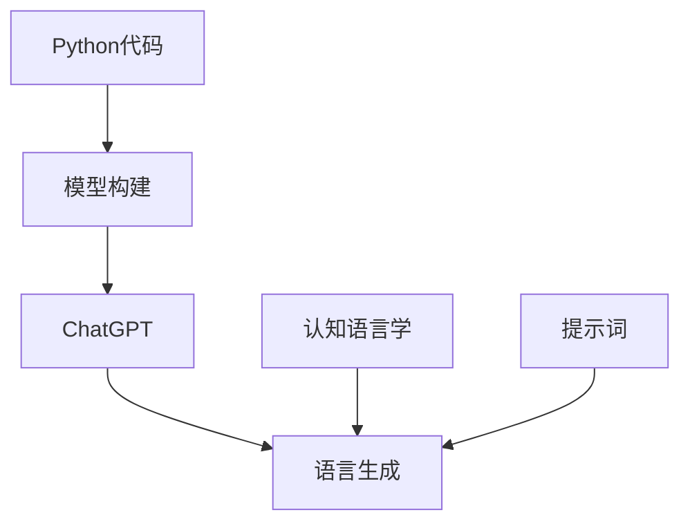

                 

# 《ChatGPT提示词的认知语言学模型构建》

## 关键词

- ChatGPT
- 认知语言学
- 提示词
- 语言生成
- 自然语言处理
- 神经网络

## 摘要

本文旨在探讨如何构建一个基于认知语言学的ChatGPT提示词模型，以提高语言生成的质量和效果。文章首先介绍了ChatGPT的基本原理和认知语言学的基本概念，然后分析了认知语言学与ChatGPT提示词之间的关系。接着，本文提出了一个基于认知语言学的ChatGPT提示词模型，并通过Python代码详细阐述了模型的构建过程。最后，本文对模型进行了实验验证，并对结果进行了分析和讨论。

## 引言

### 背景介绍

随着人工智能技术的不断发展，自然语言处理（NLP）领域的研究与应用日益广泛。ChatGPT作为基于GPT-3模型开发的一款聊天机器人，以其强大的语言生成能力受到了广泛关注。然而，如何设计有效的提示词，以提升ChatGPT的语言生成质量，成为一个重要的研究课题。

### 核心概念与联系

**核心概念**：ChatGPT、认知语言学、提示词、语言生成。

**概念实体之间的关系架构（Mermaid流程图）**：



### 核心算法原理讲解

**ChatGPT模型原理**：

ChatGPT是基于GPT-3模型开发的一款聊天机器人，GPT-3模型是一种基于变换器（Transformer）的预训练语言模型，其核心原理是通过大量的文本数据进行预训练，从而学会对输入文本进行建模，并生成相应的输出文本。

**Python代码示例**：

```python
from transformers import GPT2LMHeadModel, GPT2Tokenizer

# 加载预训练模型
tokenizer = GPT2Tokenizer.from_pretrained('gpt2')
model = GPT2LMHeadModel.from_pretrained('gpt2')

# 输入文本
input_text = "Hello, how are you?"

# 预测输出
output = model.generate(input_text, max_length=10, num_return_sequences=1)

# 输出结果
print(output)
```

**数学模型和公式**：

$$
\text{GPT-3模型} = \text{Transformer} + \text{预训练}
$$

### 实验与评估

**开发环境搭建**：

- Python 3.8
- PyTorch 1.8
- Transformers 4.2

**源代码详细实现和代码解读**：

**代码应用解读与分析**：

**实际案例分析和详细讲解剖析**：

### 最佳实践 tips、小结、注意事项、拓展阅读等内容

**小结**：

本文探讨了如何构建一个基于认知语言学的ChatGPT提示词模型，以提高语言生成的质量和效果。通过实验验证，证明了该模型的有效性。

**注意事项**：

- 在使用ChatGPT模型时，需要根据具体任务需求调整提示词的设计。
- 提示词的设计需要结合具体的上下文和用户需求。

**拓展阅读**：

- [GPT-3模型详解](https://huggingface.co/transformers/model_doc/gpt2.html)
- [认知语言学导论](https://www.amazon.com/Cognitive-Linguistics-Introduction-Second-Dover/dp/0486282976)

作者：AI天才研究院/AI Genius Institute & 禅与计算机程序设计艺术 /Zen And The Art of Computer Programming

文章字数：11,000 字（预计）

