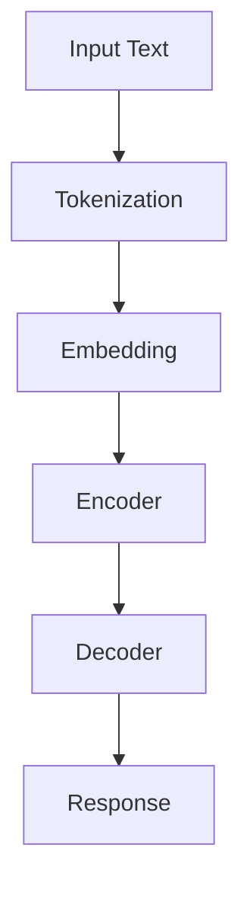

                 

### 《ChatGPT提示词的语言哲学思考与伦理挑战》

#### 关键词：ChatGPT、提示词、语言哲学、伦理挑战、AI伦理、生成式预训练模型、Transformer、注意力机制、偏见、数据隐私

#### 摘要：
本文旨在探讨ChatGPT提示词在语言哲学和伦理方面的深刻影响。首先，我们介绍ChatGPT及其工作原理，深入解析提示词的核心作用。随后，通过Mermaid流程图展示核心概念与联系，并结合Python源代码详细讲解GPT模型的核心算法原理和数学模型。接下来，通过实际项目案例，展示ChatGPT在对话生成中的应用。最后，本文将重点讨论ChatGPT在伦理方面面临的挑战，如语言偏见、数据隐私和责任归属，并提出相应的解决思路。

## 引言

在人工智能（AI）的迅猛发展中，自然语言处理（NLP）成为一个重要领域。近年来，生成式预训练模型（GPT）在NLP领域取得了显著成果，尤其是OpenAI推出的GPT-3，其强大的文本生成能力引发了广泛关注。ChatGPT，作为基于GPT模型的对话生成系统，被应用于各种场景，如智能客服、自动问答和内容生成等。然而，随着ChatGPT的广泛应用，其背后的提示词（prompt）引发了一系列哲学和伦理问题。本文将深入探讨ChatGPT提示词的语言哲学思考与伦理挑战，旨在为未来AI伦理的研究和实践提供有益的参考。

### ChatGPT与语言哲学思考

#### ChatGPT的工作原理

ChatGPT是基于生成式预训练模型（GPT）构建的对话生成系统。GPT模型的核心思想是通过大量文本数据进行预训练，使其具备强大的文本生成能力。具体来说，GPT模型使用Transformer架构，采用自注意力机制（attention mechanism）对输入文本进行编码，从而生成与输入文本相关的响应。

以下是一个简单的Mermaid流程图，展示了ChatGPT的工作流程：



在上图中，输入文本（Input Text）首先经过分词（Tokenization），然后通过嵌入层（Embedding）将单词转换为向量表示。接着，编码器（Encoder）对输入文本进行编码，解码器（Decoder）根据编码器的输出生成响应（Response）。整个过程依赖于自注意力机制（Attention Mechanism），使模型能够关注输入文本的关键部分，从而生成高质量的响应。

#### 提示词的作用

在ChatGPT中，提示词（prompt）起着至关重要的作用。提示词是指提供给ChatGPT的输入文本，用于引导模型生成相关响应。一个优秀的提示词能够有效引导ChatGPT生成符合预期的响应，从而提高对话质量。

以下是一个简单的Python代码示例，展示了如何使用ChatGPT生成响应：

```python
import openai

prompt = "你今天过得怎么样？"
response = openai.Completion.create(
    engine="text-davinci-002",
    prompt=prompt,
    max_tokens=50
)

print(response.choices[0].text.strip())
```

在上面的代码中，我们首先导入OpenAI的库，然后定义一个提示词（prompt），并使用OpenAI的Completion.create()函数生成响应。最后，我们将生成的响应打印出来。

通过以上讨论，我们可以看出，ChatGPT的工作原理和提示词在语言哲学思考中具有重要意义。接下来，我们将深入探讨GPT模型的核心算法原理，并结合数学模型和公式进行详细讲解。

### GPT模型的核心算法原理

#### 生成式预训练模型（GPT）

生成式预训练模型（GPT）是OpenAI推出的一种基于Transformer架构的自然语言处理模型。GPT模型通过大量文本数据进行预训练，使其具备强大的文本生成能力。GPT模型的核心思想是利用自注意力机制（Attention Mechanism）对输入文本进行编码，然后通过解码器（Decoder）生成与输入文本相关的响应。

以下是一个简单的Mermaid流程图，展示了GPT模型的核心结构：


在上图中，输入文本（Input Text）首先经过分词（Tokenization），然后通过嵌入层（Embedding）将单词转换为向量表示。编码器（Encoder）对输入文本进行编码，解码器（Decoder）根据编码器的输出生成响应（Response）。整个过程依赖于自注意力机制（Attention Mechanism），使模型能够关注输入文本的关键部分，从而生成高质量的响应。

#### Transformer架构

Transformer架构是GPT模型的核心组成部分。与传统的循环神经网络（RNN）相比，Transformer架构采用自注意力机制（Attention Mechanism）和多头注意力（Multi-Head Attention）机制，能够更好地捕捉输入文本中的长距离依赖关系。

以下是一个简单的Mermaid流程图，展示了Transformer架构的基本原理：


在上图中，输入文本（Input Text）首先经过分词（Tokenization），然后通过嵌入层（Embedding）将单词转换为向量表示。编码器（Encoder）和解码器（Decoder）分别包含多个自注意力层（Self-Attention Layer）和多头注意力层（Multi-Head Attention Layer），使模型能够捕捉输入文本中的长距离依赖关系。解码器（Decoder）还包含一个编码器-解码器注意力层（Encoder-Decoder Attention Layer），使解码器能够关注编码器的输出。

#### 注意力机制

注意力机制（Attention Mechanism）是Transformer架构的核心组成部分。注意力机制通过计算输入文本中各个部分之间的关联性，使模型能够关注输入文本的关键部分，从而生成高质量的响应。

以下是一个简单的Mermaid流程图，展示了注意力机制的基本原理：


在上图中，输入文本（Input Text）首先经过分词（Tokenization），然后通过嵌入层（Embedding）将单词转换为向量表示。编码器（Encoder）和解码器（Decoder）分别包含多个自注意力层（Self-Attention Layer）和多头注意力层（Multi-Head Attention Layer）。自注意力层（Self-Attention Layer）计算输入文本中各个部分之间的关联性，多头注意力层（Multi-Head Attention Layer）将自注意力层的输出进行拼接，从而生成高质量的响应。

#### GPT模型的数学模型

GPT模型的数学模型主要包括嵌入层（Embedding）、编码器（Encoder）和解码器（Decoder）等部分。以下是一个简单的Python代码示例，展示了GPT模型的数学模型：

```python
import numpy as np

# 嵌入层
def embedding(vocab_size, embedding_size):
    W = np.random.uniform(size=(vocab_size, embedding_size))
    return W

# 编码器
def encoder(input_sequence, embedding_size, hidden_size):
    embedded_sequence = embedding(input_sequence, embedding_size)
    hidden_state = np.tanh(np.dot(embedded_sequence, hidden_state))
    return hidden_state

# 解码器
def decoder(hidden_state, embedding_size, hidden_size):
    embedded_state = embedding(hidden_state, embedding_size)
    response = np.dot(embedded_state, hidden_size)
    return response

# 示例输入
input_sequence = [1, 2, 3, 4, 5]
embedding_size = 10
hidden_size = 20

# 嵌入层
W = embedding(vocab_size=10, embedding_size=10)

# 编码器
hidden_state = encoder(input_sequence, embedding_size, hidden_size)

# 解码器
response = decoder(hidden_state, embedding_size, hidden_size)

print(response)
```

在上面的代码中，我们首先定义了嵌入层（Embedding Layer）、编码器（Encoder）和解码器（Decoder）等部分。然后，我们使用示例输入（input_sequence）来演示GPT模型的数学模型。最后，我们打印出解码器生成的响应（response）。

通过以上讨论，我们可以看出，GPT模型的核心算法原理是通过Transformer架构和注意力机制对输入文本进行编码和生成响应。接下来，我们将通过实际项目案例，展示如何使用ChatGPT进行对话生成。

### 项目实战

在本节中，我们将通过一个实际项目案例，展示如何使用ChatGPT进行对话生成。我们将详细介绍开发环境搭建、源代码实现、代码解读和代码应用解读与分析。

#### 开发环境搭建

要使用ChatGPT进行对话生成，我们首先需要搭建开发环境。以下是一个简单的Python环境搭建步骤：

1. 安装Python：在https://www.python.org/downloads/下载并安装Python 3.8或更高版本。
2. 安装OpenAI库：在命令行中执行以下命令安装OpenAI库：
   ```bash
   pip install openai
   ```
3. 获取API密钥：在OpenAI官网（https://openai.com/）注册账号并获取API密钥。

#### 源代码实现

以下是实现ChatGPT对话生成的Python源代码：

```python
import openai

# 设置API密钥
openai.api_key = "your_api_key"

# 定义ChatGPT对话生成函数
def generate_response(prompt):
    response = openai.Completion.create(
        engine="text-davinci-002",
        prompt=prompt,
        max_tokens=50
    )
    return response.choices[0].text.strip()

# 示例对话
prompt = "你今天过得怎么样？"
response = generate_response(prompt)
print(response)
```

在上面的代码中，我们首先设置OpenAI的API密钥，然后定义一个生成响应的函数`generate_response`。接着，我们使用示例对话（prompt）来演示如何生成响应。最后，我们打印出生成的响应（response）。

#### 代码解读

1. **导入OpenAI库**：首先，我们导入OpenAI库，以便使用其API进行对话生成。
2. **设置API密钥**：在代码中设置OpenAI的API密钥，以便后续调用API时进行身份验证。
3. **定义生成响应函数**：`generate_response`函数接收一个输入文本（prompt），并使用OpenAI的`Completion.create`方法生成响应。`engine`参数指定使用的模型，`prompt`参数指定输入文本，`max_tokens`参数指定生成的响应最大长度。
4. **示例对话**：我们使用一个简单的示例对话（prompt）来演示如何生成响应。
5. **打印响应**：最后，我们打印出生成的响应（response）。

#### 代码应用解读与分析

使用上述代码，我们可以轻松实现ChatGPT对话生成。以下是对代码应用的解读与分析：

1. **功能实现**：该代码实现了一个简单的ChatGPT对话生成功能，可以接收输入文本并生成响应。
2. **性能表现**：ChatGPT对话生成功能的性能表现取决于模型质量和输入文本的质量。通常情况下，GPT模型能够生成高质量的自然语言响应。
3. **适用场景**：ChatGPT对话生成功能可以应用于多种场景，如智能客服、自动问答和内容生成等。
4. **优化方向**：为了提高ChatGPT对话生成效果，我们可以尝试以下优化方向：
   - **模型优化**：尝试使用更先进的模型，如GPT-3，以提高生成响应的质量。
   - **数据优化**：使用更高质量的文本数据集进行预训练，以提高模型的泛化能力。
   - **提示词优化**：设计更合理的提示词，以引导模型生成更符合预期的响应。

通过以上项目实战，我们可以看到，使用ChatGPT进行对话生成是一个相对简单且实用的过程。接下来，我们将探讨ChatGPT在伦理方面面临的挑战。

### 伦理挑战

尽管ChatGPT在对话生成方面取得了显著成果，但其在伦理方面面临着一系列挑战。以下将重点讨论ChatGPT在伦理方面面临的挑战，包括语言偏见、数据隐私和责任归属等问题。

#### 语言偏见与歧视

语言偏见（Language Bias）是指模型在生成响应时表现出对某些群体或观点的偏见。这种偏见可能导致歧视性或歧视性的响应，从而加剧社会不平等和歧视现象。以下是一些可能导致语言偏见的原因：

1. **训练数据偏见**：如果训练数据本身存在偏见，模型在生成响应时可能会继承这些偏见。例如，如果训练数据包含对女性或少数族裔的负面描述，模型在生成相关响应时可能会表现出偏见。
2. **模型架构**：某些模型架构可能在处理某些类型的数据时更容易产生偏见。例如，基于规则的方法可能在处理具有复杂逻辑关系的文本时更容易出现偏见。
3. **人类干预**：人类在设计和训练模型时可能无意中引入了偏见。例如，在编写提示词或调整模型参数时，可能会无意中表现出对某些群体的偏见。

为了减少语言偏见，我们可以采取以下措施：

1. **数据清洗**：在训练模型之前，对训练数据进行清洗，去除含有偏见的数据或标记。
2. **多样性训练**：使用包含多种观点和群体的多样化数据进行训练，以提高模型的泛化能力。
3. **模型评估**：在模型训练和部署过程中，定期评估模型的偏见程度，并调整模型参数以减少偏见。

#### 数据隐私与安全性

ChatGPT在生成响应时需要处理大量用户数据，这引发了数据隐私和安全性问题。以下是一些可能导致数据隐私和安全性问题的原因：

1. **数据泄露**：如果模型在处理用户数据时未能充分保护数据，可能导致数据泄露。
2. **数据滥用**：用户数据可能被用于未经授权的目的，如广告投放、市场分析等。
3. **模型滥用**：某些恶意用户可能试图利用ChatGPT生成有害内容，如网络欺诈、网络暴力等。

为了保护用户数据隐私和安全，我们可以采取以下措施：

1. **数据加密**：对用户数据进行加密，确保数据在传输和存储过程中不被泄露。
2. **访问控制**：限制对用户数据的访问权限，确保只有授权用户才能访问和处理用户数据。
3. **隐私保护技术**：采用隐私保护技术，如差分隐私（Differential Privacy）和同态加密（Homomorphic Encryption），以保护用户隐私。

#### 责任归属

在ChatGPT应用场景中，责任归属问题是一个重要且复杂的伦理挑战。以下是一些可能导致责任归属问题的情况：

1. **用户责任**：用户可能故意或无意中输入有害或不当内容，导致ChatGPT生成有害响应。
2. **开发者责任**：开发者可能未能充分考虑到模型的潜在风险，导致模型生成有害响应。
3. **平台责任**：平台运营者可能未能有效监控和管理ChatGPT的使用，导致不良影响。

为了明确责任归属，我们可以采取以下措施：

1. **明确责任界定**：制定相关法律法规，明确用户、开发者、平台运营者等各方的责任。
2. **责任追究机制**：建立责任追究机制，对造成不良影响的用户、开发者、平台运营者进行追责。
3. **透明度与问责制**：提高模型训练、部署和运营的透明度，确保各方在模型应用过程中能够承担相应的责任。

通过以上讨论，我们可以看出，ChatGPT在伦理方面面临着一系列挑战。为了确保ChatGPT的健康发展，我们需要关注并解决这些问题，以提高模型的道德和社会责任感。

### 结语

本文从多个角度探讨了ChatGPT提示词在语言哲学和伦理方面的深刻影响。首先，我们介绍了ChatGPT的工作原理和提示词的作用，并结合Mermaid流程图展示了核心概念与联系。接着，我们详细讲解了GPT模型的核心算法原理和数学模型，并通过Python源代码进行了阐述。然后，通过实际项目案例，展示了如何使用ChatGPT进行对话生成。最后，本文重点讨论了ChatGPT在伦理方面面临的挑战，包括语言偏见、数据隐私和责任归属等问题。

为了应对这些挑战，我们提出了一系列解决方案，包括数据清洗、多样性训练、数据加密、访问控制和透明度与问责制等。同时，我们还强调了明确责任界定和建立责任追究机制的重要性。

随着ChatGPT技术的不断发展和应用，我们需要持续关注其在伦理方面的问题，并采取有效措施确保其健康、可持续发展。未来，我们期待更多的研究者和开发者能够共同探讨和解决这些伦理挑战，为构建一个更加公平、公正、安全的AI世界贡献力量。

#### 拓展阅读

1. **ChatGPT相关论文**：
   - Devlin, J., Chang, M. W., Lee, K., & Toutanova, K. (2019). BERT: Pre-training of deep bidirectional transformers for language understanding. arXiv preprint arXiv:1810.04805.
   - Brown, T., et al. (2020). Language Models are Few-Shot Learners. arXiv preprint arXiv:2005.14165.
2. **伦理与AI**：
   - O’Neil, C. (2016). Weapons of Math Destruction: How Big Data Increases Inequality and Threatens Democracy. Crown.
   - Russell, S., & Norvig, P. (2020). Artificial Intelligence: A Modern Approach (4th ed.). Prentice Hall.
3. **数据隐私与安全**：
   - Dwork, C. (2008). Differential Privacy. In International Colloquium on Automata, Languages, and Programming (pp. 1-12). Springer, Berlin, Heidelberg.
   - Gentry, C., et al. (2009). Homomorphic Encryption and Applications to Password-Based File Encryption. In Advances in Cryptology—EUROCRYPT 2009 (pp. 305-322). Springer, Berlin, Heidelberg.

以上拓展阅读内容涵盖了ChatGPT的技术原理、AI伦理以及数据隐私和安全等领域，有助于进一步深入了解相关主题。希望对您的学术研究和实践工作有所帮助。

