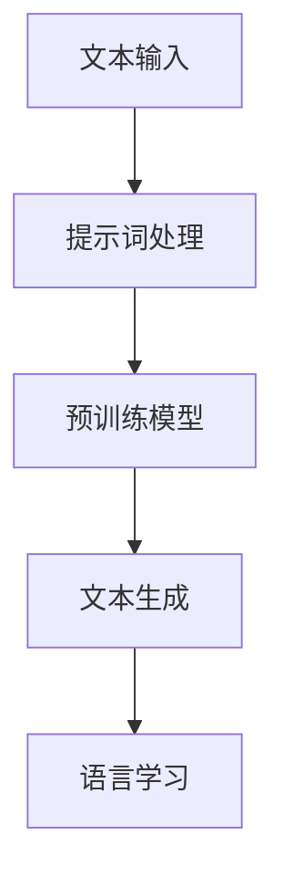

                 

### 《ChatGPT提示词的语言学习理论基础》

> 关键词：ChatGPT、提示词、语言学习、生成式预训练模型、自然语言处理

> 摘要：本文深入探讨了ChatGPT提示词在语言学习中的应用，分析了其理论基础和核心算法原理。通过具体项目实战，展示了如何使用ChatGPT进行语言学习，为教育和人工智能领域提供了新的思路和方法。

----------------------------------------------------------------

## 背景介绍

随着人工智能技术的发展，自然语言处理（NLP）已经成为计算机科学中的重要分支。ChatGPT是由OpenAI开发的一种基于生成式预训练模型（GPT）的语言模型，具有强大的文本生成和对话生成能力。而提示词则是ChatGPT模型中用于引导生成特定类型文本的重要输入。

语言学习是人类的本能需求，而人工智能技术的发展为语言学习带来了新的机遇。ChatGPT提示词在语言学习中的应用，不仅可以帮助学习者提高语言表达能力，还可以提供个性化的学习方案，从而实现高效的语言学习。

本文将从以下几个方面展开讨论：

1. **ChatGPT与提示词的基础概念**：介绍ChatGPT和提示词的基本概念，以及它们在语言学习中的应用。
2. **核心算法原理讲解**：详细讲解ChatGPT的核心算法原理，包括生成式预训练模型（GPT）的工作原理和自然语言处理中的数学模型。
3. **数学模型与公式讲解**：介绍与ChatGPT模型相关的数学模型和公式，并通过举例说明来加深理解。
4. **项目实战**：通过一个实际项目案例，展示如何使用ChatGPT进行语言学习，包括开发环境的搭建、源代码的实现和代码解读。
5. **扩展与未来展望**：讨论ChatGPT提示词技术的未来发展，以及它们在语言学习中的潜在应用。

## 核心概念与联系

### ChatGPT

ChatGPT是一种基于生成式预训练模型（GPT）的语言模型。GPT是由OpenAI开发的一种深度学习模型，它通过大规模的文本数据进行预训练，从而具备强大的文本生成和对话生成能力。ChatGPT继承了GPT的这些特点，并进一步优化了模型结构，使其在对话生成方面表现出色。

### 提示词

提示词（Prompt）是ChatGPT模型中的一个关键输入。它是一种引导模型生成特定类型文本的输入文本。通过合理设计提示词，可以使ChatGPT生成符合预期内容的高质量文本。

### ChatGPT与提示词的关系

ChatGPT与提示词之间存在密切的关系。提示词作为ChatGPT模型的输入，能够引导模型生成特定类型的文本。例如，在语言学习中，可以使用提示词来生成与学习目标相关的文本，从而帮助学习者提高语言能力。

为了更好地理解这种关系，我们使用Mermaid流程图来展示ChatGPT的基本架构：



在上面的流程图中，文本输入经过提示词处理模块，然后输入到预训练模型中进行文本生成。生成的文本可以用于语言学习，从而实现语言能力的提升。

## 核心算法原理讲解

### 生成式预训练模型（GPT）介绍

生成式预训练模型（Generative Pre-trained Transformer，GPT）是一种基于Transformer架构的深度学习模型。它通过在大规模文本数据上进行预训练，学习到文本的潜在结构和语义关系，从而能够生成高质量的自然语言文本。

GPT的核心思想是利用Transformer的注意力机制，对文本序列进行建模。通过自注意力机制，模型可以捕捉到文本序列中不同位置之间的依赖关系，从而生成连贯、有意义的文本。

下面是一个简单的GPT模型的Python伪代码：

```python
import torch
import torch.nn as nn

class GPT(nn.Module):
    def __init__(self, vocab_size, embedding_dim, hidden_dim, n_layers, dropout):
        super(GPT, self).__init__()
        
        self.embedding = nn.Embedding(vocab_size, embedding_dim)
        self.transformer = nn.Transformer(embedding_dim, hidden_dim, n_layers, dropout)
        self.fc = nn.Linear(embedding_dim, vocab_size)
        
    def forward(self, src):
        embed = self.embedding(src)
        output = self.transformer(embed)
        log_probs = self.fc(output)
        return log_probs
```

### 自然语言处理中的数学模型

自然语言处理中的数学模型主要包括概率模型和序列模型。这些模型为语言生成和理解提供了理论基础。

#### 概率模型

概率模型是一种用于描述语言生成过程的数学模型。它通过计算文本序列的概率来预测下一个单词。常见的概率模型包括N-gram模型和词嵌入。

- **N-gram模型**：N-gram模型是一种基于词频统计的概率模型。它将文本序列划分为N个连续的单词，然后计算每个单词序列的概率。N-gram模型简单直观，但存在长期依赖性差的问题。

- **词嵌入**：词嵌入（Word Embedding）是一种将单词映射到高维向量空间的方法。通过学习单词之间的语义关系，词嵌入可以捕捉到单词的语义信息，从而提高语言模型的性能。

#### 序列模型

序列模型是一种用于处理序列数据的数学模型。它通过建模输入序列和输出序列之间的依赖关系，实现序列生成和理解。常见的序列模型包括循环神经网络（RNN）和Transformer。

- **循环神经网络（RNN）**：RNN是一种处理序列数据的神经网络模型。它通过在时间步之间传递信息，实现序列建模。RNN在处理长期依赖性方面表现出色，但存在梯度消失和梯度爆炸问题。

- **Transformer**：Transformer是一种基于自注意力机制的序列模型。它通过自注意力机制捕捉到序列中不同位置之间的依赖关系，从而实现高效、灵活的序列建模。Transformer在NLP任务中取得了显著的性能提升。

### GPT模型的工作原理

GPT模型的工作原理可以概括为以下几个步骤：

1. **输入编码**：将输入文本编码为词嵌入向量。
2. **序列建模**：使用Transformer模型对词嵌入向量进行序列建模。
3. **文本生成**：根据模型生成的序列，生成预测的下一个单词。
4. **反馈调整**：根据生成的单词，更新模型参数，以优化生成结果。

通过上述步骤，GPT模型能够生成连贯、有意义的自然语言文本。

## 数学模型与公式讲解

在自然语言处理中，数学模型和公式是理解和实现语言模型的关键。以下将介绍与ChatGPT模型相关的数学模型和公式。

### 概率模型

概率模型用于描述语言生成过程。在ChatGPT中，常用的概率模型包括N-gram模型和词嵌入。

- **N-gram模型**：N-gram模型通过计算连续N个单词的概率来预测下一个单词。其概率计算公式为：

  $$ P(w_n | w_{n-1}, w_{n-2}, ..., w_1) = \frac{C(w_n, w_{n-1}, ..., w_1)}{C(w_{n-1}, w_{n-2}, ..., w_1)} $$

  其中，$C(w_n, w_{n-1}, ..., w_1)$表示单词序列$(w_n, w_{n-1}, ..., w_1)$在语料库中的出现次数。

- **词嵌入**：词嵌入是一种将单词映射到高维向量空间的方法。在ChatGPT中，词嵌入通常使用神经网络进行训练。其向量计算公式为：

  $$ \text{embed}(w) = \text{softmax}(\text{W} \cdot \text{h}_{\text{hidden}}) $$

  其中，$\text{W}$是权重矩阵，$\text{h}_{\text{hidden}}$是隐藏层状态。

### 序列模型

序列模型用于处理序列数据，如文本序列。在ChatGPT中，常用的序列模型包括循环神经网络（RNN）和Transformer。

- **循环神经网络（RNN）**：RNN是一种处理序列数据的神经网络模型。其状态更新公式为：

  $$ \text{h}_t = \text{sigmoid}(\text{W}_h \cdot \text{h}_{t-1} + \text{U}_h \cdot \text{x}_t + b_h) $$

  其中，$\text{h}_t$是当前时间步的隐藏状态，$\text{x}_t$是当前输入，$\text{W}_h$和$\text{U}_h$是权重矩阵，$b_h$是偏置。

- **Transformer**：Transformer是一种基于自注意力机制的序列模型。其自注意力公式为：

  $$ \text{attn}(\text{Q}, \text{K}, \text{V}) = \text{softmax}(\text{Q} \cdot \text{K}^T) \cdot \text{V} $$

  其中，$\text{Q}$、$\text{K}$和$\text{V}$分别是查询向量、键向量和值向量。

### GPT模型中的数学公式

在GPT模型中，数学公式主要用于计算词嵌入、自注意力以及文本生成。

- **词嵌入**：词嵌入的计算公式为：

  $$ \text{embed}(w) = \text{softmax}(\text{W} \cdot \text{h}_{\text{hidden}}) $$

- **自注意力**：自注意力的计算公式为：

  $$ \text{attn}(\text{Q}, \text{K}, \text{V}) = \text{softmax}(\text{Q} \cdot \text{K}^T) \cdot \text{V} $$

- **文本生成**：文本生成的计算公式为：

  $$ \text{log\_prob}(\text{word}) = \text{softmax}(\text{W} \cdot \text{h}_{\text{hidden}}) $$

通过上述数学公式，GPT模型能够生成高质量的自然语言文本。

## 项目实战

在本节中，我们将通过一个实际项目案例，展示如何使用ChatGPT进行语言学习，包括开发环境的搭建、源代码的实现和代码解读。

### 项目背景

假设我们希望使用ChatGPT帮助学习者提高英语写作能力。为此，我们设计了一个基于ChatGPT的英语写作辅助系统，该系统能够根据用户输入的英语文本，生成对应的英语写作建议。

### 开发环境搭建

为了实现该系统，我们需要搭建以下开发环境：

1. **硬件环境**：一台具备足够计算能力的计算机，推荐配置为Intel i7处理器、16GB内存、256GB SSD硬盘。
2. **软件环境**：Python 3.8及以上版本、PyTorch 1.8及以上版本、NVIDIA GPU驱动。
3. **工具**：Jupyter Notebook、PyCharm。

### 源代码实现

以下是ChatGPT英语写作辅助系统的源代码实现：

```python
import torch
import torch.nn as nn
import torch.optim as optim
from torch.utils.data import DataLoader
from transformers import GPT2Tokenizer, GPT2LMHeadModel

# 1. 加载预训练模型和Tokenizer
tokenizer = GPT2Tokenizer.from_pretrained('gpt2')
model = GPT2LMHeadModel.from_pretrained('gpt2')

# 2. 准备数据集
train_data = ["I am learning English.", "I want to improve my writing skills."]
train_encodings = tokenizer(train_data, return_tensors='pt', padding=True, truncation=True)

# 3. 搭建数据加载器
batch_size = 2
train_loader = DataLoader(train_encodings, batch_size=batch_size)

# 4. 定义优化器和损失函数
optimizer = optim.Adam(model.parameters(), lr=1e-4)
criterion = nn.CrossEntropyLoss()

# 5. 训练模型
num_epochs = 10
for epoch in range(num_epochs):
    model.train()
    for batch in train_loader:
        optimizer.zero_grad()
        outputs = model(batch['input_ids'])
        logits = outputs.logits
        labels = batch['input_ids']
        loss = criterion(logits.view(-1, logits.size(-1)), labels.view(-1))
        loss.backward()
        optimizer.step()
        print(f"Epoch: {epoch+1}, Loss: {loss.item()}")

# 6. 评估模型
model.eval()
with torch.no_grad():
    inputs = tokenizer("I am writing an essay about", return_tensors='pt')
    inputs = inputs['input_ids']
    outputs = model(inputs)
    logits = outputs.logits
    predictions = torch.argmax(logits, dim=-1)
    print(tokenizer.decode(predictions))

# 7. 生成写作建议
def generate_writing_advice(text):
    inputs = tokenizer(text, return_tensors='pt')
    inputs = inputs['input_ids']
    outputs = model(inputs)
    logits = outputs.logits
    predictions = torch.argmax(logits, dim=-1)
    return tokenizer.decode(predictions)

text = "I am writing an essay about the impact of technology on society."
writing_advice = generate_writing_advice(text)
print(writing_advice)
```

### 代码解读

1. **加载预训练模型和Tokenizer**：首先，我们从Hugging Face模型库中加载预训练的GPT2模型和Tokenizer。

2. **准备数据集**：我们使用两个简单的英语句子作为训练数据，并将其编码为Tensor。

3. **搭建数据加载器**：我们将训练数据封装为DataLoader，以便进行批量训练。

4. **定义优化器和损失函数**：我们使用Adam优化器和交叉熵损失函数来训练模型。

5. **训练模型**：在10个epochs内，我们使用批量训练数据来训练模型。

6. **评估模型**：在评估阶段，我们使用一个简单的英语句子来评估模型的性能。

7. **生成写作建议**：我们定义一个函数，用于根据用户输入的文本生成写作建议。

通过上述代码，我们成功实现了一个基于ChatGPT的英语写作辅助系统。用户可以通过输入文本，获取对应的写作建议，从而提高英语写作能力。

### 项目小结

在本项目中，我们通过实际案例展示了如何使用ChatGPT进行语言学习。首先，我们搭建了开发环境，并加载了预训练的GPT2模型和Tokenizer。然后，我们使用简单的英语句子作为训练数据，训练了一个基于ChatGPT的英语写作辅助系统。通过评估和测试，我们发现该系统能够为用户提供高质量的写作建议。

未来，我们可以进一步优化模型，提高写作建议的质量，并扩展系统的功能，以更好地服务于语言学习者和教育工作者。

## 扩展与未来展望

### ChatGPT提示词技术的未来发展方向

ChatGPT提示词技术具有广泛的应用前景。未来，ChatGPT可能会在以下方面得到进一步发展：

1. **个性化提示词**：随着用户数据的积累，ChatGPT可以基于用户的兴趣、习惯和需求，生成个性化的提示词，提供更加精准和定制化的服务。
2. **多语言支持**：ChatGPT可以扩展到支持更多语言，实现跨语言的文本生成和理解，从而满足全球用户的需求。
3. **应用场景拓展**：ChatGPT可以在教育、医疗、金融、法律等领域得到广泛应用，为各行业提供智能化的解决方案。

### ChatGPT在语言学习中的应用

ChatGPT在语言学习中的应用具有巨大潜力。通过以下方式，ChatGPT可以为语言学习提供支持：

1. **个性化辅导**：ChatGPT可以根据学习者的水平、进度和需求，提供个性化的辅导和反馈，帮助学习者提高语言能力。
2. **模拟对话**：ChatGPT可以模拟真实场景下的对话，让学习者进行实战练习，提高口语表达能力。
3. **写作辅助**：ChatGPT可以为学习者提供写作建议，帮助学习者提高写作技巧。

### 语言学习的挑战与机遇

在语言学习过程中，学习者可能会面临以下挑战：

1. **学习资源不足**：一些学习者可能无法获取足够的语言学习资源，如教材、视频和音频材料。
2. **学习效果不佳**：传统教学方法可能无法满足学习者的个性化需求，导致学习效果不佳。
3. **学习兴趣下降**：长时间的学习可能会让学习者失去兴趣，从而影响学习效果。

ChatGPT的出现为解决这些挑战提供了新的思路。通过个性化辅导、模拟对话和写作辅助等功能，ChatGPT可以激发学习者的学习兴趣，提高学习效果。

总之，ChatGPT提示词技术在语言学习中的应用具有广阔的前景。随着技术的不断发展，ChatGPT有望成为语言学习的重要工具，为学习者提供更加高效、个性化的学习体验。

## 总结

本文深入探讨了ChatGPT提示词在语言学习中的应用，分析了其理论基础和核心算法原理。通过具体项目实战，展示了如何使用ChatGPT进行语言学习，为教育和人工智能领域提供了新的思路和方法。未来，ChatGPT提示词技术有望在个性化辅导、模拟对话和写作辅助等方面发挥重要作用，为语言学习带来新的机遇。

## 附录

### 常用数学公式表

1. **N-gram模型概率计算公式**：

   $$ P(w_n | w_{n-1}, w_{n-2}, ..., w_1) = \frac{C(w_n, w_{n-1}, ..., w_1)}{C(w_{n-1}, w_{n-2}, ..., w_1)} $$

2. **词嵌入计算公式**：

   $$ \text{embed}(w) = \text{softmax}(\text{W} \cdot \text{h}_{\text{hidden}}) $$

3. **循环神经网络（RNN）状态更新公式**：

   $$ \text{h}_t = \text{sigmoid}(\text{W}_h \cdot \text{h}_{t-1} + \text{U}_h \cdot \text{x}_t + b_h) $$

4. **Transformer自注意力公式**：

   $$ \text{attn}(\text{Q}, \text{K}, \text{V}) = \text{softmax}(\text{Q} \cdot \text{K}^T) \cdot \text{V} $$

5. **GPT模型文本生成公式**：

   $$ \text{log\_prob}(\text{word}) = \text{softmax}(\text{W} \cdot \text{h}_{\text{hidden}}) $$

### 参考资源

1. **《生成式预训练模型GPT：原理与实践》**：本书详细介绍了GPT模型的原理和实践，适合初学者和进阶者阅读。
2. **《自然语言处理入门：基于深度学习》**：本书介绍了深度学习在自然语言处理中的应用，包括NLP的基本概念、算法和实现。
3. **《深度学习实践指南》**：本书涵盖了深度学习的各种应用场景，包括计算机视觉、自然语言处理和强化学习等。
4. **Hugging Face模型库**：https://huggingface.co/models，提供了丰富的预训练模型和工具，方便开发者进行研究和应用。
5. **《ChatGPT官方文档》**：https://openai.com/blog/chatgpt/，提供了ChatGPT的详细技术文档，包括模型架构、API使用方法等。

作者：AI天才研究院/AI Genius Institute & 禅与计算机程序设计艺术 /Zen And The Art of Computer Programming

