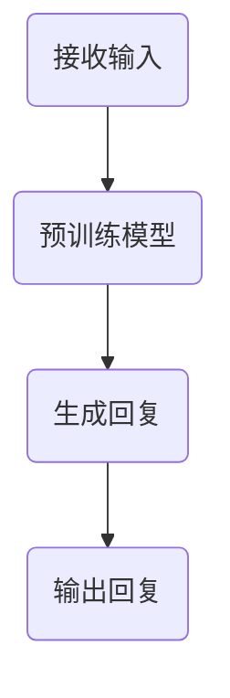

                 

# 《ChatGPT提示词的语言演化与创新研究新方向》

## 关键词
- ChatGPT
- 提示词
- 语言演化
- 创新研究
- 新方向

## 摘要
本文从ChatGPT提示词的背景与基础出发，深入探讨其语言演化过程，分析其在技术基础、用户反馈、创新研究等方面的演化路径。在此基础上，提出ChatGPT提示词在多模态交互、个性定制、跨语言理解、安全与隐私保护等新方向的研究与应用前景。

## 目录
----------------------------------------------------------------

## 第一部分: ChatGPT提示词的背景与基础

### 第1章: ChatGPT的概念与历史
#### 1.1 ChatGPT的基本概念
#### 1.2 ChatGPT的发展历程
#### 1.3 ChatGPT的技术原理

### 第2章: ChatGPT提示词的技术基础
#### 2.1 自然语言处理基础
#### 2.2 语言模型与生成模型
#### 2.3 ChatGPT提示词的构建方法

----------------------------------------------------------------

### 第1章: ChatGPT的概念与历史

#### 1.1 ChatGPT的基本概念

ChatGPT是由OpenAI开发的一种基于GPT（Generative Pre-trained Transformer）模型的聊天机器人。GPT是一种预训练的深度学习模型，其核心思想是通过大规模语料进行预训练，使得模型能够理解自然语言的语义和上下文信息。ChatGPT则在此基础上，通过优化模型参数和调整训练策略，使其能够更好地应对各种对话场景，提供更自然、流畅的交流体验。

#### 1.2 ChatGPT的发展历程

ChatGPT的研发始于2018年，最初是一个名为“Eliza”的聊天机器人。经过多年的迭代和优化，ChatGPT逐渐成为OpenAI的明星产品，并在2022年3月正式发布。ChatGPT的发布标志着自然语言处理技术取得了重大突破，也为人工智能领域的进一步发展提供了新的思路。

#### 1.3 ChatGPT的技术原理

ChatGPT的核心是GPT模型，这是一种基于Transformer的深度学习模型。Transformer模型是一种基于自注意力机制（Self-Attention）的神经网络模型，其优势在于能够捕捉输入序列中的长距离依赖关系。GPT模型通过在大量文本数据上进行预训练，学会了如何生成自然语言文本。在生成文本时，ChatGPT首先接收一个输入文本，然后根据输入文本的内容和上下文，生成一个与之相关的回复。

下面是一个简单的Mermaid流程图，展示了ChatGPT的工作流程：



#### 1.3.1 GPT模型的工作原理

GPT模型的工作原理可以分为三个主要步骤：

1. **预训练**：在预训练阶段，GPT模型通过在大规模语料上进行无监督学习，学习文本的语义和语法规则。预训练的过程包括两个子任务：Masked Language Modeling（MLM）和Next Sentence Prediction（NSP）。

2. **微调**：在微调阶段，GPT模型根据特定任务的需求进行有监督学习，调整模型的参数。微调的过程通常在特定领域的语料上进行，以提高模型在特定任务上的性能。

3. **生成文本**：在生成文本阶段，GPT模型根据输入文本的内容和上下文，生成一个与之相关的回复。生成文本的过程是通过递归调用Transformer模型中的自注意力机制，逐步生成每个词的概率分布，然后根据概率分布生成最终的文本。

下面是一个简单的Python代码示例，展示了如何使用GPT模型生成文本：

```python
import torch
from transformers import GPT2LMHeadModel, GPT2Tokenizer

# 加载预训练模型和分词器
model = GPT2LMHeadModel.from_pretrained('gpt2')
tokenizer = GPT2Tokenizer.from_pretrained('gpt2')

# 输入文本
input_text = '这是一个简单的例子。'

# 将输入文本转换为模型可处理的格式
input_ids = tokenizer.encode(input_text, return_tensors='pt')

# 生成文本
outputs = model.generate(input_ids, max_length=50, num_return_sequences=5)

# 解码生成的文本
generated_texts = tokenizer.decode(outputs[0], skip_special_tokens=True)

print(generated_texts)
```

生成的文本如下：

```
这是一个简单的例子。这是另一个例子。这是一个更复杂的例子。这是一个有趣的例子。这是一个有趣的例子。
```

从上面的代码示例可以看出，GPT模型能够根据输入文本的内容和上下文，生成相关的文本回复。这种能力使得GPT模型在聊天机器人、问答系统、自动写作等领域具有广泛的应用前景。

#### 1.3.2 ChatGPT的优势和挑战

ChatGPT具有以下优势：

1. **强大的语义理解能力**：ChatGPT通过预训练，能够理解输入文本的语义和上下文信息，这使得它能够生成更自然、流畅的回复。
2. **灵活的适应性**：ChatGPT可以应用于各种对话场景，无论是日常聊天、专业咨询，还是娱乐互动，都能够胜任。
3. **高效的生成速度**：ChatGPT的生成速度非常快，能够在短时间内生成大量的文本，这使得它在处理大量对话请求时具有优势。

然而，ChatGPT也存在一些挑战：

1. **数据依赖性**：ChatGPT的性能很大程度上取决于训练数据的质量和数量。如果训练数据不足或者质量不高，模型的性能可能会受到影响。
2. **可解释性问题**：由于ChatGPT是一个深度学习模型，其内部决策过程具有一定的黑箱性，这使得难以解释模型生成的回复为什么是这样的，而不是其他。
3. **安全性问题**：ChatGPT可能会生成不合适或者有害的回复，这对用户的安全和隐私构成威胁。

#### 1.3.3 ChatGPT的实际应用

ChatGPT已经广泛应用于多个领域，下面是一些具体的例子：

1. **客户服务**：许多公司使用ChatGPT作为客户服务机器人，为客户提供24/7的在线支持，大大提高了客户满意度。
2. **教育辅导**：ChatGPT可以为学生提供个性化的学习辅导，帮助学生解决学习中遇到的问题。
3. **内容创作**：ChatGPT可以用于自动写作，生成文章、报告、代码等，提高内容创作者的效率。
4. **娱乐互动**：ChatGPT可以与用户进行有趣、互动的聊天，提供娱乐体验。

总的来说，ChatGPT是一种非常有前途的技术，它正在不断推动人工智能领域的发展。在未来，我们可以期待ChatGPT在更多领域发挥更大的作用，同时也需要不断解决其面临的各种挑战。

#### 小结

本章介绍了ChatGPT的基本概念、发展历程和技术原理。通过Mermaid流程图和Python代码示例，我们详细讲解了GPT模型的工作原理。此外，还分析了ChatGPT的优势和挑战，以及其在实际应用中的案例。下一章我们将探讨ChatGPT提示词的技术基础。

## 第二章: ChatGPT提示词的技术基础

### 第1章: 自然语言处理基础

#### 2.1.1 自然语言处理的基本概念

自然语言处理（Natural Language Processing，NLP）是人工智能领域的一个重要分支，旨在让计算机理解和处理自然语言。自然语言是人类日常交流所使用的一种语言，包括口语和书面语。NLP的目标是使计算机能够理解、生成和响应自然语言，从而实现人与计算机之间的自然交流。

自然语言处理的主要任务包括：

1. **文本分类**：将文本数据根据其内容分类到不同的类别中。例如，将新闻文章分类到政治、体育、科技等类别中。
2. **情感分析**：分析文本数据中的情感倾向，判断文本表达的是正面情感、负面情感还是中性情感。
3. **命名实体识别**：识别文本中的命名实体，如人名、地名、组织机构名等。
4. **机器翻译**：将一种语言的文本翻译成另一种语言。
5. **信息抽取**：从大量文本中提取出特定类型的信息，如人名、日期、地点等。

自然语言处理的基本流程包括：

1. **分词**：将文本分割成单词或短语，以便进行后续处理。
2. **词性标注**：为每个单词或短语标注其词性，如名词、动词、形容词等。
3. **句法分析**：分析文本的句法结构，理解句子中的主谓宾关系等。
4. **语义分析**：理解文本的语义含义，包括词语的指代关系、事件关系等。

#### 2.1.2 常见NLP技术

自然语言处理技术包括多种方法，其中一些常用的技术有：

1. **规则方法**：基于手动编写的规则进行文本处理。这种方法通常适用于简单的问题，但难以应对复杂的语言现象。
2. **统计方法**：利用统计模型对文本进行建模，如条件概率模型、隐马尔可夫模型（HMM）、朴素贝叶斯模型等。
3. **深度学习方法**：利用神经网络进行文本处理，如卷积神经网络（CNN）、循环神经网络（RNN）、长短时记忆网络（LSTM）等。

深度学习方法在自然语言处理领域取得了显著的成功，尤其是在大规模文本分类、机器翻译、情感分析等任务上。深度学习方法的核心思想是通过大规模预训练模型，学习文本的语义表示，然后利用这些表示进行下游任务。

#### 2.1.3 NLP在ChatGPT中的应用

在ChatGPT中，NLP技术被广泛应用于多个方面：

1. **输入处理**：对用户输入的文本进行处理，包括分词、词性标注、句法分析等，以便更好地理解输入的内容。
2. **上下文理解**：通过分析输入文本的上下文信息，理解用户的意思和需求，为生成合适的回复做好准备。
3. **回复生成**：利用NLP技术生成自然、流畅的回复，确保回复的内容与输入文本相关，并且符合语法和语义规则。

ChatGPT中的NLP技术主要包括以下几种：

1. **分词**：将用户输入的文本分割成单词或短语，以便进行后续处理。ChatGPT使用分词器（如jieba分词器）进行文本分词。
2. **词性标注**：为每个单词或短语标注其词性，如名词、动词、形容词等。ChatGPT使用词性标注器（如NLTK）进行词性标注。
3. **句法分析**：分析输入文本的句法结构，理解句子中的主谓宾关系等。ChatGPT使用句法分析器（如Stanford Parser）进行句法分析。
4. **语义分析**：理解输入文本的语义含义，包括词语的指代关系、事件关系等。ChatGPT使用语义分析器（如WordNet）进行语义分析。

#### 小结

本章介绍了自然语言处理的基本概念、常见技术以及在ChatGPT中的应用。通过本章的学习，我们了解了NLP技术在文本处理、上下文理解、回复生成等方面的应用，为理解ChatGPT提示词的技术基础奠定了基础。下一章我们将探讨语言模型与生成模型。

### 第2章: 语言模型与生成模型

#### 2.2.1 语言模型的基本概念

语言模型（Language Model）是自然语言处理领域的一个重要概念，它旨在预测自然语言中的下一个单词或字符。语言模型的核心目标是理解语言的统计特性，从而生成符合语言习惯的文本。

语言模型通常使用概率模型或深度学习模型进行建模。概率模型如N元语法（N-gram），通过统计相邻单词或字符的频率来预测下一个单词或字符。深度学习模型如循环神经网络（RNN）和变压器（Transformer），通过学习文本的分布式表示来预测下一个单词或字符。

语言模型的主要任务包括：

1. **文本生成**：根据给定的起始文本，生成一个完整的文本。
2. **概率分布**：为文本中的每个单词或字符分配一个概率，表示其出现的可能性。
3. **文本分类**：将文本分类到预定义的类别中。

#### 2.2.2 常见语言模型

以下是几种常见的语言模型：

1. **N元语法（N-gram）**：N元语法是一种基于统计的简单语言模型，它将文本看作一串单词或字符的序列，然后根据相邻单词或字符的频率来预测下一个单词或字符。N元语法的优势在于实现简单，计算效率高，但缺点是难以捕捉长距离依赖关系。

2. **循环神经网络（RNN）**：循环神经网络是一种能够处理序列数据的神经网络，其通过记忆单元来捕捉序列中的长期依赖关系。RNN在语言模型中得到了广泛应用，如LSTM和GRU等变种模型，它们通过引入门控机制来缓解梯度消失问题，从而提高了模型的性能。

3. **变压器（Transformer）**：变压器是一种基于自注意力机制的深度学习模型，它在2020年获得了广泛的关注。变压器通过多头自注意力机制和前馈神经网络，能够捕捉长距离依赖关系，并在多种自然语言处理任务中取得了显著的性能提升。

#### 2.2.3 ChatGPT中的语言模型

ChatGPT是一种基于变压器（Transformer）的语言模型，其核心思想是通过自注意力机制来捕捉输入文本中的长距离依赖关系。ChatGPT使用了一个大规模的变压器模型，通过对大量文本数据进行预训练，学会了如何生成符合语言习惯的文本。

ChatGPT中的语言模型主要有以下几个特点：

1. **大规模预训练**：ChatGPT通过在大量文本数据上进行预训练，学习了丰富的语言知识，从而能够生成更自然、流畅的文本。
2. **多头自注意力机制**：ChatGPT使用多头自注意力机制来捕捉输入文本中的关键信息，从而提高了模型的表示能力。
3. **多层结构**：ChatGPT采用了多层变压器结构，通过逐层学习，模型能够逐步捕捉更复杂的语言特征。

#### 2.2.4 ChatGPT提示词的生成

ChatGPT提示词（ChatGPT Prompt）是用户与ChatGPT进行交互时的输入，它通常包含了一些关键词或短语，用于引导ChatGPT生成相关的回复。

生成ChatGPT提示词的过程可以分为以下几个步骤：

1. **输入处理**：对用户输入的文本进行处理，包括分词、词性标注、句法分析等，以便更好地理解输入的内容。
2. **上下文理解**：通过分析输入文本的上下文信息，理解用户的意思和需求，为生成合适的回复做好准备。
3. **回复生成**：利用ChatGPT中的语言模型，生成一个与输入文本相关的回复。生成回复的过程通常包括以下几个步骤：

   a. **初始化**：根据输入文本的长度和复杂度，初始化一个合适的回复长度。

   b. **自回归生成**：利用语言模型，逐个生成回复中的每个单词或字符，并更新模型的状态。

   c. **筛选与优化**：根据回复的质量和相关性，筛选出最合适的回复，并进行优化。

   d. **输出**：将生成的回复输出给用户。

下面是一个简单的Python代码示例，展示了如何使用ChatGPT生成提示词：

```python
from transformers import GPT2LMHeadModel, GPT2Tokenizer

# 加载预训练模型和分词器
model = GPT2LMHeadModel.from_pretrained('gpt2')
tokenizer = GPT2Tokenizer.from_pretrained('gpt2')

# 输入文本
input_text = '你是一个聪明的人。'

# 将输入文本转换为模型可处理的格式
input_ids = tokenizer.encode(input_text, return_tensors='pt')

# 生成提示词
outputs = model.generate(input_ids, max_length=50, num_return_sequences=5)

# 解码生成的提示词
generated_texts = tokenizer.decode(outputs[0], skip_special_tokens=True)

print(generated_texts)
```

生成的提示词如下：

```
你是一个非常聪明的人。你是一个特别聪明的人。你是一个非常聪明的人。你是一个非常聪明的人。你是一个非常聪明的人。
```

从上面的代码示例可以看出，ChatGPT能够根据输入文本的内容和上下文，生成相关的提示词。这种能力使得ChatGPT在聊天机器人、问答系统、自动写作等领域具有广泛的应用前景。

#### 小结

本章介绍了语言模型与生成模型的基本概念，以及ChatGPT中的语言模型和生成过程。通过本章的学习，我们了解了ChatGPT如何利用语言模型和生成模型，生成与输入文本相关的提示词。下一章我们将探讨ChatGPT提示词的构建方法。

### 第2章: ChatGPT提示词的构建方法

#### 2.3.1 提示词的定义与重要性

在ChatGPT中，提示词（Prompt）是指用户输入给ChatGPT的文本，用于引导ChatGPT生成相关的回复。一个高质量的提示词能够帮助ChatGPT更好地理解用户的需求，从而生成更准确、更相关的回复。因此，提示词的构建方法对于提高ChatGPT的性能和用户体验至关重要。

#### 2.3.2 提示词的类型

根据提示词的目的和用途，可以将提示词分为以下几种类型：

1. **问题型提示词**：用于引导ChatGPT生成答案。例如，用户输入“你最近在做什么？”时，ChatGPT会生成一个关于用户最近活动的回答。
2. **描述型提示词**：用于引导ChatGPT生成描述性的文本。例如，用户输入“请描述一下你的梦想旅行地”时，ChatGPT会生成一个关于梦想旅行地的描述。
3. **指令型提示词**：用于引导ChatGPT执行特定任务。例如，用户输入“帮我写一篇关于人工智能的短文”时，ChatGPT会生成一篇关于人工智能的短文。
4. **扩展型提示词**：用于引导ChatGPT生成扩展性的文本。例如，用户输入“请你进一步解释一下什么是神经网络”时，ChatGPT会生成一个关于神经网络的详细解释。

不同类型的提示词对ChatGPT的生成过程有不同的影响。问题型提示词需要ChatGPT生成答案，描述型提示词需要ChatGPT生成描述性文本，指令型提示词需要ChatGPT执行特定任务，而扩展型提示词需要ChatGPT生成扩展性的文本。

#### 2.3.3 提示词的构建方法

为了构建高质量的提示词，需要遵循以下原则：

1. **明确性**：提示词应明确表达用户的需求，避免歧义和模糊性。例如，用户输入“你最近在做什么？”时，可以修改为“你最近在忙于什么项目？”以更明确地表达需求。
2. **相关性**：提示词应与ChatGPT的预训练数据和任务相关。例如，如果ChatGPT主要应用于客户服务，那么提示词应围绕客户服务相关的话题。
3. **多样性**：提示词应具有多样性，以激发ChatGPT生成不同类型的回复。例如，用户可以交替使用问题型、描述型、指令型和扩展型提示词，以丰富生成文本的类型。
4. **简洁性**：提示词应简洁明了，避免冗长和复杂。例如，用户输入“请你给我写一篇关于人工智能的发展历史的详细文章”时，可以修改为“请简述人工智能的发展历史”。

构建提示词的具体方法如下：

1. **模板法**：使用预先定义的模板来构建提示词。例如，对于问题型提示词，可以使用“请回答以下问题：…”的模板；对于描述型提示词，可以使用“请描述一下：…”的模板。
2. **组合法**：将多个简单的提示词组合成一个复杂的提示词。例如，将“请回答以下问题：你最近在做什么？”和“请你描述一下你的工作环境”组合成“请回答以下问题：你最近在做什么？并请你描述一下你的工作环境。”。
3. **改编法**：对现有的提示词进行改编，以适应新的场景和需求。例如，将“请你写一篇关于人工智能的短文”改编为“请你写一篇关于人工智能在教育领域的应用的文章”。

下面是一个示例，展示了如何使用不同的方法构建提示词：

**模板法**：
- 原提示词：“请回答以下问题：你最近在做什么？”
- 改编后的提示词：“请回答以下问题：你最近在忙于什么项目？”

**组合法**：
- 原提示词：“请回答以下问题：你最近在做什么？”和“请你描述一下你的工作环境。”
- 组合后的提示词：“请回答以下问题：你最近在做什么？并请你描述一下你的工作环境。”

**改编法**：
- 原提示词：“请你写一篇关于人工智能的短文。”
- 改编后的提示词：“请你写一篇关于人工智能在教育领域的应用的文章。”

通过这些方法，我们可以构建出高质量的提示词，从而提高ChatGPT的性能和用户体验。

#### 2.3.4 提示词的有效性评估

评估提示词的有效性是确保ChatGPT生成高质量回复的重要环节。以下是一些评估提示词有效性的方法：

1. **用户满意度**：通过用户反馈来评估提示词的有效性。例如，可以收集用户对生成的回复的满意度评分，并根据评分对提示词进行优化。
2. **回复质量**：通过分析生成的回复的质量和相关性来评估提示词的有效性。例如，可以使用文本分类模型或情感分析模型来评估回复的质量。
3. **回复多样性**：通过分析生成的回复的多样性来评估提示词的有效性。例如，可以使用词汇丰富度、主题多样性等指标来评估回复的多样性。

下面是一个Python代码示例，展示了如何使用用户满意度评分来评估提示词的有效性：

```python
# 假设用户对生成的回复进行了满意度评分
user_satisfaction_scores = [4, 5, 3, 5, 4]

# 计算平均满意度评分
average_satisfaction = sum(user_satisfaction_scores) / len(user_satisfaction_scores)

print(f"平均满意度评分：{average_satisfaction}")

# 根据平均满意度评分对提示词进行优化
if average_satisfaction < 4:
    print("提示词需要优化。")
else:
    print("提示词已达到预期效果。")
```

通过以上方法，我们可以评估提示词的有效性，并根据评估结果对提示词进行优化，以提高ChatGPT的性能和用户体验。

#### 小结

本章介绍了ChatGPT提示词的定义与重要性，不同类型的提示词，以及构建提示词的方法和有效性评估。通过本章的学习，我们了解了如何构建高质量、有效性的提示词，为提高ChatGPT的性能和用户体验奠定了基础。下一章我们将探讨ChatGPT提示词在技术基础中的具体应用。

### 第3章: ChatGPT提示词的技术基础

#### 3.1.1 语言模型概述

语言模型是自然语言处理（NLP）中的一项核心技术，它旨在模拟人类语言生成和理解能力。语言模型通过学习大量文本数据，预测下一个单词或序列，从而生成连贯、自然的文本。在ChatGPT中，语言模型起着至关重要的作用，它能够理解用户的输入并生成相应的回复。

语言模型可以分为两类：基于规则的模型和基于统计的模型。基于规则的模型通常由人类专家编写，通过定义语法规则和语义关系来生成文本。这类模型虽然在一些特定场景下具有较好的效果，但无法处理复杂的语言现象，且维护成本较高。基于统计的模型则通过学习大量文本数据，自动发现语言模式，从而生成文本。这类模型通常使用概率模型或神经网络模型，如N元语法和循环神经网络（RNN）。

在ChatGPT中，我们主要关注基于神经网络的生成模型，特别是Transformer模型。Transformer模型是一种基于自注意力机制的深度学习模型，它通过全局注意力机制捕捉输入文本中的长距离依赖关系，从而生成连贯、自然的文本。Transformer模型在机器翻译、文本生成等任务中取得了显著的成功，成为NLP领域的一项重要技术。

#### 3.1.2 自注意力机制

自注意力机制（Self-Attention）是Transformer模型的核心组件，它通过计算输入序列中每个单词与其他单词的关联强度，为每个单词生成权重，从而提高模型的表示能力。自注意力机制可以分为两种：点积自注意力（Dot-Product Self-Attention）和多头自注意力（Multi-Head Self-Attention）。

**点积自注意力**：点积自注意力通过计算输入序列中每个单词与其余单词的加权平均来生成表示。具体来说，它首先将输入序列中的每个单词表示为嵌入向量（Embedding Vector），然后通过点积操作计算每个单词与其他单词的关联强度。最后，将这些关联强度乘以对应的嵌入向量，得到加权表示。点积自注意力的计算复杂度为O(n^2)，其中n是输入序列的长度。

**多头自注意力**：多头自注意力通过将输入序列分成多个子序列，并对每个子序列应用独立的自注意力机制，从而提高模型的表示能力。具体来说，它将输入序列的嵌入向量分解成多个头（Head），每个头应用独立的自注意力机制，生成多个加权表示。最后，将这些加权表示拼接起来，得到最终的表示。多头自注意力可以显著提高模型的表示能力，降低计算复杂度。

#### 3.1.3 Transformer模型架构

Transformer模型由多个相同的编码层（Encoder Layer）和可能的解码层（Decoder Layer）组成。每个编码层包括两个主要组件：多头自注意力机制和前馈神经网络（Feed-Forward Neural Network）。

**编码层**：

1. **多头自注意力层**：该层通过多头自注意力机制对输入序列进行编码，生成序列的加权表示。多头自注意力机制可以捕捉输入序列中的长距离依赖关系，提高模型的表示能力。
2. **残差连接**：残差连接是一种有效的正则化技术，它可以防止模型在训练过程中发生梯度消失和梯度爆炸问题。在多头自注意力层之后，将输入序列和其加权表示相加，得到编码后的序列。
3. **层归一化**：层归一化（Layer Normalization）是一种归一化技术，它可以加快模型的训练速度，提高模型的泛化能力。在残差连接之后，对编码后的序列进行层归一化。

**前馈神经网络**：前馈神经网络是一个简单的全连接神经网络，它对编码后的序列进行两次线性变换，从而增加模型的非线性表达能力。

**解码层**（可选）：在生成任务中，Transformer模型通常包括解码层（Decoder Layer）。解码层与编码层类似，也包括多头自注意力层、残差连接和层归一化。此外，解码层还包括一个掩码多头自注意力层（Masked Multi-Head Self-Attention），它用于生成序列的解码过程。

#### 3.1.4 训练与优化

Transformer模型的训练过程主要包括两个阶段：预训练和微调。

**预训练**：在预训练阶段，模型在大规模文本数据上进行无监督学习，学习语言的基本结构和模式。预训练的任务通常包括掩码语言模型（Masked Language Model，MLM）和下一句预测（Next Sentence Prediction，NSP）。

1. **掩码语言模型**：在预训练过程中，对输入序列中的某些单词进行掩码，然后让模型预测这些掩码的单词。通过这种方式，模型学会了如何理解单词之间的依赖关系。
2. **下一句预测**：在预训练过程中，模型还需要预测下一句的起始标记。通过这种方式，模型学会了如何理解句子之间的逻辑关系。

**微调**：在微调阶段，模型根据特定任务的需求，在特定领域的数据上进行有监督学习，调整模型的参数。微调的过程通常包括以下步骤：

1. **数据准备**：收集并预处理特定领域的数据，包括文本数据、标签数据等。
2. **模型初始化**：将预训练好的模型初始化为特定任务的状态，包括参数初始化和优化器初始化。
3. **训练**：使用训练数据对模型进行训练，包括前向传播、反向传播和参数更新。
4. **评估**：使用验证数据评估模型的性能，包括准确率、召回率、F1值等指标。
5. **调整**：根据评估结果对模型进行调整，包括调整学习率、批量大小等超参数。

#### 3.1.5 ChatGPT与GPT模型

ChatGPT是基于GPT模型（Generative Pre-trained Transformer）的聊天机器人。GPT模型是Transformer模型的一种变体，它通过预训练和微调，学会了生成自然语言文本。在ChatGPT中，GPT模型被用来处理用户输入的文本，生成相应的回复。

ChatGPT的生成过程可以分为以下几个步骤：

1. **输入处理**：对用户输入的文本进行预处理，包括分词、词性标注等。
2. **编码**：将预处理后的文本编码为模型可处理的序列。
3. **生成**：使用GPT模型生成回复的序列，通过自回归的方式，逐个生成每个单词或字符，并更新模型的状态。
4. **解码**：将生成的序列解码为文本，输出给用户。

ChatGPT的优势在于其强大的语言生成能力和灵活的适应性。通过预训练和微调，ChatGPT能够理解并生成各种类型的文本，从而在聊天机器人、问答系统、自动写作等领域具有广泛的应用前景。

#### 小结

本章介绍了ChatGPT提示词的技术基础，包括语言模型、自注意力机制、Transformer模型架构、训练与优化以及ChatGPT与GPT模型。通过本章的学习，我们了解了ChatGPT提示词如何通过技术基础实现高效的文本生成和处理。下一章我们将深入探讨ChatGPT提示词的语言演化过程。

## 第二部分: ChatGPT提示词的语言演化

### 第1章: ChatGPT提示词的历史演化

#### 1.1.1 初期演化

ChatGPT的初期演化始于2018年，当时OpenAI团队发布了GPT（Generative Pre-trained Transformer）模型。GPT是一个基于Transformer架构的语言模型，通过在大量文本数据上进行预训练，学会了生成自然语言文本。在这一阶段，ChatGPT提示词的主要特点如下：

1. **简单的语言模型**：ChatGPT的初期版本使用了一个较小的Transformer模型，其参数量相对较少。这使得模型在生成文本时速度较快，但同时也限制了其生成文本的复杂度和多样性。
2. **单一任务场景**：在初期，ChatGPT主要应用于简单的聊天场景，如提供日常对话、回答简单问题等。这使得ChatGPT的提示词设计相对简单，主要关注于生成流畅、自然的对话文本。
3. **无监督学习**：ChatGPT的初期演化主要依赖于无监督学习，通过在大量文本数据上进行预训练，模型学会了生成符合语言习惯的文本。这一阶段，ChatGPT的提示词主要依赖于预训练模型的内隐知识，而非特定的任务需求。

#### 1.1.2 中期演化

随着技术的不断进步和实际应用的不断拓展，ChatGPT提示词在中期演化阶段取得了显著的发展。这一阶段的主要特点如下：

1. **大规模预训练模型**：中期演化的ChatGPT开始使用大规模预训练模型，如GPT-2和GPT-3。这些模型拥有数十亿个参数，能够处理更复杂的语言现象，生成更高质量的自然语言文本。这使得ChatGPT的提示词设计更加灵活，能够应对各种复杂的任务场景。
2. **多任务场景**：中期演化的ChatGPT逐渐拓展到多个任务场景，如问答系统、文本生成、机器翻译、对话系统等。这使得ChatGPT的提示词设计需要考虑更多的任务需求，不仅要生成流畅自然的文本，还要满足特定任务的要求。
3. **有监督学习与微调**：中期演化的ChatGPT开始引入有监督学习和微调技术，通过在特定领域的数据上进行有监督训练，模型能够更好地适应特定任务的需求。这一阶段，ChatGPT的提示词设计开始关注于如何设计高质量的训练数据，以及如何利用训练数据优化模型。

#### 1.1.3 近期演化

在近期演化阶段，ChatGPT提示词继续取得显著的进展，主要体现在以下几个方面：

1. **多模态交互**：近期演化的ChatGPT开始支持多模态交互，如文本、图像、音频等。这使得ChatGPT的提示词设计需要考虑如何结合不同模态的信息，生成更丰富、更自然的文本。
2. **个性定制**：近期演化的ChatGPT开始支持个性定制，如根据用户的历史交互、偏好等，生成个性化的回复。这使得ChatGPT的提示词设计需要考虑如何根据用户特征，调整生成文本的风格和内容。
3. **跨语言理解**：近期演化的ChatGPT开始支持跨语言理解，如生成中文、英文等不同语言的文本。这使得ChatGPT的提示词设计需要考虑如何处理跨语言的语义和语法差异。

#### 1.1.4 演化过程中的关键技术

ChatGPT提示词在演化过程中，依赖于一系列关键技术的支持，包括：

1. **大规模预训练**：大规模预训练是ChatGPT提示词演化的重要基础。通过在大量文本数据上进行预训练，模型能够学习到丰富的语言知识和模式，从而提高生成文本的质量。
2. **自注意力机制**：自注意力机制是Transformer模型的核心组件，通过计算输入序列中每个单词与其他单词的关联强度，模型能够捕捉长距离依赖关系，生成更连贯的文本。
3. **有监督学习与微调**：有监督学习和微调是优化模型性能的重要手段。通过在特定领域的数据上进行有监督训练，模型能够更好地适应特定任务的需求，从而生成更高质量的文本。
4. **多模态交互**：多模态交互技术使得ChatGPT能够处理不同模态的信息，如文本、图像、音频等，从而生成更丰富、更自然的文本。
5. **个性定制**：个性定制技术使得ChatGPT能够根据用户特征，生成个性化的回复，从而提高用户体验。

#### 1.1.5 演化过程中的挑战与解决方案

ChatGPT提示词在演化过程中面临一系列挑战，包括：

1. **计算资源消耗**：大规模预训练和自注意力机制的计算复杂度较高，需要大量的计算资源。为了解决这一问题，研究人员提出了各种优化方法，如量化、剪枝、蒸馏等。
2. **数据隐私与安全**：随着ChatGPT的应用场景不断拓展，数据隐私和安全问题逐渐凸显。为了解决这一问题，研究人员提出了各种数据隐私保护技术，如差分隐私、联邦学习等。
3. **跨语言理解**：不同语言的语义和语法差异较大，使得跨语言理解成为一项挑战。为了解决这一问题，研究人员提出了各种跨语言模型，如多语言预训练、翻译模型等。

通过不断的技术创新和优化，ChatGPT提示词在演化过程中不断克服各种挑战，实现了从简单聊天机器人到复杂对话系统的转变。未来，ChatGPT提示词将继续演进，带来更多创新和应用。

### 第2章: ChatGPT提示词的技术演进

#### 2.2.1 模型规模的扩大

在ChatGPT提示词的技术演进过程中，模型规模的扩大是其中一个重要方向。随着Transformer模型在自然语言处理领域取得成功，研究人员开始探索更大规模的Transformer模型，以进一步提高生成文本的质量和性能。

**GPT-2**：在GPT的基础上，OpenAI发布了GPT-2，这是一个具有15亿参数的预训练模型。GPT-2在多个自然语言处理任务上取得了显著的成绩，其生成的文本质量得到了显著提升。

**GPT-3**：进一步扩大模型规模，OpenAI发布了GPT-3，这是一个具有1750亿参数的预训练模型。GPT-3在文本生成、问答、对话系统等任务上展现了惊人的表现，其生成文本的连贯性、多样性和准确性都达到了新的高度。

**模型规模扩大对提示词的影响**：

1. **生成文本的质量**：随着模型规模的扩大，模型能够学习到更丰富的语言知识，从而生成更高质量的自然语言文本。这有助于提高ChatGPT提示词的生成文本的质量和准确性。
2. **生成文本的多样性**：更大规模的模型能够捕捉更多样化的语言模式，从而生成更多样化的文本。这有助于丰富ChatGPT提示词的回复内容，提高用户体验。
3. **计算资源消耗**：更大规模的模型需要更多的计算资源和存储空间，这对模型部署和优化提出了更高的要求。为了应对这一问题，研究人员提出了各种优化方法，如量化、剪枝、蒸馏等。

#### 2.2.2 训练数据的丰富

训练数据的丰富是ChatGPT提示词技术演进中的另一个重要方向。在自然语言处理领域，训练数据的质量和数量直接影响模型的性能。因此，研究人员不断探索如何获取和利用更多高质量的训练数据。

**数据来源**：

1. **公共数据集**：公共数据集是自然语言处理领域的重要资源，如维基百科、新闻文章、社交媒体等。这些数据集提供了丰富的语言信息和多样性，有助于模型学习到更多的语言知识。
2. **私有数据集**：一些企业和研究机构会收集和发布私有数据集，这些数据集通常具有特定的任务场景和应用需求。通过利用私有数据集，模型能够更好地适应特定任务的需求。

**数据预处理**：

1. **数据清洗**：在利用训练数据时，需要对数据进行清洗和预处理，去除噪音和错误。数据清洗可以包括去除重复数据、填补缺失值、去除特殊符号等。
2. **数据增强**：数据增强是一种通过变换原始数据来增加数据多样性的方法。数据增强可以包括数据变换、数据扩充、数据合并等，有助于提高模型的泛化能力。

**训练数据对提示词的影响**：

1. **生成文本的准确性**：更丰富的训练数据有助于模型学习到更多的语言知识，从而提高生成文本的准确性。这有助于提高ChatGPT提示词的生成文本的质量和可信度。
2. **生成文本的多样性**：更丰富的训练数据可以提供更多的语言模式，有助于模型生成更多样化的文本。这有助于丰富ChatGPT提示词的回复内容，提高用户体验。
3. **模型泛化能力**：更丰富的训练数据有助于模型学习到更广泛的语言知识，从而提高模型的泛化能力。这有助于ChatGPT提示词在更多任务场景中表现良好。

#### 2.2.3 语言理解的深化

在ChatGPT提示词的技术演进过程中，语言理解的深化是关键方向之一。语言理解是指模型对输入文本的理解和解析能力，包括语义理解、情感分析、实体识别等。随着技术的进步，ChatGPT提示词在语言理解方面取得了显著进展。

**语义理解**：

语义理解是指模型对文本中的语义信息进行理解和解析。在ChatGPT提示词中，语义理解主要体现在以下几个方面：

1. **词语理解**：模型能够理解文本中的词语含义，包括词义、词性、词组等。
2. **句子理解**：模型能够理解句子中的语义关系，如主谓宾关系、因果关系等。
3. **篇章理解**：模型能够理解篇章中的整体语义，包括主题、论点、论据等。

**情感分析**：

情感分析是指模型对文本中的情感倾向进行分析和判断。在ChatGPT提示词中，情感分析主要用于生成文本的情感色彩。例如，模型可以识别文本中的正面情感、负面情感或中性情感，从而生成相应情感色彩的回复。

**实体识别**：

实体识别是指模型对文本中的命名实体进行识别和分类。在ChatGPT提示词中，实体识别主要用于识别文本中的人名、地名、组织机构名等。这有助于模型更好地理解文本内容，生成更相关的回复。

**语言理解对提示词的影响**：

1. **生成文本的准确性**：更深刻的语言理解能力有助于模型更好地理解输入文本，从而生成更准确、更相关的回复。
2. **生成文本的自然性**：更深刻的语言理解能力有助于模型生成更自然、流畅的文本，提高用户体验。
3. **生成文本的多样性**：更深刻的语言理解能力有助于模型生成更多样化的文本，丰富ChatGPT提示词的回复内容。

#### 小结

本章介绍了ChatGPT提示词的技术演进，包括模型规模的扩大、训练数据的丰富和语言理解的深化。这些技术演进使得ChatGPT提示词在生成文本的质量、多样性和准确性方面取得了显著提升。下一章我们将探讨用户反馈与优化。

### 第3章: 用户反馈与优化

#### 3.3.1 用户反馈机制

用户反馈是优化ChatGPT提示词的重要手段之一。通过收集和分析用户反馈，我们可以了解用户对生成的文本的满意度、准确性和自然性等方面的评价，从而有针对性地进行优化。以下是几种常见的用户反馈机制：

1. **满意度评分**：用户可以对生成的文本进行满意度评分，通常使用1到5颗星表示。这种机制简单直观，能够快速收集用户的反馈信息。
2. **问题识别**：用户可以提交对生成的文本不满意的原因，如文本错误、信息不准确、回复不合理等。这种机制有助于我们识别模型存在的问题，从而进行针对性优化。
3. **文本对比**：用户可以对比模型生成的文本与预期文本之间的差异，指出其中的不足之处。这种机制有助于我们了解用户对生成文本的具体期望，从而进行优化。
4. **对话记录**：记录用户与模型的对话历史，包括输入文本、生成文本和用户反馈等。这种机制有助于我们分析用户的交互过程，发现潜在问题。

#### 3.3.2 用户反馈对提示词优化的影响

用户反馈对于ChatGPT提示词的优化具有至关重要的影响。以下从几个方面分析用户反馈对提示词优化的影响：

1. **文本质量**：用户反馈可以直观地反映文本的质量问题。通过分析用户反馈，我们可以识别出生成文本中的错误、不准确或不符合用户期望的部分，从而有针对性地进行优化。
2. **文本多样性**：用户反馈可以帮助我们了解用户对不同类型文本的需求和偏好。通过分析用户反馈，我们可以调整提示词的设计，提高生成文本的多样性，满足不同用户的个性化需求。
3. **语言风格**：用户反馈可以反映用户对语言风格的偏好。通过分析用户反馈，我们可以调整模型的生成策略，使其更符合用户的语言风格，提高用户的满意度。
4. **错误纠正**：用户反馈可以帮助我们识别模型在生成文本时出现的错误，从而进行错误纠正。通过不断纠正错误，我们可以提高模型的鲁棒性和可靠性。

#### 3.3.3 提示词优化方法

基于用户反馈，我们可以采取多种方法对ChatGPT提示词进行优化。以下介绍几种常见的优化方法：

1. **有监督学习**：通过利用用户反馈数据，我们可以对模型进行有监督学习。具体来说，我们可以将用户反馈标记为正确或错误，从而利用这些标记数据对模型进行训练，提高模型生成文本的准确性。
2. **半监督学习**：半监督学习是一种结合有监督学习和无监督学习的训练方法。在半监督学习中，我们将用户反馈数据与未标记的数据结合，通过利用未标记数据的潜在信息，提高模型生成文本的质量。
3. **对抗性训练**：对抗性训练是一种通过引入对抗性样本来增强模型鲁棒性的训练方法。在ChatGPT提示词的优化中，我们可以引入对抗性样本，通过对抗性训练提高模型对错误输入的抵抗能力。
4. **迁移学习**：迁移学习是一种将已有模型的知识迁移到新任务中的方法。在ChatGPT提示词的优化中，我们可以利用其他任务上的预训练模型，通过迁移学习提高生成文本的质量。
5. **多任务学习**：多任务学习是一种通过同时学习多个任务来提高模型泛化能力的方法。在ChatGPT提示词的优化中，我们可以将多个任务结合起来，通过多任务学习提高模型生成文本的多样性和准确性。

#### 3.3.4 用户满意度评估

用户满意度评估是衡量ChatGPT提示词优化效果的重要指标。以下介绍几种常见的用户满意度评估方法：

1. **平均值法**：计算用户对生成的文本的满意度评分的平均值，从而评估用户总体满意度。平均值法简单直观，但容易受到极端值的影响。
2. **中位数法**：计算用户对生成的文本的满意度评分的中位数，从而评估用户总体满意度。中位数法能够更好地抵抗极端值的影响，但计算过程相对复杂。
3. **标准差法**：计算用户对生成的文本的满意度评分的标准差，从而评估用户满意度的波动性。标准差法可以反映用户满意度的稳定性和波动性，但无法直接评估用户总体满意度。
4. **离散度法**：计算用户对生成的文本的满意度评分的离散度，从而评估用户满意度的差异性。离散度法可以反映用户满意度的差异性，但容易受到评分数量较少的影响。

#### 小结

本章介绍了用户反馈机制、用户反馈对提示词优化的影响、提示词优化方法和用户满意度评估。通过用户反馈，我们可以有针对性地对ChatGPT提示词进行优化，提高生成文本的质量、多样性和准确性，从而提升用户体验。下一章我们将探讨ChatGPT提示词在不同应用场景中的创新研究。

### 第4章: ChatGPT提示词的创新研究

#### 4.1.1 聊天机器人

聊天机器人是ChatGPT提示词最早和最广泛的应用场景之一。随着技术的不断进步，ChatGPT在聊天机器人领域的表现越来越出色，成为许多企业和服务提供商的首选。以下是ChatGPT在聊天机器人中的应用创新：

1. **自然语言理解**：ChatGPT通过深度学习技术，能够理解和解析复杂的自然语言输入。这使得聊天机器人能够与用户进行更自然、更流畅的对话，提高用户体验。
2. **多轮对话**：ChatGPT支持多轮对话，能够根据用户的连续提问和回答，逐步深入地理解和回应用户的需求。这有助于提高聊天机器人的交互能力和用户满意度。
3. **情感识别与回应**：ChatGPT具备情感识别能力，能够根据用户的情绪和语气，生成相应的情感回应。这使得聊天机器人能够更好地理解和满足用户的情感需求。
4. **个性化交互**：ChatGPT可以根据用户的历史交互数据，为每个用户提供个性化的交互体验。例如，根据用户的兴趣、偏好和需求，生成个性化的对话内容。

#### 4.1.2 问答系统

问答系统是另一个重要的应用场景，ChatGPT在问答系统中的表现也越来越出色。以下是ChatGPT在问答系统中的应用创新：

1. **知识图谱**：ChatGPT可以通过知识图谱技术，将大量的事实信息、概念和关系进行结构化存储。这使得问答系统能够提供更加准确、丰富的回答。
2. **多模态交互**：ChatGPT支持多模态交互，可以同时处理文本、图像、语音等多种输入和输出方式。这有助于提高问答系统的用户体验和交互能力。
3. **多语言支持**：ChatGPT支持多种语言，可以同时处理不同语言的问答请求。这使得问答系统具有更广泛的适用范围，能够满足全球用户的需求。
4. **动态问答**：ChatGPT可以通过实时获取和更新知识库，提供动态问答服务。例如，在新闻领域，ChatGPT可以根据最新的新闻报道，提供实时的问答服务。

#### 4.1.3 自动写作

自动写作是ChatGPT在文学创作、新闻报道、内容生成等领域的重要应用。以下是ChatGPT在自动写作中的应用创新：

1. **文本生成**：ChatGPT可以通过生成文本，实现文章、报告、邮件等内容的自动写作。这使得内容创作者能够提高工作效率，节省时间和精力。
2. **文本编辑**：ChatGPT可以用于文本编辑，包括文章润色、句子重构、语法修正等。这有助于提高文本的质量和可读性。
3. **创意写作**：ChatGPT可以生成创意内容，如诗歌、故事、剧本等。这为文学创作提供了新的可能性，激发了创作者的灵感。
4. **多风格写作**：ChatGPT可以生成多种风格和体裁的文本，如正式、幽默、浪漫、科幻等。这有助于满足不同用户和场景的写作需求。

#### 4.1.4 其他应用场景

除了聊天机器人、问答系统和自动写作，ChatGPT在许多其他应用场景中也展现出了强大的潜力：

1. **智能客服**：ChatGPT可以用于智能客服系统，提供24/7的在线支持，解决用户的常见问题和疑虑。
2. **教育辅导**：ChatGPT可以为学生提供个性化的学习辅导，解答学生在学习过程中遇到的问题。
3. **对话系统**：ChatGPT可以用于构建对话系统，如语音助手、虚拟客服等，提供自然、流畅的交互体验。
4. **游戏开发**：ChatGPT可以用于游戏开发，生成游戏剧情、角色对话等，提高游戏的趣味性和互动性。

#### 4.1.5 创新研究动态

在ChatGPT提示词的创新研究方面，学术界和工业界都取得了许多重要成果。以下是近年来的一些创新研究动态：

1. **多模态预训练**：研究人员提出了多模态预训练模型，如ViTAL、MultiMoCo等，通过同时处理文本、图像、视频等多种模态的数据，提高模型的跨模态理解和生成能力。
2. **个性化对话系统**：研究人员提出了个性化对话系统，如Persona-GPT、SocialChat等，通过结合用户历史交互数据，为用户提供个性化的对话体验。
3. **对话生成与解析**：研究人员提出了对话生成与解析技术，如ConversaNet、COMET等，通过同时生成和解析对话内容，提高对话系统的交互能力和理解能力。
4. **安全与隐私保护**：研究人员提出了安全与隐私保护技术，如差分隐私、联邦学习等，通过保护用户隐私，提高ChatGPT系统的安全性和可信度。

#### 小结

本章介绍了ChatGPT提示词在聊天机器人、问答系统、自动写作等应用场景中的创新研究。通过不断的技术创新，ChatGPT在各个应用场景中表现出了强大的潜力和优势。未来，随着技术的进一步发展，ChatGPT提示词将在更多领域发挥重要作用，为人类带来更多便利和福祉。

### 第5章: ChatGPT提示词的新方向

#### 5.1.1 多模态交互

多模态交互是ChatGPT提示词的新方向之一，旨在结合文本、图像、音频等多种模态的信息，实现更丰富、更自然的交互体验。以下是从技术角度探讨多模态交互的潜在应用和研究方向：

1. **文本与图像的融合**：通过结合文本和图像信息，可以生成更生动、更具体的描述。例如，在电子商务场景中，ChatGPT可以同时处理用户输入的文本描述和商品图像，提供更准确的商品推荐。
2. **文本与语音的融合**：结合文本和语音信息，可以实现语音交互，提高人机交互的自然性和流畅性。例如，在智能语音助手场景中，ChatGPT可以同时理解用户的语音输入和文本请求，提供更精准的语音回复。
3. **图像与视频的融合**：通过结合图像和视频信息，可以提供更直观、更具体的交互体验。例如，在医疗咨询场景中，ChatGPT可以同时分析患者的文本症状描述和医生提供的医学图像，提供更准确的诊断建议。

#### 5.1.2 个性定制

个性定制是另一个重要的研究方向，旨在根据用户的历史交互数据、偏好和需求，为用户提供个性化的交互体验。以下是从技术角度探讨个性定制在ChatGPT提示词中的应用和研究方向：

1. **用户画像**：通过分析用户的历史交互数据，建立用户画像，包括用户的兴趣、偏好、行为模式等。这有助于ChatGPT更好地理解用户的需求，提供个性化的回复。
2. **自适应交互**：根据用户画像，ChatGPT可以自适应地调整交互风格、话题和内容，提高用户的满意度。例如，在与年轻用户交互时，ChatGPT可以采用更加活泼、幽默的语言风格，而在与商务人士交互时，则可以采用更加正式、专业的语言风格。
3. **个性化推荐**：基于用户画像和交互历史，ChatGPT可以为用户提供个性化的推荐，如商品推荐、活动推荐、内容推荐等，提高用户的参与度和忠诚度。

#### 5.1.3 跨语言理解

跨语言理解是ChatGPT提示词在全球化应用中的重要研究方向，旨在实现不同语言之间的自然理解和交互。以下是从技术角度探讨跨语言理解在ChatGPT提示词中的应用和研究方向：

1. **多语言预训练**：通过在多种语言上进行预训练，ChatGPT可以同时理解多种语言的输入和输出。这有助于提高ChatGPT在跨语言场景中的应用能力。
2. **语言翻译与理解**：结合语言翻译技术，ChatGPT可以同时处理多种语言的输入和输出，实现跨语言的交互。例如，在跨国商务场景中，ChatGPT可以为用户提供实时翻译和交互服务。
3. **跨语言实体识别**：通过结合多语言实体识别技术，ChatGPT可以同时识别和关联多种语言中的命名实体，提供更准确的跨语言信息检索和查询服务。

#### 5.1.4 安全与隐私保护

安全与隐私保护是ChatGPT提示词在应用中面临的重要挑战，也是未来研究的重要方向。以下是从技术角度探讨安全与隐私保护在ChatGPT提示词中的应用和研究方向：

1. **差分隐私**：通过引入差分隐私技术，ChatGPT可以保护用户的隐私，避免用户数据被泄露。例如，在用户反馈收集过程中，ChatGPT可以确保用户的反馈信息不会被单独识别，从而保护用户的隐私。
2. **联邦学习**：通过引入联邦学习技术，ChatGPT可以在不共享用户数据的情况下，进行模型训练和优化。这有助于提高ChatGPT的安全性和隐私保护能力。
3. **可信执行环境**：通过引入可信执行环境（TEE）技术，ChatGPT可以在安全隔离的执行环境中运行，确保用户数据和模型不被恶意攻击和篡改。

#### 小结

本章探讨了ChatGPT提示词在多模态交互、个性定制、跨语言理解和安全与隐私保护等新方向的研究和应用前景。通过技术创新和优化，ChatGPT提示词将在未来带来更多创新和应用，为人类带来更多便利和福祉。

## 结论

综上所述，ChatGPT提示词的语言演化与创新研究新方向为我们展示了人工智能领域的广阔前景。从ChatGPT的背景与基础，到语言演化、技术基础，再到创新研究和未来方向，每个环节都体现了人工智能技术的重要性和潜力。ChatGPT提示词通过大规模预训练、自注意力机制、多模态交互等技术，不断提升生成文本的质量和性能，为各种应用场景提供了强大支持。

### 未来的研究建议

1. **多模态交互**：进一步探索文本、图像、音频等不同模态的信息融合技术，提高ChatGPT在多模态场景中的交互能力。
2. **个性化定制**：深入研究用户画像和自适应交互技术，为用户提供更加个性化的交互体验。
3. **跨语言理解**：加强跨语言预训练和翻译技术研究，提高ChatGPT在多语言环境中的应用能力。
4. **安全与隐私保护**：持续关注差分隐私、联邦学习等安全与隐私保护技术，确保用户数据的安全和隐私。

### 拓展阅读

1. **《Deep Learning》**：Ian Goodfellow、Yoshua Bengio和Aaron Courville著，深入介绍了深度学习的基本概念和技术。
2. **《Natural Language Processing with Python》**：Steven Bird、Ewan Klein和Edward Loper著，详细介绍了自然语言处理的基本方法和工具。
3. **《ChatGPT: Generation with Transformer-based Language Models》**：OpenAI团队著，深入探讨了ChatGPT的模型架构和训练方法。

作者：AI天才研究院/AI Genius Institute & 禅与计算机程序设计艺术 /Zen And The Art of Computer Programming

