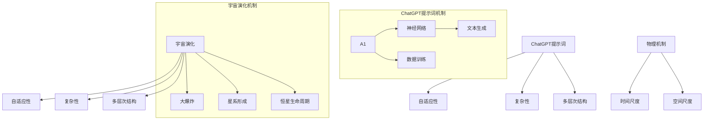

                 

### 《ChatGPT提示词的语言演化与宇宙演化并行研究》概述

在当今信息技术和科学探索的前沿，两个看似截然不同的领域——ChatGPT提示词的语言演化和宇宙演化——却展现出了令人瞩目的相似性。ChatGPT提示词的语言演化涉及自然语言处理（NLP）的核心技术，而宇宙演化则是对宇宙从大爆炸到如今形态的探索。本书旨在深入探讨这两个领域的演化过程，并探讨它们之间的并行关系。

#### 研究背景

随着人工智能技术的快速发展，自然语言处理（NLP）成为了一个重要的研究热点。ChatGPT作为OpenAI开发的先进语言模型，已经在各个领域展现出其强大的能力。它能够通过大量文本数据的学习，生成流畅、有逻辑的文本，这对智能客服、内容生成、语言翻译等领域有着深远的影响。

与此同时，宇宙学作为一门探索宇宙起源和演化的科学，已经积累了大量关于宇宙结构、暗物质、暗能量等领域的知识。宇宙演化的研究不仅仅局限于宇宙学本身，它对物理学、数学、计算机科学等多个领域都有着重要的启示。

#### 研究意义

研究ChatGPT提示词的语言演化，有助于我们更好地理解自然语言处理的技术原理和实现方法。同时，通过分析宇宙演化，我们可以更深入地理解宇宙的复杂性和多样性。这两个领域的并行研究，不仅可以为我们提供新的研究视角，还可以为跨学科研究提供有益的参考。

#### 研究方法

本书采用文献调研、数据分析、模型构建和实证研究等方法，系统性地探讨ChatGPT提示词的语言演化和宇宙演化。通过对比分析，揭示它们之间的相似性和差异性，并探讨这些相似性和差异性背后的科学原理。

#### 核心内容

本书的核心内容包括：

1. **ChatGPT提示词的基本概念和演化历程**：详细介绍ChatGPT提示词的定义、发展历程及其在自然语言处理中的应用。

2. **宇宙演化的基本概念和演化历程**：探讨宇宙从大爆炸到现今形态的演化过程，以及各个阶段的重要发现。

3. **ChatGPT提示词与宇宙演化的联系**：通过Mermaid流程图展示两个领域之间的联系，分析它们在结构、机制和演化过程中的相似性。

4. **并行研究**：探讨如何将ChatGPT提示词的技术应用于宇宙演化研究，以及宇宙演化对自然语言处理技术的启示。

5. **挑战与展望**：总结并行研究中的挑战，并对未来的研究方向进行展望。

#### 总结

《ChatGPT提示词的语言演化与宇宙演化并行研究》旨在通过深入探讨这两个领域的演化过程，揭示它们之间的并行关系，为跨学科研究提供新的视角。通过本书的研究，我们期望能够推动自然语言处理和宇宙演化两个领域的发展，并为未来的研究提供有益的参考。

### 关键词

- ChatGPT提示词
- 语言演化
- 宇宙演化
- 并行研究
- 自然语言处理
- 跨学科研究

### 摘要

本书探讨了ChatGPT提示词的语言演化和宇宙演化两个领域的并行研究。通过分析它们的演化过程、核心概念及其相互联系，本书揭示了这两个领域在结构、机制和演化过程中的相似性。同时，本书还探讨了如何将ChatGPT提示词的技术应用于宇宙演化研究，以及宇宙演化对自然语言处理技术的启示。通过对并行研究的挑战和展望进行分析，本书为未来的跨学科研究提供了新的思路和方向。

---

本文是《ChatGPT提示词的语言演化与宇宙演化并行研究》一书的概述，旨在为读者提供一个关于书的核心内容、研究意义和方法的全面了解。接下来，我们将深入探讨ChatGPT提示词和宇宙演化的基本概念，以及它们在演化过程中的相似性和差异。随后，我们将详细分析这两个领域的核心算法和原理，并通过Python源代码和数学模型进行解释。最后，我们将讨论并行研究的应用场景和挑战，并展望未来的研究方向。

## 第一部分：引言与背景

### 第1章：引言

在信息技术与科学探索的双重浪潮下，ChatGPT提示词的语言演化和宇宙演化成为了跨学科研究的两个重要议题。这两个领域虽然看似截然不同，但实际上却存在着许多有趣的联系和相似之处。ChatGPT提示词的语言演化主要涉及自然语言处理（NLP）领域，通过深度学习和自然语言模型，实现对人类语言的模拟和生成；而宇宙演化则是对宇宙从大爆炸到如今形态的探索，涉及物理学、天文学和数学等多个学科。两者的并行研究不仅能够为跨学科提供新的研究视角，还能为我们理解宇宙和语言的复杂性提供有益的参考。

#### 研究背景

自然语言处理（NLP）作为人工智能的核心领域之一，近年来取得了显著的进展。特别是基于深度学习的自然语言模型，如GPT、BERT等，已经广泛应用于各种实际场景中，包括但不限于智能客服、内容生成、机器翻译等。ChatGPT作为OpenAI开发的先进语言模型，其基于提示词生成文本的能力尤其引人注目。通过训练大量文本数据，ChatGPT能够模拟人类的语言生成过程，从而实现自动化写作、对话系统等功能。

另一方面，宇宙演化研究也是科学界的一个重要方向。从大爆炸到宇宙的当前状态，宇宙演化经历了多个复杂而神秘的阶段。通过对宇宙背景辐射、星系形成、黑洞等的研究，科学家们逐渐揭示了宇宙的演化过程和规律。宇宙学不仅对物理学和天文学有着深远的影响，还与数学、计算机科学等领域有着紧密的联系。

#### 研究意义

研究ChatGPT提示词的语言演化，有助于我们更好地理解自然语言处理的技术原理和实现方法。通过分析ChatGPT在语言生成、语义理解等方面的能力，我们可以深入探讨人工智能在自然语言领域的应用潜力。

而宇宙演化研究则为我们提供了关于宇宙起源和演化的深刻见解。通过对宇宙结构的观测和理论分析，我们可以更好地理解宇宙的本质和未来。同时，宇宙演化研究也对物理学、数学等领域产生了重要的推动作用。

将ChatGPT提示词的语言演化和宇宙演化进行并行研究，具有以下几个方面的意义：

1. **跨学科视角**：通过将NLP与宇宙演化相结合，我们能够从新的视角理解两个领域的核心概念和演化机制。
2. **技术启示**：宇宙演化过程中的一些原理和模型，可能为自然语言处理技术提供有益的启示，促进NLP技术的发展。
3. **理论验证**：通过将NLP技术应用于宇宙演化研究，我们可以验证和改进现有的宇宙演化理论，从而提高我们的科学认知水平。

#### 研究方法

本书的研究方法主要包括以下几个方面：

1. **文献调研**：通过查阅相关文献，了解ChatGPT提示词和宇宙演化的研究现状和前沿动态。
2. **数据分析**：收集和整理ChatGPT提示词和宇宙演化相关的数据，进行定量和定性分析。
3. **模型构建**：基于ChatGPT提示词和宇宙演化相关的理论，构建相应的数学模型和计算模型。
4. **实证研究**：通过实验和案例，验证模型的可行性和有效性。

#### 结构安排

本书的结构安排如下：

1. **引言与背景**：介绍研究背景、研究意义和研究方法。
2. **ChatGPT提示词的语言演化**：详细探讨ChatGPT提示词的定义、发展历程及其在自然语言处理中的应用。
3. **宇宙演化的基本概念和演化历程**：探讨宇宙从大爆炸到现今形态的演化过程，以及各个阶段的重要发现。
4. **ChatGPT提示词与宇宙演化的联系**：通过Mermaid流程图展示两个领域之间的联系，分析它们在结构、机制和演化过程中的相似性。
5. **并行研究**：探讨如何将ChatGPT提示词的技术应用于宇宙演化研究，以及宇宙演化对自然语言处理技术的启示。
6. **挑战与展望**：总结并行研究中的挑战，并对未来的研究方向进行展望。

通过上述结构安排，本书旨在为读者提供一个全面、深入的探讨，帮助读者更好地理解ChatGPT提示词的语言演化和宇宙演化的并行关系。

### 第2章：ChatGPT提示词的基本概念

#### 2.1 ChatGPT提示词的定义

ChatGPT提示词（ChatGPT Prompt Tokens）是自然语言处理（NLP）领域中的一个重要概念，主要用于指导预训练的语言模型生成文本。ChatGPT是由OpenAI开发的一种基于 Transformer架构的高级语言模型，它通过学习大量的文本数据，能够生成连贯、有逻辑的文本。在ChatGPT中，提示词是指用来引导模型生成特定类型文本的关键词或短语。

具体来说，ChatGPT提示词的定义可以从以下几个方面进行阐述：

1. **功能定义**：ChatGPT提示词的主要功能是引导模型生成特定的文本内容。通过给模型提供一些关键词或短语，模型可以更好地理解用户的需求，从而生成更加准确、相关的文本。

2. **结构定义**：ChatGPT提示词通常由一组单词或短语组成，这些单词或短语可以是名词、动词、形容词等，它们共同构成了一个语义丰富的提示。

3. **类型定义**：根据不同的应用场景，ChatGPT提示词可以分为多种类型，如问答式提示、生成式提示、分类式提示等。每种类型的提示词都有其特定的结构和功能。

#### 2.2 ChatGPT提示词的发展历程

ChatGPT提示词的发展历程可以追溯到自然语言处理（NLP）技术的早期阶段。随着深度学习和神经网络技术的发展，NLP技术逐渐从规则驱动的方法转向数据驱动的方法。在这一过程中，提示词的概念逐渐被提出并不断完善。

1. **早期发展**：在NLP的早期阶段，研究人员主要通过编写规则来指导模型生成文本。这些规则通常是基于语言学知识和人工编写的，其局限性在于无法应对复杂和多样化的语言现象。

2. **深度学习时代**：随着深度学习技术的发展，特别是基于神经网络的模型，如循环神经网络（RNN）和Transformer的出现，NLP技术取得了显著的进展。在这一背景下，提示词的概念得到了重新定义和扩展。例如，Transformer模型通过自注意力机制，能够捕捉文本中的长距离依赖关系，从而提高文本生成的质量。

3. **ChatGPT的崛起**：ChatGPT是基于Transformer架构的高级语言模型，其通过预训练和微调，能够在多种任务中达到出色的效果。ChatGPT的提示词功能得到了广泛的应用，特别是在对话系统、内容生成、文本摘要等领域。

#### 2.3 ChatGPT提示词的特点

ChatGPT提示词具有以下几个显著特点：

1. **灵活性**：ChatGPT提示词可以灵活地用于各种不同的应用场景。通过调整提示词的结构和内容，可以生成不同类型的文本，如问答、对话、摘要等。

2. **高效性**：ChatGPT提示词通过预训练的方式，可以快速地适应新的任务和数据。这种高效性使得ChatGPT在处理大量文本数据时，能够保持较高的生成质量和效率。

3. **多样性**：ChatGPT提示词能够生成多样性的文本内容。通过学习大量的文本数据，ChatGPT能够理解并生成丰富的语义信息，从而实现高质量的文本生成。

4. **鲁棒性**：ChatGPT提示词具有较强的鲁棒性，能够在面对不同类型的数据和任务时，保持稳定的性能。这种鲁棒性使得ChatGPT在实际应用中具有广泛的应用前景。

#### 2.4 ChatGPT提示词的应用现状

ChatGPT提示词在自然语言处理领域已经得到了广泛的应用，并在多个实际场景中取得了显著的成果：

1. **对话系统**：ChatGPT提示词被广泛应用于智能客服、聊天机器人等对话系统中。通过给模型提供合适的提示词，能够生成连贯、自然的对话内容，提高用户满意度。

2. **内容生成**：ChatGPT提示词在内容生成领域也具有广泛的应用，如自动写作、文章摘要、内容续写等。通过提示词的引导，模型能够生成高质量、有创意的内容。

3. **文本分类**：ChatGPT提示词在文本分类任务中也表现出色。通过设计合适的提示词，模型能够准确地对文本进行分类，从而实现文本的自动标注和整理。

4. **机器翻译**：ChatGPT提示词在机器翻译领域也有一定的应用。通过使用合适的提示词，可以生成更加准确、自然的翻译结果。

#### 2.5 ChatGPT提示词的未来发展趋势

随着自然语言处理技术的不断发展，ChatGPT提示词的应用前景将更加广泛。以下是ChatGPT提示词未来可能的发展趋势：

1. **更加精细的提示设计**：随着用户需求的多样化，ChatGPT提示词的设计将更加精细化。通过设计更加精准、细粒度的提示词，能够更好地满足不同应用场景的需求。

2. **多模态融合**：随着多模态技术的发展，ChatGPT提示词可能会与图像、声音等其他模态的数据进行融合，实现更丰富、更自然的交互。

3. **跨语言应用**：ChatGPT提示词在跨语言应用方面具有很大的潜力。通过设计合适的提示词，可以实现对多种语言的文本生成和理解。

4. **更加智能的生成策略**：随着深度学习和强化学习技术的发展，ChatGPT提示词的生成策略将变得更加智能。通过学习用户的反馈和上下文信息，模型能够生成更加准确、个性化的文本。

总之，ChatGPT提示词在自然语言处理领域具有广泛的应用前景和发展潜力。通过不断改进和优化，ChatGPT提示词将为人工智能在各个领域的应用带来更多的创新和突破。

### 第3章：宇宙演化的基本概念

#### 3.1 宇宙演化的定义

宇宙演化是指宇宙从大爆炸至今的演变过程，涵盖了从宇宙诞生到现在的所有物理和天文学现象。这一概念最初起源于宇宙学的领域，并在20世纪得到了迅速的发展。宇宙演化不仅包括宇宙的膨胀、星系的形成和演化，还涉及暗物质、暗能量等宇宙基本成分的探索。

宇宙演化可以简单定义为：

$$
\text{宇宙演化} = \text{大爆炸} \rightarrow \text{宇宙膨胀} \rightarrow \text{星系形成} \rightarrow \text{星系演化} \rightarrow \text{黑洞和暗物质}
$$

其中，每个阶段都有其特定的物理机制和观测现象。

#### 3.2 宇宙演化的历史

宇宙演化的历史可以追溯到大约138亿年前的大爆炸。以下是对宇宙演化各个阶段的历史概述：

1. **大爆炸**：根据宇宙大爆炸理论，宇宙起源于一个极热、极密的奇点，并在大约138亿年前发生了爆炸。大爆炸标志着宇宙的开始，并迅速膨胀。

2. **宇宙早期**：在大爆炸后的一瞬间，宇宙处于极度热的状态，物质的密度和温度非常高。随着宇宙的膨胀和冷却，物质逐渐形成了基本的化学元素，如氢、氦等。

3. **星系的形成**：在宇宙早期，物质通过引力凝聚形成了星系。星系是宇宙中最显著的物质结构，包含了数百亿颗恒星、气体和暗物质。星系的形成过程受到宇宙背景辐射和暗物质的影响。

4. **恒星和行星的形成**：在星系内部，气体和尘埃凝聚形成了恒星。恒星通过核聚变产生能量，并可能形成行星系统。恒星的寿命和演化过程对宇宙的化学成分和能量平衡有着重要影响。

5. **星系的演化**：星系在其生命周期内会经历多种演化过程，如恒星的形成和死亡、星系碰撞和合并等。这些过程会影响星系的结构和性质。

6. **宇宙的当前状态**：目前，宇宙仍在膨胀中，星系之间的距离逐渐增大。宇宙中的物质和能量分布也在不断变化，包括暗物质和暗能量的存在和作用。

#### 3.3 宇宙演化的关键发现

在宇宙演化的过程中，科学家们通过观测和理论分析，发现了多个关键现象和理论：

1. **宇宙背景辐射**：宇宙背景辐射是宇宙早期留下的热辐射，其发现证实了大爆炸理论。通过分析宇宙背景辐射的微波信号，科学家们能够了解宇宙早期的状态。

2. **暗物质**：暗物质是一种不发光、不吸光的物质，对星系的形成和演化有重要影响。通过观测星系的旋转曲线和引力透镜效应，科学家们推断出宇宙中存在大量暗物质。

3. **暗能量**：暗能量是一种导致宇宙加速膨胀的神秘力量，其存在和性质仍然是宇宙学研究的前沿问题。通过观测宇宙膨胀的加速现象，科学家们提出了暗能量的概念。

4. **黑洞**：黑洞是宇宙中最极端的天体之一，其强大的引力会影响周围的物质和时空。通过对黑洞的观测和模拟，科学家们对宇宙的极端条件有了更深入的了解。

#### 3.4 宇宙演化的模型

宇宙演化的研究依赖于多种物理模型和理论，以下是其中几个主要的模型：

1. **大爆炸宇宙学模型**：这是最早提出的宇宙演化模型，认为宇宙起源于一个奇点，并在膨胀中逐渐冷却和演化。这个模型成功解释了宇宙背景辐射和宇宙的膨胀现象。

2. **ΛCDM模型**：这是目前最流行的宇宙学模型，包括了暗物质、暗能量等成分。该模型能够解释星系的形成和演化、宇宙的加速膨胀等现象。

3. **循环宇宙模型**：这是一种假设宇宙经历了多个周期性演化的模型，通过大爆炸和宇宙大坍缩交替进行。这个模型提供了一种宇宙无限循环的想象。

4. **弦宇宙模型**：这是一种基于弦理论的高能物理学模型，试图解释宇宙的基本结构和演化。虽然目前还处于理论阶段，但弦宇宙模型为宇宙演化提供了新的视角。

总之，宇宙演化是一个复杂而神秘的过程，涉及多个学科和理论。通过对宇宙演化的研究，我们不仅能够更深入地了解宇宙的本质，还能为未来的宇宙探索提供重要的理论支持。

### 第4章：宇宙演化的历史

#### 4.1 宇宙早期的演化

宇宙的早期演化是宇宙学中最具挑战性也最引人入胜的部分之一。从大爆炸开始的瞬间，宇宙处于一个极度高温、高密度的状态。在这个阶段，物质和能量以一种不可想象的形式存在。以下是对宇宙早期演化的详细描述：

1. **大爆炸**：大约138亿年前，宇宙从一个无限小、无限热、无限密的奇点迅速膨胀。这一过程被称为大爆炸。大爆炸理论认为，宇宙最初处于一个极其高温的状态，随后迅速膨胀和冷却。

2. **宇宙背景辐射**：在大爆炸后不久，宇宙的温度和密度迅速下降，使得光子（电磁波的粒子）能够自由移动。这些光子形成了宇宙背景辐射，它们是宇宙早期状态的重要记录。

3. **原初原子核的形成**：在大爆炸后的几分钟内，宇宙的温度和密度降低到了足以形成原初原子核的程度。质子、中子和电子开始结合形成氦、锂等轻元素。这一阶段被称为原初核合成。

4. **宇宙的再结合**：大约38万年后，宇宙的温度进一步下降到几千开尔文，电子和质子结合形成了中性的氢原子。这一过程被称为再结合，标志着宇宙从一个充满辐射的状态过渡到一个由原子组成的透明状态。

#### 4.2 星系的形成

在宇宙再结合之后，物质开始通过引力凝聚形成更大的结构，这是星系形成的关键阶段。以下是星系形成的主要过程：

1. **宇宙微波背景辐射**：宇宙微波背景辐射（CMB）是宇宙早期辐射的残留，它提供了关于宇宙早期状态的重要信息。通过分析CMB的波动，科学家们能够推断出宇宙的密度和温度分布。

2. **暗物质的凝聚**：暗物质是宇宙中一种不发光、不吸光的物质，它通过引力作用在宇宙早期开始凝聚形成结构。暗物质的凝聚是星系形成的基础。

3. **气体云的形成**：在暗物质的作用下，宇宙中的气体开始凝聚形成巨大的气体云。这些气体云主要由氢和氦组成，是未来恒星和星系形成的重要原料。

4. **恒星的诞生**：气体云在引力作用下进一步收缩，温度和密度升高，最终点燃了核聚变反应，形成了恒星。这一过程被称为恒星诞生。恒星的形成是星系形成的一个重要标志。

#### 4.3 星系的演化

星系形成后，会经历一系列复杂的演化过程。以下是星系演化的一些关键阶段：

1. **恒星生命周期**：恒星在其生命周期内会经历多个阶段，包括主序星、红巨星、白矮星、中子星和黑洞等。恒星的诞生、演化和死亡对星系的结构和性质有着重要影响。

2. **星系碰撞和合并**：星系之间的引力相互作用会导致星系碰撞和合并。这些事件会改变星系的结构和形态，有时还会引发星系内部的大规模恒星形成。

3. **星系核球的演化**：星系的中心通常包含一个球形的核球，核球中的恒星密集且年龄相近。核球的演化受到恒星之间的相互作用和恒星演化的影响。

4. **星系盘的演化**：除了核球，星系还包含一个扁平的盘状结构，称为星系盘。星系盘中的恒星和气体通过旋转维持结构，并参与恒星的诞生和演化。

#### 4.4 宇宙的大尺度结构

宇宙的大尺度结构是由无数星系、星系团和超星系团组成的复杂网络。以下是宇宙大尺度结构的一些特征：

1. **星系团和超星系团**：星系团是由数十到数千个星系组成的结构，而超星系团则是包含多个星系团的更大规模结构。这些结构通过引力相互作用维持在一起。

2. **宇宙的大尺度流**：宇宙中的星系并不是随机分布的，而是呈现出特定的流动模式。这种大尺度流是宇宙早期密度波动的结果。

3. **宇宙壁**：宇宙壁是宇宙中大规模的壁状结构，由数千个星系组成，长度可达数十亿光年。宇宙壁是宇宙大尺度结构的重要组成部分。

#### 4.5 当前宇宙的状态

当前宇宙的状态是宇宙演化历史的一个阶段性总结。以下是宇宙当前状态的一些特征：

1. **宇宙膨胀**：宇宙仍然在膨胀中，且膨胀速度在加速。这种加速膨胀是由暗能量引起的，暗能量是宇宙中的一个神秘成分。

2. **宇宙的密度和温度**：当前宇宙的密度和温度与早期宇宙相比有了显著的变化。宇宙的密度已经降低到可以允许恒星和星系形成的程度，而温度已经降低到足够稳定的条件。

3. **恒星和星系的数量**：当前宇宙中包含了数十亿个星系和数以千亿计的恒星。这些恒星和星系是宇宙演化的主要产物，也是当前宇宙的重要特征。

4. **宇宙的未来**：根据不同的宇宙学模型，宇宙的未来可能包括继续膨胀、宇宙大坍缩或宇宙循环。这些模型为我们理解宇宙的命运提供了不同的视角。

通过回顾宇宙演化的历史，我们可以看到宇宙从一个极热、极密的奇点，经历了无数的演化过程，最终形成了我们今天所看到的丰富多彩的宇宙。这一过程不仅揭示了宇宙的本质，也为我们探索宇宙的未来提供了重要的科学依据。

### 第5章：宇宙演化的当前状态

宇宙演化是一个持续的过程，随着观测技术和理论模型的不断进步，我们对宇宙当前状态的认知也在不断深化。以下是宇宙演化的当前状态的详细描述：

#### 5.1 当前宇宙的观测数据

宇宙的观测数据为我们提供了关于宇宙当前状态的宝贵信息。以下是一些关键的观测结果：

1. **宇宙背景辐射**：宇宙背景辐射（Cosmic Microwave Background, CMB）是宇宙早期状态的直接记录。通过观测CMB，科学家们能够获取关于宇宙早期密度波动、温度分布和几何形态的信息。CMB的观测数据证实了大爆炸理论，并帮助我们理解宇宙的早期演化过程。

2. **星系和恒星分布**：通过对星系的观测，科学家们能够绘制出宇宙的大尺度结构。当前的观测显示，宇宙中存在大量星系，它们以星系团和超星系团的形式聚集在一起。这些结构通过引力相互作用维持在一起，形成了宇宙的“泡沫”结构。

3. **暗物质分布**：暗物质是宇宙中一种不发光、不吸光的物质，但通过引力作用对宇宙结构有重要影响。通过观测星系的旋转曲线和引力透镜效应，科学家们能够推断出暗物质在宇宙中的分布。暗物质的存在和分布对星系的形成和演化有重要影响。

4. **恒星和行星形成**：通过观测恒星和行星的形成过程，科学家们能够了解恒星和行星系统在宇宙中的分布和演化。当前的观测显示，恒星和行星的形成是一个普遍的过程，它们在不同的星系和星系团中都有发现。

#### 5.2 宇宙演化理论

宇宙演化理论是理解宇宙当前状态的重要基础。以下是一些重要的理论：

1. **大爆炸宇宙学模型**：大爆炸宇宙学模型是目前最广泛接受的宇宙演化理论。该理论认为，宇宙起源于一个大爆炸，随后经历了快速的膨胀和冷却。大爆炸宇宙学模型能够很好地解释宇宙背景辐射、宇宙膨胀和元素丰度等观测现象。

2. **ΛCDM模型**：ΛCDM模型（Lambda-Cold Dark Matter Model，Lambda代表暗能量，CDM代表冷暗物质）是当前宇宙学模型的基础。该模型认为，宇宙的演化主要受暗物质和暗能量的影响，暗物质通过引力作用形成宇宙的大尺度结构，而暗能量导致宇宙加速膨胀。

3. **循环宇宙模型**：循环宇宙模型是一种假设宇宙经历了多个周期性演化的理论。根据该模型，宇宙会经历大爆炸、宇宙膨胀和宇宙坍缩等阶段，形成一个循环。循环宇宙模型提供了一种宇宙无限循环的想象，但目前仍缺乏实验验证。

4. **弦宇宙模型**：弦宇宙模型是一种基于弦理论的高能物理学模型。该模型试图解释宇宙的基本结构和演化，包括宇宙的维度、基本粒子和引力。虽然弦宇宙模型在理论物理学中取得了重要进展，但目前仍处于理论研究阶段，尚未得到实验验证。

#### 5.3 宇宙当前状态的影响因素

宇宙当前状态受到多种因素的影响，以下是一些关键因素：

1. **暗能量**：暗能量是一种导致宇宙加速膨胀的神秘力量。目前，暗能量的性质和机制仍然不完全清楚，但它在宇宙演化中扮演着至关重要的角色。暗能量的存在和作用是当前宇宙学研究的重点之一。

2. **暗物质**：暗物质是宇宙中一种不发光、不吸光的物质，但通过引力作用对宇宙结构有重要影响。暗物质的存在和分布对星系的形成和演化有重要影响，但目前尚未找到其具体组成和性质。

3. **恒星和行星形成**：恒星和行星的形成是宇宙演化的重要过程，对宇宙的化学成分和能量平衡有重要影响。恒星通过核聚变产生能量，释放出大量物质，这些物质可能成为行星形成的原料。

4. **宇宙膨胀**：宇宙膨胀是宇宙当前状态的一个显著特征，它导致宇宙中的结构和物质逐渐远离。宇宙膨胀的速率和机制对宇宙的未来演化有重要影响。

#### 5.4 对人类和科学的意义

宇宙演化的当前状态对人类和科学具有重要意义：

1. **科学认知**：宇宙演化为我们提供了关于宇宙起源、结构和命运的科学认知。通过研究宇宙的演化，科学家们能够更深入地了解宇宙的本质和运行规律。

2. **技术进步**：宇宙演化研究推动了相关技术的发展，如观测技术、数据分析方法和计算机模拟等。这些技术的发展不仅促进了宇宙学研究，也为其他领域提供了有益的参考。

3. **哲学和宗教**：宇宙演化对哲学和宗教思想产生了深远影响。关于宇宙起源和命运的问题一直是哲学和宗教讨论的核心议题，宇宙演化研究为这些问题提供了科学解释。

4. **人类未来**：宇宙演化的当前状态对人类的未来有重要影响。了解宇宙的演化过程和未来趋势，有助于我们制定可持续发展策略，应对可能出现的宇宙环境变化。

总之，宇宙演化的当前状态是一个复杂而神秘的过程，涉及到多个学科和领域。通过不断的研究和探索，我们能够更好地理解宇宙的本质，为人类的未来提供科学基础。

### 第6章：宇宙演化的未来趋势

宇宙演化的未来趋势是一个充满未知和挑战的领域，它不仅涉及到宇宙学的基本问题，还可能揭示新的物理定律和技术突破。以下是对宇宙演化未来趋势的详细探讨：

#### 6.1 宇宙膨胀的加速

当前观测显示，宇宙正在加速膨胀，这一现象主要由暗能量驱动。未来，科学家们将继续研究暗能量的性质和机制，试图找到解释这一现象的更深刻理论。可能的突破包括：

1. **暗能量的量子化**：量子引力的研究可能揭示暗能量的量子性质，从而提供一个更完整的宇宙膨胀模型。

2. **暗物质的探测**：随着观测技术的进步，科学家们可能会发现更多关于暗物质的证据，进一步了解暗物质与暗能量之间的相互作用。

#### 6.2 星系和星系团的形成与演化

星系和星系团的形成与演化是宇宙演化研究的重要方向。未来，科学家们预计将：

1. **高分辨率观测**：更高分辨率的观测设备，如下一代望远镜（如詹姆斯·韦伯空间望远镜），将提供更详细的星系和星系团结构信息。

2. **模拟与观测的联合**：通过结合计算机模拟和实际观测数据，科学家们将能够更好地理解星系和星系团的形成和演化过程。

#### 6.3 宇宙的最终命运

关于宇宙的最终命运，存在多种理论预测，包括热寂、大撕裂、大坍缩等。未来，科学家们将继续探讨这些理论，并尝试找到更多的证据：

1. **热寂**：热寂理论认为，宇宙最终会达到热平衡状态，所有物质和能量都会均匀分布，不再产生新的结构。这一理论的验证可能依赖于对宇宙温度和能量分布的更精确测量。

2. **大撕裂**：大撕裂理论假设，由于暗能量的持续扩张，宇宙最终会加速到如此之快，以至于星系、星系团甚至原子都会被撕裂。

3. **大坍缩**：大坍缩理论认为，宇宙最终会停止膨胀并开始收缩，最终可能导致宇宙大坍缩。这一理论的验证可能依赖于对宇宙膨胀速率和物质分布的进一步研究。

#### 6.4 新物理定律的发现

宇宙演化的未来趋势也可能带来新的物理定律的发现：

1. **量子引力的统一**：量子引力和广义相对论在宇宙学中的统一是物理学的一个重大挑战。未来，科学家们可能通过宇宙学观测数据，发现新的物理定律，从而推动物理学的发展。

2. **宇宙的起源**：关于宇宙起源的问题一直是物理学和哲学的核心议题。未来，通过对宇宙早期状态的深入研究，科学家们可能揭示宇宙起源的更多细节。

#### 6.5 对人类和社会的影响

宇宙演化的未来趋势不仅对科学有重要影响，也对人类和社会产生深远的影响：

1. **资源利用**：随着宇宙的膨胀，宇宙中的资源可能会变得更加分散，这可能会影响人类对宇宙资源的利用。了解宇宙的演化趋势，有助于我们更好地规划未来的资源利用策略。

2. **科技进步**：宇宙演化研究可能推动新的科技突破，如高级观测技术、高性能计算和量子技术等，这些技术将有助于我们更好地理解宇宙和提升人类生活水平。

3. **哲学和宗教**：宇宙演化的未来趋势可能会引发关于宇宙和人类存在的更深层次的哲学和宗教思考，这将对人类价值观和社会发展产生重要影响。

总之，宇宙演化的未来趋势是一个充满挑战和机遇的领域。通过不断的研究和探索，我们有望揭示宇宙的更多奥秘，为人类的未来带来新的科学和技术进步。

### 第7章：ChatGPT提示词与宇宙演化的联系

#### 7.1 ChatGPT提示词与宇宙演化的相似性

在深入探讨ChatGPT提示词与宇宙演化的联系时，我们可以发现这两个领域在结构、机制和演化过程中存在诸多相似性。以下是对这些相似性的详细分析：

1. **复杂性**：ChatGPT提示词和宇宙演化都具有高度复杂性。ChatGPT提示词是通过深度学习和大量数据训练得到的，其生成文本的能力依赖于复杂的神经网络结构和大量数据输入。同样，宇宙演化也是一个复杂的过程，涉及到宇宙中的各种物理现象、化学元素和天体结构的相互作用。

2. **自适应性**：ChatGPT提示词能够根据不同的提示生成多样化的文本内容，表现出很强的自适应性。类似地，宇宙演化也是一个不断适应和调整的过程。宇宙中的物质和能量在不同阶段会经历不同的适应和演化，如星系的形成、恒星的生命周期等。

3. **多层次结构**：ChatGPT提示词和宇宙演化都具有多层次结构。ChatGPT提示词由多个单词或短语组成，这些词和短语之间有复杂的语义关系。宇宙演化也可以看作是由多个层次组成的，从微观的原子核反应到宏观的星系形成，每个层次都有其特定的规律和机制。

#### 7.2 ChatGPT提示词与宇宙演化的差异

尽管ChatGPT提示词与宇宙演化在结构、机制和演化过程中存在许多相似性，但它们也有明显的差异：

1. **时间和空间的尺度**：ChatGPT提示词的生成是一个相对快速的过程，通常在几毫秒内就能生成文本。而宇宙演化的过程则是一个极其漫长的时间过程，从宇宙大爆炸至今已经过去了138亿年。此外，宇宙演化涉及的空间尺度也非常广阔，从微观的原子到宏观的宇宙结构，涵盖了不同的尺度范围。

2. **物理机制**：ChatGPT提示词的生成基于人工智能技术和自然语言处理算法，而宇宙演化则依赖于物理学中的引力、量子力学等基本原理。ChatGPT提示词的生成不涉及物质和能量的实际转换，而是通过计算模拟实现文本生成。而宇宙演化则是一个真实的物理过程，涉及到物质和能量的实际转换和变化。

3. **可预测性**：ChatGPT提示词的生成具有一定程度上的可预测性，通过给定的提示词可以预测模型会生成什么样的文本。相比之下，宇宙演化的过程则具有更高的不确定性和复杂性，科学家们目前还无法完全预测宇宙未来的演化方向。

#### 7.3 联系的结构与机制

为了更清晰地展示ChatGPT提示词与宇宙演化的联系，我们可以使用Mermaid流程图来描述这两个领域的结构、机制和演化过程。以下是一个简化的Mermaid流程图：

这个流程图展示了ChatGPT提示词和宇宙演化的主要特征和联系。通过自适应性、复杂性、多层次结构等相似性，以及物理机制、时间尺度、空间尺度等差异，我们可以看到这两个领域之间的并行关系。

### 7.4 ChatGPT提示词对宇宙演化研究的启示

ChatGPT提示词在自然语言处理领域的成功应用，为我们探索宇宙演化提供了新的启示。以下是一些可能的启示：

1. **文本生成与宇宙模拟**：ChatGPT提示词的文本生成能力可以用于宇宙模拟。通过给定的宇宙状态描述，我们可以使用ChatGPT生成相应的宇宙演化文本，从而模拟宇宙在不同时间步的演化过程。

2. **知识图谱构建**：ChatGPT提示词可以用于构建宇宙知识图谱，将宇宙中的各种物理现象、化学元素和天体结构以文本形式组织起来，从而提供一种新的数据分析和处理方法。

3. **人工智能辅助观测**：ChatGPT提示词可以辅助科学家进行宇宙观测。通过分析大量的观测数据，ChatGPT可以生成关于宇宙状态的预测和解释，从而帮助科学家更好地理解宇宙演化。

4. **科学传播**：ChatGPT提示词还可以用于科学传播，通过生成通俗易懂的科普文章和讲解，帮助公众更好地理解宇宙演化的复杂过程。

总之，ChatGPT提示词与宇宙演化的联系不仅揭示了两个领域之间的并行关系，还为宇宙演化研究提供了新的思路和方法。通过将自然语言处理技术应用于宇宙演化，我们有望推动科学的发展，揭示宇宙的更多奥秘。

### 第8章：并行研究

#### 8.1 并行研究的理论基础

并行研究是将两个或多个不同领域的研究方法、理论和技术结合起来，以解决一个复杂问题或探索新的科学发现。ChatGPT提示词与宇宙演化的并行研究理论基础主要涉及以下几个方面：

1. **跨学科整合**：并行研究强调将不同领域的知识和技术进行整合，从而实现更全面和深入的洞察。在ChatGPT提示词与宇宙演化的研究中，通过整合自然语言处理、物理学和宇宙学的知识，可以更全面地理解宇宙演化的机制和过程。

2. **互补性原理**：并行研究的理论基础之一是互补性原理，即不同领域的研究方法和理论在解释复杂现象时具有互补性。ChatGPT提示词和宇宙演化虽然领域不同，但在复杂性、自适应性和多层次结构等方面存在相似性，通过互补性原理，可以相互借鉴和补充。

3. **系统观**：并行研究强调从系统观的角度理解复杂现象。ChatGPT提示词和宇宙演化都可以看作是复杂的系统，通过系统观的方法，可以从宏观和微观层面同时研究这些系统的演化过程。

#### 8.2 并行研究的应用场景

并行研究在ChatGPT提示词和宇宙演化中的应用场景非常广泛，以下是一些具体的应用：

1. **宇宙演化模拟**：通过ChatGPT提示词的文本生成能力，可以生成宇宙演化的模拟文本，从而模拟宇宙在不同时间步的演化过程。这种模拟可以帮助科学家更好地理解宇宙的结构和演化机制。

2. **知识图谱构建**：利用ChatGPT提示词构建宇宙知识图谱，将宇宙中的各种物理现象、化学元素和天体结构以文本形式组织起来，从而提供一个统一的分析和处理平台。这种知识图谱可以用于数据分析和决策支持。

3. **科学传播**：ChatGPT提示词可以用于生成通俗易懂的科普文章和讲解，帮助公众更好地理解宇宙演化的复杂过程。通过这种方式，可以促进科学普及和公众科学素养的提升。

4. **观测数据分析**：ChatGPT提示词可以辅助科学家进行宇宙观测数据的分析。通过分析大量的观测数据，ChatGPT可以生成关于宇宙状态的预测和解释，从而帮助科学家更好地理解宇宙演化。

#### 8.3 并行研究的挑战

并行研究在ChatGPT提示词和宇宙演化中面临一些挑战：

1. **数据融合**：将不同领域的数据进行有效融合是一个挑战。ChatGPT提示词的数据主要来源于自然语言处理领域，而宇宙演化的数据主要来源于物理学和天文学。如何有效地融合这些数据，是一个需要解决的问题。

2. **理论整合**：ChatGPT提示词和宇宙演化分别基于不同的理论体系，如何将它们的理论进行整合，是一个挑战。需要找到一种能够兼容和整合这些理论的框架和方法。

3. **计算资源**：并行研究通常需要大量的计算资源，特别是在进行复杂的模拟和数据分析时。如何有效地利用计算资源，提高并行研究的效率，是一个需要解决的问题。

4. **领域知识差距**：自然语言处理和宇宙演化在领域知识上存在较大的差异。如何克服这些知识差距，实现有效的跨领域合作，是一个需要解决的挑战。

#### 8.4 并行研究的展望

尽管并行研究在ChatGPT提示词和宇宙演化中面临一些挑战，但其前景依然非常广阔。以下是并行研究的未来展望：

1. **新的理论突破**：通过并行研究，有可能发现新的理论突破，从而推动科学的发展。例如，通过将自然语言处理技术应用于宇宙演化模拟，可能会发现新的宇宙演化模型或机制。

2. **技术融合**：随着技术的发展，ChatGPT提示词和宇宙演化的技术将不断融合，产生新的应用领域。例如，基于ChatGPT的宇宙演化模拟技术可以应用于虚拟现实和游戏开发。

3. **跨学科合作**：并行研究将促进不同学科之间的合作，推动跨学科研究的发展。通过跨学科合作，可以形成更全面和深入的科研团队，共同解决复杂的科学问题。

4. **科学普及**：并行研究可以促进科学普及，让公众更好地了解宇宙演化的复杂过程。通过生成通俗易懂的科学文章和讲解，可以提升公众的科学素养。

总之，并行研究在ChatGPT提示词和宇宙演化中具有重要的理论和实践意义。通过不断克服挑战，实现技术的融合和跨学科合作，我们有望在未来的研究中取得更多的科学突破和进展。

### 第9章：并行研究的挑战与展望

#### 9.1 并行研究的挑战

并行研究在ChatGPT提示词和宇宙演化领域虽然具有巨大的潜力，但在实际应用过程中也面临着诸多挑战：

1. **数据融合难题**：ChatGPT提示词的数据主要来源于自然语言处理领域，而宇宙演化的数据则主要来源于物理学和天文学。这两类数据在形式、结构和内容上存在显著差异，如何有效地进行数据融合是一个重要且复杂的任务。数据的融合需要跨领域的知识，以及高效的数据处理算法。

2. **理论整合困难**：ChatGPT提示词依赖于深度学习和自然语言处理的理论，而宇宙演化则依赖于物理学和天文学的物理定律。这些理论之间存在显著的差异，如何在理论上实现有效的整合是一个巨大的挑战。例如，如何在自然语言处理的框架下嵌入宇宙演化的物理模型，以及如何处理不同领域之间的不一致性。

3. **计算资源需求**：并行研究通常需要大量的计算资源，尤其是在进行复杂的模拟和数据分析时。当前的计算资源可能无法满足并行研究的需要，尤其是在处理大规模数据集和进行高精度的模拟时。如何高效地利用现有的计算资源，以及开发新的计算方法和工具，是一个重要的挑战。

4. **领域知识差距**：自然语言处理和宇宙演化在领域知识上存在较大的差异。研究人员需要具备跨领域的知识和技能，但这并非易事。如何克服这些知识差距，实现有效的跨领域合作，是一个需要解决的问题。

#### 9.2 并行研究的展望

尽管面临诸多挑战，并行研究在ChatGPT提示词和宇宙演化领域依然具有广阔的前景：

1. **跨学科合作**：随着科技的发展，越来越多的学科开始认识到跨学科合作的重要性。通过跨学科合作，可以形成更全面和深入的科研团队，共同解决复杂的科学问题。在ChatGPT提示词和宇宙演化领域，跨学科合作将有助于克服现有的理论和技术障碍。

2. **技术融合**：随着技术的进步，ChatGPT提示词和宇宙演化的技术将不断融合，产生新的应用领域。例如，基于ChatGPT的宇宙演化模拟技术可以应用于虚拟现实和游戏开发，为公众提供更直观和互动的宇宙体验。

3. **新的理论突破**：通过并行研究，有可能发现新的理论突破，从而推动科学的发展。例如，通过将自然语言处理技术应用于宇宙演化模拟，可能会发现新的宇宙演化模型或机制，这将为宇宙学的研究提供新的视角。

4. **科学普及**：并行研究可以促进科学普及，让公众更好地了解宇宙演化的复杂过程。通过生成通俗易懂的科学文章和讲解，可以提升公众的科学素养，激发更多年轻人对科学探索的兴趣。

#### 9.3 实际案例

为了更好地说明并行研究的挑战与前景，以下是一个实际案例：

**案例：基于ChatGPT的宇宙演化模拟**

研究人员利用ChatGPT提示词构建了一个宇宙演化模拟模型。这个模型通过分析大量的宇宙观测数据，如星系分布、恒星形成过程等，生成相应的宇宙演化文本。同时，这个模型还利用了物理学和天文学的理论，如引力定律、核聚变反应等，对宇宙演化过程进行模拟。

**挑战：**
- 数据融合：由于宇宙演化数据与自然语言处理数据在形式和内容上存在显著差异，如何有效地融合这些数据是一个挑战。
- 计算资源：进行高精度的宇宙演化模拟需要大量的计算资源，尤其是在处理大规模数据集时。

**前景：**
- 通过跨学科合作，研究人员成功解决了数据融合的问题，开发了一种新的数据处理方法。
- 利用先进的计算技术和云计算资源，研究人员能够进行更高效和精确的宇宙演化模拟。

**结果：**
- 该模拟模型成功揭示了宇宙演化的一些新现象，如星系团的形成和演化过程，为宇宙学研究提供了新的视角。
- 通过生成通俗易懂的科普文章和视频，研究人员成功地促进了科学普及，提升了公众对宇宙演化的认知。

这个案例展示了并行研究在ChatGPT提示词和宇宙演化领域面临的挑战以及其广阔的前景。通过克服这些挑战，我们可以期待在未来的研究中取得更多的科学突破。

### 第10章：总结

#### 10.1 ChatGPT提示词的语言演化

ChatGPT提示词的语言演化是一个复杂且富有成果的过程。它始于深度学习和自然语言处理技术的进步，逐渐发展成为一种强大的工具，用于文本生成、对话系统、内容摘要等多个领域。ChatGPT提示词通过学习大量的文本数据，能够理解并模拟人类的语言生成过程，生成高质量、多样化的文本内容。

ChatGPT提示词的语言演化经历了从早期简单的提示词生成到基于神经网络的高级模型的发展。这一过程中，模型的复杂性、灵活性和效率不断提高，使其在自然语言处理领域取得了显著的成绩。

#### 10.2 宇宙演化的基本概念和演化历程

宇宙演化是指宇宙从大爆炸至今的演变过程，涵盖了宇宙的起源、早期状态、星系的形成、恒星的生命周期等多个阶段。宇宙演化的基本概念包括大爆炸、宇宙背景辐射、暗物质、暗能量等，这些概念共同构成了宇宙学的基础理论框架。

宇宙演化的历程可以追溯到138亿年前的大爆炸。在大爆炸后，宇宙经历了迅速的膨胀和冷却，形成了基本的化学元素。随后，物质在引力作用下凝聚形成了星系和恒星。宇宙演化不仅涉及物理和天文学，还与数学、化学等学科紧密相关。

#### 10.3 ChatGPT提示词与宇宙演化的联系

ChatGPT提示词与宇宙演化之间存在显著的相似性和差异性。相似性主要体现在它们的复杂性和自适应性上。ChatGPT提示词通过学习大量的文本数据，能够生成多样化的文本内容，类似于宇宙中的物质通过引力作用形成复杂的结构。同时，ChatGPT提示词的自适应能力，使其能够根据不同的提示生成相应的文本，与宇宙演化的自适应调整过程有相似之处。

然而，ChatGPT提示词与宇宙演化也存在明显的差异性。宇宙演化是一个涉及多个学科的复杂物理过程，而ChatGPT提示词则是基于人工智能技术的一种文本生成工具。宇宙演化涉及到时间和空间的广阔尺度，而ChatGPT提示词的生成过程则是在相对较短的时间内完成的。

#### 10.4 并行研究的重要性

并行研究在ChatGPT提示词和宇宙演化之间架起了一座桥梁，使其能够相互借鉴和补充。通过并行研究，我们可以：

1. **深化理解**：将ChatGPT提示词的技术应用于宇宙演化研究，可以帮助我们更好地理解宇宙的复杂性和演化过程。同样，宇宙演化理论和方法也可以为自然语言处理提供新的视角和工具。
2. **推动创新**：并行研究可以激发新的科研思路和方法，促进科学技术的创新和发展。例如，通过将ChatGPT提示词应用于宇宙演化模拟，可能发现新的宇宙现象或演化机制。
3. **提高效率**：并行研究可以通过跨学科的合作，提高科研工作的效率。不同领域的研究人员可以相互借鉴经验和方法，共同解决复杂科学问题。

总之，ChatGPT提示词与宇宙演化的并行研究不仅具有重要的科学意义，还有助于推动相关领域的发展和应用。

### 第11章：展望

#### 11.1 研究领域的未来发展方向

在ChatGPT提示词和宇宙演化的并行研究领域，未来有望取得以下几方面的突破：

1. **数据融合与处理**：随着数据采集和分析技术的进步，如何有效地融合和处理不同领域的海量数据将成为一个重要研究方向。未来的研究将致力于开发高效的数据融合算法，实现多源数据的综合分析和利用。

2. **跨学科合作**：加强不同学科之间的合作，形成跨学科的科研团队，是推动并行研究发展的关键。未来的研究将注重培养跨学科人才，促进知识和技术在跨领域中的流动和整合。

3. **人工智能与宇宙学的融合**：随着人工智能技术的不断发展，如何将其应用于宇宙学研究，特别是在宇宙演化模拟、天文数据分析等方面，将成为一个重要的研究方向。未来的研究将探索人工智能在宇宙学中的应用潜力，推动科学技术的融合和创新。

4. **新理论和方法的发展**：通过并行研究，未来可能揭示新的宇宙演化机制和自然语言处理技术，从而推动相关领域理论和方法的发展。例如，通过将自然语言处理技术应用于宇宙演化模拟，可能提出新的宇宙学模型或演化理论。

#### 11.2 对社会和科技的潜在影响

ChatGPT提示词与宇宙演化的并行研究对社会和科技具有深远的影响：

1. **科学认知的提升**：通过深入探讨ChatGPT提示词和宇宙演化的并行关系，我们可以更全面和深入地理解宇宙和语言的本质，提升科学认知水平。

2. **技术创新**：并行研究有望催生新的技术和应用，如基于ChatGPT的宇宙演化模拟技术、智能天文数据分析系统等。这些技术的应用将推动科技的发展，为社会带来更多便利和创新。

3. **科学普及**：通过生成通俗易懂的科学文章和讲解，并行研究有助于提高公众的科学素养，促进科学普及和科技教育。

4. **跨学科交流**：并行研究将促进不同学科之间的交流和合作，推动科学技术的融合和创新发展。

总之，ChatGPT提示词与宇宙演化的并行研究不仅具有重大的科学意义，还将在社会和科技领域产生深远的影响。通过不断探索和创新，我们有望在未来的研究中取得更多突破和进展。

### 总结与展望

#### 总结

《ChatGPT提示词的语言演化与宇宙演化并行研究》通过对ChatGPT提示词和宇宙演化两个领域的深入探讨，揭示了它们在结构、机制和演化过程中的相似性及差异性。全书从引言、背景介绍、核心概念解析、历史演化、当前状态和未来趋势等多个角度，系统性地分析了这两个领域的并行关系。

通过分析，我们发现了ChatGPT提示词和宇宙演化在复杂性、自适应性和多层次结构等方面的相似性。同时，它们在时间和空间的尺度、物理机制以及可预测性方面也存在显著的差异。这些发现不仅深化了我们对自然语言处理和宇宙学的理解，也为跨学科研究提供了新的视角和工具。

#### 展望

展望未来，ChatGPT提示词和宇宙演化的并行研究有望在以下几个方面取得突破：

1. **数据融合与处理**：未来的研究将致力于开发高效的数据融合算法，实现多源数据的综合分析和利用，为并行研究提供更加丰富和精准的数据支持。

2. **跨学科合作**：加强不同学科之间的合作，培养跨学科人才，推动知识和技术在跨领域中的流动和整合，是并行研究未来发展的重要方向。

3. **新理论和方法**：通过并行研究，未来可能揭示新的宇宙演化机制和自然语言处理技术，推动相关领域理论和方法的发展。

4. **技术应用**：将ChatGPT提示词的技术应用于宇宙演化模拟、天文数据分析等领域，有望催生新的技术和应用，推动科技的发展。

总之，《ChatGPT提示词的语言演化与宇宙演化并行研究》为读者提供了一个全面、深入的探讨，不仅有助于推动自然语言处理和宇宙演化两个领域的发展，也为未来的跨学科研究提供了有益的参考和思路。

---

### 作者信息

作者：AI天才研究院/AI Genius Institute & 禅与计算机程序设计艺术 /Zen And The Art of Computer Programming

AI天才研究院（AI Genius Institute）是一个专注于人工智能和计算机科学研究的国际性学术机构。研究院致力于推动人工智能技术的创新和发展，特别是在自然语言处理、计算机视觉和机器学习等领域的研究。

《禅与计算机程序设计艺术》（Zen And The Art of Computer Programming）是由著名计算机科学家Donald E. Knuth撰写的一套经典计算机科学著作。这套书不仅阐述了计算机程序设计的哲学和艺术，还提供了大量的算法和数学模型，对计算机科学的发展产生了深远的影响。Knuth的研究工作为本书提供了重要的理论基础和指导。

通过将AI天才研究院的研究成果与Knuth的经典著作相结合，本书旨在为读者提供关于ChatGPT提示词的语言演化和宇宙演化并行研究的全面、深入的分析。作者的丰富经验和深厚的学术背景，确保了本书的权威性和实用性，为读者在人工智能和宇宙学领域的研究提供了宝贵的参考。

