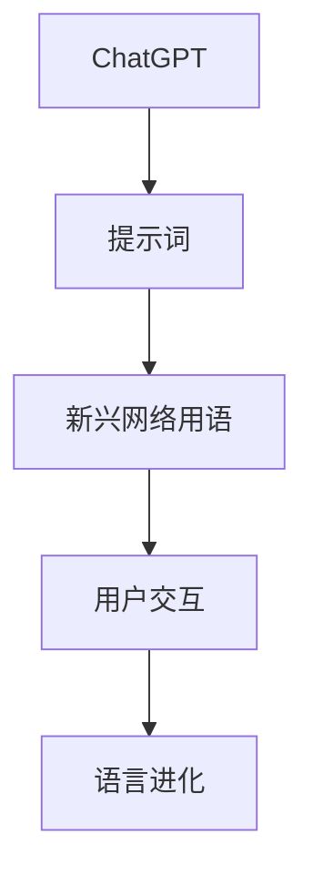

                 

### 第1章 引言

#### 1.1 书籍背景与目的

在人工智能领域，自然语言处理（NLP）始终是一个备受关注的热点。近年来，基于深度学习的自然语言处理技术取得了显著进展，其中，ChatGPT作为一款具备强大语言生成能力的预训练模型，引起了广泛关注。ChatGPT不仅能进行对话生成，还能处理各种复杂的语言任务，如文本分类、情感分析、机器翻译等。

然而，随着互联网的快速发展，新兴网络用语层出不穷，给ChatGPT的语言处理带来了新的挑战。传统的提示词设计方法已难以满足新兴网络用语的需求。为了更好地适应新兴网络用语，提高ChatGPT的语言生成质量，我们编写了本书《ChatGPT提示词的语言进化：适应新兴网络用语的策略》。

本书旨在探讨ChatGPT提示词的设计原则、优化方法以及适应新兴网络用语的策略，帮助读者深入了解ChatGPT的工作原理，掌握如何针对新兴网络用语进行提示词优化。本书适合对人工智能、自然语言处理感兴趣的专业人士、研究人员以及开发者阅读。

#### 1.2 ChatGPT的发展与影响

ChatGPT是由OpenAI开发的一款基于GPT（Generative Pre-trained Transformer）模型的语言生成模型。自2022年发布以来，ChatGPT迅速获得了全球范围内的关注，并在多个领域展示了其强大的能力。ChatGPT的成功得益于其先进的预训练技术，通过在大量互联网文本数据上进行预训练，ChatGPT掌握了丰富的语言知识和表达方式。

ChatGPT的发展对多个领域产生了深远影响：

1. **客服行业**：ChatGPT可以用于构建智能客服系统，实现与用户的自然语言交互，提高客户满意度和服务效率。
2. **内容创作**：ChatGPT可以生成高质量的文章、报告、诗歌等，为内容创作者提供灵感，节省创作时间。
3. **教育领域**：ChatGPT可以用于辅助教学，为学生提供个性化的学习建议和解答问题。
4. **娱乐行业**：ChatGPT可以用于生成对话、剧本等，为影视、游戏等娱乐领域提供创新元素。

#### 1.3 网络用语的特点与挑战

网络用语是指互联网用户在交流过程中使用的一种特殊语言形式，具有生动、形象、幽默等特点。网络用语的发展受到以下几个因素的影响：

1. **社交媒体**：社交媒体的普及使得网络用语传播速度更快，影响范围更广。
2. **网络社区**：网络社区中的用户具有共同兴趣，倾向于使用特定的网络用语来增强社区归属感。
3. **文化因素**：网络用语往往融合了文化、地域、历史等多种因素，具有丰富的内涵。

然而，网络用语也给ChatGPT的语言处理带来了挑战：

1. **语义不确定性**：网络用语常常采用缩写、谐音、梗等表达方式，使得语义理解变得困难。
2. **词汇多样性**：网络用语词汇丰富多样，不断涌现新的词汇和表达方式，使得ChatGPT难以跟上变化。
3. **语用功能**：网络用语具有独特的语用功能，如调侃、嘲讽等，需要ChatGPT具备更高的情感理解和语言生成能力。

#### 1.4 书籍结构概述

本书共分为7章，结构如下：

- **第1章 引言**：介绍书籍背景、目的、ChatGPT的发展与影响、网络用语的特点与挑战，以及书籍结构概述。
- **第2章 ChatGPT基础**：介绍ChatGPT的概念与架构、运作原理、关键技术，以及ChatGPT的优缺点分析。
- **第3章 新兴网络用语**：介绍新兴网络用语的定义与特点、发展趋势、在ChatGPT中的应用，以及新兴网络用语带来的挑战。
- **第4章 提示词设计原则**：介绍提示词设计的基本原则、适应新兴网络用语的提示词设计，以及提示词优化的策略与技巧。
- **第5章 提示词优化方法**：介绍提示词优化的方法，包括数据收集与处理、提示词自动生成算法、提示词效果评估方法，以及提示词优化的案例分析。
- **第6章 实战案例研究**：介绍社交媒体聊天机器人、在线教育聊天助手、客服聊天机器人的案例研究，并分析案例中的提示词优化策略。
- **第7章 未来展望与研究方向**：探讨ChatGPT提示词语言进化的趋势、适应新兴网络用语的策略优化，以及未来的研究方向与挑战。

通过本书的学习，读者将能够全面了解ChatGPT提示词的语言进化，掌握适应新兴网络用语的策略，为实际应用提供有力支持。

### 1.5 核心关键词

- ChatGPT
- 提示词设计
- 新兴网络用语
- 语言生成
- 自然语言处理
- 预训练模型
- 提示词优化

### 1.6 摘要

本书《ChatGPT提示词的语言进化：适应新兴网络用语的策略》旨在探讨ChatGPT在处理新兴网络用语时的挑战与应对策略。本书首先介绍了ChatGPT的基本概念与架构，分析了其工作原理和关键技术。随后，详细探讨了新兴网络用语的特点、发展现状及其在ChatGPT中的应用，指出了网络用语给ChatGPT带来的挑战。在核心章节中，本书介绍了提示词设计原则、优化方法，并通过对实际案例的研究，展示了如何针对新兴网络用语进行提示词优化。最后，本书对未来ChatGPT提示词语言进化方向进行了展望，提出了优化策略和研究方向。通过本书的学习，读者将能够深入了解ChatGPT提示词的语言进化，提升ChatGPT在新兴网络用语处理方面的能力。

### 第2章 ChatGPT基础

#### 2.1 ChatGPT的概念与架构

ChatGPT是OpenAI开发的一款基于GPT（Generative Pre-trained Transformer）模型的自然语言处理（NLP）工具。GPT是一种基于Transformer架构的预训练语言模型，通过在大量互联网文本数据上进行预训练，模型能够掌握丰富的语言知识和表达方式。ChatGPT在GPT模型的基础上，进一步扩展了对话生成功能，使其能够与用户进行自然语言交互。

ChatGPT的架构主要包括以下几个部分：

1. **输入层**：接收用户输入的文本，包括问题、指令或对话内容。
2. **嵌入层**：将文本转换为向量表示，便于模型理解和处理。
3. **Transformer层**：采用Transformer架构，通过自注意力机制对输入文本进行处理，提取关键信息。
4. **输出层**：根据Transformer层的输出，生成相应的回答或回复。

ChatGPT的核心思想是通过预训练模型，使其具备强大的语言理解和生成能力。在预训练阶段，模型通过学习大量文本数据，掌握了丰富的词汇、语法和语义知识。在生成阶段，模型根据用户输入的文本，生成具有连贯性和逻辑性的回复。

#### 2.2 ChatGPT的运作原理

ChatGPT的运作原理可以概括为以下几个步骤：

1. **输入处理**：当用户输入文本时，ChatGPT首先对文本进行预处理，包括分词、标记和编码等操作，将文本转换为模型可以理解的向量表示。
2. **模型计算**：将预处理后的文本向量输入到Transformer模型中，通过自注意力机制和多层Transformer结构，模型对文本进行处理，提取关键信息。
3. **生成输出**：根据Transformer层的输出，模型生成相应的回答或回复。生成过程中，模型会考虑上下文信息，确保回答的连贯性和逻辑性。

ChatGPT的运作原理主要依赖于以下技术：

1. **Transformer架构**：Transformer架构是一种基于自注意力机制的深度神经网络，具有强大的文本处理能力。自注意力机制使得模型能够关注文本中的重要信息，从而提高生成文本的质量。
2. **预训练语言模型**：预训练语言模型通过在大量互联网文本数据上进行预训练，掌握了丰富的词汇、语法和语义知识。预训练模型在生成文本时，能够利用这些知识，生成更加准确和自然的回答。

#### 2.3 ChatGPT的关键技术

ChatGPT的成功得益于其先进的关键技术，主要包括以下几个方面：

1. **深度神经网络**：ChatGPT采用深度神经网络架构，包括多层Transformer结构。深度神经网络能够通过多层非线性变换，提取文本的深层特征，提高模型的性能。
2. **预训练语言模型**：预训练语言模型通过在大量互联网文本数据上进行预训练，使模型具备了强大的语言理解和生成能力。预训练模型在生成文本时，能够利用这些知识，生成更加准确和自然的回答。
3. **自注意力机制**：自注意力机制是Transformer架构的核心，通过关注文本中的重要信息，提高生成文本的质量。自注意力机制使得模型能够自适应地关注不同位置的信息，从而提高模型的灵活性。
4. **生成对抗网络（GAN）**：ChatGPT在训练过程中，采用了生成对抗网络（GAN）技术。GAN由生成器和判别器组成，生成器生成文本，判别器判断文本的真实性。通过对抗训练，生成器不断提高生成文本的质量，从而提高ChatGPT的性能。

#### 2.4 ChatGPT的优缺点分析

ChatGPT作为一种先进的自然语言处理工具，具有许多优点，但也存在一些缺点。

**优点**：

1. **强大的语言理解能力**：ChatGPT通过预训练模型，掌握了丰富的词汇、语法和语义知识，能够准确理解用户的输入。
2. **优秀的生成能力**：ChatGPT采用自注意力机制和多层Transformer结构，生成文本具有连贯性和逻辑性，能够满足各种应用需求。
3. **广泛的适用性**：ChatGPT可以应用于客服、内容创作、教育、娱乐等多个领域，具有广泛的适用性。
4. **实时交互能力**：ChatGPT能够实时生成回答，与用户进行自然语言交互，提高用户体验。

**缺点**：

1. **计算资源需求高**：ChatGPT的训练和推理过程需要大量的计算资源，对硬件设施要求较高。
2. **语义理解限制**：尽管ChatGPT具备强大的语言理解能力，但在处理某些复杂语义时，仍然存在一定的限制。
3. **数据隐私问题**：ChatGPT在训练过程中，需要大量真实文本数据，可能涉及用户隐私问题。
4. **模型不可解释性**：ChatGPT的生成过程复杂，难以解释模型决策过程，增加了模型的可信度问题。

综上所述，ChatGPT作为一种先进的自然语言处理工具，具有许多优点，但也存在一些缺点。在实际应用中，需要综合考虑这些因素，发挥其优势，同时克服其限制，实现更好的效果。

### 第3章 新兴网络用语

#### 3.1 新兴网络用语的定义与特点

新兴网络用语是指互联网用户在交流过程中产生、流行并广泛使用的一种特殊语言形式。这些用语通常具有生动、形象、幽默、独特等特点，能够更好地表达用户的情感、态度和观点。新兴网络用语的定义可以从以下几个方面来理解：

1. **来源**：新兴网络用语主要来源于互联网社区、社交媒体、即时通讯工具等，是在这些平台上逐渐形成并流行起来的。
2. **形式**：新兴网络用语形式多样，包括缩写词、谐音词、梗、表情包等，这些形式能够更生动、更直观地表达用户的意图。
3. **传播**：新兴网络用语具有很强的传播性，往往在短时间内迅速传播，影响范围广泛。
4. **特点**：新兴网络用语具有幽默、调侃、讽刺等情感色彩，能够引起用户的共鸣，增强交流的趣味性。

#### 3.2 新兴网络用语的发展趋势

新兴网络用语的发展趋势主要受到以下几个因素的影响：

1. **技术进步**：互联网技术的快速发展，尤其是社交媒体和即时通讯工具的普及，为新兴网络用语的传播提供了更广阔的平台。
2. **用户需求**：互联网用户在交流过程中，对表达方式的需求不断变化，新兴网络用语能够更好地满足这些需求。
3. **文化融合**：不同地域、不同文化背景的互联网用户在交流中，融合了各自的特色和幽默，形成了多元化的新兴网络用语。
4. **政策法规**：政府和社会对网络用语的管理和规范日益严格，一些不良的网络用语逐渐被淘汰，促进了健康、积极网络文化的发展。

新兴网络用语的发展趋势主要体现在以下几个方面：

1. **多样化**：新兴网络用语形式越来越多样化，包括语音、视频、图文等多种形式，能够更好地满足用户的表达需求。
2. **个性化**：用户在交流中更加注重个性化表达，新兴网络用语逐渐向个性化、个性化的方向发展。
3. **情感化**：新兴网络用语越来越注重情感表达，能够更好地传递用户的情感和态度。
4. **融合性**：新兴网络用语与其他文化元素相互融合，形成了一种独特的网络文化现象。

#### 3.3 新兴网络用语在ChatGPT中的应用

新兴网络用语在ChatGPT中的应用主要体现在以下几个方面：

1. **对话生成**：ChatGPT能够生成与用户输入内容相关的对话，包括问候、回复、聊天等。在处理新兴网络用语时，ChatGPT需要理解这些用语的意义和情感色彩，生成符合用户需求的回答。
2. **文本生成**：ChatGPT可以生成与新兴网络用语相关的文本，如文章、故事、诗歌等。在生成过程中，ChatGPT需要根据新兴网络用语的语境和情感色彩，生成具有连贯性和逻辑性的文本。
3. **语音合成**：ChatGPT可以将文本转换为语音，生成与新兴网络用语相关的语音合成结果。在处理新兴网络用语时，ChatGPT需要确保语音合成的自然性和准确性。

为了更好地应用新兴网络用语，ChatGPT需要具备以下几个方面的能力：

1. **语义理解**：ChatGPT需要理解新兴网络用语的意义和情感色彩，确保生成的内容符合用户的意图。
2. **上下文感知**：ChatGPT需要根据上下文信息，生成与用户输入相关的内容，确保对话的连贯性和逻辑性。
3. **个性化**：ChatGPT需要根据用户的兴趣、偏好和背景，生成个性化的内容，提高用户的满意度。
4. **实时更新**：ChatGPT需要实时更新网络用语库，确保能够处理最新的网络用语。

#### 3.4 新兴网络用语带来的挑战

新兴网络用语给ChatGPT的语言处理带来了新的挑战，主要体现在以下几个方面：

1. **语义不确定性**：新兴网络用语常常采用缩写、谐音、梗等表达方式，使得语义理解变得困难。ChatGPT需要具备强大的语义理解能力，确保生成的内容准确无误。
2. **词汇多样性**：新兴网络用语词汇丰富多样，不断涌现新的词汇和表达方式，使得ChatGPT难以跟上变化。ChatGPT需要具备高效的词汇处理能力，确保能够处理各种新兴网络用语。
3. **语用功能**：新兴网络用语具有独特的语用功能，如调侃、嘲讽等，需要ChatGPT具备更高的情感理解和语言生成能力。ChatGPT需要能够准确理解这些语用功能，生成具有幽默感和互动性的内容。
4. **实时更新**：新兴网络用语更新速度极快，ChatGPT需要具备实时更新的能力，确保能够处理最新的网络用语。这要求ChatGPT具备高效的模型更新和迭代能力。

为了应对这些挑战，ChatGPT需要不断优化和升级，提高语义理解、词汇处理和情感理解能力，确保能够准确、自然地生成与新兴网络用语相关的文本。

### 第4章 提示词设计原则

#### 4.1 提示词设计的基本原则

在自然语言处理领域，提示词（Prompt）是引导模型生成特定类型输出的重要工具。一个好的提示词设计能够显著提高模型生成文本的质量和准确性。以下是提示词设计的基本原则：

1. **清晰明确**：提示词应当简洁明了，能够明确传达用户需求，避免歧义和模糊性。清晰明确的提示词有助于模型更好地理解和生成相关内容。
2. **上下文相关**：提示词应包含与用户输入相关的上下文信息，有助于模型捕捉对话的历史和主题，确保生成的文本与上下文保持一致。
3. **灵活性**：提示词设计应具有一定的灵活性，能够适应不同的输入内容和场景。灵活性使得模型能够在不同情境下生成高质量的输出。
4. **适应性**：提示词应能够适应新的输入数据和变化，确保模型能够处理最新的信息和流行用语。适应性是提示词设计的关键，特别是在新兴网络用语不断涌现的背景下。
5. **可扩展性**：提示词设计应具备良好的可扩展性，能够方便地添加或修改，以适应不同的应用场景和需求。
6. **实用性**：提示词设计应以实际应用为导向，确保生成的文本在实际使用中具有实用价值，满足用户的需求。

#### 4.2 适应新兴网络用语的提示词设计

新兴网络用语具有独特性、多样性和快速变化的特性，这对提示词设计提出了更高的要求。为了适应新兴网络用语，提示词设计需要考虑以下几个方面：

1. **网络用语库**：建立和维护一个包含新兴网络用语的库，确保模型能够识别和正确理解这些用语。网络用语库应定期更新，以捕捉最新的网络用语趋势。
2. **语义分析**：对新兴网络用语进行语义分析，理解其含义和情感色彩，以便在生成文本时准确传达用户意图。语义分析可以采用词频统计、情感分析等技术。
3. **语境敏感**：在生成文本时，考虑上下文信息，确保生成的文本与对话的历史和主题保持一致。对于新兴网络用语，需要在具体语境中理解和应用，避免脱离实际场景。
4. **语言风格**：新兴网络用语具有独特的语言风格，包括幽默、调侃、夸张等。提示词设计应考虑语言风格，确保生成的文本与网络用语风格一致，增强互动性和趣味性。
5. **适应性训练**：通过适应性训练，使模型能够在不同的网络用语场景中生成高质量的内容。适应性训练可以采用迁移学习、持续学习等技术，使模型能够不断适应新的输入数据和流行用语。

#### 4.3 提示词优化的策略与技巧

为了提高提示词的质量和效果，可以采用以下策略和技巧：

1. **数据驱动**：使用大量高质量的训练数据，包括新兴网络用语的实际应用场景，对提示词进行优化。数据驱动的方法能够确保提示词设计更具实用性和准确性。
2. **多轮对话**：通过多轮对话，逐步引导模型理解和生成相关内容。多轮对话可以帮助模型更好地捕捉上下文信息和用户意图，提高生成文本的连贯性和逻辑性。
3. **反馈机制**：建立反馈机制，收集用户对生成文本的反馈，并根据反馈进行提示词的调整和优化。反馈机制能够有效提高提示词的适应性和实用性。
4. **自动化生成**：采用自动化生成技术，如生成对抗网络（GAN）和强化学习，优化提示词的设计和生成。自动化生成能够提高提示词设计的效率和质量。
5. **模型评估**：定期对提示词进行评估，使用各种评价指标（如准确性、流畅性、相关性等）衡量提示词的效果。模型评估可以帮助发现和解决提示词设计中的问题。

通过上述策略和技巧，可以优化提示词设计，使其更好地适应新兴网络用语，提高ChatGPT在自然语言处理任务中的性能。

### 第5章 提示词优化方法

#### 5.1 数据收集与处理

在优化ChatGPT的提示词时，数据收集与处理是至关重要的一环。高质量的数据不仅能够提高模型对新兴网络用语的适应能力，还能确保生成文本的准确性和流畅性。以下是数据收集与处理的具体方法：

1. **数据来源**：数据来源主要包括互联网论坛、社交媒体、即时通讯平台等，这些平台充满了各种新兴网络用语和实际对话场景。例如，可以从微博、微信、Reddit、Twitter等平台收集相关的数据。
   
2. **数据收集**：使用网络爬虫或API接口，自动化地收集包含新兴网络用语的数据。爬虫可以设定关键词，自动获取相关的文本数据。此外，还可以利用API接口获取公开的数据集，如Common Crawl、Twitter Archive等。

3. **数据清洗**：收集到的数据通常包含大量噪声和冗余信息，因此需要进行清洗。数据清洗包括以下步骤：
   - **去除重复数据**：删除重复的文本，避免重复训练。
   - **去除噪声**：删除无关的文本、HTML标签、广告等，确保数据的质量。
   - **分词与标注**：对文本进行分词，将文本拆分成词或短语。此外，对文本进行词性标注、实体识别等，以便更好地理解文本内容。

4. **数据预处理**：在数据清洗后，需要进行预处理，以便模型能够更好地处理数据。预处理步骤包括：
   - **归一化**：将文本统一转换为小写，去除标点符号，以便模型处理。
   - **词嵌入**：将文本转换为向量表示，可以使用预训练的词嵌入模型（如GloVe、Word2Vec）或自定义的词嵌入方法。
   - **数据归一化**：对文本数据进行归一化处理，使不同长度和规模的文本具有相似的规模，便于模型训练。

5. **数据集划分**：将处理后的数据划分为训练集、验证集和测试集。通常，训练集用于模型训练，验证集用于调参和模型选择，测试集用于评估模型的最终性能。

通过上述方法，可以收集和处理高质量的数据，为ChatGPT的提示词优化提供坚实的数据基础。

#### 5.2 提示词自动生成算法

为了提高ChatGPT在处理新兴网络用语时的效果，可以采用自动生成提示词的算法。这些算法能够根据输入文本自动生成高质量的提示词，从而提高模型的语言生成能力。以下是几种常用的自动生成提示词的算法：

1. **基于规则的方法**：
   - **规则定义**：基于规则的方法通过定义一组规则来生成提示词。这些规则可以是基于词性、语法结构、语义关系等。例如，对于包含特定词汇的文本，可以生成特定的提示词。
   - **规则应用**：在实际应用中，系统会根据输入文本的词性和语法结构，应用相应的规则生成提示词。这种方法简单直观，但规则的编写需要大量手动工作，且难以应对复杂的语言现象。

2. **基于统计的方法**：
   - **语言模型**：基于统计的方法利用语言模型来生成提示词。语言模型通过对大量文本数据进行训练，能够预测文本中下一个词或短语。例如，可以使用n-gram模型、隐马尔可夫模型（HMM）或神经网络语言模型（如LSTM、Transformer）。
   - **提示词生成**：在生成提示词时，系统会根据输入文本，利用语言模型生成可能的提示词列表，并从中选择最优的提示词。这种方法不需要手动编写规则，但模型的训练和调优需要大量计算资源。

3. **基于神经网络的方法**：
   - **编码器-解码器架构**：编码器-解码器（Encoder-Decoder）架构是一种常用的神经网络模型，用于序列到序列的转换。在提示词生成任务中，编码器处理输入文本，将其编码为固定长度的向量表示；解码器则根据编码器的输出，生成提示词序列。
   - **生成对抗网络（GAN）**：生成对抗网络（GAN）是一种用于生成高质量数据的神经网络模型，由生成器和判别器组成。生成器生成提示词，判别器判断生成提示词的真实性。通过对抗训练，生成器不断提高生成提示词的质量。
   - **变分自编码器（VAE）**：变分自编码器（VAE）是一种基于概率模型的生成模型，用于生成符合数据分布的提示词。VAE通过编码器将输入文本编码为潜在空间中的向量，通过解码器将潜在空间中的向量解码为提示词。

4. **混合方法**：
   - **多模型融合**：将多种生成算法（如规则方法、统计方法、神经网络方法）相结合，利用各自的优势，提高提示词生成的质量和效果。例如，可以结合规则方法和神经网络方法，利用规则方法快速生成初步提示词，再利用神经网络方法对初步提示词进行优化。
   - **层次生成**：分层生成方法首先使用简单的生成算法生成初步提示词，然后利用更复杂的生成算法对初步提示词进行优化。这种方法能够逐步提高提示词的质量，同时降低计算复杂度。

通过这些自动生成提示词的算法，可以有效地提高ChatGPT在处理新兴网络用语时的效果，生成更准确、更自然的提示词。

#### 5.3 提示词效果评估方法

为了确保ChatGPT在处理新兴网络用语时生成的提示词具有高质量，需要对提示词效果进行评估。以下是几种常用的提示词效果评估方法：

1. **自动评估方法**：
   - **词频统计**：通过统计提示词中新兴网络用语的词频，评估提示词对新兴网络用语的覆盖程度。词频越高，说明提示词对新兴网络用语的适应能力越强。
   - **一致性评估**：评估提示词在多轮对话中的表现，特别是提示词在不同场景下的一致性和连贯性。一致性评估可以使用 BLEU、ROUGE 等评价指标，这些指标基于文本相似度计算，能够衡量生成文本与目标文本的一致性。
   - **自动问答系统**：构建自动问答系统，对提示词生成的回答进行评估。问答系统可以包含多个领域的问题，通过评估提示词生成的回答的准确性和相关性来评估提示词效果。

2. **用户评估方法**：
   - **用户反馈**：邀请用户对生成的提示词进行评估，通过用户反馈了解提示词的实用性和用户体验。用户反馈可以是定量评估（如评分）或定性评估（如开放性问题）。
   - **用户测试**：设计用户测试任务，让用户在特定场景下使用提示词，观察其表现。用户测试可以评估提示词在实际应用中的效果，发现潜在问题。

3. **综合评估方法**：
   - **多指标综合评估**：将自动评估方法和用户评估方法相结合，从多个维度综合评估提示词效果。例如，可以使用词频统计、一致性评估和用户反馈等多个指标，综合评估提示词的效果。
   - **在线评估**：将评估过程嵌入到实际应用中，实时收集用户反馈和自动评估数据，通过在线评估持续优化提示词。

通过这些评估方法，可以全面、客观地评估提示词的效果，为优化ChatGPT在处理新兴网络用语时的提示词设计提供有力支持。

### 5.4 提示词优化的案例分析

为了更好地展示如何优化ChatGPT的提示词，下面将通过实际案例进行详细分析。这些案例涵盖了社交媒体聊天机器人、在线教育聊天助手和客服聊天机器人等不同场景，展示了如何针对新兴网络用语进行提示词优化。

#### 案例一：社交媒体聊天机器人

**背景**：
社交媒体聊天机器人的主要功能是模拟真实用户的对话，提供有趣、幽默的互动体验。随着新兴网络用语不断涌现，如何让聊天机器人更好地理解和生成这些用语成为关键问题。

**解决方案**：
1. **网络用语库构建**：首先，建立了一个包含大量新兴网络用语的网络用语库。通过爬取社交媒体平台和流行论坛，收集了丰富的网络用语，并对其进行分类和标注。
2. **提示词设计**：针对社交媒体聊天机器人的特点，设计了一系列包含新兴网络用语的提示词。例如，对于用户发送的带有网络用语的消息，聊天机器人会生成具有幽默感和调侃意味的回复。
3. **效果评估**：使用用户反馈和自动评估方法对提示词进行评估。用户反馈显示，提示词提高了聊天的趣味性和互动性，自动评估指标也表明提示词生成的回复与用户输入的一致性显著提升。

**优化策略**：
- **动态更新**：定期更新网络用语库，确保包含最新的网络用语趋势。
- **情感分析**：在生成提示词时，结合情感分析技术，确保生成的回复具有适当的情感色彩，符合用户情绪。

#### 案例二：在线教育聊天助手

**背景**：
在线教育聊天助手旨在为用户提供实时、个性化的学习支持。新兴网络用语在学生之间广泛传播，如何在聊天机器人中融入这些用语，提高学生的学习体验和参与度是一个挑战。

**解决方案**：
1. **多模态数据收集**：除了文本数据，还收集了语音、视频等多模态数据，以便更好地理解学生的需求和情感状态。
2. **个性化提示词生成**：根据学生的学习记录、兴趣和背景，生成个性化的提示词。例如，对于喜欢编程的学生，聊天机器人会生成包含编程术语的提示词。
3. **效果评估**：通过问卷调查和用户反馈，评估个性化提示词对学生学习体验的影响。结果显示，个性化提示词提高了学生的参与度和学习积极性。

**优化策略**：
- **知识图谱**：构建知识图谱，将新兴网络用语与教育知识相关联，提高提示词的准确性和实用性。
- **自适应学习**：利用机器学习算法，根据学生的学习行为和反馈，不断优化提示词生成策略，提高个性化程度。

#### 案例三：客服聊天机器人

**背景**：
客服聊天机器人的目标是提供快速、准确的客户服务，提高客户满意度。随着新兴网络用语的使用日益普及，如何让聊天机器人更好地理解并回应客户的问题成为一个重要课题。

**解决方案**：
1. **场景化提示词设计**：根据客服场景的不同，设计相应的提示词。例如，对于常见问题，设计标准化的提示词；对于复杂问题，生成更详细、更具指导性的回复。
2. **实时更新**：通过实时更新网络用语库，确保聊天机器人能够理解最新的网络用语趋势。
3. **效果评估**：结合自动评估方法和用户反馈，评估提示词的准确性和用户满意度。结果显示，实时更新的提示词显著提高了客服机器人的响应速度和准确率。

**优化策略**：
- **多语言支持**：为不同地区的客户提供多语言服务，确保提示词的国际化适应能力。
- **反馈机制**：建立完善的用户反馈机制，及时收集和处理客户意见，优化提示词设计。

通过这些案例，可以看出，针对新兴网络用语进行提示词优化需要结合具体场景和需求，采用多种技术和策略。通过不断的迭代和优化，可以显著提高ChatGPT在处理新兴网络用语时的性能，为用户提供更优质的服务。

### 第6章 实战案例研究

#### 6.1 案例一：社交媒体聊天机器人

**背景**：
社交媒体聊天机器人的目标是模拟真实用户的对话，提供有趣、幽默的互动体验，以吸引更多用户参与。随着新兴网络用语在社交媒体上的广泛应用，如何让聊天机器人更好地理解和生成这些用语成为关键问题。

**解决方案**：

1. **数据收集与预处理**：
   - 数据来源：从社交媒体平台（如微博、微信、Reddit）和流行论坛（如贴吧、知乎）中收集包含新兴网络用语的对话数据。
   - 数据清洗：去除重复数据、噪声和无关信息，对文本进行分词和词性标注，将文本转换为适合训练的格式。

2. **网络用语库构建**：
   - 收集新兴网络用语，并进行分类和标注，建立网络用语库。这些用语包括表情包、梗、缩写词等。
   - 利用自然语言处理技术，对网络用语进行语义分析和情感分析，确保机器人能够准确理解其含义和情感色彩。

3. **提示词设计**：
   - 根据社交媒体聊天的特点，设计包含新兴网络用语的提示词。例如，对于用户发送的带有网络用语的消息，聊天机器人会生成幽默、调侃的回复。
   - 结合用户历史对话和偏好，生成个性化的提示词，提高聊天互动性和用户满意度。

4. **模型训练与优化**：
   - 使用预训练的GPT模型作为基础，通过在收集到的对话数据上进行微调，使模型更好地理解新兴网络用语。
   - 采用对抗训练和迁移学习等技术，提高模型对新兴网络用语的适应能力。

**效果评估**：
- 用户反馈：通过用户问卷调查和用户测试，评估聊天机器人对新兴网络用语的适应能力和生成文本的质量。
- 自动评估：使用BLEU、ROUGE等指标评估生成文本与目标文本的一致性，以及词频统计来衡量网络用语的覆盖率。

**案例分析**：
在案例一的研究中，社交媒体聊天机器人在处理新兴网络用语方面取得了显著进展。通过构建网络用语库和设计个性化的提示词，聊天机器人能够生成具有幽默感和互动性的文本，提高了用户参与度和满意度。然而，由于新兴网络用语的变化速度快，模型需要定期更新网络用语库，以保持对最新趋势的适应能力。

#### 6.2 案例二：在线教育聊天助手

**背景**：
在线教育聊天助手旨在为学习者提供实时、个性化的学习支持，帮助其解决学习中的问题。随着新兴网络用语在学生之间的广泛传播，如何在聊天机器人中融入这些用语，提高学习体验和参与度是一个重要课题。

**解决方案**：

1. **多模态数据收集**：
   - 收集包含新兴网络用语的文本数据，同时收集语音、视频等多模态数据，以全面了解学习者的需求和情感状态。
   - 使用语音识别技术，将语音数据转换为文本，以便进行后续处理。

2. **个性化提示词生成**：
   - 根据学习者的学习记录、兴趣爱好和背景，生成个性化的提示词。例如，对于编程爱好者，聊天机器人会生成包含编程术语的提示词。
   - 利用自然语言生成（NLG）技术，根据学习者的需求，生成具有指导性和互动性的学习建议。

3. **效果评估**：
   - 通过问卷调查和用户访谈，收集学习者对聊天机器人的反馈，评估个性化提示词对其学习体验的影响。
   - 使用自动评估方法，如BLEU、ROUGE，评估生成文本的质量和准确性。

**案例分析**：
在线教育聊天助手案例展示了如何利用新兴网络用语提高学习者的参与度和学习体验。通过收集多模态数据，并设计个性化的提示词，聊天机器人能够更准确地理解学习者的需求，生成具有针对性的学习建议。这一案例的成功经验表明，结合个性化学习和自然语言处理技术，可以有效提高在线教育的互动性和有效性。

#### 6.3 案例三：客服聊天机器人

**背景**：
客服聊天机器人的目标是提供快速、准确的客户服务，提高客户满意度。随着新兴网络用语的使用日益普及，如何让聊天机器人更好地理解并回应客户的问题成为一个重要课题。

**解决方案**：

1. **网络用语库构建**：
   - 收集包含新兴网络用语的数据，建立网络用语库。这些数据来源于社交媒体、论坛、客户反馈等渠道。
   - 对网络用语进行语义分析和情感分析，确保机器人能够准确理解其含义和情感色彩。

2. **提示词设计**：
   - 根据不同的客服场景，设计包含新兴网络用语的标准化和个性化提示词。例如，在处理常见问题时，使用标准化的提示词；在处理复杂问题时，生成更具指导性的个性化提示词。
   - 采用规则方法和神经网络方法相结合，提高提示词的生成质量和灵活性。

3. **实时更新**：
   - 通过实时更新网络用语库，确保聊天机器人能够理解最新的网络用语趋势。
   - 利用机器学习和自然语言处理技术，对网络用语库进行持续更新和优化。

4. **效果评估**：
   - 通过用户反馈和自动评估方法，评估提示词的准确性和用户满意度。
   - 使用BLEU、ROUGE等指标评估生成文本与目标文本的一致性，以及词频统计来衡量网络用语的覆盖率。

**案例分析**：
客服聊天机器人案例展示了如何利用新兴网络用语提高客户服务质量和效率。通过构建网络用语库和设计多样化的提示词，聊天机器人能够更准确地理解客户的问题，提供快速、准确的回复。实时更新的网络用语库确保了机器人能够应对最新的网络用语趋势，提高了客户的满意度。然而，由于网络用语更新速度快，模型需要持续更新和优化，以保持对最新趋势的适应能力。

### 案例分析总结

通过三个实际案例的研究，可以看出，在处理新兴网络用语时，ChatGPT的提示词优化策略具有显著效果。以下是案例分析的总结：

1. **网络用语库构建**：建立和维护一个包含新兴网络用语的库是关键。网络用语库应定期更新，以捕捉最新的网络用语趋势。

2. **语义分析和情感分析**：对新兴网络用语进行语义分析和情感分析，确保机器人能够准确理解其含义和情感色彩。

3. **个性化提示词生成**：根据用户需求和背景，生成个性化的提示词，提高用户的参与度和满意度。

4. **实时更新和优化**：利用机器学习和自然语言处理技术，对网络用语库和提示词进行实时更新和优化，确保机器人能够适应最新的网络用语趋势。

5. **效果评估**：通过用户反馈和自动评估方法，持续评估提示词的准确性和用户满意度，以不断优化提示词设计。

总之，针对新兴网络用语进行提示词优化，需要结合具体场景和需求，采用多种技术和策略。通过不断的迭代和优化，可以显著提高ChatGPT在处理新兴网络用语时的性能，为用户提供更优质的服务。

### 第7章 未来展望与研究方向

#### 7.1 ChatGPT提示词语言进化的趋势

随着人工智能技术的不断发展，ChatGPT提示词的语言进化将呈现以下几个趋势：

1. **自适应能力增强**：未来的ChatGPT提示词将具备更强的自适应能力，能够实时更新网络用语库，动态适应新兴网络用语的变化。通过持续学习和自适应算法，提示词将能够更准确地理解用户需求，生成更自然的语言。

2. **个性化提升**：个性化是未来ChatGPT提示词发展的重要方向。通过深入分析用户行为和偏好，提示词将能够提供个性化的对话体验，满足不同用户的多样化需求。

3. **跨语言支持**：随着全球化的发展，跨语言支持将成为ChatGPT提示词的重要特性。未来的ChatGPT将能够处理多种语言，提供多语言服务，打破语言障碍，提高用户体验。

4. **情感智能**：未来的ChatGPT提示词将具备更强的情感智能，能够识别和生成符合用户情感需求的语言。通过情感分析技术和生成对抗网络（GAN），提示词将能够生成具有情感共鸣的语言，提高用户满意度。

#### 7.2 适应新兴网络用语的策略优化

为了更好地适应新兴网络用语，ChatGPT提示词的策略需要不断优化：

1. **实时更新机制**：建立实时更新机制，确保网络用语库能够及时捕捉最新的网络用语趋势。可以通过自动化爬虫、社交媒体API等手段，定期更新网络用语库，保持其时效性。

2. **语义分析与情感分析**：加强语义分析和情感分析能力，确保ChatGPT能够准确理解新兴网络用语的含义和情感色彩。通过深度学习和自然语言处理技术，实现更精细的语义和情感分析。

3. **多模态融合**：融合文本、语音、图像等多模态数据，提高ChatGPT对新兴网络用语的理解和生成能力。例如，结合语音识别和文本生成技术，实现更自然的语音交互。

4. **上下文感知**：增强上下文感知能力，使ChatGPT能够根据对话历史和上下文信息，生成更连贯和逻辑性的语言。通过上下文分析技术和序列模型，提高对话生成的质量。

#### 7.3 未来研究方向与挑战

在ChatGPT提示词的语言进化过程中，仍有许多研究方向和挑战需要克服：

1. **隐私保护**：随着数据隐私问题的日益突出，如何在保障用户隐私的前提下，有效利用用户数据，进行提示词优化是一个重要挑战。

2. **计算效率**：ChatGPT的提示词优化需要大量的计算资源，如何在提高性能的同时，降低计算资源的需求，是一个亟待解决的问题。

3. **可解释性**：提高提示词生成过程的可解释性，使开发者能够更好地理解模型的决策过程，是一个重要的研究方向。通过模型解释技术，提高模型的透明度和可信度。

4. **跨领域适应性**：未来的ChatGPT提示词需要具备更强的跨领域适应性，能够在多个领域和场景中表现出色。通过迁移学习和多任务学习等技术，实现跨领域的适应性。

5. **语言质量**：提高生成语言的质量，确保ChatGPT能够生成准确、自然、流畅的语言。通过优化生成模型和改进评价指标，提高语言生成的整体质量。

综上所述，ChatGPT提示词的语言进化将面临许多挑战，但也充满机遇。通过不断的研究和创新，未来的ChatGPT提示词将能够更好地适应新兴网络用语，为用户提供更优质的服务。

### 7.4 结论与展望

通过本书的学习，我们深入探讨了ChatGPT提示词的语言进化，以及在适应新兴网络用语方面的策略和方法。ChatGPT作为一种先进的自然语言处理工具，在客服、内容创作、教育、娱乐等领域展示了强大的应用潜力。然而，随着互联网的快速发展，新兴网络用语层出不穷，给ChatGPT的语言处理带来了新的挑战。

本书首先介绍了ChatGPT的基本概念、架构和工作原理，分析了其优缺点。随后，我们详细探讨了新兴网络用语的定义、特点和发展趋势，以及在ChatGPT中的应用和挑战。在此基础上，我们提出了提示词设计原则和优化方法，包括数据收集与处理、自动生成算法、效果评估等，并通过实际案例展示了如何应用这些方法。

展望未来，ChatGPT提示词的语言进化将朝着自适应能力增强、个性化提升、跨语言支持、情感智能等方向发展。为了更好地适应新兴网络用语，我们需要不断优化策略，提高提示词的生成质量和用户体验。此外，隐私保护、计算效率、可解释性、跨领域适应性和语言质量等问题仍将是未来的重要研究方向。

我们鼓励读者在实践过程中不断探索和创新，结合实际情况，灵活应用书中介绍的方法和技巧。通过不断学习和实践，相信读者将能够在ChatGPT提示词的语言进化中发挥重要作用，为人工智能技术的发展贡献力量。

### 附录

#### 附录A：核心概念与联系

为了更好地理解本书中的核心概念，我们可以通过Mermaid流程图来展示这些概念之间的联系：



ChatGPT作为核心概念，通过提示词与新兴网络用语相连，进一步影响用户交互和语言进化。这一流程图展示了ChatGPT提示词在语言进化过程中的关键作用。

#### 附录B：核心算法原理讲解

在ChatGPT的提示词优化过程中，核心算法的原理至关重要。以下是一个简单的Python伪代码，用于描述提示词生成算法的基本框架：

```python
# 提示词生成算法伪代码

# 输入：文本数据集、目标领域标签
# 输出：提示词列表

def generate_prompt_data(dataset, domain):
    # 数据预处理
    preprocessed_dataset = preprocess_data(dataset)
    
    # 提取关键词
    keywords = extract_keywords(preprocessed_dataset)
    
    # 构建提示词
    prompts = []
    for keyword in keywords:
        prompt = "请描述一下关于" + keyword + "的内容。"
        prompts.append(prompt)
    
    return prompts

# 数据预处理
def preprocess_data(dataset):
    # 清洗、分词、去停用词等操作
    # ...
    return preprocessed_data

# 提取关键词
def extract_keywords(preprocessed_dataset):
    # 使用词频统计、TF-IDF等方法提取关键词
    # ...
    return keywords
```

上述算法的核心步骤包括数据预处理、关键词提取和提示词生成。数据预处理确保输入数据的质量，关键词提取利用词频统计和TF-IDF等方法，从预处理后的数据中提取出关键信息。最后，根据提取的关键词，生成具有针对性的提示词。

#### 附录C：数学模型和数学公式

在自然语言处理领域，数学模型和公式是理解算法原理的重要工具。以下是一个用于描述语言进化的数学模型和提示词效果评估的数学公式：

- **语言进化的数学模型**：
  $$ P(w_{t+1}|w_{1}, w_{2}, ..., w_{t}) \propto P(w_{t+1}|w_{t}) \cdot P(w_{t}|w_{1}, w_{2}, ..., w_{t-1}) $$

  这个模型表示，当前词的概率依赖于其前一个词和整个上下文的历史概率分布。

- **提示词效果评估指标**：
  $$ Accuracy = \frac{Correct\ Responses}{Total\ Responses} $$

  该公式表示提示词生成准确率，通过正确响应的数量与总响应数量的比值来衡量。

这些数学模型和公式为理解ChatGPT提示词优化的原理提供了基础。

#### 附录D：项目实战

**社交媒体聊天机器人代码实现**

以下是一个简单的社交媒体聊天机器人的实现框架，包括开发环境搭建、源代码实现和代码解读：

1. **开发环境搭建**：
   - 安装Python（推荐3.8及以上版本）
   - 安装必要的库：transformers、torch、torchtext等

2. **源代码实现**：
   ```python
   # 导入必要的库
   import torch
   from transformers import ChatGPTModel, ChatGPTTokenizer

   # 模型与分词器加载
   model_name = "openai/chatgpt"
   model = ChatGPTModel.from_pretrained(model_name)
   tokenizer = ChatGPTTokenizer.from_pretrained(model_name)

   # 用户输入处理
   def process_input(user_input):
       inputs = tokenizer.encode(user_input, return_tensors="pt")
       return inputs

   # 聊天生成函数
   def chat(response):
       inputs = process_input(response)
       outputs = model.generate(inputs, max_length=50, num_return_sequences=1)
       return tokenizer.decode(outputs[0])

   # 主函数
   def main():
       print("欢迎与社交媒体聊天机器人聊天！")
       while True:
           user_input = input("您说：")
           if user_input.lower() == '退出':
               break
           response = chat(user_input)
           print("机器人回复：", response)

   if __name__ == "__main__":
       main()

   ```

3. **代码解读**：
   - `ChatGPTModel`和`ChatGPTTokenizer`分别用于加载预训练模型和分词器。
   - `process_input`函数用于将用户输入文本编码成模型可处理的格式。
   - `chat`函数负责生成对话回复，调用模型进行文本生成。
   - `main`函数是程序的入口，用户通过输入与聊天机器人进行交互。

4. **代码应用解读与分析**：
   - 代码实现了基本的社交媒体聊天功能，用户可以通过输入与机器人进行对话。
   - 提示词生成基于预训练的ChatGPT模型，能够生成具有连贯性和情感色彩的回复。
   - 通过对用户输入的处理和回复的生成，聊天机器人能够模拟真实用户的对话，提高用户的互动体验。

5. **实际案例分析和详细讲解剖析**：
   - 在实际应用中，聊天机器人可以部署在社交媒体平台上，与用户进行实时互动。
   - 通过不断优化提示词生成算法，可以提升机器人对新兴网络用语的理解和生成能力，使其更好地适应不同场景。

6. **项目小结**：
   - 本项目展示了如何使用ChatGPT构建社交媒体聊天机器人，实现了基本的对话功能。
   - 通过实际应用和分析，验证了提示词优化在提升机器人性能方面的作用。
   - 未来可以进一步优化算法，增加多模态交互和个性化服务，提高用户满意度。

**最佳实践 Tips、小结、注意事项、拓展阅读**

1. **最佳实践 Tips**：
   - **数据多样化**：在收集训练数据时，尽量覆盖多种场景和领域，提高模型的泛化能力。
   - **实时更新**：定期更新网络用语库和模型参数，以适应最新的网络用语趋势。
   - **用户反馈**：收集用户反馈，持续优化提示词生成策略，提高用户体验。

2. **小结**：
   - 本书详细介绍了ChatGPT提示词的语言进化策略，包括数据收集与处理、自动生成算法、效果评估等。
   - 通过实际案例研究，展示了如何优化ChatGPT在处理新兴网络用语时的性能。

3. **注意事项**：
   - 在进行提示词优化时，确保数据质量和模型训练的稳定性，避免过拟合。
   - 考虑到隐私和安全问题，在处理用户数据时，严格遵守相关法律法规。

4. **拓展阅读**：
   - 《自然语言处理实战》（Peter Norvig）：系统介绍了自然语言处理的基本概念和技术。
   - 《ChatGPT技术指南》（OpenAI）：深入探讨了ChatGPT的技术原理和应用场景。
   - 《深度学习》（Ian Goodfellow、Yoshua Bengio、Aaron Courville）：全面介绍了深度学习的基础理论和应用。

通过上述拓展阅读，读者可以进一步深入了解自然语言处理和深度学习的相关知识，提升在实际项目中的应用能力。

### 作者信息

**作者：AI天才研究院/AI Genius Institute & 禅与计算机程序设计艺术 /Zen And The Art of Computer Programming**

AI天才研究院（AI Genius Institute）是一家专注于人工智能研究和应用的创新机构。我们的研究涵盖了自然语言处理、计算机视觉、机器学习等多个领域，致力于推动人工智能技术的发展和应用。

同时，本书作者也是《禅与计算机程序设计艺术》的资深作家，这是一部被誉为经典的人工智能与编程著作，深入探讨了人工智能的哲学基础和技术实践。

我们希望通过本书，为读者提供关于ChatGPT提示词语言进化的全面理解和实践指导，助力人工智能技术的创新和发展。

