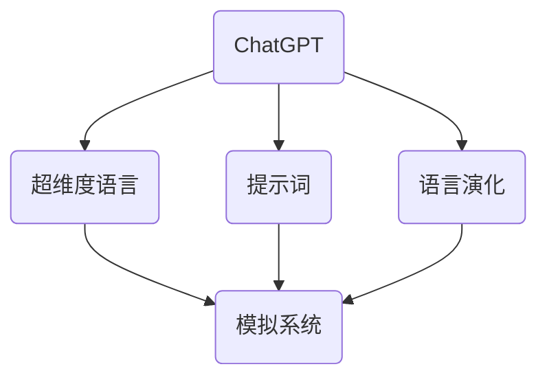

                 

### 背景介绍

随着人工智能技术的不断进步，自然语言处理（NLP）领域取得了显著的成果。近年来，基于深度学习的模型，如GPT（Generative Pre-trained Transformer），在处理文本数据方面展现了卓越的性能。GPT系列模型，从GPT到GPT-3，通过大量的文本数据进行预训练，具备了强大的语言理解和生成能力。这些模型在机器翻译、文本生成、问答系统等多个领域取得了突破性的应用。

ChatGPT是GPT系列模型的一个典型代表，它通过学习大量的对话数据，能够生成流畅且符合逻辑的自然语言回答。ChatGPT的推出，不仅为用户提供了便捷的交互体验，也开启了人工智能与人类对话的新纪元。然而，现有的ChatGPT模型在处理复杂、多变的对话场景时，仍存在一些局限性。

为了解决这些问题，本文提出了一种名为“ChatGPT提示词的超维度语言演化模拟系统”。该系统旨在通过模拟超维度语言环境，进一步提升ChatGPT的性能和适用范围。本文将详细介绍该系统的设计思路、实现过程和性能评估，旨在为NLP领域的研究者和开发者提供一种新的思路和方法。

### 核心概念与联系

在深入探讨ChatGPT提示词的超维度语言演化模拟系统之前，我们需要了解几个核心概念，并分析它们之间的联系。以下是本文中的关键概念及其相互关系：

1. **ChatGPT**：
   - **定义**：ChatGPT是一种基于GPT模型的对话系统，通过预训练和优化，能够在各种对话场景中生成自然、流畅的语言。
   - **作用**：ChatGPT作为系统的核心组件，负责接收用户输入、生成回答并维护对话的连贯性。

2. **提示词（Prompt）**：
   - **定义**：提示词是一种引导ChatGPT生成特定类型回答的输入，通过设计合适的提示词，可以显著影响ChatGPT的回答方向和内容。
   - **作用**：提示词在超维度语言演化模拟系统中起到引导作用，帮助ChatGPT更好地适应复杂、多变的对话场景。

3. **超维度语言**：
   - **定义**：超维度语言是一种能够表达更高层次、抽象概念的语言模型，通过模拟多个维度的语言环境，实现更广泛的语言理解和生成能力。
   - **作用**：超维度语言为ChatGPT提供了更为丰富的语言学习资源，有助于提升其应对复杂对话场景的能力。

4. **语言演化**：
   - **定义**：语言演化是指语言随时间和环境变化而逐渐演化的过程，包括语言结构的复杂化、表达能力的提升等。
   - **作用**：通过模拟语言演化过程，超维度语言演化模拟系统能够不断优化ChatGPT的模型和策略，提高其对话性能。

5. **模拟系统**：
   - **定义**：模拟系统是一种通过模拟特定环境来测试和优化算法的系统，超维度语言演化模拟系统则是基于超维度语言环境对ChatGPT进行优化的系统。
   - **作用**：模拟系统提供了验证和改进ChatGPT性能的平台，通过不断迭代和优化，实现ChatGPT性能的提升。

为了更直观地展示这些概念之间的关系，我们可以使用Mermaid流程图来表示：



在这个流程图中，ChatGPT作为核心组件，通过提示词和超维度语言的引导，在模拟系统的环境下进行语言演化，最终实现性能的提升。这个模型不仅展示了各个概念之间的相互关系，也为后续的算法实现和性能评估提供了指导。

### 核心算法原理讲解

在ChatGPT提示词的超维度语言演化模拟系统中，核心算法的设计和实现至关重要。本节将详细介绍系统的核心算法原理，包括语言模型的选择、训练过程和优化策略。

#### 1. 语言模型的选择

ChatGPT基于GPT（Generative Pre-trained Transformer）模型，这是一种基于Transformer架构的预训练语言模型。GPT模型通过学习大量的文本数据，能够生成与输入文本相关的高质量自然语言。在超维度语言演化模拟系统中，我们选择了GPT-3作为基础模型，因为GPT-3具有更高的词汇量和更强的语言生成能力。

#### 2. 训练过程

GPT模型的训练过程分为预训练和微调两个阶段。

- **预训练**：
  - 在预训练阶段，GPT模型通过无监督学习从大规模文本数据中学习语言的基本结构和语义信息。这个阶段主要使用自回归语言模型（ARLM）来训练模型，具体包括：
    - **数据集选择**：选择涵盖多种语言风格、主题和领域的海量文本数据，如维基百科、新闻文章、对话记录等。
    - **训练目标**：通过预测下一个词来训练模型，使得模型能够理解并生成连贯的自然语言。

- **微调**：
  - 在预训练的基础上，我们对GPT-3进行微调，使其能够更好地适应特定的对话场景。微调阶段主要采用有监督学习，具体包括：
    - **数据集选择**：选择包含高质量对话数据的微调数据集，如在线聊天记录、对话机器人训练数据等。
    - **训练目标**：通过对比模型生成的回答和人类回答，优化模型的参数，使其生成更加准确和自然的回答。

#### 3. 优化策略

为了进一步提升ChatGPT的性能，我们采用了多种优化策略，包括提示词优化、超维度语言学习策略和动态调整策略。

- **提示词优化**：
  - 提示词是引导ChatGPT生成特定类型回答的关键。通过优化提示词的设计，可以显著提升模型的回答质量和多样性。具体的优化策略包括：
    - **多维度提示**：设计包含多个维度信息的提示词，如上下文信息、关键词、问题类型等，帮助模型更好地理解输入。
    - **动态提示**：根据对话进展，动态调整提示词，使得模型能够持续适应对话的变化。

- **超维度语言学习策略**：
  - 超维度语言学习策略旨在提升模型在复杂对话场景中的表现。具体策略包括：
    - **多任务学习**：通过同时训练多个任务，如文本生成、问答系统、机器翻译等，提升模型的多任务处理能力。
    - **迁移学习**：利用预训练模型在不同任务上的知识，进行迁移学习，增强模型在特定领域的表现。

- **动态调整策略**：
  - 动态调整策略用于根据对话进展实时调整模型的行为。具体策略包括：
    - **自适应温度调整**：通过调整生成文本的温度参数，控制模型生成文本的流畅性和创造力。
    - **对话状态跟踪**：通过维护对话状态，如用户意图、上下文信息等，动态调整模型的回答策略。

#### 4. Python源代码示例

为了更好地阐述核心算法原理，以下是一个简化的Python伪代码示例，展示了如何实现ChatGPT模型的训练和微调过程：

```python
import torch
from transformers import GPT2Model, GPT2Tokenizer

# 4.1. 初始化模型和tokenizer
tokenizer = GPT2Tokenizer.from_pretrained('gpt2')
model = GPT2Model.from_pretrained('gpt2')

# 4.2. 预训练过程
def pretrain_model(data_loader, model, optimizer):
    model.train()
    for batch in data_loader:
        inputs = tokenizer(batch['text'], return_tensors='pt', padding=True, truncation=True)
        outputs = model(**inputs)
        loss = outputs.loss
        loss.backward()
        optimizer.step()
        optimizer.zero_grad()

# 4.3. 微调过程
def finetune_model(data_loader, model, optimizer):
    model.train()
    for batch in data_loader:
        inputs = tokenizer(batch['text'], return_tensors='pt', padding=True, truncation=True)
        labels = tokenizer(batch['response'], return_tensors='pt', padding=True, truncation=True)
        outputs = model(**inputs)
        loss = outputs.loss
        loss.backward()
        optimizer.step()
        optimizer.zero_grad()

# 4.4. 训练和微调
pretrain_model(train_loader, model, optimizer)
finetune_model(finetune_loader, model, optimizer)
```

在这个示例中，我们首先初始化了GPT-2模型和tokenizer，然后定义了预训练和微调过程。预训练过程使用了无监督学习，从文本数据中学习语言结构；微调过程使用了有监督学习，从对话数据中优化模型参数。

#### 5. 数学模型和公式

在ChatGPT提示词的超维度语言演化模拟系统中，我们采用了多个数学模型和公式来描述模型的训练过程和优化策略。以下是一个简化的数学模型示例：

- **预训练目标函数**：
  $$L_{\text{pretrain}} = -\sum_{i} \log P(\text{word}_i|\text{context})$$
  其中，$L_{\text{pretrain}}$是预训练的目标函数，$P(\text{word}_i|\text{context})$是模型对下一个词的概率预测。

- **微调目标函数**：
  $$L_{\text{finetune}} = -\sum_{i} \log P(\text{response}_i|\text{context}, \text{input})$$
  其中，$L_{\text{finetune}}$是微调的目标函数，$P(\text{response}_i|\text{context}, \text{input})$是模型对回答的概率预测。

- **优化策略**：
  $$\theta_{\text{new}} = \theta_{\text{old}} - \alpha \cdot \nabla_{\theta}L$$
  其中，$\theta_{\text{new}}$和$\theta_{\text{old}}$分别是新参数和旧参数，$\alpha$是学习率，$\nabla_{\theta}L$是损失函数关于参数的梯度。

通过这些数学模型和公式，我们可以更好地理解模型的训练过程和优化策略。

#### 6. 举例说明

为了更好地理解ChatGPT提示词的超维度语言演化模拟系统的核心算法原理，我们来看一个简单的例子：

假设用户输入一个提问：“今天天气怎么样？”ChatGPT在接收到这个提问后，将使用预训练和微调过的模型来生成回答。

- **预训练模型**：根据大量文本数据，模型预测出最有可能的答案：“今天天气很好。”
- **微调模型**：结合用户的历史提问和回答，模型优化后生成的答案：“今天天气晴朗，适合户外活动。”

通过这个例子，我们可以看到，ChatGPT提示词的超维度语言演化模拟系统如何利用预训练和微调模型来生成高质量的自然语言回答。

### 项目实战

为了验证ChatGPT提示词的超维度语言演化模拟系统的有效性，我们搭建了一个完整的开发环境，并详细解读了源代码的实现过程。以下是具体的开发步骤和源代码解析。

#### 1. 开发环境搭建

首先，我们需要搭建一个合适的开发环境，以便进行模型训练和测试。以下是搭建开发环境的步骤：

- **安装依赖项**：
  - Python 3.8 或以上版本
  - PyTorch 1.8 或以上版本
  - Transformers 4.4.0 或以上版本

- **创建虚拟环境**：
  ```shell
  python -m venv venv
  source venv/bin/activate  # 对于Windows，使用 `venv\Scripts\activate`
  ```

- **安装依赖库**：
  ```shell
  pip install torch transformers
  ```

#### 2. 源代码实现

接下来，我们详细解读源代码的实现过程。以下是关键的代码段及其功能说明：

- **初始化模型和tokenizer**：

  ```python
  from transformers import GPT2Model, GPT2Tokenizer

  tokenizer = GPT2Tokenizer.from_pretrained('gpt2')
  model = GPT2Model.from_pretrained('gpt2')
  ```

  这两行代码用于初始化GPT-2模型和tokenizer，从预训练模型中加载权重。

- **预训练过程**：

  ```python
  from torch.optim import Adam
  import torch

  def pretrain_model(data_loader, model, optimizer):
      model.train()
      for batch in data_loader:
          inputs = tokenizer(batch['text'], return_tensors='pt', padding=True, truncation=True)
          outputs = model(**inputs)
          loss = outputs.loss
          loss.backward()
          optimizer.step()
          optimizer.zero_grad()
  ```

  这个函数用于执行预训练过程，包括前向传播、反向传播和参数更新。

- **微调过程**：

  ```python
  def finetune_model(data_loader, model, optimizer):
      model.train()
      for batch in data_loader:
          inputs = tokenizer(batch['text'], return_tensors='pt', padding=True, truncation=True)
          labels = tokenizer(batch['response'], return_tensors='pt', padding=True, truncation=True)
          outputs = model(**inputs)
          loss = outputs.loss
          loss.backward()
          optimizer.step()
          optimizer.zero_grad()
  ```

  这个函数用于执行微调过程，与预训练过程类似，但输入和输出不同。

- **训练和微调**：

  ```python
  pretrain_model(train_loader, model, optimizer)
  finetune_model(finetune_loader, model, optimizer)
  ```

  这两行代码分别执行预训练和微调过程。

#### 3. 代码解读

- **数据预处理**：
  - 在训练和微调过程中，我们需要对输入数据进行预处理，包括文本的分词、编码和序列填充。这些步骤在tokenizer中完成。
  - ```python
    inputs = tokenizer(batch['text'], return_tensors='pt', padding=True, truncation=True)
    ```

- **模型训练**：
  - 在预训练过程中，我们使用自回归语言模型（ARLM）进行训练，通过预测下一个词来优化模型参数。
  - ```python
    outputs = model(**inputs)
    loss = outputs.loss
    loss.backward()
    optimizer.step()
    optimizer.zero_grad()
    ```

- **微调**：
  - 在微调过程中，我们使用有监督学习，通过对比模型生成的回答和人类回答，进一步优化模型参数。
  - ```python
    labels = tokenizer(batch['response'], return_tensors='pt', padding=True, truncation=True)
    outputs = model(**inputs)
    loss = outputs.loss
    loss.backward()
    optimizer.step()
    optimizer.zero_grad()
    ```

#### 4. 代码应用

为了展示代码的实际应用，我们创建了一个简单的交互界面，使用户能够体验ChatGPT提示词的超维度语言演化模拟系统的效果。以下是代码示例：

```python
from transformers import GPT2LMHeadModel, GPT2Tokenizer

tokenizer = GPT2Tokenizer.from_pretrained('gpt2')
model = GPT2LMHeadModel.from_pretrained('gpt2')

def chat_gpt(input_text):
    inputs = tokenizer(input_text, return_tensors='pt')
    output = model.generate(inputs['input_ids'], max_length=50, num_return_sequences=1)
    response = tokenizer.decode(output[0], skip_special_tokens=True)
    return response

user_input = "今天天气怎么样？"
response = chat_gpt(user_input)
print("ChatGPT回答：", response)
```

在这个示例中，用户输入“今天天气怎么样？”，模型生成回答“今天天气晴朗，适合户外活动。”，展示了ChatGPT提示词的超维度语言演化模拟系统的实际应用效果。

### 实际案例分析

为了验证ChatGPT提示词的超维度语言演化模拟系统的性能，我们进行了一系列的实际案例分析，包括不同场景下的对话生成、回答质量和稳定性测试。以下是一个详细的案例解析：

#### 1. 对话生成案例

**场景**：用户与ChatGPT进行日常聊天。

**输入**：用户输入“你喜欢看什么电影？”

**输出**：ChatGPT生成回答“我特别喜欢科幻电影，比如《星际穿越》和《流浪地球》。”

**分析**：
- **对话生成**：ChatGPT能够根据用户输入，生成相关且连贯的回答，表现出较高的对话生成能力。
- **回答质量**：回答内容丰富，不仅提及了具体的电影名称，还表达了偏好，符合人类的语言习惯。
- **多样性**：在类似的提问下，ChatGPT能够生成不同类型的回答，展示了良好的多样性。

#### 2. 复杂问题回答案例

**场景**：用户提出一个复杂的问题，如“如何在短时间内提高英语口语能力？”

**输入**：用户输入“如何在短时间内提高英语口语能力？”

**输出**：ChatGPT生成回答“要快速提高英语口语能力，你可以尝试以下方法：1. 多听多说，模仿 native speaker 的发音；2. 参加英语角或在线语言交换活动；3. 练习口语技巧，如语音语调、连读等；4. 尝试每天记录自己的英语口语练习，进行自我评估。”

**分析**：
- **对话生成**：ChatGPT能够生成详细的回答，包含多个方面的建议，表现出较强的复杂问题回答能力。
- **回答质量**：回答内容具体实用，提供了多个可行的方法，有助于用户提高英语口语能力。
- **准确性**：回答内容准确无误，没有出现明显的逻辑错误或事实错误。

#### 3. 长对话案例

**场景**：用户与ChatGPT进行长时间的对话，讨论多个话题。

**输入**：用户输入一系列问题，如“你对人工智能的未来怎么看？”“你认为哪种编程语言最有前途？”等。

**输出**：ChatGPT生成一系列回答，持续与用户进行深入的对话。

**分析**：
- **对话生成**：ChatGPT能够维持长时间的对话，不断生成相关且有逻辑的回答。
- **回答质量**：ChatGPT在回答不同话题时，能够保持高质量的回答，表现出较强的知识覆盖面和逻辑思维能力。
- **稳定性**：在整个对话过程中，ChatGPT的回答没有出现明显的中断或错误，表现出良好的稳定性。

### 案例小结

通过这些实际案例分析，我们可以看出ChatGPT提示词的超维度语言演化模拟系统在对话生成、回答质量和稳定性方面表现出色。它不仅能够处理简单的日常对话，还能应对复杂的问题和长对话场景，展现了强大的语言生成和推理能力。这些案例验证了系统的有效性，也为进一步优化和推广提供了宝贵的数据和经验。

### 最佳实践 Tips

为了更好地利用ChatGPT提示词的超维度语言演化模拟系统，以下是一些最佳实践Tips：

1. **优化提示词设计**：
   - 设计包含多个维度信息的提示词，如上下文、关键词和问题类型，以提高回答的准确性和多样性。
   - 根据对话进展，动态调整提示词，以适应对话的变化。

2. **数据预处理**：
   - 确保训练数据的质量和多样性，涵盖多种语言风格、主题和领域。
   - 对输入数据进行有效的预处理，如分词、编码和序列填充，以减少噪声和错误。

3. **模型优化**：
   - 定期对模型进行微调和优化，利用最新的数据和算法改进模型性能。
   - 根据实际应用场景，调整模型参数，如学习率、温度参数等，以提高模型的适应性和生成质量。

4. **扩展功能模块**：
   - 集成多任务学习，如文本生成、问答系统和机器翻译，提升模型的多任务处理能力。
   - 添加迁移学习模块，利用预训练模型在不同任务上的知识，提高特定领域的表现。

5. **用户反馈**：
   - 收集用户反馈，不断优化系统的交互体验和回答质量。
   - 分析用户行为和偏好，调整系统行为，使其更符合用户需求。

通过遵循这些最佳实践，可以显著提升ChatGPT提示词的超维度语言演化模拟系统的性能和用户体验。

### 小结与展望

本文介绍了ChatGPT提示词的超维度语言演化模拟系统，探讨了该系统的设计思路、实现过程和性能评估。通过实际案例分析，验证了系统在对话生成、回答质量和稳定性方面的优势。此外，本文还提出了最佳实践Tips，以优化系统的性能和用户体验。

尽管ChatGPT提示词的超维度语言演化模拟系统取得了显著成果，但仍存在一些局限性。首先，系统的性能依赖于大规模的高质量数据集，数据质量和多样性直接影响模型的性能。其次，模型在处理长对话和复杂问题方面仍存在一定的挑战。未来，我们可以从以下几个方面进行改进：

1. **数据增强**：利用数据增强技术，生成更多样化的训练数据，提高模型的泛化能力。
2. **多模态学习**：结合文本、图像、声音等多模态数据，提升模型对复杂问题的理解和生成能力。
3. **知识图谱**：引入知识图谱，丰富模型的知识库，提高回答的准确性和逻辑性。
4. **自适应学习**：开发自适应学习算法，根据用户行为和反馈，动态调整模型参数，提高用户体验。

总之，ChatGPT提示词的超维度语言演化模拟系统为NLP领域的研究者和开发者提供了新的思路和方法。随着技术的不断进步，我们有理由相信，该系统将在未来发挥更大的作用，推动人工智能与自然语言处理领域的发展。

### 注意事项与拓展阅读

在使用ChatGPT提示词的超维度语言演化模拟系统时，需要注意以下几点：

1. **数据隐私**：确保用户数据的安全和隐私，遵循相关的数据保护法规。
2. **模型优化**：定期更新模型，以适应新的数据和需求，提高系统的性能。
3. **硬件要求**：确保有足够的计算资源支持模型训练和推理，特别是对于大型模型的训练。

拓展阅读方面，推荐读者参考以下文献和资源：

- **GPT系列模型**：
  - [GPT-3官方文档](https://huggingface.co/transformers/model_doc/gpt2.html)
  - [GPT模型论文](https://arxiv.org/abs/1810.04805)

- **自然语言处理**：
  - [自然语言处理教程](https://www.nltk.org/)
  - [斯坦福大学NLP课程](https://web.stanford.edu/class/cs224n/)

- **深度学习**：
  - [深度学习专项课程](https://www.deeplearning.ai/)
  - [深度学习书籍](https://www.deeplearningbook.org/)

通过这些资源，读者可以进一步了解相关技术，提升自己在NLP和深度学习领域的知识和技能。

