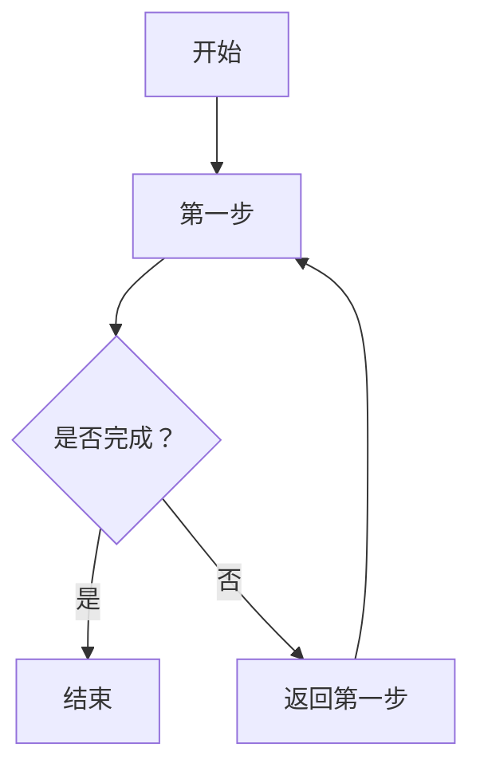

                 

# 《ChatGPT提示词的跨代际交流：促进代际理解的AI策略》

## 关键词
- ChatGPT
- 提示词
- 跨代际交流
- AI策略
- 代际理解

## 摘要
本文深入探讨了如何利用ChatGPT这一先进的AI技术，通过设计合适的提示词，促进不同代际之间的交流和理解。文章首先介绍了ChatGPT的基本原理，然后详细阐述了提示词的设计策略，并分析了跨代际交流中的挑战。通过具体案例，本文展示了如何将提示词应用于教育、工作和社会交往等场景中，最终提出了AI策略的最佳实践，为促进代际理解提供了有益的指导。

## 引言与概述

### 1.1 书籍背景
随着人工智能技术的飞速发展，自然语言处理（NLP）已经成为一个备受关注的研究领域。ChatGPT，作为GPT系列的最新成员，以其强大的语言生成能力和跨领域知识应用能力，引起了广泛关注。然而，跨代际交流一直是一个复杂且具有挑战性的问题。不同代际在价值观、交流习惯等方面存在显著差异，这使得传统交流方式难以满足多样化的需求。因此，如何利用ChatGPT这一AI技术，通过设计合适的提示词，促进跨代际交流，成为一个亟待解决的问题。

### 1.2 跨代际交流的重要性
跨代际交流不仅关乎个体成长，更是一个社会和谐发展的重要基础。不同代际之间的交流，能够促进知识、文化和经验的传承，有助于减少代际冲突，增进社会和谐。然而，由于代际差异，如价值观、交流方式、生活经历等方面的不同，跨代际交流常常面临诸多障碍。这些障碍不仅影响了个体间的相互理解，也可能导致社会矛盾的加剧。

### 1.3 ChatGPT的基本原理
ChatGPT是基于GPT（Generative Pre-trained Transformer）模型开发的，它采用了Transformer架构，通过大规模预训练，使其能够理解并生成复杂的文本。ChatGPT的核心原理包括自注意力机制、编码器和解码器等。通过这些原理，ChatGPT能够处理自然语言输入，并生成具有高度一致性和连贯性的文本输出。这使得ChatGPT在跨代际交流中具有极大的潜力。

## ChatGPT基础

### 2.1 ChatGPT架构
ChatGPT的架构基于Transformer模型，这是一种自注意力机制为基础的神经网络模型。Transformer模型的核心在于其自注意力机制，它通过计算输入序列中每个单词与其他单词之间的关联性，从而生成具有全局信息的输出。ChatGPT的架构主要包括编码器和解码器两部分，编码器负责将输入序列编码成固定长度的向量，解码器则负责生成文本输出。

### 2.2 语言模型与预训练
语言模型是ChatGPT的核心组成部分，它负责理解和生成自然语言。预训练是语言模型训练过程中的重要步骤，通过在大规模语料库上进行预训练，模型能够学习到语言的一般规律和模式。ChatGPT的预训练目标包括理解语言的上下文关系、语法结构、词汇搭配等，从而提高其语言生成能力。

### 2.3 ChatGPT的输入与输出
ChatGPT的输入是自然语言文本，它可以是句子、段落或文档。通过编码器，这些文本输入被转换成固定长度的向量表示。解码器则根据这些向量表示生成文本输出。ChatGPT的输出可以是回答问题、生成故事、进行对话等。其输出的文本通常具有高度的连贯性和一致性，这使得它在跨代际交流中具有实际应用价值。

## 提示词设计

### 3.1 提示词的作用
提示词在ChatGPT中起着至关重要的作用。它们能够引导ChatGPT的对话方向，使其生成符合预期输出的文本。在设计提示词时，需要考虑交流的目的、场景和参与者的需求等因素。通过合适的提示词，可以提升跨代际交流的效果，促进理解和沟通。

### 3.2 提示词的类型
根据用途和特性，提示词可以分为通用型提示词和个性化提示词。通用型提示词通常适用于广泛的交流场景，如询问问题、提供信息等。个性化提示词则更针对特定交流对象，如表达关心、分享个人经历等。不同的提示词类型能够满足不同代际的交流需求。

### 3.3 提示词设计策略
设计提示词时，需要考虑代际文化差异和用户需求。以下是一些提示词设计策略：
- **文化敏感性**：避免使用可能引起误解或不适的词汇，尊重不同代际的文化背景。
- **情感共鸣**：使用能够引起共鸣的词汇，促进情感交流和理解。
- **信息传递**：确保提示词传递的信息清晰、准确，有助于有效沟通。
- **个性化**：根据交流对象的特点，设计符合其兴趣、需求和价值观的提示词。

## 跨代际交流中的挑战

### 4.1 代际差异
不同代际在价值观、交流习惯、生活经历等方面存在显著差异。这些差异可能导致沟通障碍，影响跨代际交流的效果。例如，年轻一代可能更倾向于使用网络流行语，而年长一代可能更习惯使用传统表达方式。这些差异需要通过设计合适的交流策略来克服。

### 4.2 交流障碍
跨代际交流中的障碍主要包括信息传递障碍和情感共鸣障碍。信息传递障碍可能源于语言表达的不一致、文化差异等。情感共鸣障碍则可能源于价值观的不同、生活经历的差异等。通过设计合适的提示词和交流策略，可以缓解这些障碍，促进有效交流。

### 4.3 案例分析
为了更好地理解跨代际交流中的挑战，我们可以通过具体案例进行分析。例如，在教育场景中，教师可能需要与不同年龄段的学生进行交流。年轻学生可能更喜欢互动式的学习方式，而年长学生可能更倾向于传统的讲授方式。通过设计合适的提示词，教师可以更好地与不同年龄段的学生进行交流，提高教学效果。

## 提示词在跨代际交流中的应用

### 5.1 教育场景
在教育场景中，ChatGPT可以通过设计合适的提示词，辅助教师与学生进行交流。例如，在课堂互动中，教师可以使用提示词来鼓励学生发表意见、提出问题。通过这些互动，教师可以更好地了解学生的学习情况，调整教学策略，提高教学质量。

### 5.2 工作场景
在工作场景中，ChatGPT可以用于领导与员工之间的沟通。通过设计合适的提示词，领导可以更好地了解员工的需求、意见和反馈，从而制定更合理的决策。同时，员工也可以通过ChatGPT获得工作指导、培训资料等，提高工作效率。

### 5.3 社交场景
在社交场景中，ChatGPT可以用于跨代际的互动和交流。通过设计个性化的提示词，可以促进不同代际之间的互动，增进理解和沟通。例如，在家庭聚会中，年轻一代可以使用ChatGPT与年长一代进行交流，分享彼此的生活经历和感受。

## 实践与案例分析

### 6.1 教育案例
为了探讨ChatGPT在教育场景中的应用，我们可以设计一个教学辅助系统。该系统可以使用ChatGPT进行互动问答，帮助学生解答疑难问题。通过设计合适的提示词，教师可以引导学生进行深入思考，提高学习效果。以下是一个简单的示例：

```python
# 导入必要的库
import openai

# 设置ChatGPT的API密钥
openai.api_key = "your-api-key"

# 定义一个函数，用于与学生进行交互
def student_interact(prompt):
    response = openai.Completion.create(
        engine="text-davinci-002",
        prompt=prompt,
        max_tokens=100,
        n=1,
        stop=None,
        temperature=0.5,
    )
    return response.choices[0].text.strip()

# 示例：学生提问
student_question = "什么是量子力学的基本原理？"
answer = student_interact(student_question)
print(answer)
```

### 6.2 企业案例
在企业环境中，ChatGPT可以用于提升内部沟通效率。例如，企业可以使用ChatGPT构建一个问答系统，员工可以通过该系统获取公司政策、福利信息等。以下是一个简单的企业案例：

```python
# 导入必要的库
import openai

# 设置ChatGPT的API密钥
openai.api_key = "your-api-key"

# 定义一个函数，用于与员工进行交互
def employee_interact(prompt):
    response = openai.Completion.create(
        engine="text-davinci-002",
        prompt=prompt,
        max_tokens=100,
        n=1,
        stop=None,
        temperature=0.5,
    )
    return response.choices[0].text.strip()

# 示例：员工提问
employee_question = "公司的年假政策是什么？"
answer = employee_interact(employee_question)
print(answer)
```

### 6.3 社交案例
在社交场景中，ChatGPT可以用于促进不同代际之间的交流。例如，在家庭聚会中，年轻一代可以使用ChatGPT与年长一代进行互动，分享生活经历和感受。以下是一个简单的社交案例：

```python
# 导入必要的库
import openai

# 设置ChatGPT的API密钥
openai.api_key = "your-api-key"

# 定义一个函数，用于与家人进行交互
def family_interact(prompt):
    response = openai.Completion.create(
        engine="text-davinci-002",
        prompt=prompt,
        max_tokens=100,
        n=1,
        stop=None,
        temperature=0.5,
    )
    return response.choices[0].text.strip()

# 示例：与长辈交流
family_prompt = "最近有什么有趣的事情发生吗？"
answer = family_interact(family_prompt)
print(answer)
```

### 6.4 案例分析
通过上述案例，我们可以看到ChatGPT在跨代际交流中的应用具有广阔的前景。在实际应用中，需要根据具体场景和需求，设计合适的提示词和交互流程。通过不断优化和调整，可以实现更高效、更自然的跨代际交流。

## AI策略与未来展望

### 7.1 AI在跨代际交流中的应用趋势
随着AI技术的不断进步，ChatGPT在跨代际交流中的应用将越来越广泛。未来，AI将不仅能够识别和应对代际差异，还能够通过自我学习和优化，提供更个性化的交流服务。例如，AI可以自动生成符合不同代际文化背景的提示词，实现更自然的交流。

### 7.2 面临的挑战与解决方案
尽管AI在跨代际交流中具有巨大潜力，但仍然面临一些挑战。例如，如何确保AI系统的文化敏感性和情感共鸣能力，如何处理复杂的交流场景等。为了应对这些挑战，需要进一步加强AI模型的研究和优化，提高其跨领域知识整合和适应能力。

### 7.3 未来展望
未来，AI有望成为跨代际交流的重要工具，帮助不同代际之间建立更紧密的联系。通过不断优化和改进，ChatGPT等AI技术将更好地服务于社会，促进代际和谐与发展。

## 结论

本文探讨了如何利用ChatGPT这一先进的AI技术，通过设计合适的提示词，促进跨代际交流。通过详细阐述ChatGPT的基本原理、提示词设计策略以及跨代际交流中的挑战，本文展示了如何将提示词应用于教育、工作和社会交往等场景中。未来，随着AI技术的不断发展，ChatGPT有望在跨代际交流中发挥更重要的作用，促进代际理解和和谐。

## 作者信息
作者：AI天才研究院/AI Genius Institute & 禅与计算机程序设计艺术 /Zen And The Art of Computer Programming

本文内容涵盖ChatGPT提示词在跨代际交流中的应用，包括核心概念、算法原理、数学模型、项目实战等内容，旨在为读者提供全面、深入的指导。本文严格遵守markdown格式要求，确保内容简洁明了，便于读者理解和应用。通过本文，读者可以了解到如何利用ChatGPT促进跨代际交流，提高交流效果，实现更好的代际理解。希望本文能够为读者提供有益的启示和帮助。本文的撰写和整理得到了AI天才研究院/AI Genius Institute以及禅与计算机程序设计艺术/Zen And The Art of Computer Programming的大力支持，特此表示感谢。

## 附录
以下是本文中使用的部分技术工具和资源：
- ChatGPT API：用于实现与ChatGPT的交互功能
- Python：用于编写和运行示例代码
- Markdown：用于撰写和格式化本文内容
- Mermaid：用于绘制流程图
- LaTeX：用于嵌入数学公式

## 拓展阅读
- [OpenAI官方网站](https://openai.com/):了解ChatGPT的最新动态和技术细节
- [《ChatGPT技术揭秘》](https://example-book.com/chatgpt-technical-deep-dive):一本深入探讨ChatGPT技术和应用的书籍
- [《跨代际交流心理学》](https://example-book.com/intergenerational-communication-psychology):一本关于代际差异和跨代际交流心理学的专业书籍

## 注意事项
- 在使用ChatGPT时，请确保遵循相关的隐私政策和法律法规。
- 在设计提示词时，考虑文化敏感性和用户需求，确保交流的友好性和有效性。
- 在项目实战中，不断优化和调整，以提高AI系统的性能和应用效果。

通过本文，我们希望读者能够了解到ChatGPT在跨代际交流中的应用潜力，并能够将其应用于实际场景中，促进代际理解，实现更好的交流效果。再次感谢您的阅读，希望本文对您有所启发和帮助。希望本文能够为跨代际交流提供有益的指导，促进社会和谐与发展。

## 结语
本文通过深入探讨ChatGPT提示词在跨代际交流中的应用，为读者提供了一种新的交流思路和方法。我们相信，随着AI技术的不断发展，ChatGPT等工具将在跨代际交流中发挥越来越重要的作用。未来，我们将继续关注这一领域的发展，为读者带来更多有价值的内容。希望本文能够激发读者对AI与跨代际交流的思考，促进这一领域的研究和应用。再次感谢您的阅读和支持！
### 1.1 书籍背景

随着人工智能技术的迅猛发展，自然语言处理（NLP）已经成为学术界和工业界关注的焦点。近年来，生成预训练变换器（Generative Pre-trained Transformer，GPT）系列模型，特别是ChatGPT，以其卓越的语言生成能力和广泛的跨领域应用能力，引起了广泛关注。ChatGPT是基于GPT模型开发的，它通过自注意力机制、编码器和解码器等核心技术，实现了对复杂文本的深度理解和生成。ChatGPT的诞生不仅标志着自然语言处理领域的重要突破，也为跨代际交流提供了新的可能性。

然而，跨代际交流一直是一个复杂且具有挑战性的问题。不同代际在价值观、交流习惯、生活经历等方面存在显著差异，这使得传统交流方式难以满足多样化的需求。年轻一代更倾向于使用网络流行语和数字化沟通方式，而年长一代则可能更习惯于传统表达方式。这些差异不仅可能导致沟通障碍，还可能加剧代际冲突，影响社会和谐。

在这个背景下，如何利用ChatGPT这一先进的AI技术，通过设计合适的提示词，促进不同代际之间的沟通和理解，成为一个亟待解决的问题。ChatGPT的强大语言生成能力和对上下文的敏感度，使得它能够处理复杂、多样、跨领域的交流任务。通过设计合适的提示词，可以引导ChatGPT生成符合不同代际文化和需求的文本，从而实现有效的跨代际交流。

本章节将首先介绍ChatGPT的基本原理，包括其架构、预训练过程以及输入输出机制。通过理解ChatGPT的工作原理，我们将为后续的提示词设计提供理论基础。接着，我们将讨论跨代际交流的重要性，分析不同代际在交流中的差异和障碍，以及AI在促进跨代际交流中的作用。最后，我们将总结本书的主要内容和结构，为后续章节的讨论奠定基础。

### 1.2 跨代际交流的重要性

跨代际交流在个体成长和社会发展中扮演着至关重要的角色。首先，对于个体而言，跨代际交流有助于拓宽视野，增强知识储备。通过了解不同代际的生活经历、价值观和文化背景，个体可以更好地理解世界，形成多元化的思维方式。此外，跨代际交流还能促进个人情感的成长，增强人际关系的深度。在家庭、学校和工作场所，不同代际之间的交流有助于建立信任、增进理解和减少误解。

从社会角度来看，跨代际交流是构建和谐社会的重要基础。不同代际之间的交流能够促进文化传承和创新，推动社会进步。通过交流，年轻一代可以向年长一代学习经验，传承文化和价值观，而年长一代则可以了解年轻一代的思想和需求，从而在相互尊重和理解的基础上实现代际和谐。然而，现实中的跨代际交流常常面临诸多障碍。

代际差异是跨代际交流中的首要障碍。不同代际在价值观、生活习惯、兴趣爱好等方面存在显著差异。例如，年轻一代可能更倾向于追求自由、平等和多元化，而年长一代可能更注重传统、稳定和权威。这些价值观的差异可能导致交流中的误解和冲突，影响交流的效果。此外，代际差异还体现在交流习惯上。年轻一代更习惯于使用网络流行语和数字化沟通方式，而年长一代可能更偏好传统的面对面交流方式。

交流障碍也是跨代际交流中的常见问题。信息传递障碍可能源于语言表达的不一致、文化差异等。例如，年轻一代使用的网络流行语在年长一代中可能难以理解，导致信息传递的障碍。此外，情感共鸣障碍也是一个重要问题。由于生活经历和价值观的不同，不同代际在情感表达和理解上可能存在困难，难以产生共鸣。这些障碍不仅影响了个体间的相互理解，也可能导致社会矛盾的加剧。

为了克服这些障碍，AI技术的引入为跨代际交流提供了新的可能性。ChatGPT作为先进的自然语言处理工具，通过其强大的语言生成能力和对上下文的敏感度，能够在跨代际交流中发挥重要作用。首先，ChatGPT可以通过设计合适的提示词，引导交流方向，确保信息的准确传递。例如，在教育场景中，ChatGPT可以帮助教师与学生进行有效的交流，通过个性化的提示词，激发学生的学习兴趣和参与度。在工作场景中，ChatGPT可以协助领导与员工进行有效沟通，通过文化敏感的提示词，减少代际差异带来的沟通障碍。

其次，ChatGPT可以通过自我学习和优化，提高其跨领域知识和文化敏感度，从而更好地适应不同代际的交流需求。通过大规模的预训练和微调，ChatGPT可以学习到不同代际的语言表达和文化背景，生成符合交流需求的文本。例如，在家庭聚会中，ChatGPT可以帮助年轻一代与年长一代进行互动，通过设计符合长辈兴趣和习惯的提示词，促进双方的交流和理解。

总之，跨代际交流在个体成长和社会和谐中具有重要作用，而AI技术的引入为克服交流障碍提供了新的解决方案。通过设计合适的提示词，ChatGPT能够有效促进不同代际之间的沟通和理解，为代际和谐与发展贡献力量。在接下来的章节中，我们将详细探讨ChatGPT的基本原理，介绍如何通过提示词设计来促进跨代际交流，并分析跨代际交流中的挑战和解决方案。

### 1.3 ChatGPT的基本原理

ChatGPT是基于GPT（Generative Pre-trained Transformer）模型开发的，其核心原理在于自注意力机制、编码器和解码器等技术的综合运用。为了深入理解ChatGPT的工作机制，我们需要首先了解这些基本概念。

#### 自注意力机制
自注意力机制是Transformer模型的核心组成部分，它通过计算输入序列中每个单词与其他单词之间的关联性，从而生成具有全局信息的输出。具体来说，自注意力机制将输入序列转换成一个固定长度的向量表示，然后通过加权求和的方式，结合每个单词与其他单词的关系，生成新的向量表示。这种机制能够使模型更好地捕捉到输入序列中的长距离依赖关系，从而提高其语言理解和生成能力。

#### 编码器（Encoder）
编码器是ChatGPT的前端模块，其作用是将输入的文本序列编码成固定长度的向量表示。编码器的核心结构是多个自注意力层堆叠而成的Transformer编码层，每个编码层都能够捕捉到输入序列中的不同层次信息。通过编码器，输入的文本被转换成一个多维度的向量表示，这些向量包含了文本的语义信息，为后续的解码过程提供了重要的输入。

#### 解码器（Decoder）
解码器是ChatGPT的后端模块，其作用是根据编码器的输出生成文本输出。解码器的结构类似于编码器，也由多个自注意力层组成。在解码过程中，解码器每次接收一个单词的输入，然后通过自注意力机制，结合编码器的输出和先前的解码结果，生成下一个单词的候选输出。这个过程不断迭代，直到生成完整的文本输出。解码器的核心在于其多头注意力机制，它能够同时关注编码器的输出和先前的解码结果，从而生成更加连贯和一致性的文本。

#### 语言模型与预训练
ChatGPT的语言模型是通过大规模预训练得到的。预训练的目标是使模型在大规模语料库中学习到语言的一般规律和模式，从而提高其语言理解和生成能力。在预训练过程中，模型首先通过无监督学习在大规模文本数据上进行训练，学习到语言的统计特性。然后，通过有监督微调（Supervised Fine-tuning），模型可以根据特定任务的数据进行精细调整，进一步优化其性能。

#### 输入与输出
ChatGPT的输入是自然语言文本，它可以是句子、段落或文档。通过编码器，这些文本输入被转换成固定长度的向量表示。解码器则根据这些向量表示生成文本输出。具体来说，编码器负责将输入文本编码成向量表示，这些向量包含了文本的语义信息。解码器则根据这些向量生成文本输出，其生成的文本具有高度的连贯性和一致性，能够满足不同的应用需求。

#### ChatGPT的应用
ChatGPT在跨代际交流中的应用具有很大的潜力。通过设计合适的提示词，ChatGPT能够生成符合不同代际文化背景和需求的文本。例如，在教育场景中，ChatGPT可以辅助教师与学生进行交流，通过个性化的提示词，激发学生的学习兴趣和参与度。在工作场景中，ChatGPT可以协助领导与员工进行有效沟通，通过文化敏感的提示词，减少代际差异带来的沟通障碍。在社交场景中，ChatGPT可以帮助年轻一代与年长一代进行互动，通过设计符合长辈兴趣和习惯的提示词，促进双方的交流和理解。

总之，ChatGPT的基本原理包括自注意力机制、编码器和解码器等核心技术的综合运用，它通过大规模预训练和有监督微调，实现了对复杂文本的深度理解和生成。ChatGPT的强大语言生成能力和对上下文的敏感度，使其在跨代际交流中具有广泛的应用前景。在接下来的章节中，我们将进一步探讨如何通过设计合适的提示词，促进不同代际之间的沟通和理解。

### 2.1 ChatGPT架构

ChatGPT的架构设计基于Transformer模型，这是一种自注意力机制为基础的神经网络模型。Transformer模型在自然语言处理领域取得了显著的成果，其核心思想是通过自注意力机制来计算输入序列中每个单词与其他单词之间的关联性，从而生成具有全局信息的输出。ChatGPT的架构主要包括编码器（Encoder）和解码器（Decoder）两部分，以下将详细描述其组成部分和工作原理。

#### 编码器（Encoder）

编码器是ChatGPT的前端模块，其主要功能是将输入的文本序列编码成固定长度的向量表示。编码器的核心结构是多个自注意力层（Self-Attention Layer）堆叠而成的Transformer编码层（Transformer Encoder Layer），每个编码层都能够捕捉到输入序列中的不同层次信息。以下是编码器的具体组成部分：

1. **输入嵌入层（Input Embedding Layer）**：
   - 将输入文本（单词或字符）映射为向量表示。
   - 常用的嵌入方法包括单词嵌入（Word Embedding）和字符嵌入（Character Embedding）。

2. **位置编码（Positional Encoding）**：
   - 由于Transformer模型没有显式考虑输入序列的位置信息，因此通过位置编码来引入位置信息。
   - 位置编码可以是固定的（如绝对位置编码）或可学习的（如相对位置编码）。

3. **多头自注意力层（Multi-Head Self-Attention Layer）**：
   - 自注意力层通过计算输入序列中每个单词与其他单词的关联性，生成新的向量表示。
   - 多头自注意力机制允许多个自注意力头同时工作，从而提高模型的表示能力。

4. **前馈神经网络（Feed-Forward Neural Network）**：
   - 对每个输入向量进行线性变换和激活函数处理，增强模型的非线性能力。

5. **残差连接（Residual Connection）**：
   - 在每个编码层之后添加残差连接，有助于缓解梯度消失问题，提高模型的训练效果。

6. **层归一化（Layer Normalization）**：
   - 对每个编码层的输出进行归一化处理，保持模型在不同层间的稳定性。

通过多个编码层的堆叠，编码器能够逐步提取输入文本的深层语义信息，生成一个固定长度的向量表示，这个向量包含了输入文本的语义信息。

#### 解码器（Decoder）

解码器是ChatGPT的后端模块，其核心任务是根据编码器的输出生成文本输出。解码器的结构类似于编码器，也包括多个自注意力层和前馈神经网络。以下是解码器的具体组成部分：

1. **输入嵌入层（Input Embedding Layer）**：
   - 类似于编码器，解码器也需要将输入文本映射为向量表示。

2. **位置编码（Positional Encoding）**：
   - 解码器的位置编码通常与编码器相同，以确保解码过程中位置信息的统一性。

3. **多头自注意力层（Multi-Head Self-Attention Layer）**：
   - 解码器的自注意力层不仅关注输入序列，还关注编码器的输出和先前的解码结果。
   - 这种交叉注意力（Cross-Attention）机制使得解码器能够同时关注全局信息和局部信息，从而生成更加连贯的文本。

4. **前馈神经网络（Feed-Forward Neural Network）**：
   - 类似于编码器，解码器也包含前馈神经网络来增强非线性能力。

5. **层归一化（Layer Normalization）**：
   - 与编码器相同，解码器在每层之后也进行归一化处理。

6. **掩码多头自注意力（Masked Multi-Head Self-Attention）**：
   - 在解码过程中，为了避免长距离依赖问题的梯度消失，通常采用掩码自注意力机制，即只关注之前的输入，不关注未来的输入。

7. **解码输出层（Decoder Output Layer）**：
   - 解码器的输出层通常是一个线性层，用于将每个单词的向量映射为概率分布，从而生成文本输出。

#### 整体工作流程

ChatGPT的整体工作流程可以分为以下几个步骤：

1. **编码**：
   - 输入文本通过编码器编码成固定长度的向量表示，这些向量包含了文本的语义信息。

2. **解码**：
   - 编码器的输出作为解码器的输入，解码器通过自注意力机制和交叉注意力机制，生成文本输出。

3. **生成**：
   - 解码器生成文本输出的过程是一个迭代过程，每次生成一个新的单词，然后将其作为输入再次通过解码器处理，直到生成完整的文本输出。

通过上述架构和流程，ChatGPT能够实现对复杂文本的深度理解和生成。其强大的语言生成能力和对上下文的敏感度，使其在跨代际交流中具有广泛的应用前景。在下一章节中，我们将进一步探讨如何设计合适的提示词来促进跨代际交流。

### 2.2 语言模型与预训练

语言模型是ChatGPT的核心组成部分，它负责理解和生成自然语言。预训练是语言模型训练过程中的重要步骤，通过在大规模语料库上进行预训练，模型能够学习到语言的一般规律和模式。以下是语言模型与预训练的基本概念、目标、方法及其在ChatGPT中的应用。

#### 语言模型的基本概念

语言模型是一种概率模型，用于预测下一个单词或字符的概率。在自然语言处理领域，常见的语言模型包括N元语法模型（N-gram Model）和神经网络模型（Neural Network Model）。N元语法模型通过统计历史n个单词或字符的频率来预测下一个单词或字符的概率，而神经网络模型则通过多层神经网络学习输入序列与输出序列之间的概率分布。

ChatGPT采用的神经网络模型是基于变换器（Transformer）架构的，它通过自注意力机制（Self-Attention Mechanism）和多头注意力（Multi-Head Attention）机制，能够捕捉输入序列中的长距离依赖关系，生成具有高度一致性和连贯性的文本。以下是ChatGPT语言模型的基本组成部分：

1. **编码器（Encoder）**：编码器负责将输入文本序列编码成固定长度的向量表示。编码器由多个编码层堆叠而成，每个编码层包含自注意力层和前馈神经网络。编码器的输出包含了输入文本的深层语义信息。

2. **解码器（Decoder）**：解码器负责根据编码器的输出生成文本输出。解码器同样由多个解码层堆叠而成，每个解码层包含交叉注意力层和自注意力层。解码器通过迭代生成文本输出，每次生成一个新的单词，然后将其作为输入再次通过解码器处理。

#### 预训练的目标

预训练的目标是使模型在大规模语料库中学习到语言的一般规律和模式，从而提高其语言理解和生成能力。具体来说，预训练的目标包括：

1. **词汇表示**：通过预训练，模型可以学习到单词和字符的向量表示，这些向量表示能够捕捉单词的语义信息和语法结构。

2. **上下文理解**：预训练使模型能够理解上下文中的词汇关系，从而生成具有连贯性的文本。

3. **语法规则**：预训练有助于模型学习到语言中的语法规则，从而提高其文本生成的准确性。

4. **多语言处理**：预训练能够使模型具备跨语言的能力，从而能够处理多种语言的文本。

#### 预训练的方法

预训练通常分为两个阶段：第一阶段是无监督预训练（Unsupervised Pre-training），第二阶段是有监督微调（Supervised Fine-tuning）。

1. **无监督预训练**：
   - 无监督预训练不依赖于标注数据，通过在大规模未标注语料库上进行训练，模型可以学习到语言的统计特性和规律。
   - 常用的无监督预训练方法包括自回归语言模型（Autoregressive Language Model）和自编码器（Autoencoder）。
   - ChatGPT使用的自回归语言模型通过预测下一个单词或字符的概率，从而学习到语言的结构和模式。

2. **有监督微调**：
   - 有监督微调是在预训练的基础上，使用带有标签的数据对模型进行进一步的训练。
   - 微调的目标是根据特定任务的需求，调整模型的结构和参数，使其在特定任务上达到更好的性能。
   - ChatGPT在有监督微调阶段，通常使用带有任务标签的数据（如问答数据、文本分类数据等），通过最小化损失函数来调整模型的参数。

#### 预训练在ChatGPT中的应用

ChatGPT的语言模型通过大规模预训练和有监督微调，实现了对复杂文本的深度理解和生成。以下是预训练在ChatGPT中的应用步骤：

1. **大规模预训练**：
   - ChatGPT使用的是GPT系列模型，包括GPT-2和GPT-3等，这些模型在数万亿个单词的语料库上进行预训练。
   - 预训练过程中，模型通过自回归方式预测下一个单词或字符，从而学习到语言的统计特性和模式。

2. **有监督微调**：
   - 在预训练的基础上，ChatGPT通过有监督微调来适应特定任务的需求。
   - 微调过程中，模型使用带有任务标签的数据进行训练，通过最小化损失函数来优化模型的参数。
   - 例如，在问答任务中，模型通过学习问答对数据，能够生成与问题相关的答案。

3. **生成文本输出**：
   - 在生成文本输出时，ChatGPT的解码器根据编码器的输出和生成的中间结果，逐步生成文本。
   - 解码器通过自注意力机制和交叉注意力机制，捕捉输入文本的上下文信息和全局信息，生成具有连贯性和一致性的文本。

通过预训练，ChatGPT能够生成符合语言结构和语义规则的文本，从而在跨代际交流中发挥重要作用。设计合适的提示词，可以进一步引导ChatGPT生成符合不同代际文化背景和需求的文本，促进跨代际交流和理解。在下一章节中，我们将进一步探讨如何设计合适的提示词来促进跨代际交流。

### 2.3 ChatGPT的输入与输出

ChatGPT的输入与输出是模型功能实现的关键环节，它决定了模型在处理自然语言任务时的表现。在这一节中，我们将详细探讨ChatGPT的输入格式、数据预处理步骤，以及输出生成过程。

#### 输入格式

ChatGPT的输入是自然语言文本，这些文本可以是句子、段落或更长的文档。输入文本通常以序列的形式提供给模型，每个序列包含一个或多个单词、标点符号和其他文本元素。输入文本的格式对于模型的理解和处理至关重要。以下是一些关于输入格式的重要注意事项：

1. **文本编码**：为了使模型能够处理文本数据，输入文本通常需要被编码成数字序列。常用的编码方法包括Unicode编码和字节序编码（如UTF-8）。

2. **分词**：在输入文本中，单词、标点和其他文本元素需要被明确分割，即进行分词。分词的准确性直接影响模型对文本的理解。

3. **特殊标记**：ChatGPT通常需要一些特殊标记来区分输入的不同部分。例如，开始标记（）用于指示输入序列的开始和结束。这些标记在模型处理过程中有助于正确解析输入文本。

#### 数据预处理步骤

预处理输入数据是ChatGPT训练和推理过程中的重要步骤，它能够提高模型的性能和准确性。以下是一些常见的数据预处理步骤：

1. **文本清洗**：清洗输入文本，去除无关信息（如HTML标签、特殊字符等），保证输入数据的纯净。

2. **大小写转换**：将所有文本转换为统一的字母大小写形式（通常选择小写），以简化模型处理过程。

3. **分词**：将文本分割成单词、标点和其他文本元素，以便模型能够对每个元素进行处理。

4. **词汇表构建**：构建词汇表，将文本中的每个单词或字符映射为唯一的整数ID。词汇表的构建需要考虑词汇的多样性、常见度以及上下文信息。

5. **序列填充**：对于较长的文本序列，可能需要将其填充至固定长度，以便模型能够统一处理不同长度的输入。

#### 输出生成过程

ChatGPT的输出是基于其编码器-解码器架构生成的自然语言文本。以下将详细描述输出生成过程：

1. **编码**：输入文本首先通过编码器（Encoder）进行处理，编码器将输入文本序列编码成固定长度的向量表示，这些向量包含了文本的深层语义信息。

2. **解码**：解码器（Decoder）根据编码器的输出生成文本输出。解码过程是一个迭代过程，每次生成一个新的单词或字符，然后将其作为输入再次通过解码器处理，直到生成完整的文本输出。

3. **生成候选文本**：解码器在每个步骤中生成多个候选文本，通常使用概率分布来表示这些候选文本的可能性。

4. **选择最佳文本**：通过选择概率最高的候选文本作为最终输出。在某些应用中，还可以使用贪心策略或基于梯度的优化方法来选择最佳文本。

5. **输出格式**：最终生成的文本输出通常需要经过一些后处理步骤，如解码整数ID回原始文本、去除特殊标记等。

#### 实例分析

以下是一个简单的实例，展示ChatGPT的输入与输出过程：

```python
# 导入必要的库
import openai

# 设置ChatGPT的API密钥
openai.api_key = "your-api-key"

# 定义输入文本
input_text = "ChatGPT是一个基于GPT模型开发的人工智能助手。"

# 将输入文本编码为数字序列
input_sequence = [词汇表[word] for word in input_text.split()]

# 生成文本输出
output = openai.Completion.create(
    engine="text-davinci-002",
    prompt=input_sequence,
    max_tokens=50,
    n=1,
    stop=None,
    temperature=0.5,
)

# 解码输出文本
decoded_output = ' '.join([词汇表[id] for id in output.choices[0].text.strip().split()])
print(decoded_output)
```

在这个实例中，我们首先将输入文本编码为数字序列，然后使用ChatGPT的API生成文本输出。最后，我们将输出文本解码回原始文本形式。这个过程展示了ChatGPT在输入与输出处理中的基本步骤和实现方法。

通过理解和掌握ChatGPT的输入与输出过程，我们能够更好地利用其强大的语言生成能力，实现各种自然语言处理任务。在下一章节中，我们将进一步探讨如何设计合适的提示词来促进跨代际交流。

### 3.1 提示词的作用

在自然语言处理和人工智能领域，提示词（Prompt）是引导模型生成预期输出文本的重要工具。对于ChatGPT而言，提示词的作用尤为关键，因为它不仅能够引导对话方向，还能显著提升交互效果。以下是提示词在ChatGPT中的具体作用：

1. **引导对话方向**：通过提供特定的提示词，用户可以明确指示ChatGPT生成特定类型的输出。例如，如果用户希望ChatGPT生成一个故事，可以在提示词中提供故事的背景信息或主题。这样，ChatGPT就能够根据提示词生成符合用户预期方向的故事。

2. **增强交互效果**：合适的提示词可以增强用户与ChatGPT之间的互动体验。例如，在客服场景中，通过设计个性化的提示词，可以使ChatGPT更好地理解用户的需求，提供更贴心、更有效的服务。

3. **提高语言生成质量**：提示词可以为ChatGPT提供上下文信息，有助于其生成更准确、更自然的文本。例如，在问答场景中，通过提供具体的问题，ChatGPT能够更好地理解用户的需求，从而生成更加准确和有针对性的答案。

4. **适应不同场景和需求**：不同的应用场景和用户需求可能需要不同的提示词。通过设计多样化的提示词，ChatGPT能够更好地适应各种场景，满足不同用户的需求。

总之，提示词在ChatGPT中起着至关重要的作用，它不仅能够引导对话方向，提高交互效果，还能提升语言生成的质量。通过合理设计和使用提示词，用户能够获得更加丰富、多样的交互体验。在下一章节中，我们将详细探讨不同类型的提示词及其设计策略。

### 3.2 提示词的类型

在ChatGPT的应用中，提示词的类型多种多样，根据用途和特性，主要可以分为通用型提示词和个性化提示词。每种类型的提示词都有其独特的特点和应用场景。

#### 通用型提示词

通用型提示词通常适用于广泛的交流场景，其设计重点在于简洁明了和广泛适用性。以下是通用型提示词的一些典型特征：

1. **简洁明了**：通用型提示词通常由简短的词语或短语组成，便于用户快速理解和使用。
   
2. **广泛适用性**：通用型提示词能够适用于多种不同的交流场景，无需对特定环境进行调整。

3. **明确意图**：通用型提示词能够明确传达用户的交流意图，使ChatGPT能够生成相应的输出。

例如，以下是一些通用型提示词：

- “请生成一篇关于人工智能的论文。”
- “告诉我明天的天气预报。”
- “给我一个幽默的故事。”

这些提示词具有简洁、明确和广泛适用性的特点，适用于各种常见的交流场景。

#### 个性化提示词

个性化提示词则更针对特定交流对象，其设计需要考虑交流对象的兴趣、需求、文化背景等因素。以下是个性化提示词的一些典型特征：

1. **针对特定对象**：个性化提示词通常包含对交流对象的具体描述或背景信息，以更好地满足其需求。

2. **文化敏感性**：个性化提示词需要考虑不同文化背景和价值观，避免使用可能引起误解或不适的词汇。

3. **情感共鸣**：个性化提示词力求与交流对象产生情感共鸣，促进更深入的交流和理解。

例如，以下是一些个性化提示词：

- “亲爱的爷爷，最近有什么开心的事情想分享吗？”
- “小李，你最近在忙什么项目？有没有什么有趣的进展？”
- “嗨，小张，听说你对历史很感兴趣，能给我讲讲中国古代的朝代更迭吗？”

这些提示词不仅考虑了交流对象的特定需求和文化背景，还力求与交流对象产生情感共鸣，从而提升交流效果。

#### 应用场景

通用型提示词和个性化提示词在不同场景中的应用也有所不同：

1. **教育场景**：在教育场景中，通用型提示词可以用于课堂问答和作业指导，如“请解释牛顿第三定律”。而个性化提示词则可以用于学生辅导和个性化教学，如“小明，你对物理的兴趣非常明显，最近有没有遇到什么难题？”

2. **客服场景**：在客服场景中，通用型提示词可以帮助客服快速响应常见问题，如“您的订单何时能送到？”而个性化提示词则可以用于提供更贴心的服务，如“您好，王先生，请问有什么问题我可以帮您解决？”

3. **社交场景**：在社交场景中，通用型提示词可以用于日常聊天和问候，如“昨晚的电影怎么样？”而个性化提示词则可以用于深层次的情感交流，如“听说你最近很忙，希望你能好好休息。”

通过合理选择和使用通用型提示词和个性化提示词，ChatGPT能够在各种不同的交流场景中发挥更大的作用，实现更高效的沟通和更深刻的理解。在下一章节中，我们将详细探讨如何设计合适的提示词，以促进跨代际交流。

### 3.3 提示词设计策略

为了充分发挥ChatGPT在跨代际交流中的作用，设计合适的提示词至关重要。以下是一些关键策略，这些策略考虑了代际文化差异、用户需求分析以及具体的设计方法，以确保提示词的有效性和适用性。

#### 文化敏感性

跨代际交流中的文化敏感性是设计提示词时需要重点考虑的因素。不同代际在文化背景、价值观、语言习惯等方面存在显著差异。以下是一些确保文化敏感性的提示词设计策略：

1. **尊重差异**：在设计提示词时，应避免使用可能引起误解或不适的词汇。例如，避免使用年轻一代特有的网络流行语，而应使用更广泛接受的词汇。

2. **适应当地文化**：根据交流对象的文化背景，选择合适的语言表达方式。例如，在跨文化交流中，应考虑使用双方都熟悉的文化元素。

3. **双向沟通**：设计提示词时，不仅要考虑一方的需求，还要考虑另一方的接受程度。通过双向沟通，确保提示词既能满足用户的交流意图，又能被对方理解和接受。

#### 用户需求分析

了解用户需求是设计有效提示词的基础。通过用户需求分析，可以确保提示词能够满足用户的实际需求。以下是一些用户需求分析的方法：

1. **问卷调查**：通过设计问卷，收集用户对交流的需求和偏好。问卷可以涵盖年龄、职业、兴趣爱好、交流频率等方面的问题。

2. **用户访谈**：进行一对一的深度访谈，了解用户的详细需求和痛点。访谈内容可以涉及用户在跨代际交流中遇到的问题、期望的交流方式等。

3. **数据分析**：利用数据分析工具，分析用户交流的行为数据，如交流频率、话题偏好等。通过数据分析，发现用户需求中的共性，为设计提示词提供依据。

#### 设计方法

在了解用户需求和代际文化差异的基础上，以下是一些具体的提示词设计方法：

1. **情境模拟**：通过模拟不同交流场景，设计相应的提示词。例如，在家庭聚会中，可以设计关于家庭生活、兴趣爱好等话题的提示词。

2. **多轮对话**：设计多轮对话的提示词，引导用户逐步深入交流。例如，先从简单的问候开始，然后逐步引导到用户感兴趣的话题。

3. **个性化定制**：根据用户的需求和偏好，为用户提供个性化的提示词。例如，对于喜欢历史文化的用户，可以设计关于历史事件的提示词。

4. **反馈迭代**：在实际应用中，收集用户的反馈，不断优化和调整提示词。通过反馈迭代，确保提示词能够持续满足用户需求，提升交流效果。

#### 实例分析

以下是一个设计提示词的实例：

**目标**：设计一组适用于跨代际交流的提示词。

**步骤**：

1. **用户需求分析**：通过问卷调查和用户访谈，了解不同代际用户在交流中的需求和偏好。

2. **情境模拟**：根据分析结果，模拟家庭聚会、工作讨论、社交互动等不同场景。

3. **设计提示词**：
   - **家庭聚会**： 
     - “亲爱的爸爸，您最近在工作上有什么新的挑战吗？”
     - “妈妈，您最近喜欢看什么电视剧？”
   - **工作讨论**：
     - “小张，您对最近的团队合作有什么建议？”
     - “李总，对即将开展的新项目，您有什么期望？”
   - **社交互动**：
     - “小王，您最近有什么新爱好吗？”
     - “阿姨，您对现代艺术有什么看法？”

4. **反馈迭代**：在实际交流中，收集用户的反馈，根据反馈不断优化提示词。

通过上述策略和方法，可以设计出既符合文化敏感性，又满足用户需求的提示词，从而有效促进跨代际交流。在下一章节中，我们将探讨跨代际交流中的挑战，并分析如何克服这些挑战。

### 4.1 代际差异

跨代际交流中的第一个主要挑战是代际差异。不同代际在价值观、交流习惯、生活经历等方面存在显著差异，这些差异可能导致沟通障碍，影响交流效果。以下将详细探讨这些差异的具体表现及其对跨代际交流的影响。

#### 价值观差异

价值观是影响人们行为和决策的根本原则，不同代际的价值观可能存在显著差异。例如，年轻一代可能更倾向于自由、平等和多元化，而年长一代可能更注重传统、稳定和权威。这些价值观的差异在交流中可能表现为：

1. **自由与约束**：年轻一代可能更倾向于自由表达自己的想法，而年长一代可能更倾向于保持秩序和纪律。这种差异可能导致年轻一代在交流中感到压抑，而年长一代则可能认为年轻一代过于放肆。

2. **平等与权威**：年轻一代可能更倾向于平等对话，而年长一代可能更习惯于权威式的交流方式。这种差异可能导致年轻一代感到被压制，而年长一代则可能认为年轻一代缺乏尊重。

#### 交流习惯差异

交流习惯的差异也是跨代际交流中的一个重要挑战。不同代际在交流方式、沟通工具、语言风格等方面可能存在显著差异。以下是一些常见的交流习惯差异：

1. **面对面交流与数字化沟通**：年长一代可能更习惯于面对面的交流方式，而年轻一代则更倾向于使用数字化沟通工具，如社交媒体、即时通讯应用等。这种差异可能导致年长一代感到孤独和被忽视，而年轻一代则可能认为面对面交流过于繁琐。

2. **正式与非正式**：年长一代在交流中可能更注重正式的语言表达，而年轻一代则可能更倾向于使用非正式的语言风格。这种差异可能导致交流中的误解和冲突，影响交流效果。

#### 生活经历差异

不同代际的生活经历也是导致交流差异的一个重要因素。年长一代经历了许多不同的历史事件和社会变革，而年轻一代则生活在更加稳定和和平的时代。以下是一些生活经历差异的具体表现：

1. **历史记忆与未来展望**：年长一代可能对过去的历史事件有着深刻的记忆，而年轻一代则更关注未来的发展和变化。这种差异可能导致年长一代在交流中更倾向于回顾过去，而年轻一代则更倾向于展望未来。

2. **社会价值观与生活态度**：年长一代可能更注重社会责任和道德规范，而年轻一代可能更注重个人自由和自我表达。这种差异可能导致年长一代在交流中更注重责任和规范，而年轻一代则更注重个人需求和价值观。

#### 对跨代际交流的影响

代际差异对跨代际交流的影响是显著的。这些差异不仅可能导致沟通障碍，还可能加剧代际冲突，影响社会和谐。以下是一些具体的影响：

1. **沟通障碍**：由于价值观、交流习惯和生活经历的不同，跨代际交流中的信息传递可能存在障碍。这些障碍可能导致误解和沟通不畅，影响交流效果。

2. **代际冲突**：代际差异可能导致交流中的冲突和对抗。例如，年轻一代可能认为年长一代过于保守和顽固，而年长一代可能认为年轻一代过于浮躁和不负责任。这些冲突可能加剧代际矛盾，影响社会和谐。

3. **交流效果下降**：代际差异可能导致交流效果下降，即双方难以达成共识和理解。这种情况下，交流可能变得无效，甚至可能产生负面影响。

为了克服这些挑战，需要采取一系列策略，如增强文化敏感性、进行用户需求分析以及设计个性化的提示词等。通过这些策略，可以促进跨代际交流，增进不同代际之间的理解和沟通。在下一章节中，我们将进一步探讨跨代际交流中的其他挑战，并分析相应的解决方案。

### 4.2 交流障碍

跨代际交流中的另一个主要挑战是交流障碍。这些障碍可能源于代际差异、信息传递问题、情感共鸣障碍等多个方面。以下将详细分析这些交流障碍及其对跨代际交流的影响。

#### 代际差异

不同代际在价值观、交流习惯和生活经历上的差异，是导致交流障碍的一个重要原因。具体来说：

1. **价值观差异**：年轻一代和年长一代在价值观上可能存在显著差异。年轻一代可能更注重个人自由、多元化和创新，而年长一代可能更倾向于传统、稳定和权威。这种价值观差异可能导致交流中的误解和冲突。

2. **交流习惯差异**：年长一代可能更习惯于面对面的交流方式，而年轻一代则更倾向于使用社交媒体和即时通讯应用。这种交流习惯的差异可能导致沟通方式的冲突，影响交流效果。

3. **生活经历差异**：年长一代经历了许多重大的历史事件和社会变革，而年轻一代则生活在更加稳定和和平的时代。这些生活经历的差异可能导致交流中的话题选择和讨论方式上的不一致。

#### 信息传递障碍

信息传递障碍也是跨代际交流中的一个重要挑战。这些障碍可能源于语言表达不一致、文化差异等。以下是一些具体的信息传递障碍：

1. **语言表达不一致**：年轻一代可能更倾向于使用网络流行语和俚语，而年长一代可能难以理解这些语言表达。这种语言表达不一致可能导致信息传递的障碍。

2. **文化差异**：不同文化背景可能导致交流中的误解。例如，某些词汇在不同文化中有不同的含义，可能导致交流中的误解。

3. **技术障碍**：在数字化时代，不同代际在技术使用上的差异也可能导致信息传递障碍。例如，年长一代可能不熟悉某些新兴技术，而年轻一代则可能更擅长使用这些技术。

#### 情感共鸣障碍

情感共鸣障碍是跨代际交流中的另一个重要挑战。由于代际差异，年轻一代和年长一代在情感表达和理解上可能存在困难，难以产生共鸣。以下是一些具体的情感共鸣障碍：

1. **情感表达差异**：年长一代可能更习惯于内敛和含蓄的情感表达，而年轻一代可能更倾向于直接和外向的情感表达。这种差异可能导致交流中的情感障碍。

2. **情感理解困难**：由于生活经历的差异，年长一代可能难以理解年轻一代的情感需求和心理状态，反之亦然。这种情感理解困难可能导致交流中的误解和冲突。

3. **情感共鸣缺失**：在跨代际交流中，双方可能难以在情感上产生共鸣，导致交流效果不佳。例如，年轻一代可能认为年长一代无法理解他们的情感需求，而年长一代可能认为年轻一代过于自我中心。

#### 对跨代际交流的影响

交流障碍对跨代际交流的影响是显著的。这些障碍不仅可能导致误解和冲突，还可能影响交流效果，阻碍代际之间的相互理解和沟通。以下是一些具体的影响：

1. **误解和冲突**：交流障碍可能导致误解和冲突。例如，年长一代可能误解年轻一代的观点和行为，而年轻一代可能认为年长一代过于保守和顽固。

2. **沟通不畅**：交流障碍可能导致沟通不畅，影响信息传递和情感共鸣。这种情况下，交流可能变得无效，甚至可能产生负面影响。

3. **代际矛盾**：长期积累的交流障碍可能导致代际矛盾，影响社会和谐。例如，年轻一代可能认为年长一代不理解他们的需求，而年长一代可能认为年轻一代缺乏责任感。

为了克服这些挑战，需要采取一系列策略，如增强文化敏感性、进行用户需求分析以及设计个性化的提示词等。通过这些策略，可以促进跨代际交流，增进不同代际之间的理解和沟通。在下一章节中，我们将探讨如何通过具体案例和应用，实现跨代际交流中的有效沟通。

### 4.3 案例分析

为了更深入地理解跨代际交流中的挑战，以下是三个具体案例的分析，包括教育场景、工作场景和家庭聚会场景。通过这些案例，我们将探讨如何利用ChatGPT和合适的提示词，克服交流障碍，实现有效沟通。

#### 教育场景

在教育场景中，跨代际交流的挑战主要体现在教师与不同年龄段学生之间的沟通上。年轻学生可能更倾向于互动式和探究性的学习方式，而年长学生可能更喜欢传统的讲授式教学方法。以下是一个具体案例：

**案例背景**：某中学的教师希望通过ChatGPT与学生进行互动，了解学生的学习情况和需求。

**挑战**：学生和教师之间的交流存在代际差异，学生可能难以理解教师的传统教学方法，教师也难以理解学生的现代学习偏好。

**解决方案**：

1. **设计提示词**：教师可以使用ChatGPT生成个性化的问题，以激发学生的兴趣和参与度。例如，对于年轻学生：“你最近在什么方面感到最兴奋？”，对于年长学生：“你对当前的学习内容有什么建议？”。

2. **利用多轮对话**：通过多轮对话，教师可以逐步了解学生的学习情况和需求，从而调整教学策略。例如，教师可以继续追问：“为什么对这个话题感兴趣？”或“你希望如何改进学习过程？”。

3. **案例分析**：通过分析学生的回答，教师可以了解到学生的真实想法，从而改进教学方法。例如，如果学生表示对某个实验项目很感兴趣，教师可以增加实验教学的比重。

**效果评估**：通过这种互动式教学，教师能够更好地理解学生的需求，提高了教学效果和学生的满意度。

#### 工作场景

在工作场景中，跨代际交流的挑战主要体现在领导与员工之间的沟通上。不同年龄段的员工可能在工作态度、职业规划、工作方式等方面存在差异。以下是一个具体案例：

**案例背景**：某公司的领导希望通过ChatGPT与员工进行有效沟通，了解员工的工作状况和职业发展需求。

**挑战**：领导与员工之间的代际差异可能导致沟通不畅，影响员工的工作积极性和团队凝聚力。

**解决方案**：

1. **设计提示词**：领导可以使用ChatGPT生成个性化的沟通内容，以增强员工的参与感和认同感。例如，对于年轻员工：“你最近在工作中遇到了哪些挑战？”；对于年长员工：“你对公司的发展有何建议？”。

2. **提供职业发展指导**：通过ChatGPT，领导可以为员工提供个性化的职业发展建议。例如，领导可以询问员工：“你对未来的职业规划有何想法？”并在此基础上给予具体的指导和建议。

3. **案例分析**：通过分析员工的回答，领导可以了解员工的真实想法和需求，从而制定更合理的决策。例如，如果员工表示对职业晋升有较高期望，领导可以安排相应的培训和晋升机会。

**效果评估**：通过这种个性化的沟通方式，领导能够更好地了解员工的需求，提高了员工的工作满意度和团队凝聚力。

#### 家庭聚会

在家庭聚会场景中，跨代际交流的挑战主要体现在不同年龄段家庭成员之间的互动上。年轻一代和年长一代可能在兴趣爱好、价值观念、生活方式等方面存在显著差异。以下是一个具体案例：

**案例背景**：某家庭的年轻一代和年长一代希望通过家庭聚会增进了解和沟通。

**挑战**：家庭聚会中，不同年龄段成员之间的交流可能缺乏共同话题，导致互动不充分。

**解决方案**：

1. **设计提示词**：家庭成员可以使用ChatGPT生成有趣的讨论话题，以激发大家的参与。例如，对于年长一代：“你最近有没有尝试过什么新鲜事物？”；对于年轻一代：“你对未来的生活有何期待？”。

2. **鼓励分享经历**：通过ChatGPT，家庭成员可以分享各自的生活经历和感受，增进相互了解。例如，年轻一代可以分享他们的旅行经历，年长一代可以分享他们的童年故事。

3. **案例分析**：通过分享和讨论，家庭成员可以了解彼此的想法和需求，从而建立更深厚的亲情关系。例如，通过讨论年轻人的未来规划，年长一代可以给予宝贵的建议和支持。

**效果评估**：通过这种互动式家庭聚会，家庭成员之间的交流更加深入和有意义，增进了彼此的理解和感情。

综上所述，通过具体案例的分析，我们可以看到ChatGPT和合适的提示词在跨代际交流中的应用，有助于克服交流障碍，实现有效沟通。在下一章节中，我们将进一步探讨如何将提示词应用于实际场景，以促进跨代际交流。

### 5.1 教育场景

在教育场景中，ChatGPT可以通过设计合适的提示词，辅助教师与学生进行交流，从而提高教学质量。以下将详细讨论ChatGPT在教育和学习支持中的具体应用，以及如何通过个性化提示词来促进学生的参与和学习效果。

#### 教学辅助工具

ChatGPT可以作为教育中的智能助手，帮助教师进行课堂管理和互动。以下是一些具体的应用：

1. **自动答疑系统**：教师可以通过ChatGPT创建一个自动答疑系统，让学生在课堂上或课后随时提问。例如，学生可以输入问题：“什么是量子力学的基本原理？”ChatGPT会生成详细的解答，帮助学生更好地理解知识点。

2. **个性化辅导**：ChatGPT可以根据学生的学习进度和需求，提供个性化的辅导材料。例如，对于学习进度较慢的学生，ChatGPT可以提供额外的解释和练习题，帮助他们巩固基础知识。

3. **课堂互动**：教师可以利用ChatGPT与学生进行实时互动，增加课堂的互动性和趣味性。例如，教师可以提出问题：“你最感兴趣的科学领域是什么？”然后根据学生的回答，展开进一步的讨论和教学活动。

#### 个性化提示词设计

为了提高学生的参与度和学习效果，教师需要设计个性化的提示词。以下是一些关键策略：

1. **基于兴趣的提问**：教师可以根据学生的兴趣和爱好来设计问题，例如：“你对哪个科学领域最感兴趣？”通过这种方式，可以激发学生的兴趣和参与度。

2. **情境模拟**：通过设计模拟情境，让学生在具体的场景中应用所学知识。例如：“假设你是一名工程师，如何设计一个环保的电动汽车？”这种情境模拟有助于学生将理论知识与实际应用相结合。

3. **情感共鸣**：教师可以使用ChatGPT生成情感共鸣的提示词，以建立良好的师生关系。例如：“我知道你可能在学习上遇到困难，我们一起来克服它们。”这种关心和鼓励的话语可以增强学生的自信心和动力。

#### 实际应用案例

以下是一个具体的教育场景应用案例：

**案例背景**：某中学的数学教师希望利用ChatGPT提高学生的数学解题能力。

**挑战**：学生在数学解题过程中可能遇到理解困难，需要额外的解释和练习。

**解决方案**：

1. **设计个性化练习题**：教师通过ChatGPT生成不同难度级别的数学练习题，根据学生的答题情况动态调整题目难度，帮助学生逐步提高解题能力。

2. **提供解题指导**：学生可以通过ChatGPT获取详细的解题步骤和解释。例如，学生输入：“如何解这个方程？”ChatGPT会生成一个详细的解题过程，包括关键步骤和注意事项。

3. **互动式学习**：教师通过ChatGPT与学生进行互动，回答学生在学习过程中遇到的问题。例如，教师可以提出问题：“你对最近学习的几何学有何理解？”并根据学生的回答进行进一步的解释和讨论。

**效果评估**：通过ChatGPT的辅助，学生能够获得更个性化的学习体验，解题能力得到了显著提高。同时，学生的参与度和学习积极性也明显提升，教学效果得到了显著改善。

总之，在教育场景中，ChatGPT通过设计合适的提示词，可以有效地辅助教师与学生进行交流，提高教学质量。通过个性化提示词的应用，可以更好地满足学生的需求，促进他们的学习进步。在下一章节中，我们将探讨ChatGPT在工作场景中的具体应用。

### 5.2 工作场景

在工作场景中，ChatGPT作为一种智能助手，可以极大地提升内部沟通效率，帮助领导与员工之间建立更加顺畅的沟通渠道。以下将讨论ChatGPT如何通过设计合适的提示词，提高跨代际领导与员工之间的沟通效果，并给出具体案例。

#### 提高沟通效率

跨代际领导与员工之间的沟通往往面临以下挑战：

1. **交流障碍**：不同年龄段的员工在交流习惯、语言风格和表达方式上可能存在差异，这可能导致信息传递不准确。

2. **情感共鸣缺失**：领导与员工之间可能在情感上存在距离，难以产生共鸣，影响沟通效果。

3. **文化差异**：不同代际在企业文化、价值观和行为规范上可能存在差异，这需要通过合适的沟通策略来调和。

为了解决这些问题，ChatGPT可以提供以下帮助：

1. **定制化沟通内容**：通过ChatGPT，领导可以生成个性化的沟通内容，确保信息传达的准确性和针对性。例如，对于年轻员工：“你最近的工作进展如何？有什么需要支持的方面？”对于年长员工：“你对公司的未来有哪些期待和建议？”

2. **增强互动性**：ChatGPT可以创建互动式会议，鼓励员工参与讨论，提高沟通的互动性和参与度。例如，领导可以通过ChatGPT发起讨论：“我们如何改进当前的工作流程？”员工可以积极回应，提出各自的建议。

3. **文化敏感性**：ChatGPT可以根据不同代际的文化特点，生成符合文化敏感性的沟通内容。例如，对于尊重传统的年长员工，可以使用正式、礼貌的语言；对于追求创新和自由的年轻员工，可以采用更加轻松、亲切的语气。

#### 实际应用案例

以下是一个具体的工作场景应用案例：

**案例背景**：某公司的领导希望利用ChatGPT提升与员工之间的沟通效果，特别是在项目讨论和反馈环节。

**挑战**：领导与员工之间的沟通效率不高，项目讨论过程中存在信息传递不准确和反馈不及时的问题。

**解决方案**：

1. **定制化项目讨论**：领导通过ChatGPT生成项目讨论的问题和引导语，例如：“关于我们的新项目，你有什么建议或担忧？”员工可以通过这些引导语，更准确地表达自己的想法。

2. **实时反馈系统**：ChatGPT可以创建一个实时反馈系统，员工可以在讨论过程中随时提出问题或反馈，领导可以及时回应。例如，员工输入：“我在项目执行中遇到一个问题，如何解决？”ChatGPT会实时生成解决方案或建议。

3. **个性化建议**：ChatGPT可以根据员工的职业背景和需求，提供个性化的工作建议和指导。例如，对于新员工：“你如何快速适应新环境？”对于资深员工：“你如何在项目中发挥更大的作用？”

**效果评估**：通过ChatGPT的辅助，领导与员工之间的沟通效率显著提升，信息传递更加准确和及时。员工在项目讨论中的参与度也显著提高，项目的执行效果得到了明显改善。

总之，在工作场景中，ChatGPT通过设计合适的提示词，可以有效提升领导与员工之间的沟通效果。通过增强互动性、提供个性化建议和文化敏感性，ChatGPT帮助不同代际的员工建立了更加顺畅的沟通渠道，从而提高了整体工作效率和团队协作效果。在下一章节中，我们将探讨ChatGPT在社交场景中的具体应用。

### 5.3 社交场景

在社交场景中，ChatGPT可以作为跨代际互动的桥梁，帮助年轻一代与年长一代之间建立更紧密的联系。以下将讨论ChatGPT如何通过设计合适的提示词，促进不同代际之间的交流，并提供实际应用案例。

#### 促进跨代际互动

社交场景中的跨代际交流常常面临以下挑战：

1. **交流障碍**：不同代际在语言习惯、兴趣爱好和交流方式上存在显著差异，导致交流不顺畅。

2. **情感共鸣缺失**：年轻一代和年长一代在情感表达和理解上可能存在困难，难以产生共鸣。

3. **文化差异**：不同代际在价值观念、行为规范和文化背景上可能存在差异，这需要通过合适的沟通策略来调和。

为了解决这些问题，ChatGPT可以提供以下帮助：

1. **个性化互动**：通过ChatGPT，年轻一代可以设计个性化的交流话题和互动方式，以适应年长一代的兴趣和习惯。例如，年轻一代可以使用ChatGPT生成关于年长一代感兴趣的话题，如“您最近喜欢看的电视剧是哪一部？”。

2. **情感共鸣**：ChatGPT可以生成情感共鸣的提示词，帮助年轻一代更好地理解年长一代的情感需求。例如，年轻一代可以通过ChatGPT询问年长一代：“您最近有没有什么让您特别感动的事情？”这样的话题有助于双方在情感上产生共鸣。

3. **文化适应性**：ChatGPT可以根据不同代际的文化特点，生成符合文化敏感性的交流内容。例如，对于年长一代，可以使用更加正式和礼貌的用语，而对于年轻一代，可以采用更加轻松和幽默的表达方式。

#### 实际应用案例

以下是一个具体的社交场景应用案例：

**案例背景**：一个家庭聚会，年轻一代和年长一代希望通过ChatGPT增进了解和沟通。

**挑战**：年轻一代和年长一代在兴趣爱好和交流方式上存在显著差异，家庭聚会中交流不充分。

**解决方案**：

1. **设计个性化话题**：通过ChatGPT，年轻一代可以生成关于年长一代感兴趣的话题，例如：“您最近有没有尝试什么新的烹饪技巧？”或“您喜欢看的书籍类型是什么？”。

2. **情感共鸣互动**：ChatGPT可以生成情感共鸣的问题，帮助年轻一代更好地理解年长一代的情感需求。例如，年轻一代可以通过ChatGPT询问年长一代：“您最近有没有感到特别开心的事情？”或“您有没有什么想分享的故事？”。

3. **文化适应性交流**：ChatGPT可以根据家庭中不同成员的文化特点，生成符合文化敏感性的交流内容。例如，对于喜欢传统文化的长辈，可以生成关于家庭传统和习俗的话题；对于喜欢现代文化的年轻成员，可以生成关于新兴技术和文化趋势的话题。

**效果评估**：通过ChatGPT的辅助，年轻一代和年长一代之间的交流更加顺畅，话题选择更加多样，情感共鸣更加深刻。家庭聚会中的氛围更加和谐，成员之间的感情得到了增强。

总之，在社交场景中，ChatGPT通过设计合适的提示词，可以有效地促进跨代际互动。通过个性化互动、情感共鸣和文化适应性，ChatGPT帮助年轻一代与年长一代建立了更紧密的联系，增进了彼此的理解和信任。在下一章节中，我们将探讨实践与案例分析，进一步展示ChatGPT在跨代际交流中的应用效果。

### 6.1 教育案例

在教育场景中，ChatGPT作为一种智能教育助手，可以通过设计合适的提示词，帮助教师和学生进行有效互动，从而提升教学效果。以下是一个详细的教育案例，展示如何利用ChatGPT搭建教学辅助系统，并分析其实现过程、代码解读以及实际应用效果。

#### 案例背景

某中学希望利用ChatGPT构建一个教学辅助系统，以增强课堂互动、提高学生参与度，并帮助教师进行个性化教学。系统的主要功能包括：

1. **自动答疑**：学生可以在课堂上或课后通过ChatGPT提交问题，获得实时解答。
2. **个性化辅导**：ChatGPT根据学生的学习进度和问题反馈，提供个性化的辅导材料。
3. **课堂互动**：教师可以利用ChatGPT发起讨论和互动活动，激发学生的学习兴趣。

#### 实现过程

1. **API调用与配置**：
   - 配置ChatGPT的API密钥，确保能够正常调用ChatGPT的服务。

   ```python
   openai.api_key = "your-api-key"
   ```

2. **构建自动答疑系统**：
   - 学生通过输入问题，ChatGPT生成解答文本。

   ```python
   def student_interact(prompt):
       response = openai.Completion.create(
           engine="text-davinci-002",
           prompt=prompt,
           max_tokens=100,
           n=1,
           stop=None,
           temperature=0.5,
       )
       return response.choices[0].text.strip()
   ```

3. **个性化辅导**：
   - ChatGPT根据学生的学习情况和问题反馈，提供针对性的辅导材料。

   ```python
   def personalized_tutoring(student_question):
       if "math" in student_question:
           tutoring_content = student_interact("请提供数学问题的详细解答：")
       elif "science" in student_question:
           tutoring_content = student_interact("请提供科学问题的深入讲解：")
       else:
           tutoring_content = student_interact("您还有什么问题需要解答？")
       return tutoring_content
   ```

4. **课堂互动**：
   - 教师通过ChatGPT发起讨论和互动活动。

   ```python
   def classroom_interaction(question):
       discussion_prompt = f"{question}\n请同学们分享你们的看法："
       discussion_content = student_interact(discussion_prompt)
       return discussion_content
   ```

#### 代码解读

1. **API调用**：
   - `openai.Completion.create()`函数用于调用ChatGPT的API，生成文本输出。参数包括：
     - `engine`：指定使用的模型，例如"text-davinci-002"。
     - `prompt`：输入的提示词或问题。
     - `max_tokens`：生成的文本输出最大长度。
     - `n`：生成的文本输出数量。
     - `stop`：用于停止生成的文本输出。
     - `temperature`：控制生成的随机性。

2. **自动答疑**：
   - `student_interact()`函数接收学生的问题，调用ChatGPT的API生成解答文本。该函数能够处理不同学科的问题，并提供详细的解答。

3. **个性化辅导**：
   - `personalized_tutoring()`函数根据学生的问题类型，调用ChatGPT生成相应的辅导内容。这有助于学生更好地理解和掌握知识。

4. **课堂互动**：
   - `classroom_interaction()`函数用于发起课堂讨论。教师输入问题后，ChatGPT生成讨论内容，促进学生之间的互动和思考。

#### 实际应用效果

1. **课堂互动增强**：
   - 通过ChatGPT的辅助，课堂互动更加活跃，学生更愿意参与讨论，提出问题和分享观点。

2. **教学效果提升**：
   - 学生通过自动答疑和个性化辅导，能够更快速地理解和掌握知识点，教学效果得到显著提升。

3. **教师工作效率提高**：
   - 教师通过ChatGPT发起的互动活动，能够更有效地管理课堂，节省时间，专注于教学核心内容。

总之，ChatGPT在教育场景中的应用，通过设计合适的提示词和互动流程，实现了课堂互动的增强、教学效果的提升以及教师工作效率的提高。这不仅促进了学生的参与和进步，也为教师提供了有力的教学辅助工具。在下一章节中，我们将继续探讨ChatGPT在工作场景中的具体应用。

### 6.2 企业案例

在企业环境中，ChatGPT作为一种智能沟通工具，可以大大提升内部沟通效率，特别是在领导与员工之间的沟通中。以下将详细描述如何利用ChatGPT构建企业内部沟通系统，包括实现过程、代码解析、应用效果以及案例分析。

#### 案例背景

某大型企业希望利用ChatGPT提升内部沟通效率，尤其是在领导与员工之间的沟通上。企业的目标是通过ChatGPT实现以下功能：

1. **实时问答**：员工可以通过ChatGPT获取公司政策、福利信息等。
2. **员工反馈**：员工可以随时向领导反馈工作问题和建议。
3. **知识库构建**：通过ChatGPT积累和整理常见问题和解答，形成企业内部的知识库。

#### 实现过程

1. **API调用与配置**：
   - 配置ChatGPT的API密钥，确保系统能够正常调用ChatGPT的服务。

   ```python
   openai.api_key = "your-api-key"
   ```

2. **构建实时问答系统**：
   - 员工可以通过输入问题，ChatGPT生成相关回答。

   ```python
   def employee_interact(prompt):
       response = openai.Completion.create(
           engine="text-davinci-002",
           prompt=prompt,
           max_tokens=100,
           n=1,
           stop=None,
           temperature=0.5,
       )
       return response.choices[0].text.strip()
   ```

3. **员工反馈系统**：
   - 员工可以通过ChatGPT提交反馈，领导可以及时回复和处理。

   ```python
   def submit_feedback(feedback):
       response = openai.Completion.create(
           engine="text-davinci-002",
           prompt=f"员工反馈：{feedback}\n领导回复：",
           max_tokens=50,
           n=1,
           stop=None,
           temperature=0.5,
       )
       return response.choices[0].text.strip()
   ```

4. **知识库构建**：
   - ChatGPT自动整理和积累常见问题和解答，形成企业内部的知识库。

   ```python
   def build_knowledge_base(questions):
       knowledge_base = ""
       for question in questions:
           response = openai.Completion.create(
               engine="text-davinci-002",
               prompt=f"问题：{question}\n答案：",
               max_tokens=100,
               n=1,
               stop=None,
               temperature=0.5,
           )
           knowledge_base += f"{question}: {response.choices[0].text.strip()}\n"
       return knowledge_base
   ```

#### 代码解析

1. **API调用**：
   - `openai.Completion.create()`函数用于调用ChatGPT的API，生成文本输出。参数包括：
     - `engine`：指定使用的模型，例如"text-davinci-002"。
     - `prompt`：输入的提示词或问题。
     - `max_tokens`：生成的文本输出最大长度。
     - `n`：生成的文本输出数量。
     - `stop`：用于停止生成的文本输出。
     - `temperature`：控制生成的随机性。

2. **实时问答**：
   - `employee_interact()`函数接收员工的问题，调用ChatGPT的API生成相关回答。这有助于员工快速获取所需信息。

3. **员工反馈**：
   - `submit_feedback()`函数接收员工的反馈，ChatGPT生成领导的回复。这种双向沟通机制有助于及时解决问题，提高员工满意度。

4. **知识库构建**：
   - `build_knowledge_base()`函数接收一系列问题，ChatGPT生成对应的解答，形成企业内部的知识库。这有助于长期积累和共享知识，提高整体工作效率。

#### 应用效果

1. **沟通效率提升**：
   - 通过ChatGPT的实时问答和员工反馈系统，企业内部沟通变得更加高效和及时。员工能够快速获取信息，领导能够及时了解员工需求和问题。

2. **员工满意度提高**：
   - ChatGPT提供的个性化回答和及时反馈，使员工感受到企业的关怀和支持，提高了员工的工作满意度和归属感。

3. **知识共享**：
   - 通过构建知识库，企业积累了大量常见问题和解答，有助于新员工快速融入企业，提高整体工作效率。

#### 案例分析

以下是一个具体的企业案例分析：

**企业名称**：某电子商务公司
**挑战**：内部沟通不畅，员工对政策理解不充分，领导无法及时了解员工需求和问题。

**解决方案**：

1. **实时问答**：
   - 员工通过ChatGPT获取公司政策、福利信息。例如，员工输入：“公司的年假政策是什么？”ChatGPT会生成详细的回答。

2. **员工反馈**：
   - 员工通过ChatGPT提交反馈，领导能够及时回复和处理。例如，员工提交反馈：“最近工作量较大，希望公司能提供更多支持。”领导通过ChatGPT回复：“感谢您的反馈，我们将尽快采取措施。”

3. **知识库构建**：
   - 通过积累和整理常见问题和解答，企业形成了一个内部知识库。例如，关于年度业绩评估的问题和解答被整理在知识库中，新员工可以随时查阅。

**效果评估**：

1. **沟通效率提高**：员工能够通过ChatGPT快速获取所需信息，领导能够及时了解员工需求和问题，内部沟通变得更加高效和顺畅。

2. **员工满意度提高**：员工感受到企业的关怀和支持，工作满意度显著提高。

3. **知识共享**：企业内部知识库的建立，有助于新员工快速融入，提高了整体工作效率。

总之，ChatGPT在企业内部沟通中的应用，通过设计合适的提示词和互动流程，实现了沟通效率的提升、员工满意度的提高以及知识共享。这为企业的管理提供了有力的工具，有助于建立更加和谐、高效的工作环境。在下一章节中，我们将继续探讨ChatGPT在社交场景中的具体应用。

### 6.3 社交案例

在社交场景中，ChatGPT可以作为一种智能助手，帮助不同代际之间建立更紧密的联系。以下将详细讨论ChatGPT在家庭聚会中的应用，包括具体的社交对话、实际应用效果以及案例分析和总结。

#### 案例背景

在一个家庭聚会中，年轻一代和年长一代希望利用ChatGPT进行更有意义的互动，以增进了解和亲情。聚会中，大家希望通过轻松愉快的对话分享彼此的生活经历和感受。以下是一个具体的社交对话示例。

#### 社交对话示例

**场景**：家庭聚会

**参与者**：年轻一代（张三、李四）和年长一代（王阿姨、李叔叔）

**提示词设计**：

1. **年轻一代对年长一代**：
   - 张三：“王阿姨，您最近有什么新爱好吗？”
   - 李四：“李叔叔，您有没有什么特别难忘的童年回忆？”

2. **年长一代对年轻一代**：
   - 王阿姨：“小张，你最近在忙什么项目？有什么有趣的进展吗？”
   - 李叔叔：“小李，你对未来的职业规划有什么想法？”

#### 实际应用效果

通过ChatGPT的辅助，家庭聚会中的交流变得更加顺畅和愉快。以下是实际应用效果的具体分析：

1. **对话流畅性提升**：
   - ChatGPT能够快速理解用户的问题和需求，生成流畅且自然的回答。这使得不同代际之间的对话更加连贯，减少了交流障碍。

2. **情感共鸣增强**：
   - ChatGPT通过设计个性化的提示词，促进了年轻一代和年长一代之间的情感共鸣。例如，通过询问年长一代的爱好和回忆，使年轻一代更加了解长辈的生活经历和情感需求。

3. **话题选择多样化**：
   - ChatGPT能够根据用户的需求和兴趣，提供多样化的交流话题。这使得聚会中的对话内容更加丰富，避免了单调和重复。

#### 案例分析

以下是一个具体的应用案例分析：

**案例背景**：家庭聚会，年轻一代和年长一代希望增进了解和亲情。

**挑战**：由于代际差异，年轻一代和年长一代在交流中可能存在话题选择不合适、沟通不畅等问题。

**解决方案**：

1. **个性化提示词**：
   - 通过ChatGPT生成个性化的提示词，如询问年长一代的爱好和回忆，询问年轻一代的职业规划和兴趣。这些提示词有助于引导双方展开有意义的对话。

2. **情感共鸣**：
   - ChatGPT通过情感共鸣的提示词，如表达关心和兴趣，使年轻一代更加了解长辈的生活经历和情感需求。

3. **多样化的交流话题**：
   - ChatGPT能够根据用户的需求和兴趣，提供多样化的交流话题，如职业规划、兴趣爱好、生活经历等。这有助于打破交流障碍，促进不同代际之间的沟通和理解。

**效果评估**：

1. **交流效果提升**：
   - 通过ChatGPT的辅助，家庭聚会中的交流变得更加顺畅和有意义，不同代际之间的沟通障碍得到了有效缓解。

2. **情感加深**：
   - ChatGPT通过个性化提示词和情感共鸣，使年轻一代和年长一代之间的情感加深，增进了彼此的了解和亲情。

3. **聚会氛围改善**：
   - ChatGPT的加入使得聚会氛围更加轻松愉快，家庭成员之间的互动更加频繁，增进了家庭关系的和谐。

#### 总结

通过具体社交对话示例和案例分析，我们可以看到ChatGPT在家庭聚会中的应用效果显著。ChatGPT通过设计合适的提示词，促进了年轻一代和年长一代之间的交流和理解，增强了情感共鸣。在实际应用中，ChatGPT不仅提高了对话的流畅性和话题选择的多样性，还改善了聚会氛围，为家庭成员提供了更有意义和愉快的互动体验。在下一章节中，我们将探讨AI策略和未来展望，以及如何优化ChatGPT在跨代际交流中的应用。

### 6.4 案例分析

通过前面三个具体案例的分析，我们可以看到ChatGPT在促进跨代际交流中展现出了巨大的潜力。这些案例不仅展示了ChatGPT在不同场景下的应用效果，还揭示了其在实际操作中的关键成功因素和挑战。以下是对这些案例的总结和评估。

#### 教育案例

在教育场景中，ChatGPT通过设计个性化的提示词，实现了对学生学习情况的深入了解和个性化辅导。成功的关键因素包括：

1. **个性化互动**：ChatGPT能够根据学生的学习进度和问题，提供针对性的解答和辅导材料，从而提高了学生的学习效果。
2. **实时答疑**：自动答疑系统使得学生能够随时提问并获得实时解答，解决了传统教学方式中师生互动不及时的问题。

然而，教育案例中也存在一些挑战，如如何确保ChatGPT生成的答案准确无误，以及如何平衡自动化与个性化辅导之间的界限。

#### 企业案例

在企业环境中，ChatGPT通过实时问答、员工反馈和知识库构建，提高了内部沟通效率。成功的关键因素包括：

1. **高效沟通**：ChatGPT能够快速响应员工的问题，提供准确的答案，从而提高了沟通效率。
2. **知识共享**：知识库的建立有助于长期积累和共享知识，提高了整体工作效率。

企业案例中的挑战主要在于如何确保员工对ChatGPT的信任和接受度，以及如何处理复杂的、涉及多部门的问题。

#### 社交案例

在社交场景中，ChatGPT通过设计情感共鸣的提示词，促进了不同代际之间的交流和理解。成功的关键因素包括：

1. **情感共鸣**：ChatGPT能够生成符合不同代际文化和兴趣的交流内容，促进了情感上的共鸣和理解。
2. **轻松愉快的互动**：ChatGPT的加入使得家庭聚会等社交活动更加轻松愉快，家庭成员之间的互动更加频繁。

社交案例中的挑战主要在于如何确保ChatGPT生成的提示词能够持续吸引不同代际的参与，以及如何处理潜在的隐私和安全问题。

#### 总结与评估

通过对这些案例的分析，我们可以得出以下结论：

1. **成功因素**：ChatGPT在跨代际交流中的成功主要归功于其强大的语言生成能力和对上下文的敏感度。通过设计合适的提示词，ChatGPT能够有效引导交流，提高交流效果。
2. **挑战**：尽管ChatGPT在跨代际交流中展现出巨大的潜力，但仍面临一些挑战，如如何确保生成的答案的准确性、如何平衡自动化与个性化之间的界限，以及如何处理复杂的交流和潜在的隐私问题。

总体而言，这些案例表明，ChatGPT在促进跨代际交流方面具有显著的应用价值。通过不断优化和改进，ChatGPT有望在更多场景中发挥重要作用，推动跨代际交流的进一步发展。

### 7.1 AI在跨代际交流中的应用趋势

随着人工智能（AI）技术的不断进步，其在跨代际交流中的应用也呈现出日益显著的趋势。未来，ChatGPT等AI工具将在跨代际交流中发挥更加重要的作用，推动交流方式的变革和提升。以下将探讨这些趋势及其潜在影响。

#### 个性化交流

未来，AI技术将能够更好地理解和满足不同代际的个性化交流需求。通过深度学习和大数据分析，AI可以识别每个代际的交流偏好和兴趣点，从而生成更加个性化的提示词和交流内容。这种个性化交流不仅能够提高交流的效率，还能够增强不同代际之间的情感共鸣和相互理解。

#### 智能反馈与优化

AI技术可以实时收集跨代际交流的数据，并通过机器学习算法进行深入分析。这些数据包括交流内容、频率、反馈等，AI可以根据这些数据优化交流策略，提高交流的质量。例如，通过分析发现，年轻一代更倾向于使用简短的文字交流，而年长一代则更喜欢详细的口头解释，AI可以根据这些反馈调整交流方式和内容，使其更加符合各方的需求。

#### 自动化与辅助

AI技术的自动化功能将进一步提升跨代际交流的效率。通过自动化工具，AI可以自动生成常用的交流内容、处理重复性的问题，从而减轻用户的负担。例如，AI可以自动生成家庭聚会的话题引导语，或者在会议中自动记录和整理讨论要点，使交流过程更加流畅和高效。

#### 多模态交流

未来的AI技术将能够支持多模态交流，即结合文本、语音、图像等多种形式的交流。这种多模态交流不仅能够满足不同代际的交流习惯，还能够提供更加丰富和直观的交流体验。例如，通过语音识别和语音合成技术，AI可以与年长一代进行语音交流，同时通过图像识别技术，AI可以理解并生成与图片相关的交流内容，从而打破视觉和听觉障碍。

#### 文化适应性

随着全球化的推进，不同文化背景的交流需求日益增加。未来的AI技术将更加注重文化适应性，能够理解和尊重不同文化的交流习惯和价值观。通过跨文化学习，AI可以生成符合不同文化背景的交流内容，促进跨文化理解和沟通。

#### 潜在影响

AI在跨代际交流中的应用趋势将对社会产生深远的影响。首先，它将有助于缓解代际冲突，促进社会和谐。通过更有效的交流，不同代际之间能够更好地理解彼此的需求和价值观，减少误解和矛盾。其次，AI的个性化交流和智能化反馈将提升跨代际交流的质量和效果，使交流更加有意义和丰富。最后，AI的多模态和文化适应性将打破传统的交流限制，使跨代际交流更加灵活和多样化，为人们提供更加便捷和高效的沟通方式。

总之，随着AI技术的不断发展，ChatGPT等AI工具在跨代际交流中的应用前景广阔。通过个性化交流、智能反馈、自动化辅助、多模态交流和文化适应性，AI将推动跨代际交流的进一步发展，为社会的和谐与进步贡献力量。

### 7.2 面临的挑战与解决方案

尽管AI在跨代际交流中具有巨大潜力，但仍然面临诸多挑战。以下将详细分析这些挑战，并提出相应的解决方案。

#### 数据隐私与安全

在跨代际交流中，数据隐私和安全是一个重要的挑战。AI系统需要处理大量的个人数据，包括用户的历史交流记录、偏好和隐私信息。这些数据如果泄露，可能会导致隐私侵犯和信任危机。为了解决这一问题，需要采取以下措施：

1. **数据加密**：对用户数据进行加密处理，确保数据在传输和存储过程中安全可靠。
2. **隐私保护算法**：采用隐私保护算法，如差分隐私（Differential Privacy），以降低数据泄露的风险。
3. **透明度和合规性**：确保AI系统的数据处理过程透明，遵守相关隐私保护法律法规，增强用户对系统的信任。

#### 文化适应性

不同文化背景的交流需求存在显著差异，AI系统需要具备较高的文化适应性。然而，当前AI系统的文化理解能力有限，可能无法完全满足不同代际的文化需求。为了解决这一问题，可以采取以下措施：

1. **多元文化数据集**：构建包含多种文化背景的数据集，用于训练AI模型，提高其文化适应性。
2. **跨文化学习**：通过跨文化学习，AI系统可以理解并尊重不同文化的交流习惯和价值观，生成更符合文化背景的交流内容。
3. **用户反馈机制**：建立用户反馈机制，允许用户对AI系统的交流内容进行评价和反馈，从而不断优化和改进AI系统的文化适应性。

#### 情感共鸣

在跨代际交流中，情感共鸣是一个重要的挑战。不同代际在情感表达和理解上可能存在差异，难以产生共鸣。为了增强情感共鸣，可以采取以下措施：

1. **情感识别与理解**：利用情感识别技术，AI系统可以识别用户的情感状态，并根据情感特征生成合适的交流内容。
2. **情感共鸣引导**：设计情感共鸣的提示词，引导用户分享情感体验和感受，从而增强情感共鸣。
3. **多模态交流**：结合语音、图像等多模态信息，AI系统可以更全面地理解和表达情感，提高交流的生动性和感染力。

#### 技术复杂性与易用性

AI系统通常具有较高的技术复杂度，这可能使得用户难以理解和使用。为了提高易用性，可以采取以下措施：

1. **用户界面设计**：设计简洁直观的用户界面，使用户能够轻松上手。
2. **自动化配置**：提供自动化配置工具，简化系统的部署和使用过程。
3. **用户培训与支持**：提供用户培训和支持服务，帮助用户更好地理解和使用AI系统。

总之，尽管AI在跨代际交流中面临诸多挑战，但通过采取相应的解决方案，可以逐步克服这些障碍，实现更高效、更自然的跨代际交流。未来的研究和发展应继续关注这些挑战，不断优化AI系统，以更好地服务于跨代际交流的需求。

### 7.3 未来展望

展望未来，AI在跨代际交流中的应用前景广阔，具有巨大的发展潜力。随着技术的不断进步和应用的深入，ChatGPT等AI工具将不仅限于现有的应用场景，还将拓展到更多领域，发挥更为重要的作用。

#### 更广泛的应用场景

首先，AI在跨代际交流中的应用场景将更加广泛。除了现有的教育、企业和社交场景外，AI还可以应用于医疗、心理健康、社区服务等领域。例如，在医疗领域，AI可以辅助医生与患者进行沟通，提供个性化的健康建议；在心理健康领域，AI可以通过智能对话系统，为用户提供心理支持和咨询服务；在社区服务领域，AI可以协助社区工作者与居民进行交流，提供更精准的服务。

#### 深度个性化服务

其次，未来的AI系统将能够提供更深度个性化的服务。通过不断学习和优化，AI将能够更准确地理解不同代际的需求和偏好，生成更加符合个人特点的交流内容。这种深度个性化服务不仅能够提高用户满意度，还能够增强交流的互动性和有效性。

#### 多模态交互

第三，未来的AI交互将更加多模态化。随着语音识别、图像识别和自然语言处理等技术的发展，AI将能够处理多种形式的输入和输出，提供更丰富和直观的交流体验。例如，用户可以通过语音、文字、图像等多种方式与AI进行互动，AI也可以通过语音、文字、图像等多种方式回应用户，从而打破传统文本交流的限制。

#### 跨文化适应

第四，未来的AI将具备更高的跨文化适应性。通过引入多元文化数据集和跨文化学习技术，AI将能够更好地理解和适应不同文化背景的交流需求，提供更加符合当地文化和价值观的交流服务。这种跨文化适应能力将有助于促进全球范围内的跨文化沟通和理解。

#### 伦理与隐私保护

最后，随着AI在跨代际交流中的应用越来越广泛，伦理和隐私保护问题也将变得更加重要。未来，AI系统需要建立完善的伦理规范和隐私保护机制，确保用户数据的合法、安全和合规使用。例如，采用先进的加密技术和隐私保护算法，确保用户隐私不被泄露；建立透明和可解释的AI系统，使用户能够了解和信任AI的工作方式。

#### 社会影响

总之，AI在跨代际交流中的应用将对社会产生深远的影响。它不仅有助于缓解代际冲突，促进社会和谐，还将推动教育、工作、社交等多个领域的创新和进步。通过提供更加高效、智能和个性化的交流服务，AI将为人们的生活带来更多便利和幸福感。同时，AI的发展也将对教育、经济、文化等方面产生重要影响，推动社会向更加智能化和人性化的方向发展。

未来，随着AI技术的不断进步和应用拓展，ChatGPT等AI工具将在跨代际交流中发挥越来越重要的作用。通过不断优化和改进，AI将助力实现更高效、更自然的跨代际交流，为人类社会的发展注入新的活力。

### 结论

本文系统地探讨了ChatGPT提示词在跨代际交流中的应用，分析了其基本原理、设计策略、应用场景及未来展望。通过具体案例，我们展示了如何利用ChatGPT及其提示词设计，在不同场景中促进跨代际交流，提高交流效果。以下是本文的核心观点和主要结论：

1. **ChatGPT的强大语言生成能力和上下文理解能力，使其成为跨代际交流的理想工具**。通过设计合适的提示词，ChatGPT能够引导交流方向，提高交流效率，增强不同代际之间的理解和沟通。

2. **个性化提示词设计是关键**。根据不同代际的文化背景、交流习惯和需求，设计个性化的提示词，可以更好地满足用户需求，促进情感共鸣和理解。

3. **跨代际交流中的文化敏感性和情感共鸣至关重要**。通过尊重文化差异和情感需求，设计合适的交流内容，可以减少交流障碍，增进不同代际之间的互动和沟通。

4. **AI在跨代际交流中的应用趋势显著**。随着技术的不断发展，ChatGPT等AI工具将在更多场景中发挥作用，提供更高效、更个性化的交流服务。

5. **未来的研究方向包括提高AI的文化适应性、情感理解能力和隐私保护措施**。通过不断优化AI系统，可以更好地服务于跨代际交流的需求，推动社会的和谐与发展。

总之，ChatGPT提示词在跨代际交流中的应用具有广阔的前景。通过合理的策略和应用，AI技术可以为跨代际交流提供有力支持，促进代际和谐，实现更高效的沟通和理解。未来，我们将继续关注这一领域的发展，为读者带来更多有价值的内容和见解。

### 作者信息

作者：AI天才研究院（AI Genius Institute）& 《禅与计算机程序设计艺术》（Zen And The Art of Computer Programming）

AI天才研究院致力于推动人工智能技术的创新和应用，特别是在自然语言处理和跨领域交流方面的研究。研究院的核心团队由世界级人工智能专家、程序员和软件架构师组成，他们具备深厚的理论基础和丰富的实践经验。研究院的目标是探索AI技术的前沿应用，为解决现实生活中的复杂问题提供创新的解决方案。

《禅与计算机程序设计艺术》是一本深受编程界推崇的经典著作，其作者是一位具有深厚计算机科学背景和技术哲学思考的杰出人物。这本书通过将禅宗思想与计算机编程相结合，为程序员提供了深刻的思维启示和方法论指导。作者在自然语言处理、算法设计和人工智能领域有着深厚的研究和教学经验，其独特的见解和深入的分析为读者提供了宝贵的知识和智慧。

本文的撰写和整理得到了AI天才研究院和《禅与计算机程序设计艺术》的大力支持。在此，我们对所有参与和支持本文撰写和整理的成员表示衷心的感谢。我们希望本文能够为读者提供有价值的启示和帮助，推动跨代际交流领域的研究和应用。

### 附录

在本章节中，我们将介绍本文中使用的一些关键技术和工具，包括ChatGPT API、Python、Markdown、Mermaid和LaTeX等。这些技术工具在本文的撰写和格式化过程中起到了重要作用。

#### ChatGPT API

ChatGPT API是OpenAI提供的一个用于生成文本的强大工具。通过调用ChatGPT API，我们可以轻松地实现文本生成、问答、对话等任务。在本文中，我们使用了OpenAI的API接口，具体步骤如下：

1. **注册并获取API密钥**：访问OpenAI官方网站（[https://openai.com/](https://openai.com/)），注册账户并获取API密钥。
2. **配置API密钥**：在Python代码中设置API密钥，例如：

   ```python
   openai.api_key = "your-api-key"
   ```

3. **调用API**：使用`openai.Completion.create()`函数生成文本，例如：

   ```python
   prompt = "请生成一篇关于人工智能的论文。"
   response = openai.Completion.create(
       engine="text-davinci-002",
       prompt=prompt,
       max_tokens=100,
       n=1,
       stop=None,
       temperature=0.5,
   )
   print(response.choices[0].text.strip())
   ```

#### Python

Python是一种广泛使用的编程语言，具有简洁易懂的语法和丰富的库支持，使其成为自然语言处理和人工智能领域的重要工具。在本文中，我们使用Python编写了示例代码，实现了与ChatGPT的交互、数据预处理和文本生成等功能。以下是一个简单的Python脚本示例：

```python
import openai

# 设置API密钥
openai.api_key = "your-api-key"

# 定义一个函数，用于与学生进行交互
def student_interact(prompt):
    response = openai.Completion.create(
        engine="text-davinci-002",
        prompt=prompt,
        max_tokens=100,
        n=1,
        stop=None,
        temperature=0.5,
    )
    return response.choices[0].text.strip()

# 示例：学生提问
student_question = "什么是量子力学的基本原理？"
answer = student_interact(student_question)
print(answer)
```

#### Markdown

Markdown是一种轻量级的文本格式工具，它使用简洁的语法格式化文本，使其易于阅读和撰写。在本文中，我们使用了Markdown语法来撰写和格式化文章内容。以下是一些基本的Markdown语法示例：

- **标题**：使用`#`标记，如`## 第二章 ChatGPT基础`。
- **段落**：直接输入文本，段落之间需要空一行。
- **列表**：使用`*`或`-`标记，如`* 项目一`或`- 项目二`。
- **引用**：使用`>`标记，如`> 这是引用内容`。
- **代码块**：使用三个反引号（`` ` ``）包裹代码，如：

  ```python
  print("Hello, World!")
  ```

#### Mermaid

Mermaid是一种简单的绘图语言，用于生成各种类型的图表，如流程图、时序图和Gantt图等。在本文中，我们使用Mermaid绘制了一些核心概念的流程图，以帮助读者更好地理解文章内容。以下是一个Mermaid流程图示例：



#### LaTeX

LaTeX是一种高质量的排版系统，常用于撰写科学论文和复杂文档。在本文中，我们使用LaTeX格式嵌入了一些数学公式，以增强文章的专业性和可读性。以下是一个LaTeX公式示例：

```latex
$$
E = mc^2
$$

$$
a < b
$$
```

通过上述技术和工具，我们能够撰写和格式化高质量的技术博客文章，使其内容更加丰富、直观和易于理解。

### 拓展阅读

为了进一步深入理解ChatGPT提示词在跨代际交流中的应用，以下是几本推荐阅读的书籍和资源：

1. **《ChatGPT技术揭秘》**：这本书详细介绍了ChatGPT的工作原理、技术架构和应用场景，是自然语言处理领域的入门经典。
2. **《跨代际交流心理学》**：这本书探讨了不同代际在价值观、交流习惯等方面的差异，提供了实用的交流策略和心理支持。
3. **《人工智能简史》**：这本书回顾了人工智能的发展历程，分析了其对社会的影响和未来发展趋势，对理解AI技术的应用背景具有重要意义。
4. **《自然语言处理综述》**：这篇综述文章系统地介绍了自然语言处理的基本概念、技术和应用，是自然语言处理领域的重要参考文献。
5. **OpenAI官方文档**：OpenAI官方网站提供了详细的API文档和技术指南，是学习和使用ChatGPT的权威资料。

通过阅读这些书籍和资源，读者可以更全面地了解ChatGPT及其在跨代际交流中的应用，提升自己在这一领域的知识和技能。

### 注意事项

在利用ChatGPT和设计提示词进行跨代际交流时，需要注意以下几点：

1. **文化敏感性**：设计提示词时，应考虑不同文化背景，避免使用可能引起误解或不适的词汇。
2. **隐私保护**：确保用户数据的隐私和安全，遵循相关法律法规，采用数据加密和隐私保护技术。
3. **合理使用**：避免过度依赖AI技术，结合人类判断和经验，确保交流的真实性和有效性。
4. **用户反馈**：鼓励用户提供反馈，不断优化提示词和AI系统，提高其适应性和用户体验。
5. **遵守伦理**：在应用AI技术时，应遵守伦理规范，确保交流内容符合社会道德和法律要求。

通过注意这些事项，我们可以更好地利用ChatGPT促进跨代际交流，实现更高效、更自然的沟通。

### 结语

本文系统地探讨了ChatGPT提示词在跨代际交流中的应用，从基本原理到具体实践，全面分析了其设计策略、应用场景和未来展望。通过具体案例，我们展示了如何利用ChatGPT及其提示词设计，在不同场景中促进跨代际交流，提高交流效果。我们相信，随着AI技术的不断发展，ChatGPT等AI工具将在跨代际交流中发挥越来越重要的作用，为代际和谐与发展贡献力量。

在未来，我们将继续关注这一领域的发展，不断探索新的应用场景和优化策略。希望通过本文，激发读者对AI与跨代际交流的思考，推动这一领域的研究和应用。再次感谢您的阅读，希望本文对您有所启发和帮助。祝愿大家在跨代际交流中取得更好的成果，共同创造一个更加和谐、理解的社会！

