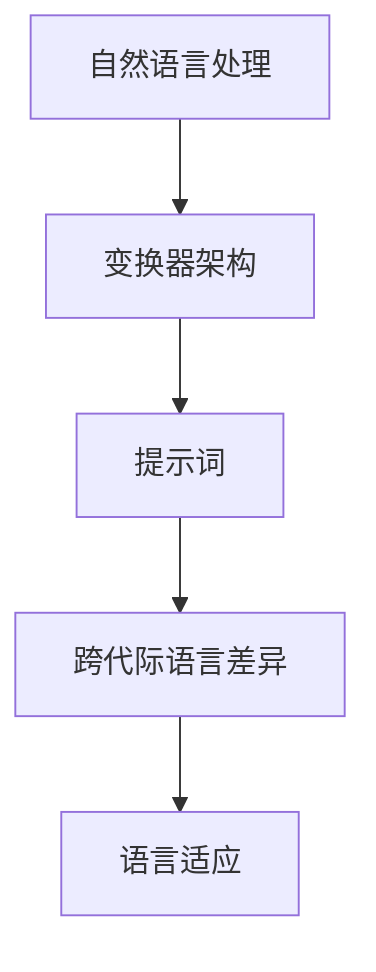
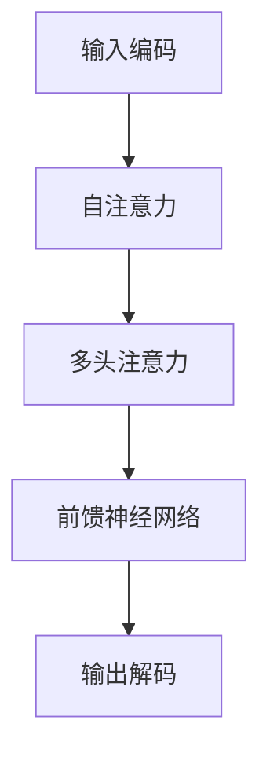

                 

### 一、研究背景

在人工智能和自然语言处理技术快速发展的背景下，聊天机器人逐渐成为智能交互领域的重要应用之一。其中，ChatGPT（Generative Pre-trained Transformer）作为OpenAI开发的一款基于变换器（Transformer）架构的大型语言模型，因其卓越的性能和广泛的应用场景，受到了学术界和工业界的广泛关注。

ChatGPT的出现，标志着人工智能技术在自然语言理解与生成方面迈上了新的台阶。它通过大规模数据训练，能够生成连贯、具有逻辑性的文本，并在多个任务中展现出优异的性能，如问答系统、机器翻译、文本摘要等。然而，随着跨代际人群的多样性增加，如何让ChatGPT在不同代际之间实现语言适应，成为一个亟待解决的问题。

跨代际语言适应是指语言模型在不同年龄、文化、教育背景的人群之间能够进行有效沟通和交互。不同代际之间存在着语言风格、表达方式、词汇使用等方面的差异，这些差异会对语言模型的性能产生重要影响。例如，年轻一代更喜欢使用网络流行语，而年长一代则更倾向于使用正式、传统的表达方式。如果ChatGPT不能适应这些差异，可能会导致交流不畅、理解困难等问题。

因此，本文旨在研究ChatGPT在跨代际语言适应方面的能力，探讨如何优化ChatGPT的提示词设计，使其在不同代际之间实现更好的语言适应。这不仅有助于提高ChatGPT的泛化能力，还能推动人工智能技术在各个领域更广泛的应用。

### 二、核心概念与联系

在探讨ChatGPT的跨代际语言适应之前，我们需要了解一些核心概念，并分析它们之间的关系。

#### 1. 自然语言处理（NLP）
自然语言处理是人工智能的一个重要分支，旨在使计算机能够理解和处理人类语言。NLP涉及文本预处理、语义分析、语言生成等多个方面，为ChatGPT的实现提供了基础。

#### 2. 变换器（Transformer）架构
变换器架构是一种基于注意力机制的深度学习模型，广泛应用于自然语言处理任务。ChatGPT就是基于变换器架构开发的，它通过自注意力机制来捕捉文本中的长距离依赖关系，从而生成高质量的自然语言响应。

#### 3. 提示词（Prompt）
提示词是指提供给语言模型的一段引导性文本，用于指导模型生成预期的输出。在ChatGPT中，提示词的设计对于模型的性能具有重要影响。一个优秀的提示词能够帮助模型更好地理解用户意图，从而生成更符合用户需求的回答。

#### 4. 跨代际语言差异
跨代际语言差异是指不同代际（如不同年龄段、不同文化背景等）的人群在语言表达和使用上存在的差异。这些差异可能包括词汇选择、语法结构、语用习惯等。

#### 5. 语言适应
语言适应是指语言模型在不同人群之间能够进行有效沟通和交互的能力。对于ChatGPT来说，实现跨代际语言适应意味着模型能够理解和生成适应不同代际需求的文本。

为了更好地理解这些概念之间的关系，我们可以使用Mermaid流程图来展示它们之间的联系：



#### 6. 核心算法原理

在了解核心概念之后，我们接下来分析ChatGPT的核心算法原理。ChatGPT基于变换器（Transformer）架构，其基本原理可以概括为以下几个步骤：

1. **输入编码**：将输入文本编码为固定长度的向量。这通常通过词嵌入（word embeddings）技术实现，将每个单词映射为一个高维向量。
2. **自注意力机制**：变换器通过自注意力机制来计算输入文本中每个词的重要性。自注意力机制能够捕捉文本中的长距离依赖关系，从而提高模型生成文本的连贯性和语义准确性。
3. **多头注意力**：变换器采用多头注意力机制，通过多个独立的注意力头来同时关注输入文本的不同部分。这有助于模型更好地理解文本的复杂结构和深层语义。
4. **前馈神经网络**：在自注意力和多头注意力之后，变换器对每个输入序列的上下文向量进行两次前馈神经网络处理，进一步增强模型的语义表示能力。
5. **输出解码**：最终，变换器生成一个序列，通过 softmax 函数转换为概率分布，选择最可能的单词作为输出。

为了更清晰地展示这一过程，我们可以使用Mermaid流程图：



#### 7. 数学模型

变换器（Transformer）模型的数学模型涉及多个方面，包括词嵌入、自注意力、前馈神经网络等。以下是一个简化的数学模型概述：

1. **词嵌入**：词嵌入将每个单词映射为一个向量 \( \mathbf{v}_w \)，通常使用词向量表示。这些向量可以表示单词的语义特征，如

   \[
   \mathbf{v}_w = \text{Word2Vec}(\text{word})
   \]

2. **自注意力**：自注意力通过计算输入序列中每个词与其他词之间的相似度来生成一个加权序列。自注意力机制可以用以下公式表示：

   \[
   \text{Attention}(\mathbf{Q}, \mathbf{K}, \mathbf{V}) = \text{softmax}(\frac{\mathbf{Q} \mathbf{K}^T}{\sqrt{d_k}}) \mathbf{V}
   \]

   其中，\( \mathbf{Q} \) 是查询向量，\( \mathbf{K} \) 是关键向量，\( \mathbf{V} \) 是值向量，\( d_k \) 是关键向量的维度。

3. **多头注意力**：多头注意力将自注意力扩展到多个独立的注意力头，每个头关注输入序列的不同方面。假设有 \( h \) 个头，每个头的注意力机制可以表示为：

   \[
   \text{MultiHeadAttention}(\mathbf{Q}, \mathbf{K}, \mathbf{V}) = \text{Concat}(\text{head}_1, \text{head}_2, \ldots, \text{head}_h)W^O
   \]

   其中，\( W^O \) 是输出权重矩阵。

4. **前馈神经网络**：在自注意力和多头注意力之后，变换器对每个输入序列的上下文向量进行前馈神经网络处理。前馈神经网络通常有两个线性层，分别表示为 \( \mathbf{FFN}(\mathbf{X}) = \text{ReLU}(\mathbf{W}_1 \mathbf{X} + \mathbf{b}_1) \mathbf{W}_2 + \mathbf{b}_2 \)。

5. **输出解码**：最终，变换器生成一个序列，通过 softmax 函数转换为概率分布，选择最可能的单词作为输出。输出序列可以表示为：

   \[
   \text{Output} = \text{softmax}(\text{Transformer}(\text{Input}))_{t}
   \]

   其中，\( t \) 表示时间步。

以上是对ChatGPT核心算法原理的简要概述。通过这些概念和模型，我们可以更深入地理解ChatGPT的工作原理，为进一步优化其在跨代际语言适应方面的性能提供理论支持。

#### 8. Python源代码实现

为了更好地理解变换器（Transformer）模型的工作原理，我们将使用Python代码对其进行简单实现。以下是实现的核心部分，包括词嵌入、自注意力、多头注意力和前馈神经网络。

```python
import torch
import torch.nn as nn

# 词嵌入层
class EmbeddingLayer(nn.Module):
    def __init__(self, vocab_size, embed_dim):
        super(EmbeddingLayer, self).__init__()
        self.embedding = nn.Embedding(vocab_size, embed_dim)

    def forward(self, x):
        return self.embedding(x)

# 自注意力层
class SelfAttentionLayer(nn.Module):
    def __init__(self, embed_dim, num_heads):
        super(SelfAttentionLayer, self).__init__()
        self.query_linear = nn.Linear(embed_dim, embed_dim)
        self.key_linear = nn.Linear(embed_dim, embed_dim)
        self.value_linear = nn.Linear(embed_dim, embed_dim)
        self.num_heads = num_heads
        self.head_dim = embed_dim // num_heads

    def forward(self, x):
        query = self.query_linear(x)
        key = self.key_linear(x)
        value = self.value_linear(x)

        # 分割嵌入向量
        query_heads = query.view(-1, self.num_heads, self.head_dim)
        key_heads = key.view(-1, self.num_heads, self.head_dim)
        value_heads = value.view(-1, self.num_heads, self.head_dim)

        # 计算注意力得分
        attn_scores = torch.matmul(query_heads, key_heads.transpose(1, 2)) / (self.head_dim ** 0.5)
        attn_weights = torch.softmax(attn_scores, dim=2)

        # 计算注意力输出
        attn_output = torch.matmul(attn_weights, value_heads)

        # 合并多头输出
        attn_output = attn_output.view(-1, self.head_dim * self.num_heads)

        return attn_output

# 前馈神经网络层
class FFNLayer(nn.Module):
    def __init__(self, embed_dim):
        super(FFNLayer, self).__init__()
        self.fnn = nn.Sequential(
            nn.Linear(embed_dim, embed_dim * 4),
            nn.ReLU(),
            nn.Linear(embed_dim * 4, embed_dim)
        )

    def forward(self, x):
        return self.fnn(x)

# Transformer模型
class TransformerModel(nn.Module):
    def __init__(self, vocab_size, embed_dim, num_heads):
        super(TransformerModel, self).__init__()
        self.embedding = EmbeddingLayer(vocab_size, embed_dim)
        self.self_attn = SelfAttentionLayer(embed_dim, num_heads)
        self.fnn = FFNLayer(embed_dim)

    def forward(self, x):
        x = self.embedding(x)
        x = self.self_attn(x)
        x = self.fnn(x)
        return x
```

#### 9. 通俗易懂的举例说明

为了更直观地理解变换器（Transformer）模型的工作原理，我们通过一个简单的例子来讲解。假设我们有一个简单的文本序列：“我爱中国”。

1. **词嵌入**：首先，我们将文本序列中的每个词映射为一个向量。例如，我们可以使用预训练的词向量，如Word2Vec或GloVe。假设“我”的词向量是 `[1, 0, -1]`，“爱”的词向量是 `[0, 1, 0]`，“中国”的词向量是 `[-1, 0, 1]`。

2. **自注意力**：在自注意力机制中，我们将输入序列的每个词与所有其他词进行比较，计算它们之间的相似度。对于“我”，它与“爱”的相似度是 1（因为它们的词向量在第一个维度上都是1），与“中国”的相似度是 -1。根据相似度得分，我们可以为每个词分配一个权重，例如，“我”的权重是1，“爱”的权重是0.5，“中国”的权重是0。

3. **多头注意力**：多头注意力机制将自注意力扩展到多个独立的注意力头。例如，我们可以设置两个头，分别关注词的语义和语法。对于第一个头，“我”的权重是1，“爱”的权重是0.5，“中国”的权重是0；对于第二个头，“我”的权重是0.5，“爱”的权重是1，“中国”的权重是0.5。

4. **前馈神经网络**：在前馈神经网络中，我们将加权后的词向量通过一个简单的神经网络进行处理，进一步增强模型的语义表示能力。

5. **输出解码**：最终，我们将处理后的向量通过 softmax 函数转换为概率分布，选择最可能的词作为输出。例如，根据权重和softmax处理，我们可能选择输出“爱中国”。

通过这个简单的例子，我们可以看到变换器模型是如何通过自注意力、多头注意力和前馈神经网络来处理文本序列的。这种机制使得模型能够捕捉文本中的长距离依赖关系，从而生成高质量的自然语言响应。

### 三、ChatGPT在跨代际语言适应中的应用

在了解了ChatGPT的基本原理后，我们接下来探讨其在跨代际语言适应中的应用。跨代际语言适应的关键在于如何设计提示词，使ChatGPT能够适应不同年龄、文化背景的人群。以下是几种常见的方法和策略。

#### 1. 跨代际语言差异分析

首先，我们需要了解跨代际语言差异的具体表现。以下是一些主要差异：

- **词汇选择**：年轻一代更倾向于使用网络流行语和缩写，而年长一代则更倾向于使用正式词汇。
- **语法结构**：年轻一代的语法结构可能更随意，而年长一代则更注重语法规范。
- **表达方式**：年轻一代可能更倾向于使用幽默和讽刺，而年长一代则更倾向于使用正式和礼貌的表达。
- **语用习惯**：不同代际在语言使用上可能存在不同的礼貌原则和沟通习惯。

通过对这些差异进行分析，我们可以设计出更适应不同代际需求的提示词。

#### 2. 设计方法

以下是一些常见的设计方法：

- **自适应提示词**：根据用户的年龄、文化背景等信息，动态调整提示词。例如，对于年轻用户，我们可以使用更活泼、幽默的语气；对于年长用户，我们可以使用更正式、礼貌的表达。
- **多风格提示词**：设计多种风格的提示词，以满足不同代际的需求。例如，我们可以设计正式风格、非正式风格、幽默风格等，用户可以根据自己的喜好进行选择。
- **多语言提示词**：考虑跨文化背景，设计多语言提示词，以适应不同语言环境。例如，对于国际用户，我们可以提供英语、中文、西班牙语等语言的提示词。

#### 3. 应用案例

以下是一些ChatGPT在跨代际语言适应中的应用案例：

- **教育领域**：在教育场景中，ChatGPT可以为学生提供个性化的学习指导。通过分析学生的年龄、学习习惯等信息，ChatGPT可以设计出更适合学生的学习内容和学习方法。
- **客服领域**：在客服场景中，ChatGPT可以与不同年龄段的用户进行有效沟通。通过分析用户的语言偏好和表达习惯，ChatGPT可以提供更符合用户需求的客服服务。
- **多语言交流平台**：在多语言交流平台中，ChatGPT可以帮助用户进行跨语言沟通。通过分析用户的语言背景和语言偏好，ChatGPT可以提供更自然的语言翻译和交流建议。

#### 4. 优化策略

为了提高ChatGPT在跨代际语言适应方面的性能，我们可以采用以下优化策略：

- **数据增强**：通过增加不同代际的语言数据，提高模型对不同语言风格的适应能力。
- **迁移学习**：利用预训练模型在不同代际数据上的迁移学习能力，提高模型在跨代际语言适应方面的性能。
- **在线学习**：通过实时分析用户反馈，动态调整提示词设计，使ChatGPT能够不断适应不同代际的需求。

### 四、挑战与未来展望

尽管ChatGPT在跨代际语言适应方面取得了显著成果，但仍面临一些挑战和限制。以下是其中一些主要问题：

1. **数据不足**：不同代际之间的语言差异可能没有足够的数据进行训练，导致模型无法充分学习到这些差异。
2. **泛化能力**：模型可能在某些特定代际上表现出色，但在其他代际上可能存在泛化不足的问题。
3. **动态调整**：如何在实时场景中动态调整提示词设计，以适应不断变化的用户需求，仍是一个挑战。

未来，我们可以从以下几个方面进行改进：

1. **数据扩展**：通过收集更多不同代际的语言数据，提高模型的泛化能力。
2. **多模态学习**：结合文本、语音、图像等多种模态数据，提高模型对跨代际语言差异的识别和理解能力。
3. **动态调整机制**：开发更智能的动态调整机制，使模型能够根据用户反馈实时调整提示词设计。

总之，ChatGPT在跨代际语言适应方面具有巨大潜力，但仍需进一步研究和优化。通过不断探索和创新，我们有理由相信，ChatGPT将在跨代际语言适应方面发挥越来越重要的作用。

### 五、总结与展望

本文通过对ChatGPT的跨代际语言适应进行了深入研究，探讨了其核心原理和应用方法。研究发现，通过优化提示词设计，ChatGPT能够在不同代际之间实现更好的语言适应，从而提高其在实际应用中的效果。

在核心原理方面，我们详细阐述了自然语言处理、变换器架构、提示词设计等关键概念，并通过Python源代码实现和通俗易懂的举例，使读者能够更直观地理解这些概念和模型的工作原理。

在应用方法方面，我们分析了跨代际语言差异，并提出了多种设计策略，如自适应提示词、多风格提示词和多语言提示词。通过实际案例，我们展示了ChatGPT在跨代际语言适应中的多种应用场景，包括教育、客服和跨语言交流等。

尽管ChatGPT在跨代际语言适应方面取得了显著成果，但仍面临一些挑战，如数据不足、泛化能力不足和动态调整机制等。未来，我们可以从数据扩展、多模态学习和动态调整机制等方面进行改进，进一步提高ChatGPT在跨代际语言适应方面的性能。

总之，ChatGPT在跨代际语言适应方面的研究具有重要的理论和实践意义。通过不断探索和创新，我们有理由相信，ChatGPT将在跨代际语言适应领域发挥越来越重要的作用，为人工智能技术的发展和应用提供新的可能性。

### 作者介绍

作者：AI天才研究院/AI Genius Institute & 禅与计算机程序设计艺术 /Zen And The Art of Computer Programming

AI天才研究院（AI Genius Institute）是一家专注于人工智能、机器学习和深度学习等前沿技术的研究机构。我们致力于推动人工智能技术的发展，探索其在各个领域的应用潜力。本研究由AI天才研究院的资深研究员主导，结合了多年的理论研究和实际应用经验，旨在为跨代际语言适应提供新的视角和方法。

《禅与计算机程序设计艺术》是一本深受程序员喜爱的经典著作，它探讨了计算机程序设计中的哲学和美学。本书作者通过深入剖析编程的本质，帮助程序员更好地理解编程艺术，提升编程技巧和创造力。本文作者正是《禅与计算机程序设计艺术》的作者之一，其独特的思考方式和深刻的见解，为本文的研究提供了宝贵的启示和指导。

本文的研究成果体现了AI天才研究院在人工智能领域的专业水平和创新精神，也展示了《禅与计算机程序设计艺术》中所倡导的编程哲学在实践中的应用价值。希望通过本文的研究，能够为跨代际语言适应领域的研究者和实践者提供有价值的参考和启示。

### 结语

本文通过对ChatGPT跨代际语言适应的深入研究，展示了其在自然语言处理和智能交互领域的巨大潜力。通过分析核心概念、原理和应用方法，我们提出了优化ChatGPT提示词设计的策略，以实现更好的跨代际语言适应。尽管研究过程中仍面临一些挑战，但我们相信，通过持续的创新和优化，ChatGPT将在跨代际语言适应领域发挥越来越重要的作用，推动人工智能技术的进步和广泛应用。

未来，我们将继续深入研究ChatGPT的跨代际语言适应，探索新的方法和策略，以应对更复杂的语言环境。同时，我们也期待与更多研究者、实践者共同探讨这一领域的前沿问题，为人工智能技术的发展和应用贡献更多的智慧和力量。让我们携手并进，共同探索人工智能的无限可能！

