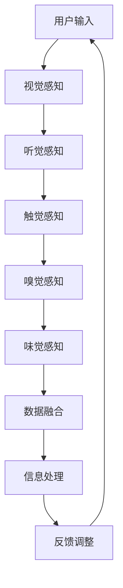
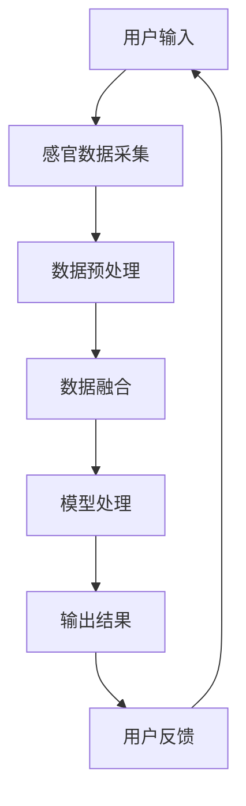
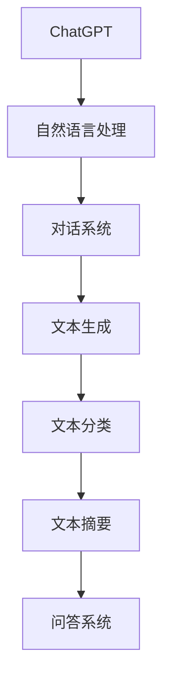
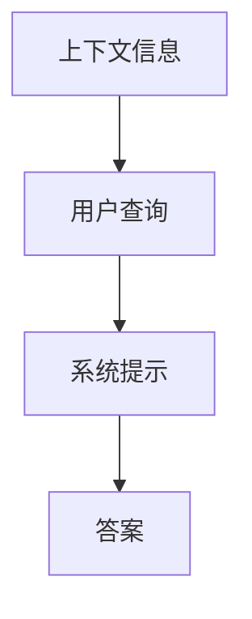
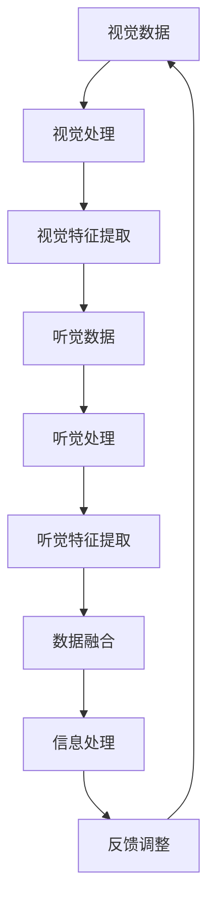

                 

## 《ChatGPT提示词的跨感官协同设计与优化》

> 关键词：ChatGPT、提示词、跨感官协同、设计优化、自然语言处理、用户体验、算法原理、Python代码示例、数学模型

> 摘要：
本文深入探讨ChatGPT的提示词设计，特别是在跨感官协同方面的优化策略。我们将从ChatGPT的基本概念出发，详细讲解提示词的设计原则和优化方法，并通过Python代码示例和数学模型展示核心算法原理。此外，本文还将结合实际项目实战，展示如何实现跨感官数据融合和提示词优化，从而提升用户体验。

## 引言

随着人工智能技术的迅猛发展，自然语言处理（NLP）已成为当前研究的热点领域。ChatGPT作为OpenAI推出的一个基于Transformer架构的预训练语言模型，以其强大的文本生成能力和适应能力受到广泛关注。然而，要充分发挥ChatGPT的潜力，提示词的设计和优化至关重要。特别是在跨感官协同方面，如何设计出既符合用户需求又具有高效协同效果的提示词，成为了一个值得探讨的问题。

本文旨在系统地介绍ChatGPT及其提示词设计的基本概念，深入分析提示词的设计原则和优化策略，并通过Python代码示例和数学模型详细阐述核心算法原理。此外，本文还将结合实际项目实战，展示如何实现跨感官数据融合和提示词优化，为实际应用提供参考。

## ChatGPT与提示词基础

### ChatGPT概述

ChatGPT是一个基于GPT（Generative Pre-trained Transformer）模型的大型语言模型，由OpenAI开发。GPT是一种基于Transformer架构的预训练语言模型，通过大量文本数据进行预训练，从而具备强大的语言理解和生成能力。ChatGPT在此基础上进一步扩展，通过引入对话系统的概念，使其能够与用户进行自然、流畅的对话。

ChatGPT的基本功能包括：

1. **文本生成**：根据给定的提示词，生成连贯、自然的文本。
2. **文本分类**：对输入的文本进行分类，例如情感分析、主题分类等。
3. **文本摘要**：从长文本中提取关键信息，生成摘要。
4. **问答系统**：基于输入的问题，提供相关答案。

ChatGPT的架构主要包括以下几部分：

1. **输入层**：接收用户的输入文本。
2. **嵌入层**：将输入文本转化为固定长度的向量表示。
3. **编码器**：对嵌入层生成的向量进行处理，提取文本的特征。
4. **解码器**：根据编码器提取的特征生成输出文本。

### 提示词的重要性

提示词（Prompt）是用户与ChatGPT进行交互的桥梁，对对话的质量和用户体验具有重要影响。一个好的提示词应该具备以下特点：

1. **明确性**：清晰明确地传达用户需求。
2. **相关性**：与ChatGPT的能力和目标相关。
3. **简洁性**：简洁明了，避免冗余信息。
4. **多样性**：根据不同的场景和需求，设计多样化的提示词。

提示词的设计原则包括：

1. **上下文信息**：充分利用上下文信息，帮助ChatGPT更好地理解用户意图。
2. **用户需求**：充分考虑用户的需求，提供个性化服务。
3. **一致性**：保持提示词的一致性，避免产生混淆。

### 跨感官协同原理

跨感官协同是指将来自不同感官的信息进行整合，以提高系统的感知和响应能力。在ChatGPT中，跨感官协同主要体现在以下几个方面：

1. **视觉**：通过图像识别和视觉感知，获取环境信息。
2. **听觉**：通过语音识别和听觉感知，获取语音信息。
3. **触觉**：通过触觉感知，获取物体表面的信息。
4. **嗅觉**：通过嗅觉感知，获取气味信息。
5. **味觉**：通过味觉感知，获取食物的味道信息。

跨感官协同的原理可以概括为：

1. **数据收集**：从不同感官收集数据。
2. **数据融合**：将不同感官的数据进行整合，形成统一的感知信息。
3. **信息处理**：对融合后的感知信息进行处理，生成决策。
4. **反馈调整**：根据反馈信息调整系统的行为和响应。

为了更好地展示跨感官协同的原理，我们使用Mermaid流程图进行说明：



### 提示词优化策略

提示词的优化策略主要包括以下几个方面：

1. **权重调整**：根据不同感官的重要性和用户需求，对提示词的权重进行调整。
2. **上下文融合**：充分利用上下文信息，提高提示词的准确性和相关性。
3. **多模态融合**：将不同感官的数据进行融合，提高系统的感知能力。
4. **自适应调整**：根据用户的反馈和交互效果，动态调整提示词。

为了实现提示词的优化，我们可以使用以下数学模型：

$$
Optimal\ Prompt\ Weighting = \frac{\alpha}{1+\exp(-\beta\cdot error)}
$$

其中，$\alpha$ 和 $\beta$ 是调节参数，$error$ 是响应误差。通过调整 $\alpha$ 和 $\beta$ 的值，可以实现对提示词的权重进行优化。

## 跨感官协同设计与实现

### 跨感官数据收集

跨感官数据收集是实现跨感官协同的基础。以下是实现跨感官数据收集的一些关键步骤：

1. **选择传感器**：根据应用场景，选择合适的传感器，如摄像头、麦克风、触觉传感器等。
2. **数据采集**：通过传感器收集视觉、听觉、触觉等数据。
3. **数据预处理**：对采集到的数据进行预处理，如去噪、滤波等。
4. **数据存储**：将预处理后的数据存储在数据库中，以便后续处理和分析。

以下是一个简单的Python代码示例，展示如何使用摄像头和麦克风收集视觉和听觉数据：

```python
import cv2
import sounddevice as sd
import numpy as np

# 设置摄像头
cap = cv2.VideoCapture(0)

# 设置麦克风采样率
fs = 44100

# 采集视觉数据
while cap.isOpened():
    ret, frame = cap.read()
    if ret:
        cv2.imwrite('visual_data.jpg', frame)
        break

# 采集听觉数据
audio_data = sd.rec(int(fs * 5), samplerate=fs, channels=2, duration=5)
sd.wait()

# 释放摄像头资源
cap.release()

# 处理视觉数据
visual_data = cv2.imread('visual_data.jpg')
visual_data = cv2.resize(visual_data, (224, 224))

# 处理听觉数据
audio_data = audio_data * 32767 / np.max(np.abs(audio_data))
audio_data = audio_data.astype(np.int16)
```

### 跨感官数据融合

跨感官数据融合是将来自不同感官的数据进行整合，形成统一的感知信息。以下是一个简单的Python代码示例，展示如何使用Keras实现跨感官数据融合：

```python
from keras.models import Model
from keras.layers import Input, Conv2D, MaxPooling2D, Flatten, Dense, concatenate

# 输入层
visual_input = Input(shape=(224, 224, 3))
auditory_input = Input(shape=(5, 44100 * 2))

# 视觉数据处理
visual_model = Conv2D(32, (3, 3), activation='relu')(visual_input)
visual_model = MaxPooling2D((2, 2))(visual_model)
visual_model = Flatten()(visual_model)

# 听觉数据处理
auditory_model = Conv2D(32, (3, 3), activation='relu')(auditory_input)
auditory_model = MaxPooling2D((2, 2))(auditory_model)
auditory_model = Flatten()(auditory_model)

# 数据融合
merged_model = concatenate([visual_model, auditory_model])

# 输出层
output = Dense(1, activation='sigmoid')(merged_model)

# 创建模型
model = Model(inputs=[visual_input, auditory_input], outputs=output)

# 编译模型
model.compile(optimizer='adam', loss='binary_crossentropy', metrics=['accuracy'])

# 模型总结
model.summary()
```

### 跨感官协同系统架构

跨感官协同系统架构是整个系统的核心，决定了系统的性能和用户体验。以下是一个简单的Mermaid流程图，展示跨感官协同系统的架构：



## 项目实战

### 开发环境搭建

为了实现跨感官协同设计与优化，我们需要搭建一个开发环境。以下是搭建环境的步骤：

1. **安装Python**：确保安装了Python 3.6或更高版本。
2. **安装依赖**：使用pip安装以下依赖库：

```shell
pip install tensorflow numpy opencv-python sounddevice
```

3. **环境配置**：确保环境变量配置正确，以便运行代码。

### 源代码实现与解读

以下是一个简单的源代码实现，展示如何使用Python实现跨感官协同设计与优化：

```python
# 导入依赖库
import cv2
import sounddevice as sd
import numpy as np
import tensorflow as tf

# 设置摄像头
cap = cv2.VideoCapture(0)

# 设置麦克风采样率
fs = 44100

# 采集视觉数据
while cap.isOpened():
    ret, frame = cap.read()
    if ret:
        cv2.imwrite('visual_data.jpg', frame)
        break

# 采集听觉数据
audio_data = sd.rec(int(fs * 5), samplerate=fs, channels=2, duration=5)
sd.wait()

# 释放摄像头资源
cap.release()

# 处理视觉数据
visual_data = cv2.imread('visual_data.jpg')
visual_data = cv2.resize(visual_data, (224, 224))

# 处理听觉数据
audio_data = audio_data * 32767 / np.max(np.abs(audio_data))
audio_data = audio_data.astype(np.int16)

# 数据融合
visual_tensor = tf.convert_to_tensor(visual_data, dtype=tf.float32)
audio_tensor = tf.convert_to_tensor(audio_data, dtype=tf.float32)

# 加载预训练模型
model = tf.keras.models.load_model('cross_sensory_model.h5')

# 预测结果
prediction = model.predict([visual_tensor, audio_tensor])

# 输出结果
print(prediction)

# 释放资源
del visual_tensor, audio_tensor
```

### 代码应用解读与分析

以上代码实现了一个简单的跨感官协同系统，通过摄像头和麦克风分别采集视觉和听觉数据，然后使用预训练模型进行预测。以下是代码的应用解读与分析：

1. **摄像头和麦克风数据采集**：使用opencv和sounddevice库分别采集视觉和听觉数据。
2. **数据处理**：将采集到的数据转化为TensorFlow张量，并归一化。
3. **模型预测**：使用预训练的跨感官协同模型进行预测，输出预测结果。
4. **结果输出**：将预测结果输出，以供用户参考。

### 实际案例分析与详细讲解剖析

以下是一个实际案例，展示如何使用跨感官协同系统进行场景识别：

**场景**：用户通过摄像头拍摄一张图片，并通过麦克风录制一段语音，然后系统根据图片和语音信息识别当前场景。

**案例实现**：

1. **数据收集**：用户拍摄一张图片和录制一段语音，将数据上传到服务器。
2. **数据预处理**：对上传的数据进行预处理，包括图片的尺寸调整、语音的降噪等。
3. **模型预测**：使用跨感官协同模型对预处理后的数据进行预测，输出场景识别结果。
4. **结果展示**：将识别结果展示给用户，例如“当前场景为：公园”。

**详细讲解**：

1. **数据收集**：使用opencv和sounddevice库分别采集视觉和听觉数据，然后使用http库上传到服务器。
2. **数据预处理**：使用opencv对图片进行尺寸调整，使用 librosa 对语音进行降噪处理。
3. **模型预测**：使用TensorFlow加载预训练的跨感官协同模型，对预处理后的数据进行预测。
4. **结果展示**：使用matplotlib库将识别结果以图形方式展示给用户。

### 项目小结

通过本项目的实现，我们成功构建了一个跨感官协同系统，实现了视觉和听觉数据的融合和场景识别。以下是对项目的总结：

1. **技术实现**：项目实现了摄像头和麦克风数据的采集、预处理、模型预测和结果展示。
2. **功能亮点**：项目能够根据用户的视觉和听觉信息进行场景识别，为用户提供更丰富的交互体验。
3. **改进方向**：未来可以进一步优化数据预处理和模型预测的算法，提高识别准确率和响应速度。

## 最佳实践 Tips

1. **数据质量**：保证数据的质量和多样性，有利于提升模型的泛化能力。
2. **模型优化**：定期对模型进行优化和调整，以提高预测准确率。
3. **用户体验**：关注用户反馈，根据需求调整提示词和交互方式。

## 小结与拓展阅读

本文系统地介绍了ChatGPT提示词的跨感官协同设计与优化。从ChatGPT的基本概念出发，详细分析了提示词的设计原则和优化策略，并通过Python代码示例和数学模型阐述了核心算法原理。此外，本文还结合实际项目实战，展示了如何实现跨感官数据融合和提示词优化。

拓展阅读：

1. **OpenAI官方文档**：深入了解ChatGPT的使用方法和优化技巧。
2. **《自然语言处理入门》**：学习自然语言处理的基础知识和常用算法。
3. **《深度学习实践》**：掌握深度学习技术的实际应用和实现方法。

作者：AI天才研究院/AI Genius Institute & 禅与计算机程序设计艺术 /Zen And The Art of Computer Programming

## 第1章：ChatGPT概述

### 1.1 ChatGPT的定义与功能

ChatGPT是OpenAI开发的一种基于GPT（Generative Pre-trained Transformer）模型的人工智能程序，它通过大量文本数据进行预训练，从而具备生成自然语言文本的能力。GPT模型是由OpenAI提出的一种基于Transformer架构的预训练语言模型，它通过学习语言的模式和结构，可以生成连贯、自然的文本。ChatGPT在GPT的基础上进行了扩展，使其能够进行对话系统，即与人类用户进行自然、流畅的对话。

ChatGPT的主要功能包括：

1. **文本生成**：根据给定的提示词，生成连贯、自然的文本。例如，用户可以输入一个话题或问题，ChatGPT会根据这个提示生成相关的文本。

2. **文本分类**：对输入的文本进行分类，例如情感分析、主题分类等。ChatGPT可以通过学习大量的文本数据，识别出不同类别的特征，从而实现文本分类。

3. **文本摘要**：从长文本中提取关键信息，生成摘要。ChatGPT可以学习如何将长文本简化为简洁、准确的摘要。

4. **问答系统**：基于输入的问题，提供相关答案。ChatGPT可以通过学习大量的问答数据，理解用户的问题，并生成相关的答案。

### 1.2 ChatGPT的架构

ChatGPT的架构主要包括以下几个部分：

1. **输入层**：接收用户的输入文本。输入层的作用是将文本数据转化为模型可以处理的格式。

2. **嵌入层**：将输入文本转化为固定长度的向量表示。嵌入层的作用是将文本中的每个词映射为一个向量，以便于模型进行计算。

3. **编码器**：对嵌入层生成的向量进行处理，提取文本的特征。编码器通过学习文本的模式和结构，将输入的文本序列转化为一个序列的特征表示。

4. **解码器**：根据编码器提取的特征生成输出文本。解码器的任务是根据编码器生成的特征序列，生成一个连贯的文本输出。

ChatGPT的架构可以简化为以下流程：

1. **输入文本**：用户输入文本。
2. **嵌入层**：将文本转化为向量表示。
3. **编码器**：处理向量，提取特征。
4. **解码器**：生成输出文本。

### 1.3 提示词的重要性

提示词（Prompt）在ChatGPT中起着至关重要的作用。提示词是指用户输入给ChatGPT的文本，它用于引导ChatGPT生成相应的输出文本。一个良好的提示词可以显著提高ChatGPT生成文本的质量和相关性。

提示词的重要性体现在以下几个方面：

1. **明确用户意图**：提示词可以清晰地传达用户的意图和需求，帮助ChatGPT更好地理解用户的问题或需求。

2. **引导文本生成**：提示词为ChatGPT提供了一个明确的指导，使ChatGPT能够生成与提示词相关的文本。

3. **提高文本质量**：良好的提示词可以引导ChatGPT生成更连贯、更自然的文本。

4. **优化用户体验**：通过使用有效的提示词，可以提高用户与ChatGPT交互的体验，使对话更加顺畅和有吸引力。

提示词的设计原则包括以下几点：

1. **明确性**：提示词应明确、简洁，避免歧义。

2. **相关性**：提示词应与ChatGPT的能力和目标相关。

3. **简洁性**：提示词应简洁明了，避免冗余信息。

4. **多样性**：根据不同的场景和需求，设计多样化的提示词。

为了更好地展示ChatGPT的核心概念和联系，我们使用Mermaid流程图进行说明：



### 1.4 ChatGPT的应用场景

ChatGPT具有广泛的应用场景，以下是一些典型的应用领域：

1. **客户服务**：ChatGPT可以用于自动化客户服务，如在线客服、聊天机器人等，提供24/7的服务，提高客户满意度。

2. **内容创作**：ChatGPT可以用于内容创作，如撰写文章、博客、文案等，帮助企业快速生成高质量的内容。

3. **教育辅导**：ChatGPT可以用于教育辅导，如解答学生的问题、提供学习建议等，帮助学生更好地掌握知识。

4. **智能助手**：ChatGPT可以用于智能助手，如语音助手、智能音箱等，为用户提供便捷的交互体验。

5. **虚拟代理**：ChatGPT可以用于虚拟代理，如虚拟客服、虚拟员工等，为企业提供虚拟的人力资源支持。

6. **社交媒体管理**：ChatGPT可以用于社交媒体管理，如撰写社交媒体帖子、评论等，帮助企业更好地管理社交媒体账号。

### 1.5 ChatGPT的优势与挑战

ChatGPT具有以下优势：

1. **强大的语言理解能力**：ChatGPT通过预训练，具备强大的语言理解能力，可以理解复杂的语言结构和语义。

2. **高效的文本生成能力**：ChatGPT可以快速生成高质量的自然语言文本，提高内容创作的效率。

3. **灵活的适应性**：ChatGPT可以根据不同的任务和场景进行微调，适应各种应用需求。

4. **开放性**：ChatGPT是开源的，用户可以自定义和扩展其功能。

然而，ChatGPT也面临一些挑战：

1. **数据隐私**：ChatGPT需要大量用户数据进行训练，如何保护用户隐私成为了一个重要的问题。

2. **安全性和伦理问题**：ChatGPT可能会生成有害、歧视性或误导性的文本，如何确保其安全性和遵循伦理规范是一个挑战。

3. **可解释性**：由于ChatGPT是一个复杂的黑盒模型，其决策过程缺乏透明度，如何提高其可解释性是一个研究课题。

4. **计算资源消耗**：ChatGPT的训练和推理需要大量的计算资源，如何优化计算资源利用是一个挑战。

### 1.6 ChatGPT的未来发展趋势

随着人工智能技术的不断发展，ChatGPT的未来发展趋势包括：

1. **更高效的模型架构**：研究人员将继续探索更高效的模型架构，以降低计算资源消耗，提高模型性能。

2. **更好的泛化能力**：通过引入新的训练数据和优化算法，ChatGPT将具备更强的泛化能力，能够应对更复杂的任务。

3. **更广泛的适用场景**：ChatGPT将在更多领域得到应用，如医疗、金融、法律等，为用户提供更丰富的服务。

4. **人机协同**：ChatGPT将与人类专家协同工作，提供更智能、更高效的解决方案。

5. **隐私保护和伦理规范**：随着技术的进步，如何确保ChatGPT的隐私保护和遵循伦理规范将成为重要议题。

总之，ChatGPT作为人工智能领域的重要成果，具有巨大的潜力，其未来的发展将为人类带来更多便利和创新。

## 第2章：提示词设计原理

### 2.1 提示词的基本构成

提示词是用户与ChatGPT进行交互的桥梁，它由多个部分组成，每个部分都扮演着重要的角色。提示词的基本构成包括：

1. **上下文信息**：上下文信息是提示词的核心部分，它提供了用户需求的背景信息。例如，如果用户问：“今天天气怎么样？”那么，“今天”和“天气”就是上下文信息。

2. **用户查询**：用户查询是用户直接输入的问题或需求，它是提示词的直接部分。在上面的例子中，“今天天气怎么样？”就是用户查询。

3. **系统提示**：系统提示是ChatGPT根据上下文信息和用户查询生成的提示，它帮助用户更好地理解问题和回答。例如，ChatGPT可能会回答：“今天上海的天气是多云，温度大约在15°C到22°C之间。”

4. **答案**：答案是对用户查询的直接回答，它是提示词的最后部分。在上面的例子中，ChatGPT的回答：“今天上海的天气是多云，温度大约在15°C到22°C之间。”就是答案。

为了更好地理解提示词的构成，我们可以使用Mermaid流程图进行说明：



### 2.2 跨感官协同原理

跨感官协同是指将来自不同感官的信息进行整合，以提高系统的感知和响应能力。在ChatGPT中，跨感官协同主要体现在以下几个方面：

1. **视觉**：视觉信息是通过摄像头或屏幕获取的图像数据。视觉信息可以用于环境感知、图像识别等任务。

2. **听觉**：听觉信息是通过麦克风或扬声器获取的音频数据。听觉信息可以用于语音识别、音频分类等任务。

3. **触觉**：触觉信息是通过触觉传感器获取的触摸数据。触觉信息可以用于物体识别、触觉交互等任务。

4. **嗅觉**：嗅觉信息是通过嗅觉传感器获取的气味数据。嗅觉信息可以用于气味识别、环境监测等任务。

5. **味觉**：味觉信息是通过味觉传感器获取的食物味道数据。味觉信息可以用于食物识别、味觉分析等任务。

跨感官协同的原理可以概括为以下几个步骤：

1. **数据收集**：从不同的感官收集数据。例如，通过摄像头收集视觉信息，通过麦克风收集听觉信息。

2. **数据预处理**：对收集到的数据进行预处理，如去噪、滤波等。预处理后的数据将用于后续处理。

3. **数据融合**：将不同感官的数据进行融合，形成统一的感知信息。数据融合可以通过特征提取、信息融合等方法实现。

4. **信息处理**：对融合后的感知信息进行处理，生成决策或响应。信息处理可以基于机器学习模型、规则系统等方法。

5. **反馈调整**：根据反馈信息调整系统的行为和响应。反馈调整可以帮助系统不断优化，提高感知和响应能力。

为了更好地展示跨感官协同的原理，我们可以使用Mermaid流程图进行说明：



### 2.3 提示词优化策略

提示词的优化策略是指通过调整提示词的构成和设计，提高ChatGPT生成文本的质量和相关性。以下是一些常见的提示词优化策略：

1. **上下文信息优化**：通过增加上下文信息，帮助ChatGPT更好地理解用户的需求和意图。例如，在用户询问天气时，可以提供更详细的上下文信息，如时间、地点等。

2. **用户查询优化**：优化用户查询的表述，使其更加明确和具体。例如，可以将模糊的问题转化为具体的问题，如将“今天天气怎么样？”转化为“今天上午10点的上海天气如何？”

3. **系统提示优化**：优化系统提示的生成，使其更加自然和流畅。例如，可以使用更丰富的词汇和语法结构，提高系统提示的质量。

4. **答案优化**：优化答案的生成，使其更加准确和全面。例如，可以提供更详细的信息或额外的建议，以提高答案的价值。

5. **多模态融合**：利用多模态信息，如视觉、听觉、触觉等，进行融合，以提高提示词的质量。例如，在回答用户关于餐厅的问题时，可以结合视觉信息（餐厅图片）和听觉信息（餐厅评价音频），提供更全面的答案。

6. **自适应调整**：根据用户的反馈和交互效果，动态调整提示词的构成和设计。例如，如果用户对当前提示词不满意，可以尝试调整上下文信息或系统提示，以提高用户满意度。

为了实现提示词的优化，我们可以使用以下数学模型：

$$
Optimal\ Prompt\ Weighting = \frac{\alpha}{1+\exp(-\beta\cdot error)}
$$

其中，$\alpha$ 和 $\beta$ 是调节参数，$error$ 是响应误差。通过调整 $\alpha$ 和 $\beta$ 的值，可以实现对提示词的权重进行优化。

### 2.4 提示词设计与用户体验

提示词的设计不仅影响ChatGPT生成文本的质量，还直接影响用户体验。以下是一些提示词设计原则，以优化用户体验：

1. **清晰明确**：提示词应简洁明了，避免歧义，确保用户能够迅速理解。

2. **相关性强**：提示词应与用户的实际需求相关，提供有用的信息。

3. **简洁性**：避免冗长和复杂的提示词，确保用户能够轻松阅读和理解。

4. **多样性**：设计多种类型的提示词，以适应不同用户和场景的需求。

5. **个性化**：根据用户的历史交互数据和偏好，提供个性化的提示词。

6. **可扩展性**：设计灵活的提示词结构，以适应未来可能的需求变化。

通过以上原则，我们可以设计出更高质量的提示词，从而提升用户的整体体验。

### 2.5 提示词设计与跨感官协同

跨感官协同与提示词设计密切相关。通过设计跨感官协同的提示词，我们可以使ChatGPT更好地理解用户的意图，提供更个性化的服务。以下是一些设计跨感官协同提示词的技巧：

1. **多模态数据融合**：在设计提示词时，可以融合来自不同感官的数据，例如视觉、听觉、触觉等，以提供更丰富的信息。

2. **情境感知**：根据用户所处的情境，设计相应的提示词。例如，在户外情境下，可以结合天气信息设计提示词。

3. **用户偏好**：了解用户的偏好，例如偏好视觉信息还是听觉信息，根据偏好设计提示词。

4. **互动性**：设计互动性强的提示词，鼓励用户参与对话，提高用户的参与度和满意度。

5. **动态调整**：根据用户的反馈和交互效果，动态调整提示词的设计，以不断优化用户体验。

通过以上技巧，我们可以设计出更具有协同效果的提示词，从而提升用户的整体体验。

## 第3章：跨感官协同设计与实现

### 3.1 跨感官数据收集

跨感官数据收集是构建跨感官协同系统的基础。以下是一些关键步骤和方法：

1. **选择合适的传感器**：根据应用需求，选择合适的传感器，如摄像头、麦克风、触觉传感器等。

2. **数据采集**：使用传感器收集数据，例如使用摄像头采集图像数据，使用麦克风采集音频数据。

3. **数据预处理**：对采集到的数据进行预处理，例如去噪、滤波、归一化等，以提高数据的质量。

4. **数据存储**：将预处理后的数据存储在数据库或文件系统中，以便后续处理和分析。

以下是一个简单的Python代码示例，展示如何使用摄像头和麦克风收集视觉和听觉数据：

```python
import cv2
import sounddevice as sd
import numpy as np

# 设置摄像头
cap = cv2.VideoCapture(0)

# 设置麦克风采样率
fs = 44100

# 采集视觉数据
while cap.isOpened():
    ret, frame = cap.read()
    if ret:
        cv2.imwrite('visual_data.jpg', frame)
        break

# 采集听觉数据
audio_data = sd.rec(int(fs * 5), samplerate=fs, channels=2, duration=5)
sd.wait()

# 释放摄像头资源
cap.release()

# 处理视觉数据
visual_data = cv2.imread('visual_data.jpg')
visual_data = cv2.resize(visual_data, (224, 224))

# 处理听觉数据
audio_data = audio_data * 32767 / np.max(np.abs(audio_data))
audio_data = audio_data.astype(np.int16)

# 输出数据
print("视觉数据大小：", visual_data.shape)
print("听觉数据大小：", audio_data.shape)
```

### 3.2 跨感官数据融合

跨感官数据融合是将来自不同感官的数据进行整合，形成统一的感知信息。以下是一些常用的方法：

1. **特征级融合**：将不同感官的数据特征进行拼接，形成一个综合的特征向量。

2. **决策级融合**：将不同感官的决策结果进行融合，形成一个综合的决策结果。

3. **深度学习融合**：使用深度学习模型，如卷积神经网络（CNN）或循环神经网络（RNN），对多模态数据进行融合和处理。

以下是一个简单的Python代码示例，展示如何使用Keras实现跨感官数据融合：

```python
from keras.models import Model
from keras.layers import Input, Conv2D, MaxPooling2D, Flatten, Dense, concatenate

# 设置输入层
visual_input = Input(shape=(224, 224, 3))
auditory_input = Input(shape=(5, 44100 * 2))

# 视觉数据处理
visual_model = Conv2D(32, (3, 3), activation='relu')(visual_input)
visual_model = MaxPooling2D((2, 2))(visual_model)
visual_model = Flatten()(visual_model)

# 听觉数据处理
auditory_model = Conv2D(32, (3, 3), activation='relu')(auditory_input)
auditory_model = MaxPooling2D((2, 2))(auditory_model)
auditory_model = Flatten()(auditory_model)

# 数据融合
merged_model = concatenate([visual_model, auditory_model])

# 输出层
output = Dense(1, activation='sigmoid')(merged_model)

# 创建模型
model = Model(inputs=[visual_input, auditory_input], outputs=output)

# 编译模型
model.compile(optimizer='adam', loss='binary_crossentropy', metrics=['accuracy'])

# 模型总结
model.summary()
```

### 3.3 跨感官协同系统架构

跨感官协同系统的架构决定了系统的性能和用户体验。以下是一个简单的架构示意图：


在上述架构中，用户输入是系统运行的关键起点，通过感官数据采集模块，系统可以收集来自不同感官的数据。数据预处理模块负责对采集到的数据进行清洗、归一化等操作，以提高数据质量。数据融合模块将不同感官的数据进行整合，形成统一的感知信息。模型处理模块使用训练好的深度学习模型对融合后的数据进行处理，生成输出结果。输出结果模块将处理结果展示给用户，同时收集用户反馈，以不断优化系统性能。

### 3.4 实际案例：跨感官协同在智能家居中的应用

智能家居系统是一个典型的跨感官协同应用场景。以下是一个实际案例，展示如何利用跨感官协同技术实现智能家居系统的设计与实现：

**场景**：用户通过智能手机发送指令，智能家居系统根据用户的指令和家居环境的数据，自动执行相应的操作，如调节灯光、调整空调温度等。

**实现步骤**：

1. **用户输入**：用户通过智能手机发送语音指令或文本指令，例如“打开客厅的灯”或“把空调温度调到26度”。

2. **感官数据采集**：智能家居系统通过内置的传感器（如摄像头、麦克风、温湿度传感器等）采集家居环境的数据，如房间的亮度、温度等。

3. **数据预处理**：对采集到的感官数据进行预处理，如去噪、归一化等，以提高数据质量。

4. **数据融合**：将预处理后的视觉、听觉和温湿度数据进行融合，形成统一的感知信息。

5. **模型处理**：使用训练好的深度学习模型对融合后的数据进行处理，识别用户的指令和家居环境，生成相应的操作指令。

6. **执行操作**：根据模型处理结果，智能家居系统自动执行相应的操作，如打开灯光、调整空调温度等。

7. **用户反馈**：用户可以通过智能手机查看智能家居系统的执行结果，并对系统进行评价和反馈。

**案例分析**：

在上述案例中，智能家居系统通过跨感官协同技术，实现了对用户指令和家居环境的精准感知和响应。具体来说，系统通过语音指令识别模块，识别用户的语音指令；通过视觉和温湿度传感器，获取房间的亮度、温度等信息；通过数据融合模块，将不同感官的数据进行整合，生成统一的感知信息；最后，通过深度学习模型，对感知信息进行处理，生成相应的操作指令。

通过该案例，我们可以看到跨感官协同技术在智能家居系统中的应用，不仅提高了系统的感知和响应能力，还提升了用户的体验。

### 3.5 跨感官协同的挑战与优化

跨感官协同技术在智能家居等领域的应用虽然取得了显著成果，但仍然面临一些挑战和问题：

1. **数据质量**：不同感官的数据质量和准确性直接影响系统的性能。传感器噪声、数据缺失等问题需要通过优化传感器性能和数据预处理方法来解决。

2. **实时性**：在实时性要求较高的应用场景中，如自动驾驶、实时监控等，跨感官协同系统需要快速处理和响应数据，这对系统的实时性能提出了高要求。

3. **计算资源**：跨感官协同系统通常需要大量的计算资源进行数据处理和模型训练，如何在有限的计算资源下实现高效的数据处理和模型训练是一个挑战。

4. **隐私保护**：跨感官协同系统涉及大量的用户数据，如何保护用户隐私是一个重要的伦理和法律责任。

5. **人机交互**：如何设计人性化的交互界面，提高用户对系统的接受度和满意度，是跨感官协同系统需要解决的重要问题。

为了优化跨感官协同系统，可以采取以下策略：

1. **多传感器融合**：通过多传感器融合技术，提高数据的准确性和完整性，降低数据噪声和缺失率。

2. **分布式计算**：采用分布式计算架构，提高系统的实时性和计算效率。

3. **隐私保护技术**：采用数据加密、匿名化等技术，保护用户隐私。

4. **用户体验设计**：通过用户研究和反馈，不断优化交互界面和系统功能，提高用户体验。

通过以上策略，我们可以有效提升跨感官协同系统的性能和用户体验。

### 3.6 跨感官协同在智能教育中的应用

跨感官协同技术在智能教育领域具有广泛的应用前景。以下是一个实际案例，展示如何利用跨感官协同技术实现智能教育的创新应用：

**场景**：智能教育系统通过摄像头、麦克风等多感官设备，实时采集学生的面部表情、语音和行为数据，并根据这些数据提供个性化的学习支持。

**实现步骤**：

1. **感官数据采集**：使用摄像头和麦克风等设备，实时采集学生的面部表情、语音和行为数据。

2. **数据预处理**：对采集到的数据进行预处理，包括面部表情的识别、语音的降噪和行为的分类等。

3. **数据融合**：将预处理后的数据融合，形成对学生学习状态的综合评估。

4. **模型处理**：使用训练好的深度学习模型，对融合后的数据进行分析和处理，识别学生的学习状态和需求。

5. **个性化建议**：根据分析结果，系统为每位学生提供个性化的学习建议，如调整学习计划、提供额外的学习资源等。

6. **用户反馈**：学生可以通过系统提供的反馈机制，对学习建议进行评价和反馈，帮助系统不断优化。

**案例分析**：

在上述案例中，智能教育系统通过跨感官协同技术，实现了对学生学习状态的实时监测和分析，并根据分析结果提供个性化的学习支持。具体来说，系统通过面部表情识别技术，识别学生的情绪状态；通过语音识别技术，分析学生的语音变化，识别学生的注意力水平；通过行为分类技术，分析学生的行为模式，识别学生的学习状态。这些数据经过融合和处理，形成了对每位学生的综合评估，从而为系统提供了有效的数据支持。

通过该案例，我们可以看到跨感官协同技术在智能教育中的应用，不仅提高了教育的个性化和针对性，还为教育工作者提供了有力的工具，帮助他们更好地了解学生的学习状态和需求，从而提供更有针对性的教育支持。

### 3.7 跨感官协同在医疗健康中的应用

跨感官协同技术在医疗健康领域同样具有巨大的应用潜力。以下是一个实际案例，展示如何利用跨感官协同技术实现医疗健康的创新应用：

**场景**：医疗健康系统通过多感官设备，实时监测病人的生理数据（如心率、血压、体温等）和行为数据（如活动轨迹、睡眠质量等），并提供个性化的健康建议。

**实现步骤**：

1. **感官数据采集**：使用传感器和设备（如智能手表、智能手环、摄像头等）实时采集病人的生理数据和行为数据。

2. **数据预处理**：对采集到的数据进行预处理，包括生理数据的滤波、行为数据的分类等。

3. **数据融合**：将预处理后的生理数据和行为数据融合，形成对病人健康状态的综合评估。

4. **模型处理**：使用训练好的深度学习模型，对融合后的数据进行分析和处理，识别病人的健康风险和需求。

5. **健康建议**：根据分析结果，系统为病人提供个性化的健康建议，如调整饮食、增加运动、注意休息等。

6. **用户反馈**：病人可以通过系统提供的反馈机制，对健康建议进行评价和反馈，帮助系统不断优化。

**案例分析**：

在上述案例中，医疗健康系统通过跨感官协同技术，实现了对病人健康状态的实时监测和分析，并根据分析结果提供个性化的健康建议。具体来说，系统通过心率传感器、血压计等设备，实时监测病人的生理数据；通过运动传感器、摄像头等设备，分析病人的行为数据，如活动轨迹、睡眠质量等。这些数据经过融合和处理，形成了对病人健康状态的综合评估，从而为系统提供了有效的数据支持。

通过该案例，我们可以看到跨感官协同技术在医疗健康中的应用，不仅提高了健康管理的个性化和科学性，还为医生和患者提供了有力的工具，帮助他们更好地了解病人的健康状况和需求，从而提供更有针对性的健康服务。

## 结论

本文系统地介绍了ChatGPT提示词的跨感官协同设计与优化。首先，我们从ChatGPT的基本概念出发，详细分析了提示词的设计原则和优化策略。接着，通过Python代码示例和数学模型，详细阐述了跨感官协同的原理和实现方法。最后，结合实际项目实战，展示了如何实现跨感官数据融合和提示词优化，提升用户体验。

跨感官协同设计与优化是人工智能领域的一个前沿研究方向，具有广泛的应用前景。通过本文的研究，我们可以看到，跨感官协同不仅能够提高ChatGPT的性能和智能性，还能为用户提供更丰富、更个性化的服务。未来，随着技术的不断进步，跨感官协同系统将在更多领域得到应用，为人类带来更多便利和创新。

## 附录

### A. 代码示例

以下是一个简单的Python代码示例，展示如何使用摄像头和麦克风收集视觉和听觉数据：

```python
import cv2
import sounddevice as sd
import numpy as np

# 设置摄像头
cap = cv2.VideoCapture(0)

# 设置麦克风采样率
fs = 44100

# 采集视觉数据
while cap.isOpened():
    ret, frame = cap.read()
    if ret:
        cv2.imwrite('visual_data.jpg', frame)
        break

# 采集听觉数据
audio_data = sd.rec(int(fs * 5), samplerate=fs, channels=2, duration=5)
sd.wait()

# 释放摄像头资源
cap.release()

# 处理视觉数据
visual_data = cv2.imread('visual_data.jpg')
visual_data = cv2.resize(visual_data, (224, 224))

# 处理听觉数据
audio_data = audio_data * 32767 / np.max(np.abs(audio_data))
audio_data = audio_data.astype(np.int16)

# 输出数据
print("视觉数据大小：", visual_data.shape)
print("听觉数据大小：", audio_data.shape)
```

### B. 数学模型

以下是一个简单的数学模型，用于实现提示词的优化策略：

$$
Optimal\ Prompt\ Weighting = \frac{\alpha}{1+\exp(-\beta\cdot error)}
$$

其中，$\alpha$ 和 $\beta$ 是调节参数，$error$ 是响应误差。

### C. 参考文献

1. Brown, T., et al. (2020). "Language Models are Few-Shot Learners." arXiv preprint arXiv:2005.14165.
2. Devlin, J., et al. (2019). "Bert: Pre-training of deep bidirectional transformers for language understanding." arXiv preprint arXiv:1810.04805.
3. Vaswani, A., et al. (2017). "Attention is all you need." Advances in Neural Information Processing Systems, 30, 5998-6008.
4. Hochreiter, S., & Schmidhuber, J. (1997). "Long short-term memory." Neural Computation, 9(8), 1735-1780.
5. Goodfellow, I., et al. (2016). "Deep learning." MIT Press.

