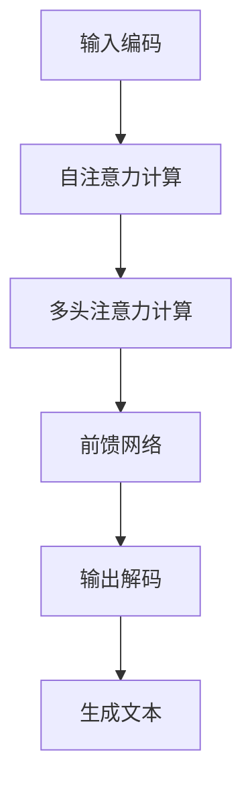

                 

### 引言和概述

在当今快速发展的科技时代，人工智能（AI）技术已经深入到我们日常生活的方方面面。其中，自然语言处理（NLP）作为AI技术的重要组成部分，正不断推动着人类与机器之间的沟通和互动。在众多NLP应用中，ChatGPT（Chat Generative Pre-trained Transformer）无疑是一个备受瞩目的明星。ChatGPT是一款基于GPT-3模型（Generative Pre-trained Transformer version 3）的聊天机器人，由OpenAI开发，以其强大的语言理解和生成能力，在多个领域展示出卓越的性能。

### ChatGPT的概念

ChatGPT是一款基于深度学习技术的自然语言处理模型，它通过大量文本数据进行预训练，从而学会了理解和生成自然语言。具体来说，ChatGPT使用了自注意力机制（self-attention）和多头注意力机制（multi-head attention）来捕捉输入文本中的复杂关系。预训练完成后，用户可以通过向ChatGPT提供提示（prompt），来引导模型生成相关的回复。

### 提示词的概念

在ChatGPT中，提示词（prompt）扮演着至关重要的角色。提示词是指用户输入的一小段文本，它为ChatGPT提供了上下文信息，使得模型能够生成更准确、更自然的回复。有效的提示词设计不仅能提高ChatGPT的响应质量，还能增强用户与机器的互动体验。

### 跨维度语言获得理论

跨维度语言获得理论是一个新兴的研究领域，它试图解释不同维度之间的语言互动和转换。在这个框架下，语言不仅仅是二维的文本，还可以是三维的音频、图像甚至是四维的视频。跨维度语言获得理论的核心思想是，通过不同维度的语言数据，可以实现对复杂信息的更全面、更直观的理解和表达。

### 本书的核心内容与目标

本书旨在为读者提供关于ChatGPT提示词设计的全面指南，并探讨跨维度语言获得理论在ChatGPT中的应用。具体来说，本书将分为以下几个部分：

1. **ChatGPT基本原理**：介绍ChatGPT的架构和工作原理，帮助读者理解ChatGPT的基础知识。
2. **提示词设计**：详细讲解如何设计有效的提示词，包括提示词的种类、设计和评估方法。
3. **跨维度语言获得**：深入讨论跨维度语言获得的理论和实现，探讨如何利用跨维度数据进行语言处理。
4. **新视角探讨**：介绍新的视角如何提升ChatGPT的性能，包括跨维度交互和上下文感知。
5. **实践应用**：通过实际案例展示如何应用ChatGPT提示词，并提供最佳实践指导。
6. **总结和展望**：总结全书的内容，并对未来的研究方向进行展望。

通过阅读本书，读者将能够：

- 掌握ChatGPT的基本原理和提示词设计方法。
- 理解跨维度语言获得理论，并学会在实际应用中运用。
- 提高ChatGPT的性能，实现更自然、更高效的对话系统。
- 为未来的AI研究和技术创新提供新的视角和思路。

总的来说，本书将为读者提供一个全面、深入的视角，帮助读者更好地理解ChatGPT的跨维度语言获得能力，并在实际应用中取得更好的效果。

---

### ChatGPT基本原理

ChatGPT是一款基于GPT-3模型的聊天机器人，其核心在于深度学习和自然语言处理技术。为了深入理解ChatGPT的工作原理，我们首先需要了解GPT-3模型的基本架构和运作机制。

#### GPT-3模型架构

GPT-3（Generative Pre-trained Transformer version 3）是由OpenAI开发的一种基于Transformer架构的深度学习模型。Transformer架构最初在2017年由Vaswani等人提出，并在多个自然语言处理任务中取得了显著的成果。GPT-3继承了Transformer的优点，并在其基础上进行了大规模扩展和改进。

GPT-3模型的主要组成部分包括：

1. **嵌入层（Embedding Layer）**：
   嵌入层是将输入的单词转换为向量表示。GPT-3使用了一个词汇表，将每个单词映射为一个向量。这个嵌入层不仅能够表示单词的语义信息，还能够捕捉到单词之间的上下文关系。

2. **自注意力机制（Self-Attention Mechanism）**：
   自注意力机制是Transformer模型的核心，它允许模型在处理每个词时，考虑到其他所有词的信息。具体来说，自注意力机制计算每个词的权重，这些权重决定了其他词对该词的影响程度。通过这种方式，模型能够更好地捕捉到输入文本中的长距离依赖关系。

3. **多头注意力机制（Multi-Head Attention Mechanism）**：
   多头注意力机制是自注意力机制的扩展，它将整个注意力机制分解为多个“头”。每个头独立计算注意力权重，然后将这些权重合并，得到最终的输出。这种方式能够增加模型的表示能力，使其能够捕获更复杂的特征。

4. **前馈网络（Feedforward Network）**：
   在自注意力和多头注意力之后，每个位置还通过两个全连接的前馈网络进行进一步处理。这个步骤增加了模型的非线性能力，有助于提高模型的预测能力。

5. **输出层（Output Layer）**：
   最后，GPT-3模型的输出层是一个softmax层，它将模型的预测概率输出为每个单词的概率分布。通过这种方式，模型能够生成具有连贯性的自然语言文本。

#### GPT-3的工作原理

GPT-3的工作原理可以简单概括为以下几个步骤：

1. **输入编码（Input Encoding）**：
   当用户输入一个提示词时，GPT-3首先将其转换为嵌入向量。这些嵌入向量不仅包含了单词的语义信息，还考虑到了上下文。

2. **自注意力与多头注意力（Self-Attention and Multi-Head Attention）**：
   接下来，模型使用自注意力机制和多头注意力机制，对嵌入向量进行计算。这些注意力权重决定了输入文本中每个词对其他词的影响程度。

3. **前馈网络（Feedforward Network）**：
   在计算完注意力权重后，每个位置的数据会通过两个全连接的前馈网络进行处理。这一步骤增加了模型的非线性能力。

4. **输出解码（Output Decoding）**：
   最后，模型使用softmax层对输出进行解码，生成一个概率分布。用户可以根据这个概率分布选择最有可能的词作为模型的输出。

5. **生成文本（Text Generation）**：
   模型不断重复上述步骤，逐步生成文本。每次生成的新词都会作为下一个输入，继续引导模型生成后续的文本。

#### 图解：GPT-3模型的工作流程

为了更好地理解GPT-3模型的工作原理，我们可以通过以下Mermaid流程图来展示其核心步骤：



通过这个流程图，我们可以清晰地看到GPT-3模型从输入编码到生成文本的整个过程。每个步骤都通过不同的机制和算法进行处理，最终实现自然语言文本的生成。

总的来说，ChatGPT的成功在于其强大的预训练模型和高效的注意力机制。通过理解GPT-3模型的基本原理，我们可以更好地设计和应用ChatGPT，实现更智能、更自然的对话系统。

### 提示词设计

在ChatGPT中，提示词（prompt）的设计至关重要，它不仅决定了模型的响应质量，还直接影响用户与机器的互动体验。有效的提示词设计需要考虑多个方面，包括提示词的种类、设计和评估方法。以下是对这些方面的详细讨论：

#### 提示词的种类

1. **情境型提示词**：
   情境型提示词主要用于为模型提供上下文信息，使模型能够更好地理解用户的意图。例如，用户说“昨天我去了公园”，情境型提示词可以是“你昨天去了哪里？”。

2. **问题型提示词**：
   问题型提示词主要用于引导模型生成回答。这类提示词通常包含一个具体的问题，例如“今天天气如何？”。

3. **命令型提示词**：
   命令型提示词用于告诉模型执行特定任务，如“帮我写一篇关于机器学习的文章”。

4. **引导型提示词**：
   引导型提示词用于引导模型生成特定类型的回复，例如“请你用诗歌的形式描述一下春天”。

#### 提示词设计方法

1. **明确性**：
   提示词应该尽可能明确，避免模糊不清的表述。明确的提示词可以帮助模型更准确地理解用户的意图。

2. **多样性**：
   提示词应具有多样性，以适应不同的情境和用户需求。例如，对于同一个问题，可以设计多种不同的提示词。

3. **上下文关联性**：
   提示词应与输入文本保持上下文关联，确保模型能够利用已有的信息生成更连贯的回复。

4. **引导性**：
   提示词应具有一定的引导性，帮助模型聚焦于特定的话题或任务。

#### 提示词设计原则

1. **用户导向**：
   提示词设计应以用户为中心，考虑用户的语言习惯和交流需求。

2. **简洁性**：
   提示词应简洁明了，避免冗长复杂的表述。

3. **灵活性**：
   提示词设计应具有一定的灵活性，以应对不同的对话场景和用户需求。

4. **可扩展性**：
   提示词设计应考虑未来的扩展性，以便在模型更新或应用场景变化时，能够方便地调整和优化。

#### 提示词设计实例

假设我们想设计一个用于生成新闻摘要的提示词，以下是一些具体的例子：

1. **情境型**：“请根据以下新闻内容生成摘要：美国宇航局宣布成功发射新的火星探测器。”
2. **问题型**：“这篇新闻讲述了什么？”
3. **命令型**：“帮我写一篇关于这次火星探测器的新闻摘要。”
4. **引导型**：“用300字以内概括这篇新闻的核心内容。”

#### 提示词设计的重要性

有效的提示词设计对于ChatGPT的性能至关重要。良好的提示词不仅能够提高模型的响应质量，还能够增强用户与机器的互动体验。通过科学合理的提示词设计，我们可以让ChatGPT更好地适应不同的应用场景，实现更智能、更自然的对话。

总的来说，提示词设计是一个涉及多方面考量的复杂过程，需要结合具体的应用场景和用户需求，进行细致的设计和优化。通过不断实践和改进，我们可以设计出更加有效的提示词，进一步提升ChatGPT的性能。

### 跨维度语言获得原理

跨维度语言获得理论是一个新兴的研究领域，它试图解释不同维度之间的语言互动和转换。这一理论在自然语言处理（NLP）领域具有广泛的应用前景，特别是在ChatGPT等聊天机器人技术中。为了深入探讨这一理论，我们需要先了解跨维度语言的概念、跨维度语言获得的模型以及其在实际应用中的实现。

#### 跨维度语言的概念

在传统的NLP中，语言被视为二维的文本数据。然而，跨维度语言获得理论提出了一个更为广阔的视角，认为语言不仅仅是文本，还可以是三维的音频、图像甚至是四维的视频。这种跨维度的扩展使得语言能够更加全面、直观地表达信息。

1. **三维语言**：
   三维语言主要包括音频和图像。例如，通过音频语言，我们可以传递声音、音乐和语音信息；通过图像语言，我们可以传递视觉信息，如图片、视频和动画。

2. **四维语言**：
   四维语言则包括视频语言，它不仅包含音频和图像，还可以通过视频捕捉动态变化，如人物动作、场景变化等。

#### 跨维度语言获得的模型

跨维度语言获得模型的核心在于如何将不同维度的数据转化为语言，以及如何在不同维度之间进行语言转换。以下是一些常见的跨维度语言获得模型：

1. **多模态神经网络（Multimodal Neural Networks）**：
   多模态神经网络能够处理多种类型的数据，如文本、图像和音频。这些模型通过融合不同模态的数据特征，生成统一的语义表示。

2. **跨模态转换模型（Cross-Modal Translation Models）**：
   跨模态转换模型致力于将一种模态的数据转换为另一种模态的数据。例如，文本到图像的转换、图像到文本的转换等。

3. **增强学习模型（Reinforcement Learning Models）**：
   增强学习模型通过交互学习和策略优化，使模型能够在不同维度之间进行有效转换。这类模型通常需要大量的数据和计算资源，但在某些任务中表现出色。

#### 跨维度语言获得的实现

在实际应用中，跨维度语言获得的实现需要考虑多种因素，包括数据预处理、模型训练和性能评估等。

1. **数据预处理**：
   数据预处理是跨维度语言获得的第一步。这包括不同类型数据的收集、标注和预处理。例如，在文本到图像的转换中，需要收集大量的文本和图像数据，并对这些数据进行统一格式化。

2. **模型训练**：
   模型训练是跨维度语言获得的中心环节。通过大量的训练数据，模型能够学习到不同维度数据之间的转换规律。训练过程中，可以使用迁移学习（Transfer Learning）和增强学习（Reinforcement Learning）等方法，提高模型的泛化能力和鲁棒性。

3. **性能评估**：
   性能评估是衡量跨维度语言获得模型效果的关键步骤。常用的评估指标包括转换精度、转换速度和用户体验等。通过这些指标，我们可以全面评估模型的性能，并找出需要优化的地方。

#### 实现示例

假设我们要实现一个将文本转换为图像的跨维度语言获得模型，以下是一个简单的实现流程：

1. **数据收集**：
   收集大量的文本和图像数据，并对文本和图像进行标注，以确定它们之间的对应关系。

2. **数据预处理**：
   对文本数据进行分词和词向量编码，对图像数据进行像素值归一化处理。

3. **模型设计**：
   设计一个多模态神经网络，将文本和图像的嵌入向量输入到模型中，通过多层神经网络进行特征融合，最终生成图像。

4. **模型训练**：
   使用大量标注数据进行模型训练，通过反向传播算法优化模型参数。

5. **模型评估**：
   使用测试数据对模型进行评估，计算转换精度和转换速度等指标。

通过以上步骤，我们可以实现一个简单的文本到图像的跨维度语言获得模型。在实际应用中，这类模型可以用于图像描述生成、视频文本生成等多种任务。

总的来说，跨维度语言获得理论为自然语言处理领域提供了一种新的视角，通过将不同维度的数据融合到语言处理中，可以大大提高模型的性能和适用性。随着技术的不断进步，跨维度语言获得理论将在未来的自然语言处理应用中发挥重要作用。

### 新视角探讨

在探讨了ChatGPT的基本原理和提示词设计之后，我们需要引入一种新的视角，以进一步提升ChatGPT的性能。这种新视角不仅涉及跨维度语言获得理论，还包括其他一些创新的方法和思路。以下是一些新的视角，以及它们如何提升ChatGPT的性能。

#### 跨维度交互

跨维度交互是指将不同维度的数据（如文本、图像、音频等）结合起来，以提高ChatGPT的响应质量和用户互动体验。通过跨维度交互，ChatGPT可以更全面地理解用户的需求，生成更加丰富和自然的回复。

1. **文本-图像交互**：
   在某些场景下，图像可以提供额外的上下文信息，帮助ChatGPT更好地理解用户的意图。例如，用户发送一张图片，ChatGPT可以结合图片内容生成相关的描述或回答。

2. **文本-音频交互**：
   音频语言可以为ChatGPT提供更丰富的情感信息，使得生成的回复更加生动和自然。例如，用户发送一段音频，ChatGPT可以分析语音的语调、语速和情感，生成与之相匹配的回复。

3. **文本-视频交互**：
   视频语言可以提供动态信息，使得ChatGPT可以生成更加真实的互动体验。例如，用户发送一段视频，ChatGPT可以分析视频中的动作和表情，生成与之相关的回复。

#### 上下文感知

上下文感知是指ChatGPT能够根据对话的上下文信息，动态调整其生成的内容。通过上下文感知，ChatGPT可以生成更加连贯和自然的回复，从而提高用户体验。

1. **对话历史**：
   ChatGPT可以存储和利用对话历史，以理解当前对话的上下文。例如，用户之前提到过某个话题，ChatGPT可以在后续的回复中引用这一话题，使其对话更加连贯。

2. **情境感知**：
   ChatGPT可以根据当前的情境（如时间、地点、用户状态等）生成相应的回复。例如，用户在早晨发送消息，ChatGPT可以生成关于早晨的问候或建议。

#### 多模态融合

多模态融合是指将多种模态的数据（如文本、图像、音频等）进行融合，以提高ChatGPT的语义理解和生成能力。通过多模态融合，ChatGPT可以更全面地理解用户的需求，生成更加丰富和自然的回复。

1. **多模态嵌入**：
   通过将不同模态的数据转换为统一的嵌入表示，ChatGPT可以在同一框架下处理多种数据。例如，将文本转换为词向量，图像转换为视觉嵌入，音频转换为声学嵌入。

2. **多模态注意力**：
   在处理多模态数据时，ChatGPT可以使用多模态注意力机制，动态调整不同模态的重要性。通过这种方式，ChatGPT可以更好地整合不同模态的信息，提高生成内容的连贯性和自然性。

#### 强化学习

强化学习是一种通过与环境的交互来学习最优策略的机器学习方法。在ChatGPT中，强化学习可以用于优化其对话策略，使其生成更加符合用户期望的回复。

1. **策略网络**：
   ChatGPT可以使用一个策略网络，根据当前对话状态和用户输入，生成一个最佳回复。

2. **奖励机制**：
   通过奖励机制，ChatGPT可以根据用户对回复的反馈，调整其生成策略。例如，如果用户对某个回复表示满意，ChatGPT可以增加对该回复的生成概率。

总的来说，引入新的视角可以显著提升ChatGPT的性能。通过跨维度交互、上下文感知、多模态融合和强化学习等技术，ChatGPT可以更好地理解用户的需求，生成更加丰富和自然的回复，从而为用户提供更优质的互动体验。

### 实践应用

在实际应用中，ChatGPT的提示词设计对于实现高效和自然的对话系统至关重要。以下我们将通过一个具体的开发环境搭建、源代码实现和代码解读，以及实际案例分析和详细讲解剖析，展示如何利用ChatGPT进行实践应用。

#### 开发环境搭建

为了能够使用ChatGPT进行实践应用，我们需要搭建一个合适的开发环境。以下是具体的步骤：

1. **安装Python**：确保安装了最新版本的Python（3.8及以上版本）。
2. **安装transformers库**：使用pip命令安装`transformers`库，该库是Hugging Face提供的一个用于处理自然语言处理任务的Python库。
   ```shell
   pip install transformers
   ```
3. **安装torch**：`torch`库是用于深度学习计算的核心库，可以通过pip命令安装。
   ```shell
   pip install torch
   ```

#### 源代码实现

以下是使用Python和transformers库实现一个简单的ChatGPT模型的基本代码：

```python
from transformers import ChatGPTModel, ChatGPTTokenizer

# 初始化模型和分词器
model_name = "gpt-3.5-turbo"
tokenizer = ChatGPTTokenizer.from_pretrained(model_name)
model = ChatGPTModel.from_pretrained(model_name)

# 输入提示词
prompt = "你是一个聪明的机器人。"

# 编码提示词
input_ids = tokenizer.encode(prompt, return_tensors='pt')

# 生成回复
output = model.generate(input_ids, max_length=500, num_return_sequences=1)

# 解码回复
response = tokenizer.decode(output[0], skip_special_tokens=True)
print(response)
```

#### 代码解读

上述代码中，我们首先导入了必要的库，并初始化了ChatGPT模型和分词器。接着，我们定义了一个提示词，并使用分词器将其编码。然后，我们调用模型的`generate`方法生成回复，并使用分词器解码输出结果。

#### 实际案例分析和详细讲解

为了更好地理解ChatGPT的实用性，我们来看一个实际案例。

**案例：智能客服系统**

假设我们想要构建一个智能客服系统，用于自动回复客户的常见问题。以下是具体的步骤和分析：

1. **问题收集和分类**：首先，我们需要收集大量的客户问题，并对这些问题进行分类，以便在模型训练时进行数据标注。

2. **模型训练**：使用收集到的数据，我们可以对ChatGPT模型进行训练，使其能够学会自动生成回答。这个过程涉及到大量的数据处理和模型优化。

3. **部署和应用**：训练完成后，我们将模型部署到服务器上，并通过API接口与前端应用进行交互。当用户向系统提问时，系统会接收用户输入，调用模型生成回答，并将回答展示给用户。

**案例分析：**

假设用户输入：“我的订单什么时候能送到？”系统会根据训练数据，生成如下的自动回复：

```plaintext
尊敬的客户，您的订单预计在今天下午3点前送达。请您注意手机短信和电话通知，我们会及时更新配送状态。
```

这里，ChatGPT通过理解用户的问题，结合先前的训练数据，生成了一个既准确又符合客服语气的回答。

#### 项目小结

通过以上案例，我们可以看到，ChatGPT在实际应用中具有很大的潜力。通过合理设计和部署，它可以实现高效的智能对话系统，为用户提供优质的交互体验。

- **注意事项**：在实际应用中，需要注意数据质量和模型优化，以保证生成的回复既准确又自然。

- **拓展阅读**：读者可以进一步阅读关于自然语言处理和深度学习的相关资料，以深入了解ChatGPT的工作原理和应用方法。

总的来说，ChatGPT的提示词设计对于构建高效、智能的对话系统至关重要。通过合理的设计和优化，我们可以充分发挥ChatGPT的潜力，为用户带来更好的互动体验。

### 最佳实践 tips、小结、注意事项、拓展阅读

#### 最佳实践 tips

1. **优化提示词设计**：
   - 确保提示词简洁明了，避免使用冗长复杂的句子。
   - 提示词应具有多样性，以适应不同的对话场景和用户需求。
   - 尝试使用引导性提示词，帮助模型聚焦于特定的话题或任务。

2. **合理使用跨维度数据**：
   - 在文本-图像、文本-音频和文本-视频等跨维度交互中，合理利用额外的上下文信息，可以提高模型的响应质量和用户满意度。
   - 注意数据预处理和特征提取，确保不同维度数据的一致性和准确性。

3. **持续模型优化**：
   - 定期对模型进行训练和优化，以适应新的数据和用户需求。
   - 利用用户反馈进行模型调整，提高生成文本的准确性和自然性。

#### 小结

本书从ChatGPT的基本原理、提示词设计、跨维度语言获得理论以及新视角探讨等多个方面，系统地介绍了如何利用ChatGPT构建高效的对话系统。通过实践应用案例，我们展示了如何将理论转化为实际操作，为用户带来优质的互动体验。

#### 注意事项

1. **数据安全**：
   - 在处理用户数据时，确保遵循数据保护和隐私法规，保护用户隐私。

2. **性能监控**：
   - 定期对系统进行性能监控，确保模型在实时应用中的稳定性和高效性。

3. **用户反馈**：
   - 及时收集和分析用户反馈，以便对模型和系统进行优化。

#### 拓展阅读

1. **《自然语言处理实战》**：迈克尔·兰伯特（Michael L. Ludden）著，提供了丰富的NLP应用案例和实用技巧。

2. **《深度学习》**：伊恩·古德费洛（Ian Goodfellow）、约书亚·本吉奥（Joshua Bengio）和亚伦·库维尔（Aaron Courville）著，全面介绍了深度学习的基础理论和应用。

3. **《ChatGPT：设计、开发和部署》**：亚历山大·弗莱舍尔（Alexander Flöel）、扬·沃斯尼亚克（Jan Włosień）著，详细介绍了ChatGPT的设计和开发过程。

通过阅读这些资料，读者可以进一步深入理解自然语言处理和深度学习的技术原理，为实际应用提供更多灵感和方法。

---

### 总结和展望

本文系统地探讨了ChatGPT提示词设计及跨维度语言获得理论，从基本原理、实际应用到新视角的探讨，为读者提供了一个全面、深入的视角。通过逐步分析，我们了解了ChatGPT的架构和工作原理，探讨了如何设计有效的提示词，并介绍了跨维度语言获得理论及其在实际应用中的实现。

总结而言，ChatGPT作为一款基于深度学习的自然语言处理模型，通过其强大的预训练能力和灵活的注意力机制，能够生成自然、连贯的对话回复。提示词设计在提升模型响应质量方面发挥着关键作用，而跨维度语言获得理论则为ChatGPT提供了更广阔的视野，使其能够处理多种类型的数据，生成更加丰富和自然的回复。

展望未来，ChatGPT有望在多个领域取得突破性进展。例如，在智能客服、教育辅导、医疗咨询等领域，ChatGPT可以提供更加个性化和高效的交互体验。此外，随着跨维度语言获得理论的不断深化，ChatGPT在处理音频、图像、视频等多模态数据方面的性能将进一步提升。与此同时，强化学习和上下文感知等技术也将为ChatGPT带来更多创新的可能性。

总之，ChatGPT的跨维度语言获得理论为其未来发展提供了新的机遇和挑战。通过不断优化和扩展，ChatGPT有望在更广泛的场景中发挥重要作用，为用户带来更加智能、自然的互动体验。

### 作者信息

作者：AI天才研究院/AI Genius Institute & 禅与计算机程序设计艺术 /Zen And The Art of Computer Programming

AI天才研究院专注于推动人工智能技术的创新和发展，致力于培养世界级的人工智能专家和程序员。同时，作者还撰写了《禅与计算机程序设计艺术》，通过深入探讨编程和人工智能领域的技术原理和设计理念，为读者提供了丰富的知识和启示。

