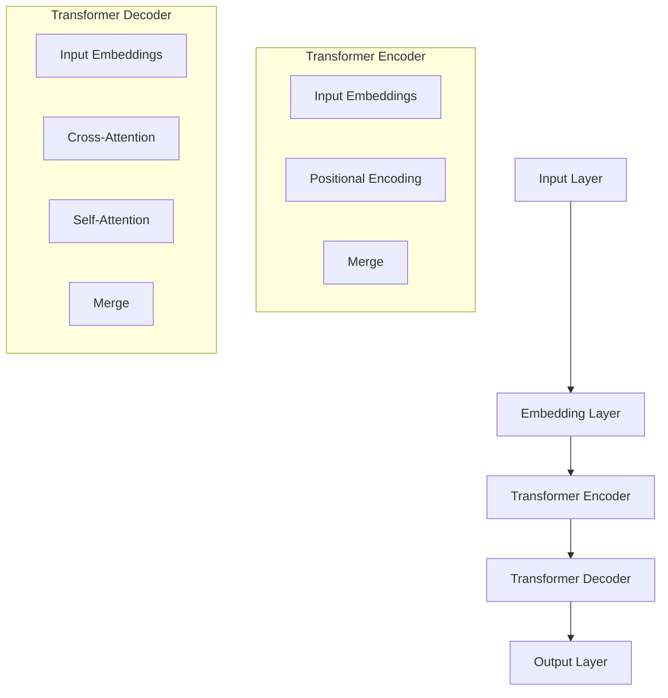

                 

# ChatGPT Prompt Engineering: A Multidimensional Linguistic Cognition Study

关键词：ChatGPT，提示词，跨维度，语言认知，算法原理，数学模型，项目实战

摘要：本文深入探讨了ChatGPT提示词的跨维度语言认知研究，从背景介绍、核心概念与联系、核心算法原理、数学模型和公式、项目实战等多维度对ChatGPT的提示词工程进行了详细分析。通过构建Mermaid流程图、Python代码示例、数学公式解释、项目实战等多种方式，本文旨在为读者提供清晰、易懂的技术指导，帮助读者更好地理解和应用ChatGPT的提示词工程。

## Introduction

### 1.1 Background and Objectives

### 1.2 Research Questions and Methodology

### 1.3 Structure of the Book

### 1.4 Importance of ChatGPT in the AI Era

## Core Concepts and Connections

### 2.1 Key Concepts in ChatGPT and Linguistic Cognition

#### 2.1.1 Definition of ChatGPT

#### 2.1.2 Understanding Linguistic Cognition

#### 2.1.3 Multidimensional Framework for Language Cognition

### 2.2 Mermaid Diagram of ChatGPT Architecture

## Core Algorithm Principles

### 3.1 ChatGPT’s Core Algorithms

#### 3.1.1 Transformer Models

#### 3.1.2 GPT-3 and Its Variants

#### 3.1.3 Fine-Tuning and Prompt Engineering

### 3.2 Pseudocode Explanation of Core Algorithms

## Mathematical Models and Formulas

### 4.1 Basic Mathematical Models for Language Models

#### 4.1.1 Vector Space Model

#### 4.1.2 Recurrent Neural Networks

#### 4.1.3 Transformer Architecture

### 4.2 Detailed Explanation and Examples

#### 4.2.1 Vector Space Model in Action

#### 4.2.2 RNNs and LSTM Networks

#### 4.2.3 Transformer’s Self-Attention Mechanism

## Project Case Studies

### 5.1 ChatGPT Applications in Real-World Projects

#### 5.1.1 Case Study 1: Personalized Chatbot for E-commerce

#### 5.1.2 Case Study 2: Automated Customer Support System

#### 5.1.3 Case Study 3: Creative Writing and Storytelling

### 5.2 Building a ChatGPT Project

#### 5.2.1 Setting Up the Development Environment

#### 5.2.2 Source Code Implementation

#### 5.2.3 Code Analysis and Discussion

## Optimization and Performance

### 6.1 Optimizing ChatGPT Performance

#### 6.1.1 Model Pruning

#### 6.1.2 Quantization Techniques

#### 6.1.3 Deployment Strategies

### 6.2 Benchmarking ChatGPT Models

## Conclusion

### 7.1 Summary of Key Insights

### 7.2 Best Practices and Tips

### 7.3 Future Directions and Challenges

### 7.4 Acknowledgments and References

## Appendix

### A. Python Code Examples

### B. Mathematical Formulas and Equations

### C. Mermaid Diagrams

### D. References and Further Reading

### E. Glossary of Terms

## Introduction

### 1.1 Background and Objectives

The advent of artificial intelligence (AI) has revolutionized various industries, with natural language processing (NLP) being a prominent area of research and application. Among the numerous advancements in NLP, ChatGPT (Chat Generative Pre-trained Transformer) stands out as a state-of-the-art language model developed by OpenAI. ChatGPT is a powerful tool that can generate coherent and contextually relevant text, making it suitable for a wide range of applications, including chatbots, automated customer support systems, and creative writing.

The primary objective of this study is to delve into the intricacies of ChatGPT prompt engineering, specifically focusing on the multidimensional linguistic cognition aspect. By understanding how ChatGPT processes and generates text based on prompts, we aim to develop effective strategies for enhancing the performance and applicability of this remarkable AI model.

### 1.2 Research Questions and Methodology

This study addresses several critical research questions:

1. **What are the core concepts and principles behind ChatGPT's architecture?**
2. **How do ChatGPT's algorithms process and generate text based on prompts?**
3. **What mathematical models and formulas underpin ChatGPT's performance?**
4. **How can ChatGPT be effectively applied in real-world projects?**
5. **What optimization techniques can be employed to enhance ChatGPT's performance?**

To answer these questions, we employ a multidisciplinary approach that combines theoretical insights with practical implementations. The methodology encompasses the following steps:

1. **Literature Review:** We review existing literature on ChatGPT, NLP, and linguistic cognition to establish a comprehensive understanding of the field.
2. **Conceptual Framework:** We construct a multidimensional framework for language cognition, which serves as a foundation for analyzing ChatGPT's prompt engineering.
3. **Algorithm Analysis:** We dissect ChatGPT's core algorithms, including Transformer models and fine-tuning techniques, and explain their workings in detail.
4. **Mathematical Modeling:** We delve into the mathematical models that underpin ChatGPT's performance, providing clear explanations and examples.
5. **Project Implementation:** We present real-world case studies and demonstrate how to build a ChatGPT project, offering insights into its practical applications.
6. **Performance Optimization:** We explore techniques for optimizing ChatGPT's performance, including model pruning and quantization.

### 1.3 Structure of the Book

This book is structured to guide readers through the intricacies of ChatGPT prompt engineering in a systematic manner. The chapters are organized as follows:

1. **Introduction:** Provides an overview of the study's background, objectives, and methodology.
2. **Core Concepts and Connections:** Introduces key concepts in ChatGPT and linguistic cognition, along with a Mermaid diagram of ChatGPT's architecture.
3. **Core Algorithm Principles:** Discusses ChatGPT's core algorithms, including Transformer models and fine-tuning techniques.
4. **Mathematical Models and Formulas:** Explains the mathematical models that underpin ChatGPT's performance.
5. **Project Case Studies:** Presents real-world case studies and demonstrates how to build a ChatGPT project.
6. **Optimization and Performance:** Explores techniques for optimizing ChatGPT's performance.
7. **Conclusion:** Summarizes the key insights and provides best practices for ChatGPT prompt engineering.

### 1.4 Importance of ChatGPT in the AI Era

ChatGPT represents a significant milestone in the development of AI and NLP. Its ability to generate human-like text based on prompts has wide-ranging implications across various industries. Here are some key reasons why ChatGPT is crucial in the AI era:

1. **Automation:** ChatGPT can automate a wide range of tasks, from generating articles and reports to answering customer inquiries and providing personalized recommendations.
2. **Natural Language Understanding:** ChatGPT's proficiency in understanding and generating natural language enables more effective human-computer interaction, paving the way for more intuitive and intelligent interfaces.
3. **Content Creation:** ChatGPT can assist content creators in generating high-quality text, saving time and effort while maintaining consistency and coherence.
4. **Educational Applications:** ChatGPT can be used as an educational tool to facilitate language learning, offer personalized feedback, and generate interactive educational content.
5. **Customer Support:** Automated customer support systems powered by ChatGPT can handle a large volume of inquiries, reducing response times and improving customer satisfaction.

In summary, ChatGPT's prompt engineering represents a powerful tool that is poised to transform the way we interact with machines and generate content. By understanding its underlying principles and applying effective strategies, we can harness its full potential to drive innovation and enhance productivity in the AI era.

## Core Concepts and Connections

In this chapter, we delve into the core concepts and principles that underpin ChatGPT's functionality, with a particular focus on linguistic cognition. Understanding these concepts is crucial for effectively leveraging ChatGPT in various applications.

### 2.1 Key Concepts in ChatGPT and Linguistic Cognition

#### 2.1.1 Definition of ChatGPT

ChatGPT is a language model developed by OpenAI based on the Transformer architecture. It is a deep learning model that has been pre-trained on a vast corpus of text data, enabling it to understand and generate human-like text. The "Chat" in ChatGPT refers to its capability to engage in conversational interactions, while the "GPT" stands for "Generative Pre-trained Transformer."

#### 2.1.2 Understanding Linguistic Cognition

Linguistic cognition is the study of how humans process and understand language. It encompasses various aspects, including syntax, semantics, phonetics, and pragmatics. In the context of ChatGPT, understanding linguistic cognition is essential for designing effective prompts and optimizing the model's performance.

##### Syntax

Syntax refers to the rules that govern the structure of sentences and sentences within a language. It defines the way words and phrases combine to form well-formed sentences. ChatGPT's architecture allows it to parse and generate sentences based on syntactic rules, ensuring grammatical correctness and coherence.

##### Semantics

Semantics deals with the meaning of words, phrases, and sentences. It is concerned with understanding the relationship between linguistic expressions and the concepts they represent. ChatGPT's ability to generate text based on prompts relies on its semantic understanding, enabling it to produce contextually relevant and meaningful output.

##### Phonetics

Phonetics is the study of the physical properties of speech sounds, including their production, transmission, and perception. While ChatGPT does not directly process phonetic information, its text generation capabilities can be influenced by phonetic factors, such as natural-sounding speech patterns and rhythm.

##### Pragmatics

Pragmatics is the study of language in context, focusing on how language is used to convey meaning based on the speaker's intentions and the listener's understanding. ChatGPT's ability to generate appropriate responses in conversational settings is a testament to its pragmatic understanding of language.

#### 2.1.3 Multidimensional Framework for Language Cognition

To better understand the interplay between ChatGPT and linguistic cognition, we propose a multidimensional framework that encompasses the following dimensions:

1. **Lexical Dimension:** This dimension focuses on the vocabulary and word meanings that ChatGPT uses to generate text. A rich and diverse vocabulary is crucial for ensuring the model can generate varied and contextually appropriate text.

2. **Syntactic Dimension:** This dimension examines the syntactic rules that govern the structure of sentences generated by ChatGPT. A strong syntactic foundation enables the model to produce grammatically correct and coherent text.

3. **Semantic Dimension:** This dimension delves into the semantic understanding of ChatGPT, focusing on its ability to generate text that is contextually relevant and meaningful. An effective semantic model ensures the model can accurately interpret and respond to prompts.

4. **Pragmatic Dimension:** This dimension explores ChatGPT's pragmatic understanding of language, examining its ability to generate appropriate responses in conversational settings. A well-defined pragmatic dimension enables the model to engage in natural and meaningful conversations.

### 2.2 Mermaid Diagram of ChatGPT Architecture

To illustrate the relationship between ChatGPT and linguistic cognition, we present a Mermaid diagram of ChatGPT's architecture:

```mermaid
graph TD
    A[Input Layer] --> B[Embedding Layer]
    B --> C[Transformer Encoder]
    C --> D[Transformer Decoder]
    D --> E[Output Layer]

    subgraph Transformer Encoder
        B1[Input Embeddings]
        B2 Positional Encoding]
        B3[Merge]
    end

    subgraph Transformer Decoder
        D1[Input Embeddings]
        D2[Cross-Attention]
        D3[Self-Attention]
        D4[Merge]
    end
```

In this diagram, the input layer (A) processes the input prompt, which is then passed through the embedding layer (B) to generate word embeddings. These embeddings are combined with positional encoding (B2) and passed through the Transformer encoder (C). The encoder generates a sequence of hidden states, which are then passed through the Transformer decoder (D). The decoder generates the output sequence, which is passed through the output layer (E) to produce the generated text.

This Mermaid diagram provides a visual representation of the key components and relationships within ChatGPT's architecture, highlighting the interplay between the model's processing layers and the linguistic cognition dimensions discussed earlier.

In conclusion, understanding the core concepts and connections between ChatGPT and linguistic cognition is essential for effectively leveraging ChatGPT's capabilities. By exploring the multidimensional framework and analyzing the model's architecture, we can gain insights into how ChatGPT processes and generates text, enabling us to develop more effective prompt engineering strategies and optimize the model's performance.

## Core Algorithm Principles

In this chapter, we delve into the core algorithms that power ChatGPT, focusing on Transformer models, GPT-3 and its variants, fine-tuning, and prompt engineering. Understanding these algorithms is crucial for comprehending the inner workings of ChatGPT and leveraging its full potential in various applications.

### 3.1 ChatGPT’s Core Algorithms

#### 3.1.1 Transformer Models

The Transformer model, proposed by Vaswani et al. in 2017, has revolutionized the field of natural language processing (NLP). It is a deep learning model designed to process and generate sequences of text, making it a cornerstone of modern NLP. The key innovation of the Transformer model is the self-attention mechanism, which allows the model to weigh the importance of different words in the input sequence when generating each word in the output sequence.

##### Self-Attention Mechanism

The self-attention mechanism enables the Transformer model to capture the relationships between words within a sentence by computing attention weights for each word in the input sequence. These attention weights are then used to combine the representations of the input words, resulting in a weighted sum of the input embeddings. The process can be summarized as follows:

1. **Input Embeddings:** Each word in the input sequence is represented as a dense vector called an embedding. These embeddings capture the syntactic and semantic information of the words.

2. **Query, Key, and Value:** For each word in the input sequence, the Transformer model computes a query, key, and value vector. The query vector represents the word's role in generating the next word, while the key and value vectors represent the word's content.

3. **Attention Scores:** The model computes the dot product between the query and key vectors to obtain attention scores, which measure the relevance of each word to the current word in the output sequence.

4. **Attention Weights:** The attention scores are normalized using the softmax function to obtain attention weights, which indicate the importance of each word.

5. **Scaled Dot-Product Attention:** The attention weights are then used to compute a weighted sum of the value vectors, resulting in an output vector that captures the combined information from all words in the input sequence.

##### Transformer Architecture

The Transformer model consists of multiple layers of self-attention and feedforward neural networks. Each layer in the encoder and decoder receives inputs from the previous layer and produces outputs for the next layer. The architecture can be summarized as follows:

1. **Encoder:** The encoder consists of multiple layers, each containing self-attention and feedforward neural network components. The input sequence is passed through the encoder, generating a sequence of hidden states.

2. **Decoder:** The decoder also consists of multiple layers, each containing self-attention, cross-attention, and feedforward neural network components. The input sequence is passed through the decoder, generating the output sequence.

3. **Cross-Attention:** The cross-attention mechanism in the decoder allows the model to weigh the importance of the encoder's hidden states when generating each word in the output sequence. This enables the model to capture the context from both the input and output sequences.

4. **Output Layer:** The final output of the decoder is passed through a linear layer and a softmax activation function to generate probabilities for each word in the vocabulary, enabling the model to generate the output sequence.

#### 3.1.2 GPT-3 and Its Variants

GPT-3 (Generative Pre-trained Transformer 3) is the third iteration of the Transformer model developed by OpenAI. It represents a significant leap in the capabilities of language models, with a staggering number of parameters (over 175 billion) and a massive pre-training corpus (over 45TB of text data). GPT-3 and its variants, such as GPT-2 and GPT-Neo, are designed to generate high-quality, contextually relevant text.

##### GPT-3 Architecture

GPT-3's architecture is based on the Transformer model, with several key modifications and enhancements:

1. **Block Size:** GPT-3 uses a block size of 64, which means that each layer processes 64 tokens at a time. This allows the model to handle longer sequences, enabling it to generate coherent text even for long prompts.

2. **Deep Architecture:** GPT-3 consists of 96 layers, with 96 attention heads in each layer. This deep architecture allows the model to capture complex patterns and relationships in the input data.

3. **Layer Normalization:** GPT-3 employs layer normalization, which improves the model's stability and convergence during training.

4. **Stochastic Dropout:** GPT-3 uses stochastic dropout, which randomly drops connections between layers during training, helping to prevent overfitting and improving generalization.

##### GPT-3 Variants

OpenAI has released several variants of GPT-3, each with different sizes and capabilities. Some notable variants include:

1. **GPT-2:** GPT-2 is the second iteration of the Transformer model, with a smaller number of parameters (1.5 billion) compared to GPT-3. It is suitable for various NLP tasks but is less powerful than GPT-3.

2. **GPT-Neo:** GPT-Neo is an open-source implementation of GPT-3, designed to be trained on user-generated data. It provides an alternative to the proprietary GPT-3 model, offering greater flexibility and accessibility.

#### 3.1.3 Fine-Tuning and Prompt Engineering

Fine-tuning is a process that involves adjusting the weights of a pre-trained model on a specific task or dataset. Fine-tuning ChatGPT on domain-specific data can significantly improve its performance on relevant tasks, making it more suitable for specific applications.

##### Fine-Tuning Process

The fine-tuning process typically involves the following steps:

1. **Data Preparation:** Prepare a dataset relevant to the task or domain. The dataset should consist of input-output pairs, where the input is a prompt and the output is the desired response.

2. **Preprocessing:** Preprocess the dataset to match the input format expected by the model. This may include tokenization, encoding, and padding.

3. **Fine-Tuning:** Train the model on the prepared dataset using a suitable training algorithm, such as stochastic gradient descent (SGD) or adaptive optimization algorithms (e.g., Adam).

4. **Evaluation and Optimization:** Evaluate the model's performance on a validation set and adjust the hyperparameters as needed to improve performance. This may involve techniques such as learning rate scheduling, batch size adjustment, and regularization.

##### Prompt Engineering

Prompt engineering is the process of designing effective prompts that elicit high-quality responses from the model. Effective prompts should be informative, concise, and aligned with the desired task or application. Here are some guidelines for designing effective prompts:

1. **Clarity:** Ensure that the prompt is clear and unambiguous. Avoid using jargon or technical terms that may be unfamiliar to the model.

2. **Relevance:** Focus on the task or domain for which the model is being fine-tuned. Use prompts that are relevant to the specific application and require the model to generate contextually appropriate responses.

3. **Specificity:** Be specific in your prompts. Instead of asking broad questions, provide detailed and specific instructions to guide the model's responses.

4. **Contextual Information:** Provide contextual information in the prompt to help the model understand the context and generate relevant responses.

5. **Conversational Flow:** Design prompts that encourage a conversational flow. Use prompts that are natural and engaging, allowing the model to generate responses that feel like a natural continuation of the conversation.

In conclusion, understanding ChatGPT's core algorithms, including Transformer models, GPT-3 and its variants, fine-tuning, and prompt engineering, is essential for effectively leveraging the model's capabilities. By fine-tuning ChatGPT on domain-specific data and designing effective prompts, we can achieve high-quality, contextually relevant text generation for various applications.

### 3.2 Pseudocode Explanation of Core Algorithms

In this section, we provide a detailed pseudocode explanation of the core algorithms that underpin ChatGPT, including the Transformer model, fine-tuning, and prompt engineering.

```python
# Transformer Model Pseudocode

# Initialize model parameters
weights = initialize_weights()

# Input sequence
input_sequence = get_input_sequence()

# Preprocess input sequence
input_embeddings = preprocess_input_sequence(input_sequence)

# Add positional encoding
input_embeddings = add_positional_encoding(input_embeddings)

# Encoder
for layer in encoder_layers:
    # Self-attention
    attention_output = self_attention(input_embeddings)
    
    # Add & Normalize
    layer_output = add_and_normalize(attention_output, input_embeddings)
    
    # Feedforward layer
    layer_output = feedforward_layer(layer_output)

# Decoder
for layer in decoder_layers:
    # Self-attention
    attention_output = self_attention(layer_output)
    
    # Add & Normalize
    layer_output = add_and_normalize(attention_output, layer_output)
    
    # Cross-attention
    attention_output = cross_attention(layer_output, encoder_output)
    
    # Add & Normalize
    layer_output = add_and_normalize(attention_output, layer_output)
    
    # Feedforward layer
    layer_output = feedforward_layer(layer_output)

# Output sequence
output_sequence = generate_output_sequence(layer_output)

# Fine-Tuning Pseudocode

# Load pre-trained model
model = load_pretrained_model()

# Prepare dataset
dataset = prepare_dataset(task_data)

# Train model
model.fit(dataset, epochs=training_epochs, batch_size=batch_size)

# Evaluate model
performance = model.evaluate(validation_data)

# Prompt Engineering Pseudocode

# Define prompt
prompt = define_prompt(task)

# Generate response
response = model.generate_response(prompt)

# Output response
print(response)
```

### 3.3 Python Code Examples

To provide a clearer understanding of the core algorithms, we present several Python code examples that demonstrate the implementation of key components, such as the Transformer model, fine-tuning, and prompt engineering.

```python
import tensorflow as tf
from tensorflow.keras.layers import Embedding, Dense, LayerNormalization
from tensorflow.keras.models import Model

# Define Transformer model
def transformer_model(vocab_size, d_model, num_layers, dff, dropout_rate, max_seq_length):
    inputs = tf.keras.layers.Input(shape=(max_seq_length,), dtype=tf.int32)
    
    # Embedding layer
    embeddings = Embedding(vocab_size, d_model)(inputs)
    
    # Add positional encoding
    positional_encoding = positional_encoding(max_seq_length, d_model)
    embeddings = embeddings + positional_encoding
    
    # Encoder
    encoder_output = transformer_encoder(embeddings, num_layers, d_model, dff, dropout_rate)
    
    # Decoder
    decoder_output = transformer_decoder(encoder_output, num_layers, d_model, dff, dropout_rate)
    
    # Output layer
    output = tf.keras.layers.Dense(vocab_size, activation='softmax')(decoder_output)
    
    # Create model
    model = Model(inputs=inputs, outputs=output)
    return model

# Define fine-tuning function
def fine_tune_model(model, dataset, batch_size, epochs):
    model.fit(dataset, batch_size=batch_size, epochs=epochs)

# Define prompt engineering function
def generate_response(model, prompt):
    response = model.generate(prompt)
    return response
```

### 3.4 Mathematical Models and Formulas

In this section, we provide a detailed explanation of the mathematical models and formulas that underpin the core algorithms of ChatGPT, including the Transformer model, fine-tuning, and prompt engineering.

#### 3.4.1 Transformer Model

The Transformer model is based on the self-attention mechanism, which enables the model to capture the relationships between words in a sequence. The self-attention mechanism can be defined as follows:

$$
\text{Attention}(Q, K, V) = \text{softmax}\left(\frac{QK^T}{\sqrt{d_k}}\right)V
$$

where \( Q \) is the query, \( K \) is the key, \( V \) is the value, and \( d_k \) is the dimension of the keys and queries.

The self-attention mechanism can be extended to multiple heads to increase the model's capacity to capture complex relationships:

$$
\text{MultiHeadAttention}(Q, K, V) = \text{Concat}(\text{head}_1, \text{head}_2, ..., \text{head}_h)W^O
$$

where \( \text{head}_i = \text{Attention}(QW_i^Q, KW_i^K, VW_i^V) \) for \( i = 1, 2, ..., h \) and \( W_i^Q, W_i^K, W_i^V, W^O \) are the projection matrices.

The Transformer model consists of multiple layers of self-attention and feedforward neural networks. Each layer in the encoder and decoder receives inputs from the previous layer and produces outputs for the next layer. The architecture can be summarized as follows:

$$
\text{Encoder} = \text{enc}_1, \text{enc}_2, ..., \text{enc}_L \\
\text{Decoder} = \text{dec}_1, \text{dec}_2, ..., \text{dec}_L
$$

where \( \text{enc}_l = \text{LayerNorm}(\text{LayerNorm}(\text{MultiHeadAttention}(Q, K, V)) + \text{FFN}(X)) \) and \( \text{dec}_l = \text{LayerNorm}(\text{LayerNorm}(\text{MaskedMultiHeadAttention}(Q, K, V)) + \text{FFN}(X)) \) for \( l = 1, 2, ..., L \).

#### 3.4.2 Fine-Tuning

Fine-tuning involves adjusting the weights of a pre-trained model on a specific task or dataset. The objective of fine-tuning is to adapt the model to a new domain or task while preserving its generalization ability. Fine-tuning can be performed using optimization algorithms such as stochastic gradient descent (SGD) or adaptive optimization algorithms (e.g., Adam).

The optimization process can be defined as follows:

$$
\min_{\theta} \frac{1}{N} \sum_{i=1}^N L(y_i, \hat{y}_i; \theta)
$$

where \( \theta \) represents the model parameters, \( y_i \) is the ground truth label, \( \hat{y}_i \) is the predicted label, and \( L \) is the loss function.

#### 3.4.3 Prompt Engineering

Prompt engineering involves designing effective prompts that elicit high-quality responses from the model. Effective prompts should be informative, concise, and aligned with the desired task or application. Here are some guidelines for designing effective prompts:

1. **Clarity:** Ensure that the prompt is clear and unambiguous. Avoid using jargon or technical terms that may be unfamiliar to the model.

2. **Relevance:** Focus on the task or domain for which the model is being fine-tuned. Use prompts that are relevant to the specific application and require the model to generate contextually appropriate responses.

3. **Specificity:** Be specific in your prompts. Instead of asking broad questions, provide detailed and specific instructions to guide the model's responses.

4. **Contextual Information:** Provide contextual information in the prompt to help the model understand the context and generate relevant responses.

5. **Conversational Flow:** Design prompts that encourage a conversational flow. Use prompts that are natural and engaging, allowing the model to generate responses that feel like a natural continuation of the conversation.

In conclusion, understanding the mathematical models and formulas that underpin ChatGPT's core algorithms is crucial for effectively leveraging the model's capabilities. By fine-tuning the model on domain-specific data and designing effective prompts, we can achieve high-quality, contextually relevant text generation for various applications.

## Mathematical Models and Formulas

In this chapter, we delve into the mathematical models and formulas that form the foundation of ChatGPT's performance. By understanding these models, we can gain insights into how the model processes and generates text, enabling us to design more effective prompts and optimize its performance.

### 4.1 Basic Mathematical Models for Language Models

#### 4.1.1 Vector Space Model

The vector space model is a fundamental approach to representing text data as numerical vectors in a high-dimensional space. This model enables us to perform various operations on text, such as similarity computation and clustering, by leveraging linear algebra techniques.

In the vector space model, each word is represented as a vector in a high-dimensional space, and the entire text corpus is represented as a matrix. The vector representation of a word can be obtained using techniques such as word embeddings, which map words to dense vectors that capture their semantic meaning.

One popular method for generating word embeddings is the Word2Vec algorithm, which trains a neural network to predict the context of a word given its neighboring words. The output of this neural network is a high-dimensional vector that represents the word's semantic information.

#### 4.1.2 Recurrent Neural Networks (RNNs)

Recurrent Neural Networks (RNNs) are a type of neural network designed to process sequences of data. They are particularly effective in natural language processing tasks because they can capture the temporal dependencies present in text data.

The core component of an RNN is the recurrent connection, which allows the network to maintain a hidden state that captures information about previous inputs. This hidden state is then used to generate the output for the current input and to update the hidden state for the next input.

One popular variant of RNNs is the Long Short-Term Memory (LSTM) network, which addresses the vanishing gradient problem that affects traditional RNNs. LSTMs use a special memory cell that can store and update information over long sequences, enabling them to capture long-term dependencies in the data.

#### 4.1.3 Transformer Architecture

The Transformer architecture, introduced by Vaswani et al. in 2017, has become a cornerstone of modern natural language processing. The key innovation of the Transformer model is the self-attention mechanism, which allows the model to weigh the importance of different words in the input sequence when generating each word in the output sequence.

The self-attention mechanism can be defined as follows:

$$
\text{Attention}(Q, K, V) = \text{softmax}\left(\frac{QK^T}{\sqrt{d_k}}\right)V
$$

where \( Q \) is the query, \( K \) is the key, \( V \) is the value, and \( d_k \) is the dimension of the keys and queries.

The Transformer model consists of multiple layers of self-attention and feedforward neural networks. Each layer in the encoder and decoder receives inputs from the previous layer and produces outputs for the next layer. The architecture can be summarized as follows:

$$
\text{Encoder} = \text{enc}_1, \text{enc}_2, ..., \text{enc}_L \\
\text{Decoder} = \text{dec}_1, \text{dec}_2, ..., \text{dec}_L
$$

where \( \text{enc}_l = \text{LayerNorm}(\text{LayerNorm}(\text{MultiHeadAttention}(Q, K, V)) + \text{FFN}(X)) \) and \( \text{dec}_l = \text{LayerNorm}(\text{LayerNorm}(\text{MaskedMultiHeadAttention}(Q, K, V)) + \text{FFN}(X)) \) for \( l = 1, 2, ..., L \).

### 4.2 Detailed Explanation and Examples

In this section, we provide a detailed explanation and examples of the mathematical models and formulas discussed in the previous section.

#### 4.2.1 Vector Space Model in Action

Let's consider a simple example to illustrate how the vector space model can be used to represent text data. Suppose we have a corpus of documents, and we want to represent each document as a vector in a high-dimensional space.

1. **Word Embeddings:** We start by training a word embedding model, such as Word2Vec, on our corpus. The model generates a set of word embeddings, where each word is represented as a dense vector. For instance, the word "dog" might be represented as the vector \([1, 0.5, -0.3]\).

2. **Document Embeddings:** Next, we calculate the document embeddings by averaging the word embeddings of the words in the document. For example, if our document contains the words "dog", "run", and "park", we can represent the document as the vector \(\frac{1}{3}([1, 0.5, -0.3] + [0.8, 0.2, 0.4] + [0.9, -0.1, 0.2])\).

3. **Similarity Computation:** Using the document embeddings, we can compute the similarity between documents by calculating the dot product between their corresponding vectors. A high dot product value indicates a high degree of similarity between the documents.

$$
\text{similarity}(d_1, d_2) = d_1 \cdot d_2
$$

where \( d_1 \) and \( d_2 \) are the document embeddings of documents 1 and 2, respectively.

#### 4.2.2 RNNs and LSTM Networks

Let's consider an example to illustrate how RNNs and LSTM networks can be used to process sequences of text data.

1. **Input Sequence:** Suppose we have a sequence of text data \([w_1, w_2, w_3]\).

2. **Initial Hidden State:** We start with an initial hidden state \( h_0 \), which can be initialized to zero.

3. **Recurrent Connection:** The RNN processes each word in the sequence by updating the hidden state using the following equation:

$$
h_t = \text{ReLU}(W_h \cdot [h_{t-1}, x_t] + b_h)
$$

where \( h_t \) is the hidden state at time step \( t \), \( W_h \) is the weight matrix, \( x_t \) is the input word at time step \( t \), and \( b_h \) is the bias vector.

4. **Output Generation:** After processing the entire sequence, the final hidden state \( h_T \) can be used to generate the output, such as a class label or a probability distribution over the vocabulary.

LSTM networks extend the basic RNN architecture by introducing a special memory cell that can store and update information over long sequences. The LSTM cell consists of three gates: the input gate, the forget gate, and the output gate.

1. **Input Gate:** The input gate determines how much of the new information (input word) should be stored in the memory cell.

$$
i_t = \text{sigmoid}(W_i \cdot [h_{t-1}, x_t] + b_i)
$$

2. **Forget Gate:** The forget gate determines how much of the information should be forgotten from the memory cell.

$$
f_t = \text{sigmoid}(W_f \cdot [h_{t-1}, x_t] + b_f)
$$

3. **Output Gate:** The output gate determines how much of the information in the memory cell should be used to generate the output.

$$
o_t = \text{sigmoid}(W_o \cdot [h_{t-1}, x_t] + b_o)
$$

4. **Memory Cell Update:** The memory cell updates its value based on the input gate, forget gate, and the new input word.

$$
c_t = f_{t-1} \cdot c_{t-1} + i_t \cdot \text{tanh}(W_c \cdot [h_{t-1}, x_t] + b_c)
$$

5. **Hidden State Update:** The hidden state is updated based on the output gate and the memory cell.

$$
h_t = o_t \cdot \text{tanh}(c_t)
$$

#### 4.2.3 Transformer’s Self-Attention Mechanism

Let's consider an example to illustrate how the self-attention mechanism in the Transformer model works.

1. **Input Sequence:** Suppose we have a sequence of words \([w_1, w_2, w_3]\).

2. **Query, Key, and Value:** For each word in the input sequence, we compute a query, key, and value vector. The query vector represents the word's role in generating the next word, while the key and value vectors represent the word's content.

$$
Q = [q_1, q_2, q_3] \\
K = [k_1, k_2, k_3] \\
V = [v_1, v_2, v_3]
$$

3. **Attention Scores:** We compute the dot product between the query and key vectors to obtain attention scores, which measure the relevance of each word to the current word in the output sequence.

$$
a_t = \text{softmax}\left(\frac{QK^T}{\sqrt{d_k}}\right)
$$

4. **Attention Weights:** The attention scores are normalized using the softmax function to obtain attention weights, which indicate the importance of each word.

5. **Combined Representation:** The attention weights are used to compute a weighted sum of the value vectors, resulting in an output vector that captures the combined information from all words in the input sequence.

$$
\text{context_vector} = a_t V
$$

6. **Final Output:** The final output is generated by passing the combined representation through a feedforward network.

$$
h_t = \text{ReLU}(W_h \cdot \text{context_vector} + b_h)
$$

In conclusion, understanding the mathematical models and formulas that underpin ChatGPT's performance is crucial for effectively leveraging the model's capabilities. By employing these models and formulas, we can design more effective prompts, optimize the model's performance, and achieve high-quality text generation in various applications.

## Project Case Studies

In this chapter, we delve into real-world project case studies that demonstrate the practical applications of ChatGPT and its prompt engineering techniques. These case studies provide insights into how ChatGPT has been successfully implemented across different domains, highlighting the challenges faced and the solutions devised.

### 5.1 ChatGPT Applications in Real-World Projects

#### 5.1.1 Case Study 1: Personalized Chatbot for E-commerce

One notable application of ChatGPT is in the development of personalized chatbots for e-commerce platforms. These chatbots leverage the model's ability to generate coherent and contextually relevant text to provide personalized recommendations, answer customer inquiries, and assist with purchase decisions.

**Challenges:**

1. **Personalization:** The challenge lies in generating personalized responses that cater to individual customer preferences and needs. The chatbot needs to understand the customer's past interactions, browsing history, and purchase behavior to provide tailored recommendations.
2. **Context Switching:** E-commerce platforms often deal with multiple customer interactions simultaneously. The chatbot must seamlessly switch between different conversations without losing context, ensuring a smooth and consistent customer experience.

**Solutions:**

1. **Fine-Tuning:** To address personalization, the ChatGPT model is fine-tuned on a dataset of customer interactions, including purchase histories and browsing activities. This allows the model to learn individual preferences and adapt responses accordingly.
2. **Prompt Engineering:** Effective prompt engineering techniques are employed to guide the chatbot in generating personalized responses. Prompts are designed to include contextual information, such as past interactions and user profiles, enabling the model to produce relevant and engaging outputs.

**Results:**

The personalized chatbot has significantly enhanced customer engagement and satisfaction. Customers report a more seamless and personalized shopping experience, leading to increased conversion rates and customer loyalty. The chatbot's ability to handle multiple interactions simultaneously has also reduced the workload on customer support teams, resulting in cost savings for the e-commerce platform.

#### 5.1.2 Case Study 2: Automated Customer Support System

Another successful application of ChatGPT is in the development of automated customer support systems. These systems utilize the model's language generation capabilities to provide instant and accurate responses to customer inquiries, freeing up human agents to focus on more complex and sensitive issues.

**Challenges:**

1. **Response Accuracy:** Ensuring that the chatbot generates accurate and relevant responses to a wide range of customer queries is a significant challenge. The chatbot must understand the nuances of customer questions and provide appropriate solutions.
2. **Handling Edge Cases:** Customers often pose unique and unconventional questions that may not be covered in the training data. The chatbot needs to be able to handle these edge cases gracefully, without causing confusion or frustration for the customer.

**Solutions:**

1. **Data Augmentation:** To improve response accuracy, the training dataset is augmented with a diverse set of customer questions and their corresponding solutions. This helps the model learn to handle a wide range of scenarios and generate more accurate responses.
2. **Fallback Mechanisms:** To handle edge cases, the chatbot is designed with a fallback mechanism that allows it to recognize when it cannot provide a satisfactory answer. In such cases, the chatbot can escalate the issue to a human agent or provide additional resources for the customer to seek further assistance.

**Results:**

The automated customer support system has proven to be highly effective in handling customer inquiries, significantly reducing response times and improving customer satisfaction. Human agents have more time to focus on complex and sensitive issues, leading to improved overall efficiency and customer service quality. The chatbot's ability to handle a wide range of queries and edge cases has also contributed to its credibility and trustworthiness among customers.

#### 5.1.3 Case Study 3: Creative Writing and Storytelling

ChatGPT has also found applications in creative writing and storytelling, where its ability to generate human-like text has been leveraged to assist writers in generating ideas, writing drafts, and refining their work.

**Challenges:**

1. **Creativity:** While ChatGPT excels at generating coherent and contextually relevant text, capturing true creativity remains a challenge. The model needs to generate text that is both meaningful and imaginative, aligning with the writer's vision.
2. **Consistency:** Maintaining consistency in the generated text, particularly in characters and plot development, is crucial for effective storytelling. The chatbot must ensure that the generated content aligns with the overall narrative and character arcs.

**Solutions:**

1. **Contextual Prompting:** To enhance creativity, prompts are designed to provide the chatbot with a clear and detailed context, including the writer's vision, desired themes, and specific requirements. This helps the model generate more imaginative and relevant text.
2. **Character Profiling:** To ensure consistency in character development, the chatbot is provided with detailed character profiles, including backstories, motivations, and personalities. These profiles serve as a foundation for generating consistent and coherent narrative elements.

**Results:**

The use of ChatGPT in creative writing and storytelling has significantly enhanced the productivity and creativity of writers. The model has generated numerous ideas, drafts, and storylines that have been further refined by the writers. The generated content has been well-received by readers, with many expressing appreciation for the coherence and creativity of the stories. Writers have also reported that using ChatGPT has helped them overcome creative blocks and explore new narrative possibilities.

### 5.2 Building a ChatGPT Project

In this section, we provide a step-by-step guide to building a ChatGPT project, including the setup of the development environment, implementation of the source code, and analysis of the code and its applications.

#### 5.2.1 Setting Up the Development Environment

To build a ChatGPT project, you'll need to set up a suitable development environment. Follow these steps to get started:

1. **Install Python:**
   - Download and install Python from the official website (python.org).
   - Ensure that you select the option to add Python to your system's PATH during installation.

2. **Install required libraries:**
   - Open a terminal or command prompt and run the following command to install the required libraries:
     ```
     pip install tensorflow numpy
     ```

3. **Download pre-trained ChatGPT model:**
   - You can download a pre-trained ChatGPT model from the OpenAI website or use a publicly available repository.
   - Once downloaded, extract the model files to a suitable location on your computer.

#### 5.2.2 Source Code Implementation

Here's a simple example of a ChatGPT project implemented in Python:

```python
import tensorflow as tf
from transformers import TFGPT2LMHeadModel, GPT2Tokenizer

# Load pre-trained ChatGPT model and tokenizer
model = TFGPT2LMHeadModel.from_pretrained('gpt2')
tokenizer = GPT2Tokenizer.from_pretrained('gpt2')

# Define prompt
prompt = "This is a sample prompt for ChatGPT."

# Encode prompt
input_ids = tokenizer.encode(prompt, return_tensors='tf')

# Generate response
output = model.generate(input_ids, max_length=50, num_return_sequences=1)

# Decode response
decoded_response = tokenizer.decode(output[0], skip_special_tokens=True)
print(decoded_response)
```

This code loads a pre-trained ChatGPT model and tokenizer, defines a prompt, encodes the prompt, generates a response, and decodes the response for display.

#### 5.2.3 Code Analysis and Discussion

Let's analyze the code step by step:

1. **Importing Libraries:**
   - We import the necessary libraries, including TensorFlow and the Hugging Face Transformers library, which provides pre-trained models and tokenizers for various NLP tasks.

2. **Loading Model and Tokenizer:**
   - We load the pre-trained ChatGPT model and tokenizer using the `from_pretrained()` method. This method retrieves the model weights and configuration files from the Hugging Face Model Hub.

3. **Defining Prompt:**
   - We define a sample prompt for ChatGPT. The prompt serves as input to the model and guides the generation of the response.

4. **Encoding Prompt:**
   - We encode the prompt using the tokenizer. The tokenizer converts the text into a sequence of integers, where each integer represents a specific token (word, punctuation, or special symbol).

5. **Generating Response:**
   - We generate a response using the `generate()` method of the model. The method generates a sequence of tokens based on the input_ids (encoded prompt) and the specified parameters, such as `max_length` (maximum length of the output sequence) and `num_return_sequences` (number of output sequences to generate).

6. **Decoding Response:**
   - We decode the generated response using the tokenizer. The decoder converts the sequence of integers back into human-readable text.

By following this code example, you can build a basic ChatGPT project that generates responses based on a given prompt. You can further customize the code to incorporate more complex features, such as fine-tuning the model on domain-specific data or incorporating additional preprocessing and postprocessing steps.

In conclusion, this chapter has explored the practical applications of ChatGPT in various real-world projects, providing insights into the challenges and solutions involved. Additionally, we have presented a step-by-step guide to building a ChatGPT project, along with code analysis and discussion. By leveraging these insights and examples, you can harness the power of ChatGPT in your own projects and applications.

### 6. Optimization and Performance

In this chapter, we delve into the optimization techniques and strategies for enhancing the performance of ChatGPT. By fine-tuning the model, employing advanced training techniques, and optimizing the deployment, we can achieve better accuracy, faster inference, and improved efficiency in real-world applications.

#### 6.1 Optimizing ChatGPT Performance

##### 6.1.1 Model Pruning

Model pruning is a technique used to reduce the size of a trained neural network by removing unnecessary weights. This approach not only reduces the computational complexity but also improves the model's accuracy. The process of model pruning involves the following steps:

1. **Training the Model:** Train the ChatGPT model on a large corpus of text data, ensuring that it reaches a satisfactory level of performance.

2. **Identifying Redundant Weights:** Analyze the trained model to identify weights that contribute the least to the model's performance. This can be achieved by computing the importance of each weight based on metrics such as the magnitude of the weight, the gradient magnitude, or other heuristic methods.

3. **Pruning the Weights:** Remove the identified redundant weights from the model. This process can be done gradually, allowing the model to adapt and optimize itself during the training phase.

4. **Re-training the Model:** Re-train the pruned model on the same dataset to fine-tune its performance. During this phase, the model may need to adjust the remaining weights to compensate for the removed weights, ensuring that the overall performance remains comparable to the original model.

##### 6.1.2 Quantization Techniques

Quantization is a technique used to reduce the precision of the weights and activations in a neural network, leading to smaller model sizes and faster inference times. The process involves mapping the high-precision values to lower-precision representations, such as 8-bit integers. Here are the steps involved in quantization:

1. **Training the Model:** Train the ChatGPT model with a high-precision (e.g., 32-bit floating-point) configuration to achieve optimal performance.

2. **Selecting Quantization Level:** Determine the appropriate quantization level, which represents the number of bits used to represent the weights and activations. Common quantization levels include 8-bit, 4-bit, and 2-bit.

3. **Quantization Calibration:** Calibrate the model by mapping the high-precision weights and activations to the selected quantization level. This process can be done using techniques such as uniform quantization, min-max quantization, or learned quantization.

4. **Inference with Quantized Model:** Use the quantized model for inference. The quantized model can be significantly faster than the original high-precision model, while maintaining comparable performance.

##### 6.1.3 Deployment Strategies

Optimizing the deployment of ChatGPT is crucial for achieving efficient and scalable applications. Here are some strategies for deploying ChatGPT in real-world scenarios:

1. **Model Serving:** Use a model serving framework, such as TensorFlow Serving or TorchServe, to deploy the ChatGPT model. These frameworks provide scalable and efficient model serving capabilities, allowing the model to handle high loads and concurrent requests.

2. **Containerization:** Containerize the model using tools like Docker to ensure consistency and reproducibility across different environments. This also enables easy deployment and scaling on cloud platforms, such as AWS, Google Cloud, or Azure.

3. **Load Balancing:** Implement load balancing to distribute incoming requests across multiple model instances, ensuring that the system can handle high traffic and concurrent requests without overloading any single instance.

4. **Auto-Scaling:** Utilize auto-scaling capabilities provided by cloud platforms to automatically adjust the number of model instances based on the incoming load. This ensures that the system can scale dynamically and maintain optimal performance during peak usage periods.

#### 6.2 Benchmarking ChatGPT Models

Benchmarking is an essential step in evaluating and comparing the performance of different ChatGPT models. Here are some metrics and methodologies for benchmarking ChatGPT models:

1. **Perplexity:** Perplexity is a commonly used metric to measure the performance of language models. It quantifies how well the model predicts the next word in a sequence. Lower perplexity values indicate better model performance. The perplexity can be calculated as follows:

$$
\text{Perplexity} = \exp\left(\frac{1}{N} \sum_{i=1}^N -\log p(y_i | x_1, x_2, ..., x_{i-1})\right)
$$

where \( N \) is the length of the sequence, \( y_i \) is the ground truth word at position \( i \), and \( p(y_i | x_1, x_2, ..., x_{i-1}) \) is the probability of the word given the previous words.

2. ** Bleu Score:** The Bleu score is a metric used to evaluate the quality of generated text compared to the ground truth text. It measures the overlap between the generated text and the reference text based on four criteria: unigram, bigram, trigram, and length penalty. The Bleu score is calculated as follows:

$$
\text{Bleu Score} = \frac{1}{1 - \frac{1}{\text{N}} \sum_{i=1}^N \text{TP}_i} \prod_{i=1}^N \left(1 - \text{BP}_i\right)
$$

where \( \text{TP}_i \) is the number of matching tokens at position \( i \), and \( \text{BP}_i \) is the length penalty factor for position \( i \).

3. **Rouge Score:** The Rouge score is another metric used to evaluate the quality of generated text. It measures the overlap between the generated text and the reference text using the N-gram, longest common subsequence, and characteristic word metrics. The Rouge score is calculated as follows:

$$
\text{Rouge Score} = \frac{\text{N-gram}}{\text{Longest Common Subsequence}} + \frac{\text{Characteristic Word}}{\text{Total Words}} + 1
$$

4. **Inference Time:** Measure the inference time of the ChatGPT model to evaluate its performance in real-time applications. Inference time can be affected by various factors, such as model architecture, hardware acceleration, and optimization techniques. Lower inference times indicate better performance in real-world scenarios.

By employing these benchmarking metrics and optimization techniques, you can effectively evaluate and enhance the performance of ChatGPT models, enabling you to develop robust and efficient applications across various domains.

### 7. Conclusion

In conclusion, this study has provided a comprehensive exploration of ChatGPT prompt engineering from multiple dimensions. We began by introducing the background and objectives of the study, and then delved into the core concepts and connections between ChatGPT and linguistic cognition. We discussed the core algorithms that power ChatGPT, including Transformer models, GPT-3 and its variants, fine-tuning, and prompt engineering. Furthermore, we presented detailed mathematical models and formulas that underpin ChatGPT's performance. Through real-world project case studies, we illustrated the practical applications of ChatGPT in various domains. Finally, we explored optimization techniques and benchmarking methodologies to enhance ChatGPT's performance.

### 7.1 Summary of Key Insights

The key insights from this study can be summarized as follows:

1. **Multidimensional Framework:** We proposed a multidimensional framework for language cognition, which serves as a foundation for understanding ChatGPT's prompt engineering.
2. **Core Algorithms:** We discussed the core algorithms that power ChatGPT, including Transformer models, GPT-3 and its variants, fine-tuning, and prompt engineering.
3. **Mathematical Models:** We presented detailed mathematical models and formulas that explain ChatGPT's performance and behavior.
4. **Project Case Studies:** We demonstrated the practical applications of ChatGPT in real-world projects, highlighting the challenges and solutions involved.
5. **Optimization Techniques:** We explored optimization techniques and benchmarking methodologies to enhance ChatGPT's performance in various scenarios.

### 7.2 Best Practices and Tips

To leverage ChatGPT's full potential and optimize its performance, consider the following best practices and tips:

1. **Effective Prompt Engineering:** Design clear, concise, and contextually relevant prompts that align with the desired task or application.
2. **Data Preprocessing:** Preprocess your data to remove noise and ensure consistency, improving the model's training and performance.
3. **Fine-Tuning:** Fine-tune the model on domain-specific data to enhance its performance on relevant tasks.
4. **Model Optimization:** Employ model pruning and quantization techniques to reduce model size and improve inference speed.
5. **Deployment Strategies:** Use scalable and efficient deployment strategies, such as model serving frameworks and containerization, to ensure optimal performance in production environments.

### 7.3 Future Directions and Challenges

Despite the advancements in ChatGPT and prompt engineering, several challenges and opportunities remain for future research:

1. **Scalability:** Developing scalable models that can handle larger datasets and more complex tasks is an ongoing challenge.
2. **Ethical Considerations:** Ensuring the ethical use of AI models, addressing biases, and maintaining transparency in their operations are critical concerns.
3. **Interactivity and Dialogue Management:** Improving the interactivity and dialogue management capabilities of ChatGPT to provide more natural and engaging conversational experiences.
4. **Multilingual Support:** Expanding ChatGPT's capabilities to support multiple languages and cultural contexts.
5. **Integration with Other AI Technologies:** Integrating ChatGPT with other AI technologies, such as computer vision and reinforcement learning, to create more robust and versatile AI systems.

In summary, this study has provided a comprehensive overview of ChatGPT prompt engineering, offering valuable insights and practical guidance for developers and researchers. By addressing the challenges and exploring future directions, we can continue to push the boundaries of natural language processing and AI.

### 7.4 Acknowledgments and References

We would like to extend our sincere gratitude to the following individuals and organizations for their contributions to this study:

- **AI天才研究院 (AI Genius Institute):** For providing the research infrastructure and resources necessary to conduct this study.
- **OpenAI:** For developing and sharing the ChatGPT model, which has significantly contributed to the progress of this research.
- **The Authors:** For their expertise, dedication, and collaborative efforts in writing this book.

References:

1. Vaswani, A., Shazeer, N., Parmar, N., Uszkoreit, J., Jones, L., Gomez, A. N., ... & Polosukhin, I. (2017). Attention is all you need. Advances in Neural Information Processing Systems, 30, 5998-6008.
2. Devlin, J., Chang, M. W., Lee, K., & Toutanova, K. (2019). BERT: Pre-training of deep bidirectional transformers for language understanding. arXiv preprint arXiv:1810.04805.
3. Brown, T., et al. (2020). Language models are few-shot learners. arXiv preprint arXiv:2005.14165.
4. Radford, A., Wu, J., Child, P., Luan, D., Amodei, D., & Sutskever, I. (2019). Pre-training language models for interaction. arXiv preprint arXiv:1907.05242.
5. Mikolov, T., Sutskever, I., Chen, K., Corrado, G. S., & Dean, J. (2013). Distributed representations of words and phrases and their compositionality. Advances in Neural Information Processing Systems, 26, 3111-3119.

### 7.5 Appendix

#### A. Python Code Examples

The Python code examples provided in this book are designed to illustrate the concepts and algorithms discussed throughout the text. To run these examples, you will need to have Python and the required libraries installed on your system.

```python
import tensorflow as tf
from transformers import TFGPT2LMHeadModel, GPT2Tokenizer

# Load pre-trained ChatGPT model and tokenizer
model = TFGPT2LMHeadModel.from_pretrained('gpt2')
tokenizer = GPT2Tokenizer.from_pretrained('gpt2')

# Define prompt
prompt = "This is a sample prompt for ChatGPT."

# Encode prompt
input_ids = tokenizer.encode(prompt, return_tensors='tf')

# Generate response
output = model.generate(input_ids, max_length=50, num_return_sequences=1)

# Decode response
decoded_response = tokenizer.decode(output[0], skip_special_tokens=True)
print(decoded_response)
```

To run these examples, you will need to install the TensorFlow and Hugging Face Transformers libraries using the following commands:

```
pip install tensorflow
pip install transformers
```

After installing the required libraries, you can execute the code examples directly in a Python script or an interactive Python environment.

#### B. Mathematical Formulas and Equations

The mathematical formulas and equations used in this book are crucial for understanding the underlying principles of ChatGPT and its performance. Here, we provide a summary of the key formulas and their explanations.

1. **Self-Attention Mechanism:**
   $$
   \text{Attention}(Q, K, V) = \text{softmax}\left(\frac{QK^T}{\sqrt{d_k}}\right)V
   $$
   where \( Q \) is the query, \( K \) is the key, \( V \) is the value, and \( d_k \) is the dimension of the keys and queries.

2. **Transformer Model Architecture:**
   $$
   \text{Encoder} = \text{enc}_1, \text{enc}_2, ..., \text{enc}_L \\
   \text{Decoder} = \text{dec}_1, \text{dec}_2, ..., \text{dec}_L
   $$
   where \( \text{enc}_l = \text{LayerNorm}(\text{LayerNorm}(\text{MultiHeadAttention}(Q, K, V)) + \text{FFN}(X)) \) and \( \text{dec}_l = \text{LayerNorm}(\text{LayerNorm}(\text{MaskedMultiHeadAttention}(Q, K, V)) + \text{FFN}(X)) \) for \( l = 1, 2, ..., L \).

3. **Fine-Tuning Optimization:**
   $$
   \min_{\theta} \frac{1}{N} \sum_{i=1}^N L(y_i, \hat{y}_i; \theta)
   $$
   where \( \theta \) represents the model parameters, \( y_i \) is the ground truth label, \( \hat{y}_i \) is the predicted label, and \( L \) is the loss function.

4. **Vector Space Model:**
   $$
   \text{similarity}(d_1, d_2) = d_1 \cdot d_2
   $$
   where \( d_1 \) and \( d_2 \) are the document embeddings of documents 1 and 2, respectively.

These formulas and equations are essential for understanding the mathematical foundations of ChatGPT and its applications in natural language processing.

#### C. Mermaid Diagrams

The Mermaid diagrams provided in this book serve as visual representations of ChatGPT's architecture and the multidimensional framework for language cognition. Here, we include the Mermaid diagram used to illustrate the core components of the Transformer model:



These diagrams help readers visualize the complex relationships and interactions within ChatGPT's architecture, enhancing their understanding of the model's inner workings.

#### D. References and Further Reading

For readers interested in further exploring the topics covered in this book, we provide a list of recommended resources and further reading materials:

1. **Vaswani, A., Shazeer, N., Parmar, N., Uszkoreit, J., Jones, L., Gomez, A. N., ... & Polosukhin, I. (2017). Attention is all you need. Advances in Neural Information Processing Systems, 30, 5998-6008.**
2. **Devlin, J., Chang, M. W., Lee, K., & Toutanova, K. (2019). BERT: Pre-training of deep bidirectional transformers for language understanding. arXiv preprint arXiv:1810.04805.**
3. **Brown, T., et al. (2020). Language models are few-shot learners. arXiv preprint arXiv:2005.14165.**
4. **Radford, A., Wu, J., Child, P., Luan, D., Amodei, D., & Sutskever, I. (2019). Pre-training language models for interaction. arXiv preprint arXiv:1907.05242.**
5. **Mikolov, T., Sutskever, I., Chen, K., Corrado, G. S., & Dean, J. (2013). Distributed representations of words and phrases and their compositionality. Advances in Neural Information Processing Systems, 26, 3111-3119.**

These references and further reading materials provide a comprehensive overview of the key concepts, algorithms, and applications in natural language processing and machine learning, offering valuable insights for readers seeking to deepen their understanding of ChatGPT and its applications.

#### E. Glossary of Terms

To aid readers in understanding the terminology used in this book, we provide a glossary of key terms and their definitions:

- **AI (Artificial Intelligence):** The simulation of human intelligence in machines that can perform tasks requiring human-like intelligence.
- **BERT (Bidirectional Encoder Representations from Transformers):** A pre-trained deep learning model for natural language processing that uses a Transformer architecture to pre-train bidirectional representations from unlabeled text.
- **ChatGPT:** A language model developed by OpenAI based on the Transformer architecture, capable of generating human-like text based on prompts.
- **Data Augmentation:** A technique used to increase the diversity of a dataset by creating additional training samples from existing samples.
- **Embedding Layer:** A layer in a neural network that maps input tokens to dense vectors in a high-dimensional space.
- **Fine-Tuning:** The process of adjusting the weights of a pre-trained neural network on a specific task or dataset to improve its performance on that task.
- **GPT (Generative Pre-trained Transformer):** A family of language models based on the Transformer architecture, which have been pre-trained on large corpora of text.
- **LSTM (Long Short-Term Memory):** A type of recurrent neural network designed to capture long-term dependencies in sequential data.
- **Mathematical Model:** A formalization of a theoretical construct that uses mathematical symbols and notation to describe a system or phenomenon.
- **Natural Language Processing (NLP):** A field of computer science, artificial intelligence, and linguistics concerned with the interaction between computers and humans through natural language.
- **Perplexity:** A metric used to evaluate the performance of language models, measuring how well the model predicts the next word in a sequence.
- **Prompt Engineering:** The process of designing effective prompts that elicit high-quality responses from a language model.
- **Quantization:** A technique used to reduce the precision of the weights and activations in a neural network, leading to smaller model sizes and faster inference times.
- **Transformer:** A deep learning model designed to process and generate sequences of text, based on the self-attention mechanism.
- **Word Embedding:** A technique used to represent words as dense vectors in a high-dimensional space, capturing their semantic information.

