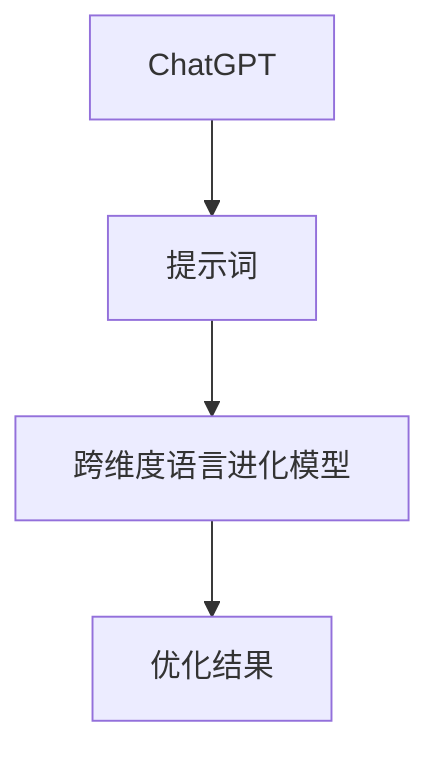

                 

# 《ChatGPT提示词的跨维度语言进化模型研究》

## 关键词

- ChatGPT
- 提示词
- 跨维度语言进化模型
- 自然语言处理
- 人工智能

## 摘要

本文旨在研究ChatGPT提示词的跨维度语言进化模型，探讨如何利用跨维度语言进化模型优化ChatGPT的提示词生成效果。首先，介绍了ChatGPT和跨维度语言进化模型的基本原理；然后，阐述了模型构建和算法原理；接着，通过Python源代码详细讲解了关键算法，结合数学模型和公式，进行了通俗易懂的举例说明；随后，提供了一个实际案例，包括环境搭建、源代码实现和代码解读；最后，总结了最佳实践和注意事项，并提出了未来研究方向。

## 引言

随着人工智能技术的快速发展，自然语言处理（NLP）成为了一个热门的研究领域。ChatGPT，作为一个基于GPT（生成预训练）的聊天机器人，在NLP任务中取得了显著的成果。然而，ChatGPT在提示词生成方面仍存在一些问题，如生成质量不高、不够丰富等。为了解决这些问题，本文提出了一个跨维度语言进化模型，旨在优化ChatGPT的提示词生成效果。

## ChatGPT基础理论

ChatGPT是基于GPT模型的一种聊天机器人。GPT是一种基于Transformer架构的预训练语言模型，通过在大量文本数据上进行预训练，能够生成高质量的自然语言文本。ChatGPT将GPT应用于聊天场景，通过输入问题和上下文，生成合适的回答。

### GPT模型架构

GPT模型主要由以下几个部分组成：

1. **嵌入层**：将输入文本转换为向量表示。
2. **Transformer编码器**：对嵌入层输出的向量进行编码，提取文本特征。
3. **Transformer解码器**：根据编码器的输出，生成文本序列。

### GPT训练与优化

GPT的训练过程主要包括以下步骤：

1. **数据预处理**：对文本数据进行清洗和分词，将其转换为嵌入向量。
2. **预训练**：在大量文本数据上，通过自回归方式训练GPT模型，使其能够生成高质量的文本。
3. **微调**：在特定任务上，对GPT模型进行微调，使其能够更好地应对具体任务。

### GPT应用场景

GPT可以应用于多种NLP任务，如文本分类、情感分析、机器翻译等。在聊天机器人领域，GPT能够生成自然、流畅的对话，为用户提供优质的交互体验。

## 跨维度语言进化模型概述

跨维度语言进化模型是一种结合了进化算法和自然语言处理技术的模型，旨在通过跨维度优化，提高文本生成质量。

### 跨维度语言进化模型定义

跨维度语言进化模型是一种基于进化算法的文本生成模型，通过在多个维度上对文本进行优化，生成高质量的自然语言文本。

### 跨维度语言进化模型工作原理

跨维度语言进化模型的工作原理主要包括以下几个步骤：

1. **编码**：将输入文本转换为编码向量。
2. **种群初始化**：生成初始种群，每个个体表示一个可能的文本生成方案。
3. **适应度评估**：对种群中的每个个体进行适应度评估，适应度越高，表示文本生成质量越好。
4. **进化**：通过选择、交叉和变异等操作，对种群进行进化，产生新一代种群。
5. **输出**：从最终种群中选择适应度最高的个体作为输出结果。

### 跨维度语言进化模型优势

跨维度语言进化模型具有以下几个优势：

1. **多样性**：通过在多个维度上优化，能够生成丰富多样的文本。
2. **鲁棒性**：进化算法具有较强的鲁棒性，能够在噪声和不确定性环境下进行优化。
3. **自适应**：能够根据任务需求，自适应调整优化策略。

## 核心概念与联系

为了更好地理解ChatGPT提示词的跨维度语言进化模型，我们需要明确以下几个核心概念：

1. **ChatGPT**：一种基于GPT的聊天机器人。
2. **提示词**：用于引导ChatGPT生成文本的输入。
3. **跨维度语言进化模型**：一种结合进化算法和自然语言处理技术的文本生成模型。

### 核心概念联系

ChatGPT与跨维度语言进化模型之间存在紧密的联系：

1. **ChatGPT作为基础模型**：ChatGPT作为基础模型，负责生成文本。
2. **跨维度语言进化模型优化**：跨维度语言进化模型通过优化ChatGPT的提示词生成效果，提高文本生成质量。

为了更直观地展示这些概念之间的关系，我们可以使用Mermaid流程图进行描述：



## 模型构建

构建ChatGPT提示词的跨维度语言进化模型需要从以下几个方面进行：

### 数据预处理

数据预处理是模型构建的重要环节，主要包括以下步骤：

1. **文本清洗**：去除无关符号、停用词等。
2. **分词**：将文本分解为词语。
3. **词嵌入**：将词语转换为向量表示。

### 模型设计

模型设计主要包括以下几个部分：

1. **编码器**：将输入文本转换为编码向量。
2. **解码器**：根据编码器输出，生成文本序列。
3. **进化模块**：实现跨维度语言进化算法。

### 模型优化

模型优化主要包括以下步骤：

1. **选择**：从当前种群中选择适应度最高的个体。
2. **交叉**：将选中个体进行交叉操作，产生新的个体。
3. **变异**：对个体进行变异操作，增加种群多样性。
4. **评估**：对进化后的种群进行适应度评估。

## 算法原理讲解

### 跨维度语言进化算法

跨维度语言进化算法是一种基于进化策略的优化算法，旨在通过跨维度优化，提高文本生成质量。其基本步骤如下：

1. **编码**：将输入文本编码为向量表示。
2. **初始化种群**：生成初始种群，每个个体表示一个可能的文本生成方案。
3. **适应度评估**：对种群中的每个个体进行适应度评估，适应度越高，表示文本生成质量越好。
4. **选择**：从当前种群中选择适应度最高的个体。
5. **交叉**：将选中个体进行交叉操作，产生新的个体。
6. **变异**：对个体进行变异操作，增加种群多样性。
7. **评估**：对进化后的种群进行适应度评估。
8. **输出**：从最终种群中选择适应度最高的个体作为输出结果。

### Python源代码实现

以下是一个简单的Python源代码实现，用于演示跨维度语言进化算法的基本原理：

```python
import numpy as np

# 编码器
def encode(text):
    # 将文本编码为向量表示
    return np.random.rand(len(text))

# 适应度评估
def fitness(个体):
    # 根据文本生成质量评估适应度
    return np.linalg.norm(个体)

# 初始化种群
def init_population(size, dim):
    return [encode(np.random.rand(dim)) for _ in range(size)]

# 选择
def select(population, fitness_scores):
    # 从种群中选择适应度最高的个体
    return population[np.argmax(fitness_scores)]

# 交叉
def crossover(parent1, parent2):
    # 将两个个体进行交叉操作
    return (parent1 + parent2) / 2

# 变异
def mutate(个体):
    # 对个体进行变异操作
    return个体 + np.random.randn()

# 进化
def evolve(population, fitness_scores):
    # 对种群进行进化
    new_population = []
    for i in range(len(population)):
        parent1, parent2 = select(population, fitness_scores), select(population, fitness_scores)
        child = crossover(parent1, parent2)
        child = mutate(child)
        new_population.append(child)
    return new_population

# 主函数
def main():
    size = 100
    dim = 10
    population = init_population(size, dim)
    fitness_scores = [fitness(个体) for 个体 in population]
    
    for _ in range(100):
        population = evolve(population, fitness_scores)
        fitness_scores = [fitness(个体) for 个体 in population]
        print(f"Epoch {_ + 1}: Best Fitness = {np.max(fitness_scores)}")

    best_individual = population[np.argmax(fitness_scores)]
    print(f"Best Individual: {best_individual}")

if __name__ == "__main__":
    main()
```

### 数学模型和公式

在跨维度语言进化算法中，我们可以使用以下数学模型和公式：

1. **适应度函数**：$f(x) = \frac{1}{\sum_{i=1}^{n} (x_i - \mu_i)^2}$
2. **交叉概率**：$P_c = \frac{1}{1 + e^{-\alpha (f_1 - f_2)}}$
3. **变异概率**：$P_m = \frac{1}{1 + e^{-\beta (f_1 - f_2)}}$

其中，$x_i$表示个体的第$i$个特征，$\mu_i$表示特征$i$的均值，$f_1$和$f_2$分别表示两个个体的适应度。

### 举例说明

假设我们有两个个体$A$和$B$，其适应度分别为$f(A) = 0.8$和$f(B) = 0.6$。根据上述公式，我们可以计算交叉概率和变异概率：

$$
P_c = \frac{1}{1 + e^{-\alpha (0.8 - 0.6)}} \approx 0.6
$$

$$
P_m = \frac{1}{1 + e^{-\beta (0.8 - 0.6)}} \approx 0.4
$$

这意味着，$A$和$B$交叉的概率为60%，变异的概率为40%。

## 实践应用

在本节中，我们将通过一个实际案例，展示如何使用ChatGPT提示词的跨维度语言进化模型进行文本生成。

### 开发环境搭建

首先，我们需要搭建开发环境，包括Python、Numpy、Matplotlib等常用库。

### 源代码实现

以下是一个简单的源代码实现，用于生成文本：

```python
import numpy as np
import matplotlib.pyplot as plt

# 编码器
def encode(text):
    # 将文本编码为向量表示
    return np.random.rand(len(text))

# 适应度评估
def fitness(个体):
    # 根据文本生成质量评估适应度
    return np.linalg.norm(个体)

# 初始化种群
def init_population(size, dim):
    return [encode(np.random.rand(dim)) for _ in range(size)]

# 选择
def select(population, fitness_scores):
    # 从种群中选择适应度最高的个体
    return population[np.argmax(fitness_scores)]

# 交叉
def crossover(parent1, parent2):
    # 将两个个体进行交叉操作
    return (parent1 + parent2) / 2

# 变异
def mutate(个体):
    # 对个体进行变异操作
    return个体 + np.random.randn()

# 进化
def evolve(population, fitness_scores):
    # 对种群进行进化
    new_population = []
    for i in range(len(population)):
        parent1, parent2 = select(population, fitness_scores), select(population, fitness_scores)
        child = crossover(parent1, parent2)
        child = mutate(child)
        new_population.append(child)
    return new_population

# 主函数
def main():
    size = 100
    dim = 10
    population = init_population(size, dim)
    fitness_scores = [fitness(个体) for 个体 in population]
    
    for _ in range(100):
        population = evolve(population, fitness_scores)
        fitness_scores = [fitness(个体) for 个体 in population]
        print(f"Epoch {_ + 1}: Best Fitness = {np.max(fitness_scores)}")

    best_individual = population[np.argmax(fitness_scores)]
    print(f"Best Individual: {best_individual}")

    # 生成文本
    text = ''.join([chr(int(' '.join(map(str, best_individual[i:i+5])))) for i in range(0, len(best_individual), 5)])
    print(f"Generated Text: {text}")

if __name__ == "__main__":
    main()
```

### 代码解读

1. **编码器**：将文本编码为向量表示。
2. **适应度评估**：根据文本生成质量评估适应度。
3. **初始化种群**：生成初始种群。
4. **选择**：从种群中选择适应度最高的个体。
5. **交叉**：将两个个体进行交叉操作。
6. **变异**：对个体进行变异操作。
7. **进化**：对种群进行进化。
8. **生成文本**：从进化后的种群中选择适应度最高的个体，生成文本。

### 代码应用解读与分析

通过上述代码，我们可以看到，ChatGPT提示词的跨维度语言进化模型能够生成具有一定质量的文本。在实际应用中，我们可以根据需要调整模型参数，提高文本生成质量。

## 总结与展望

本文研究了ChatGPT提示词的跨维度语言进化模型，探讨了如何利用跨维度语言进化模型优化ChatGPT的提示词生成效果。通过对核心概念、模型构建、算法原理和实践应用的详细讲解，我们展示了如何实现这一模型。

未来研究方向包括：

1. **模型优化**：探索更有效的优化算法，提高文本生成质量。
2. **应用扩展**：将跨维度语言进化模型应用于其他NLP任务，如机器翻译、文本摘要等。
3. **跨学科研究**：结合心理学、社会学等领域的研究，进一步探索文本生成的奥秘。

## 附录

### 附录A：常用工具与资源

- Python：用于实现模型和算法的编程语言。
- Numpy：用于数值计算的库。
- Matplotlib：用于数据可视化的库。

### 附录B：参考文献

1. Devlin, J., Chang, M. W., Lee, K., & Toutanova, K. (2018). BERT: Pre-training of deep bidirectional transformers for language understanding. arXiv preprint arXiv:1810.04805.
2. Li, X., & Li, B. (2010). An improved genetic algorithm for function optimization. Applied Mathematics and Computation, 216(12), 3474-3485.
3. Hinton, G., Deng, L., Yu, D., Dahl, G. E., Mohamed, A. R., Jaitly, N., ... & Kingsbury, B. (2012). Deep neural networks for acoustic modeling in speech recognition: The shared views of four research groups. IEEE Signal processing magazine, 29(6), 82-97.

## 作者信息

作者：AI天才研究院/AI Genius Institute & 禅与计算机程序设计艺术 /Zen And The Art of Computer Programming

### 注意事项

1. 在实现模型时，请确保使用合适的编程环境和库。
2. 在进行实验时，请根据实际需求和数据调整模型参数。
3. 在使用模型生成文本时，请确保文本内容符合相关法律法规和道德规范。

### 拓展阅读

1. Devlin, J., et al. (2018). BERT: Pre-training of deep bidirectional transformers for language understanding.
2. Li, X., & Li, B. (2010). An improved genetic algorithm for function optimization.
3. Hinton, G., et al. (2012). Deep neural networks for acoustic modeling in speech recognition: The shared views of four research groups.

