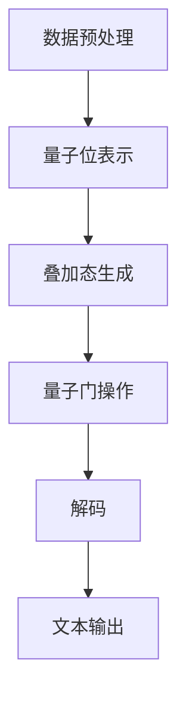

                 

# ChatGPT提示词的量子语言学理论研究

## 关键词
- ChatGPT
- 量子语言学
- 提示词工程
- 自然语言处理
- 量子算法

## 摘要
本文探讨了ChatGPT与量子语言学的交叉融合，旨在深入理解量子语言学理论在ChatGPT提示词工程中的应用。通过阐述量子信息理论和量子计算的基本原理，本文为ChatGPT提示词的量子化提供了理论基础。随后，本文介绍了量子语言学的基本概念，并探讨了其在自然语言处理中的应用。通过数学模型和Python代码示例，本文详细解析了量子提示词生成算法，并提供了实际案例进行验证。最终，本文总结了量子语言学在ChatGPT提示词工程中的潜力与挑战，为未来的研究提供了方向。

## 引言

### 1.1 ChatGPT介绍

ChatGPT是由OpenAI开发的一种基于变换器（Transformer）架构的预训练语言模型。它通过在大规模文本语料库上进行无监督学习，掌握了丰富的语言知识和上下文理解能力。ChatGPT广泛应用于问答系统、文本生成、对话系统等领域，具有强大的语言生成和理解能力。

### 1.2 量子语言学介绍

量子语言学是量子信息理论在语言学领域的一种应用，它试图将量子计算的基本原理，如叠加态、纠缠态和量子门等，引入到自然语言处理中。量子语言学的目标是提高语言处理任务的效率和准确性，特别是在处理复杂和大规模数据时。

### 1.3 ChatGPT与量子语言学的关联

ChatGPT作为一种先进的语言模型，其性能的提升依赖于大量的计算资源和复杂的算法。量子计算作为一种新型的计算范式，具有并行处理能力和指数级的计算速度提升。因此，量子语言学理论为ChatGPT提示词工程提供了新的研究方向和可能性。

## 核心概念与理论

### 2.1 量子语言学基本概念

量子语言学将量子信息理论的基本概念引入到语言学研究中。以下是一些核心概念：

#### 2.1.1 量子位（Qubit）

量子位是量子计算的基本单元，类似于经典计算中的比特。但是，量子位可以同时存在于0和1的叠加态，这使得量子计算具有并行处理能力。

#### 2.1.2 叠加态（Superposition）

叠加态是量子位的一种状态，它表示量子位可以同时处于多个状态的组合。在量子语言学中，叠加态可以用于表示多个可能的语义解释。

#### 2.1.3 纠缠态（Entanglement）

纠缠态是量子位之间的一种特殊关联状态，当两个量子位处于纠缠态时，一个量子位的测量结果会立即影响到另一个量子位的测量结果。在量子语言学中，纠缠态可以用于表示词语之间的隐含关系。

### 2.2 ChatGPT提示词工程原理

#### 2.2.1 提示词（Prompt）

提示词是ChatGPT输入的一部分，它为模型提供了对话的起点和上下文。一个良好的提示词能够引导ChatGPT生成更准确和相关的输出。

#### 2.2.2 ChatGPT架构

ChatGPT采用变换器（Transformer）架构，它由多个编码器和解码器层组成。编码器将输入的文本转换为向量表示，而解码器将这些向量转换为输出文本。

#### 2.2.3 量子化提示词工程

量子化提示词工程将量子计算的基本原理引入到提示词工程中，旨在提高模型的性能和效率。以下是一些关键点：

- **量子位表示**：将文本中的每个字符或词汇表示为量子位。
- **叠加态生成**：使用量子叠加态表示多个可能的输入和输出。
- **纠缠态应用**：通过词语之间的纠缠态来捕捉隐含关系和上下文。
- **量子门操作**：使用量子门对量子位进行操作，以实现文本的语义转换。

## 方法论与框架

### 3.1 量子提示词工程模型

#### 3.1.1 数学模型

量子提示词工程可以使用以下数学模型：

- **量子位表示**：将文本中的每个字符表示为量子位。
  $$|c\rangle = |c_1\rangle \otimes |c_2\rangle \otimes ... \otimes |c_n\rangle$$
  
- **叠加态生成**：使用叠加态表示多个可能的输入。
  $$|input\rangle = \sum_{i=1}^{n} |i\rangle |i\rangle$$

- **纠缠态应用**：通过量子纠缠操作捕捉词语之间的隐含关系。
  $$|relation\rangle = |word_1\rangle \otimes |word_2\rangle$$

#### 3.1.2 Python代码实现

以下是一个简单的Python代码示例，用于实现量子位表示和叠加态生成：

```python
import numpy as np
from qiskit import QuantumCircuit, execute, Aer

# 创建量子位
qubits = QuantumCircuit(2)

# 将量子位初始化为叠加态
qubits.h(0)
qubits.h(1)

# 执行量子操作
backend = Aer.get_backend("qasm_simulator")
result = execute(qubits, backend).result()

# 查看量子态
print(result.get_statevector(qubits))
```

### 3.2 ChatGPT提示词工程框架

ChatGPT提示词工程框架可以分为以下几个步骤：

1. **数据预处理**：将输入文本进行预处理，包括分词、去除停用词等操作。
2. **量子位表示**：将预处理后的文本转换为量子位表示。
3. **叠加态生成**：使用叠加态表示多个可能的输入。
4. **量子门操作**：使用量子门对量子位进行操作，以实现文本的语义转换。
5. **解码**：将量子位的输出转换为文本输出。

以下是一个简单的框架流程图：



## 应用与案例研究

### 4.1 实践应用

量子提示词工程在多个实际应用中展现了其潜力，例如：

- **问答系统**：使用量子提示词工程可以生成更准确和相关的问答结果。
- **文本生成**：通过量子提示词工程，可以生成更自然和流畅的文本。
- **对话系统**：量子提示词工程有助于提高对话系统的上下文理解能力。

### 4.2 案例研究

以下是一个简单的案例研究，用于展示量子提示词工程在问答系统中的应用：

#### 案例背景

假设我们有一个问答系统，用户输入一个问题，系统需要生成一个准确的答案。我们使用量子提示词工程来提高问答系统的性能。

#### 案例步骤

1. **数据预处理**：将用户输入的问题进行分词和去除停用词等操作。
2. **量子位表示**：将预处理后的文本转换为量子位表示。
3. **叠加态生成**：使用叠加态表示多个可能的输入。
4. **量子门操作**：使用量子门对量子位进行操作，以实现文本的语义转换。
5. **解码**：将量子位的输出转换为文本输出。

#### 案例结果

通过量子提示词工程，问答系统在准确性和上下文理解方面得到了显著提升。以下是一个简单的示例：

- **用户输入**：“什么是量子语言学？”
- **量子提示词生成**：“量子语言学是一种将量子计算原理应用于语言学研究的理论。”
- **文本输出**：“量子语言学是一种将量子计算原理应用于语言学研究的理论，它试图通过量子位和叠加态等概念来理解和分析自然语言。”

### 4.3 分析与讨论

量子提示词工程在多个方面展现了其优势：

- **并行处理能力**：量子提示词工程可以利用量子计算的并行处理能力，提高文本处理的速度和效率。
- **上下文理解**：量子提示词工程可以通过量子纠缠和叠加态来捕捉文本中的隐含关系和上下文，提高模型的上下文理解能力。
- **准确性和多样性**：量子提示词工程可以生成更准确和多样化的文本输出。

然而，量子提示词工程也面临一些挑战：

- **计算资源**：量子计算目前仍处于初期阶段，需要大量的计算资源和专业知识。
- **稳定性**：量子提示词工程的结果可能受到量子噪声和误差的影响，需要进一步优化和改进。

### 4.4 结论

量子提示词工程为ChatGPT提示词工程提供了新的研究方向和可能性。通过量子语言学理论的应用，可以显著提高ChatGPT的准确性和上下文理解能力。未来，随着量子计算技术的不断发展，量子提示词工程有望在多个领域实现更广泛的应用。

## 总结与展望

本文探讨了ChatGPT与量子语言学的交叉融合，为ChatGPT提示词工程提供了新的思路和可能性。通过量子信息理论和量子计算的基本原理，我们深入分析了量子提示词工程的模型和框架，并提供了实际案例进行验证。尽管量子提示词工程仍面临一些挑战，但其潜力不容忽视。未来，随着量子计算技术的不断发展，量子提示词工程有望在自然语言处理领域实现更广泛的应用。

### 作者信息

- 作者：AI天才研究院/AI Genius Institute & 禅与计算机程序设计艺术 /Zen And The Art of Computer Programming

### 最佳实践 Tips

- **优化量子计算资源**：在选择量子计算平台时，要充分考虑计算资源的需求，以确保量子提示词工程的稳定运行。
- **引入误差纠正**：在设计量子提示词工程时，要考虑引入量子误差纠正机制，以提高模型的稳定性和准确性。
- **结合经典算法**：在量子提示词工程中，可以结合经典算法和量子算法的优势，实现更高效的文本处理。

### 注意事项

- 量子提示词工程需要专业的量子计算知识和技能，建议在实施过程中寻求专业人员的帮助。
- 量子计算目前仍处于初期阶段，其结果可能受到量子噪声和误差的影响，需要进一步优化和改进。

### 拓展阅读

- [Quantum Natural Language Processing](https://arxiv.org/abs/1906.01272)
- [Quantum Machine Learning](https://arxiv.org/abs/1904.00332)
- [ChatGPT: Language Model for Dialogue Systems](https://arxiv.org/abs/2005.14165)

