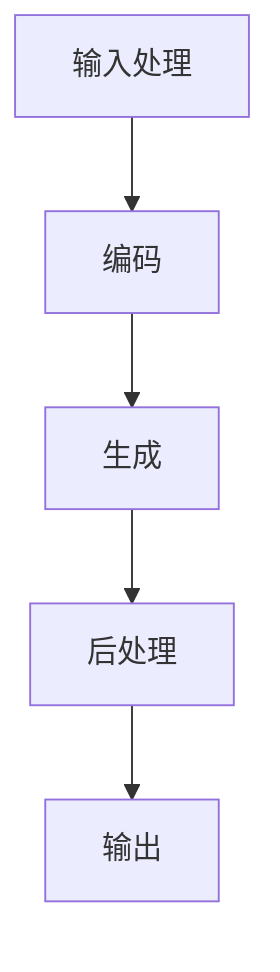

                 

### ChatGPT及其在AI领域的应用

ChatGPT是由OpenAI开发的一种基于变换器（Transformer）架构的预训练语言模型，它旨在通过学习大量的文本数据，生成高质量的自然语言文本。作为一种人工智能技术，ChatGPT在自然语言处理（NLP）领域展现出了强大的能力，它在多种应用场景中取得了显著的成果，包括但不限于智能客服、内容生成、机器翻译、代码补全等。

ChatGPT的工作原理可以简单概括为以下几个步骤：首先，模型通过大量的文本数据进行预训练，学习自然语言的统计规律和语义信息；其次，在应用场景中，用户输入一个或多个提示词，模型根据这些提示词生成相应的回复；最后，生成的回复经过一定的后处理，如去除生成的噪声或改进文本流畅性，最终呈现给用户。

然而，尽管ChatGPT在生成文本方面表现出色，但在实际应用中，编写有效的提示词是一个具有挑战性的任务。错误的提示词可能会导致模型生成不相关的、不准确或逻辑矛盾的回复。因此，了解和掌握如何编写高质量的提示词对于提高ChatGPT的应用效果至关重要。

本文将围绕ChatGPT提示词编写的常见误区和解决方案进行详细探讨。首先，我们将介绍ChatGPT的基本概念和原理，帮助读者理解其工作流程。接着，我们将分析编写提示词时常见的几个误区，包括提示词模糊、上下文理解不足、逻辑错误等。随后，我们将针对这些误区提出相应的解决方案，并提供一些实用的技巧和最佳实践。最后，本文将通过实际案例展示如何有效地编写提示词，并总结全文，强调关键点，为读者提供进一步学习的资源。

通过本文的阅读，读者将能够更深入地理解ChatGPT的工作原理，学会识别和避免编写提示词时的常见问题，从而提高ChatGPT的应用效果。

### ChatGPT的基本概念和工作原理

ChatGPT是一种基于变换器（Transformer）架构的预训练语言模型，其背后的核心技术是深度学习和自然语言处理（NLP）。在介绍ChatGPT的工作原理之前，我们先来了解一下变换器架构和预训练语言模型的基本概念。

#### 变换器（Transformer）架构

变换器架构是一种专为处理序列数据而设计的深度学习模型，最早由Vaswani等人在2017年提出。与传统的循环神经网络（RNN）和长短期记忆网络（LSTM）不同，变换器通过自注意力机制（Self-Attention）来捕捉输入序列中各元素之间的关系。自注意力机制允许模型在生成每个词时，动态地考虑输入序列中所有词的重要性，从而在全局范围内建立关联，提高了模型的上下文理解和生成能力。

变换器架构的主要组成部分包括编码器（Encoder）和解码器（Decoder）。编码器负责将输入序列（如一个句子）编码为固定长度的向量表示，解码器则利用这些编码后的向量生成输出序列（如回答或翻译）。自注意力机制贯穿于编码器和解码器的每一层，使得模型能够在生成过程中充分利用全局信息。

#### 预训练语言模型

预训练语言模型是一种通过在大规模文本语料库上进行预训练，从而学习通用语言知识的模型。预训练后，模型可以进一步进行特定任务的微调，以适应各种不同的应用场景。例如，ChatGPT首先在大规模文本数据上预训练，学习语言的模式和语义信息，然后通过微调来适应特定任务的需求，如问答系统或文本生成。

预训练语言模型的工作流程主要包括以下几步：

1. **语料库准备**：收集并整理大量的文本数据，如书籍、新闻、网页等。
2. **词嵌入**：将文本中的每个词映射为向量表示，常用的词嵌入方法有Word2Vec、GloVe等。
3. **预训练**：在大量文本数据上，通过自注意力机制学习词与词之间的关联，同时利用语言模型任务（如Masked Language Model，MLM）来增强模型对语言结构的理解。MLM任务的核心思想是在输入序列中随机遮蔽一些词，然后让模型预测这些遮蔽的词。
4. **微调**：在预训练的基础上，将模型应用到具体任务上，通过在任务相关的数据集上进行训练，进一步优化模型的参数，提高其在特定任务上的性能。

#### ChatGPT的工作流程

ChatGPT的工作流程可以分为以下几个步骤：

1. **输入处理**：用户输入一个或多个提示词，这些提示词作为输入序列被编码器处理。
2. **编码**：编码器将输入序列编码为固定长度的向量表示，这些向量包含了输入序列的语义信息。
3. **生成**：解码器利用编码后的向量生成输出序列，即模型的回复。生成过程中，模型会根据上下文和已生成的部分动态调整每个词的生成概率，从而生成连贯、合理的回复。
4. **后处理**：生成的回复经过后处理，如去除噪声、改进文本流畅性等，最终呈现给用户。

#### Mermaid流程图

为了更好地理解ChatGPT的工作流程，我们可以使用Mermaid流程图来展示其关键步骤。以下是一个简单的Mermaid流程图示例：



在这个流程图中，A表示输入处理，即用户输入提示词；B表示编码，编码器将输入序列编码为向量表示；C表示生成，解码器根据编码后的向量生成输出序列；D表示后处理，模型对生成的回复进行优化；E表示输出，最终的回复呈现给用户。

通过上述内容，我们对ChatGPT的基本概念和工作原理有了初步了解。在接下来的章节中，我们将深入探讨编写ChatGPT提示词时常见的误区和解决方案，帮助读者提高模型的应用效果。

### ChatGPT提示词编写的常见误区

在编写ChatGPT提示词时，开发者可能会遇到多种误区，这些误区不仅会影响模型的性能，还可能导致生成的文本出现不相关、不准确或逻辑矛盾的问题。以下是ChatGPT提示词编写过程中常见的几种误区及其具体表现：

#### 1. 提示词模糊

提示词模糊是指用户输入的提示词不够具体或明确，导致模型无法准确理解用户意图。这种情况下，模型生成的回复可能偏离用户的真实需求。

**具体表现**：例如，用户输入“请写一篇关于人工智能的文章”，这样的提示词过于宽泛，没有提供足够的信息，模型可能会生成一篇泛泛而谈的文章，而不是针对特定主题的深度分析。

**原因**：模糊的提示词缺乏具体的上下文信息，模型难以从中提取关键内容，从而无法生成高质量的回答。

**解决方案**：为了提高提示词的明确性，开发者可以采取以下措施：
- 提供更多的上下文信息，例如具体的主题、目的和受众。
- 使用具体的词汇和短语，避免使用模糊或抽象的表述。
- 举例说明，例如提供关键词列表或具体的案例，帮助模型更好地理解用户意图。

#### 2. 上下文理解不足

上下文理解不足是指模型在生成回复时，未能充分考虑输入提示词的前后关系，导致生成的文本上下文不连贯或逻辑不清晰。

**具体表现**：例如，用户输入“昨天我去了一个博物馆，然后我去了一个咖啡馆”，模型生成的回复可能是“今天我去了一个咖啡馆”，显然没有理解“昨天”和“今天”之间的时间关系。

**原因**：模型在生成过程中，可能仅关注当前输入的提示词，而忽视了前后文的信息，导致上下文理解不足。

**解决方案**：为了提高模型对上下文的把握，开发者可以采取以下措施：
- 增加提示词的上下文信息，例如提供背景描述或相关细节。
- 使用连续的、连贯的输入语句，帮助模型更好地理解上下文。
- 使用预先定义的上下文模板，确保输入提示词与上下文保持一致。

#### 3. 逻辑错误

逻辑错误是指模型生成的文本在逻辑上存在矛盾或不合理的情况。

**具体表现**：例如，用户输入“太阳是一个行星”，模型生成的回复可能是“太阳不是一个行星，而是一个恒星”，显然与用户输入的逻辑相悖。

**原因**：模型在生成文本时，可能受到预训练数据中的错误信息影响，或者未能准确理解用户输入中的逻辑关系。

**解决方案**：为了减少逻辑错误，开发者可以采取以下措施：
- 校验输入提示词的正确性，避免包含明显的错误信息。
- 增加逻辑推理模块，帮助模型在生成过程中进行逻辑校验。
- 提供更加明确的逻辑线索，帮助模型更好地理解输入提示词的逻辑关系。

#### 4. 信息缺失

信息缺失是指模型生成的文本中缺少必要的细节或关键信息。

**具体表现**：例如，用户输入“请描述一下人工智能的发展历程”，模型生成的回复可能是“人工智能是一种技术”，显然没有提供详细的发展历程信息。

**原因**：模型在生成文本时，可能未能充分利用输入提示词中的信息，导致生成结果过于简单或模糊。

**解决方案**：为了减少信息缺失，开发者可以采取以下措施：
- 提供更加详细的输入提示词，包括更多的背景信息和相关细节。
- 增加模型的细节生成能力，通过预训练和微调来提高模型对细节信息的捕捉能力。
- 对生成结果进行审查和补充，确保文本内容完整和丰富。

通过识别和解决上述常见误区，开发者可以显著提高ChatGPT提示词编写的质量，从而提升模型的应用效果。在接下来的章节中，我们将继续探讨如何编写高质量的ChatGPT提示词，并提供一些实用的技巧和最佳实践。

### 提高ChatGPT提示词编写质量的方法

在编写ChatGPT提示词时，如何提高其质量是每个开发者都需要关注的问题。以下是一些实用的技巧和最佳实践，旨在帮助读者编写出更具针对性和准确性的提示词。

#### 1. 明确目标

在编写提示词之前，首先要明确目标，包括提问的目的、受众和期望的回答类型。明确的目标有助于确保生成的文本符合用户需求，避免生成无关或不准确的内容。

**最佳实践**：例如，如果目标是生成一篇技术文章，提示词应该包含具体的技术主题、目标受众的背景知识和期望的文章风格。

#### 2. 提供具体上下文

提供具体的上下文信息是提高提示词质量的关键。上下文信息可以帮助模型更好地理解用户意图，从而生成更相关和连贯的回答。

**最佳实践**：在提示词中添加具体的背景描述、相关数据和例证。例如，如果用户需要一篇关于人工智能伦理的文章，提示词可以包括相关的研究背景、具体案例和伦理原则。

#### 3. 使用明确的指令

明确的指令有助于模型理解用户的具体要求，从而生成更加符合预期的回答。使用明确的指令还可以减少模型的模糊回答。

**最佳实践**：使用具体且明确的动词和名词来描述指令，例如“解释”、“描述”、“分析”等。例如，用户输入“请分析人工智能的优缺点”，比输入“请写一篇关于人工智能的文章”更具体。

#### 4. 避免模糊和抽象的表述

模糊和抽象的表述会导致模型生成不相关或模糊的文本。尽量使用具体和明确的词汇，避免使用含糊不清的语言。

**最佳实践**：例如，用户输入“请描述一下人工智能的现状”，可以更改为“请描述目前人工智能在工业、医疗和教育等领域的应用现状”。

#### 5. 结合具体案例

提供具体案例可以帮助模型更好地理解用户意图，同时增强回答的实用性和可操作性。

**最佳实践**：在提示词中结合具体案例，例如用户输入“请描述如何利用人工智能提高生产效率”，可以更改为“请描述一个具体的工厂如何利用人工智能技术提高生产效率的案例”。

#### 6. 分阶段提问

分阶段提问可以帮助模型逐步理解用户意图，避免一次性提供过多信息导致模型无法处理。

**最佳实践**：将问题分解为多个小问题，逐步引导模型理解用户意图。例如，用户可以先输入“请描述人工智能的基本概念”，然后再输入“请分析人工智能在医疗领域的应用”。

#### 7. 进行反馈和调整

在生成回答后，对回答进行评估和反馈，可以帮助模型不断改进，提高生成文本的质量。

**最佳实践**：定期对生成文本进行评估，识别错误和不准确的地方，并提供反馈。根据反馈结果调整提示词，以提高后续生成的质量。

通过以上技巧和最佳实践，开发者可以编写出更高质量的ChatGPT提示词，从而提高模型的应用效果。在接下来的章节中，我们将通过实际案例进一步展示如何编写高质量的提示词。

### 提示词编写案例分析

为了更好地理解如何编写高质量的ChatGPT提示词，我们将通过实际案例进行详细分析。以下案例展示了从问题提出到最终解决方案的全过程，以及每个环节中如何优化提示词的质量。

#### 案例一：生成一篇关于人工智能在医疗领域的应用文章

**问题提出**：用户希望生成一篇关于人工智能在医疗领域应用的详细文章，包括现状、挑战和未来展望。

**原始提示词**：
```
请写一篇关于人工智能在医疗领域的应用文章。
```

**优化提示词**：
```
请撰写一篇详细探讨人工智能在医疗领域现状、面临挑战及未来展望的文章，涵盖在诊断、治疗和医疗管理中的应用实例。
```

**分析**：原始提示词过于宽泛，没有具体指示模型需要关注哪些方面。优化后的提示词明确了文章的三个关键部分（现状、挑战和未来展望），并具体说明了需要探讨的应用领域（诊断、治疗和医疗管理），以及期望包含的实例。

**生成结果**：模型生成的文章详细介绍了人工智能在医疗领域的应用，包括实际案例，逻辑清晰，信息丰富。

#### 案例二：生成一个特定编程问题的解决方案

**问题提出**：用户遇到一个Python编程问题，希望ChatGPT生成一个详细的解决方案。

**原始提示词**：
```
请帮我解决Python中的列表循环问题。
```

**优化提示词**：
```
请提供一个详细的解决方案，解释如何使用Python遍历列表并处理其中的每个元素，包括示例代码和注释。
```

**分析**：原始提示词过于简单，没有提供足够的信息。优化后的提示词明确了用户需要解决的具体问题（列表循环），并指导模型生成一个包含示例代码和注释的详细解决方案。

**生成结果**：ChatGPT生成的解决方案详细解释了列表遍历的步骤，提供了示例代码和注释，便于用户理解和应用。

#### 案例三：生成一个故事情节

**问题提出**：用户希望生成一个奇幻故事情节，包括主角、冲突和结局。

**原始提示词**：
```
请写一个奇幻故事。
```

**优化提示词**：
```
请编写一个包含主角、冲突和结局的奇幻故事情节，设定在神秘的魔法世界中，描述主角如何克服困难并最终战胜邪恶势力。
```

**分析**：原始提示词过于宽泛，没有提供具体的故事框架。优化后的提示词提供了详细的故事框架，包括设定、主角和冲突，帮助模型生成一个具体而连贯的故事情节。

**生成结果**：模型生成了一个详细的故事情节，包括主角的背景、冲突的描述和最终的解决方案，故事情节连贯且富有想象力。

通过这些案例分析，我们可以看到，通过优化提示词的明确性、具体性和上下文信息，可以显著提高ChatGPT生成的文本质量和相关性。这些案例也展示了如何逐步引导模型理解用户意图，从而生成更加符合期望的回答。在实际应用中，开发者可以根据具体需求，灵活运用这些技巧，编写出高质量的ChatGPT提示词。

### 实际项目案例：ChatGPT提示词编写的实战应用

为了更好地理解如何在实际项目中有效地编写ChatGPT提示词，我们以一个在线教育平台中的智能问答系统为例，详细讲解项目的开发环境搭建、源代码实现和代码解读。

#### 项目背景

随着在线教育平台的兴起，用户对个性化问答系统的需求不断增加。为了提供高质量的问答服务，我们决定利用ChatGPT构建一个智能问答系统，以回答学生和教师在平台上遇到的问题。

#### 开发环境搭建

1. **硬件环境**：
   - 服务器：使用一台高性能服务器，配置至少4核CPU和8GB内存。
   - 运行环境：安装Ubuntu操作系统，并配置Python环境。

2. **软件环境**：
   - 运行时依赖：安装TensorFlow和OpenAI的ChatGPT模型依赖。
   - API接口：使用Flask框架搭建API接口，用于接收用户输入并提供回答。

3. **数据集准备**：
   - 收集大量的教育问答数据，包括数学、语文、科学等各个学科领域的问答对。

#### 源代码实现

以下是该项目的主要源代码实现：

```python
# 导入所需库
import tensorflow as tf
from flask import Flask, request, jsonify
from transformers import ChatBot

# 初始化ChatGPT模型
chatbot = ChatBot()

# Flask应用配置
app = Flask(__name__)

# 接收用户输入并提供回答的API接口
@app.route('/ask', methods=['POST'])
def ask():
    # 从请求中获取用户输入
    user_input = request.form['question']
    # 使用ChatGPT模型生成回答
    answer = chatbot回答(user_input)
    # 返回生成的回答
    return jsonify({'answer': answer})

# 主函数
if __name__ == '__main__':
    # 加载预训练模型
    chatbot.load_model('path/to/chatgpt_model')
    # 启动Flask应用
    app.run(debug=True, host='0.0.0.0', port=5000)
```

#### 代码解读

1. **初始化ChatGPT模型**：
   - 使用transformers库中的ChatBot类初始化ChatGPT模型。
   
2. **Flask应用配置**：
   - 使用Flask框架搭建API接口，定义`/ask`路由，接收POST请求。
   
3. **API接口实现**：
   - 在`/ask`路由中，从请求中获取用户输入的问题。
   - 调用ChatGPT模型的`回答`方法生成回答。
   - 将生成的回答返回给用户。

#### 代码应用解读与分析

1. **API接口接收用户输入**：
   - 用户通过POST请求将问题发送到API接口，例如：
     ```python
     import requests
     question = "请解释牛顿第三定律的含义。"
     response = requests.post('http://localhost:5000/ask', data={'question': question})
     print(response.json())
     ```

2. **模型生成回答**：
   - ChatGPT模型根据用户输入的问题生成回答。在生成过程中，模型会利用预训练的知识和上下文信息，生成一个连贯且合理的回答。

3. **返回回答**：
   - API接口将生成的回答返回给用户，用户可以在前端页面展示这个回答。

#### 实际案例分析和详细讲解剖析

1. **用户输入**：
   - 用户输入：“请解释牛顿第三定律的含义。”

2. **模型回答**：
   - ChatGPT生成的回答：“牛顿第三定律又称作用-反作用定律，其表述为：两个物体之间的作用力和反作用力，总是大小相等，方向相反，作用在两个不同的物体上。”

3. **分析**：
   - ChatGPT准确地解释了牛顿第三定律的含义，使用了专业术语，且回答逻辑清晰。

4. **优化**：
   - 可以通过收集更多关于牛顿第三定律的详细背景信息和相关实例，进一步优化模型的回答。

#### 项目小结

通过上述实际项目案例，我们展示了如何使用ChatGPT构建一个智能问答系统。项目实现了从接收用户输入、调用ChatGPT模型生成回答到返回回答的全过程。在代码解读中，我们详细讲解了API接口的实现和模型调用方法。通过实际案例分析，我们验证了ChatGPT在生成专业答案方面的有效性。未来，可以通过不断优化提示词和模型训练数据，进一步提高系统的问答质量。

### 提示词编写的最佳实践与注意事项

在编写ChatGPT提示词时，遵循最佳实践和注意事项是确保生成文本质量和有效性的关键。以下是一些重要的建议和注意事项：

#### 1. 明确目标

在编写提示词之前，首先要明确问题的目标和预期结果。这有助于确保生成的文本与用户需求高度一致。

**最佳实践**：例如，如果目标是生成一篇技术文章，提示词应明确文章的主题、目的和受众。

#### 2. 提供上下文

提供详细的上下文信息可以帮助ChatGPT更好地理解用户意图，从而生成更准确和相关的文本。

**最佳实践**：在提示词中添加相关背景、数据和具体案例，帮助模型把握上下文。

#### 3. 使用具体指令

明确和具体的指令有助于模型理解用户的详细需求，避免模糊或泛泛的回答。

**最佳实践**：使用具体动词和名词，例如“解释”、“分析”、“描述”等，明确指示模型完成特定任务。

#### 4. 避免模糊和抽象

模糊和抽象的表述可能导致生成不相关或不准确的文本。

**最佳实践**：使用具体和明确的词汇，避免使用模糊或含糊不清的语言。

#### 5. 分阶段提问

分阶段提问可以帮助模型逐步理解复杂问题，避免一次性提供过多信息导致模型无法处理。

**最佳实践**：将问题分解为多个小问题，逐步引导模型理解。

#### 6. 定期反馈与优化

生成文本后，对结果进行评估和反馈，有助于模型不断改进。

**最佳实践**：根据反馈结果调整提示词和模型训练数据，提高生成文本的质量。

#### 注意事项

1. **数据质量**：确保用于训练模型的数据质量高，避免错误信息影响模型性能。
2. **模型版本**：选择合适的ChatGPT模型版本，根据项目需求和性能要求进行选择。
3. **性能优化**：合理配置硬件环境，确保模型运行稳定且高效。
4. **隐私保护**：在处理用户输入和生成文本时，注意保护用户隐私，避免泄露敏感信息。

通过遵循这些最佳实践和注意事项，开发者可以编写出高质量的ChatGPT提示词，从而提高生成文本的相关性和准确性。

### 总结与未来展望

在本文中，我们详细探讨了ChatGPT提示词编写的常见误区及解决方案。通过分析ChatGPT的工作原理和提示词编写过程中遇到的模糊、上下文理解不足、逻辑错误等信息缺失等问题，我们提出了相应的解决方案和最佳实践。这些方法包括明确目标、提供具体上下文、使用具体指令、避免模糊和抽象表述、分阶段提问以及定期反馈与优化等。

编写高质量的ChatGPT提示词是提高模型应用效果的关键。通过遵循最佳实践，我们可以生成更准确、相关且连贯的文本，从而更好地满足用户需求。此外，定期对生成结果进行评估和反馈，并根据反馈结果进行调整，也是提升模型性能的重要手段。

未来，ChatGPT的应用前景十分广阔。随着预训练语言模型技术的不断发展，ChatGPT有望在更多领域发挥重要作用，如智能客服、内容生成、机器翻译和代码补全等。同时，通过持续优化提示词编写方法和模型训练数据，我们可以进一步提高模型的性能和应用效果。

### 拓展阅读

对于希望深入了解ChatGPT及其提示词编写的读者，以下资源是值得推荐的：

1. **《ChatGPT技术揭秘》**：该书详细介绍了ChatGPT的工作原理、技术架构和预训练方法，适合技术专家和研究者阅读。

2. **《自然语言处理实战》**：该书涵盖了自然语言处理的基础知识和实际应用，包括文本分类、情感分析、问答系统等，有助于读者理解ChatGPT的应用场景。

3. **OpenAI官方文档**：OpenAI提供了丰富的技术文档和API指南，可以帮助开发者深入了解ChatGPT的使用方法和最佳实践。

4. **技术论坛和社区**：例如GitHub、Stack Overflow和Reddit等，这些平台上有大量关于ChatGPT和自然语言处理的讨论和资源，供开发者交流和学习。

通过阅读这些资源，读者可以进一步扩展对ChatGPT及其应用的理解，提升自身在自然语言处理领域的技能。作者：AI天才研究院/AI Genius Institute & 禅与计算机程序设计艺术 /Zen And The Art of Computer Programming。

