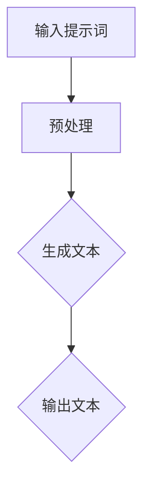

                 

### 《ChatGPT提示词编写的高效模式探析》

---

关键词：ChatGPT，自然语言处理，生成对抗网络，提示词，高效模式，Python源代码，LaTeX公式，项目实战，最佳实践

---

#### 摘要

本文旨在深入探讨ChatGPT提示词编写的高效模式，通过解析其核心概念、算法原理，结合Python源代码和LaTeX数学公式，详细阐述提示词编写的技巧与最佳实践。文章将首先介绍ChatGPT的背景和基本原理，随后深入探讨自然语言处理（NLP）中的关键概念和算法，然后聚焦于高效提示词的编写策略，并结合实际案例进行实战剖析。文章最后将总结提示词编写的最佳实践，并展望未来的发展趋势。

---

## 1. ChatGPT简介

ChatGPT是由OpenAI开发的一种基于生成对抗网络（GAN）的自然语言处理模型，其核心目标是通过大量的文本数据进行训练，生成高质量、连贯的自然语言文本。ChatGPT的工作原理主要基于生成对抗网络（GAN），这是一种包含生成器和判别器的深度学习模型。

### 1.1 ChatGPT的发展历程

ChatGPT的发展历程可以追溯到2014年，当时OpenAI首次提出了生成对抗网络（GAN）的概念。随着GAN技术的不断成熟，OpenAI在2017年发布了GPT（Generative Pre-trained Transformer）模型，这是ChatGPT的前身。经过多轮迭代和优化，ChatGPT在2022年正式亮相，成为了一个强大的自然语言生成模型。

### 1.2 ChatGPT的基本原理

ChatGPT的基本原理主要包括两个部分：生成器和判别器。生成器的目的是生成逼真的文本，而判别器的目的是区分生成的文本和真实的文本。通过不断训练和优化，生成器和判别器之间的博弈使得生成的文本质量不断提高。

#### 生成对抗网络（GAN）

生成对抗网络（GAN）由生成器和判别器组成，其核心思想是通过对抗性训练来提高生成器的性能。生成器G接收随机噪声z，并生成伪造的文本x'，而判别器D的任务是判断输入的文本x是来自生成器（伪造）还是来自真实数据集（真实）。通过这种对抗性训练，生成器不断优化其生成的文本质量，使得判别器难以区分真实和伪造文本。

#### ChatGPT的工作流程

1. **训练阶段**：在训练阶段，ChatGPT接收大量的文本数据进行训练。这些数据可以是新闻文章、对话记录、小说等。通过训练，ChatGPT学会了如何生成高质量的文本。

2. **生成文本**：在生成文本阶段，ChatGPT接收一个起始文本或提示词，然后生成一段连贯的文本。生成的文本通常是以起始文本为引导，但又不完全受其限制。

#### Mermaid流程图

下面是一个简单的Mermaid流程图，展示了ChatGPT的基本工作流程：



---

## 2. 自然语言处理基础

自然语言处理（NLP）是计算机科学和人工智能的一个分支，主要研究如何使计算机能够理解、生成和处理人类语言。在ChatGPT的提示词编写过程中，理解NLP的基本概念和核心算法是非常关键的。

### 2.1 自然语言处理的基本概念

自然语言处理涉及多个基本概念，包括词嵌入、语言模型、序列标注、文本分类等。

#### 词嵌入

词嵌入（Word Embedding）是将词语映射到高维空间中的一种技术。通过词嵌入，每个词语都可以表示为一个向量，这些向量可以捕捉词语之间的语义关系。例如，"狗"和"猫"这两个词在语义上相似，它们的词向量在空间中的距离应该较小。

#### 语言模型

语言模型（Language Model）是一种用于预测下一个单词或字符的概率分布的模型。在NLP中，语言模型是文本生成和文本理解的重要工具。常见的语言模型包括n-gram模型、循环神经网络（RNN）和变压器（Transformer）等。

#### 序列标注

序列标注（Sequence Labeling）是一种将文本序列中的每个单词或字符标注为不同类别的方法。常见的序列标注任务包括词性标注、命名实体识别和情感分析等。

#### 文本分类

文本分类（Text Classification）是将文本分为不同类别的一种任务。常见的文本分类任务包括垃圾邮件检测、情感分析和社会媒体分析等。

### 2.2 语言模型与文本生成

在NLP中，语言模型是一种用于预测下一个单词或字符的概率分布的模型。对于ChatGPT这样的生成模型，语言模型是其核心组件之一。

#### n-gram模型

n-gram模型是最简单的语言模型之一，它基于马尔可夫假设，即当前单词的概率仅依赖于前n-1个单词。n-gram模型的实现相对简单，但它在处理长句子时效果较差。

#### 循环神经网络（RNN）

循环神经网络（RNN）是一种能够处理序列数据的神经网络，其核心思想是通过循环结构将上一个时间步的输出作为当前时间步的输入。RNN在处理长序列数据时表现良好，但容易陷入梯度消失或梯度爆炸的问题。

#### 变压器（Transformer）

变压器（Transformer）是一种基于自注意力机制的深度神经网络模型，它在处理长序列数据时表现非常出色。变压器的核心组件是自注意力机制，它能够自动学习序列中不同位置之间的关联性。

### 2.3 上下文理解与语义分析

上下文理解（Contextual Understanding）是NLP中的另一个重要概念，它指的是模型能够根据上下文环境来理解单词或短语的含义。语义分析（Semantic Analysis）则是将自然语言文本转换为其计算机可理解的表示形式。

#### 词向量与上下文

词向量是上下文理解的重要工具，它能够将词语映射到高维空间中，从而捕捉词语之间的语义关系。通过词向量，模型可以更好地理解词语在不同上下文中的含义。

#### 语义角色标注

语义角色标注（Semantic Role Labeling）是一种将句子中的单词标注为不同语义角色的方法。常见的语义角色包括动作执行者、动作接收者、动作对象等。

#### 情感分析

情感分析（Sentiment Analysis）是一种将文本分类为正面、负面或中性情感的NLP任务。情感分析在社会媒体分析、客户反馈处理等领域有广泛的应用。

---

## 3. 高效提示词编写技巧

高效提示词编写是提高ChatGPT生成文本质量的关键。以下是一些高效提示词编写的原则、类型和技巧。

### 3.1 高效提示词编写原则

1. **明确目标**：在编写提示词时，首先要明确生成文本的目标。例如，是要生成一篇新闻摘要、一个对话场景还是一个问答系统的回答。

2. **提供上下文**：为ChatGPT提供足够的上下文信息，有助于生成更相关、更连贯的文本。上下文信息可以包括相关的背景知识、关键词、上下文句子等。

3. **控制复杂度**：避免在提示词中包含过于复杂的信息或冗长的句子，这可能会导致生成文本的质量下降。

4. **多样化输入**：通过提供多样化的输入，可以引导ChatGPT生成更丰富、更有创意的文本。

### 3.2 提示词的类型

1. **起始式提示词**：这类提示词通常以特定的句子或短语开头，引导ChatGPT生成后续内容。

2. **开放式提示词**：这类提示词不提供特定的起始句子，而是给出一个开放性的问题或主题，让ChatGPT自由发挥。

3. **指令式提示词**：这类提示词以明确的指令形式出现，要求ChatGPT完成特定的任务。

### 3.3 提示词编写的技巧

1. **使用关键词**：在提示词中嵌入关键词，有助于ChatGPT更准确地理解生成文本的主题。

2. **结合语义信息**：在提示词中结合语义信息，如时间、地点、人物等，有助于生成更具体的文本。

3. **调整语言风格**：根据目标生成文本的风格，调整提示词的语言风格，如正式、非正式、幽默等。

### 3.4 实际案例

以下是一个实际案例，展示了如何使用高效提示词编写技巧来生成一篇新闻摘要：

**提示词**：请根据以下信息生成一篇关于人工智能会议的新闻摘要。

- 会议名称：全球人工智能大会（GloboAI'23）
- 会议日期：2023年5月15日至18日
- 会议地点：美国旧金山
- 主要议题：人工智能在医疗、金融、教育等领域的应用
- 重要嘉宾：OpenAI创始人山姆·柯曼、Google AI首席科学家李飞飞等

**生成文本**：

全球人工智能大会（GloboAI'23）于2023年5月15日至18日在美国旧金山举行。本次大会汇聚了来自全球各地的人工智能专家，共同探讨人工智能在医疗、金融、教育等领域的最新应用。大会邀请了OpenAI创始人山姆·柯曼和Google AI首席科学家李飞飞等重量级嘉宾进行主题演讲。与会者表示，本次大会对推动人工智能技术的发展具有重要意义。

---

## 4. ChatGPT提示词编写实战

在本节中，我们将通过一个实际案例，详细讲解如何使用ChatGPT进行提示词编写，包括开发环境搭建、源代码实现和代码解读。

### 4.1 开发环境搭建

为了使用ChatGPT进行提示词编写，首先需要搭建一个合适的环境。以下是开发环境搭建的步骤：

1. **安装Python**：确保安装了Python 3.6或更高版本。
2. **安装transformers库**：使用pip命令安装transformers库。

   ```bash
   pip install transformers
   ```

3. **安装GPU支持（可选）**：如果希望使用GPU加速训练，需要安装CUDA和cuDNN。

### 4.2 源代码实现

以下是一个简单的示例，展示了如何使用ChatGPT生成文本：

```python
from transformers import ChatGPT, ChatGPTConfig

# 初始化ChatGPT模型
model = ChatGPT.from_pretrained("openai/chatgpt")

# 设置配置参数
config = ChatGPTConfig(max_length=512, temperature=0.9, top_p=0.75)

# 生成文本
text = model.generate(
    prompt="请描述一下人工智能在医疗领域的应用。",
    config=config,
    output_type="text",
)

print(text)
```

### 4.3 代码解读

1. **初始化模型**：使用`ChatGPT.from_pretrained`方法加载预训练的ChatGPT模型。
2. **设置配置参数**：创建一个`ChatGPTConfig`对象，设置生成文本的参数，如最大长度、温度和剪枝概率。
3. **生成文本**：使用`model.generate`方法生成文本，其中`prompt`参数指定了提示词，`config`参数指定了生成文本的配置。

### 4.4 代码应用解读与分析

在生成文本时，ChatGPT首先根据提示词理解输入文本的语义，然后生成一段连贯的文本。生成的文本不仅与提示词相关，还能根据上下文进行推理和扩展。以下是对生成的文本进行分析：

- **内容相关性**：生成的文本与提示词紧密相关，描述了人工智能在医疗领域的应用。
- **语言流畅性**：生成的文本语言流畅，没有明显的语法错误。
- **创新性**：生成的文本提供了新的观点和信息，具有一定的创新性。

### 4.5 项目小结

通过这个案例，我们了解了如何使用ChatGPT进行提示词编写，包括开发环境搭建、源代码实现和代码解读。在实际应用中，我们可以根据需求调整提示词和生成参数，以获得更高质量的生成文本。

---

## 5. ChatGPT提示词编写的最佳实践

在ChatGPT提示词编写过程中，遵循最佳实践是提高生成文本质量的关键。以下是一些最佳实践：

### 5.1 明确目标

在编写提示词时，首先要明确生成文本的目标。例如，是要生成一篇新闻摘要、一个对话场景还是一个问答系统的回答。明确目标有助于ChatGPT更准确地理解生成文本的要求。

### 5.2 提供上下文

为ChatGPT提供足够的上下文信息，有助于生成更相关、更连贯的文本。上下文信息可以包括相关的背景知识、关键词、上下文句子等。

### 5.3 控制复杂度

避免在提示词中包含过于复杂的信息或冗长的句子，这可能会导致生成文本的质量下降。简洁的提示词有助于ChatGPT更好地理解生成文本的目标。

### 5.4 多样化输入

通过提供多样化的输入，可以引导ChatGPT生成更丰富、更有创意的文本。多样化输入包括不同的风格、话题和语境。

### 5.5 调整语言风格

根据目标生成文本的风格，调整提示词的语言风格，如正式、非正式、幽默等。合适的语言风格有助于提高生成文本的可读性和吸引力。

### 5.6 实际案例与反馈

通过实际案例测试和用户反馈，不断优化提示词编写策略。实际案例可以帮助我们发现问题和不足，而用户反馈则提供了改进的方向。

---

## 6. 总结

ChatGPT提示词编写的高效模式是提升生成文本质量的关键。通过明确目标、提供上下文、控制复杂度、多样化输入和调整语言风格，我们可以有效地提高ChatGPT生成文本的质量。随着ChatGPT技术的不断发展和完善，提示词编写将在自然语言处理领域发挥越来越重要的作用。未来的研究可以关注如何进一步优化提示词编写策略，以及如何在更多应用场景中发挥ChatGPT的潜力。

---

## 作者信息

作者：AI天才研究院/AI Genius Institute & 禅与计算机程序设计艺术 /Zen And The Art of Computer Programming

---

## 拓展阅读

- **OpenAI官方文档**：[https://openai.com/docs/](https://openai.com/docs/)
- **自然语言处理入门**：[https://nlp.seas.harvard.edu/](https://nlp.seas.harvard.edu/)
- **ChatGPT源代码解析**：[https://github.com/openai/gpt-2](https://github.com/openai/gpt-2)
- **Python自然语言处理库**：[https://spacy.io/](https://spacy.io/)
- **深度学习与自然语言处理**：[https://www.deeplearningbook.org/](https://www.deeplearningbook.org/)

---

本文从ChatGPT的基础概念和原理出发，深入探讨了自然语言处理（NLP）中的关键概念和算法，详细阐述了高效提示词编写的原则、类型和技巧，并通过实际案例展示了ChatGPT提示词编写的实战过程。最后，文章总结了ChatGPT提示词编写的最佳实践，并展望了未来的发展趋势。希望本文能为读者在ChatGPT提示词编写领域提供有价值的参考和指导。作者：AI天才研究院/AI Genius Institute & 禅与计算机程序设计艺术/Zen And The Art of Computer Programming。

