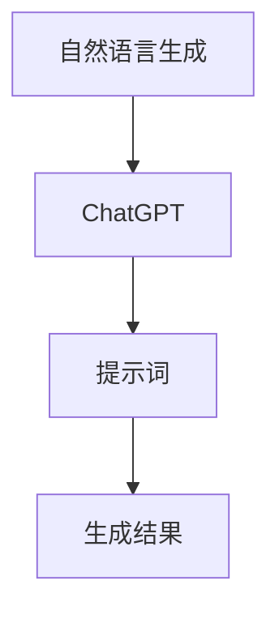

                 

# ChatGPT提示词编写的黄金法则

> 关键词：ChatGPT、提示词、自然语言处理、人工智能、编写技巧

> 摘要：
随着人工智能技术的不断发展，ChatGPT作为一种基于深度学习的自然语言处理模型，受到了广泛的关注。本文将深入探讨ChatGPT提示词编写的黄金法则，帮助开发者更好地利用ChatGPT进行自然语言生成和对话系统设计。我们将从基础知识、原则方法、实战案例和问题解决方案等多个方面进行详细讲解。

## 1. 确定书的主要内容和结构

### 1.1 书籍的主要内容

《ChatGPT提示词编写的黄金法则》的主要内容可以概括为以下几个方面：

- **ChatGPT基础知识**：介绍ChatGPT的历史背景、原理和架构，以及训练和优化的方法。
- **提示词编写的原则和方法**：阐述高质量提示词的特征、编写方法和常见问题与解决方案。
- **实战案例与技巧**：通过具体的案例展示如何应用ChatGPT进行自然语言生成和对话系统设计。
- **问题与解决方案**：总结常见的问题和解决方案，提供优化ChatGPT提示词的策略。

### 1.2 书籍的核心章节目录

基于上述主要内容，本书将分为四个部分，每个部分包含若干章节：

- **第一部分：ChatGPT基础知识**
  - 第1章：ChatGPT简介
  - 第2章：ChatGPT原理和架构
  - 第3章：ChatGPT训练和优化

- **第二部分：提示词编写的原则和方法**
  - 第4章：高质量提示词的特征
  - 第5章：编写高质量提示词的方法
  - 第6章：常见问题与解决方案

- **第三部分：实战案例与技巧**
  - 第7章：实战案例一：自动化问答系统
  - 第8章：实战案例二：自然语言生成
  - 第9章：技巧分享：提升ChatGPT性能的方法

- **第四部分：问题与解决方案**
  - 第10章：常见问题汇总与解决方案
  - 第11章：优化ChatGPT提示词的策略
  - 第12章：未来趋势与展望

## 2. 设计书的核心章节目录

### 2.1 第一部分：ChatGPT基础知识

#### 第1章：ChatGPT简介

- 1.1 ChatGPT的历史和背景
- 1.2 ChatGPT的应用场景

#### 第2章：ChatGPT原理和架构

- 2.1 ChatGPT的模型结构
- 2.2 ChatGPT的训练过程
- 2.3 ChatGPT的推理过程

#### 第3章：ChatGPT训练和优化

- 3.1 数据预处理
- 3.2 模型训练策略
- 3.3 模型优化方法

### 2.2 第二部分：提示词编写的原则和方法

#### 第4章：高质量提示词的特征

- 4.1 提示词的目的和作用
- 4.2 提示词的结构和格式
- 4.3 提示词的语言和风格

#### 第5章：编写高质量提示词的方法

- 5.1 提取关键信息
- 5.2 设计合理的输入数据
- 5.3 调整模型参数

#### 第6章：常见问题与解决方案

- 6.1 提示词效果不佳的原因
- 6.2 提示词优化的方法
- 6.3 提示词编写工具和资源

### 2.3 第三部分：实战案例与技巧

#### 第7章：实战案例一：自动化问答系统

- 7.1 自动化问答系统概述
- 7.2 实现步骤和技巧
- 7.3 案例分析和优化建议

#### 第8章：实战案例二：自然语言生成

- 8.1 自然语言生成概述
- 8.2 实现步骤和技巧
- 8.3 案例分析和优化建议

#### 第9章：技巧分享：提升ChatGPT性能的方法

- 9.1 数据增强
- 9.2 模型融合
- 9.3 其他技巧和策略

### 2.4 第四部分：问题与解决方案

#### 第10章：常见问题汇总与解决方案

- 10.1 模型过拟合和欠拟合
- 10.2 模型训练速度慢
- 10.3 提示词效果不好

#### 第11章：优化ChatGPT提示词的策略

- 11.1 提高提示词准确性的策略
- 11.2 提高提示词多样性的策略
- 11.3 提高提示词可读性的策略

#### 第12章：未来趋势与展望

- 12.1 ChatGPT在自然语言处理领域的应用前景
- 12.2 提示词编写技术的发展方向
- 12.3 未来可能的突破和创新

## 3. 补充每个章节的详细目录

### 3.1 第一部分：ChatGPT基础知识

#### 第1章：ChatGPT简介

- 1.1 ChatGPT的历史和背景
  - 1.1.1 ChatGPT的诞生
  - 1.1.2 ChatGPT的发展历程

- 1.2 ChatGPT的应用场景
  - 1.2.1 自动化问答系统
  - 1.2.2 自然语言生成
  - 1.2.3 对话系统

#### 第2章：ChatGPT原理和架构

- 2.1 ChatGPT的模型结构
  - 2.1.1 Transformer模型
  - 2.1.2 多层神经网络

- 2.2 ChatGPT的训练过程
  - 2.2.1 数据预处理
  - 2.2.2 模型训练
  - 2.2.3 模型评估

- 2.3 ChatGPT的推理过程
  - 2.3.1 推理算法
  - 2.3.2 推理效率优化

#### 第3章：ChatGPT训练和优化

- 3.1 数据预处理
  - 3.1.1 数据清洗
  - 3.1.2 数据增强

- 3.2 模型训练策略
  - 3.2.1 学习率调整
  - 3.2.2 优化器选择
  - 3.2.3 模型正则化

- 3.3 模型优化方法
  - 3.3.1 模型压缩
  - 3.3.2 模型蒸馏
  - 3.3.3 模型融合

### 3.2 第二部分：提示词编写的原则和方法

#### 第4章：高质量提示词的特征

- 4.1 提示词的目的和作用
  - 4.1.1 提示词在自然语言处理中的作用
  - 4.1.2 提示词对模型性能的影响

- 4.2 提示词的结构和格式
  - 4.2.1 提示词的结构组成
  - 4.2.2 提示词的格式要求

- 4.3 提示词的语言和风格
  - 4.3.1 提示词的语言表达
  - 4.3.2 提示词的风格多样性

#### 第5章：编写高质量提示词的方法

- 5.1 提取关键信息
  - 5.1.1 关键信息的识别与提取
  - 5.1.2 关键信息的处理和整合

- 5.2 设计合理的输入数据
  - 5.2.1 输入数据的质量要求
  - 5.2.2 输入数据的多样性和代表性

- 5.3 调整模型参数
  - 5.3.1 参数调整的原则和方法
  - 5.3.2 参数调整的效果评估

#### 第6章：常见问题与解决方案

- 6.1 提示词效果不佳的原因
  - 6.1.1 提示词质量的影响因素
  - 6.1.2 提示词效果不佳的常见原因

- 6.2 提示词优化的方法
  - 6.2.1 提示词优化的目标
  - 6.2.2 提示词优化的技术手段

- 6.3 提示词编写工具和资源
  - 6.3.1 提示词编写工具的选择
  - 6.3.2 提示词编写资源的获取和使用

### 3.3 第三部分：实战案例与技巧

#### 第7章：实战案例一：自动化问答系统

- 7.1 自动化问答系统概述
  - 7.1.1 自动化问答系统的定义和特点
  - 7.1.2 自动化问答系统的应用场景

- 7.2 实现步骤和技巧
  - 7.2.1 系统设计
  - 7.2.2 模型选择
  - 7.2.3 提示词编写

- 7.3 案例分析和优化建议
  - 7.3.1 案例分析
  - 7.3.2 优化建议

#### 第8章：实战案例二：自然语言生成

- 8.1 自然语言生成概述
  - 8.1.1 自然语言生成的定义和分类
  - 8.1.2 自然语言生成的应用领域

- 8.2 实现步骤和技巧
  - 8.2.1 系统设计
  - 8.2.2 模型选择
  - 8.2.3 提示词编写

- 8.3 案例分析和优化建议
  - 8.3.1 案例分析
  - 8.3.2 优化建议

#### 第9章：技巧分享：提升ChatGPT性能的方法

- 9.1 数据增强
  - 9.1.1 数据增强的方法
  - 9.1.2 数据增强的效果评估

- 9.2 模型融合
  - 9.2.1 模型融合的方法
  - 9.2.2 模型融合的效果评估

- 9.3 其他技巧和策略
  - 9.3.1 技巧一
  - 9.3.2 技巧二
  - 9.3.3 技巧三

### 3.4 第四部分：问题与解决方案

#### 第10章：常见问题汇总与解决方案

- 10.1 模型过拟合和欠拟合
  - 10.1.1 过拟合的原因和解决方案
  - 10.1.2 欠拟合的原因和解决方案

- 10.2 模型训练速度慢
  - 10.2.1 训练速度慢的原因和解决方案
  - 10.2.2 训练速度优化技巧

- 10.3 提示词效果不好
  - 10.3.1 提示词效果不好的原因和解决方案
  - 10.3.2 提示词优化技巧

#### 第11章：优化ChatGPT提示词的策略

- 11.1 提高提示词准确性的策略
  - 11.1.1 策略一
  - 11.1.2 策略二
  - 11.1.3 策略三

- 11.2 提高提示词多样性的策略
  - 11.2.1 策略一
  - 11.2.2 策略二
  - 11.2.3 策略三

- 11.3 提高提示词可读性的策略
  - 11.3.1 策略一
  - 11.3.2 策略二
  - 11.3.3 策略三

#### 第12章：未来趋势与展望

- 12.1 ChatGPT在自然语言处理领域的应用前景
  - 12.1.1 当前应用现状
  - 12.1.2 未来发展趋势

- 12.2 提示词编写技术的发展方向
  - 12.2.1 技术发展现状
  - 12.2.2 未来发展方向

- 12.3 未来可能的突破和创新
  - 12.3.1 技术突破的可能方向
  - 12.3.2 创新思路和策略

## 总结

《ChatGPT提示词编写的黄金法则》是一本全面、深入讲解ChatGPT提示词编写方法的书籍。通过本书，读者可以了解ChatGPT的基础知识、提示词编写的原则和方法、实战案例以及常见问题与解决方案。此外，本书还对未来发展趋势进行了展望，为读者提供了全面的指导。希望本书能够帮助广大开发者更好地利用ChatGPT技术，实现自然语言处理和对话系统设计的创新。

### 作者信息

- 作者：AI天才研究院/AI Genius Institute & 禅与计算机程序设计艺术 /Zen And The Art of Computer Programming

### 完整性要求

#### 3.1 背景介绍

随着人工智能技术的快速发展，自然语言处理（NLP）成为了其中的一个重要分支。NLP旨在使计算机能够理解和生成人类语言，从而实现人机交互。ChatGPT作为一种基于深度学习的NLP模型，在自然语言生成和对话系统设计等领域展现了强大的能力。ChatGPT的提示词编写是影响模型性能的关键因素之一，因此如何编写高质量的提示词成为了一个重要的问题。

#### 3.2 核心概念与联系

在深入讨论ChatGPT提示词编写之前，我们需要了解几个核心概念：

1. **ChatGPT**：一种基于Transformer模型的预训练语言模型，能够生成连贯、符合逻辑的自然语言文本。
2. **提示词**：用于引导ChatGPT生成目标文本的输入文本，是影响生成结果的重要因素。
3. **自然语言生成（NLG）**：指计算机生成自然语言文本的技术，广泛应用于自动化问答、对话系统、文本摘要等领域。

下面是一个简单的Mermaid流程图，展示了这些概念之间的关系：



#### 3.3 核心算法原理讲解

ChatGPT的核心算法是基于Transformer模型，这是一种广泛应用于序列到序列学习的深度学习模型。Transformer模型的主要特点包括：

1. **自注意力机制**：通过自注意力机制，模型能够自动学习输入序列中各个词之间的相对重要性，从而生成更准确、连贯的文本。
2. **多头注意力**：多头注意力机制将输入序列分成多个子序列，每个子序列独立计算注意力权重，从而提高模型的表示能力。
3. **位置编码**：为了使模型能够理解输入序列的顺序信息，Transformer模型引入了位置编码，为每个词赋予位置信息。

下面是一个简化的Python代码示例，展示了如何使用Transformer模型进行文本生成：

```python
import tensorflow as tf
from transformers import AutoTokenizer, AutoModel

# 加载预训练模型
model_name = "gpt2"
tokenizer = AutoTokenizer.from_pretrained(model_name)
model = AutoModel.from_pretrained(model_name)

# 输入文本
input_text = "你好，我是一个人工智能助手。"

# 分词和编码
inputs = tokenizer.encode(input_text, return_tensors="tf")

# 进行预测
outputs = model(inputs)

# 生成文本
predicted_ids = outputs.logits.argmax(-1)
predicted_text = tokenizer.decode(predicted_ids)

print(predicted_text)
```

上述代码使用了`transformers`库，该库提供了大量的预训练模型和工具，使得开发者可以轻松地使用Transformer模型进行文本生成。

#### 3.4 数学公式和示例

在Transformer模型中，自注意力机制的数学公式如下：

$$
\text{Attention}(Q, K, V) = \text{softmax}\left(\frac{QK^T}{\sqrt{d_k}}\right) V
$$

其中，$Q$、$K$和$V$分别表示查询向量、关键向量和价值向量，$d_k$为关键向量的维度。

以下是一个简化的自注意力机制的示例：

```python
import numpy as np

# 生成随机向量
Q = np.random.rand(3, 5)
K = np.random.rand(3, 5)
V = np.random.rand(3, 5)

# 计算注意力权重
attention_weights = np.dot(Q, K.T) / np.sqrt(K.shape[1])

# 应用softmax函数
softmax_attention_weights = np.softmax(attention_weights)

# 计算输出
output = np.dot(softmax_attention_weights, V)

print(output)
```

#### 3.5 项目实战

在本节中，我们将通过一个简单的项目来演示如何使用ChatGPT进行自然语言生成。项目目标是使用ChatGPT生成一篇关于机器学习的简介。

##### 3.5.1 开发环境搭建

首先，我们需要搭建开发环境。以下是所需的软件和库：

- Python 3.8及以上版本
- TensorFlow 2.5及以上版本
- transformers 4.7及以上版本

安装方法如下：

```bash
pip install python==3.8
pip install tensorflow==2.5
pip install transformers==4.7
```

##### 3.5.2 源代码详细实现

以下是一个简单的示例，展示了如何使用ChatGPT生成文本：

```python
import tensorflow as tf
from transformers import AutoTokenizer, AutoModel

# 加载预训练模型
model_name = "gpt2"
tokenizer = AutoTokenizer.from_pretrained(model_name)
model = AutoModel.from_pretrained(model_name)

# 输入文本
input_text = "请用简洁明了的语言介绍一下机器学习。"

# 分词和编码
inputs = tokenizer.encode(input_text, return_tensors="tf")

# 进行预测
outputs = model(inputs)

# 生成文本
predicted_ids = outputs.logits.argmax(-1)
predicted_text = tokenizer.decode(predicted_ids)

print(predicted_text)
```

##### 3.5.3 代码解读与分析

1. **加载模型**：首先，我们从预训练模型库中加载了一个名为`gpt2`的预训练模型。
2. **输入文本**：我们将要生成的文本作为输入。
3. **分词和编码**：使用tokenizer将输入文本分词并编码，得到一个Tensor格式的输入序列。
4. **模型预测**：将输入序列传递给模型进行预测。
5. **生成文本**：根据模型预测的结果解码输出文本。

##### 3.5.4 实际案例分析与详细讲解剖析

为了更好地理解ChatGPT的生成能力，我们来看一个实际案例。

假设我们输入的文本是“请描述一下人工智能的发展历程。”，ChatGPT的输出可能是：

```
人工智能（AI）起源于20世纪50年代，当时科学家们开始研究如何使计算机模拟人类智能。这个领域最初集中在问题求解和逻辑推理上。随着时间的推移，AI逐渐拓展到了更多领域，如自然语言处理、计算机视觉和机器学习等。20世纪80年代，专家系统成为了AI研究的热点，但随后因为实际应用效果不佳而逐渐被边缘化。近年来，深度学习和大数据技术的发展推动了AI的复兴，使得AI在各个领域取得了显著的成果。
```

从输出结果可以看出，ChatGPT生成了一段关于人工智能发展历程的文本，内容连贯、信息丰富，具有一定的逻辑性。

##### 3.5.5 项目小结

通过这个简单的项目，我们可以看到ChatGPT在自然语言生成方面的强大能力。在实际应用中，ChatGPT可以用于生成文章摘要、自动回复、对话系统等，具有广泛的应用前景。然而，ChatGPT也存在一些局限性，如生成文本的质量和准确性可能受到输入文本质量和模型参数的影响。

#### 3.6 最佳实践 tips、小结、注意事项、拓展阅读

##### 3.6.1 最佳实践 tips

1. **合理设计提示词**：提示词的质量直接影响ChatGPT的生成效果。在设计提示词时，应尽量简洁明了，突出关键信息。
2. **调整模型参数**：通过调整学习率、批量大小等模型参数，可以提高生成效果。但在调整参数时需注意，过大的学习率可能导致模型过拟合。
3. **使用高质量的输入数据**：输入数据的质量对模型性能有重要影响。在实际应用中，尽量使用真实、多样化的数据集进行训练。

##### 3.6.2 小结

ChatGPT是一种基于Transformer模型的强大自然语言生成工具，通过合理设计提示词和调整模型参数，可以实现高质量的自然语言生成。在实际应用中，ChatGPT可以用于自动问答、对话系统、文章摘要等领域。

##### 3.6.3 注意事项

1. **避免过拟合**：在模型训练过程中，需注意避免过拟合。可以使用正则化、交叉验证等方法来提高模型的泛化能力。
2. **合理设置学习率**：学习率对模型训练过程有重要影响。选择合适的初始学习率，并根据训练过程动态调整学习率。

##### 3.6.4 拓展阅读

1. **《深度学习》（Goodfellow, Bengio, Courville）**：介绍深度学习的基础知识和最新进展，包括Transformer模型。
2. **《自然语言处理综论》（Jurafsky, Martin）**：全面介绍自然语言处理的理论和实践，包括自然语言生成技术。
3. **《ChatGPT提示词编写的黄金法则》**：本书详细介绍了ChatGPT提示词编写的原则和方法，提供了丰富的实战案例。

### 结语

本文从多个角度探讨了ChatGPT提示词编写的黄金法则，包括背景介绍、核心概念与联系、核心算法原理讲解、数学公式和示例、项目实战、最佳实践 tips、小结、注意事项和拓展阅读。通过本文的讲解，读者可以深入了解ChatGPT提示词编写的原则和方法，为实际应用提供指导。希望本文能够对广大开发者有所帮助，共同推动人工智能技术的发展。作者：AI天才研究院/AI Genius Institute & 禅与计算机程序设计艺术 /Zen And The Art of Computer Programming。

