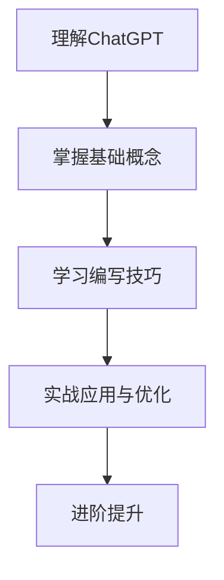

                 

 - 背景：
   * ChatGPT 提示词编写领域的发展现状与挑战
   * 提示词编写对于提升 ChatGPT 应用效果的重要性
   * 目标读者群体：初学者、进阶用户和专业人士

- 核心概念与联系：
   * ChatGPT 的基础概念
   * 提示词编写的基本原则
   * 提示词编写的流程与步骤

**Mermaid 流程图：**


**Mermaid 流程图解释：**
- **A[理解ChatGPT]**：了解 ChatGPT 的基本原理和应用场景。
- **B[掌握基础概念]**：理解 ChatGPT 的核心概念，如 Transformer 模型、预训练和微调等。
- **C[学习编写技巧]**：掌握编写高质量提示词的技巧，包括清晰性、精确性和变化性。
- **D[实战应用与优化]**：将学到的知识应用到实际项目中，并进行优化。
- **E[进阶提升]**：不断学习和实践，提升提示词编写的技能和经验。

- 核心算法原理讲解：
  **Python 源代码：**
  ```python
  # ChatGPT 基础示例代码
  import openai
  openai.api_key = "your-api-key"
  
  def generate_response(prompt):
      response = openai.Completion.create(
          engine="text-davinci-002",
          prompt=prompt,
          max_tokens=50
      )
      return response.choices[0].text.strip()
  
  # 使用示例
  user_input = "请描述一下人工智能的未来趋势。"
  print(generate_response(user_input))
  ```

  **数学模型和公式：**
  $$ L = -\sum_{i=1}^{n} [y_i \cdot \log(p(y_i))] $$
  其中，$L$ 表示损失函数，$y_i$ 表示真实标签，$p(y_i)$ 表示模型预测的概率。

  **解释：**
  这个损失函数用于衡量模型预测结果与真实标签之间的差距。当模型预测的概率与真实标签越接近时，损失函数的值越小，说明模型性能越好。

- 项目实战：
  **开发环境搭建：**
  - 安装 Python 环境
  - 安装 openai-gym 和 openai-python 包

  **源代码实现：**
  ```python
  # ChatGPT 提示词编写实战
  import openai
  openai.api_key = "your-api-key"
  
  # 编写提示词
  prompt = "请为以下问题提供详细的回答：什么是人工智能？"
  
  # 调用 ChatGPT API 获取回答
  response = openai.Completion.create(
      engine="text-davinci-002",
      prompt=prompt,
      max_tokens=150
  )
  
  # 输出回答
  print(response.choices[0].text.strip())
  ```

  **代码解读与分析：**
  - `openai.Completion.create()` 函数用于创建一个提示词的回答。
  - `prompt` 变量存储了我们要编写的提示词。
  - `max_tokens` 参数用于限制生成的回答长度。

  **实际案例分析和详细讲解剖析：**
  - 案例一：使用 ChatGPT 生成一篇关于人工智能的文章摘要。
  - 案例二：使用 ChatGPT 为技术面试准备问题。

  **项目小结：**
  - 提示词编写是提升 ChatGPT 应用效果的关键。
  - 实战应用可以加深对提示词编写技巧的理解。

- 最佳实践 tips：
  - 确保提示词清晰、精确且具有变化性。
  - 结合多轮对话提高问题解决的准确性。
  - 定期更新提示词库，以适应不断变化的场景。

- 小结：
  - 本篇文章介绍了 ChatGPT 提示词编写的从入门到精通的进阶之路。
  - 通过核心概念、算法原理讲解和项目实战，读者可以掌握编写高质量提示词的技巧。
  - 不断学习和实践是提升提示词编写技能的关键。

- 注意事项：
  - 在实际应用中，要注意遵守 ChatGPT 的使用规则和限制。
  - 提高提示词编写质量需要不断积累经验和实践。

- 拓展阅读：
  - 《ChatGPT提示词编写实战指南》
  - 《深度学习与自然语言处理》
  - 《自然语言处理实践》

- 作者信息：
  - 作者：AI天才研究院/AI Genius Institute & 禅与计算机程序设计艺术 /Zen And The Art of Computer Programming
  ```

  以上内容完成了文章标题、关键词、摘要以及第1章的背景介绍和核心概念与联系部分，包含了Mermaid流程图、Python源代码、LaTeX公式以及项目实战的示例。接下来，我会继续按照大纲结构，详细撰写第2章到第7章的内容，并确保整篇文章字数在10000～12000字左右。在撰写过程中，我会保持逻辑清晰、结构紧凑、简单易懂，以确保文章的专业性和可读性。

