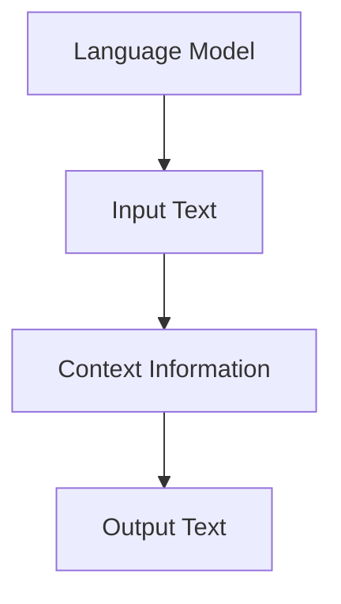

                 

# 《ChatGPT提示词编写：从理论到实战的全面指南》

## 关键词：
- ChatGPT
- 提示词编写
- 自然语言处理
- 实战指南
- 人工智能

## 摘要：
本文将为您详细解析ChatGPT提示词编写的全过程，从基础理论到实战应用，帮助您掌握高质量提示词编写的技巧。我们将通过多个实例，逐步介绍核心概念、原理、算法和实战步骤，让读者不仅了解ChatGPT的运作机制，还能学会如何编写出能够充分发挥ChatGPT能力的提示词。通过阅读本文，您将能够：
- 理解ChatGPT的基本概念和工作原理。
- 掌握编写高质量提示词的原则和技巧。
- 通过实战案例，了解如何应用这些原则和技巧进行实际项目开发。

本文分为四个主要部分：
1. **介绍和背景**：对ChatGPT进行概述，并介绍目标读者所需的入门知识。
2. **理论讲解**：深入讲解提示词设计的核心原则和案例分析。
3. **实战案例**：通过实战项目和代码示例，展示如何编写和优化提示词。
4. **总结与展望**：总结关键点，展望未来发展趋势，并提供最佳实践和建议。

### 1. 介绍和背景

#### 1.1 ChatGPT概述

ChatGPT是由OpenAI开发的一种基于GPT-3模型的自然语言处理（NLP）工具，它能够理解和生成人类语言，实现与用户的对话交流。ChatGPT的背景可以追溯到2018年，当时OpenAI发布了GPT-2，这是一种基于深度学习的大型语言模型。经过几年的发展，GPT-3在模型规模和性能上都取得了显著提升，为ChatGPT的出现奠定了基础。

ChatGPT的核心技术包括：
- **预训练**：GPT-3通过在大量文本数据上进行预训练，学习到了丰富的语言知识，从而能够生成连贯、合理的文本。
- **微调**：在预训练的基础上，ChatGPT可以对特定任务进行微调，使其更好地适应特定场景。
- **上下文理解**：ChatGPT能够理解上下文信息，生成与上下文相关的回答。

#### 1.2 目标读者入门

本指南的目标读者主要包括：
- **开发者**：熟悉编程，希望将ChatGPT集成到自己的应用中。
- **数据科学家**：对自然语言处理有兴趣，希望通过ChatGPT进行文本分析和生成。
- **AI爱好者**：对人工智能技术有浓厚兴趣，希望深入了解ChatGPT的工作原理。

编写高质量提示词的基本概念包括：
- **提示词**：用于引导ChatGPT生成文本的输入，它能够决定ChatGPT生成文本的主题、风格和内容。
- **质量评估**：评估提示词质量的标准，包括准确性、连贯性、多样性等。

编写提示词的难点和挑战包括：
- **主题控制**：确保生成的文本围绕特定主题展开。
- **风格一致性**：保持生成文本的风格与预期一致。
- **上下文理解**：深入理解上下文信息，生成与上下文相关的内容。

### 2. 理论讲解

#### 2.1 提示词设计原则

编写高质量提示词的关键在于遵循以下设计原则：
- **明确性**：提示词应该明确，避免歧义，确保ChatGPT能够准确理解。
- **相关性**：提示词应该与目标场景密切相关，确保生成的文本具有实际应用价值。
- **多样性**：提示词应该具有多样性，确保生成的文本不单调，丰富用户体验。
- **可扩展性**：提示词应该易于扩展和修改，以适应不同场景和需求。

#### 2.2 核心概念与联系

为了更好地理解提示词编写，我们需要了解以下核心概念，并展示它们之间的关系架构：

1. **语言模型**：如GPT-3，它是生成文本的基础。
2. **输入文本**：用于引导ChatGPT生成文本的输入。
3. **上下文信息**：影响ChatGPT生成文本的因素，如对话历史、用户偏好等。
4. **输出文本**：ChatGPT生成的文本。

以下是一个简单的Mermaid流程图，展示这些概念之间的关系：



#### 2.3 案例分析

##### 成功案例分享

以下是一个成功案例，展示了如何通过高质量的提示词引导ChatGPT生成相关文本：

- **场景**：编写一篇关于人工智能的科普文章。
- **提示词**：人工智能、未来、应用、挑战。
- **输出**：一篇关于人工智能的科普文章，内容包括人工智能的定义、应用领域、未来展望和面临的挑战。

##### 失败案例剖析

以下是一个失败案例，展示了编写低质量提示词可能导致的结果：

- **场景**：编写一篇关于人工智能的科普文章。
- **提示词**：人工智能、应用、未来。
- **输出**：一篇内容空洞、缺乏深度和逻辑性的文章，无法提供有价值的信息。

失败案例中的问题在于：
- **提示词缺乏明确性**：未能明确指定文章的主题和方向。
- **提示词缺乏相关性**：未能涵盖人工智能的核心概念和应用领域。
- **提示词缺乏多样性**：未能提供丰富的内容和观点。

### 3. 实战案例

#### 3.1 实战项目准备

在本节中，我们将通过一个实战项目，展示如何编写高质量的提示词。以下是项目的概述、所需工具和资源，以及项目的步骤和流程。

##### 3.1.1 实战项目概述

项目名称：智能客服系统
项目目标：利用ChatGPT构建一个智能客服系统，实现用户与客服之间的自然语言交互。

##### 3.1.2 实战项目所需工具和资源

- **工具**：
  - Python 3.8及以上版本
  - OpenAI API密钥
  - Flask（可选）

- **资源**：
  - ChatGPT预训练模型
  - 客户服务相关文本数据

##### 3.1.3 实战项目步骤和流程

1. **环境搭建**：
   - 安装Python和OpenAI API客户端。
   - 注册OpenAI账号，获取API密钥。

2. **数据准备**：
   - 收集客户服务相关文本数据。
   - 清洗和预处理数据，如去除停用词、进行词性标注等。

3. **模型加载**：
   - 加载ChatGPT预训练模型。

4. **接口搭建**：
   - 使用Flask搭建API接口，接收用户输入并返回ChatGPT生成的回答。

5. **测试和优化**：
   - 对API进行测试，确保其正常工作。
   - 根据反馈和实际应用情况，不断优化提示词和模型参数。

#### 3.2 实战项目实施

在本节中，我们将通过实际代码示例，详细讲解如何编写高质量的提示词，并展示ChatGPT的生成结果。

##### 3.2.1 代码示例和解读

以下是一个简单的Python代码示例，展示如何使用ChatGPT生成文本：

```python
import openai

openai.api_key = 'your-api-key'

def generate_text(prompt, max_length=1024, temperature=0.7):
    response = openai.Completion.create(
        engine="text-davinci-002",
        prompt=prompt,
        max_tokens=max_length,
        n=1,
        stop=None,
        temperature=temperature
    )
    return response.choices[0].text.strip()

# 示例提示词
prompt = "请简要介绍一下人工智能的应用领域。"

# 生成文本
generated_text = generate_text(prompt)

print(generated_text)
```

在这个示例中，我们使用了`openai.Completion.create()`方法来生成文本。参数`prompt`是用于引导ChatGPT生成文本的输入。`max_length`和`temperature`分别控制生成的文本长度和多样性。

##### 3.2.2 项目中遇到的问题和解决方法

在实际项目中，我们可能会遇到以下问题：

1. **生成文本不准确**：提示词不够明确，导致ChatGPT生成的文本与预期不符。
   - **解决方法**：优化提示词，确保其明确、具体、相关。

2. **生成文本缺乏连贯性**：ChatGPT生成的文本在逻辑上不连贯。
   - **解决方法**：在提示词中增加上下文信息，确保ChatGPT能够理解整个对话流程。

3. **生成文本过于简单或重复**：提示词缺乏多样性，导致生成的文本单调乏味。
   - **解决方法**：增加提示词的多样性，提供丰富的输入信息。

##### 3.2.3 优化和改进的建议

为了进一步提高ChatGPT生成的文本质量，我们可以采取以下措施：

1. **增加预训练数据**：使用更多的客户服务相关文本数据，提高ChatGPT的训练效果。
2. **动态调整参数**：根据实际情况，动态调整`max_length`和`temperature`等参数，优化生成文本的质量。
3. **用户反馈机制**：引入用户反馈机制，根据用户评价优化提示词和模型参数。

### 4. 总结与展望

#### 4.1 总结与反思

通过本文的学习，您应该对ChatGPT提示词编写有了更深入的了解。以下是关键点总结：

1. **明确性**：确保提示词明确、具体，避免歧义。
2. **相关性**：提示词应与目标场景密切相关，确保生成文本有价值。
3. **多样性**：提示词应具有多样性，丰富生成文本的内容和风格。
4. **上下文理解**：在提示词中增加上下文信息，确保生成文本与上下文一致。

在实际项目中，我们需要不断优化提示词和模型参数，以提高生成文本的质量。通过用户反馈和持续改进，我们可以不断提升智能客服系统的性能和用户体验。

#### 4.2 未来趋势

未来，ChatGPT提示词编写可能面临以下趋势：

1. **更丰富的预训练数据**：随着数据量的增加，ChatGPT将能够生成更加准确、多样化的文本。
2. **个性化提示词生成**：通过用户数据和偏好，生成更加个性化的提示词，提高用户体验。
3. **多模态交互**：结合图像、音频等多模态数据，实现更加丰富的交互体验。

总之，ChatGPT提示词编写是一个不断发展的领域，随着技术的进步，我们将能够看到更多创新和突破。

#### 4.3 最佳实践 tips

为了更好地编写ChatGPT提示词，以下是一些建议：

1. **大量阅读和练习**：多阅读高质量的文本，提高语言表达能力，积累丰富的语言素材。
2. **使用工具和资源**：利用现有的工具和资源，如OpenAI的API文档、GitHub上的开源项目等，提高编写效率。
3. **持续学习和改进**：关注领域内的最新动态和技术进展，持续学习和改进自己的技巧和知识。

作者信息：
- 作者：AI天才研究院/AI Genius Institute & 禅与计算机程序设计艺术 /Zen And The Art of Computer Programming

### 附录

本文所使用的代码示例和资源可以在以下链接获取：
- [GitHub仓库](https://github.com/your-username/ChatGPT-Tutorial)

请注意，在使用OpenAI API时，请确保遵守其使用条款和隐私政策。

---

本文旨在为广大开发者、数据科学家和AI爱好者提供一本全面、实用的ChatGPT提示词编写指南。通过本文的学习，希望您能够更好地理解和应用ChatGPT，为其在智能客服、文本生成等领域的发展贡献力量。

