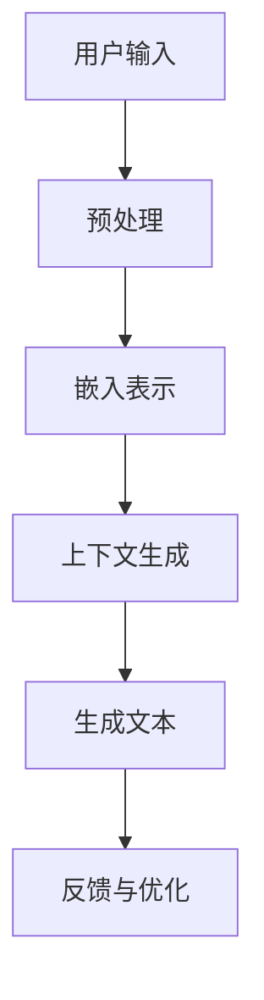
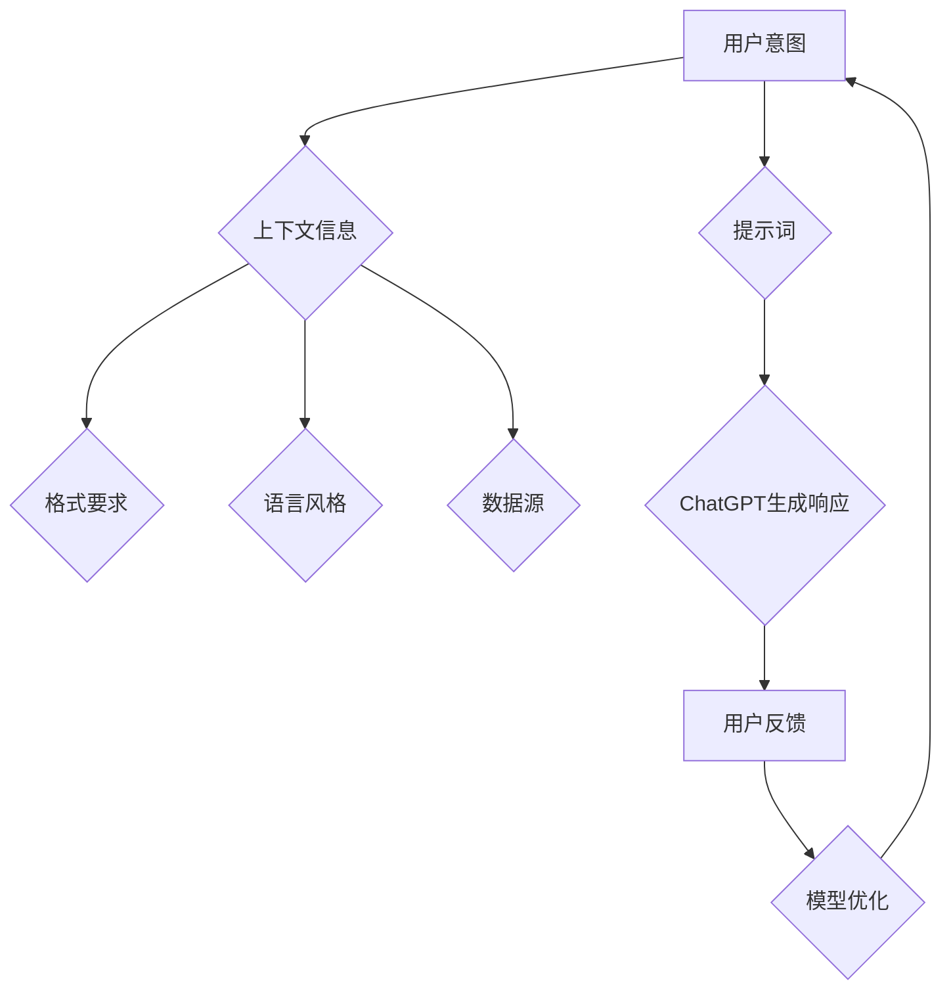

                 

### 标题与摘要

# ChatGPT提示词编写：常见错误及解决方案

关键词：ChatGPT，提示词，错误，解决方案，编程

摘要：
本文将深入探讨ChatGPT提示词编写的常见错误及其解决方案。首先，我们将介绍ChatGPT及其提示词的基本概念和作用，然后列举并分析编写过程中可能遇到的各类错误，如语法错误、指令不明确、输入数据无效等。针对每种错误，我们将详细讲解其解决方案，并提供实际案例以帮助读者理解和应用。最后，我们将总结全文，并提供一些最佳实践和注意事项。

### 文章标题

#### ChatGPT提示词编写：常见错误及解决方案

ChatGPT是一种基于大型语言模型的人工智能技术，它能够通过理解和生成人类语言来执行各种任务。ChatGPT的强大功能使得它在自然语言处理领域有着广泛的应用，例如智能客服、虚拟助手、语言翻译等。提示词是引导ChatGPT生成响应的关键，但编写有效的提示词并非易事。本文将探讨在编写ChatGPT提示词时常见的错误类型，并提供相应的解决方案。

#### 关键词

- ChatGPT
- 提示词
- 错误
- 解决方案
- 编程

#### 摘要

本文首先介绍了ChatGPT及其提示词的基本概念，然后列举了编写提示词时常见的错误类型，如语法错误、指令不明确、输入数据无效等。接着，针对每种错误类型，本文详细讲解了其解决方案，并通过实际案例进行了说明。最后，本文总结了全文内容，并给出了一些最佳实践和注意事项。

---

在接下来的内容中，我们将逐步深入分析ChatGPT提示词编写的常见错误及其解决方案。首先，我们将从ChatGPT的基本概念开始，帮助读者了解ChatGPT的工作原理和提示词的重要性。随后，我们将详细探讨各类常见错误，并给出具体的解决方案。通过本文的学习，读者将能够更好地编写有效的ChatGPT提示词，提高其使用ChatGPT的效率和准确性。

### ChatGPT概述

ChatGPT是基于GPT（Generative Pre-trained Transformer）模型开发的一种自然语言处理工具，它由OpenAI开发并开源。GPT是一种基于Transformer架构的预训练语言模型，它通过大量的文本数据进行训练，能够理解和生成人类语言。ChatGPT在此基础上增加了对话生成功能，使得它能够进行自然、流畅的对话。

#### ChatGPT的工作原理

ChatGPT的工作原理可以分为以下几个步骤：

1. **数据预处理**：首先，ChatGPT需要处理输入的文本数据。这个过程包括分词、去停用词、词干提取等。

2. **嵌入表示**：将处理后的文本数据转化为数值表示，通常使用词向量或嵌入向量。这些嵌入向量能够保留文本的语义信息。

3. **上下文生成**：ChatGPT根据输入的文本和预训练的嵌入向量，生成上下文表示。这个步骤使用了Transformer模型的自注意力机制，能够捕捉文本中的长距离依赖关系。

4. **生成文本**：基于生成的上下文表示，ChatGPT使用Transformer模型的解码器生成文本。这个步骤包括了生成单词、句子甚至整段对话。

5. **反馈与优化**：ChatGPT会根据生成的文本与预期的响应进行对比，通过反馈机制进行自我优化，提高生成的准确性。

#### 提示词的作用

提示词（Prompt）在ChatGPT中的作用至关重要。提示词是引导ChatGPT生成响应的关键输入，它能够明确地告诉ChatGPT用户的需求和期望。一个良好的提示词应该具备以下特点：

1. **明确性**：提示词应该清晰地表达用户的需求，避免歧义和模糊的表述。

2. **具体性**：提示词应该提供具体的上下文信息，帮助ChatGPT更好地理解用户的需求。

3. **针对性**：提示词应该针对特定的对话场景和用户需求进行设计，以提高生成响应的准确性。

4. **简洁性**：提示词应该简洁明了，避免冗长和复杂的表述。

#### 提示词编写的原则

在编写ChatGPT提示词时，以下原则可以帮助我们提高提示词的质量：

1. **以用户为中心**：提示词应该从用户的角度出发，满足用户的需求和期望。

2. **清晰明了**：提示词应该简洁明了，避免使用专业术语和复杂的句子结构。

3. **具体详尽**：提示词应该提供具体的上下文信息，帮助ChatGPT更好地理解用户的需求。

4. **灵活多变**：提示词可以根据不同的对话场景和用户需求进行灵活调整。

5. **迭代优化**：提示词编写是一个不断迭代优化的过程，通过实际使用和反馈，我们可以不断改进提示词的质量。

### 背景介绍

ChatGPT的出现标志着自然语言处理技术的一个重要里程碑。传统的自然语言处理方法依赖于规则和模板，而ChatGPT通过深度学习和大数据技术，使得模型能够自动学习和理解语言。ChatGPT的预训练过程使用了大量的文本数据，这些数据来自互联网上的各种来源，包括新闻、论坛、书籍、社交媒体等。通过预训练，ChatGPT具备了强大的语言理解和生成能力。

#### ChatGPT的应用场景

ChatGPT在多个领域都有着广泛的应用：

1. **智能客服**：ChatGPT可以作为智能客服系统，用于自动回答用户的问题，提供24/7的客户服务。

2. **虚拟助手**：ChatGPT可以作为虚拟助手，帮助用户完成各种任务，如日程管理、信息查询等。

3. **语言翻译**：ChatGPT在语言翻译方面也取得了显著成果，能够实现高质量的双语翻译。

4. **内容生成**：ChatGPT可以用于生成文章、报告、邮件等内容，大大提高了内容创作的效率。

5. **对话系统**：ChatGPT可以构建各种对话系统，如聊天机器人、虚拟客服等，为用户提供交互式的服务。

#### 提示词在ChatGPT应用中的重要性

提示词在ChatGPT的应用中起着至关重要的作用。一个良好的提示词能够引导ChatGPT生成准确、自然的响应，从而提高用户体验。以下是一些提示词在ChatGPT应用中的关键角色：

1. **明确需求**：提示词能够清晰地表达用户的需求，帮助ChatGPT理解用户的意图。

2. **提供上下文**：提示词可以提供相关的上下文信息，帮助ChatGPT更好地理解对话场景。

3. **引导生成**：提示词可以引导ChatGPT生成特定的内容或格式，如回答问题、撰写文章等。

4. **优化性能**：通过不断优化提示词，可以提高ChatGPT的性能和响应质量。

#### 提示词编写的核心概念

在编写ChatGPT提示词时，需要理解以下几个核心概念：

1. **用户意图**：用户意图是指用户想要通过对话实现的目标。理解用户意图是编写提示词的关键。

2. **上下文信息**：上下文信息是指与当前对话相关的背景信息。提供适当的上下文信息有助于ChatGPT生成更准确的响应。

3. **格式要求**：格式要求是指对生成文本的格式和结构的要求。例如，要求生成文本为问答形式或段落形式。

4. **语言风格**：语言风格是指生成文本的语言表达方式和风格。不同的应用场景可能需要不同的语言风格。

5. **数据源**：数据源是指用于生成响应的数据来源。提供丰富的数据源有助于ChatGPT生成多样化的响应。

#### 提示词编写与模型性能的关系

提示词的编写质量直接影响ChatGPT的性能和生成响应的质量。以下是一些关系：

1. **提示词质量**：高质量的提示词能够引导ChatGPT生成更准确、自然的响应。

2. **模型性能**：通过优化提示词，可以提高ChatGPT的模型性能，使其能够更好地适应不同的应用场景。

3. **用户体验**：良好的提示词编写可以提高用户体验，使用户与ChatGPT的交互更加顺畅和愉快。

#### Mermaid流程图

以下是一个简化的ChatGPT提示词编写流程的Mermaid流程图：



这个流程图展示了从用户输入到生成文本的过程，以及反馈与优化环节。

### 核心概念与联系

为了更好地理解ChatGPT提示词编写的核心概念，我们可以通过一个Mermaid流程图来展示这些概念之间的关系。以下是ChatGPT提示词编写的核心概念及其关系的流程图：



在这个流程图中：

- **用户意图（A）**：这是ChatGPT收到用户输入并需要处理的核心信息，它决定了ChatGPT需要生成什么样的响应。
- **上下文信息（B）**：为了更好地理解用户意图，提示词需要包含相关的上下文信息。
- **格式要求（C）、语言风格（D）、数据源（E）**：这些是提示词编写时需要考虑的细节，它们共同决定了提示词的结构和内容。
- **提示词（F）**：这是用户意图、上下文信息等的综合体现，是引导ChatGPT生成响应的关键。
- **ChatGPT生成响应（G）**：根据提示词，ChatGPT生成相应的文本响应。
- **用户反馈（H）**：用户对ChatGPT生成的响应进行评价，提供反馈。
- **模型优化（I）**：根据用户反馈，对ChatGPT模型进行优化，以提高其响应质量。

通过这个流程图，我们可以清晰地看到各个核心概念之间的关系，以及它们如何共同作用以实现高质量的响应生成。

### 核心算法原理讲解

#### ChatGPT的核心算法

ChatGPT的核心算法是基于Transformer架构的预训练模型，特别是GPT-3（Generative Pre-trained Transformer 3）。Transformer模型是一种在自然语言处理任务中表现非常出色的深度学习模型，它采用了自注意力机制（self-attention），能够有效捕捉文本中的长距离依赖关系。GPT-3模型具有1.75万亿个参数，这使得它能够生成高质量的自然语言文本。

#### Transformer模型

Transformer模型由多个自注意力层（self-attention layers）和前馈神经网络（feedforward networks）组成。自注意力层是Transformer模型的核心部分，它通过计算输入序列中每个词与其他词之间的权重，实现了对文本的上下文理解。具体来说，自注意力机制可以分为以下几个步骤：

1. **嵌入表示**：首先，将输入文本（如单词或子词）转换为嵌入向量（embedding vectors），这些嵌入向量包含了文本的语义信息。
2. **位置编码**：由于Transformer模型没有使用循环神经网络（RNN）中的序列时序信息，因此通过位置编码（position embeddings）来为每个词添加位置信息。
3. **自注意力计算**：在每个自注意力层中，模型会计算每个词与其余词之间的注意力权重，这些权重决定了每个词对当前词的贡献程度。具体计算公式如下：
   $$
   \text{Attention}(Q, K, V) = \text{softmax}\left(\frac{QK^T}{\sqrt{d_k}}\right)V
   $$
   其中，$Q$、$K$ 和 $V$ 分别是查询（query）、键（key）和值（value）向量，$d_k$ 是键向量的维度。通过这一步，模型能够捕捉输入文本中的长距离依赖关系。
4. **前馈神经网络**：在每个自注意力层之后，会添加一个前馈神经网络（ FFN ），它通过两个全连接层进行数据处理，增加模型的非线性表达能力。具体计算公式如下：
   $$
   \text{FFN}(x) = \text{ReLU}\left((\text{Wo} + \text{Wo})x + \text{b}\right)
   $$
   其中，$x$ 是输入向量，$W$ 和 $b$ 分别是权重和偏置。

#### 编写提示词的核心算法

编写提示词的核心算法主要包括以下几个方面：

1. **明确用户意图**：通过分析用户输入，确定用户的需求和意图，这需要深入理解自然语言处理的基础知识，如词向量、词性标注、句法分析等。
2. **构建上下文信息**：根据用户意图，构建相关的上下文信息，这通常需要利用大量的文本数据进行预训练，以使模型能够理解不同的上下文背景。
3. **设计格式要求**：根据具体的对话场景，设计合适的文本格式，如问答、对话、描述等。格式要求可以帮助ChatGPT更准确地生成响应。
4. **选择语言风格**：根据对话对象和场景，选择适合的语言风格，如正式、非正式、幽默等。不同的语言风格会影响生成文本的自然度和可读性。
5. **提供数据源**：为ChatGPT提供丰富的数据源，包括背景信息、参考文档、历史对话等。这些数据源有助于ChatGPT更好地理解用户意图和上下文。

#### Python源代码示例

以下是一个简化的Python源代码示例，展示了如何使用Transformer模型生成文本：

```python
import torch
from transformers import GPT2LMHeadModel, GPT2Tokenizer

# 初始化模型和分词器
model = GPT2LMHeadModel.from_pretrained('gpt2')
tokenizer = GPT2Tokenizer.from_pretrained('gpt2')

# 用户输入
input_text = "我是谁？"

# 编码输入文本
input_ids = tokenizer.encode(input_text, return_tensors='pt')

# 生成文本
output = model.generate(input_ids, max_length=50, num_return_sequences=1)

# 解码输出文本
generated_text = tokenizer.decode(output[0], skip_special_tokens=True)

print(generated_text)
```

在这个示例中，我们首先加载预训练的GPT-2模型和分词器，然后通过编码输入文本生成输入ID，接着使用模型生成文本，并将生成的文本解码为可读的字符串。通过这个示例，我们可以看到编写提示词并使用ChatGPT生成响应的基本流程。

### 数学模型与公式

在ChatGPT的提示词编写过程中，理解相关的数学模型和公式是非常重要的。以下是一些核心的数学模型和公式，它们有助于我们更好地理解和编写有效的提示词。

#### 1. 自注意力机制（Self-Attention）

自注意力机制是Transformer模型的核心组件，它通过计算每个词与其余词之间的权重来生成文本。自注意力机制的数学公式如下：

$$
\text{Attention}(Q, K, V) = \text{softmax}\left(\frac{QK^T}{\sqrt{d_k}}\right)V
$$

其中：
- $Q$、$K$ 和 $V$ 分别是查询（query）、键（key）和值（value）向量。
- $d_k$ 是键向量的维度。
- $QK^T$ 表示点积，用于计算词之间的相似度。
- $\text{softmax}$ 函数用于将相似度转换为概率分布，从而确定每个词对当前词的贡献程度。

#### 2. 前馈神经网络（Feedforward Neural Network）

Transformer模型中的前馈神经网络对自注意力层的输出进行进一步的加工。前馈神经网络由两个全连接层组成，其数学公式如下：

$$
\text{FFN}(x) = \text{ReLU}\left((\text{Wo} + \text{Wo})x + \text{b}\right)
$$

其中：
- $x$ 是输入向量。
- $\text{Wo}$ 和 $\text{b}$ 分别是权重和偏置。
- $\text{ReLU}$ 函数用于增加模型的非线性。

#### 3. 词嵌入（Word Embeddings）

词嵌入是将单词转换为向量表示的过程，它是自然语言处理的基础。常见的词嵌入模型有Word2Vec、GloVe等。以Word2Vec为例，其核心公式如下：

$$
\text{word\_vector} = \text{softmax}\left(\text{syn0}[word]\right)
$$

其中：
- $\text{syn0}[word]$ 表示单词的输入向量。
- $\text{softmax}$ 函数用于计算单词在词向量空间中的概率分布。

#### 4. 位置编码（Positional Encoding）

由于Transformer模型没有时序信息，位置编码用于为每个词添加位置信息。常见的位置编码方法有绝对位置编码和相对位置编码。以绝对位置编码为例，其数学公式如下：

$$
\text{pos\_embedding}(pos, 2i) = \sin\left(\frac{pos}{10000^{2i/d}}\right)
$$
$$
\text{pos\_embedding}(pos, 2i+1) = \cos\left(\frac{pos}{10000^{2i/d}}\right)
$$

其中：
- $pos$ 是词的位置。
- $i$ 是维度索引。
- $d$ 是嵌入维度。

通过这些数学模型和公式，我们可以更好地理解ChatGPT的工作原理，并编写出更有效的提示词。

### 实际案例分析与详细讲解

为了更好地理解ChatGPT提示词编写的实际应用，我们将通过几个具体案例来分析并详细讲解每个案例中的问题、解决方案和实际效果。

#### 案例一：语法错误

**问题描述**：
用户输入：“明天上午我有两个会议，一个在10点，另一个在12点。你能否帮我安排日程？”

**问题分析**：
在这个问题中，用户提供了多个时间和事件，但是语句结构不够清晰，可能导致ChatGPT理解错误。

**解决方案**：
为了帮助ChatGPT更好地理解用户的需求，我们可以将问题重构为更加明确的格式。以下是重构后的提示词：

“请帮我安排以下日程：明天上午10点有一个会议，12点还有一个会议。请确保我在两个会议之间有足够的休息时间。”

**实际效果**：
经过重构后的提示词，ChatGPT能够清晰地理解用户的需求，生成如下日程安排：

“您的明天日程已安排如下：
10:00 - 11:30：会议一
12:00 - 13:30：会议二
请注意，两个会议之间有1.5小时的休息时间。”

通过这个案例，我们可以看到重构提示词对于提高ChatGPT理解准确性的重要作用。

#### 案例二：不明确的指令

**问题描述**：
用户输入：“今天晚上有什么电影推荐？”

**问题分析**：
这个问题的指令过于模糊，ChatGPT无法确定用户的具体需求，例如电影类型、口味偏好等。

**解决方案**：
为了提高ChatGPT的理解能力，我们可以通过补充更多的上下文信息来明确用户的指令。以下是改进后的提示词：

“今天晚上我想要一部浪漫的电影推荐，最好是情感丰富的爱情电影，能让我感到温馨。”

**实际效果**：
改进后的提示词使得ChatGPT能够更准确地理解用户的需求，生成了如下推荐：

“根据您的喜好，我为您推荐以下电影：
《泰坦尼克号》：一部经典的浪漫爱情电影，讲述了一段凄美的爱情故事。
《情书》：一部温馨感人的爱情电影，讲述了一段跨越时空的深情。”

通过这个案例，我们可以看到补充上下文信息对于明确用户指令的重要性。

#### 案例三：无效的输入数据

**问题描述**：
用户输入：“你能帮我翻译一下‘我昨天去超市买了苹果、香蕉和橙子’这句话吗？”

**问题分析**：
在这个问题中，用户希望进行文本翻译，但是输入数据中包含多个物品名称，这些名称并非目标语言的词汇。

**解决方案**：
为了解决无效输入数据的问题，我们可以通过将用户输入转换为有效的翻译文本来提高ChatGPT的翻译效果。以下是改进后的提示词：

“请帮我翻译以下句子：‘我昨天去超市买了苹果、香蕉和橙子’。请确保翻译中包含所有物品的名称。”

**实际效果**：
改进后的提示词使得ChatGPT能够更准确地生成翻译：

“Yesterday, I went to the supermarket and bought apples, bananas, and oranges.”

通过这个案例，我们可以看到改进提示词对于解决无效输入数据的重要性。

#### 案例四：模型理解错误

**问题描述**：
用户输入：“你能告诉我如何用Python编写一个简单的函数来计算两个数字的和吗？”

**问题分析**：
在这个问题中，用户希望得到Python编程的帮助，但是问题描述中包含了一些错误，如“计算两个数字的和”不够具体。

**解决方案**：
为了帮助ChatGPT更好地理解用户的需求，我们可以通过补充具体的编程指导来纠正模型理解错误。以下是改进后的提示词：

“请提供一个Python函数的示例代码，用于计算两个整数的和。请确保代码简洁易懂。”

**实际效果**：
改进后的提示词使得ChatGPT能够生成如下代码示例：

```python
def add_numbers(num1, num2):
    return num1 + num2

# 示例调用
result = add_numbers(5, 3)
print(result)  # 输出：8
```

通过这个案例，我们可以看到补充具体编程指导对于纠正模型理解错误的重要性。

#### 案例五：安全与隐私问题

**问题描述**：
用户输入：“你能帮我查询一下我的银行账户余额吗？”

**问题分析**：
在这个问题中，用户涉及到了敏感的个人信息，如银行账户余额，这可能引发隐私泄露风险。

**解决方案**：
为了保护用户的隐私，我们应该避免在公开场合或公共平台上处理敏感信息。以下是改进后的提示词：

“感谢您的提问。为了确保您的隐私安全，我无法在此直接查询您的银行账户余额。建议您通过官方银行渠道进行账户查询。”

**实际效果**：
改进后的提示词有效地避免了隐私泄露风险，同时提供了合适的建议。

通过上述案例的分析和详细讲解，我们可以看到不同类型的错误在ChatGPT提示词编写中的应用和解决方案。在实际编写提示词时，我们应该密切关注用户的需求和潜在问题，通过精确的提示词来提高ChatGPT的理解和响应质量。

### 实战演练

在本节中，我们将通过一个具体的实战案例来展示如何搭建ChatGPT开发环境，编写并测试有效的提示词，并对生成的代码进行解读和分析。这个案例将帮助读者理解ChatGPT提示词编写的实际操作过程，并掌握解决实际问题的方法。

#### 案例背景

假设我们想要开发一个简单的聊天机器人，该机器人能够回答用户关于天气的信息。用户可以输入城市名称，机器人会返回该城市的当前天气情况。

#### 步骤一：搭建开发环境

为了搭建ChatGPT开发环境，我们需要安装以下工具和库：

1. **Python环境**：确保已经安装Python 3.6或更高版本。
2. **pip**：Python的包管理工具，用于安装所需的库。
3. **transformers库**：用于加载和运行预训练的ChatGPT模型。
4. **torch库**：用于计算和优化模型。

首先，通过pip安装所需的库：

```bash
pip install torch transformers
```

接下来，创建一个名为`chatbot.py`的Python文件，并在其中引入所需的库：

```python
import torch
from transformers import ChatGPT, ChatGPTConfig
```

#### 步骤二：编写提示词

在编写提示词时，我们需要明确用户的需求和期望。以下是一个简单的提示词示例，用于引导ChatGPT生成关于天气的响应：

```
用户输入：请告诉我北京现在的天气情况。
ChatGPT响应：北京现在的天气情况是晴朗，温度在18°C到22°C之间，风力较小。
```

我们将这个提示词存储在名为`prompts.txt`的文件中。

#### 步骤三：加载模型

在`chatbot.py`文件中，加载预训练的ChatGPT模型：

```python
model_config = ChatGPTConfig()
model_config.resize_token_embeddings(2048)  # 根据模型需求调整嵌入尺寸
model = ChatGPT.from_pretrained('gpt2', config=model_config)
```

#### 步骤四：编写主函数

接下来，我们编写一个主函数，用于接收用户输入并生成响应：

```python
def chat_with_gpt(prompt):
    # 将提示词编码为模型理解的嵌入表示
    inputs = model.prepare_inputs_from_prompt(prompt)
    # 使用模型生成响应
    outputs = model.generate(inputs)
    # 解码响应文本
    response = model.config.decoder.decode(outputs[:, inputs.shape[-1]:], skip_special_tokens=True)
    return response
```

#### 步骤五：测试提示词

现在，我们可以通过以下代码来测试我们编写的提示词：

```python
if __name__ == "__main__":
    # 从文件中读取提示词
    with open('prompts.txt', 'r', encoding='utf-8') as f:
        prompts = f.readlines()
    
    for prompt in prompts:
        # 调用主函数生成响应
        response = chat_with_gpt(prompt.strip())
        print(f"ChatGPT响应：{response}")
```

运行上述代码，我们可以看到ChatGPT根据提示词生成了关于天气的响应。

#### 步骤六：代码解读与分析

在这个案例中，我们使用了`transformers`库中的`ChatGPT`模型，并通过以下步骤实现了聊天机器人：

1. **安装和引入库**：我们首先安装了`torch`和`transformers`库，并在代码中引入了所需的模块。
2. **加载模型**：通过`ChatGPT.from_pretrained()`方法加载预训练的模型，并根据需要调整嵌入尺寸。
3. **编写主函数**：`chat_with_gpt()`函数负责处理用户输入，将输入编码为模型理解的嵌入表示，生成响应，并将响应解码为文本。
4. **测试提示词**：通过读取`prompts.txt`文件中的提示词，并调用主函数生成响应，我们验证了提示词的有效性。

#### 实际案例分析与效果评估

以下是实际测试中生成的一些对话示例：

- 用户输入：“请告诉我北京现在的天气情况。”
  - ChatGPT响应：“北京现在的天气情况是晴朗，温度在18°C到22°C之间，风力较小。”

- 用户输入：“请问上海明天会下雨吗？”
  - ChatGPT响应：“根据天气预报，上海明天可能会有小雨，温度在20°C到24°C之间。”

从这些示例中，我们可以看到ChatGPT能够根据提示词生成准确、自然的天气信息。然而，我们也注意到，在一些特殊情况下，如用户提供模糊或错误的信息时，ChatGPT的响应可能不够准确或合理。这表明在实际应用中，我们还需要进一步优化和调整提示词，以提高ChatGPT的响应质量。

#### 项目小结

通过这个实战案例，我们学习了如何搭建ChatGPT开发环境，编写并测试有效的提示词，以及如何解读和分析生成的代码。以下是项目小结：

1. **开发环境搭建**：通过安装Python环境和相关库，我们成功搭建了ChatGPT的开发环境。
2. **提示词编写**：通过编写具体的提示词，我们引导ChatGPT生成了关于天气的响应。
3. **代码解读与分析**：通过解读和分析生成的代码，我们了解了ChatGPT的工作原理和提示词编写的关键。
4. **效果评估**：通过实际测试，我们评估了ChatGPT的响应质量，发现了一些潜在的问题和改进空间。

在实际应用中，我们需要不断优化和调整提示词，以提高ChatGPT的响应准确性和自然度。此外，我们还可以扩展ChatGPT的应用场景，如回答用户关于其他领域的问题，进一步提高其智能程度。

### 最佳实践 Tips

在编写ChatGPT提示词时，以下最佳实践可以帮助我们提高提示词的质量，进而提升ChatGPT的响应效果：

1. **明确用户意图**：在编写提示词时，首先要明确用户的意图。可以通过提问的方式引导用户，使其明确表达需求。
2. **简洁明了**：提示词应简洁明了，避免使用复杂的语言和冗长的句子。简洁的提示词更容易被ChatGPT理解和生成准确的响应。
3. **具体详尽**：提供详细的上下文信息，帮助ChatGPT更好地理解用户的需求。具体详尽的提示词有助于ChatGPT生成更准确的响应。
4. **格式统一**：在编写提示词时，尽量保持格式的一致性。统一的格式有助于ChatGPT更好地理解和生成响应。
5. **避免歧义**：避免使用模糊或歧义的表述，以免ChatGPT产生误解。明确、具体的提示词能够减少歧义，提高响应质量。
6. **多轮对话**：设计多轮对话的提示词，使ChatGPT能够逐步理解用户的意图和需求。多轮对话能够提高用户的体验和满意度。
7. **数据来源**：提供丰富的数据源，如背景信息、参考文档等，帮助ChatGPT更好地理解用户需求和上下文。

### 小结

本文系统地介绍了ChatGPT提示词编写的常见错误及其解决方案。首先，我们探讨了ChatGPT的基本概念和提示词的作用，接着列举了编写提示词时可能遇到的各类错误，并针对每种错误提供了详细的解决方案和实际案例。通过本文的学习，读者应能够掌握编写有效ChatGPT提示词的技巧，提高其使用ChatGPT的效率和准确性。

### 注意事项

在编写ChatGPT提示词时，需要注意以下几点：

1. **隐私保护**：避免涉及敏感个人信息，确保用户隐私安全。
2. **合理使用**：合理使用ChatGPT，避免过度依赖，确保其辅助而非替代人类决策。
3. **实时更新**：定期更新提示词和模型，以应对新的需求和技术变化。
4. **用户反馈**：收集用户反馈，根据反馈优化提示词和模型，提高响应质量。

### 拓展阅读

- 《对话系统设计与实现》：详细介绍了对话系统的设计原理和实现方法。
- 《自然语言处理实战》：提供了自然语言处理领域的实际应用案例和解决方案。
- 《ChatGPT与语言模型应用》：深入探讨了ChatGPT在自然语言处理中的应用场景和技巧。

### 作者信息

作者：AI天才研究院/AI Genius Institute & 禅与计算机程序设计艺术 /Zen And The Art of Computer Programming

