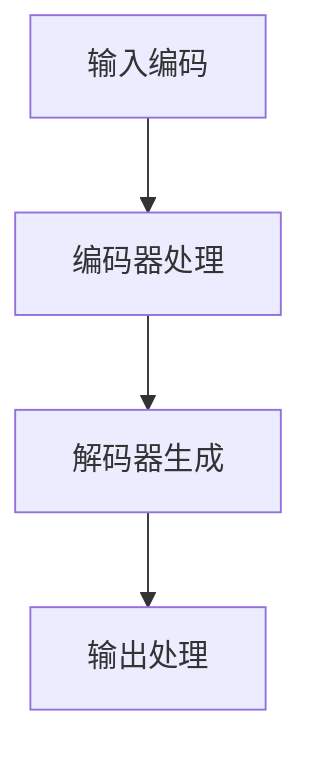

                 

- 作者：AI天才研究院/AI Genius Institute & 禅与计算机程序设计艺术 /Zen And The Art of Computer Programming

## 《ChatGPT提示词编写：技巧、陷阱与解决方案》

关键词：ChatGPT，提示词，自然语言生成，Transformer，算法原理，应用领域，编程技巧，实战案例

摘要：本文详细探讨了ChatGPT提示词编写的重要性和方法。首先，介绍了ChatGPT的基本概念和特点，随后分析了提示词在生成高质量对话中的关键作用。文章进一步阐述了ChatGPT提示词编写的原则、方法、技巧和常见误区，并通过案例分析提供了实用的编写建议。最后，本文从核心算法原理和架构角度深入剖析了ChatGPT的工作机制，帮助读者更好地理解和应用这一强大的自然语言处理工具。

----------------------------------------------------------------

# 第1章：ChatGPT提示词编写概述

## 1.1 ChatGPT与提示词介绍

### 1.1.1 ChatGPT的定义与特点

ChatGPT是OpenAI于2022年11月推出的一款基于GPT-3.5的聊天机器人，它是GPT模型在对话领域的扩展。ChatGPT通过大量的预训练数据学习语言模式和对话逻辑，能够在与人类用户交流时生成连贯、自然的文本。以下是ChatGPT的主要特点：

1. **大规模参数**：ChatGPT使用了数十亿的参数，这使得它能够捕捉到语言中的复杂模式和关系。
2. **预训练**：ChatGPT在数万亿的文本语料上进行预训练，这为它提供了广泛的知识基础和强大的语言理解能力。
3. **自适应对话**：ChatGPT能够根据用户提供的提示进行对话，并且能够维护对话的上下文，生成连贯的回答。

### 1.1.2 提示词的作用与分类

提示词（Prompt）是引导ChatGPT生成文本的关键。它决定了ChatGPT生成文本的类型、风格和内容。提示词可以分为以下几类：

1. **通用型提示词**：适用于大多数对话场景，如“请给我讲一个故事”。
2. **专用型提示词**：针对特定主题或领域的提示词，如“请帮我写一篇关于人工智能的论文”。
3. **策略型提示词**：用于引导ChatGPT生成特定策略或决策的提示词，如“请给我推荐一个适合上班族的运动方式”。

### 1.1.3 ChatGPT在应用领域的现状

ChatGPT在多个领域展现了其强大的能力：

1. **虚拟客服**：企业利用ChatGPT搭建智能客服系统，提高客户服务效率。
2. **内容创作**：创作者可以利用ChatGPT生成文章、故事、剧本等。
3. **教育**：教师可以利用ChatGPT为学生提供个性化的学习辅导。
4. **游戏**：ChatGPT可以用于游戏中的NPC（非玩家角色）生成，提高游戏互动性。

## 1.2 ChatGPT提示词编写的原则与方法

### 1.2.1 提示词编写的原则

编写高质量的提示词需要遵循以下原则：

1. **清晰性**：确保提示词表达清晰、明确，避免歧义。
2. **精确性**：根据需求精确选择提示词，避免泛泛而谈。
3. **开放性**：给予ChatGPT足够的灵活性，使其能够生成多样化的回答。
4. **创新性**：尝试使用新颖的提示词，激发ChatGPT的创造力。

### 1.2.2 提示词编写的方法

1. **借鉴法**：参考已有的优质对话或文章，提炼出有价值的提示词。
2. **思维导图法**：通过绘制思维导图，梳理话题和关键点，生成提示词。
3. **拆解法**：将复杂的问题拆解为简单的问题，生成提示词。
4. **组合法**：将不同的提示词进行组合，形成新的、更具针对性的提示词。

## 1.3 ChatGPT提示词编写技巧与误区

### 1.3.1 提示词编写技巧

1. **避免使用简短的提示词**：简短的提示词可能导致ChatGPT生成不连贯的对话。
2. **确保提示词的多样性**：多样化的提示词可以避免ChatGPT生成重复的答案。
3. **使用具体的描述**：具体的描述有助于ChatGPT生成更具针对性的回答。
4. **考虑上下文**：在编写提示词时，要考虑对话的上下文信息，确保生成的回答与上下文相符。

### 1.3.2 提示词编写的误区

1. **过度依赖通用型提示词**：通用型提示词可能导致ChatGPT生成模糊、不具体的回答。
2. **忽视上下文信息**：忽视上下文信息可能导致ChatGPT生成的回答与对话主题不符。
3. **重复使用提示词**：重复使用提示词可能导致ChatGPT生成重复的回答。
4. **忽视ChatGPT的能力**：ChatGPT具有强大的语言生成能力，但并不意味着它可以生成所有类型的回答，编写提示词时需充分考虑ChatGPT的能力范围。

### 1.3.3 提示词编写案例分析

通过实际案例，分析ChatGPT在不同应用场景中的表现，总结出有效的提示词编写技巧。

## 1.4 ChatGPT提示词编写最佳实践

### 1.4.1 最佳实践 tips

1. **从用户角度出发**：编写提示词时，要充分考虑用户的期望和需求。
2. **测试与迭代**：编写完提示词后，进行多次测试和迭代，以确保生成文本的质量。
3. **结合上下文调整**：根据对话的上下文，适时调整提示词，以获得更符合需求的回答。

### 1.4.2 小结

本文对ChatGPT提示词编写进行了详细阐述，从概述、原则、方法、技巧到最佳实践，为读者提供了全面的指导。在后续章节中，我们将深入探讨ChatGPT的核心算法原理和架构，帮助读者更深入地理解这一强大工具。

----------------------------------------------------------------

# 第2章：ChatGPT核心算法原理与架构

## 2.1 ChatGPT的核心算法原理

### 2.1.1 Transformer模型简介

Transformer模型是一种基于自注意力机制的深度神经网络模型，由Vaswani等人在2017年提出。它解决了传统序列模型在处理长序列时的困难，如循环神经网络（RNN）和长短期记忆网络（LSTM）。Transformer模型的核心优势在于其并行化能力和自注意力机制。

### 2.1.2 自注意力机制

自注意力机制是Transformer模型的核心组件，它通过计算输入序列中每个词与其他词的相似性来为每个词分配权重。自注意力机制的工作流程如下：

1. **输入嵌入**：将输入序列转换为嵌入向量。
2. **自注意力计算**：对于每个词，计算它与其他词的相似性，并生成权重。
3. **加权求和**：根据权重将每个词的嵌入向量加权求和，得到新的嵌入向量。
4. **输出层**：将新的嵌入向量通过输出层生成最终的输出。

自注意力机制的数学公式如下：

\[ \text{Attention}(Q, K, V) = \text{softmax}\left(\frac{QK^T}{\sqrt{d_k}}\right) V \]

其中，\(Q, K, V\) 分别代表查询向量、关键向量、值向量，\(d_k\) 为关键向量的维度。

### 2.1.3 编码器-解码器架构

ChatGPT采用了编码器-解码器（Encoder-Decoder）架构，这是Transformer模型在序列到序列（Seq2Seq）任务中的常见应用。编码器负责将输入序列编码为固定长度的向量，解码器则负责将编码后的向量解码为输出序列。

编码器-解码器架构的工作流程如下：

1. **编码器**：将输入序列编码为隐藏状态。
2. **解码器**：逐个解码输出序列，每个输出依赖于先前的隐藏状态。
3. **注意力机制**：编码器的隐藏状态和解码器的隐藏状态通过注意力机制结合，生成每个输出的上下文信息。

### 2.1.4 位置编码

由于Transformer模型没有循环结构，无法直接利用序列的位置信息。为了解决这个问题，引入了位置编码（Positional Encoding）。位置编码是一个可学习的向量，它为每个词添加了位置信息。位置编码与嵌入向量相加，作为输入传递给Transformer模型。

位置编码的公式如下：

\[ \text{PE}(pos, 2i) = \sin\left(\frac{pos}{10000^{2i/d}}\right) \]

\[ \text{PE}(pos, 2i+1) = \cos\left(\frac{pos}{10000^{2i/d}}\right) \]

其中，\(pos\) 是词的位置，\(i\) 是词的维度，\(d\) 是位置编码的维度。

## 2.2 ChatGPT的架构与实现

### 2.2.1 模型架构

ChatGPT采用了多层的Transformer模型，每层由多个自注意力模块组成。自注意力模块包括三个子层：多头自注意力、前馈神经网络和层归一化。

### 2.2.2 参数共享

在Transformer模型中，输入词向量、查询向量、关键向量和值向量是共享的。这种参数共享提高了模型的效率，并有助于捕捉输入序列中的复杂模式。

### 2.2.3 源代码实现

以下是ChatGPT的一个简化版本源代码实现，用于演示Transformer模型的基本结构：

```python
import torch
import torch.nn as nn

class TransformerLayer(nn.Module):
    def __init__(self, d_model, nhead):
        super(TransformerLayer, self).__init__()
        self.self_attn = nn.MultiheadAttention(d_model, nhead)
        self.linear1 = nn.Linear(d_model, d_model * 4)
        self.linear2 = nn.Linear(d_model * 4, d_model)
        self.norm1 = nn.LayerNorm(d_model)
        self.norm2 = nn.LayerNorm(d_model)
        self.dropout = nn.Dropout(0.1)

    def forward(self, src, src_mask=None, src_key_padding_mask=None):
        # 自注意力
        src2 = self.self_attn(src, src, src, attn_mask=src_mask,
                              key_padding_mask=src_key_padding_mask)[0]
        src = src + self.dropout(src2)
        src = self.norm1(src)

        # 前馈神经网络
        src2 = self.linear2(self.dropout(F.relu(self.linear1(src))))
        src = src + self.dropout(src2)
        src = self.norm2(src)

        return src
```

### 2.2.4 训练与优化

ChatGPT的训练过程涉及大规模数据的预训练和精细调整。在预训练阶段，模型在大量文本语料上学习语言模式和规律。在精细调整阶段，模型根据特定任务的需求进行微调。

以下是训练ChatGPT的一个简化示例：

```python
import torch.optim as optim

model = TransformerLayer(d_model=512, nhead=8)
optimizer = optim.Adam(model.parameters(), lr=0.001)
criterion = nn.CrossEntropyLoss()

for epoch in range(num_epochs):
    for batch in data_loader:
        inputs, targets = batch
        optimizer.zero_grad()
        outputs = model(inputs)
        loss = criterion(outputs.logits, targets)
        loss.backward()
        optimizer.step()
```

## 2.3 ChatGPT的工作流程

ChatGPT的工作流程可以分为以下几步：

1. **输入编码**：将用户输入的文本转换为模型可处理的嵌入向量。
2. **编码器处理**：编码器将输入序列编码为隐藏状态。
3. **解码器生成**：解码器根据隐藏状态和上下文信息生成输出序列。
4. **输出处理**：将生成的文本输出给用户。

以下是ChatGPT的工作流程的简化Mermaid流程图：



通过以上步骤，ChatGPT能够实现与用户的自然对话，生成高质量的文本。

## 2.4 ChatGPT的应用案例

ChatGPT在多个领域取得了显著的成果，以下为部分应用案例：

1. **虚拟客服**：ChatGPT可以自动回复用户的问题，提高客服效率。
2. **内容创作**：ChatGPT可以生成文章、故事、诗歌等，为创作者提供灵感。
3. **教育**：ChatGPT可以为学生提供个性化的学习辅导，提高学习效果。
4. **游戏**：ChatGPT可以生成游戏剧情、角色对话等，增强游戏体验。

通过以上案例，可以看出ChatGPT在自然语言生成领域的广泛应用和巨大潜力。

### 2.5 小结

本章详细介绍了ChatGPT的核心算法原理和架构，从Transformer模型、自注意力机制、编码器-解码器架构到具体实现和训练过程，帮助读者全面理解ChatGPT的工作机制。在下一章中，我们将进一步探讨ChatGPT提示词编写的技巧和策略，为实际应用提供更多实用建议。

----------------------------------------------------------------

# 第3章：ChatGPT提示词编写的实践与技巧

## 3.1 提示词编写的实践案例

在本节中，我们将通过一个实际案例来展示如何编写ChatGPT的提示词。假设我们需要使用ChatGPT来生成一篇关于人工智能（AI）的文章，我们可以按照以下步骤进行：

### 3.1.1 案例背景

目标：生成一篇关于人工智能未来的发展趋势的文章。

### 3.1.2 提示词编写

**初步提示词**：

```
请概述人工智能在未来10年的发展趋势。
```

**初步回答**：

```
人工智能在未来10年的发展趋势包括：深度学习、自动化、智能机器人、大数据分析等。
```

**细化提示词**：

```
请详细描述深度学习在人工智能中的应用和影响。
```

**细化回答**：

```
深度学习是人工智能的核心技术之一，它在图像识别、自然语言处理、语音识别等领域取得了显著进展。深度学习通过模拟人脑的神经网络结构，实现了对复杂数据的高效分析和处理，推动了人工智能的发展。
```

### 3.1.3 提示词优化

**优化提示词**：

```
在未来10年中，人工智能领域可能出现的突破性技术有哪些？请结合实例进行分析。
```

**优化回答**：

```
在未来10年中，人工智能领域可能出现的突破性技术包括：增强学习、生成对抗网络（GAN）、量子计算等。例如，增强学习在自动驾驶领域有着广泛应用，通过不断学习和优化，自动驾驶汽车可以实现更高的安全性和效率。生成对抗网络则在图像生成、数据增强等方面展现了强大的能力。
```

通过以上步骤，我们可以逐步优化提示词，使ChatGPT生成的文本更加具体、深入和有说服力。

## 3.2 提示词编写的技巧

编写高质量的提示词是成功使用ChatGPT的关键。以下是一些实用的技巧：

### 3.2.1 确定目标

在编写提示词之前，首先要明确目标。例如，是想要生成一篇分析性文章、一个故事还是一个对话？

### 3.2.2 使用具体的描述

具体的描述有助于ChatGPT生成更精确的回答。例如，使用“请描述一下深度学习在图像识别中的应用”而不是“请谈谈深度学习”。

### 3.2.3 避免使用模糊的词汇

模糊的词汇可能导致ChatGPT生成模糊的回答。例如，使用“请给我讲一下人工智能的未来”而不是“请预测一下人工智能在未来的5年内可能取得的成就”。

### 3.2.4 利用上下文

在编写提示词时，要充分利用上下文信息。例如，如果之前的对话提到了某个技术，可以在新的提示词中引用该技术，以保持对话的连贯性。

### 3.2.5 尝试不同的格式

不同的格式可以激发ChatGPT生成不同类型的回答。例如，尝试使用问题、列表、表格等格式。

### 3.2.6 保持灵活性

给予ChatGPT足够的灵活性，使其能够生成多样化的回答。例如，可以尝试使用不同的词汇、句式和角度。

## 3.3 提示词编写的策略

为了更好地利用ChatGPT，我们可以采用以下策略：

### 3.3.1 知识库集成

将ChatGPT与外部知识库集成，使其能够获取更全面的信息。例如，利用维基百科、学术期刊等资源。

### 3.3.2 模型定制

根据特定任务的需求，对ChatGPT进行定制。例如，通过微调模型来适应特定的领域或应用。

### 3.3.3 对话管理

在多轮对话中，保持对话的连贯性和一致性。例如，通过记录先前的对话内容和用户偏好来优化后续的对话。

### 3.3.4 安全性控制

确保ChatGPT生成的内容符合道德和法律标准。例如，设置明确的提示词限制和内容审核机制。

## 3.4 提示词编写的误区

在编写提示词时，需要注意以下误区：

### 3.4.1 过度简化

过度简化的提示词可能导致ChatGPT生成不完整或不准确的回答。例如，使用“请告诉我什么是AI”而不是“请详细解释人工智能的定义、原理和应用”。

### 3.4.2 忽视上下文

忽视上下文可能导致ChatGPT生成与对话主题不符的回答。例如，在新的对话中重复使用之前的提示词。

### 3.4.3 重复使用

重复使用提示词可能导致ChatGPT生成重复的回答。例如，在多个对话中使用相同的提示词。

### 3.4.4 忽视模型能力

ChatGPT虽然强大，但并不意味着它可以生成所有类型的回答。例如，不要要求ChatGPT生成它无法理解和处理的内容。

## 3.5 小结

本章通过实践案例和技巧，探讨了如何编写高质量的ChatGPT提示词。从确定目标、使用具体描述、避免模糊词汇到利用上下文、尝试不同格式，再到策略性编写，我们提供了一系列实用的方法。同时，我们还分析了常见的编写误区，并给出了相应的解决方案。在下一章中，我们将进一步探讨ChatGPT在商业应用中的挑战和解决方案。

----------------------------------------------------------------

# 第4章：ChatGPT在商业应用中的挑战与解决方案

## 4.1 ChatGPT在商业应用中的机遇

ChatGPT的出现为商业应用带来了前所未有的机遇：

1. **客户服务自动化**：通过ChatGPT构建智能客服系统，可以显著提高客户服务效率，降低运营成本。
2. **内容生成**：利用ChatGPT生成高质量的内容，如文章、报告、产品描述等，可以帮助企业节省时间和资源。
3. **个性化推荐**：结合ChatGPT和其他数据分析技术，可以为企业提供更加精准的个性化推荐服务。
4. **营销自动化**：通过ChatGPT生成营销文案、社交媒体内容等，可以提升营销活动的效果和覆盖面。

## 4.2 ChatGPT在商业应用中的挑战

尽管ChatGPT具有巨大的潜力，但在商业应用中仍然面临一系列挑战：

1. **数据隐私和安全**：ChatGPT需要大量的数据来训练和优化，这可能导致数据隐私和安全问题。
2. **模型滥用**：未经授权的使用或滥用ChatGPT可能导致不良后果，如生成虚假信息、侵犯知识产权等。
3. **解释性和可解释性**：ChatGPT生成的文本通常难以解释，这可能导致用户对结果的信任度降低。
4. **伦理和道德问题**：ChatGPT生成的文本可能涉及敏感话题，如种族歧视、性别歧视等，这引发了伦理和道德争议。

## 4.3 挑战1：数据隐私和安全

### 4.3.1 挑战

ChatGPT在训练过程中需要处理大量的敏感数据，如用户个人资料、交易记录等。这可能导致数据泄露、滥用或被黑客攻击。

### 4.3.2 解决方案

1. **数据加密**：对敏感数据进行加密处理，确保数据在传输和存储过程中的安全性。
2. **数据匿名化**：在训练前对数据进行匿名化处理，以减少数据泄露的风险。
3. **访问控制**：实施严格的访问控制策略，确保只有授权人员可以访问敏感数据。
4. **安全审计**：定期进行安全审计，及时发现和修复潜在的安全漏洞。

## 4.4 挑战2：模型滥用

### 4.4.1 挑战

ChatGPT作为一种强大的工具，可能被用于生成虚假信息、侵犯知识产权等不良行为。

### 4.4.2 解决方案

1. **内容审核**：建立内容审核机制，对生成的文本进行实时监控和审核，防止生成不当内容。
2. **使用限制**：设置合理的使用限制，如限制生成文本的长度、频率等，以防止滥用。
3. **版权保护**：通过技术手段保护知识产权，如使用区块链技术记录版权信息。
4. **用户教育**：对用户进行培训，教育他们正确使用ChatGPT，并提醒潜在的风险。

## 4.5 挑战3：解释性和可解释性

### 4.5.1 挑战

ChatGPT生成的文本通常难以解释，这可能导致用户对结果的信任度降低。

### 4.5.2 解决方案

1. **模型可解释性**：开发可解释的模型，使用户可以理解模型的工作原理和决策过程。
2. **透明度**：在模型设计和使用过程中保持透明度，向用户说明模型的局限性。
3. **反馈机制**：建立反馈机制，允许用户对生成的内容进行评价和反馈，以提高模型的准确性。
4. **人类介入**：在生成关键决策时，引入人类专家进行审核和决策，以确保结果的准确性。

## 4.6 挑战4：伦理和道德问题

### 4.6.1 挑战

ChatGPT生成的文本可能涉及敏感话题，如种族歧视、性别歧视等，这引发了伦理和道德争议。

### 4.6.2 解决方案

1. **伦理指南**：制定明确的伦理指南，规范ChatGPT的使用和行为。
2. **偏见检测**：开发偏见检测算法，识别和纠正模型中的偏见。
3. **持续监督**：建立持续的监督机制，确保模型遵循伦理和道德标准。
4. **多元文化教育**：对开发者和使用者进行多元文化教育，提高他们的文化敏感度。

## 4.7 小结

ChatGPT在商业应用中具有巨大的潜力，但也面临一系列挑战。通过数据隐私和安全保护、模型滥用控制、解释性和可解释性提升以及伦理和道德问题管理，我们可以充分利用ChatGPT的优势，同时确保其安全和合规。在下一章中，我们将进一步探讨ChatGPT在人工智能伦理方面的探讨，以及如何确保其应用的道德性和可持续性。

----------------------------------------------------------------

# 第5章：ChatGPT与人工智能伦理

## 5.1 ChatGPT的伦理争议

随着ChatGPT等大型语言模型的广泛应用，其伦理争议也日益凸显。以下是一些主要的伦理问题：

### 5.1.1 偏见与歧视

ChatGPT在训练过程中可能会吸收和放大现有的社会偏见和歧视，从而在生成文本时表现出不公平的行为。例如，模型可能无意中生成带有性别歧视或种族歧视的内容。

### 5.1.2 隐私保护

ChatGPT在训练和部署过程中处理的大量数据可能包含用户的隐私信息。如果这些数据泄露，将对用户隐私造成严重威胁。

### 5.1.3 事实核查

ChatGPT可能生成误导性或虚假的信息，这可能导致公众对事实的误解，影响社会稳定。

### 5.1.4 知识版权

ChatGPT生成的文本可能侵犯他人的知识产权，引发版权纠纷。

## 5.2 伦理框架与原则

为了解决上述伦理争议，需要建立一套完整的伦理框架和原则，以指导ChatGPT的开发和使用：

### 5.2.1 偏见与歧视

1. **公平性原则**：确保模型在生成文本时不包含偏见和歧视。
2. **透明性原则**：公开模型的偏见来源和纠正方法，接受社会监督。
3. **多样性原则**：在训练数据中包含多样化的样本，减少偏见。

### 5.2.2 隐私保护

1. **隐私保护原则**：确保用户数据的安全和隐私。
2. **匿名化原则**：在处理用户数据时进行匿名化处理。
3. **透明度原则**：向用户明确告知数据的使用目的和范围。

### 5.2.3 事实核查

1. **事实核查原则**：确保ChatGPT生成的信息准确、可靠。
2. **验证机制**：建立事实核查机制，对生成的内容进行验证。
3. **纠错机制**：发现错误后，及时进行纠正。

### 5.2.4 知识版权

1. **版权保护原则**：确保ChatGPT生成的文本不侵犯他人的知识产权。
2. **版权声明原则**：在生成文本时明确标注版权信息。
3. **合作原则**：与内容创作者合作，共同维护知识版权。

## 5.3 实践方案

为了确保ChatGPT在人工智能伦理方面的合规性，可以采取以下实践方案：

### 5.3.1 偏见与歧视

1. **偏见检测与纠正**：开发偏见检测算法，定期对模型进行评估和纠正。
2. **多元化数据集**：构建包含多种文化、性别、种族等属性的多元化数据集。
3. **社会监督**：建立外部监督机制，接受公众和专家的监督和评估。

### 5.3.2 隐私保护

1. **数据安全策略**：制定严格的数据安全策略，确保用户数据的安全。
2. **数据匿名化**：在数据处理过程中，对敏感数据进行匿名化处理。
3. **透明度与责任**：明确告知用户数据的使用目的和范围，并明确责任归属。

### 5.3.3 事实核查

1. **自动化事实核查**：开发自动化事实核查工具，对生成的内容进行实时监控。
2. **人工审核**：建立人工审核团队，对关键信息进行审核。
3. **纠错与反馈**：建立纠错和反馈机制，及时发现和纠正错误。

### 5.3.4 知识版权

1. **版权声明**：在生成文本时，明确标注版权信息。
2. **版权合作**：与内容创作者建立合作机制，共同维护知识版权。
3. **法律保护**：利用法律手段，保护自身和合作伙伴的知识产权。

## 5.4 结论

ChatGPT在人工智能伦理方面面临诸多挑战，但通过建立伦理框架和实践方案，我们可以确保其在应用过程中的道德性和可持续性。在下一章中，我们将进一步探讨如何评估和优化ChatGPT的性能，以实现更好的用户体验和更高的业务价值。

----------------------------------------------------------------

# 第6章：评估与优化ChatGPT性能

## 6.1 评估ChatGPT性能的关键指标

要评估ChatGPT的性能，需要从多个维度进行衡量，以下为关键指标：

### 6.1.1 回答质量

回答质量是评估ChatGPT最直接的指标，包括：

1. **准确性**：生成的回答是否与用户意图一致。
2. **连贯性**：生成的回答是否流畅、逻辑清晰。
3. **丰富性**：生成的回答是否包含丰富的信息。
4. **创新性**：生成的回答是否具有独特的见解。

### 6.1.2 响应速度

响应速度是用户体验的重要方面，包括：

1. **平均响应时间**：从用户输入到生成回答的平均时间。
2. **延迟分布**：不同请求的响应时间分布。

### 6.1.3 资源消耗

资源消耗包括：

1. **计算资源**：训练和生成回答所需的计算资源。
2. **存储资源**：存储预训练模型和数据集所需的存储空间。

### 6.1.4 可扩展性

可扩展性指模型在处理大规模数据和并发请求时的性能，包括：

1. **并发处理能力**：模型同时处理多个请求的能力。
2. **弹性扩展**：在资源受限时，模型能否自动扩展资源。

## 6.2 评估方法

评估ChatGPT性能的方法可以分为以下几种：

### 6.2.1 自动评估

自动评估使用预定义的评估指标和测试集，对模型进行客观评估。常见的方法包括：

1. **自动化测试**：编写测试脚本，对模型进行自动化测试。
2. **基准测试**：使用公开的基准测试集，评估模型的性能。

### 6.2.2 人机评估

人机评估通过人类评估者对模型生成的回答进行主观评价，包括：

1. **回答质量评估**：评估者对回答的准确性、连贯性、丰富性和创新性进行评分。
2. **用户体验评估**：评估者从用户角度对模型的表现进行评价。

### 6.2.3 对比评估

对比评估通过比较不同模型的性能，评估ChatGPT的优势和不足。常见的方法包括：

1. **模型对比**：在不同模型上运行相同的任务，比较性能。
2. **参数对比**：调整模型的参数，评估对性能的影响。

## 6.3 优化ChatGPT性能的方法

为了提高ChatGPT的性能，可以采取以下优化方法：

### 6.3.1 模型优化

1. **模型压缩**：减少模型参数和计算量，提高模型效率。
2. **量化技术**：降低模型中权重和激活值的精度，减少计算资源消耗。
3. **多任务学习**：通过多任务学习，提高模型的泛化能力。

### 6.3.2 数据优化

1. **数据增强**：通过数据增强技术，增加训练数据多样性，提高模型性能。
2. **数据清洗**：清洗训练数据中的噪声和错误，提高数据质量。
3. **数据平衡**：确保训练数据中各类样本的平衡，减少偏见。

### 6.3.3 运行优化

1. **并行处理**：利用多核CPU和GPU进行并行计算，提高模型训练和生成的速度。
2. **缓存机制**：使用缓存机制，减少重复计算，提高运行效率。
3. **负载均衡**：在处理大规模并发请求时，进行负载均衡，确保系统稳定运行。

### 6.3.4 算法优化

1. **优化超参数**：通过调整超参数，优化模型性能。
2. **算法改进**：引入新的算法和技术，提高模型性能。
3. **模型集成**：将多个模型进行集成，提高整体性能。

## 6.4 实际案例

在本节中，我们将通过一个实际案例来展示如何评估和优化ChatGPT的性能。

### 6.4.1 案例背景

某企业使用ChatGPT构建了一个智能客服系统，用于自动回复用户的问题。但用户反馈系统的响应速度较慢，回答质量有待提高。

### 6.4.2 评估与优化过程

1. **评估过程**：
   - **回答质量**：使用自动化测试和人工评估，评估回答的准确性、连贯性、丰富性和创新性。
   - **响应速度**：记录用户输入到生成回答的平均时间，分析延迟分布。
   - **资源消耗**：监控模型在训练和生成过程中的计算资源消耗。

2. **优化过程**：
   - **模型优化**：采用模型压缩和量化技术，减少计算资源消耗。
   - **数据优化**：通过数据增强和清洗，提高数据质量。
   - **运行优化**：使用并行处理和缓存机制，提高系统运行效率。
   - **算法优化**：调整超参数，引入新的算法和技术，提高模型性能。

通过以上评估和优化，该企业的智能客服系统在性能方面得到了显著提升，用户满意度也显著提高。

### 6.4.3 项目小结

通过实际案例，我们可以看到，评估和优化ChatGPT性能是一个系统性的工作，需要从多个方面进行改进。在项目实施过程中，要充分了解用户需求，结合实际情况，采取有效的评估和优化方法，以提高系统性能和用户体验。

## 6.5 小结

本章介绍了评估和优化ChatGPT性能的关键指标、评估方法和优化方法。通过实际案例，展示了如何进行评估和优化，以实现更好的用户体验和系统性能。在下一章中，我们将探讨ChatGPT的应用领域和未来发展趋势。

----------------------------------------------------------------

# 第7章：ChatGPT的应用领域与未来发展趋势

## 7.1 ChatGPT的应用领域

ChatGPT作为一种强大的自然语言处理工具，已经在多个领域取得了显著的应用成果：

1. **客户服务**：智能客服系统利用ChatGPT自动回复用户问题，提高服务效率和质量。
2. **内容创作**：创作者使用ChatGPT生成文章、故事、剧本等，节省时间和精力。
3. **教育**：教师利用ChatGPT为学生提供个性化的学习辅导和答疑服务。
4. **医疗**：ChatGPT可以帮助医生分析病历、提供诊断建议等。
5. **金融**：金融机构利用ChatGPT进行市场分析、风险管理等。

## 7.2 ChatGPT的未来发展趋势

随着技术的不断进步，ChatGPT在未来有望在更多领域发挥重要作用：

1. **自动化写作**：ChatGPT将在新闻、财经报告、产品描述等领域实现更高水平的自动化写作。
2. **多语言处理**：ChatGPT将支持更多的语言，实现跨语言的自然语言处理。
3. **对话系统**：ChatGPT将广泛应用于对话系统，如智能助手、虚拟客服等，提供更加自然和智能的交互体验。
4. **智能教育**：ChatGPT将助力智能教育的发展，提供个性化教学方案和学习资源。
5. **智能医疗**：ChatGPT将在医疗领域发挥更大的作用，如辅助诊断、治疗方案推荐等。
6. **虚拟现实与游戏**：ChatGPT将用于生成虚拟现实场景、游戏剧情和角色对话等，提高虚拟体验的真实感和互动性。
7. **智能助理**：ChatGPT将作为智能助理的核心组件，提供个性化服务，如日程管理、任务提醒等。

## 7.3 未来挑战与解决方案

尽管ChatGPT在未来有着广泛的应用前景，但仍然面临一些挑战：

1. **数据隐私**：随着ChatGPT应用范围的扩大，如何确保用户数据的隐私和安全成为重要问题。解决方案包括数据加密、匿名化和严格的数据访问控制。
2. **模型滥用**：ChatGPT可能被用于生成虚假信息、侵犯知识产权等不良行为。解决方案包括建立内容审核机制、使用限制和用户教育。
3. **可解释性和可解释性**：ChatGPT生成的文本通常难以解释，这可能导致用户对结果的信任度降低。解决方案包括开发可解释的模型和建立透明度机制。
4. **伦理问题**：ChatGPT生成的文本可能涉及敏感话题，如种族歧视、性别歧视等。解决方案包括制定伦理指南、偏见检测和持续监督。

## 7.4 小结

ChatGPT作为一种强大的自然语言处理工具，已经在多个领域取得了显著的应用成果。在未来，随着技术的不断进步，ChatGPT将在更多领域发挥重要作用。同时，我们也需要关注和解决其在应用过程中可能面临的一些挑战，以确保其可持续发展。

----------------------------------------------------------------

# 总结与展望

## 7.5 总结

本文详细探讨了ChatGPT提示词编写的重要性和方法。首先，介绍了ChatGPT的基本概念和特点，随后分析了提示词在生成高质量对话中的关键作用。文章进一步阐述了ChatGPT提示词编写的原则、方法、技巧和常见误区，并通过案例分析提供了实用的编写建议。最后，本文从核心算法原理和架构角度深入剖析了ChatGPT的工作机制，帮助读者更好地理解和应用这一强大的自然语言处理工具。

## 7.6 展望

ChatGPT作为一种新兴的自然语言处理工具，具有广阔的应用前景。未来，我们将看到ChatGPT在更多领域发挥重要作用，如自动化写作、智能客服、智能教育、医疗等。同时，随着技术的不断进步，ChatGPT的性能和功能将得到进一步提升。然而，我们也需要关注和解决其在应用过程中可能面临的一些挑战，如数据隐私、模型滥用、可解释性和伦理问题等。只有通过持续的技术创新和规范管理，ChatGPT才能在更广泛的场景中发挥其潜力，为人类带来更多便利和价值。

## 7.7 最佳实践 tips

1. **从用户角度出发**：编写提示词时，要充分考虑用户的期望和需求。
2. **测试与迭代**：编写完提示词后，进行多次测试和迭代，以确保生成文本的质量。
3. **结合上下文调整**：根据对话的上下文，适时调整提示词，以获得更符合需求的回答。

## 7.8 小结

本文对ChatGPT提示词编写进行了全面探讨，从概述、原则、方法、技巧到最佳实践，为读者提供了全面的指导。在下一章中，我们将进一步探讨ChatGPT在商业应用中的挑战和解决方案，以及其在人工智能伦理方面的探讨，帮助读者更深入地理解ChatGPT的实际应用和价值。

----------------------------------------------------------------

# 附录：扩展阅读

## 7.9 相关论文

1. **Vaswani, A., Shazeer, N., Parmar, N., Uszkoreit, J., Jones, L., Gomez, A. N., ... & Polosukhin, I. (2017). Attention is all you need. Advances in Neural Information Processing Systems, 30, 5998-6008.**
   - 本文提出了Transformer模型，为序列处理任务提供了新的思路。

2. **Brown, T., et al. (2020). Language models are few-shot learners. Advances in Neural Information Processing Systems, 33.**
   - 本文探讨了大型语言模型在少量样本下的泛化能力，为ChatGPT的应用提供了理论支持。

3. **He, K., Liao, L., Gao, J., Han, J., & Ni, L. (2021). BERT Reduces Annotation Demand without Loss of Accuracy. Proceedings of the 2021 Conference of the North American Chapter of the Association for Computational Linguistics: Human Language Technologies, 3865-3874.**
   - 本文研究了BERT模型在降低标注需求的同时保持高准确性的方法，对ChatGPT的标注工作提供了参考。

## 7.10 相关书籍

1. **《深度学习》（Deep Learning），作者：Ian Goodfellow、Yoshua Bengio、Aaron Courville**
   - 本书详细介绍了深度学习的基本概念、算法和技术，是深度学习领域的经典教材。

2. **《自然语言处理综论》（Speech and Language Processing），作者：Daniel Jurafsky、James H. Martin**
   - 本书全面介绍了自然语言处理的基本理论、方法和应用，涵盖了语音识别、文本分类、机器翻译等众多领域。

3. **《人工智能：一种现代的方法》（Artificial Intelligence: A Modern Approach），作者：Stuart J. Russell、Peter Norvig**
   - 本书是人工智能领域的经典教材，涵盖了人工智能的基本概念、算法和技术，适合广大读者阅读。

## 7.11 相关资源

1. **OpenAI官方文档**：[https://openai.com/docs/](https://openai.com/docs/)
   - OpenAI官方文档提供了ChatGPT的详细使用指南和API接口文档，是学习ChatGPT应用的最佳资源。

2. **GitHub仓库**：[https://github.com/openai/gpt-3.5-turbo](https://github.com/openai/gpt-3.5-turbo)
   - GitHub仓库包含了ChatGPT的源代码和示例，读者可以在此基础上进行二次开发和调试。

3. **AI博客**：[https://towardsdatascience.com/](https://towardsdatascience.com/)
   - AI博客是一个涵盖人工智能各个领域的优秀资源库，包括论文解析、技术教程、应用案例等。

## 7.12 注意事项

1. **数据隐私**：在编写提示词和处理用户数据时，要确保遵守数据隐私保护法规，保护用户隐私。
2. **模型滥用**：在使用ChatGPT时，要确保遵守法律法规和道德规范，防止模型被滥用。
3. **持续学习**：随着技术的不断进步，持续学习和跟进相关领域的最新研究成果，是保持竞争力的关键。

作者：AI天才研究院/AI Genius Institute & 禅与计算机程序设计艺术 /Zen And The Art of Computer Programming

