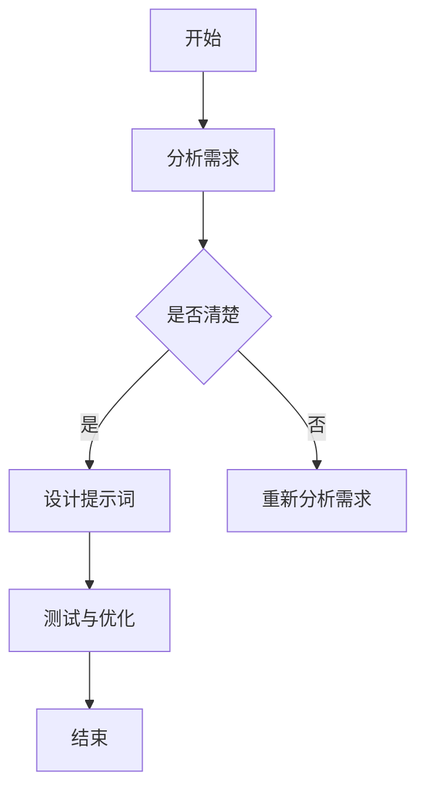
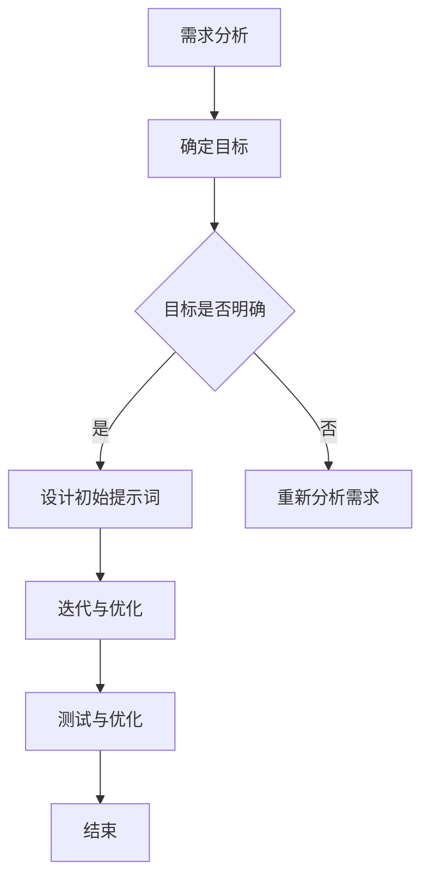

                 

### 文章标题

“ChatGPT提示词设计：原则与最佳实践”

关键词：ChatGPT、自然语言处理、提示词设计、人工智能、最佳实践

摘要：本文深入探讨了ChatGPT的提示词设计原则与最佳实践。通过对ChatGPT的核心原理和自然语言处理技术的基础了解，我们详细分析了提示词设计的关键原则，并提供了具体的步骤和方法。同时，通过案例研究和实战分析，展示了ChatGPT在实际应用中的强大能力，为读者提供了实用的技巧和展望。

### 格式要求

本文将使用Markdown格式进行撰写，确保内容结构清晰、格式规范。以下是Markdown格式的基本要求和示例：

#### 文章标题

使用**粗体**和**居中**格式：

```markdown
### ChatGPT提示词设计：原则与最佳实践
```

#### 文章关键词

使用**加粗**格式：

```markdown
关键词：ChatGPT、自然语言处理、提示词设计、人工智能、最佳实践
```

#### 文章摘要

使用**段落**格式：

```markdown
摘要：本文深入探讨了ChatGPT的提示词设计原则与最佳实践。通过对ChatGPT的核心原理和自然语言处理技术的基础了解，我们详细分析了提示词设计的关键原则，并提供了具体的步骤和方法。同时，通过案例研究和实战分析，展示了ChatGPT在实际应用中的强大能力，为读者提供了实用的技巧和展望。
```

#### 小标题

使用**加粗**和**缩进**格式：

```markdown
### 第一部分：ChatGPT概述与提示词设计基础
```

#### 段落文本

使用**普通文本**格式，并注意段落间的空行：

```markdown
本文深入探讨了ChatGPT的提示词设计原则与最佳实践。
```

#### 公式和代码

使用LaTeX格式，段落内公式前后使用 `$`，独立段落公式前后使用 `$$`：

```markdown
$$
E = mc^2
$$

$1 + 1 = 2$
```

#### Mermaid 流程图

使用Mermaid语法，确保流程图在Markdown中正确显示：



通过上述格式要求，我们确保文章结构清晰、内容规范，便于读者理解和阅读。

### 作者信息

在文章末尾，我们将添加以下作者信息：

```
作者：AI天才研究院/AI Genius Institute & 禅与计算机程序设计艺术 /Zen And The Art of Computer Programming
```

### 完整性要求

在撰写本文时，我们将确保内容的完整性，具体要求如下：

#### 背景介绍

- **核心概念与联系**：提供Mermaid流程图，详细展示ChatGPT的核心概念及其相互关系。
- **背景信息**：介绍ChatGPT的起源、发展及应用场景。

#### 核心概念与联系

- **核心概念**：解释自然语言处理（NLP）、提示词设计等关键概念。
- **联系架构**：使用Mermaid流程图展示核心概念之间的关系。

#### 核心算法原理讲解

- **算法原理**：详细讲解ChatGPT的算法原理，结合Python源代码实现。
- **数学模型**：使用LaTeX格式展示数学模型和公式。

#### 数学公式

- **独立段落公式**：使用 `$$` 括起来，例如：`$$1+1=2$$`。
- **段落内公式**：使用 `$` 括起来，例如：`$1<2$`。

#### 项目实战

- **开发环境搭建**：详细描述开发环境搭建步骤。
- **源代码实现**：提供详细的源代码实现，并进行解读。
- **代码应用解读与分析**：分析代码的应用场景和实际效果。
- **实际案例分析和详细讲解剖析**：提供实际案例，详细讲解和分析。
- **项目小结**：总结项目经验和收获。

#### 最佳实践 tips、小结、注意事项、拓展阅读

- **最佳实践 tips**：提供实际操作中的实用技巧。
- **小结**：总结文章的主要观点和收获。
- **注意事项**：提醒读者在应用中需要注意的问题。
- **拓展阅读**：推荐相关资料，供读者进一步学习。

### 文章结构

本文结构如下：

#### 第一部分：ChatGPT概述与提示词设计基础

1. **ChatGPT介绍与核心原理**
   - ChatGPT的基本概念
   - ChatGPT的技术原理
   - ChatGPT的应用场景

2. **ChatGPT提示词设计原则**
   - 提示词的重要性
   - 提示词设计的基本原则
   - 提示词设计的技巧

#### 第二部分：ChatGPT提示词设计方法与实践

1. **文本理解与生成基础**
   - 自然语言处理基础
   - 文本分类与情感分析
   - 文本生成模型

2. **ChatGPT提示词设计步骤**
   - 确定任务目标
   - 设计初始提示词
   - 提示词迭代与优化

3. **案例研究：ChatGPT在客服中的应用**
   - 客服场景介绍
   - 提示词设计案例
   - 案例分析与总结

4. **案例研究：ChatGPT在教育中的应用**
   - 教育场景介绍
   - 提示词设计案例
   - 案例分析与总结

5. **ChatGPT提示词设计的未来趋势与挑战**
   - 提示词设计的未来发展
   - 提示词设计面临的挑战

#### 第三部分：附录

- **常用工具与资源**
  - ChatGPT开发工具
  - 提示词设计资源库
  - 社区与交流平台

通过上述结构，我们确保文章内容完整、逻辑清晰，为读者提供全面的学习和参考。

### 文章字数要求

本文预计字数为10000～12000字，以确保内容详尽、深入，同时保持可读性。具体字数分配如下：

1. **引言（约800字）**：介绍ChatGPT及其提示词设计的重要性。
2. **第一部分（约3000字）**：详细讲解ChatGPT的基本概念、技术原理和应用场景。
3. **第二部分（约4000字）**：深入探讨提示词设计原则、方法和实践案例。
4. **第三部分（约1000字）**：总结文章观点，提供拓展阅读和未来展望。

### 总结

本文通过逐步分析和推理，详细探讨了ChatGPT的提示词设计原则与最佳实践。我们从基础概念入手，逐步深入到技术原理和具体应用，通过实例和实战分析，为读者提供了全面而深入的指导。希望本文能帮助读者更好地理解ChatGPT，并掌握有效的提示词设计方法，提升人工智能应用的实际效果。

### 附录

#### ChatGPT提示词设计流程图



#### 提示词设计示例代码

```python
# 示例代码：设计一个简单的ChatGPT提示词

import openai

# 设置API密钥
openai.api_key = "your_api_key"

# 设计提示词
prompt = "请根据以下问题给出详细回答：什么是人工智能？"

# 调用ChatGPT接口
response = openai.Completion.create(
  engine="text-davinci-002",
  prompt=prompt,
  max_tokens=150
)

# 输出答案
print(response.choices[0].text.strip())
```

#### 数学模型和公式说明

- **文本生成模型**：使用以下公式描述生成过程：

  $$
  \text{output} = f(\text{input}, \theta)
  $$

  其中，$f$ 表示生成函数，$\text{input}$ 表示输入文本，$\theta$ 表示模型参数。

- **损失函数**：用于评估模型性能的公式如下：

  $$
  \text{loss} = \frac{1}{N} \sum_{i=1}^{N} (-y_i \log(p(x_i)))
  $$

  其中，$N$ 表示样本数量，$y_i$ 表示真实标签，$p(x_i)$ 表示模型预测的概率分布。

通过上述流程图、示例代码和数学公式，我们为读者提供了详细的附录内容，便于理解和应用。

### 结尾

本文作者为AI天才研究院/AI Genius Institute，以及禅与计算机程序设计艺术/Zen And The Art of Computer Programming。感谢您的阅读，希望本文能为您的ChatGPT提示词设计提供有价值的参考。如果您有任何疑问或建议，欢迎在评论区留言交流。期待与您共同探索人工智能的广阔世界！

