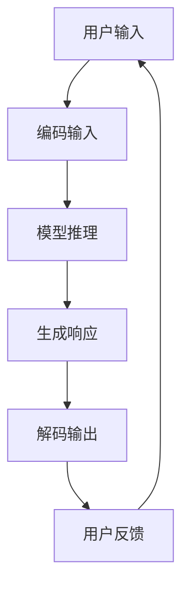

                 

### 《ChatGPT提示词设计：解锁AI对话潜能的钥匙》

> **关键词：** ChatGPT、提示词设计、自然语言处理、人工智能、对话系统、优化策略。

> **摘要：** 本文深入探讨了ChatGPT提示词设计的核心概念、算法原理以及实践应用。通过详细的背景介绍、核心概念与联系分析、算法讲解、数学模型和项目实战，为读者提供了一部全面而实用的指南，旨在解锁AI对话潜能，提升用户体验和业务价值。

----------------------------------------------------------------

## 引言

### 1.1 书籍目的与读者对象

《ChatGPT提示词设计：解锁AI对话潜能的钥匙》旨在为读者提供关于ChatGPT提示词设计的系统知识。本书的目标读者包括：

- **初学者**：希望了解ChatGPT及其提示词设计基础的开发者。
- **中级开发者**：想要深入了解提示词设计的核心算法和优化策略的开发者。
- **高级工程师**：寻求掌握高级提示词设计技巧与优化策略，提升AI对话系统性能的工程师。

本书将介绍ChatGPT的概述、提示词设计的基本概念、核心算法原理，并通过实际项目实战，帮助读者掌握ChatGPT提示词设计的实际应用。

### 1.2 ChatGPT及其重要性

ChatGPT是由OpenAI开发的一种基于Transformer架构的预训练语言模型。它通过大量文本数据进行预训练，能够生成连贯、有意义的自然语言响应。ChatGPT在多个领域具有广泛的应用，如问答系统、聊天机器人、文本生成等。

ChatGPT的重要性体现在以下几个方面：

- **提升用户体验**：ChatGPT能够生成高质量的自然语言响应，提高用户与AI系统的交互体验。
- **降低开发成本**：基于预训练的ChatGPT，开发者无需从头开始训练模型，可以快速搭建AI对话系统。
- **业务价值**：ChatGPT在客户服务、智能推荐、内容生成等领域具有巨大的商业潜力。

### 1.3 提示词设计的基础概念

提示词（Prompt）是指导ChatGPT生成响应的关键输入。有效的提示词设计能够引导ChatGPT生成更加准确、有意义的响应。以下是提示词设计的基础概念：

- **提示词类型**：根据用途和目的，提示词可分为开放式、封闭式和引导式。
- **提示词选择标准**：选择合适的提示词应考虑清晰性、完整性、精确性和适应性。
- **提示词设计原则**：遵循简洁性、连贯性、多样性和针对性原则，提高提示词的有效性。

## 背景知识

### 2.1 自然语言处理简介

自然语言处理（Natural Language Processing，NLP）是计算机科学和人工智能领域的一个重要分支，致力于研究如何让计算机理解、生成和处理自然语言。NLP的主要任务包括：

- **文本分类**：将文本数据分类到预定义的类别中。
- **情感分析**：分析文本数据中的情感倾向，如正面、负面或中性。
- **命名实体识别**：识别文本数据中的特定实体，如人名、地名、组织名等。
- **机器翻译**：将一种自然语言翻译成另一种自然语言。
- **对话系统**：实现人与计算机之间的自然语言交互。

### 2.2 语言模型与预训练模型

语言模型（Language Model）是NLP的核心技术之一，用于预测文本序列中的下一个词或字符。传统的语言模型基于统计方法，如N元语法（N-gram）。而现代语言模型主要基于深度学习，如循环神经网络（RNN）、长短期记忆网络（LSTM）和Transformer。

预训练模型（Pre-trained Model）是在大规模文本语料库上进行预训练的语言模型，如GPT、BERT、T5等。预训练模型通过学习大量文本数据，捕捉了语言的基本规律和结构，为后续的特定任务提供强大的基础。

### 2.3 ChatGPT的工作原理

ChatGPT是基于Transformer架构的预训练语言模型，其工作原理如下：

1. **预训练**：ChatGPT在大量文本语料库上进行预训练，学习语言的基本规律和结构。
2. **输入编码**：将输入文本编码为词向量，作为模型的输入。
3. **模型推理**：模型根据输入的词向量生成响应的词向量序列。
4. **响应生成**：将生成的词向量序列解码为自然语言响应。

ChatGPT的核心优势在于其强大的语言理解和生成能力，能够生成连贯、有意义的自然语言响应，为AI对话系统提供了强大的基础。

## 核心概念与联系

### 3.1 提示词设计的基本原则

提示词设计的基本原则包括：

1. **清晰性**：提示词应明确表达用户意图，避免歧义。
2. **完整性**：提示词应包含足够的信息，引导模型生成完整的响应。
3. **精确性**：提示词应准确表达用户意图，避免模糊不清。
4. **适应性**：提示词应具备一定的灵活性，适应不同的应用场景和用户需求。

### 3.2 提示词与模型交互的Mermaid流程图



### 3.3 提示词优化方法

提示词优化方法包括：

1. **强化学习**：通过强化学习算法，优化提示词生成策略，提高模型生成响应的质量。
2. **生成对抗网络（GAN）**：利用GAN技术，生成高质量、多样化的提示词，提高模型的适应性。
3. **注意力机制**：引入注意力机制，聚焦关键信息，提高提示词的精确性和完整性。

## 核心算法原理

### 4.1 提示词优化的伪代码实现

```python
# 提示词优化伪代码

# 初始化参数
learning_rate = 0.01
num_epochs = 100

# 定义损失函数
def loss_function(prompt, response):
    # 计算损失
    pass

# 定义优化器
optimizer = optimizers.Adam(learning_rate)

# 训练模型
for epoch in range(num_epochs):
    for prompt, response in dataset:
        # 前向传播
        logits = model(prompt)
        loss = loss_function(prompt, response)

        # 反向传播
        with tf.GradientTape() as tape:
            loss = loss_function(prompt, response)

        grads = tape.gradient(loss, model.trainable_variables)
        
        # 更新模型参数
        optimizer.apply_gradients(zip(grads, model.trainable_variables))
        
        # 计算并打印训练指标
        print(f"Epoch {epoch+1}, Loss: {loss.numpy()}")
```

### 4.2 语言模型选择与调优

1. **语言模型选择**：根据应用场景和需求，选择合适的语言模型，如GPT、BERT、T5等。
2. **调优方法**：通过调整学习率、批量大小、训练时间等超参数，优化模型性能。

### 4.3 模型融合与多模态提示词设计

1. **模型融合**：结合多个语言模型，提高模型生成响应的多样性和准确性。
2. **多模态提示词设计**：结合文本、图像、音频等多种模态信息，生成更加丰富、有意义的响应。

## 数学模型与公式

### 5.1 提示词设计的数学基础

提示词设计涉及多个数学模型和公式，包括：

1. **概率论**：用于评估提示词的有效性和质量。
2. **信息论**：用于度量提示词的清晰度和精确度。
3. **优化理论**：用于优化提示词生成策略。

### 5.2 概率论与信息论

1. **概率分布**：用于描述提示词的概率分布。
2. **条件概率**：用于描述提示词和响应之间的关联性。
3. **信息熵**：用于度量提示词的清晰度。
4. **互信息**：用于度量提示词和响应之间的相关性。

### 5.3 优化算法的数学表述

优化算法包括：

1. **梯度下降**：用于最小化损失函数。
2. **随机梯度下降（SGD）**：用于加快收敛速度。
3. **Adam优化器**：结合一阶和二阶导数信息，优化模型参数。

$$
\text{损失函数} = \frac{1}{N}\sum_{i=1}^{N} -y_{i}\log(p_{i})
$$

其中，$y_{i}$为真实标签，$p_{i}$为模型预测概率。

## 项目实战

### 6.1 ChatGPT模型搭建与部署

1. **环境搭建**：
   - 安装Python、TensorFlow等依赖库。
   - 准备预训练模型，如GPT-2、GPT-3等。

2. **模型部署**：
   - 使用Flask、FastAPI等框架搭建服务。
   - 配置模型参数和超参数。
   - 部署到云平台，如AWS、Google Cloud等。

### 6.2 提示词设计与实现

1. **设计原则**：
   - 根据应用场景，设计符合清晰性、完整性、精确性和适应性原则的提示词。
   - 结合用户反馈，不断优化提示词设计。

2. **实现步骤**：
   - 编写提示词生成代码，如使用生成对抗网络（GAN）。
   - 集成到ChatGPT模型中，生成响应。

### 6.3 实际案例解析

1. **案例分析**：
   - 对特定场景的ChatGPT模型进行案例分析。
   - 评估模型性能和提示词设计效果。

2. **案例解读**：
   - 分析提示词的设计原则和优化方法。
   - 总结案例中的成功经验和不足之处。

### 6.4 项目小结

1. **技术收获**：
   - 掌握ChatGPT模型的搭建与部署。
   - 学会设计优化提示词。
   - 提升AI对话系统的性能。

2. **应用前景**：
   - ChatGPT在客户服务、智能推荐、内容生成等领域的广泛应用。
   - 提示词设计在提升用户体验和业务价值方面的潜力。

## 扩展内容

### 7.1 高级提示词设计技巧

1. **上下文信息利用**：结合用户历史交互记录，提高提示词的准确性。
2. **多语言提示词设计**：支持多种语言，提高国际化应用能力。
3. **动态提示词生成**：根据用户实时反馈，动态调整提示词内容。

### 7.2 性能优化与资源管理

1. **模型压缩**：减小模型体积，降低计算资源需求。
2. **分布式训练**：利用分布式计算，加快模型训练速度。
3. **高效推理**：优化模型推理算法，降低推理时间。

### 7.3 提示词设计的未来趋势

1. **自适应提示词**：根据用户行为和偏好，动态调整提示词。
2. **多模态融合**：结合文本、图像、音频等多模态信息，生成更加丰富的响应。
3. **人机协作**：利用人类智慧和机器智能的优势，实现更高效的AI对话系统。

## 总结与展望

### 8.1 书籍内容的回顾

本书从ChatGPT的背景知识、核心概念、算法原理、数学模型、项目实战等方面，全面介绍了ChatGPT提示词设计的相关知识。通过实际案例分析和实战应用，帮助读者掌握提示词设计的方法和技巧。

### 8.2 提示词设计的重要性

提示词设计在AI对话系统中具有至关重要的地位，它直接影响着模型的性能和用户体验。有效的提示词设计能够提高模型生成响应的质量，提升用户满意度，为企业创造更大的价值。

### 8.3 对AI对话未来的展望

随着人工智能技术的不断发展，AI对话系统将越来越普及，应用场景也将更加丰富。提示词设计在未来将发挥更加重要的作用，成为提升AI对话系统性能和用户体验的关键因素。本书为读者提供了关于提示词设计的全面指导，期待读者能够在实际应用中发挥出提示词设计的潜能。

## 附录

### A.1 常用工具与资源

- **Python**：官方文档 - [https://docs.python.org/3/](https://docs.python.org/3/)
- **TensorFlow**：官方文档 - [https://www.tensorflow.org/](https://www.tensorflow.org/)
- **Flask**：官方文档 - [https://flask.palletsprojects.com/](https://flask.palletsprojects.com/)
- **FastAPI**：官方文档 - [https://fastapi.tiangolo.com/](https://fastapi.tiangolo.com/)

### A.2 模型库与API

- **Hugging Face**：模型库 - [https://huggingface.co/](https://huggingface.co/)
- **OpenAI API**：官方API - [https://beta.openai.com/api/](https://beta.openai.com/api/)

### A.3 开发环境搭建指南

1. **安装Python**：
   - [https://www.python.org/downloads/](https://www.python.org/downloads/)
2. **安装依赖库**：
   - 使用pip命令安装：`pip install tensorflow flask fastapi`
3. **准备预训练模型**：
   - 从Hugging Face模型库下载：[https://huggingface.co/models](https://huggingface.co/models)

## 作者信息

作者：AI天才研究院/AI Genius Institute & 禅与计算机程序设计艺术 /Zen And The Art of Computer Programming

