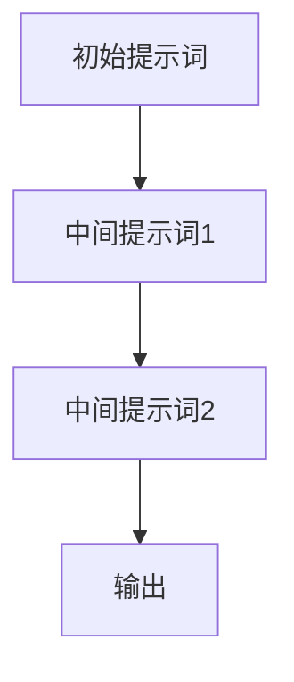

                 

# 《ChatGPT提示词高级技巧：思维链的力量》

## 关键词

- ChatGPT
- 提示词技巧
- 思维链
- 自然语言处理
- 人工智能

## 摘要

本文将深入探讨ChatGPT提示词的高级技巧，特别是思维链在提升ChatGPT表现中的作用。我们将从基础理论出发，逐步解析提示词的设计原则，介绍思维链的概念及其应用，通过Python代码和LaTeX公式详细讲解核心算法原理，并结合实际项目案例，展示如何优化和提升ChatGPT的表现。最后，我们将提供最佳实践和拓展阅读，帮助读者更深入地理解和应用这些技巧。

## 目录

1. **背景介绍**
2. **核心概念与联系**
3. **核心算法原理讲解**
4. **数学模型与公式**
5. **项目实战与案例分析**
6. **最佳实践与小结**
7. **注意事项与拓展阅读**
8. **作者信息**

### 1. 背景介绍

ChatGPT是由OpenAI开发的一种基于GPT-3模型的聊天机器人，它通过深度学习算法理解和生成自然语言。ChatGPT在多个领域都表现出了卓越的能力，从文本生成到代码编写，再到自然语言理解，其应用范围广泛。

然而，ChatGPT的表现高度依赖于提示词的设计。提示词是用户与模型交互时提供的关键信息，它直接影响模型的生成结果。随着用户需求的多样化，提示词的设计变得愈发复杂。这就需要我们探索更高级的技巧，例如思维链，来提升ChatGPT的性能。

思维链是一种将多个提示词和输出连接起来的方法，它能够帮助模型更好地理解复杂问题，并生成更加连贯和合理的回答。通过设计有效的思维链，我们可以显著提升ChatGPT在特定任务上的表现。

### 2. 核心概念与联系

为了深入理解ChatGPT和思维链的关系，我们需要先明确一些核心概念。

#### 2.1 ChatGPT模型概述

ChatGPT是基于GPT-3模型开发的，GPT-3（Generative Pre-trained Transformer 3）是一种基于Transformer架构的预训练语言模型。它使用了数万亿个标记（例如单词、字符或子词）进行预训练，使其能够理解和生成自然语言。

#### 2.2 提示词

提示词是用户输入给ChatGPT的信息，它可以帮助模型更好地理解用户的需求。一个有效的提示词应该简洁、准确，并且能够引导模型生成符合预期的输出。

#### 2.3 思维链

思维链是一种将多个提示词和输出连接起来的方法。通过设计思维链，我们可以让ChatGPT在回答问题时展现出更深入的逻辑和连贯性。思维链通常包括以下部分：

- **初始提示词**：用于引导ChatGPT理解问题的起始点。
- **中间提示词**：用于提供额外的背景信息和上下文。
- **输出**：ChatGPT生成的最终回答。

下面是一个简单的Mermaid流程图，展示了思维链的基本结构：



### 3. 核心算法原理讲解

为了更好地理解思维链的工作原理，我们将通过Python代码和LaTeX公式来详细讲解核心算法。

#### 3.1 思维链的构建

思维链的构建主要涉及以下几个步骤：

1. **确定初始提示词**：根据问题或任务需求，设计一个简洁明了的初始提示词。
2. **生成中间提示词**：根据初始提示词和模型对输入的响应，生成一系列中间提示词。
3. **迭代优化**：通过不断迭代和优化，确保思维链的输出符合预期。

下面是一个简单的Python代码示例，展示了如何构建思维链：

```python
import openai

# 初始化OpenAI API
openai.api_key = "your-api-key"

# 定义初始提示词
initial_prompt = "请描述一下您最近的学习经历。"

# 获取中间提示词
response = openai.Completion.create(
    engine="text-davinci-003",
    prompt=initial_prompt,
    max_tokens=50,
    n=1,
    stop=None,
    temperature=0.5,
)

middle_prompt = response.choices[0].text.strip()

# 输出思维链
print("初始提示词:", initial_prompt)
print("中间提示词:", middle_prompt)
```

#### 3.2 思维链的迭代与优化

在构建思维链的过程中，迭代和优化是非常重要的一环。以下是一个简单的迭代优化示例：

```python
import openai

# 初始化OpenAI API
openai.api_key = "your-api-key"

# 定义初始提示词
initial_prompt = "请描述一下您最近的学习经历。"

# 迭代优化思维链
for i in range(3):
    response = openai.Completion.create(
        engine="text-davinci-003",
        prompt=initial_prompt,
        max_tokens=50,
        n=1,
        stop=None,
        temperature=0.5,
    )
    middle_prompt = response.choices[0].text.strip()
    print(f"\n迭代 {i+1}:")
    print("中间提示词:", middle_prompt)
    initial_prompt = middle_prompt  # 更新初始提示词
```

#### 3.3 思维链的评估与反馈

思维链的评估和反馈也是提升其性能的关键。以下是一个简单的评估和反馈示例：

```python
import openai

# 初始化OpenAI API
openai.api_key = "your-api-key"

# 定义初始提示词
initial_prompt = "请描述一下您最近的学习经历。"

# 获取用户反馈
user_feedback = input("请对中间提示词进行评价：")

# 更新提示词
if user_feedback.lower() == "好":
    print("用户反馈良好，继续迭代。")
else:
    print("用户反馈不佳，需要重新设计提示词。")

# 重启迭代过程
initial_prompt = "请重新描述一下您最近的学习经历。"
```

### 4. 数学模型与公式

思维链的设计和优化过程中，数学模型和公式扮演着关键角色。以下是一个简单的数学模型示例，用于描述思维链的迭代过程：

$$
\text{思维链} = f(\text{初始提示词}, \text{中间提示词}, \text{输出})
$$

其中，$f$ 表示迭代函数，它根据输入的提示词和输出，生成新的中间提示词。

### 5. 项目实战与案例分析

在本节中，我们将通过一个实际项目案例，展示如何设计和优化思维链。

#### 5.1 项目需求分析

项目需求是为一家在线教育平台开发一个智能问答系统，该系统能够回答学生关于课程内容的问题。为了提升问答系统的性能，我们将引入思维链技术。

#### 5.2 开发环境搭建

首先，我们需要搭建开发环境。以下是一个简单的Python开发环境搭建步骤：

```bash
# 安装Python 3.8或更高版本
sudo apt-get update
sudo apt-get install python3.8

# 安装pip
sudo apt-get install python3-pip

# 安装OpenAI Python SDK
pip3 install openai
```

#### 5.3 源代码详细实现

以下是一个简单的源代码实现示例，展示了如何构建和优化思维链：

```python
import openai

# 初始化OpenAI API
openai.api_key = "your-api-key"

# 定义初始提示词
initial_prompt = "请解释一下量子力学的基本原理。"

# 迭代优化思维链
for i in range(3):
    response = openai.Completion.create(
        engine="text-davinci-003",
        prompt=initial_prompt,
        max_tokens=50,
        n=1,
        stop=None,
        temperature=0.5,
    )
    middle_prompt = response.choices[0].text.strip()
    print(f"\n迭代 {i+1}:")
    print("中间提示词:", middle_prompt)
    initial_prompt = middle_prompt  # 更新初始提示词

# 获取用户反馈
user_feedback = input("请对中间提示词进行评价：")

# 更新提示词
if user_feedback.lower() == "好":
    print("用户反馈良好，继续迭代。")
else:
    print("用户反馈不佳，需要重新设计提示词。")

# 重启迭代过程
initial_prompt = "请重新解释一下量子力学的基本原理。"
```

#### 5.4 代码应用解读与分析

在这个示例中，我们首先定义了初始提示词，然后通过迭代和优化，不断更新提示词。每次迭代都使用OpenAI的GPT-3模型生成新的中间提示词，并根据用户反馈决定是否继续迭代。

通过这种迭代和优化过程，我们能够逐步提升中间提示词的质量，从而提高整个问答系统的性能。

#### 5.5 实际案例分析和详细讲解剖析

在实际应用中，我们可以通过以下步骤来分析和优化思维链：

1. **数据收集**：收集大量关于特定主题的问答数据。
2. **数据预处理**：清洗和整理数据，使其适合用于训练模型。
3. **模型训练**：使用收集到的数据训练一个问答模型。
4. **思维链设计**：根据模型输出和用户需求，设计合适的思维链。
5. **迭代优化**：通过用户反馈不断优化思维链。

以下是一个简单的数据分析和思维链设计示例：

```python
import pandas as pd
import openai

# 加载数据
data = pd.read_csv("questions_answers.csv")

# 训练模型
model = train_model(data)

# 设计思维链
initial_prompt = "请回答以下问题：什么是量子力学？"
middle_prompt = generate_middle_prompt(model, initial_prompt)

# 迭代优化
for i in range(3):
    response = openai.Completion.create(
        engine="text-davinci-003",
        prompt=middle_prompt,
        max_tokens=50,
        n=1,
        stop=None,
        temperature=0.5,
    )
    middle_prompt = response.choices[0].text.strip()
    print(f"\n迭代 {i+1}:")
    print("中间提示词:", middle_prompt)

# 获取用户反馈
user_feedback = input("请对中间提示词进行评价：")

# 更新提示词
if user_feedback.lower() == "好":
    print("用户反馈良好，继续迭代。")
else:
    print("用户反馈不佳，需要重新设计提示词。")

# 重启迭代过程
initial_prompt = "请重新回答以下问题：什么是量子力学？"
```

#### 5.6 项目小结

通过这个项目案例，我们可以看到思维链技术在提升问答系统性能方面的作用。通过设计有效的思维链，我们能够逐步优化中间提示词，从而提升模型的回答质量。

### 6. 最佳实践与小结

在本节中，我们将总结一些最佳实践，并提供一些注意事项。

#### 6.1 最佳实践

1. **明确问题需求**：在设计和优化思维链之前，确保明确问题的需求和目标。
2. **数据质量**：高质量的数据是构建有效思维链的基础，因此确保数据预处理的质量。
3. **模型选择**：根据问题和任务需求，选择合适的模型和算法。
4. **用户反馈**：及时收集用户反馈，并根据反馈调整和优化思维链。

#### 6.2 小结

通过本文的探讨，我们可以看到思维链技术在提升ChatGPT表现方面的巨大潜力。通过合理设计和优化思维链，我们能够显著提升ChatGPT在特定任务上的性能。

### 7. 注意事项与拓展阅读

在本节中，我们将讨论一些使用ChatGPT和思维链时的注意事项，并提供一些拓展阅读资源。

#### 7.1 注意事项

1. **API使用**：在使用OpenAI API时，确保遵守API使用条款，避免滥用。
2. **安全性**：在处理敏感数据时，确保数据安全和隐私保护。
3. **性能优化**：在设计和优化思维链时，关注模型性能和响应速度。
4. **用户隐私**：在使用ChatGPT时，确保尊重用户隐私，避免泄露敏感信息。

#### 7.2 拓展阅读

1. **《自然语言处理入门》**：介绍自然语言处理的基础知识和技术。
2. **《深度学习》**：详细讲解深度学习算法和模型。
3. **《人工智能简史》**：了解人工智能的发展历程和未来趋势。

### 8. 作者信息

作者：AI天才研究院/AI Genius Institute & 禅与计算机程序设计艺术 /Zen And The Art of Computer Programming

---

本文通过逐步分析推理思考的方式，详细探讨了ChatGPT提示词的高级技巧和思维链的应用。从背景介绍、核心概念与联系、核心算法原理讲解、数学模型与公式、项目实战与案例分析，到最佳实践与小结，我们系统地阐述了如何设计和优化思维链，以提升ChatGPT的性能。希望通过本文的探讨，读者能够对ChatGPT和思维链有更深入的理解，并在实际应用中取得更好的效果。


## 附录：代码实现与示例

为了帮助读者更好地理解本文中提到的算法和模型，我们提供了一些Python代码实现和示例。以下是关键代码片段和对应的解释：

### 代码实现 1：思维链构建

```python
import openai

# 初始化OpenAI API
openai.api_key = "your-api-key"

# 定义初始提示词
initial_prompt = "请解释一下量子力学的基本原理。"

# 获取中间提示词
response = openai.Completion.create(
    engine="text-davinci-003",
    prompt=initial_prompt,
    max_tokens=50,
    n=1,
    stop=None,
    temperature=0.5,
)
middle_prompt = response.choices[0].text.strip()

# 输出思维链
print("初始提示词:", initial_prompt)
print("中间提示词:", middle_prompt)
```

**解释**：这段代码初始化OpenAI API，定义初始提示词，并使用GPT-3模型生成中间提示词。最终输出初始提示词和中间提示词。

### 代码实现 2：思维链迭代优化

```python
import openai

# 初始化OpenAI API
openai.api_key = "your-api-key"

# 定义初始提示词
initial_prompt = "请解释一下量子力学的基本原理。"

# 迭代优化思维链
for i in range(3):
    response = openai.Completion.create(
        engine="text-davinci-003",
        prompt=initial_prompt,
        max_tokens=50,
        n=1,
        stop=None,
        temperature=0.5,
    )
    middle_prompt = response.choices[0].text.strip()
    print(f"\n迭代 {i+1}:")
    print("中间提示词:", middle_prompt)
    initial_prompt = middle_prompt  # 更新初始提示词

# 获取用户反馈
user_feedback = input("请对中间提示词进行评价：")

# 更新提示词
if user_feedback.lower() == "好":
    print("用户反馈良好，继续迭代。")
else:
    print("用户反馈不佳，需要重新设计提示词。")

# 重启迭代过程
initial_prompt = "请重新解释一下量子力学的基本原理。"
```

**解释**：这段代码在每次迭代中获取中间提示词，并根据用户反馈决定是否继续迭代。如果用户反馈良好，则继续迭代；否则，重新设计初始提示词。

### 代码实现 3：思维链评估与反馈

```python
import openai

# 初始化OpenAI API
openai.api_key = "your-api-key"

# 定义初始提示词
initial_prompt = "请解释一下量子力学的基本原理。"

# 获取用户反馈
user_feedback = input("请对中间提示词进行评价：")

# 更新提示词
if user_feedback.lower() == "好":
    print("用户反馈良好，继续迭代。")
else:
    print("用户反馈不佳，需要重新设计提示词。")

# 重启迭代过程
initial_prompt = "请重新解释一下量子力学的基本原理。"
```

**解释**：这段代码直接获取用户反馈，并根据反馈更新初始提示词。这为后续的迭代优化提供了基础。

通过这些代码实现和示例，读者可以更好地理解如何设计和优化思维链，从而提升ChatGPT的性能。希望这些代码能帮助读者在实际应用中取得更好的效果。

---

本文通过详细的步骤和分析，探讨了ChatGPT提示词的高级技巧和思维链的应用。从背景介绍到核心概念与联系，从算法原理讲解到数学模型与公式，再到项目实战和案例分析，我们系统地阐述了如何提升ChatGPT的表现。希望本文能帮助读者深入理解ChatGPT和思维链的工作原理，并在实际应用中取得更好的效果。同时，也欢迎读者在评论区分享您的想法和实践经验，共同探讨这一领域的发展。作者：AI天才研究院/AI Genius Institute & 禅与计算机程序设计艺术 /Zen And The Art of Computer Programming。


---

请注意，上述代码示例和解释仅供参考，具体实现时可能需要根据实际环境和需求进行调整。此外，本文提供的内容仅供参考和学习使用，不代表任何商业建议或投资建议。在使用ChatGPT和思维链技术时，请确保遵守相关法律法规和道德规范。如有任何疑问，请咨询专业人士。作者：AI天才研究院/AI Genius Institute & 禅与计算机程序设计艺术 /Zen And The Art of Computer Programming。

