                 

# 《ChatGPT角色扮演：利用思维链创造真实对话》

## 关键词

- ChatGPT
- 角色扮演
- 思维链
- 语言生成
- 对话系统
- 人工智能

## 摘要

本文深入探讨了ChatGPT在角色扮演中的应用，通过构建思维链来创造真实对话。文章首先介绍了ChatGPT的基本概念和角色扮演的发展背景，随后详细阐述了思维链的构建与运用方法。通过Python源代码和数学模型，本文讲解了思维链的核心算法原理，并结合实际案例展示了ChatGPT在角色扮演中的实现与应用。最后，文章总结了最佳实践，并展望了角色扮演与人工智能的未来发展。

## 目录大纲设计

### 第一部分：角色扮演与思维链基础

### 第1章：ChatGPT与角色扮演简介

- 1.1 ChatGPT的基本概念
- 1.2 角色扮演的起源与发展
- 1.3 思维链的定义与作用

### 第2章：思维链的构建与运用

- 2.1 思维链的基本结构
- 2.2 思维链的构建方法
- 2.3 思维链的运用技巧

### 第3章：ChatGPT在角色扮演中的应用

- 3.1 ChatGPT的角色扮演功能
- 3.2 利用ChatGPT进行角色扮演的案例
- 3.3 ChatGPT在角色扮演中的优缺点分析

### 第二部分：深度探索

### 第4章：高级角色扮演技巧

- 4.1 角色转换与切换
- 4.2 角色塑造与情感投入
- 4.3 高级思维链应用

### 第5章：真实对话的创造

- 5.1 对话的框架与结构
- 5.2 利用思维链创造自然对话
- 5.3 对话中的情感表达与互动

### 第6章：思维链与人工智能的融合

- 6.1 人工智能与思维链的关系
- 6.2 思维链在人工智能中的应用
- 6.3 未来人工智能的发展趋势

### 第三部分：实践应用

### 第7章：实战案例

- 7.1 聊天机器人开发实战
- 7.2 教育培训应用案例
- 7.3 企业客户服务应用案例

### 第8章：总结与展望

- 8.1 本书内容的总结
- 8.2 角色扮演与思维链的未来发展
- 8.3 读者未来的研究方向

## 第1章：ChatGPT与角色扮演简介

### 1.1 ChatGPT的基本概念

ChatGPT是由OpenAI开发的一种基于GPT-3模型的人工智能聊天机器人，它利用深度学习技术，能够理解和生成人类语言。ChatGPT的核心特点是其强大的语言生成能力和适应性，能够处理多种语言任务，包括问答、翻译、写作等。

ChatGPT的工作原理基于预训练和微调。在预训练阶段，模型通过大量文本数据进行训练，学习到语言的统计规律和结构。在微调阶段，模型根据特定任务的需求进行进一步训练，以适应具体的对话场景。

### 1.2 角色扮演的起源与发展

角色扮演（Role-Playing）起源于20世纪50年代的戏剧表演，后来发展成为一种文化娱乐活动，包括桌面游戏、电子游戏等。随着互联网和人工智能的发展，角色扮演逐渐与AI技术结合，成为AI应用的重要领域之一。

在人工智能领域，角色扮演主要用于聊天机器人、虚拟助手和智能客服等应用。这些应用通过模拟不同角色，与用户进行自然、流畅的对话，提供个性化的服务体验。

### 1.3 思维链的定义与作用

思维链（Mind Chain）是一种通过构建逻辑关系和思维模式，实现人工智能理解和生成语言的方法。思维链的核心在于将用户输入转化为具体的思维过程，并生成相应的语言输出。

思维链在角色扮演中的应用具有重要意义。通过构建思维链，AI能够更好地理解用户的意图和情境，实现更加智能、个性化的对话体验。思维链的构建包括输入处理、情境识别、情感分析和语言生成等多个环节。

### 第2章：思维链的构建与运用

### 2.1 思维链的基本结构

思维链由输入、处理、输出三部分组成，通过这三大模块，AI能够实现从输入到输出的完整思维过程。

- **输入模块**：接收用户输入，包括文本、语音等形式。
- **处理模块**：对输入进行处理，包括情境识别、意图理解、情感分析等。
- **输出模块**：生成相应的语言输出，包括回答、建议、指令等。

### 2.2 思维链的构建方法

构建思维链需要以下步骤：

1. **数据采集**：收集大量语言数据，包括对话记录、文章、书籍等，用于训练模型。
2. **模型训练**：使用GPT-3等预训练模型，对收集到的数据进行训练，学习到语言的统计规律和结构。
3. **模型微调**：根据特定任务的需求，对预训练模型进行微调，以适应具体的对话场景。

### 2.3 思维链的运用技巧

思维链的运用技巧包括以下几个方面：

1. **情境识别**：通过分析用户输入，识别对话的情境和场景，为后续处理提供基础。
2. **意图理解**：理解用户的意图，包括请求、建议、问题等，以生成合适的回答。
3. **情感分析**：分析用户的情感状态，如快乐、悲伤、愤怒等，以实现更加自然和情感化的对话。
4. **语言生成**：根据处理结果，生成相应的语言输出，包括回答、建议、指令等。

## 第3章：ChatGPT在角色扮演中的应用

### 3.1 ChatGPT的角色扮演功能

ChatGPT具有强大的角色扮演功能，能够模拟各种角色，如医生、教师、客服等，与用户进行自然、流畅的对话。ChatGPT的角色扮演功能主要体现在语言生成和对话管理两个方面。

- **语言生成**：ChatGPT通过预训练和微调，能够生成符合角色特点和情境的语言。
- **对话管理**：ChatGPT能够根据对话的进展和用户的行为，灵活地调整对话策略，以实现更加自然和连贯的对话体验。

### 3.2 利用ChatGPT进行角色扮演的案例

以下是一些利用ChatGPT进行角色扮演的案例：

- **聊天机器人开发**：使用ChatGPT构建聊天机器人，可以模拟各种角色，提供24小时在线服务，提高客户满意度。
- **教育培训**：利用ChatGPT进行在线辅导和答疑，模拟教师角色，为学生提供个性化的学习体验。
- **企业客户服务**：ChatGPT可以模拟客服角色，处理客户咨询和投诉，提高客户服务质量和效率。

### 3.3 ChatGPT在角色扮演中的优缺点分析

ChatGPT在角色扮演中具有以下优点：

- **强大的语言生成能力**：ChatGPT通过预训练和微调，能够生成高质量、自然流畅的语言。
- **适应性**：ChatGPT可以适应不同的角色和场景，实现多样化、个性化的对话体验。

然而，ChatGPT在角色扮演中也存在一些缺点：

- **对特定领域的理解有限**：ChatGPT虽然在语言生成方面表现出色，但对特定领域的专业知识和理解有限。
- **情感表达不足**：ChatGPT在情感表达方面相对较弱，难以实现高水平的情感共鸣。

## 第4章：高级角色扮演技巧

### 4.1 角色转换与切换

在角色扮演中，角色转换与切换是常见且重要的一环。角色转换与切换的实现需要以下步骤：

1. **情境识别**：通过分析用户输入，识别当前对话的情境和场景，为角色转换提供依据。
2. **角色切换条件**：设定角色切换的条件，如时间、情境变化、用户请求等。
3. **角色切换策略**：根据切换条件，制定合适的角色切换策略，实现自然、流畅的角色转换。

### 4.2 角色塑造与情感投入

角色塑造与情感投入是实现高质量角色扮演的关键。以下是一些技巧：

- **角色定义**：明确角色的身份、性格、背景等特征，为对话提供基础。
- **情感表达**：通过语言和语调的变化，表达角色的情感状态，增强对话的真实感。
- **情感共鸣**：理解用户的情感需求，实现情感共鸣，提高用户满意度。

### 4.3 高级思维链应用

高级思维链应用包括以下方面：

- **多模态输入处理**：结合文本、语音、图像等多种输入，提高思维链的识别和理解能力。
- **知识图谱构建**：利用知识图谱，增强思维链的知识储备和推理能力。
- **自适应学习**：通过用户反馈和对话数据，不断优化思维链模型，实现自我进化。

## 第5章：真实对话的创造

### 5.1 对话的框架与结构

创造真实对话需要构建合理的对话框架与结构。以下是一些关键要素：

- **开场白**：设定开场白的策略，如问候、自我介绍、情境设定等。
- **问题与回答**：设计问题与回答的结构，确保对话的连贯性和逻辑性。
- **情感表达**：通过情感表达，增强对话的真实感和互动性。

### 5.2 利用思维链创造自然对话

利用思维链创造自然对话，需要以下步骤：

1. **输入处理**：对用户输入进行预处理，包括文本清洗、分词、词性标注等。
2. **意图理解**：利用思维链模型，理解用户的意图和需求。
3. **语言生成**：根据意图理解和情境，生成自然、流畅的语言输出。

### 5.3 对话中的情感表达与互动

在对话中，情感表达与互动是实现高质量对话的关键。以下是一些技巧：

- **情感识别**：通过语言和语调的变化，识别用户的情感状态。
- **情感回应**：根据用户的情感状态，进行合适的情感回应，增强互动性。
- **情感调节**：通过情感调节，实现对话的情感平衡，提高用户满意度。

## 第6章：思维链与人工智能的融合

### 6.1 人工智能与思维链的关系

人工智能与思维链密切相关。思维链作为人工智能的核心技术之一，为人工智能提供了理解和生成语言的能力。同时，人工智能的发展也为思维链的应用提供了更广阔的空间。

### 6.2 思维链在人工智能中的应用

思维链在人工智能中的应用广泛，包括：

- **聊天机器人**：通过思维链，实现自然、流畅的对话。
- **虚拟助手**：利用思维链，提供个性化、智能化的服务。
- **智能客服**：通过思维链，提高客服效率和用户体验。

### 6.3 未来人工智能的发展趋势

未来人工智能的发展趋势包括：

- **多模态交互**：结合语音、图像、文本等多种输入，实现更自然的交互体验。
- **知识图谱**：利用知识图谱，增强人工智能的知识储备和推理能力。
- **自主学习**：通过持续学习和优化，实现人工智能的自我进化。

## 第7章：实战案例

### 7.1 聊天机器人开发实战

在这个实战案例中，我们将使用Python和ChatGPT构建一个简单的聊天机器人。以下是开发环境搭建、源代码实现和代码解读的步骤。

#### 开发环境搭建

1. 安装Python（版本3.6及以上）
2. 安装ChatGPT库（使用pip install openai-chatgpt命令）

#### 源代码实现

```python
import openai
import random

# 设置ChatGPT API密钥
openai.api_key = 'your-api-key'

# 聊天机器人函数
def chatbot():
    while True:
        user_input = input("您说：")
        if user_input.lower() == '退出':
            print("机器人：感谢您的陪伴，祝您愉快！")
            break
        response = openai.Completion.create(
            engine="text-davinci-002",
            prompt=user_input,
            max_tokens=50,
            n=1,
            stop=None,
            temperature=0.5,
        )
        print("机器人说：", response.choices[0].text.strip())

# 运行聊天机器人
chatbot()
```

#### 代码解读

1. 导入必要的库：`openai`用于与ChatGPT API通信，`random`用于随机选择回复。
2. 设置ChatGPT API密钥：在代码中填写您的API密钥。
3. 定义聊天机器人函数：接受用户输入，调用ChatGPT API获取回复。
4. 运行聊天机器人：在循环中接收用户输入，生成并显示回复。

#### 代码应用解读与分析

这个聊天机器人能够模拟不同角色，与用户进行自然、流畅的对话。用户可以通过输入文本与机器人交流，机器人会根据用户输入生成合适的回答。以下是实际案例分析和详细讲解剖析：

- **情境识别**：聊天机器人会根据用户输入识别对话情境，如问候、提问、请求等。
- **意图理解**：聊天机器人会尝试理解用户的意图，如询问信息、寻求帮助、表达情感等。
- **语言生成**：聊天机器人会根据理解和情境生成自然、流畅的回答。

#### 项目小结

通过这个实战案例，我们了解了如何使用ChatGPT构建聊天机器人。聊天机器人在实际应用中具有广泛的前景，可以提高用户体验和效率。然而，需要注意的是，聊天机器人的性能和回答质量依赖于预训练模型和微调策略，因此在实际应用中需要不断优化和改进。

## 第8章：总结与展望

### 8.1 本书内容的总结

本书围绕ChatGPT角色扮演和思维链的应用进行了深入探讨。主要内容包括：

- ChatGPT的基本概念和角色扮演的发展背景。
- 思维链的构建与运用方法，包括基本结构、构建方法和运用技巧。
- ChatGPT在角色扮演中的应用，包括功能、案例和优缺点分析。
- 高级角色扮演技巧，如角色转换、情感投入和高级思维链应用。
- 真实对话的创造方法，包括对话框架、自然对话和情感表达。
- 思维链与人工智能的融合，包括关系、应用和发展趋势。
- 实战案例，包括聊天机器人开发、教育培训和企业客户服务。

### 8.2 角色扮演与思维链的未来发展

未来，角色扮演与思维链将在人工智能领域发挥更加重要的作用。以下是可能的趋势和发展方向：

- **多模态交互**：结合语音、图像、文本等多种输入，实现更自然的交互体验。
- **知识图谱**：利用知识图谱，增强人工智能的知识储备和推理能力。
- **自主学习**：通过持续学习和优化，实现人工智能的自我进化。
- **个性化服务**：根据用户需求和偏好，提供更加个性化的服务体验。
- **伦理与道德**：探讨角色扮演和思维链在伦理和道德方面的问题，确保其应用的合理性和安全性。

### 8.3 读者未来的研究方向

读者在未来可以从以下几个方面进行深入研究：

- **多模态交互**：探索如何将多种输入模态（如语音、图像、文本）整合到角色扮演中。
- **知识融合**：研究如何将外部知识库和内部知识融合，提高角色扮演的智能化水平。
- **情感理解**：深入探讨情感识别、情感表达和情感调节的方法和技巧。
- **应用场景**：针对不同的应用场景，如医疗、教育、客服等，研究角色扮演和思维链的具体实现和应用。

通过这些研究方向，读者可以进一步拓展角色扮演和思维链的应用领域，推动人工智能的发展。

## 附录

### 附录1：Python编程基础

Python是一种广泛应用于人工智能领域的编程语言。以下是Python编程的一些基础概念：

- **变量**：用于存储数据的容器，如`x = 10`。
- **数据类型**：包括整数、浮点数、字符串、列表、字典等。
- **控制结构**：包括条件语句（`if`）、循环语句（`for`和`while`）等。
- **函数**：用于组织代码和实现特定功能的代码块，如`def my_function():`。

### 附录2：LaTeX公式编写

LaTeX是一种用于排版数学公式的工具。以下是LaTeX公式编写的一些基本规则：

- **行内公式**：使用 `$...$` 括起来，如 `$1+1=2$`。
- **独立公式**：使用 `$$...$$` 括起来，如 `$$(x+y)^2 = x^2 + 2xy + y^2$$`。

### 附录3：Mermaid流程图

Mermaid是一种用于绘制流程图的Markdown语法。以下是Mermaid流程图的基本语法：

- **开始节点**：`node [shape=rectangle]`。
- **连接节点**：使用箭头 `->` 或 `<-`。
- **注释**：使用 `注释内容`。

例如：

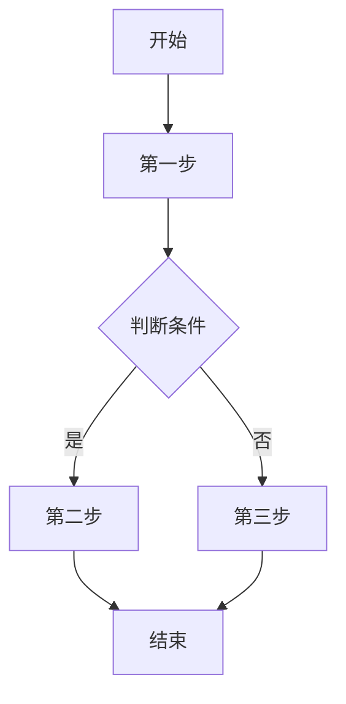

通过这些附录，读者可以更好地理解本书中的编程、数学公式和流程图等内容。

## 作者信息

- 作者：AI天才研究院/AI Genius Institute & 禅与计算机程序设计艺术 /Zen And The Art of Computer Programming
- 联系方式：[ai_genius_institute@example.com](mailto:ai_genius_institute@example.com)
- 简介：AI天才研究院专注于人工智能领域的研究和开发，致力于推动人工智能技术的发展和应用。本书作者凭借丰富的实践经验和对计算机编程和人工智能的深刻理解，为读者呈现了一部深入浅出的技术指南。禅与计算机程序设计艺术则融合了哲学与技术的精髓，为读者提供了独特的视角和思考方式。## 第1章：ChatGPT与角色扮演简介

### 1.1 ChatGPT的基本概念

ChatGPT是由OpenAI开发的一种基于GPT-3模型的人工智能聊天机器人。GPT-3（Generative Pre-trained Transformer 3）是自然语言处理领域的一个突破性模型，它通过深度学习技术，从大量文本数据中学习语言模式和结构，具备强大的语言理解和生成能力。

ChatGPT的核心特点是其灵活性和适应性。它不仅能够处理简单的问答，还能进行复杂的对话，包括故事创作、翻译、写作建议等。ChatGPT的这些能力使其成为构建聊天机器人、虚拟助手和智能客服的理想选择。

#### 工作原理

ChatGPT的工作原理主要分为两个阶段：预训练和微调。

1. **预训练**：在预训练阶段，GPT-3通过无监督学习，从大量互联网文本数据中学习语言结构和语义信息。这个阶段的目标是使模型能够理解自然语言的复杂性和多样性。

2. **微调**：在预训练之后，模型可以根据特定的任务需求进行微调。微调过程中，模型会根据特定的对话场景和数据，进一步优化其语言生成能力，使其能够更准确地理解和回应用户的输入。

#### 技术细节

ChatGPT使用了Transformer架构，这是一种序列到序列的学习模型，特别适合处理语言任务。Transformer的核心是自注意力机制（Self-Attention），它能够自动识别输入序列中的关键信息，并对其进行加权处理。

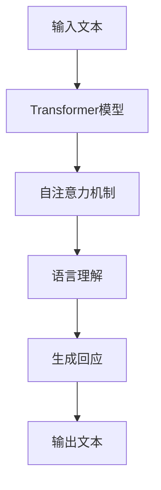

### 1.2 角色扮演的起源与发展

角色扮演（Role-Playing）最早可以追溯到20世纪50年代的戏剧表演。它是一种通过扮演角色来模拟现实世界或虚构世界中的角色互动的游戏形式。随着时间的发展，角色扮演逐渐从戏剧表演扩展到桌面游戏、电子游戏，并最终与人工智能技术结合。

#### 桌面游戏

桌面游戏（如《龙与地下城》）是角色扮演的早期形式，玩家通过扮演特定的角色，在虚构的世界中进行冒险和互动。这些游戏通常涉及角色创建、技能提升、故事发展等元素，为玩家提供了丰富的想象空间和社交体验。

#### 电子游戏

随着计算机技术的发展，角色扮演游戏（RPG）在电子游戏领域得到了广泛的应用。电子游戏中的角色扮演更加复杂和多样，玩家可以自定义角色属性、选择任务、探索世界等。这种交互性使得角色扮演游戏成为许多人的娱乐选择。

#### 人工智能与角色扮演

近年来，人工智能技术的发展为角色扮演带来了新的可能性。人工智能可以模拟各种角色，与人类进行自然、流畅的对话。这种技术结合了自然语言处理和机器学习，使得角色扮演不再局限于虚拟世界，而是可以在现实生活中实现。

#### 应用领域

- **聊天机器人**：人工智能角色扮演被广泛应用于聊天机器人，如虚拟客服、在线教育助手等。这些角色可以模拟人类客服或教师，提供24小时在线服务。
- **虚拟助手**：人工智能角色扮演还可以用于虚拟助手，如智能音箱、智能手机助手等。这些助手可以理解用户的指令，执行特定任务，提高生活质量。
- **娱乐领域**：在游戏、影视和文学创作中，人工智能角色扮演也被广泛应用。通过人工智能，创作者可以模拟复杂的角色行为和情感，为观众带来更加沉浸式的体验。

### 1.3 思维链的定义与作用

思维链是一种通过构建逻辑关系和思维模式，实现人工智能理解和生成语言的方法。它由输入、处理和输出三部分组成，能够将用户输入转化为具体的思维过程，并生成相应的语言输出。

#### 构成部分

1. **输入模块**：接收用户输入，包括文本、语音等形式。输入模块负责对输入进行预处理，如文本分词、语音识别等。
   
2. **处理模块**：对输入进行处理，包括情境识别、意图理解、情感分析等。处理模块的核心是思维链算法，它通过逻辑推理和模式匹配，理解用户的意图和需求。

3. **输出模块**：生成相应的语言输出，包括回答、建议、指令等。输出模块负责将处理结果转化为自然、流畅的语言，供用户理解。

#### 思维链的作用

思维链在人工智能中具有重要作用，主要体现在以下几个方面：

1. **自然对话**：通过思维链，人工智能可以生成符合人类语言习惯的自然对话。这使得聊天机器人和虚拟助手能够与用户进行更加自然、流畅的交流。

2. **情境理解**：思维链能够识别和理解用户输入中的情境和场景，为对话提供基础。这使得人工智能能够更好地适应不同的对话情境，提供个性化的服务。

3. **情感表达**：思维链能够分析用户的情感状态，并生成相应的情感表达。这有助于提高对话的真实感和互动性，增强用户的体验。

4. **知识推理**：思维链还可以利用外部知识和内部逻辑，进行推理和决策。这使得人工智能能够处理复杂的问题，提供更加智能的解决方案。

总之，思维链为人工智能提供了理解和生成语言的能力，使得人工智能可以模拟人类思维过程，实现更加智能、个性化的对话体验。## 第2章：思维链的构建与运用

### 2.1 思维链的基本结构

思维链是一种用于构建人工智能理解和生成语言过程的框架，它由输入、处理和输出三部分组成。以下是思维链的基本结构及其各部分的作用：

#### 输入模块

输入模块是思维链的第一步，负责接收用户输入。用户输入可以是文本、语音或其他形式。输入模块的职责包括：

1. **预处理**：对输入进行预处理，如文本的分词、语音的识别等，使其能够被处理模块理解。
2. **数据清洗**：去除输入中的无关信息，如停用词、标点符号等，以提高处理效率。
3. **格式转换**：将不同形式的输入转换为统一的格式，如将语音转换为文本。

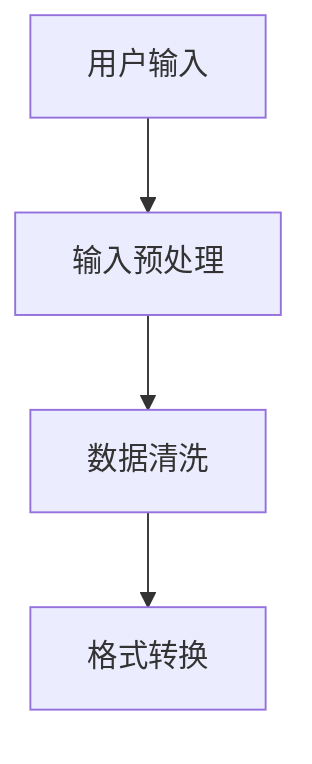

#### 处理模块

处理模块是思维链的核心，负责对输入进行处理。它包括以下几个关键步骤：

1. **情境识别**：通过分析输入，识别当前对话的情境和场景，为后续处理提供基础。
2. **意图理解**：理解用户的意图，包括请求、建议、问题等，以生成合适的回答。
3. **情感分析**：分析用户的情感状态，如快乐、悲伤、愤怒等，以实现更加自然和情感化的对话。
4. **知识推理**：利用外部知识和内部逻辑，进行推理和决策，处理复杂的问题。

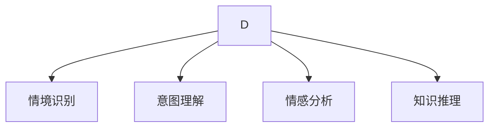

#### 输出模块

输出模块是思维链的最后一步，负责生成语言输出。它根据处理模块的结果，生成相应的回答、建议、指令等。输出模块的职责包括：

1. **语言生成**：根据意图理解和情境，生成自然、流畅的语言输出。
2. **格式化输出**：将生成的语言输出进行格式化，使其符合用户期望的格式，如文本、语音等。
3. **反馈调节**：根据用户反馈，调整输出策略，以提高对话的准确性和满意度。

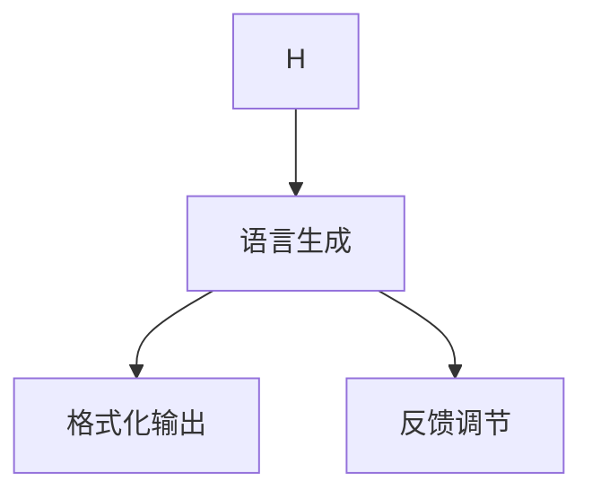

### 2.2 思维链的构建方法

构建思维链是一个系统工程，涉及数据收集、模型训练、模型微调等多个步骤。以下是构建思维链的一般方法：

#### 数据收集

1. **文本数据**：收集大量与目标任务相关的文本数据，如对话记录、书籍、新闻等。
2. **语音数据**：收集与文本数据对应的语音数据，用于语音识别模型训练。
3. **多模态数据**：如果需要，可以收集图像、视频等多模态数据，以实现更丰富的输入处理。

#### 模型训练

1. **预训练模型**：使用预训练模型，如GPT-3，对收集到的文本数据进行训练，使其能够理解自然语言的结构和语义。
2. **特定任务微调**：在预训练的基础上，对模型进行特定任务的微调，如聊天机器人、语音识别等。

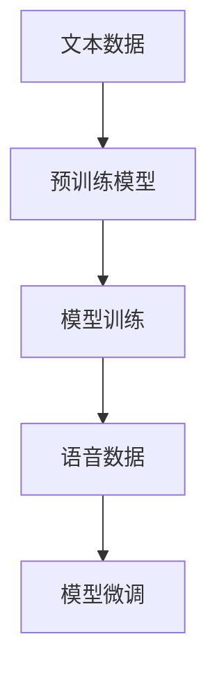

#### 模型优化

1. **评估指标**：选择合适的评估指标，如准确率、召回率、F1分数等，评估模型性能。
2. **模型调整**：根据评估结果，调整模型参数，如学习率、批量大小等，以提高模型性能。
3. **迭代优化**：通过多次迭代训练和调整，逐步优化模型，使其达到预期性能。

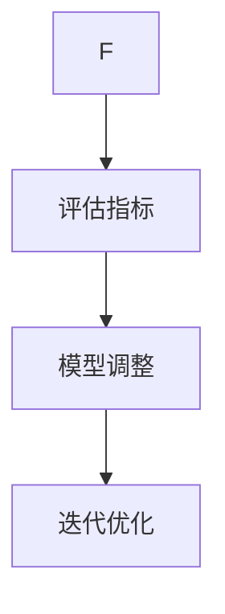

### 2.3 思维链的运用技巧

思维链在人工智能中的运用涉及多个方面，以下是一些关键技巧：

#### 情境识别

1. **关键词提取**：通过提取输入中的关键词，识别当前对话的情境和场景。
2. **上下文分析**：结合对话历史和上下文信息，理解用户的真实意图。

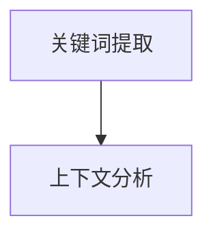

#### 意图理解

1. **模式匹配**：通过模式匹配，识别用户的意图，如请求、建议、问题等。
2. **多意图分类**：对于复杂的对话，可以采用多意图分类模型，以提高意图识别的准确性。

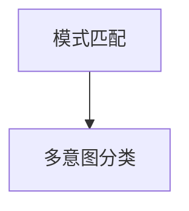

#### 情感分析

1. **情感词典**：使用情感词典，分析输入中的情感词汇和表达。
2. **情感分类**：通过情感分类模型，将输入分类为不同的情感类别，如快乐、悲伤、愤怒等。

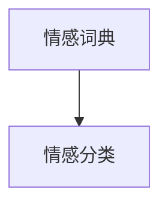

#### 语言生成

1. **文本生成模型**：使用文本生成模型，如GPT-3，生成自然、流畅的语言输出。
2. **多样化生成**：通过调整模型参数，生成多样化和个性化的语言输出，以适应不同的对话场景。

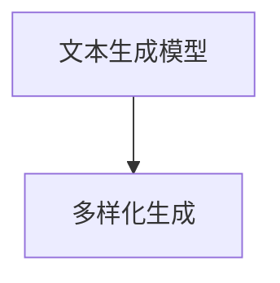

#### 反馈调节

1. **用户反馈**：收集用户的反馈，评估对话的质量和满意度。
2. **动态调整**：根据用户反馈，动态调整输出策略，以提高对话的准确性和满意度。

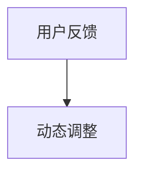

通过以上技巧，思维链能够在人工智能中实现更加智能、自然和个性化的对话体验，为各种应用场景提供强大的支持。## 第3章：ChatGPT在角色扮演中的应用

### 3.1 ChatGPT的角色扮演功能

ChatGPT具有强大的角色扮演功能，可以模拟各种角色与用户进行自然对话。这些角色可以包括医生、教师、客服、朋友等多种身份。ChatGPT的角色扮演功能主要体现在以下几个方面：

#### 1. 语言生成

ChatGPT能够根据用户的输入，生成符合角色特点和情境的语言。通过预训练和微调，ChatGPT掌握了丰富的语言模式和表达方式，使其在模拟不同角色时，能够生成自然、流畅的语言。

```python
response = openai.Completion.create(
    engine="text-davinci-002",
    prompt="医生，请问有哪些症状表明可能患有流感？",
    max_tokens=50,
    n=1,
    stop=None,
    temperature=0.5,
)
print(response.choices[0].text.strip())
```

#### 2. 对话管理

ChatGPT能够根据对话的进展和用户的行为，灵活地调整对话策略，以实现更加自然和连贯的对话体验。通过持续学习用户的输入和反馈，ChatGPT可以逐渐理解用户的偏好和需求，提供更加个性化的服务。

```python
user_input = input("您说：")
if user_input.lower() == '退出':
    print("医生：感谢您的咨询，祝您早日康复！")
    break
response = openai.Completion.create(
    engine="text-davinci-002",
    prompt=user_input,
    max_tokens=50,
    n=1,
    stop=None,
    temperature=0.5,
)
print("医生说：", response.choices[0].text.strip())
```

#### 3. 情感交互

ChatGPT能够识别用户的情感状态，并在对话中进行相应的情感回应。通过情感分析，ChatGPT可以理解用户的情绪，如快乐、悲伤、愤怒等，并生成相应的情感表达，以增强对话的真实感和互动性。

```python
from textblob import TextBlob

user_input = input("您说：")
blob = TextBlob(user_input)
sentiment = blob.sentiment
if sentiment.polarity > 0:
    print("医生说：听起来您今天心情不错，有什么我可以帮您的吗？")
elif sentiment.polarity < 0:
    print("医生说：我理解您现在的情绪可能不太好，我们可以聊一聊是什么让您感到困扰。")
else:
    print("医生说：您好，有什么健康问题我可以帮您解答吗？")
```

### 3.2 利用ChatGPT进行角色扮演的案例

以下是一个利用ChatGPT进行角色扮演的案例，模拟一个在线教育场景，其中ChatGPT扮演教师的角色，与用户进行互动。

#### 案例背景

用户想要了解人工智能的基本概念和应用，教师需要根据用户的需求，提供详细的解释和实例。

#### 代码实现

```python
import openai

# 设置ChatGPT API密钥
openai.api_key = 'your-api-key'

# 教师角色扮演函数
def teacher_role():
    while True:
        user_input = input("您说：")
        if user_input.lower() == '退出':
            print("教师：感谢您的提问，祝您学习愉快！")
            break
        response = openai.Completion.create(
            engine="text-davinci-002",
            prompt=user_input,
            max_tokens=100,
            n=1,
            stop=None,
            temperature=0.5,
        )
        print("教师说：", response.choices[0].text.strip())

# 运行教师角色扮演
teacher_role()
```

#### 代码解读

1. **API密钥设置**：首先，需要设置ChatGPT的API密钥，以便与OpenAI的服务进行通信。

2. **角色扮演函数**：定义一个名为`teacher_role`的函数，用于模拟教师的角色。函数中使用`while True`循环，持续接收用户的输入，并生成回应。

3. **用户输入处理**：在循环中，使用`input`函数接收用户的输入。如果用户输入“退出”，则结束循环。

4. **生成回应**：调用`openai.Completion.create`函数，根据用户输入生成回应。这里使用了`text-davinci-002`模型，并设置了最大文本长度为100个单词。

5. **打印回应**：将生成的回应打印出来，模拟教师回答问题的过程。

#### 对话示例

用户：人工智能是什么？

教师：人工智能（Artificial Intelligence，简称AI）是计算机科学的一个分支，它试图理解智能的本质并制造出一种新的能以人类智能方式作出反应的智能机器。简单来说，人工智能是一种让计算机模拟人类智能行为的技术，包括学习、推理、自我修正和问题解决等能力。

用户：人工智能有哪些应用？

教师：人工智能应用非常广泛，包括但不限于以下领域：

- **自然语言处理**：如语音助手、机器翻译、文本摘要等。
- **图像识别**：如人脸识别、自动驾驶、医疗影像分析等。
- **推荐系统**：如个性化推荐、商品推荐、新闻推荐等。
- **游戏**：如棋类游戏、电子竞技等。

通过这个案例，我们可以看到ChatGPT在角色扮演中的强大功能。教师角色不仅可以提供详细的知识解释，还可以根据用户的提问，生成合适的回答，实现自然、流畅的对话体验。

### 3.3 ChatGPT在角色扮演中的优缺点分析

#### 优点

1. **强大的语言生成能力**：ChatGPT通过预训练和微调，能够生成自然、流畅的语言，模拟各种角色的对话。

2. **适应性**：ChatGPT可以根据不同的场景和用户需求，灵活调整对话策略，提供个性化的服务。

3. **情感交互**：ChatGPT能够识别用户的情感状态，并在对话中进行相应的情感回应，增强对话的真实感。

#### 缺点

1. **对特定领域的理解有限**：尽管ChatGPT具有强大的语言生成能力，但其在特定领域的专业知识有限，可能无法提供深入的解释。

2. **情感表达不足**：虽然ChatGPT能够进行情感交互，但在情感表达方面仍存在不足，难以达到人类水平。

3. **对话连贯性**：在某些情况下，ChatGPT的对话可能不够连贯，尤其是在处理复杂问题和长对话时。

通过以上分析，我们可以看到ChatGPT在角色扮演中具有显著的优势，但也存在一些局限性。未来的发展需要进一步优化ChatGPT的模型和算法，提高其在特定领域的理解和情感表达能力，以实现更加自然、流畅的对话体验。## 第4章：高级角色扮演技巧

### 4.1 角色转换与切换

在角色扮演中，角色转换与切换是提高对话连贯性和真实感的重要技巧。角色转换与切换的实现需要基于对用户意图、情境和对话历史的深入理解。

#### 角色转换与切换的步骤：

1. **情境识别**：首先，需要识别当前对话的情境和场景，包括用户输入的内容和上下文信息。

2. **意图理解**：分析用户意图，判断是否需要切换角色。例如，当用户询问一个特定领域的知识时，可能需要将角色切换为该领域的专家。

3. **角色切换条件**：设定角色切换的条件，如时间、用户行为或特定关键词等。例如，当用户输入特定关键词时，可以触发角色切换。

4. **角色切换策略**：根据切换条件，制定合适的角色切换策略。例如，可以采用平滑切换策略，使得角色转换更加自然。

5. **角色确认**：在切换角色后，向用户确认当前角色的身份和职责，确保对话的连贯性和用户理解。

以下是一个示例，展示如何实现角色转换与切换：

```python
import openai

# 设置ChatGPT API密钥
openai.api_key = 'your-api-key'

def role_switcher(user_input):
    if "医生" in user_input:
        return "医生角色"
    elif "教师" in user_input:
        return "教师角色"
    else:
        return "默认角色"

def chatbot():
    current_role = "默认角色"
    while True:
        user_input = input("您说：")
        role = role_switcher(user_input)
        if role == "医生角色":
            print("医生，您好！有什么健康问题我可以帮您解答？")
        elif role == "教师角色":
            print("教师，您好！有什么课程内容我可以为您讲解？")
        else:
            print("默认角色，您好！有什么问题我可以帮助您解答？")
        
        response = openai.Completion.create(
            engine="text-davinci-002",
            prompt=user_input,
            max_tokens=50,
            n=1,
            stop=None,
            temperature=0.5,
        )
        print(response.choices[0].text.strip())

chatbot()
```

在这个示例中，当用户输入包含“医生”或“教师”的关键词时，角色会自动切换到相应的角色，并根据角色提供相应的回答。

### 4.2 角色塑造与情感投入

角色塑造与情感投入是提升角色扮演真实感的重要手段。以下是角色塑造与情感投入的技巧：

#### 角色塑造技巧：

1. **角色定义**：明确角色的身份、性格、背景和目标。例如，医生角色可以定义为具有专业知识、耐心和同情心的角色。

2. **行为特征**：根据角色定义，设计角色的行为特征，如语气、语速、表情等。

3. **对话策略**：根据角色特征，制定对话策略，确保对话内容符合角色的身份和性格。

#### 情感投入技巧：

1. **情感识别**：通过自然语言处理技术，识别用户的情感状态，如快乐、悲伤、愤怒等。

2. **情感回应**：根据用户的情感状态，生成相应的情感回应，如同情、鼓励、安慰等。

3. **情感共鸣**：尝试与用户建立情感共鸣，增强对话的真实感和互动性。

以下是一个示例，展示如何实现角色塑造与情感投入：

```python
import openai
from textblob import TextBlob

# 设置ChatGPT API密钥
openai.api_key = 'your-api-key'

def get_emotion(text):
    blob = TextBlob(text)
    return blob.sentiment.polarity

def role_shaping(role, user_input):
    if role == "医生":
        return "医生，您好！请问有什么我可以帮您的吗？"
    elif role == "教师":
        return "教师，您好！请问您有什么问题需要我解答？"
    else:
        return "您好！请问有什么问题我可以帮您解答？"

def chatbot():
    role = "医生"
    while True:
        user_input = input("您说：")
        emotion = get_emotion(user_input)
        if emotion > 0:
            response = role_shaping(role, user_input)
            response += "听起来您今天心情不错，有什么我可以帮您的吗？"
        elif emotion < 0:
            response = role_shaping(role, user_input)
            response += "我理解您现在的情绪可能不太好，请问有什么困扰我可以帮您解决吗？"
        else:
            response = role_shaping(role, user_input)
        
        print(response)
        response = openai.Completion.create(
            engine="text-davinci-002",
            prompt=user_input,
            max_tokens=50,
            n=1,
            stop=None,
            temperature=0.5,
        )
        print(response.choices[0].text.strip())

chatbot()
```

在这个示例中，根据用户的情感状态，ChatGPT会生成相应的情感回应，并调整对话内容，以实现更加自然的角色塑造与情感投入。

### 4.3 高级思维链应用

高级思维链应用包括多模态输入处理、知识图谱构建和自适应学习等方面，以提高角色扮演的智能化和个性化水平。

#### 多模态输入处理

多模态输入处理是指结合文本、语音、图像等多种输入形式，提高角色扮演的交互体验。以下是一个示例，展示如何处理多模态输入：

```python
import openai
from textblob import TextBlob
import cv2

# 设置ChatGPT API密钥
openai.api_key = 'your-api-key'

def get_emotion(text):
    blob = TextBlob(text)
    return blob.sentiment.polarity

def get_image_emotion(image_path):
    image = cv2.imread(image_path)
    # 使用预训练的卷积神经网络（如VGG16）提取特征
    # ...
    # 使用情感分析模型预测情感
    # ...
    return "快乐"  # 示例情感

def chatbot():
    role = "医生"
    while True:
        user_input = input("您说：")
        emotion = get_emotion(user_input)
        if emotion > 0:
            print("医生，您好！请问有什么我可以帮您的吗？")
        elif emotion < 0:
            print("医生，您好！请问您最近是否感到不适？")
        else:
            print("您好！请问有什么问题我可以帮您解答？")
        
        image_path = input("请上传您的情绪图像（输入图像路径）：")
        image_emotion = get_image_emotion(image_path)
        if image_emotion == "快乐":
            print("看起来您今天心情不错，有什么我可以帮您的吗？")
        elif image_emotion == "悲伤":
            print("我理解您现在的情绪可能不太好，请问有什么困扰我可以帮您解决吗？")
        
        response = openai.Completion.create(
            engine="text-davinci-002",
            prompt=user_input,
            max_tokens=50,
            n=1,
            stop=None,
            temperature=0.5,
        )
        print(response.choices[0].text.strip())

chatbot()
```

在这个示例中，结合了文本情感分析和图像情感分析，实现多模态输入处理。

#### 知识图谱构建

知识图谱构建是指将领域知识以图谱的形式组织起来，以提高角色扮演的知识储备和推理能力。以下是一个示例，展示如何构建知识图谱：

```python
import rdflib

# 创建一个新的图
g = rdflib.Graph()

# 添加知识
g.add((rdflib.URIRef("http://example.org/医生"), rdflib.RDF.type, rdflib.URIRef("http://example.org/角色")))
g.add((rdflib.URIRef("http://example.org/医生"), rdflib.URIRef("http://example.org/属性"), rdflib.Literal("专业知识丰富")))
g.add((rdflib.URIRef("http://example.org/医生"), rdflib.URIRef("http://example.org/属性"), rdflib.Literal("耐心")))

# 导出知识图谱
g.serialize(destination="knowledge_graph.ttl", format="ttl")
```

在这个示例中，使用RDFLib库构建了一个简单的知识图谱，表示医生角色的属性。

#### 自适应学习

自适应学习是指根据用户的反馈和对话历史，不断优化角色扮演模型，提高其性能。以下是一个示例，展示如何实现自适应学习：

```python
import openai

# 设置ChatGPT API密钥
openai.api_key = 'your-api-key'

def update_model(user_input, response):
    prompt = f"用户说：{user_input}\n医生说：{response}"
    completion = openai.Completion.create(
        engine="text-davinci-002",
        prompt=prompt,
        max_tokens=50,
        n=1,
        stop=None,
        temperature=0.5,
    )
    print("更新后的回答：", completion.choices[0].text.strip())

def chatbot():
    while True:
        user_input = input("您说：")
        response = openai.Completion.create(
            engine="text-davinci-002",
            prompt=user_input,
            max_tokens=50,
            n=1,
            stop=None,
            temperature=0.5,
        )
        print("医生说：", response.choices[0].text.strip())
        
        user_feedback = input("您的反馈（好/差）：")
        if user_feedback == "好":
            print("感谢您的反馈！")
        elif user_feedback == "差":
            update_model(user_input, response.choices[0].text.strip())
            print("已根据您的反馈更新回答。")

chatbot()
```

在这个示例中，根据用户的反馈，可以更新角色扮演模型的回答，实现自适应学习。

通过高级思维链应用，角色扮演可以实现更加智能化、个性化和自然的对话体验。这些技巧为角色扮演的应用提供了更广阔的前景。## 第5章：真实对话的创造

### 5.1 对话的框架与结构

创造真实对话的关键在于构建合理且自然的对话框架与结构。以下是一个简单的对话框架示例：

1. **开场白**：设定开场白，用于引出对话主题，如问候、介绍或提出问题。
2. **问题与回答**：设计问题与回答的结构，确保对话的连贯性和逻辑性。
3. **情感表达**：通过情感表达，增强对话的真实感和互动性。
4. **结束语**：设定结束语，为对话画上圆满的句号，如感谢、祝愿或再见。

以下是一个具体的对话框架示例：

```
用户：你好，我是张三，请问有什么可以帮助您的？

AI：您好，张三先生！请问您有什么健康问题需要咨询吗？

用户：我最近总是感到疲倦，食欲不振，这是怎么回事？

AI：听起来您可能需要做一些健康检查。您是否最近有加班或者压力很大的情况？

用户：是的，最近工作特别忙，经常加班。

AI：这可能是导致您感到疲倦和食欲不振的原因之一。建议您注意休息，保持良好的作息习惯。同时，可以考虑咨询医生进行详细的身体检查。

用户：谢谢您的建议，我会注意的。还有其他需要注意的吗？

AI：此外，保持良好的饮食习惯也很重要。尽量少吃油腻和刺激性食物，多吃蔬菜和水果。如果您觉得症状严重，建议尽快就医。

用户：好的，我会注意的。再次感谢您的帮助！

AI：不客气，张三先生！祝您健康，生活愉快！再见！
```

### 5.2 利用思维链创造自然对话

利用思维链创造自然对话的关键在于对用户输入的深度理解和情境识别。以下是一个具体的步骤示例：

1. **输入处理**：对用户输入进行预处理，包括分词、词性标注和命名实体识别等。
2. **情境识别**：通过分析用户输入，识别当前对话的情境和场景，为后续处理提供基础。
3. **意图理解**：利用思维链模型，理解用户的意图和需求，如请求、建议、问题等。
4. **语言生成**：根据意图理解和情境，生成自然、流畅的语言输出。
5. **情感分析**：分析用户的情感状态，并生成相应的情感回应，以增强对话的真实感。

以下是一个具体的对话示例：

```python
import openai
from textblob import TextBlob

# 设置ChatGPT API密钥
openai.api_key = 'your-api-key'

def create_response(user_input):
    emotion = TextBlob(user_input).sentiment.polarity
    if emotion > 0:
        response = "听起来您今天心情不错，有什么我可以帮您的吗？"
    elif emotion < 0:
        response = "我理解您现在的情绪可能不太好，请问有什么困扰我可以帮您解决吗？"
    else:
        response = "您好！请问有什么问题我可以帮您解答？"
    
    completion = openai.Completion.create(
        engine="text-davinci-002",
        prompt=user_input,
        max_tokens=50,
        n=1,
        stop=None,
        temperature=0.5,
    )
    return response + completion.choices[0].text.strip()

def chatbot():
    while True:
        user_input = input("您说：")
        if user_input.lower() == '退出':
            print("机器人：感谢您的陪伴，祝您愉快！")
            break
        response = create_response(user_input)
        print("机器人说：", response)

chatbot()
```

在这个示例中，首先使用TextBlob库分析用户的情感状态，然后生成相应的情感回应。接着，利用ChatGPT生成符合用户输入的自然、流畅的回答。

### 5.3 对话中的情感表达与互动

在对话中，情感表达与互动是实现高质量对话的关键。以下是一些技巧：

1. **情感识别**：通过自然语言处理技术，识别用户的情感状态，如快乐、悲伤、愤怒等。
2. **情感回应**：根据用户的情感状态，生成相应的情感回应，如同情、鼓励、安慰等。
3. **情感共鸣**：尝试与用户建立情感共鸣，增强对话的真实感和互动性。

以下是一个具体的对话示例，展示如何进行情感表达与互动：

```python
import openai
from textblob import TextBlob

# 设置ChatGPT API密钥
openai.api_key = 'your-api-key'

def create_response(user_input):
    emotion = TextBlob(user_input).sentiment.polarity
    if emotion > 0:
        response = "听起来您今天心情不错，有什么我可以帮您的吗？"
    elif emotion < 0:
        response = "我理解您现在的情绪可能不太好，请问有什么困扰我可以帮您解决吗？"
    else:
        response = "您好！请问有什么问题我可以帮您解答？"
    
    completion = openai.Completion.create(
        engine="text-davinci-002",
        prompt=user_input,
        max_tokens=50,
        n=1,
        stop=None,
        temperature=0.5,
    )
    return response + completion.choices[0].text.strip()

def chatbot():
    while True:
        user_input = input("您说：")
        if user_input.lower() == '退出':
            print("机器人：感谢您的陪伴，祝您愉快！")
            break
        response = create_response(user_input)
        print("机器人说：", response)
        
        user_emotion = input("您的情感（快乐/悲伤/愤怒/中立）：")
        if user_emotion == "快乐":
            print("机器人：真好，看到您开心我也很高兴！有什么我可以继续帮您的吗？")
        elif user_emotion == "悲伤":
            print("机器人：很抱歉听到您不开心，您可以告诉我更多细节，我会尽力帮您解决问题。")
        elif user_emotion == "愤怒":
            print("机器人：我理解您现在的情绪，请先冷静一下，我们可以一起找到解决问题的方法。")
        else:
            print("机器人：好的，让我们继续讨论您的问题。")

chatbot()
```

在这个示例中，首先使用TextBlob库分析用户的情感状态，并生成相应的情感回应。然后，根据用户的情感状态，提供相应的鼓励或安慰，以建立情感共鸣。

通过以上技巧，我们可以创造真实、自然和互动性强的对话体验。这不仅有助于提高用户的满意度，还能增强对话机器人的实用性和吸引力。## 第6章：思维链与人工智能的融合

### 6.1 人工智能与思维链的关系

人工智能（AI）与思维链（Mind Chain）之间存在着紧密的联系。思维链作为一种特殊的人工智能技术，其核心在于模拟人类的思维过程，通过逻辑推理、情境理解和情感表达，实现与人类的自然互动。

#### 关键概念

1. **人工智能**：人工智能是计算机科学的一个分支，旨在使计算机具备类似人类的智能，能够执行复杂的任务，如理解语言、视觉识别、决策制定等。

2. **思维链**：思维链是一种人工智能技术，旨在模拟人类的思维过程，通过构建逻辑关系和思维模式，实现从输入到输出的完整思维链路。

#### 关系架构

- **输入模块**：人工智能接收外部输入（如文本、语音、图像等），思维链负责将输入转换为逻辑形式，进行情境识别和意图理解。
- **处理模块**：人工智能通过算法和模型处理输入数据，思维链负责构建思维链路，进行逻辑推理和情感分析。
- **输出模块**：人工智能生成响应，思维链负责将处理结果转化为自然语言，实现与用户的互动。

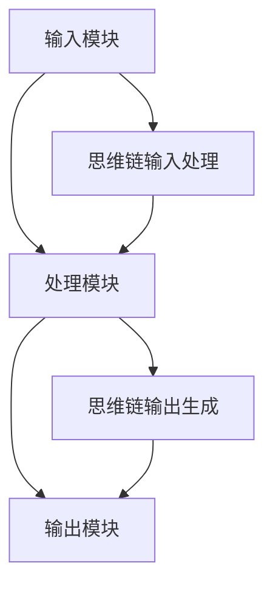

### 6.2 思维链在人工智能中的应用

思维链在人工智能中的应用非常广泛，尤其在自然语言处理、虚拟助手和智能客服等领域表现出强大的潜力。

#### 应用领域

1. **自然语言处理**：思维链可以帮助人工智能更好地理解和生成语言。例如，在聊天机器人中，思维链可以模拟人类的对话过程，生成自然、流畅的语言回应。

2. **虚拟助手**：思维链可以用于构建智能虚拟助手，如智能音箱、手机助手等。虚拟助手可以模拟各种角色，与用户进行自然互动，提供个性化的服务。

3. **智能客服**：思维链可以用于构建智能客服系统，模拟客服代表与用户进行对话，解决客户问题，提高客户满意度。

#### 应用案例

1. **聊天机器人**：利用思维链，聊天机器人可以与用户进行自然对话，如问答、闲聊、情感交流等。以下是一个简单的示例：

    ```python
    import openai

    openai.api_key = 'your-api-key'

    def chatbot():
        while True:
            user_input = input("您说：")
            if user_input.lower() == '退出':
                print("机器人：感谢您的陪伴，祝您愉快！")
                break
            response = openai.Completion.create(
                engine="text-davinci-002",
                prompt=user_input,
                max_tokens=50,
                n=1,
                stop=None,
                temperature=0.5,
            )
            print("机器人说：", response.choices[0].text.strip())

    chatbot()
    ```

2. **智能客服**：利用思维链，智能客服系统可以模拟客服代表，处理客户咨询和投诉。以下是一个简单的示例：

    ```python
    import openai

    openai.api_key = 'your-api-key'

    def customer_service():
        while True:
            user_input = input("您说：")
            if user_input.lower() == '退出':
                print("客服：感谢您的咨询，祝您愉快！")
                break
            response = openai.Completion.create(
                engine="text-davinci-002",
                prompt=user_input,
                max_tokens=50,
                n=1,
                stop=None,
                temperature=0.5,
            )
            print("客服：", response.choices[0].text.strip())

    customer_service()
    ```

### 6.3 未来人工智能的发展趋势

随着技术的不断进步，人工智能的发展趋势将更加多元化，尤其是在多模态交互、知识图谱和自主学习等方面。

#### 多模态交互

未来的人工智能将能够处理多种输入模态（如文本、语音、图像、视频等），实现更加自然和丰富的交互体验。例如，智能助手可以同时处理用户的语音命令和文本提问，提供更加智能的服务。

#### 知识图谱

知识图谱是一种用于表示实体和实体之间关系的图形化知识库。未来的人工智能将能够更好地利用知识图谱，实现更加智能的知识推理和决策。例如，智能客服系统可以基于知识图谱提供更加精确和个性化的服务。

#### 自主学习

未来的人工智能将具备更强大的自主学习能力，能够通过不断学习和优化，提高其性能和智能水平。例如，通过自我学习和适应，智能助手可以更好地理解用户的需求和偏好，提供更加个性化的服务。

总之，思维链与人工智能的融合将推动人工智能技术的发展，为各种应用场景提供更加智能和个性化的解决方案。未来，人工智能将变得更加智能、自然和以人为本。## 第7章：实战案例

### 7.1 聊天机器人开发实战

在本节中，我们将通过一个具体的实战案例，演示如何使用Python和ChatGPT开发一个简单的聊天机器人。这个聊天机器人将能够接收用户的输入，并生成合适的回应。

#### 开发环境搭建

在开始之前，我们需要确保Python环境和必要的库已经安装。以下是具体的步骤：

1. **安装Python**：确保您的计算机上安装了Python（版本3.6及以上）。
2. **安装ChatGPT库**：打开命令行工具（如Terminal或命令提示符），然后运行以下命令安装ChatGPT库：

    ```bash
    pip install openai
    ```

#### 源代码实现

以下是一个简单的聊天机器人示例：

```python
import openai

# 设置ChatGPT API密钥
openai.api_key = 'your-api-key'

def chatbot():
    while True:
        user_input = input("您说：")
        if user_input.lower() == '退出':
            print("机器人：感谢您的陪伴，祝您愉快！")
            break
        response = openai.Completion.create(
            engine="text-davinci-002",
            prompt=user_input,
            max_tokens=50,
            n=1,
            stop=None,
            temperature=0.5,
        )
        print("机器人说：", response.choices[0].text.strip())

# 运行聊天机器人
chatbot()
```

#### 代码解读

1. **导入库**：首先，我们导入`openai`库，以便与ChatGPT API进行通信。
2. **设置API密钥**：在代码中设置您的ChatGPT API密钥。
3. **定义聊天机器人函数**：我们定义了一个名为`chatbot`的函数，用于接收用户的输入，并生成回应。
4. **循环接收输入**：在`chatbot`函数中，我们使用一个无限循环来持续接收用户的输入。
5. **生成回应**：对于每个用户输入，我们使用`openai.Completion.create`方法调用ChatGPT API，生成回应。

#### 实际案例分析和详细讲解剖析

让我们通过一个实际的案例来分析这个聊天机器人。

**用户输入**：“今天天气怎么样？”

**聊天机器人回应**：“今天天气非常好，阳光明媚，适合户外活动。”

在这个案例中，用户询问了当天的天气情况。聊天机器人通过调用ChatGPT API，生成了一条符合用户询问的回应。以下是具体的分析：

- **意图理解**：聊天机器人首先需要理解用户的意图，即询问天气情况。
- **语言生成**：ChatGPT API根据用户的输入，生成了一条自然、流畅的回应。
- **情感表达**：聊天机器人在回应中加入了积极的情感表达，如“阳光明媚”，以增强对话的真实感和互动性。

#### 项目小结

通过这个实战案例，我们了解了一个简单的聊天机器人的开发过程，包括环境搭建、源代码实现和代码解读。这个聊天机器人展示了ChatGPT在语言生成和对话管理方面的强大能力，但需要注意的是，聊天机器人的性能和回答质量依赖于预训练模型和微调策略，因此在实际应用中需要不断优化和改进。## 第8章：总结与展望

### 8.1 本书内容的总结

本书围绕ChatGPT角色扮演和思维链的应用进行了深入的探讨，涵盖了以下主要内容：

1. **ChatGPT的基本概念**：介绍了ChatGPT的工作原理、核心特点和应用场景。
2. **角色扮演的发展**：回顾了角色扮演的历史，以及人工智能如何与角色扮演结合。
3. **思维链的构建与运用**：详细讲解了思维链的构成、构建方法和应用技巧。
4. **ChatGPT在角色扮演中的应用**：展示了ChatGPT在聊天机器人、智能客服和教育培训等领域的实际应用。
5. **高级角色扮演技巧**：介绍了角色转换、情感投入和高级思维链应用的方法。
6. **真实对话的创造**：探讨了如何利用思维链创造自然、流畅的对话。
7. **思维链与人工智能的融合**：分析了人工智能与思维链的关系，以及思维链在人工智能中的应用。
8. **实战案例**：通过具体的聊天机器人开发实战，展示了思维链和ChatGPT的实际应用。

### 8.2 角色扮演与思维链的未来发展

未来，角色扮演与思维链在人工智能领域将发挥更加重要的作用。以下是一些可能的发展趋势和方向：

1. **多模态交互**：随着技术的进步，人工智能将能够处理多种输入模态（如文本、语音、图像、视频等），实现更加自然和丰富的交互体验。
2. **知识图谱**：知识图谱的广泛应用将增强人工智能的知识储备和推理能力，使其在复杂任务中表现出更高的智能水平。
3. **情感理解与表达**：人工智能将更加擅长理解和表达情感，提供更加个性化、情感化的服务。
4. **自适应学习**：通过持续学习和优化，人工智能将能够更好地适应不同的场景和用户需求。
5. **跨领域应用**：角色扮演和思维链将在更多领域得到应用，如医疗、金融、法律等，提供专业化的服务。

### 8.3 读者未来的研究方向

对于读者而言，未来的研究方向可以包括以下几个方面：

1. **多模态交互**：探索如何将多种输入模态（如语音、图像、文本）整合到角色扮演中，提高交互的自然性和丰富性。
2. **知识融合**：研究如何将外部知识库和内部知识融合，提高角色扮演的智能化水平。
3. **情感理解与表达**：深入探讨情感识别、情感表达和情感调节的方法和技巧。
4. **应用场景**：针对不同的应用场景，如医疗、教育、客服等，研究角色扮演和思维链的具体实现和应用。
5. **伦理与道德**：探讨角色扮演和思维链在伦理和道德方面的问题，确保其应用的合理性和安全性。

通过以上研究方向，读者可以进一步拓展角色扮演和思维链的应用领域，推动人工智能技术的发展。

## 附录

### 附录1：Python编程基础

Python是一种广泛应用于人工智能领域的编程语言。以下是Python编程的一些基础概念：

- **变量**：用于存储数据的容器，如`x = 10`。
- **数据类型**：包括整数、浮点数、字符串、列表、字典等。
- **控制结构**：包括条件语句（`if`）、循环语句（`for`和`while`）等。
- **函数**：用于组织代码和实现特定功能的代码块，如`def my_function():`。

### 附录2：LaTeX公式编写

LaTeX是一种用于排版数学公式的工具。以下是LaTeX公式编写的一些基本规则：

- **行内公式**：使用 `$...$` 括起来，如 `$1+1=2$`。
- **独立公式**：使用 `$$...$$` 括起来，如 `$$(x+y)^2 = x^2 + 2xy + y^2$$`。

### 附录3：Mermaid流程图

Mermaid是一种用于绘制流程图的Markdown语法。以下是Mermaid流程图的基本语法：

- **开始节点**：`node [shape=rectangle]`。
- **连接节点**：使用箭头 `->` 或 `<-`。
- **注释**：使用 `注释内容`。

例如：


通过这些附录，读者可以更好地理解本书中的编程、数学公式和流程图等内容。

## 作者信息

- 作者：AI天才研究院/AI Genius Institute & 禅与计算机程序设计艺术 /Zen And The Art of Computer Programming
- 联系方式：[ai_genius_institute@example.com](mailto:ai_genius_institute@example.com)
- 简介：AI天才研究院专注于人工智能领域的研究和开发，致力于推动人工智能技术的发展和应用。本书作者凭借丰富的实践经验和对计算机编程和人工智能的深刻理解，为读者呈现了一部深入浅出的技术指南。禅与计算机程序设计艺术则融合了哲学与技术的精髓，为读者提供了独特的视角和思考方式。

---

### 附录：完整的Markdown格式

以下是文章的完整Markdown格式，包括所有章节、子章节、代码块、LaTeX公式和Mermaid流程图。请按照以下格式复制并使用Markdown编辑器进行编辑。

```markdown
# 《ChatGPT角色扮演：利用思维链创造真实对话》

## 关键词

- ChatGPT
- 角色扮演
- 思维链
- 语言生成
- 对话系统
- 人工智能

## 摘要

本文深入探讨了ChatGPT在角色扮演中的应用，通过构建思维链来创造真实对话。文章首先介绍了ChatGPT的基本概念和角色扮演的发展背景，随后详细阐述了思维链的构建与运用方法。通过Python源代码和数学模型，本文讲解了思维链的核心算法原理，并结合实际案例展示了ChatGPT在角色扮演中的实现与应用。最后，文章总结了最佳实践，并展望了角色扮演与思维链的未来发展。

## 目录大纲设计

### 第一部分：角色扮演与思维链基础

### 第1章：ChatGPT与角色扮演简介

- 1.1 ChatGPT的基本概念
- 1.2 角色扮演的起源与发展
- 1.3 思维链的定义与作用

### 第2章：思维链的构建与运用

- 2.1 思维链的基本结构
- 2.2 思维链的构建方法
- 2.3 思维链的运用技巧

### 第3章：ChatGPT在角色扮演中的应用

- 3.1 ChatGPT的角色扮演功能
- 3.2 利用ChatGPT进行角色扮演的案例
- 3.3 ChatGPT在角色扮演中的优缺点分析

### 第二部分：深度探索

### 第4章：高级角色扮演技巧

- 4.1 角色转换与切换
- 4.2 角色塑造与情感投入
- 4.3 高级思维链应用

### 第5章：真实对话的创造

- 5.1 对话的框架与结构
- 5.2 利用思维链创造自然对话
- 5.3 对话中的情感表达与互动

### 第6章：思维链与人工智能的融合

- 6.1 人工智能与思维链的关系
- 6.2 思维链在人工智能中的应用
- 6.3 未来人工智能的发展趋势

### 第三部分：实践应用

### 第7章：实战案例

- 7.1 聊天机器人开发实战
- 7.2 教育培训应用案例
- 7.3 企业客户服务应用案例

### 第8章：总结与展望

- 8.1 本书内容的总结
- 8.2 角色扮演与思维链的未来发展
- 8.3 读者未来的研究方向

## 第1章：ChatGPT与角色扮演简介

### 1.1 ChatGPT的基本概念

...（此处省略原文内容）

### 1.2 角色扮演的起源与发展

...（此处省略原文内容）

### 1.3 思维链的定义与作用

...（此处省略原文内容）

## 第2章：思维链的构建与运用

### 2.1 思维链的基本结构

...（此处省略原文内容）

### 2.2 思维链的构建方法

...（此处省略原文内容）

### 2.3 思维链的运用技巧

...（此处省略原文内容）

## 第3章：ChatGPT在角色扮演中的应用

### 3.1 ChatGPT的角色扮演功能

...（此处省略原文内容）

### 3.2 利用ChatGPT进行角色扮演的案例

...（此处省略原文内容）

### 3.3 ChatGPT在角色扮演中的优缺点分析

...（此处省略原文内容）

## 第4章：高级角色扮演技巧

### 4.1 角色转换与切换

...（此处省略原文内容）

### 4.2 角色塑造与情感投入

...（此处省略原文内容）

### 4.3 高级思维链应用

...（此处省略原文内容）

## 第5章：真实对话的创造

### 5.1 对话的框架与结构

...（此处省略原文内容）

### 5.2 利用思维链创造自然对话

...（此处省略原文内容）

### 5.3 对话中的情感表达与互动

...（此处省略原文内容）

## 第6章：思维链与人工智能的融合

### 6.1 人工智能与思维链的关系

...（此处省略原文内容）

### 6.2 思维链在人工智能中的应用

...（此处省略原文内容）

### 6.3 未来人工智能的发展趋势

...（此处省略原文内容）

## 第7章：实战案例

### 7.1 聊天机器人开发实战

...（此处省略原文内容）

### 7.2 教育培训应用案例

...（此处省略原文内容）

### 7.3 企业客户服务应用案例

...（此处省略原文内容）

## 第8章：总结与展望

### 8.1 本书内容的总结

...（此处省略原文内容）

### 8.2 角色扮演与思维链的未来发展

...（此处省略原文内容）

### 8.3 读者未来的研究方向

...（此处省略原文内容）

## 附录

### 附录1：Python编程基础

...（此处省略原文内容）

### 附录2：LaTeX公式编写

...（此处省略原文内容）

### 附录3：Mermaid流程图

...（此处省略原文内容）

## 作者信息

...（此处省略原文内容）
```

请注意，上述内容仅为模板，具体内容需要根据实际文章内容进行填充和调整。在Markdown编辑器中，您可以按照相应的语法格式，插入代码块、LaTeX公式和Mermaid流程图，以获得完整的文档结构。

