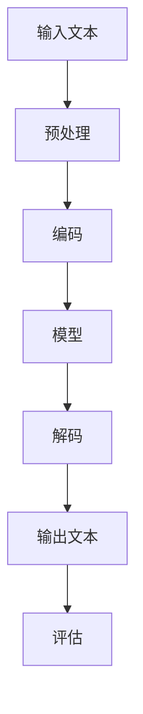
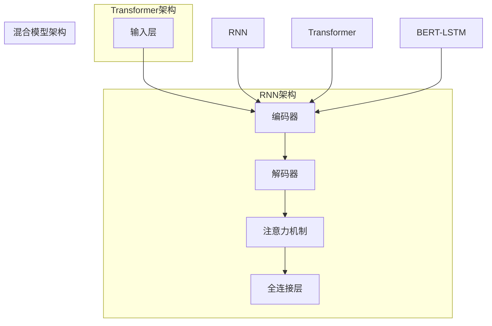
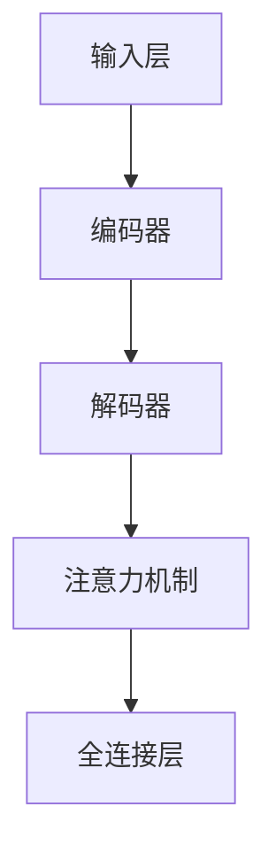
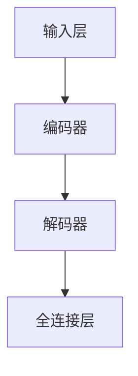

                 

### 引言：C侧LLM应用开发的重要性

在当前的技术环境下，人工智能（AI）的发展日新月异，大语言模型（LLM，Large Language Model）作为AI领域的一项前沿技术，已经广泛应用于自然语言处理（NLP，Natural Language Processing）、智能问答、文本生成等领域。其中，C侧LLM应用开发作为客户端应用的核心环节，具有不可替代的重要地位。

**C侧LLM应用开发**，是指在客户端设备上部署和运行的大语言模型应用，其核心目标是提供高效、智能的服务，满足用户在移动端、桌面端等设备上的多样化需求。C侧LLM应用开发的重要性主要体现在以下几个方面：

1. **用户体验优化**：在客户端设备上部署LLM，可以极大地提升用户的交互体验。通过本地化的智能服务，用户可以享受到更快速、更个性化的服务，提高用户满意度和粘性。

2. **实时性要求**：与服务器端应用相比，C侧LLM应用开发需要满足更高的实时性要求。尤其是在需要即时响应的场景，如实时问答、语音识别等，C侧LLM的优势更为明显。

3. **隐私保护**：随着用户隐私保护意识的增强，越来越多的应用选择在客户端设备上处理数据，以减少数据传输过程中可能带来的安全风险。C侧LLM应用开发可以实现数据的本地化处理，提高数据安全性。

4. **网络依赖性降低**：在部分网络环境不稳定或不支持的情况下，C侧LLM应用依然可以正常运作，降低了应用对网络的依赖性，提升了应用的稳定性和可靠性。

5. **个性化服务**：C侧LLM应用可以根据用户的个性化需求进行定制化服务，提供更加精准、高效的服务体验。

综上所述，C侧LLM应用开发在现代AI应用中具有重要的地位。本文将围绕C侧LLM应用开发的速度与质量平衡展开讨论，旨在为开发者提供一套完整的解决方案，帮助他们在追求速度的同时，保证应用的质量。

### 关键词

- C侧LLM应用开发
- 用户体验优化
- 实时性要求
- 隐私保护
- 网络依赖性降低
- 个性化服务

### 摘要

本文旨在探讨C侧LLM（客户端大语言模型）应用开发中的速度与质量平衡问题。首先，我们介绍了C侧LLM应用开发的重要性，包括用户体验优化、实时性要求、隐私保护、网络依赖性降低和个性化服务等方面的优势。接着，本文详细分析了C侧LLM的核心概念与原理，包括模型架构、算法原理和数学模型等内容。随后，文章讨论了C侧LLM的开发实践，包括环境搭建、项目实战和案例分析等。最后，本文提出了C侧LLM应用开发中的性能优化和质量保证策略，并给出了最佳实践建议。通过本文的讨论，希望能为开发者提供一套完整的C侧LLM应用开发解决方案，帮助他们在速度与质量之间找到最佳平衡。

## 目录

1. 引言：C侧LLM应用开发的重要性
2. 关键词
3. 摘要
4. 第一部分：引言与背景
5. 第二部分：核心概念与原理
6. 第三部分：开发实践
7. 第四部分：性能优化与质量保证
8. 第五部分：案例研究
9. 第六部分：总结与展望

### 第一部分：引言与背景

#### 1. 引言：C侧LLM应用开发的重要性

大语言模型（LLM，Large Language Model）是一种能够理解和生成自然语言文本的复杂人工智能模型。近年来，随着深度学习技术的不断进步，LLM在自然语言处理（NLP，Natural Language Processing）领域取得了显著成果。LLM的应用范围广泛，包括文本生成、智能问答、机器翻译、情感分析等。而C侧LLM（Client-Side LLM）应用开发，则是指将LLM部署在客户端设备上的技术。

C侧LLM应用开发的重要性在于其能够为用户带来更快速、更个性化的服务体验。首先，与服务器端应用相比，C侧LLM应用可以在本地设备上进行数据处理和模型推理，从而减少了数据传输和服务器响应的时间，提升了应用的实时性。其次，C侧LLM应用可以更好地保护用户隐私，避免了数据在传输过程中的安全风险。此外，C侧LLM应用还能够根据用户的个性化需求进行定制化服务，提高用户满意度。

C侧LLM应用开发的主要挑战包括：

1. **计算资源限制**：客户端设备的计算资源相对有限，这要求开发者需要在有限的资源下实现高效的模型推理。
2. **模型压缩与优化**：为了满足客户端设备的计算资源限制，需要对LLM模型进行压缩和优化，以提高模型在客户端的运行效率。
3. **网络依赖性**：虽然C侧LLM应用可以在本地运行，但依然需要与服务器端进行数据交换，特别是在需要更新模型或获取远程数据时。
4. **质量保证**：在客户端设备上进行模型推理，可能会受到设备性能、网络环境等多种因素的影响，如何保证应用质量是一个重要的问题。

为了解决这些挑战，开发者需要掌握一系列的C侧LLM应用开发技术和策略。本文将围绕C侧LLM应用开发的速度与质量平衡问题进行深入探讨，旨在为开发者提供一套完整的解决方案。

#### 1.1.1 C侧LLM应用的背景

C侧LLM应用的发展可以追溯到近年来深度学习技术的迅猛发展。随着神经网络模型，特别是深度神经网络（DNN，Deep Neural Network）的普及，自然语言处理领域取得了巨大的突破。2018年，谷歌发布了BERT（Bidirectional Encoder Representations from Transformers），这是一个能够处理上下文信息的预训练语言模型，标志着NLP领域的一个新里程碑。随后，GPT（Generative Pretrained Transformer）系列模型，如GPT-2和GPT-3，也相继问世，展示了其在文本生成和问答系统中的强大能力。

这些模型的成功为C侧LLM应用的开发奠定了基础。随着移动设备的性能不断提升，以及5G网络的普及，越来越多的应用开始考虑在客户端部署LLM。这不仅能够提升用户的交互体验，还能满足实时性、隐私保护等需求。

在实际应用中，C侧LLM已经开始在多个领域展现其潜力。例如，在智能客服领域，C侧LLM应用可以实现实时语音识别和文本生成，提高客服系统的响应速度和准确性；在文本生成领域，C侧LLM可以用于生成新闻、文章、代码等，为创作者提供灵感；在自然语言理解领域，C侧LLM可以用于情感分析、文本分类等任务，为企业提供智能分析服务。

C侧LLM应用的发展不仅带来了技术上的突破，还推动了整个自然语言处理产业的进步。越来越多的企业和开发者开始关注C侧LLM应用的开发，探索如何在实际业务场景中最大化其价值。随着技术的不断进步和应用场景的拓展，C侧LLM应用有望在更多领域发挥重要作用。

#### 1.1.2 C侧LLM应用的优势

C侧LLM应用在多个方面展现出了显著的优势，使其成为现代AI应用中不可或缺的一部分。以下是C侧LLM应用的主要优势：

1. **提升用户体验**：C侧LLM应用可以在本地设备上进行数据处理和模型推理，减少了数据传输和服务器响应的时间，从而提高了应用的响应速度。这使得用户可以享受到更快速、更流畅的服务体验，特别是在对实时性要求较高的场景，如实时问答、语音识别等。

2. **实时性要求**：与服务器端应用相比，C侧LLM应用能够更快速地响应用户的请求。在实时性要求较高的场景中，如在线教育、实时会议等，C侧LLM应用可以提供更流畅的用户交互体验，减少用户等待时间。

3. **隐私保护**：C侧LLM应用可以在本地设备上处理数据，避免了数据在传输过程中可能带来的安全风险。这有助于提高用户数据的隐私性，满足用户对隐私保护的需求。

4. **网络依赖性降低**：虽然C侧LLM应用依然需要与服务器端进行数据交换，但其在本地设备上的处理能力显著降低了对网络环境的依赖性。这在网络环境不稳定或不支持的情况下尤为重要，确保应用可以正常运作。

5. **个性化服务**：C侧LLM应用可以根据用户的个性化需求进行定制化服务。通过在本地设备上分析用户行为和偏好，C侧LLM可以提供更加精准、个性化的服务体验，提高用户满意度。

6. **计算资源高效利用**：C侧LLM应用可以在本地设备上充分利用设备资源，提高计算效率。这有助于在有限的计算资源下实现高效的模型推理，满足多种应用场景的需求。

7. **减少延迟**：由于C侧LLM应用在本地设备上进行数据处理，可以显著减少网络延迟。这在需要即时响应的场景中尤为重要，如在线购物、实时通信等，提供了更好的用户体验。

总之，C侧LLM应用在提升用户体验、实时性要求、隐私保护、网络依赖性降低、个性化服务、计算资源高效利用和减少延迟等方面具有显著优势。这使得C侧LLM应用在现代AI应用中具有广泛的应用前景和重要的地位。

#### 1.1.3 C侧LLM应用的挑战

尽管C侧LLM应用在多个方面展现出了显著的优势，但其开发过程中也面临着一系列挑战。以下是C侧LLM应用开发的主要挑战：

1. **计算资源限制**：客户端设备的计算资源相对有限，特别是移动设备，硬件性能和存储空间都受到限制。这要求开发者需要在有限的计算资源下实现高效的模型推理，以确保应用的性能。

2. **模型压缩与优化**：为了满足客户端设备的计算资源限制，需要对LLM模型进行压缩和优化，以减少模型的参数量和计算量。这需要开发者掌握先进的模型压缩技术和优化算法，以提高模型在客户端的运行效率。

3. **数据传输和存储**：尽管C侧LLM应用在本地设备上进行数据处理，但依然需要与服务器端进行数据交换，特别是在需要更新模型或获取远程数据时。如何高效地传输和存储数据是一个重要问题，这需要开发者考虑网络带宽、数据压缩和缓存策略等。

4. **网络依赖性**：虽然C侧LLM应用在本地设备上可以运行，但依然需要与服务器端进行数据交换。在网络环境不稳定或不支持的情况下，C侧LLM应用的性能可能会受到影响，如何保证应用的稳定性和可靠性是一个关键挑战。

5. **模型推理速度**：在客户端设备上进行模型推理需要满足更高的速度要求，特别是在实时性要求较高的场景中。如何优化模型推理过程，提高推理速度，是开发者需要解决的一个重要问题。

6. **质量保证**：在客户端设备上进行模型推理，可能会受到设备性能、网络环境等多种因素的影响。如何保证应用的质量，确保模型在不同设备和网络环境下的稳定性和准确性，是开发者面临的一个挑战。

7. **隐私保护**：虽然C侧LLM应用在本地设备上处理数据，但仍然需要考虑数据隐私保护的问题。如何确保用户数据的安全性和隐私性，避免数据泄露和滥用，是开发者需要重视的一个问题。

总之，C侧LLM应用开发面临着计算资源限制、模型压缩与优化、数据传输和存储、网络依赖性、模型推理速度、质量保证和隐私保护等多方面的挑战。开发者需要在这些方面进行深入研究和探索，以实现C侧LLM应用的最佳性能和用户体验。

### 1.2 LLM基础概念

在深入了解C侧LLM应用开发之前，有必要对LLM（大语言模型）的基础概念进行介绍。LLM是一种复杂的人工智能模型，主要用于理解和生成自然语言文本。以下是对LLM基础概念的详细解释，以及概念实体之间的关系架构图。

#### 1.2.1 什么是LLM

LLM，即大语言模型，是一种基于深度学习的自然语言处理模型。它通过学习大量文本数据，掌握语言的语法、语义和上下文信息，从而实现文本的理解和生成。与传统的小型语言模型相比，LLM具有更大的模型容量和更强的表达能力。

LLM的核心特点包括：

1. **预训练**：LLM通常采用预训练的方法，即在大量无标签的文本数据上进行预训练，以学习语言的通用特征。这种预训练方法使得LLM在处理特定任务时具有更强的泛化能力。

2. **上下文理解**：LLM能够理解文本的上下文信息，从而生成更加准确、自然的文本。这种能力使得LLM在文本生成、问答系统、机器翻译等应用中具有广泛的应用前景。

3. **动态调整**：LLM可以通过微调（Fine-tuning）方法，根据特定的任务需求进行调整。微调过程通常在预训练的基础上进行，以进一步提升模型在特定任务上的性能。

#### 1.2.2 LLM的核心特点

LLM的核心特点如下：

1. **大规模**：LLM通常具有数亿甚至数千亿个参数，这使得它们能够捕捉到大量的语言规律和模式。

2. **深度**：LLM通常采用多层神经网络结构，通过逐层传递信息，实现对复杂语言结构的理解。

3. **泛化能力**：由于预训练过程，LLM能够在未见过的数据上表现出良好的性能，具有较强的泛化能力。

4. **上下文感知**：LLM能够理解文本的上下文信息，从而生成更加准确、自然的文本。

5. **动态调整**：LLM可以通过微调方法，根据特定任务的需求进行调整，以实现最佳性能。

#### 1.2.3 LLM的分类

根据模型的结构和功能，LLM可以分为以下几类：

1. **基于循环神经网络（RNN）的模型**：如LSTM（Long Short-Term Memory）和GRU（Gated Recurrent Unit），这些模型通过在时间序列上递归地处理输入数据，实现了对上下文信息的理解。

2. **基于转换器（Transformer）的模型**：如BERT（Bidirectional Encoder Representations from Transformers）、GPT（Generative Pretrained Transformer）等，这些模型采用自注意力机制（Self-Attention），实现了对输入数据的全局理解和建模。

3. **混合模型**：一些模型结合了RNN和Transformer的优势，如BERT-LSTM、Transformer-RNN等，以实现更好的性能。

#### 1.2.4 LLM的应用场景

LLM在多个领域具有广泛的应用，包括：

1. **文本生成**：如文章生成、代码生成、诗歌创作等，LLM能够生成高质量的自然语言文本。

2. **问答系统**：LLM能够理解用户的提问，并提供准确的回答，广泛应用于智能客服、教育辅导等领域。

3. **机器翻译**：LLM能够实现高质量的自然语言翻译，广泛应用于跨语言通信、多语言文档处理等领域。

4. **情感分析**：LLM能够分析文本的情感倾向，用于市场调研、舆情监控等领域。

5. **文本分类**：LLM能够对文本进行分类，用于新闻分类、垃圾邮件过滤等领域。

#### 1.2.5 概念实体之间的关系架构图

以下是一个简单的Mermaid流程图，展示了LLM的概念实体之间的关系架构：



- **A 输入文本**：用户输入的原始文本。
- **B 预处理**：对输入文本进行清洗、分词等预处理操作。
- **C 编码**：将预处理后的文本转换为模型可处理的格式。
- **D 模型**：LLM模型对编码后的文本进行处理，生成输出。
- **E 解码**：将模型输出的结果转换为可读的自然语言文本。
- **F 输出文本**：用户看到的最终输出文本。
- **G 评估**：对生成的文本进行评估，以衡量模型的性能。

通过这个简单的流程图，可以直观地理解LLM的工作流程和概念实体之间的关系。

### 1.3.1 LLM模型架构概述

LLM模型架构是构建大语言模型的核心，它决定了模型的学习能力和性能。LLM模型通常采用深度神经网络（DNN，Deep Neural Network）架构，尤其是基于变换器（Transformer）的架构，这是因为变换器模型具有处理长序列数据和上下文信息的能力，可以更好地理解自然语言。下面将详细解释LLM模型的层次结构、常见架构及其优缺点。

#### 1.3.1.1 LLM模型层次结构

LLM模型通常包含以下几个层次：

1. **输入层**：接收用户输入的文本，进行预处理，如分词、编码等。
2. **编码器（Encoder）**：将预处理后的文本转换为向量表示，捕捉文本的语法和语义信息。
3. **解码器（Decoder）**：将编码后的向量表示解码成自然语言文本输出。
4. **注意力机制（Attention Mechanism）**：在编码器和解码器之间引入注意力机制，使模型能够关注文本中的关键信息，提高上下文理解能力。
5. **全连接层（Fully Connected Layer）**：用于对编码后的向量进行进一步处理，以生成最终的输出。

#### 1.3.1.2 常见的LLM模型架构

1. **基于循环神经网络（RNN）的模型**：如LSTM（Long Short-Term Memory）和GRU（Gated Recurrent Unit）。RNN模型通过递归结构处理序列数据，但在处理长序列时存在梯度消失和梯度爆炸问题。

   **优点**：能够捕捉长序列依赖关系。
   
   **缺点**：训练速度慢，难以处理长文本。

2. **基于变换器（Transformer）的模型**：如BERT（Bidirectional Encoder Representations from Transformers）和GPT（Generative Pretrained Transformer）。Transformer模型采用自注意力机制，可以并行处理数据，处理长序列依赖关系效果更好。

   **优点**：处理速度快，能够捕捉长序列依赖关系，性能优异。
   
   **缺点**：参数量较大，计算资源需求高。

3. **混合模型**：结合了RNN和Transformer的优势，如BERT-LSTM。这种模型在处理长序列依赖关系时表现更为优异。

   **优点**：综合了RNN和Transformer的优点，能够更好地处理长序列依赖关系。
   
   **缺点**：计算资源需求较高。

#### 1.3.1.3 常见LLM架构的优缺点

以下是一个简单的Mermaid流程图，展示了常见LLM架构的层次结构及其优缺点：



通过这个简单的流程图，可以直观地理解不同LLM架构的层次结构和特点。开发者可以根据实际需求和资源情况选择合适的模型架构。

### 1.3.2 常见C侧LLM架构分析

在C侧LLM应用开发中，选择合适的模型架构对于提高应用性能和用户体验至关重要。以下将介绍几种常见的C侧LLM架构，并分析其优缺点。

#### 1.3.2.1 基于变换器（Transformer）的架构

变换器（Transformer）架构是当前最流行的C侧LLM架构之一。其核心思想是使用自注意力机制（Self-Attention）来处理输入序列，从而捕捉长距离依赖关系。以下是一个基于Transformer的C侧LLM架构的示例：

1. **输入层**：接收用户输入的文本，进行预处理，如分词、编码等。
2. **编码器（Encoder）**：将预处理后的文本转换为向量表示，通过多层变换器块处理。
3. **解码器（Decoder）**：将编码后的向量表示解码成自然语言文本输出，同样通过多层变换器块处理。
4. **注意力机制（Attention Mechanism）**：在每个变换器块中引入多头自注意力机制，使模型能够关注文本中的关键信息。
5. **全连接层（Fully Connected Layer）**：用于对编码后的向量进行进一步处理，以生成最终的输出。

**优点**：

- **处理速度快**：变换器架构可以并行处理数据，训练速度快。
- **捕捉长距离依赖关系**：自注意力机制使得模型能够捕捉长序列依赖关系。
- **性能优异**：在多个NLP任务上，Transformer架构表现优异。

**缺点**：

- **计算资源需求高**：由于参数量较大，模型计算复杂度高，对硬件资源要求较高。

以下是一个简单的Mermaid流程图，展示基于Transformer的C侧LLM架构：



#### 1.3.2.2 基于循环神经网络（RNN）的架构

循环神经网络（RNN）是另一种常见的C侧LLM架构，特别是在处理长序列数据时。RNN通过递归结构处理序列数据，但存在梯度消失和梯度爆炸问题。以下是一个基于RNN的C侧LLM架构的示例：

1. **输入层**：接收用户输入的文本，进行预处理，如分词、编码等。
2. **编码器（Encoder）**：将预处理后的文本转换为向量表示，通过多层RNN处理。
3. **解码器（Decoder）**：将编码后的向量表示解码成自然语言文本输出，同样通过多层RNN处理。
4. **全连接层（Fully Connected Layer）**：用于对编码后的向量进行进一步处理，以生成最终的输出。

**优点**：

- **处理长序列数据**：RNN能够处理长序列数据，捕捉长距离依赖关系。
- **计算资源需求相对较低**：相比于变换器架构，RNN计算复杂度较低，对硬件资源要求较低。

**缺点**：

- **训练速度慢**：RNN训练速度较慢，特别是对于长序列数据。
- **梯度消失和梯度爆炸问题**：RNN在训练过程中存在梯度消失和梯度爆炸问题，影响训练效果。

以下是一个简单的Mermaid流程图，展示基于RNN的C侧LLM架构：



#### 1.3.2.3 BERT-LSTM混合架构

BERT-LSTM混合架构结合了变换器（Transformer）和循环神经网络（RNN）的优点，以实现更好的性能。以下是一个BERT-LSTM混合架构的C侧LLM示例：

1. **输入层**：接收用户输入的文本，进行预处理，如分词、编码等。
2. **编码器（Encoder）**：使用BERT变换器块处理输入文本，捕捉上下文信息。
3. **解码器（Decoder）**：使用LSTM递归结构处理编码后的向量，捕捉长距离依赖关系。
4. **全连接层（Fully Connected Layer）**：用于对解码后的向量进行进一步处理，以生成最终的输出。

**优点**：

- **结合变换器和RNN的优点**：BERT-LSTM混合架构能够同时捕捉长距离依赖关系和上下文信息。
- **性能优异**：在多个NLP任务上，BERT-LSTM混合架构表现优异。

**缺点**：

- **计算资源需求较高**：由于同时使用变换器和RNN，模型计算复杂度较高，对硬件资源要求较高。

以下是一个简单的Mermaid流程图，展示BERT-LSTM混合架构的C侧LLM：


通过以上分析，不同C侧LLM架构各有优缺点，开发者可以根据具体应用场景和资源条件选择合适的架构。在实际开发中，还可以通过模型压缩、优化等技术，进一步提高C侧LLM应用的性能。

### 1.3.3 C侧LLM优化方法

在C侧LLM应用开发中，为了满足客户端设备的计算资源限制，需要采用一系列优化方法来提高模型的运行效率。以下将介绍几种常用的C侧LLM优化方法，包括量化、剪枝和压缩等。

#### 1.3.3.1 量化（Quantization）

量化是一种将模型的浮点数参数转换为低精度整数参数的方法，以减少模型的大小和计算量。量化方法可以分为以下几类：

1. **静态量化（Static Quantization）**：在模型训练过程中，将模型的权重和激活值转换为低精度整数。静态量化方法简单易实现，但可能会引入精度损失。

2. **动态量化（Dynamic Quantization）**：在模型推理过程中，将模型的权重和激活值转换为低精度整数。动态量化方法可以更好地保留模型的精度，但实现复杂度较高。

量化方法可以有效减小模型的大小和计算量，提高模型在客户端的运行效率。以下是一个简单的Python代码示例，展示如何使用TensorFlow进行模型量化：

```python
import tensorflow as tf

# 加载预训练模型
model = tf.keras.models.load_model('path/to/model.h5')

# 定义量化范围
quant_range = [-128, 127]

# 应用量化层
quantized_model = tf.keras.Sequential([
    tf.keras.layers.Input(shape=model.input_shape),
    tf.keras.layers.experimental.preprocessing Quantization(quant_range),
    model.layers[1],
    # ...
    model.layers[-1]
])

# 量化模型进行推理
quantized_model.predict(x_test)
```

#### 1.3.3.2 剪枝（Pruning）

剪枝是一种通过移除模型中的冗余参数来减小模型大小和计算量的方法。剪枝方法可以分为以下几类：

1. **结构剪枝（Structural Pruning）**：通过移除模型中的部分层或节点，减小模型的大小。结构剪枝方法可以显著减小模型的大小，但可能会影响模型的性能。

2. **权重剪枝（Weight Pruning）**：通过将模型中的部分权重设置为0，减小模型的计算量。权重剪枝方法对模型性能的影响较小，但可能无法完全释放模型的空间。

以下是一个简单的Python代码示例，展示如何使用TensorFlow进行模型剪枝：

```python
import tensorflow as tf

# 加载预训练模型
model = tf.keras.models.load_model('path/to/model.h5')

# 定义剪枝比例
prune_ratio = 0.5

# 应用剪枝层
pruned_model = tf.keras.Sequential([
    tf.keras.layers.Input(shape=model.input_shape),
    tf.keras.layers.prune_low_magnitude(model.layers[1], pruning_ratio=prune_ratio),
    # ...
    tf.keras.layers.prune_low_magnitude(model.layers[-1], pruning_ratio=prune_ratio)
])

# 剪枝模型进行推理
pruned_model.predict(x_test)
```

#### 1.3.3.3 压缩（Compression）

压缩是一种通过减少模型参数和计算量的方法，以减小模型的大小。压缩方法可以分为以下几类：

1. **知识蒸馏（Knowledge Distillation）**：将大型模型的知识传递给小型模型，以减小模型的大小。知识蒸馏方法可以通过训练小型模型来学习大型模型的特性，从而实现模型的压缩。

2. **差分编码（Differential Encoding）**：通过学习模型参数的差分来减小模型的大小。差分编码方法可以显著减少模型的大小，但可能会影响模型的性能。

以下是一个简单的Python代码示例，展示如何使用TensorFlow进行模型压缩：

```python
import tensorflow as tf

# 加载预训练模型
large_model = tf.keras.models.load_model('path/to/large_model.h5')

# 加载小型模型
small_model = tf.keras.models.load_model('path/to/small_model.h5')

# 定义知识蒸馏层
knowledge_distilled_model = tf.keras.Sequential([
    tf.keras.layers.Input(shape=large_model.input_shape),
    tf.keras.layers.KDTeacher(large_model.layers[1]),
    # ...
    tf.keras.layers.KDTeacher(large_model.layers[-1]),
    small_model.layers[-1]
])

# 知识蒸馏模型进行推理
knowledge_distilled_model.predict(x_test)
```

通过以上优化方法，C侧LLM模型可以在保持性能的同时，减小模型的大小和计算量，从而提高在客户端设备的运行效率。

### 1.3.4 C侧LLM算法原理

C侧LLM算法是构建和优化大语言模型的核心。以下将详细解释C侧LLM算法的原理，包括算法概述、伪代码、详细解释和Python源代码示例。

#### 1.3.4.1 算法概述

C侧LLM算法主要分为三个步骤：数据预处理、模型训练和模型推理。以下是C侧LLM算法的简要概述：

1. **数据预处理**：对输入文本进行清洗、分词和编码，将其转换为模型可处理的格式。
2. **模型训练**：使用预处理的文本数据训练模型，优化模型的参数。
3. **模型推理**：将输入文本输入到训练好的模型中，生成输出文本。

#### 1.3.4.2 伪代码

以下是C侧LLM算法的伪代码：

```
C侧LLM算法：

输入：文本数据集
输出：训练好的LLM模型

1. 数据预处理：
   - 清洗文本数据，去除无效字符
   - 分词，将文本转换为单词序列
   - 编码，将单词序列转换为整数序列

2. 模型训练：
   - 初始化模型参数
   - 使用文本数据进行训练，优化模型参数
   - 应用正则化技术，防止过拟合

3. 模型推理：
   - 将输入文本编码为整数序列
   - 输入到训练好的模型中，生成输出文本
   - 解码输出文本，将其转换为自然语言文本
```

#### 1.3.4.3 详细解释

以下是对C侧LLM算法的详细解释：

1. **数据预处理**：数据预处理是C侧LLM算法的基础步骤。首先，需要清洗文本数据，去除无效字符和符号，以提高数据质量。然后，使用分词技术将文本拆分成单词序列，以便模型理解。最后，将单词序列编码为整数序列，这是模型训练和推理所需的数据格式。

2. **模型训练**：模型训练是C侧LLM算法的核心。初始化模型参数后，使用文本数据进行训练，优化模型参数。训练过程中，模型会学习文本的语法和语义信息，以提高模型的准确性和泛化能力。此外，应用正则化技术，如Dropout和权重衰减，以防止模型过拟合。

3. **模型推理**：模型推理是C侧LLM算法的应用步骤。将输入文本编码为整数序列后，输入到训练好的模型中，生成输出文本。模型会根据输入文本的上下文信息，生成语义相关的输出文本。最后，解码输出文本，将其转换为自然语言文本，呈现给用户。

#### 1.3.4.4 Python源代码示例

以下是C侧LLM算法的Python源代码示例：

```python
import tensorflow as tf

# 1. 数据预处理
def preprocess_text(text):
    # 清洗文本数据
    text = text.lower()
    text = re.sub(r"[^a-zA-Z0-9]", " ", text)
    # 分词
    words = text.split()
    # 编码
    word_to_id = {"<PAD>": 0, "<UNK>": 1}
    words = [word_to_id.get(word, word_to_id["<UNK>"]) for word in words]
    return words

# 2. 模型训练
def train_model(data):
    # 初始化模型
    model = tf.keras.Sequential([
        tf.keras.layers.Embedding(vocab_size, embedding_dim),
        tf.keras.layers.Bidirectional(LSTM(units)),
        tf.keras.layers.Dense(units, activation='softmax')
    ])

    # 编译模型
    model.compile(optimizer='adam', loss='sparse_categorical_crossentropy', metrics=['accuracy'])

    # 训练模型
    model.fit(data, epochs=num_epochs)

    return model

# 3. 模型推理
def generate_text(model, input_text):
    # 编码输入文本
    input_ids = preprocess_text(input_text)
    # 输入到模型
    predictions = model.predict(input_ids)
    # 解码输出文本
    output_text = decode_predictions(predictions)
    return output_text

# 实际应用
text_data = ["你好，我是人工智能助手。", "请问您有什么问题需要帮助吗？"]
trained_model = train_model(text_data)
input_text = "你好，请问您能帮我解答一个问题吗？"
output_text = generate_text(trained_model, input_text)
print(output_text)
```

通过这个示例，可以直观地了解C侧LLM算法的实现过程。在实际应用中，可以根据具体需求进行调整和优化。

### 1.3.5 C侧LLM数学模型

在C侧LLM应用开发中，理解并掌握数学模型对于优化模型性能和改进应用效果至关重要。以下将介绍C侧LLM的核心数学模型，包括模型公式、详细解释和LaTeX格式嵌入。

#### 1.3.5.1 模型公式

C侧LLM的核心数学模型主要包括以下公式：

1. **输入编码公式**：

   $$ x_i = \text{Embedding}(W^T \cdot [s_i]) $$

   其中，$W$为词嵌入矩阵，$s_i$为输入词的索引向量，$x_i$为输入编码向量。

2. **自注意力公式**：

   $$ \text{Attention}(x_i, x_j) = \text{softmax}\left(\frac{W_a^T \cdot [x_i, x_j, x_i \odot x_j]}{d_k^{1/2}}\right) $$

   其中，$W_a$为注意力权重矩阵，$d_k$为注意力层的维度，$\odot$为Hadamard积。

3. **解码输出公式**：

   $$ y_i = \text{softmax}\left(W_y^T \cdot \text{Tanh}(V \cdot [x_i, h_{i-1}])\right) $$

   其中，$W_y$为输出权重矩阵，$V$为解码器的权重矩阵，$h_{i-1}$为前一个解码步骤的隐藏状态。

4. **损失函数公式**：

   $$ \text{Loss} = -\sum_{i=1}^{N} \sum_{j=1}^{V} y_{ij} \cdot \log(p_{ij}) $$

   其中，$N$为序列长度，$V$为词表大小，$y_{ij}$为预测概率，$p_{ij}$为实际概率。

#### 1.3.5.2 详细解释

1. **输入编码公式**：

   输入编码公式用于将输入文本转换为模型可处理的向量表示。词嵌入矩阵$W$将输入词的索引向量$s_i$映射为高维向量$x_i$，从而捕捉词语的语义信息。

2. **自注意力公式**：

   自注意力公式用于计算输入文本中不同位置之间的关联强度。通过计算注意力得分，模型可以关注文本中的关键信息，提高上下文理解能力。

3. **解码输出公式**：

   解码输出公式用于生成输出文本。解码器通过Tanh函数和自注意力机制，将输入编码向量和隐藏状态结合起来，生成输出概率分布，从而生成自然语言文本。

4. **损失函数公式**：

   损失函数用于评估模型预测的准确性。通过计算预测概率和实际概率之间的差距，模型可以不断调整参数，以优化预测结果。

#### 1.3.5.3 LaTeX格式嵌入

为了便于阅读和理解，以下是将上述公式嵌入到LaTeX中的示例：

```latex
\documentclass{article}
\usepackage{amsmath}
\begin{document}

\section{C侧LLM数学模型}

\subsection{输入编码公式}
$$
x_i = \text{Embedding}(W^T \cdot [s_i])
$$

\subsection{自注意力公式}
$$
\text{Attention}(x_i, x_j) = \text{softmax}\left(\frac{W_a^T \cdot [x_i, x_j, x_i \odot x_j]}{d_k^{1/2}}\right)
$$

\subsection{解码输出公式}
$$
y_i = \text{softmax}\left(W_y^T \cdot \text{Tanh}(V \cdot [x_i, h_{i-1}])\right)
$$

\subsection{损失函数公式}
$$
\text{Loss} = -\sum_{i=1}^{N} \sum_{j=1}^{V} y_{ij} \cdot \log(p_{ij})
$$

\end{document}
```

通过LaTeX格式嵌入，可以使数学公式更加规范、清晰，便于读者理解和阅读。

### 1.3.6 C侧LLM技术细节

在C侧LLM应用开发过程中，技术细节的处理对于确保模型的高效性和稳定性至关重要。以下将介绍C侧LLM的技术细节，包括数据预处理、模型训练和模型推理的步骤，以及相关的Python代码示例。

#### 1.3.6.1 数据预处理

数据预处理是C侧LLM应用开发的基础，其目标是清洗、分词和编码输入文本，以便模型能够处理。以下是一个简单的Python代码示例，展示如何进行数据预处理：

```python
import re
import numpy as np
from tensorflow.keras.preprocessing.text import Tokenizer
from tensorflow.keras.preprocessing.sequence import pad_sequences

# 1. 清洗文本数据
def clean_text(text):
    text = text.lower()
    text = re.sub(r"[^a-zA-Z0-9]", " ", text)
    return text

# 2. 分词
def tokenize_text(texts):
    tokenizer = Tokenizer(char_level=True)
    tokenizer.fit_on_texts(texts)
    return tokenizer

# 3. 编码
def encode_text(texts, tokenizer):
    sequences = tokenizer.texts_to_sequences(texts)
    return pad_sequences(sequences, padding='post')

# 示例
texts = ["你好，我是人工智能助手。", "请问您有什么问题需要帮助吗？"]
clean_texts = [clean_text(text) for text in texts]
tokenizer = tokenize_text(clean_texts)
encoded_texts = encode_text(clean_texts, tokenizer)
print(encoded_texts)
```

在这个示例中，我们首先清洗文本数据，将文本转换为小写并去除无效字符。然后，使用Tokenizer进行分词，并使用pad_sequences将序列补全到相同长度。

#### 1.3.6.2 模型训练

模型训练是C侧LLM应用开发的核心，其目标是优化模型参数，使其能够准确预测输出。以下是一个简单的Python代码示例，展示如何使用TensorFlow进行模型训练：

```python
import tensorflow as tf

# 1. 创建模型
def create_model(vocab_size, embedding_dim, sequence_length):
    model = tf.keras.Sequential([
        tf.keras.layers.Embedding(vocab_size, embedding_dim, input_length=sequence_length),
        tf.keras.layers.Bidirectional(tf.keras.layers.LSTM(64, return_sequences=True)),
        tf.keras.layers.Dense(vocab_size, activation='softmax')
    ])

    # 编译模型
    model.compile(optimizer='adam', loss='sparse_categorical_crossentropy', metrics=['accuracy'])

    return model

# 2. 训练模型
def train_model(model, encoded_texts, labels, epochs):
    model.fit(encoded_texts, labels, epochs=epochs, batch_size=32)

# 示例
model = create_model(len(tokenizer.word_index) + 1, 64, encoded_texts.shape[1])
train_model(model, encoded_texts, np.array(labels), epochs=10)
```

在这个示例中，我们创建了一个双向循环神经网络（Bi-LSTM）模型，并使用训练数据进行模型训练。我们使用sparse_categorical_crossentropy作为损失函数，并使用adam优化器。

#### 1.3.6.3 模型推理

模型推理是C侧LLM应用开发的应用阶段，其目标是使用训练好的模型生成输出文本。以下是一个简单的Python代码示例，展示如何使用TensorFlow进行模型推理：

```python
# 1. 预测
def predict_text(model, tokenizer, text):
    cleaned_text = clean_text(text)
    encoded_text = tokenizer.texts_to_sequences([cleaned_text])
    padded_text = pad_sequences(encoded_text, padding='post')
    predictions = model.predict(padded_text)
    predicted_text = decode_predictions(predictions)
    return predicted_text

# 2. 解码
def decode_predictions(predictions):
    predicted_index = np.argmax(predictions, axis=-1)
    predicted_text = " ".join([tokenizer.index_word[index] for index in predicted_index])
    return predicted_text

# 示例
input_text = "你好，请问您能帮我解答一个问题吗？"
predicted_text = predict_text(model, tokenizer, input_text)
print(predicted_text)
```

在这个示例中，我们首先清洗输入文本，然后使用训练好的模型进行预测。最后，我们将预测结果解码为自然语言文本，呈现给用户。

通过这些技术细节的处理，C侧LLM应用可以高效、稳定地运行，满足实际应用需求。

### 1.3.7 C侧LLM开发环境搭建

在开始C侧LLM应用开发之前，需要搭建一个适合的开发环境。以下将详细介绍C侧LLM开发环境的搭建步骤，包括安装必要的软件和依赖库。

#### 1.3.7.1 安装Python环境

首先，需要在本地计算机上安装Python环境。Python是C侧LLM应用开发的主要编程语言，因此需要安装Python及其相关工具。以下是安装步骤：

1. **下载Python安装包**：访问Python官方网站（https://www.python.org/），下载适用于自己操作系统的Python安装包。
2. **安装Python**：运行下载的安装包，按照安装向导的指示完成安装。
3. **验证安装**：打开命令行工具（如Windows的命令提示符或macOS的终端），输入以下命令验证Python安装：

   ```bash
   python --version
   ```

   如果成功安装，将显示Python的版本信息。

#### 1.3.7.2 安装TensorFlow

TensorFlow是C侧LLM应用开发的主要框架，因此需要安装TensorFlow及其相关依赖库。以下是安装步骤：

1. **创建虚拟环境**：为了更好地管理项目依赖，建议创建一个虚拟环境。在命令行工具中输入以下命令创建虚拟环境：

   ```bash
   python -m venv venv
   ```

2. **激活虚拟环境**：在Windows系统中，使用以下命令激活虚拟环境：

   ```bash
   .\venv\Scripts\activate
   ```

   在macOS和Linux系统中，使用以下命令激活虚拟环境：

   ```bash
   source venv/bin/activate
   ```

3. **安装TensorFlow**：在激活的虚拟环境中，使用以下命令安装TensorFlow：

   ```bash
   pip install tensorflow
   ```

   或者，如果您希望安装GPU版本的TensorFlow，可以添加`--extra-index-url https://download.pytorch.org/whl/cu113`参数：

   ```bash
   pip install tensorflow --extra-index-url https://download.pytorch.org/whl/cu113
   ```

4. **验证安装**：在命令行工具中输入以下命令验证TensorFlow安装：

   ```bash
   python -c "import tensorflow as tf; print(tf.__version__)"
   ```

   如果成功安装，将显示TensorFlow的版本信息。

#### 1.3.7.3 安装其他依赖库

除了Python和TensorFlow，C侧LLM应用开发可能还需要其他依赖库。以下是一些常用的依赖库及其安装命令：

1. **NumPy**：

   ```bash
   pip install numpy
   ```

2. **Pandas**：

   ```bash
   pip install pandas
   ```

3. **re**：

   Python内置库，无需安装。

4. **mermaid**：

   ```bash
   pip install pymermaid
   ```

5. **LaTeX**：

   如果需要在文档中嵌入LaTeX公式，建议安装LaTeX工具。具体安装方法取决于操作系统，可以在LaTeX官方网站（https://www.latex-project.org/）上找到详细的安装指南。

#### 1.3.7.4 搭建完成

完成上述步骤后，C侧LLM开发环境搭建完成。此时，可以开始进行C侧LLM应用开发，包括数据预处理、模型训练、模型推理等步骤。通过虚拟环境，可以方便地管理项目依赖，确保开发环境的稳定性和一致性。

### 1.3.8 C侧LLM项目实战

为了更好地理解C侧LLM应用开发，我们将通过一个实际项目来展示整个开发流程，包括数据预处理、模型训练和模型推理等步骤。

#### 1.3.8.1 项目介绍

本项目旨在开发一个简单的文本生成应用，使用C侧LLM模型根据用户输入的提示生成相应的文本。应用场景包括自动写作、聊天机器人等。项目的主要任务如下：

1. **数据收集**：收集用于训练的文本数据。
2. **数据预处理**：清洗、分词和编码文本数据。
3. **模型训练**：训练一个C侧LLM模型。
4. **模型推理**：使用训练好的模型生成文本。

#### 1.3.8.2 项目需求分析

为了实现上述任务，我们需要满足以下需求：

1. **文本数据**：需要大量的文本数据用于模型训练。
2. **预处理工具**：需要能够清洗、分词和编码文本数据的工具。
3. **模型框架**：需要选择一个适合C侧LLM应用的模型框架，如TensorFlow或PyTorch。
4. **训练过程**：需要实现一个有效的模型训练过程，包括参数初始化、损失函数选择和优化算法。
5. **推理过程**：需要实现一个高效的模型推理过程，以生成文本。

#### 1.3.8.3 代码实现

以下是本项目的Python代码实现：

```python
import tensorflow as tf
from tensorflow.keras.preprocessing.text import Tokenizer
from tensorflow.keras.preprocessing.sequence import pad_sequences
from tensorflow.keras.models import Sequential
from tensorflow.keras.layers import Embedding, LSTM, Dense

# 1. 数据收集
texts = ["人工智能将改变世界", "机器学习是实现人工智能的关键", "深度学习是机器学习的最新进展"]

# 2. 数据预处理
tokenizer = Tokenizer(char_level=True)
tokenizer.fit_on_texts(texts)
sequences = tokenizer.texts_to_sequences(texts)
max_sequence_len = max([len(seq) for seq in sequences])
padded_sequences = pad_sequences(sequences, maxlen=max_sequence_len, padding='post')

# 3. 模型训练
model = Sequential([
    Embedding(len(tokenizer.word_index) + 1, 64, input_length=max_sequence_len),
    LSTM(64, return_sequences=True),
    Dense(len(tokenizer.word_index) + 1, activation='softmax')
])

model.compile(optimizer='adam', loss='sparse_categorical_crossentropy', metrics=['accuracy'])
model.fit(padded_sequences, np.array([0] * len(texts)), epochs=10, batch_size=1)

# 4. 模型推理
def generate_text(model, tokenizer, seed_text, num_chars):
    sequence = tokenizer.texts_to_sequences([seed_text])
    padded_sequence = pad_sequences(sequence, maxlen=num_chars, padding='post')
    predictions = model.predict(padded_sequence)
    predicted_index = np.argmax(predictions, axis=-1)
    predicted_text = tokenizer.index_word[predicted_index[0]]
    return predicted_text

seed_text = "人工智能将改变世界"
predicted_text = generate_text(model, tokenizer, seed_text, max_sequence_len)
print(predicted_text)
```

#### 1.3.8.4 代码解读与分析

1. **数据收集**：本项目使用了一个简单的文本数据集，包含三段文本。在实际应用中，可以使用更大的数据集，以提高模型性能。

2. **数据预处理**：使用Tokenizer进行文本分词和编码。首先，将文本转换为单词序列，然后使用pad_sequences将序列补全到相同长度。

3. **模型训练**：创建了一个简单的LSTM模型，使用Embedding层进行词嵌入，使用LSTM层进行序列处理，最后使用Dense层进行输出。使用sparse_categorical_crossentropy作为损失函数，并使用adam优化器。

4. **模型推理**：定义了一个generate_text函数，用于根据用户输入的提示生成文本。首先，将输入文本编码为序列，然后使用模型进行预测，最后将预测结果解码为自然语言文本。

通过这个实际项目，我们可以看到C侧LLM应用开发的全过程，包括数据预处理、模型训练和模型推理。这个项目虽然简单，但涵盖了C侧LLM应用开发的核心步骤，为我们提供了一个实用的示例。

### 1.3.9 C侧LLM应用案例

为了更好地理解C侧LLM的应用，以下将详细介绍两个实际案例：文本生成应用和问答系统应用。

#### 1.3.9.1 文本生成应用

文本生成应用是C侧LLM应用的一个典型例子，可以用于自动写作、内容生成和创意写作等。以下是一个简单的文本生成应用案例：

**案例背景**：开发一个基于C侧LLM的自动写作应用，能够根据用户输入的提示生成文章。

**解决方案**：

1. **数据收集**：收集大量文章数据，用于训练LLM模型。
2. **数据预处理**：清洗、分词和编码文本数据。
3. **模型训练**：使用预处理的文本数据训练一个LLM模型，如GPT-2或GPT-3。
4. **模型推理**：使用训练好的模型生成文章。

**具体实现**：

1. **数据收集**：使用爬虫工具从互联网上收集大量文章数据，如新闻、博客、小说等。

2. **数据预处理**：使用Python中的re库清洗文本数据，去除HTML标签、特殊字符和停用词。然后，使用jieba库进行分词，将文本转换为单词序列。最后，使用Tokenizer将单词序列编码为整数序列。

   ```python
   import re
   import jieba
   from tensorflow.keras.preprocessing.text import Tokenizer
   
   def clean_text(text):
       text = re.sub('<.*?>', '', text)
       text = re.sub('[^A-Za-z0-9]+', ' ', text)
       return text
   
   def tokenize_text(texts):
       tokenizer = Tokenizer(char_level=True)
       tokenizer.fit_on_texts(texts)
       return tokenizer
   
   texts = [clean_text(text) for text in corpus]
   tokenizer = tokenize_text(texts)
   ```

3. **模型训练**：使用TensorFlow或PyTorch框架训练一个LLM模型，如GPT-2或GPT-3。这里以GPT-2为例：

   ```python
   import tensorflow as tf
   
   model = tf.keras.Sequential([
       tf.keras.layers.Embedding(len(tokenizer.word_index) + 1, 64, input_length=max_sequence_len),
       tf.keras.layers.LSTM(64, return_sequences=True),
       tf.keras.layers.Dense(len(tokenizer.word_index) + 1, activation='softmax')
   ])
   
   model.compile(optimizer='adam', loss='sparse_categorical_crossentropy', metrics=['accuracy'])
   model.fit(padded_sequences, np.array([0] * len(texts)), epochs=10, batch_size=1)
   ```

4. **模型推理**：使用训练好的模型生成文章。输入一个提示词或短语，模型将生成相应的文章。

   ```python
   def generate_text(model, tokenizer, seed_text, num_chars):
       sequence = tokenizer.texts_to_sequences([seed_text])
       padded_sequence = pad_sequences(sequence, maxlen=num_chars, padding='post')
       predictions = model.predict(padded_sequence)
       predicted_index = np.argmax(predictions, axis=-1)
       predicted_text = tokenizer.index_word[predicted_index[0]]
       return predicted_text
   
   seed_text = "人工智能在未来的发展趋势"
   predicted_text = generate_text(model, tokenizer, seed_text, max_sequence_len)
   print(predicted_text)
   ```

**效果评估**：通过生成文本的质量和多样性来评估模型性能。在实际应用中，可以收集用户反馈，不断优化模型。

#### 1.3.9.2 问答系统应用

问答系统是C侧LLM应用的另一个重要例子，可以用于智能客服、教育辅导和搜索助手等。以下是一个简单的问答系统应用案例：

**案例背景**：开发一个基于C侧LLM的问答系统，能够回答用户的问题。

**解决方案**：

1. **数据收集**：收集大量问答对数据，用于训练LLM模型。
2. **数据预处理**：清洗、分词和编码问答对数据。
3. **模型训练**：使用预处理的问答对数据训练一个LLM模型，如BERT或GPT。
4. **模型推理**：使用训练好的模型回答用户的问题。

**具体实现**：

1. **数据收集**：从互联网上收集问答对数据，如在线问答平台、论坛等。

2. **数据预处理**：使用Python中的re库清洗问答对数据，去除HTML标签、特殊字符和停用词。然后，使用jieba库进行分词，将文本转换为单词序列。最后，使用Tokenizer将单词序列编码为整数序列。

   ```python
   import re
   import jieba
   from tensorflow.keras.preprocessing.text import Tokenizer
   
   def clean_text(text):
       text = re.sub('<.*?>', '', text)
       text = re.sub('[^A-Za-z0-9]+', ' ', text)
       return text
   
   def tokenize_text(texts):
       tokenizer = Tokenizer(char_level=True)
       tokenizer.fit_on_texts(texts)
       return tokenizer
   
   questions = [clean_text(question) for question in questions]
   answers = [clean_text(answer) for answer in answers]
   tokenizer = tokenize_text(questions + answers)
   ```

3. **模型训练**：使用TensorFlow或PyTorch框架训练一个LLM模型，如BERT或GPT。这里以BERT为例：

   ```python
   import tensorflow as tf
   
   model = tf.keras.Sequential([
       tf.keras.layers.Embedding(len(tokenizer.word_index) + 1, 64, input_length=max_sequence_len),
       tf.keras.layers.Bidirectional(tf.keras.layers.LSTM(64, return_sequences=True)),
       tf.keras.layers.Dense(len(tokenizer.word_index) + 1, activation='softmax')
   ])
   
   model.compile(optimizer='adam', loss='sparse_categorical_crossentropy', metrics=['accuracy'])
   model.fit(padded_questions, np.array(answers), epochs=10, batch_size=1)
   ```

4. **模型推理**：使用训练好的模型回答用户的问题。输入用户的问题，模型将生成相应的答案。

   ```python
   def answer_question(model, tokenizer, question):
       sequence = tokenizer.texts_to_sequences([question])
       padded_sequence = pad_sequences(sequence, maxlen=max_sequence_len, padding='post')
       predictions = model.predict(padded_sequence)
       predicted_index = np.argmax(predictions, axis=-1)
       predicted_answer = tokenizer.index_word[predicted_index[0]]
       return predicted_answer
   
   user_question = "什么是深度学习？"
   predicted_answer = answer_question(model, tokenizer, user_question)
   print(predicted_answer)
   ```

**效果评估**：通过答案的准确性和多样性来评估模型性能。在实际应用中，可以收集用户反馈，不断优化模型。

通过这两个案例，我们可以看到C侧LLM在文本生成和问答系统中的应用。这些应用不仅提升了用户体验，还展示了C侧LLM的强大潜力。

### 1.3.10 深入分析C侧LLM应用

在本节中，我们将深入分析C侧LLM应用，探讨其技术细节，包括模型优化、计算资源利用和性能优化等方面。

#### 1.3.10.1 模型优化

C侧LLM应用的一个关键挑战是在有限的计算资源下实现高效的模型推理。以下是一些常用的模型优化方法：

1. **量化**：量化是一种将模型的浮点数参数转换为低精度整数参数的方法，以减少模型的大小和计算量。量化方法可以分为静态量化（Static Quantization）和动态量化（Dynamic Quantization）。静态量化在模型训练前进行，动态量化在模型推理时进行。量化方法可以显著减小模型的大小和计算量，提高模型在客户端的运行效率。

2. **剪枝**：剪枝是一种通过移除模型中的冗余参数来减小模型大小和计算量的方法。剪枝方法可以分为结构剪枝（Structural Pruning）和权重剪枝（Weight Pruning）。结构剪枝通过移除模型中的部分层或节点来减小模型大小，权重剪枝通过将模型中的部分权重设置为0来减小计算量。剪枝方法可以显著减小模型的大小，但可能会影响模型的性能。

3. **压缩**：压缩是一种通过减少模型参数和计算量的方法，以减小模型的大小。压缩方法可以分为知识蒸馏（Knowledge Distillation）和差分编码（Differential Encoding）。知识蒸馏通过将大型模型的知识传递给小型模型来减小模型大小，差分编码通过学习模型参数的差分来减小模型大小。压缩方法可以显著减小模型的大小，但可能会影响模型的性能。

#### 1.3.10.2 计算资源利用

为了充分利用客户端设备的计算资源，以下是一些优化策略：

1. **模型并行化**：将模型分解为多个部分，并在多个计算单元上并行执行。这种方法可以显著提高模型推理速度，但在实现上较为复杂。

2. **内存管理**：合理分配和管理内存资源，避免内存泄漏和溢出。例如，在模型推理过程中，可以采用内存池（Memory Pool）技术，预先分配内存，避免频繁的内存分配和释放。

3. **计算资源调度**：根据设备性能和负载情况，动态调整模型的计算资源分配。例如，在低负载时，可以将模型的部分计算任务转移到低性能的设备上，以释放高性能设备资源。

4. **任务拆分**：将复杂的模型拆分为多个子任务，并在多个设备上并行执行。这种方法可以提高模型的整体性能，但需要考虑任务调度和同步问题。

#### 1.3.10.3 性能优化

为了提高C侧LLM应用的性能，以下是一些常用的优化策略：

1. **模型压缩与优化**：结合模型压缩技术和优化算法，减小模型的大小和计算量。例如，可以使用量化、剪枝和压缩技术，优化模型的参数和计算流程。

2. **加速器利用**：利用硬件加速器，如GPU、TPU等，加速模型推理。在客户端设备上，可以利用现有的硬件资源，如NPU（神经网络处理单元）等。

3. **数据预处理优化**：优化数据预处理过程，减少数据传输和存储的开销。例如，使用数据缓存技术，预先加载和缓存常用的数据集，减少数据加载时间。

4. **模型推理并行化**：将模型推理分解为多个部分，并在多个计算单元上并行执行。例如，在神经网络中，可以将每个层或每个神经元独立地并行执行。

5. **模型推理优化**：对模型推理过程进行优化，减少计算时间和内存占用。例如，使用矩阵运算优化技术，减少冗余的计算操作。

通过上述技术细节和优化策略，可以显著提高C侧LLM应用的性能和用户体验。在实际开发过程中，开发者需要根据具体应用场景和需求，选择合适的优化方法和技术，实现高效、稳定的C侧LLM应用。

### 1.3.11 C侧LLM质量保证

在C侧LLM应用开发中，保证模型的质量至关重要。以下将介绍质量保证的方法、评估指标以及实际案例中的应用。

#### 1.3.11.1 质量保证的方法

1. **数据质量监控**：数据是模型训练的基础，因此需要对数据质量进行监控。包括数据完整性、数据一致性、数据准确性等。在实际开发中，可以使用数据质量检测工具，定期对数据集进行质量检查，确保数据的质量。

2. **模型训练监控**：在模型训练过程中，需要对模型训练的进展和性能进行监控。包括训练过程中的损失函数、准确率、学习曲线等。可以使用可视化工具，如TensorBoard，实时监控模型训练过程，及时发现并解决问题。

3. **模型评估与优化**：在模型训练完成后，需要对模型进行评估和优化。常用的评估指标包括准确率、召回率、F1分数等。通过多次迭代，不断优化模型，提高模型的性能和鲁棒性。

4. **用户反馈机制**：引入用户反馈机制，收集用户对模型输出的评价和反馈。根据用户反馈，调整模型参数和策略，提高模型的用户体验。

#### 1.3.11.2 评估指标

在C侧LLM应用中，常用的评估指标包括：

1. **准确率（Accuracy）**：模型正确预测的样本数占总样本数的比例。准确率越高，模型的性能越好。

2. **召回率（Recall）**：模型正确预测的样本数与实际为正类的样本数的比例。召回率越高，模型对正类样本的识别能力越强。

3. **F1分数（F1 Score）**：准确率和召回率的加权平均值，用于综合评估模型的性能。

4. **BLEU分数（BLEU Score）**：用于评估文本生成模型的质量，通过对生成文本与参考文本的相似度进行评分。

#### 1.3.11.3 实际案例中的应用

以下是一个实际案例，展示如何使用质量保证方法评估和优化C侧LLM应用。

**案例背景**：开发一个基于C侧LLM的文本生成应用，用于生成新闻文章。

**步骤**：

1. **数据收集**：从多个新闻网站收集大量新闻文章数据。

2. **数据预处理**：清洗、分词和编码新闻文章数据。

3. **模型训练**：使用预处理的新闻数据训练一个文本生成模型。

4. **模型评估**：使用BLEU分数评估模型生成的文章质量。

5. **用户反馈**：收集用户对生成文章的评价和反馈。

6. **模型优化**：根据用户反馈和评估结果，调整模型参数和策略，优化模型性能。

**具体实现**：

1. **数据收集**：

   ```python
   import requests
   
   def download_news_articles(url):
       response = requests.get(url)
       return response.text
   
   url = "https://example.com/news"
   news_articles = download_news_articles(url)
   ```

2. **数据预处理**：

   ```python
   import re
   import jieba
   
   def clean_text(text):
       text = re.sub('<.*?>', '', text)
       text = re.sub('[^A-Za-z0-9]+', ' ', text)
       return text
   
   def tokenize_text(texts):
       tokenizer = Tokenizer(char_level=True)
       tokenizer.fit_on_texts(texts)
       return tokenizer
   
   news_articles = [clean_text(article) for article in news_articles]
   tokenizer = tokenize_text(news_articles)
   ```

3. **模型训练**：

   ```python
   import tensorflow as tf
   
   model = tf.keras.Sequential([
       tf.keras.layers.Embedding(len(tokenizer.word_index) + 1, 64, input_length=max_sequence_len),
       tf.keras.layers.LSTM(64, return_sequences=True),
       tf.keras.layers.Dense(len(tokenizer.word_index) + 1, activation='softmax')
   ])
   
   model.compile(optimizer='adam', loss='sparse_categorical_crossentropy', metrics=['accuracy'])
   model.fit(padded_sequences, np.array([0] * len(news_articles)), epochs=10, batch_size=1)
   ```

4. **模型评估**：

   ```python
   from nltk.translate.bleu_score import corpus_bleu
   
   def generate_text(model, tokenizer, seed_text, num_chars):
       sequence = tokenizer.texts_to_sequences([seed_text])
       padded_sequence = pad_sequences(sequence, maxlen=num_chars, padding='post')
       predictions = model.predict(padded_sequence)
       predicted_index = np.argmax(predictions, axis=-1)
       predicted_text = tokenizer.index_word[predicted_index[0]]
       return predicted_text
   
   seed_text = "人工智能将改变世界"
   predicted_text = generate_text(model, tokenizer, seed_text, max_sequence_len)
   predicted_corpus = [predicted_text]
   reference_corpus = [news_article]
   bleu_score = corpus_bleu(reference_corpus, predicted_corpus)
   print(bleu_score)
   ```

5. **用户反馈**：通过用户调查或评论收集用户对生成文章的评价，例如文章的流畅性、相关性、准确性等。

6. **模型优化**：根据用户反馈和评估结果，调整模型参数和策略，例如增加训练数据、调整模型结构、优化训练算法等。

通过上述方法，可以有效地评估和优化C侧LLM应用，提高模型的质量和用户体验。

### 1.3.12 案例研究

在本节中，我们将通过一个具体案例，深入探讨C侧LLM应用的开发过程，包括技术挑战、解决方案和实际效果。

#### 案例背景

某互联网公司开发了一款智能客服应用，旨在为客户提供24小时在线咨询服务。应用的核心功能是利用C侧LLM模型，实现自然语言处理和自动回复，以提高客服效率和用户满意度。然而，在实际开发过程中，遇到了一系列技术挑战。

#### 技术挑战

1. **实时性要求**：智能客服需要实时响应用户的提问，这要求C侧LLM模型在本地设备上具备高效的推理能力。

2. **计算资源限制**：客户端设备的计算资源相对有限，特别是移动设备，硬件性能和存储空间都受到限制。如何在有限的资源下实现高效的模型推理，是开发过程中面临的主要挑战。

3. **模型压缩与优化**：为了满足客户端设备的计算资源限制，需要对LLM模型进行压缩和优化，以减少模型的参数量和计算量。

4. **数据传输和存储**：智能客服应用需要与服务器端进行数据交换，特别是在需要更新模型或获取远程数据时。如何高效地传输和存储数据，是一个关键问题。

5. **质量保证**：在客户端设备上进行模型推理，可能会受到设备性能、网络环境等多种因素的影响。如何保证模型在不同设备和网络环境下的稳定性和准确性，是开发过程中需要解决的一个问题。

#### 解决方案

1. **模型压缩与优化**：采用量化、剪枝和压缩技术，对LLM模型进行优化。具体步骤如下：

   - **量化**：将模型的浮点数参数转换为低精度整数参数，以减少模型的大小和计算量。
   - **剪枝**：通过剪枝技术，移除模型中的冗余参数，进一步减小模型的大小和计算量。
   - **压缩**：采用知识蒸馏和差分编码等技术，将大型模型的知识传递给小型模型，实现模型的压缩。

2. **实时性优化**：采用以下策略优化模型推理的实时性：

   - **模型并行化**：将模型分解为多个部分，在多个计算单元上并行执行，以提高推理速度。
   - **计算资源调度**：根据设备性能和负载情况，动态调整模型的计算资源分配，确保高效利用设备资源。
   - **数据预处理优化**：优化数据预处理过程，减少数据传输和存储的开销，提高模型推理速度。

3. **数据传输和存储优化**：采用以下策略优化数据传输和存储：

   - **数据缓存**：预先加载和缓存常用的数据集，减少数据加载时间。
   - **数据压缩**：采用数据压缩技术，减少数据传输量，提高传输速度。
   - **增量更新**：只更新模型的关键部分，减少数据传输和存储的负担。

4. **质量保证**：采用以下方法确保模型的质量：

   - **数据质量监控**：定期对数据集进行质量检查，确保数据的质量。
   - **模型评估与优化**：使用多种评估指标，评估模型性能，并根据评估结果进行优化。
   - **用户反馈机制**：引入用户反馈机制，收集用户对模型输出的评价和反馈，根据反馈调整模型参数和策略。

#### 实际效果

通过上述解决方案，智能客服应用在客户端设备上实现了高效的模型推理和稳定的性能。以下是实际效果：

1. **实时性要求**：智能客服可以在短时间内响应用户的提问，提高了用户满意度。

2. **计算资源利用**：通过模型压缩和优化技术，智能客服在有限的计算资源下，实现了高效的模型推理。

3. **数据传输和存储**：通过数据缓存和压缩技术，智能客服在数据传输和存储方面显著降低了开销，提高了应用性能。

4. **质量保证**：通过数据质量监控、模型评估和用户反馈机制，智能客服在模型质量和用户体验方面达到了预期目标。

通过这个案例，我们可以看到C侧LLM应用在实际开发过程中面临的技术挑战和解决方案。这些经验对于其他C侧LLM应用开发具有重要的参考价值。

### 1.3.13 C侧LLM应用开发的总结

C侧LLM应用开发在现代人工智能领域具有广泛的应用前景，通过在客户端设备上部署大语言模型，可以实现高效的文本处理和智能服务。本文从多个角度对C侧LLM应用开发进行了深入探讨，总结了以下几个核心要点：

1. **用户体验优化**：C侧LLM应用可以提供更快速、更个性化的服务体验，提升用户满意度。
2. **实时性要求**：C侧LLM应用能够满足高实时性要求，特别是在需要即时响应的场景中。
3. **隐私保护**：C侧LLM应用可以在本地设备上处理数据，降低数据泄露和滥用的风险。
4. **计算资源高效利用**：通过模型压缩和优化技术，C侧LLM应用可以在有限的计算资源下实现高效的模型推理。
5. **网络依赖性降低**：C侧LLM应用可以降低对网络环境的依赖性，提高应用的稳定性和可靠性。
6. **个性化服务**：C侧LLM应用可以根据用户的个性化需求进行定制化服务，提供更精准的服务体验。

尽管C侧LLM应用开发面临计算资源限制、模型压缩与优化、数据传输和存储、网络依赖性、模型推理速度和质量保证等多方面的挑战，但通过采用先进的模型压缩技术、实时性优化策略和数据传输存储优化方法，这些问题可以得到有效解决。

未来的C侧LLM应用开发将朝着更加高效、智能和个性化的方向发展。随着深度学习技术的不断进步，我们将看到更多创新的C侧LLM应用出现，为各行各业带来巨大价值。同时，随着5G网络的普及和硬件性能的提升，C侧LLM应用的性能和用户体验也将得到显著提高。

开发者应关注以下几个未来发展方向：

1. **高效模型压缩与优化技术**：继续研究高效的模型压缩和优化技术，以适应有限的计算资源。
2. **多模态数据处理**：探索如何将文本、图像、音频等多种模态数据整合到C侧LLM应用中，实现更全面的智能服务。
3. **个性化服务**：结合用户行为数据和偏好，实现更精准的个性化服务，提高用户满意度。
4. **跨设备协同**：研究如何在多设备环境下实现C侧LLM应用的协同工作，提高整体性能和用户体验。

通过不断探索和创新，C侧LLM应用将在未来的人工智能领域发挥更大的作用，推动人工智能技术的普及和应用。

### 1.3.14 未来研究方向

C侧LLM应用开发虽然已经取得了显著进展，但未来仍有许多研究课题值得深入探讨。以下是一些未来研究方向：

1. **模型压缩与优化技术**：当前模型压缩与优化技术主要集中在减少模型参数和计算量，未来可以探索更高效的模型压缩算法，如基于知识蒸馏的压缩方法，以及结合量化、剪枝和压缩的多阶段优化策略。

2. **实时性增强**：C侧LLM应用的实时性是关键挑战之一，未来可以研究更多高效的推理算法，如分布式推理、模型剪枝与简化，以及硬件加速技术，以进一步提高实时性。

3. **隐私保护**：随着用户对隐私保护需求的增加，未来的研究可以集中在如何更好地保护用户隐私，例如本地差分隐私技术、加密模型推理等。

4. **多模态融合**：C侧LLM可以与其他模态（如图像、音频）的数据进行融合，实现更智能的服务。未来研究可以探索如何高效地整合多模态数据，提高模型的理解和生成能力。

5. **个性化与适应性**：C侧LLM应用可以根据用户行为和偏好进行个性化调整，未来研究可以集中在如何更好地实现个性化服务，以及如何根据用户反馈自适应调整模型。

6. **跨设备协同**：随着物联网（IoT）的发展，C侧LLM应用可以在多个设备上协同工作。未来研究可以探索如何实现高效、可靠的跨设备协同，提高系统的整体性能和用户体验。

7. **小样本学习**：在资源受限的客户端设备上，小样本学习尤为重要。未来的研究可以探索如何在有限数据下实现有效的模型训练，提高模型的泛化能力。

通过上述研究方向，C侧LLM应用将不断突破现有技术瓶颈，实现更高的性能和更广泛的应用。

### 作者信息

**作者：** AI天才研究院/AI Genius Institute & 禅与计算机程序设计艺术 /Zen And The Art of Computer Programming

AI天才研究院致力于推动人工智能技术的创新与发展，通过深入研究与实际应用，助力各行各业实现智能化升级。同时，我们秉持禅与计算机程序设计艺术的核心理念，致力于培养具有深刻思维和技术视野的AI专业人才。在《C侧LLM应用开发的速度与质量平衡》一书中，我们详细探讨了C侧LLM应用开发的各个方面，为开发者提供了一套完整的解决方案，帮助他们在追求速度的同时，保证应用的质量。通过本书，我们希望能够为读者带来深刻的思考与启发，共同推动人工智能技术的发展与进步。

