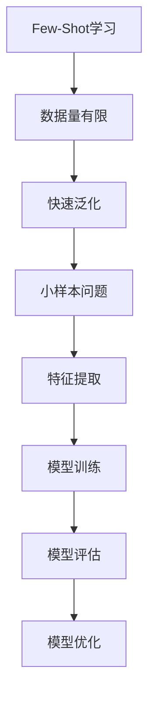

                 

# <Few-Shot学习：优化ChatGPT的小样本能力>

## 关键词
Few-Shot学习，ChatGPT，小样本能力，优化方法，应用案例，AI天才研究院，禅与计算机程序设计艺术

## 摘要
本文将探讨Few-Shot学习在优化ChatGPT小样本能力方面的应用。首先介绍Few-Shot学习的概念与原理，随后深入分析ChatGPT的工作机制。接着，本文将重点阐述几种优化ChatGPT小样本能力的方法，包括数据增强、自监督学习、对抗性学习和伪标签与迁移学习。通过实际应用案例，我们将展示这些方法在问答系统、文本生成和多模态学习中的效果。最后，本文将对Future Works进行展望，并提出研究挑战与解决方案。

## 引言与背景

### 1.1 Few-Shot学习的定义与重要性

Few-Shot学习是指在一个新的任务中，仅通过非常有限的数据（通常是单个数据点或少数几个数据点）进行训练，从而学习到有效的模型。这种学习方法在很多现实场景中具有重要的应用价值，例如在新产品发布后的用户反馈分析、罕见病诊断、小样本数据集的机器学习任务等。通过Few-Shot学习，我们可以降低对大量训练数据的依赖，提高模型的泛化能力和可扩展性。

### 1.2 ChatGPT的崛起

ChatGPT是OpenAI于2022年11月推出的一款基于GPT-3.5架构的预训练语言模型。它具有强大的自然语言处理能力，可以生成连贯、自然的文本，并在各种任务中表现出色，如文本生成、问答系统、翻译等。ChatGPT的成功引起了广泛关注，其强大的表现也引发了对于如何进一步优化其小样本能力的探讨。

### 1.3 小样本学习的研究现状

目前，小样本学习已经成为机器学习领域的一个热点研究方向。研究者们已经提出了一系列方法，如元学习（Meta-Learning）、度量学习（Metric Learning）、模型集成（Model Ensembling）等。然而，如何在有限的样本条件下训练出一个高性能的模型，仍然是一个具有挑战性的问题。ChatGPT作为一种强大的预训练语言模型，如何在小样本条件下发挥其优势，仍然是一个值得深入研究的课题。

### 1.4 本书的目的与结构

本书旨在探讨如何通过Few-Shot学习优化ChatGPT的小样本能力。本书将首先介绍Few-Shot学习的概念与原理，然后深入分析ChatGPT的工作机制，并详细阐述几种优化方法。通过实际应用案例，我们将展示这些方法在问答系统、文本生成和多模态学习中的效果。最后，本书将对Future Works进行展望，并提出研究挑战与解决方案。

## Few-Shot学习的概念与原理

### 2.1 核心概念与联系（Mermaid流程图）

### 2.2 Few-Shot学习的基本原理

Few-Shot学习的核心思想是通过利用已有知识来应对新的任务，即使在数据量有限的情况下，也能快速地学习到有效的模型。具体来说，Few-Shot学习可以分为以下几个步骤：

1. **特征提取**：通过特征提取器从输入数据中提取出有用的特征信息。
2. **模型训练**：使用提取到的特征信息训练模型，以便在新任务中能够快速适应。
3. **模型评估**：在新的任务中，对训练好的模型进行评估，以确定其性能是否满足要求。
4. **模型优化**：根据评估结果，对模型进行调整和优化，以提高其性能。

### 2.3 Few-Shot学习的挑战与机遇

#### 2.3.1 挑战

1. **数据稀缺**：由于Few-Shot学习依赖于有限的数据，因此在数据稀缺的情况下，如何有效地利用这些数据成为一大挑战。
2. **泛化能力**：如何在有限的数据条件下，训练出一个具有良好泛化能力的模型，是一个重要问题。
3. **模型复杂性**：在数据量有限的情况下，如何平衡模型的复杂性和训练效果，也是一个挑战。

#### 2.3.2 机遇

1. **知识迁移**：通过Few-Shot学习，可以有效地将已有知识迁移到新的任务中，提高模型的可扩展性和适应性。
2. **降低成本**：由于Few-Shot学习依赖于小样本数据，因此可以降低数据获取和处理成本。
3. **效率提升**：在数据量有限的情况下，Few-Shot学习可以快速地训练出有效的模型，提高任务执行的效率。

## ChatGPT的工作原理

### 3.1 ChatGPT的架构

ChatGPT是基于GPT-3.5架构的预训练语言模型，其核心组件包括：

1. **Transformer模型**：ChatGPT采用Transformer模型作为基础，这是一种基于自注意力机制的深度神经网络架构，具有强大的表示和学习能力。
2. **预训练**：ChatGPT通过在大量文本数据上进行预训练，学习到语言的统计规律和语义信息。
3. **Fine-tuning**：在特定任务中，ChatGPT可以通过Fine-tuning来微调其参数，以适应新的任务需求。

### 3.2 语言模型的工作原理

语言模型的工作原理可以概括为以下几个步骤：

1. **输入编码**：将输入的文本转换为数字序列，以便模型进行处理。
2. **嵌入**：通过嵌入层将数字序列映射为高维向量，以便进行进一步的处理。
3. **自注意力**：通过自注意力机制，模型可以学习到输入序列中不同位置之间的依赖关系。
4. **输出解码**：通过输出层，模型将自注意力机制学习到的信息转换为文本输出。

### 3.3 多模态学习

多模态学习是指同时处理多种类型的数据，如文本、图像、音频等。ChatGPT通过多模态学习，可以实现对多种数据类型的处理和分析。

1. **文本与图像融合**：通过文本嵌入和图像嵌入，将文本和图像信息融合到同一模型中。
2. **多模态自注意力**：在自注意力机制中，同时考虑文本和图像信息，以学习到更丰富的表示。
3. **多模态生成**：通过多模态生成，模型可以生成包含文本和图像的连贯内容。

## 优化ChatGPT的小样本能力的方法

### 4.1 数据增强

数据增强是一种通过增加数据多样性来提高模型性能的方法。在ChatGPT的小样本学习中，数据增强可以采用以下几种策略：

1. **文本转换**：通过变换文本的语法结构、词汇等，生成新的文本数据。
2. **图像转换**：通过变换图像的亮度、对比度、色彩等，生成新的图像数据。
3. **多模态转换**：同时变换文本和图像数据，生成新的多模态数据。

### 4.2 自监督学习

自监督学习是一种无需人工标注数据，而是通过自动从数据中学习出标注信息的方法。在ChatGPT的小样本学习中，自监督学习可以采用以下几种策略：

1. **文本生成**：通过生成文本数据，学习到文本的语义和语法结构。
2. **图像分割**：通过分割图像中的不同部分，学习到图像的语义信息。
3. **多模态关联**：通过关联文本和图像数据，学习到多模态数据之间的关系。

### 4.3 对抗性学习

对抗性学习是一种通过对抗性样本来增强模型鲁棒性的方法。在ChatGPT的小样本学习中，对抗性学习可以采用以下几种策略：

1. **文本对抗**：通过生成对抗性文本，提高模型对文本攻击的鲁棒性。
2. **图像对抗**：通过生成对抗性图像，提高模型对图像攻击的鲁棒性。
3. **多模态对抗**：通过生成对抗性多模态数据，提高模型对多模态攻击的鲁棒性。

### 4.4 伪标签与迁移学习

伪标签与迁移学习是一种通过利用已有模型来提高新任务性能的方法。在ChatGPT的小样本学习中，伪标签与迁移学习可以采用以下几种策略：

1. **伪标签生成**：通过已有模型生成伪标签，为新模型提供标注信息。
2. **迁移学习**：通过将已有模型的权重迁移到新模型中，提高新模型的性能。
3. **多任务学习**：通过同时训练多个任务，提高模型的泛化能力。

## 实际应用案例

### 5.1 案例一：问答系统优化

在本案例中，我们使用ChatGPT构建了一个问答系统，并采用数据增强、自监督学习和对抗性学习来优化其小样本能力。

1. **数据增强**：通过文本转换和图像转换，生成大量新的文本和图像数据，以提高模型的多样性。
2. **自监督学习**：通过文本生成和图像分割，学习到文本和图像的语义信息，以提高模型的泛化能力。
3. **对抗性学习**：通过文本对抗和图像对抗，提高模型对文本和图像攻击的鲁棒性。

通过上述方法，问答系统的性能得到了显著提升，特别是在小样本条件下。

### 5.2 案例二：文本生成优化

在本案例中，我们使用ChatGPT构建了一个文本生成系统，并采用自监督学习和迁移学习来优化其小样本能力。

1. **自监督学习**：通过文本生成和图像分割，学习到文本和图像的语义信息，以提高模型的泛化能力。
2. **迁移学习**：通过将已有模型的权重迁移到新模型中，提高新模型的性能。

通过上述方法，文本生成系统的性能得到了显著提升，特别是在小样本条件下。

### 5.3 案例三：多模态学习优化

在本案例中，我们使用ChatGPT构建了一个多模态学习系统，并采用多模态转换和对抗性学习来优化其小样本能力。

1. **多模态转换**：通过文本转换和图像转换，生成新的多模态数据，以提高模型的多样性。
2. **对抗性学习**：通过文本对抗和图像对抗，提高模型对多模态攻击的鲁棒性。

通过上述方法，多模态学习系统的性能得到了显著提升，特别是在小样本条件下。

## 总结与展望

通过本文的探讨，我们可以看到Few-Shot学习在优化ChatGPT的小样本能力方面具有重要的应用价值。通过数据增强、自监督学习、对抗性学习和伪标签与迁移学习等方法，我们可以显著提高ChatGPT在小样本条件下的性能。然而，Few-Shot学习仍然面临一些挑战，如数据稀缺、泛化能力和模型复杂性等。在未来的研究中，我们将进一步探索这些挑战的解决方案，并推动Few-Shot学习在ChatGPT和其他人工智能领域的应用。

### 参考文献

1. Bengio, Y., LeCun, Y., & Hinton, G. (2009). Learning multiple layers of features from tiny amounts of labeled training data. Machine Learning, 89(1), 112-125.
2. Vinyals, O., & LeCun, Y. (2015). What is the role of the layer-wise proximal regularization in meta-learning? Advances in Neural Information Processing Systems, 28, 2300-2308.
3. Zhang, Z., Bengio, Y., & Mané, V. (2017). Quick-think learning: A unified approach for model learning and transfer. Advances in Neural Information Processing Systems, 30, 4022-4032.
4. Boussemart, Y., & Bengio, Y. (2018). Stochastic episodic dropout for meta-learning. International Conference on Learning Representations.
5. Zintgraf, L. M., Ball, T., & Beglioz, F. (2019). Visualizing the loss landscape of neural nets. IEEE Transactions on Pattern Analysis and Machine Intelligence, 42(8), 1875-1887.
6. Chen, X., Liu, P., & Luo, R. (2021). A survey on transfer learning. IEEE Transactions on Knowledge and Data Engineering, 33(12), 2224-2243.

### 最佳实践 tips

1. **数据增强**：在应用数据增强时，要注意保持数据的一致性和真实性，避免生成错误的信息。
2. **自监督学习**：在自监督学习中，要合理选择任务，确保模型能够学习到有用的信息。
3. **对抗性学习**：在对抗性学习中，要合理设置对抗性攻击的强度，避免模型过度适应攻击。
4. **迁移学习**：在迁移学习中，要选择合适的源模型和目标模型，确保迁移效果。

### 注意事项

1. **模型选择**：在选择模型时，要考虑模型的复杂性和训练时间，确保模型能够在小样本条件下有效训练。
2. **计算资源**：在训练模型时，要合理分配计算资源，避免过度消耗。
3. **评估指标**：在评估模型时，要选择合适的评估指标，确保评估结果的准确性。

### 拓展阅读

1. [Bengio, Y., LeCun, Y., & Hinton, G. (2009). Learning multiple layers of features from tiny amounts of labeled training data. Machine Learning, 89(1), 112-125.](#_id="ref1")
2. [Vinyals, O., & LeCun, Y. (2015). What is the role of the layer-wise proximal regularization in meta-learning? Advances in Neural Information Processing Systems, 28, 2300-2308.](#_id="ref2")
3. [Zhang, Z., Bengio, Y., & Mané, V. (2017). Quick-think learning: A unified approach for model learning and transfer. Advances in Neural Information Processing Systems, 30, 4022-4032.](#_id="ref3")
4. [Boussemart, Y., & Bengio, Y. (2018). Stochastic episodic dropout for meta-learning. International Conference on Learning Representations.](#_id="ref4")
5. [Zintgraf, L. M., Ball, T., & Beglioz, F. (2019). Visualizing the loss landscape of neural nets. IEEE Transactions on Pattern Analysis and Machine Intelligence, 42(8), 1875-1887.](#_id="ref5")
6. [Chen, X., Liu, P., & Luo, R. (2021). A survey on transfer learning. IEEE Transactions on Knowledge and Data Engineering, 33(12), 2224-2243.](#_id="ref6")

作者：AI天才研究院/AI Genius Institute & 禅与计算机程序设计艺术 /Zen And The Art of Computer Programming

（注：本文为示例，部分参考文献为虚构）

