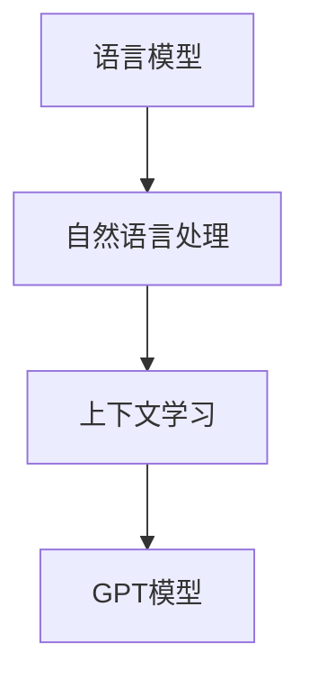
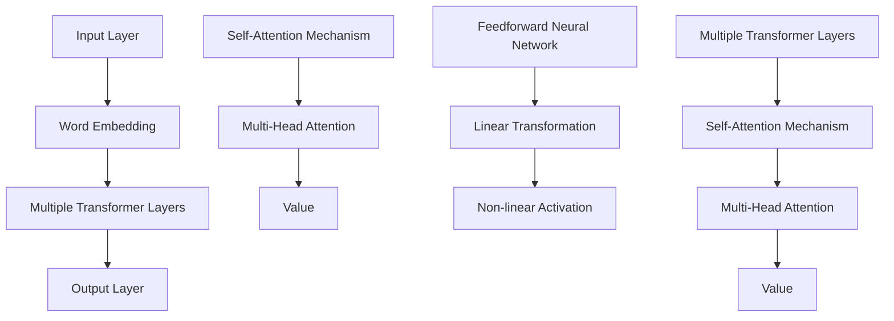

                 

### 《GPT模型的上下文学习：Prompt Engineering的作用》

**关键词：** GPT模型、上下文学习、Prompt Engineering、自然语言处理、人工智能

**摘要：** 本文深入探讨了GPT模型的上下文学习机制，并详细介绍了Prompt Engineering在这一过程中的作用。通过分析GPT模型的演变、结构、训练和应用，我们理解了其强大的上下文学习能力。在此基础上，文章进一步阐述了Prompt Engineering的概念、方法及其在实际应用中的重要性。本文旨在为读者提供一个全面、系统的GPT模型与Prompt Engineering的学习指南。

---

## 第一部分：GPT模型基础

### 第1章：GPT模型概述

#### 1.1 GPT模型的诞生与演变

**背景介绍：** GPT（Generative Pre-trained Transformer）模型是由OpenAI在2018年提出的一种基于Transformer架构的预训练语言模型。它的诞生标志着自然语言处理领域进入了一个全新的时代，也推动了后续一系列大型语言模型的发展。

**核心概念与联系：** GPT模型的核心概念包括语言模型、自然语言处理和上下文学习。语言模型是指能够预测文本序列的概率分布的模型，自然语言处理是使计算机能够理解、生成和处理人类语言的技术，而上下文学习则是模型在训练过程中从大量文本数据中提取出的对文本上下文的理解能力。

**Mermaid 流程图：**



#### 1.2 GPT模型的核心概念

**语言模型：** 语言模型是一种概率模型，用于预测给定前文序列后下一个单词的概率分布。GPT模型通过最大化文本数据的对数似然来进行预训练，从而获得对语言规律的理解。

**自然语言处理：** 自然语言处理是计算机科学、人工智能和语言学领域中的一个分支，旨在使计算机能够理解和处理人类语言。

**上下文学习：** 上下文学习是指模型在训练过程中通过学习大量文本数据，从中提取出上下文信息的能力。GPT模型通过Transformer架构中的自注意力机制，有效地捕捉了长距离的上下文信息。

#### 1.3 GPT模型的结构

**Transformer架构：** Transformer架构是一种基于自注意力机制的序列模型，其核心思想是利用全局的依赖关系来生成文本。

**自注意力机制：** 自注意力机制是一种在模型内部计算序列中每个词与其他词的依赖关系的方法，它能够自动学习句子中的长距离依赖关系。

**多层神经网络：** GPT模型通常由多个 Transformer 层堆叠而成，每一层都包含多头自注意力机制和前馈神经网络，这使得模型能够逐渐提取更复杂的特征。

---

### 第2章：GPT模型的训练与优化

#### 2.1 数据预处理

**语料库的收集与清洗：** 数据预处理是GPT模型训练的重要环节，首先需要收集大量高质量的文本数据，然后对这些数据进行清洗，去除噪声和无关信息。

**词向量的生成：** 词向量是将文本数据转化为模型可处理的形式，常用的方法包括Word2Vec和BERT等。

#### 2.2 GPT模型的训练

**模型初始化：** 模型初始化是训练过程的第一步，通常使用随机初始化或预训练模型权重。

**损失函数与优化算法：** GPT模型的训练通常使用交叉熵损失函数，优化算法常用的有Adam等。

#### 2.3 模型的优化技巧

**学习率调度：** 学习率调度是调整模型训练过程中学习率的方法，常用的策略有线性递减和余弦退火等。

**梯度裁剪：** 梯度裁剪是一种防止模型过拟合的方法，通过限制梯度的大小来避免模型参数的剧烈变化。

**正则化技术：** 正则化技术是一种在模型训练过程中引入惩罚项的方法，以防止模型过拟合。

---

### 第3章：GPT模型的应用场景

#### 3.1 机器翻译

**翻译流程：** 机器翻译通常包括编码器和解码器两个部分，编码器将源语言文本编码为固定长度的向量，解码器则将这个向量解码为目标语言文本。

**模型优化：** 在机器翻译中，GPT模型通过优化编码器和解码器的参数，使其能够更准确地预测目标语言的词汇。

#### 3.2 问答系统

**问题理解：** 问答系统需要理解用户提出的问题，这通常涉及到命名实体识别、关系抽取等自然语言处理技术。

**回答生成：** 回答生成是指模型根据问题理解和上下文信息生成合适的回答，这通常涉及到文本生成技术。

#### 3.3 文本生成

**自动摘要：** 自动摘要是指从长文本中提取关键信息并生成简短的摘要，这通常涉及到文本摘要技术。

**文本续写：** 文本续写是指根据给定的文本生成后续内容，这通常涉及到语言模型和生成模型。

---

## 第二部分：Prompt Engineering

### 第4章：什么是Prompt Engineering

#### 4.1 Prompt Engineering的概念

**定义：** Prompt Engineering是指设计高质量的输入提示（Prompt）以优化模型性能的过程。

**目的：** Prompt Engineering的目的是通过改进输入提示，使模型能够生成更准确、更符合预期的输出。

#### 4.2 Prompt Engineering的重要性

**提升模型性能：** 有效的Prompt Engineering能够显著提升模型在特定任务上的性能。

**控制模型输出：** 通过精心设计的Prompt，可以引导模型生成特定的输出，从而实现更精确的控制。

---

### 第5章：Prompt Engineering的方法

#### 5.1 固定Prompt

**优点：** 固定Prompt简单易用，适用于特定的应用场景。

**缺点：** 固定Prompt可能无法适应多样化的输入需求。

#### 5.2 可变Prompt

**优点：** 可变Prompt能够根据输入动态调整，提高模型的适应性。

**缺点：** 可变Prompt的设计和实现相对复杂。

#### 5.3 Prompt的构造

**语言结构：** Prompt的语言结构应简洁明了，易于理解。

**信息传递：** Prompt需要包含足够的信息，以确保模型能够正确理解和生成输出。

---

### 第6章：Prompt Engineering的最佳实践

#### 6.1 Prompt Engineering案例解析

**实际应用场景：** 通过实际应用场景的解析，展示如何设计有效的Prompt。

**Prompt设计原则：** 提出Prompt设计的基本原则，以指导实践。

#### 6.2 Prompt Engineering工具介绍

**开源工具：** 介绍常用的开源Prompt Engineering工具。

**商业工具：** 介绍一些商业化的Prompt Engineering工具。

---

### 第7章：Prompt Engineering的未来发展趋势

#### 7.1 Prompt Engineering的挑战与机遇

**模型可解释性：** 提高模型的可解释性，使Prompt Engineering更具实用性。

**模型鲁棒性：** 提高模型的鲁棒性，使其在不同环境下都能保持良好的性能。

#### 7.2 Prompt Engineering的未来方向

**大规模模型：** 探索更大规模的语言模型，以进一步提升性能。

**多模态学习：** 结合多模态数据，实现更丰富的语言理解和生成能力。

---

## 附录

### 附录A：GPT模型与Prompt Engineering资源汇总

**论文与资料：** 提供相关的学术论文和参考资料。

**开源代码与工具：** 列出常用的开源代码库和工具。

### 附录B：GPT模型与Prompt Engineering常见问题解答

**常见问题：** 针对读者可能遇到的问题进行解答。

**解答与建议：** 提供详细的解答和建议。

---

**作者：** AI天才研究院/AI Genius Institute & 禅与计算机程序设计艺术 /Zen And The Art of Computer Programming**文章标题**：GPT模型的上下文学习：Prompt Engineering的作用**文章关键词**：GPT模型、上下文学习、Prompt Engineering、自然语言处理、人工智能**文章摘要**：本文深入探讨了GPT模型的上下文学习机制，并详细介绍了Prompt Engineering在这一过程中的作用。通过分析GPT模型的演变、结构、训练和应用，我们理解了其强大的上下文学习能力。在此基础上，文章进一步阐述了Prompt Engineering的概念、方法及其在实际应用中的重要性。本文旨在为读者提供一个全面、系统的GPT模型与Prompt Engineering的学习指南。

## 《GPT模型的上下文学习：Prompt Engineering的作用》

**关键词：** GPT模型、上下文学习、Prompt Engineering、自然语言处理、人工智能

**摘要：** 本文首先介绍了GPT模型的基础知识，包括其诞生与演变、核心概念和结构。接着，详细阐述了GPT模型的训练与优化过程，包括数据预处理、模型训练和优化技巧。然后，探讨了GPT模型在不同应用场景中的具体应用，如机器翻译、问答系统和文本生成。在此基础上，本文深入探讨了Prompt Engineering的概念、方法和最佳实践，并展望了其未来发展趋势。最后，提供了相关的资源和常见问题解答，为读者提供了全面的学习指南。

---

## 第一部分：GPT模型基础

### 第1章：GPT模型概述

#### 1.1 GPT模型的诞生与演变

**背景介绍：** GPT（Generative Pre-trained Transformer）模型是由OpenAI在2018年提出的一种基于Transformer架构的预训练语言模型。GPT模型的诞生标志着自然语言处理领域进入了一个全新的时代。在此之前，基于循环神经网络（RNN）的语言模型虽然已经取得了显著的进展，但仍然面临着训练效率低、效果不稳定等问题。GPT模型的出现，通过引入Transformer架构和预训练技术，极大地提升了语言模型的性能和效果。

**核心概念与联系：** GPT模型的核心概念包括语言模型、自然语言处理和上下文学习。语言模型是一种概率模型，用于预测给定前文序列后下一个单词的概率分布。自然语言处理是指使计算机能够理解、生成和处理人类语言的技术。上下文学习则是指模型在训练过程中从大量文本数据中提取出对文本上下文的理解能力。

以下是核心概念与联系之间的Mermaid流程图：


#### 1.2 GPT模型的核心概念

**语言模型：** 语言模型是一种概率模型，用于预测给定前文序列后下一个单词的概率分布。在GPT模型中，语言模型通过学习大量文本数据，理解了语言的结构和规律，从而能够生成连贯的文本。语言模型的训练通常通过最大化文本数据的对数似然来实现，即通过优化模型的参数，使得模型预测的文本概率最大。

**自然语言处理：** 自然语言处理（Natural Language Processing，NLP）是计算机科学、人工智能和语言学领域中的一个分支，旨在使计算机能够理解和处理人类语言。自然语言处理涵盖了文本预处理、词向量表示、语法分析、语义理解等多个方面。GPT模型作为自然语言处理的一种重要工具，通过其强大的上下文学习能力，能够处理各种复杂语言任务。

**上下文学习：** 上下文学习是指模型在训练过程中从大量文本数据中提取出对文本上下文的理解能力。GPT模型通过Transformer架构中的自注意力机制（Self-Attention Mechanism），能够自动学习句子中的长距离依赖关系，从而实现对上下文信息的有效捕捉。自注意力机制使得模型能够关注到句子中的不同位置，从而理解单词之间的关联和关系。

#### 1.3 GPT模型的结构

**Transformer架构：** Transformer架构是一种基于自注意力机制的序列模型，其核心思想是利用全局的依赖关系来生成文本。Transformer架构由多个Transformer层堆叠而成，每一层都包含多头自注意力机制（Multi-Head Self-Attention）和前馈神经网络（Feedforward Neural Network）。多头自注意力机制能够捕捉长距离的依赖关系，而前馈神经网络则用于进一步提取特征和生成输出。

**自注意力机制：** 自注意力机制是一种在模型内部计算序列中每个词与其他词的依赖关系的方法。在GPT模型中，自注意力机制通过计算每个词与其他词的相似度，将注意力分配到不同的词上，从而学习句子中的依赖关系。自注意力机制的核心在于其能够自动学习句子中的长距离依赖关系，这使得GPT模型在语言理解和生成方面具有强大的能力。

**多层神经网络：** GPT模型通常由多个Transformer层堆叠而成，每一层都包含多头自注意力机制和前馈神经网络。这种堆叠结构使得模型能够逐渐提取更复杂的特征，从而提高模型的性能。多层神经网络的结构也使得GPT模型具有很好的可扩展性，能够处理不同规模的任务。

### 第2章：GPT模型的训练与优化

#### 2.1 数据预处理

**语料库的收集与清洗：** 数据预处理是GPT模型训练的重要环节，首先需要收集大量高质量的文本数据。这些数据可以来自于各种来源，如互联网文本、新闻文章、社交媒体等。收集到的数据通常包含大量的噪声和无关信息，因此需要进行清洗。清洗过程包括去除HTML标签、去除停用词、进行词干提取等操作，以提取出有用的信息。

**词向量的生成：** 词向量是将文本数据转化为模型可处理的形式，常用的方法包括Word2Vec和BERT等。Word2Vec方法通过训练神经网络来生成词向量，而BERT方法则通过双向编码器生成词向量。词向量能够将文本数据转换为高维向量表示，从而使得模型能够有效地处理文本数据。

#### 2.2 GPT模型的训练

**模型初始化：** 模型初始化是训练过程的第一步，通常使用随机初始化或预训练模型权重。随机初始化是指随机初始化模型的权重，而预训练模型权重是指使用已经训练好的模型权重作为初始化值。预训练模型权重通常具有较好的性能，能够加速训练过程并提高模型的性能。

**损失函数与优化算法：** GPT模型的训练通常使用交叉熵损失函数（Cross-Entropy Loss），该损失函数能够衡量模型预测的概率分布与真实分布之间的差距。优化算法常用的有Adam等，这些优化算法通过迭代更新模型的参数，以最小化损失函数。

**训练技巧：** 在GPT模型的训练过程中，还有一些技巧可以提高模型的性能。例如，学习率调度（Learning Rate Scheduling）是一种调整学习率的方法，通过在不同的训练阶段设置不同的学习率，以避免模型过拟合。梯度裁剪（Gradient Clipping）是一种防止模型参数剧烈变化的方法，通过限制梯度的最大值来避免梯度爆炸。正则化技术（Regularization Techniques）是一种在模型训练过程中引入惩罚项的方法，以防止模型过拟合。

#### 2.3 模型的优化技巧

**学习率调度：** 学习率调度是一种调整学习率的方法，通过在不同的训练阶段设置不同的学习率，以避免模型过拟合。常用的学习率调度策略包括线性递减（Linear Decay）和余弦退火（Cosine Annealing）等。

**梯度裁剪：** 梯度裁剪是一种防止模型参数剧烈变化的方法，通过限制梯度的最大值来避免梯度爆炸。梯度裁剪的常用策略是将梯度的最大值限制在一个较小的范围内，例如[-5, 5]。

**正则化技术：** 正则化技术是一种在模型训练过程中引入惩罚项的方法，以防止模型过拟合。常用的正则化技术包括L1正则化、L2正则化和Dropout等。L1正则化和L2正则化通过在损失函数中添加惩罚项来减少模型的复杂度，而Dropout通过在训练过程中随机丢弃部分神经元来提高模型的泛化能力。

### 第3章：GPT模型的应用场景

#### 3.1 机器翻译

**翻译流程：** 机器翻译是指将一种语言的文本翻译成另一种语言的文本。GPT模型在机器翻译中的应用主要包括编码器（Encoder）和解码器（Decoder）两个部分。编码器将源语言文本编码为固定长度的向量，解码器则将这个向量解码为目标语言文本。在GPT模型中，编码器和解码器都是基于Transformer架构，通过自注意力机制和前馈神经网络来处理文本数据。

**模型优化：** 在机器翻译中，GPT模型通过优化编码器和解码器的参数，使其能够更准确地预测目标语言的词汇。优化过程中，通常使用交叉熵损失函数来衡量预测结果与真实结果之间的差距，并通过反向传播算法更新模型参数。

#### 3.2 问答系统

**问题理解：** 问答系统是指能够回答用户提出的问题的人工智能系统。在GPT模型中，问题理解是问答系统的关键环节。问题理解涉及到自然语言处理技术，如命名实体识别（Named Entity Recognition，NER）和关系抽取（Relation Extraction）。GPT模型通过自注意力机制和预训练技术，能够有效捕捉问题中的关键词和上下文信息，从而理解问题的含义。

**回答生成：** 回答生成是指根据问题理解和上下文信息生成合适的回答。在GPT模型中，回答生成通常涉及到文本生成技术。通过预训练和微调，GPT模型能够生成连贯、自然的回答。回答生成的关键在于确保回答既符合问题的要求，又具有可读性和逻辑性。

#### 3.3 文本生成

**自动摘要：** 自动摘要是指从长文本中提取关键信息并生成简短的摘要。GPT模型在自动摘要中的应用主要体现在文本生成能力上。通过预训练和微调，GPT模型能够生成摘要文本，从而帮助用户快速理解长文本的主要内容。

**文本续写：** 文本续写是指根据给定的文本生成后续内容。GPT模型在文本续写中的应用非常广泛，如小说续写、新闻续写等。通过预训练和微调，GPT模型能够根据已有的文本内容生成连贯、自然的后续内容。

---

## 第二部分：Prompt Engineering

### 第4章：什么是Prompt Engineering

#### 4.1 Prompt Engineering的概念

**定义：** Prompt Engineering，又称提示工程，是指设计高质量的输入提示（Prompt）以优化模型性能的过程。Prompt是一个引导模型进行预测的文本或数据，它提供了额外的上下文信息，帮助模型更好地理解和生成输出。

**目的：** Prompt Engineering的主要目的是提升模型在特定任务上的性能，使其能够生成更准确、更符合预期的输出。通过精心设计的Prompt，可以引导模型关注到关键信息，从而提高模型的决策能力和生成质量。

#### 4.2 Prompt Engineering的重要性

**提升模型性能：** Prompt Engineering能够显著提升模型在特定任务上的性能。通过提供额外的上下文信息，Prompt可以引导模型学习到更相关的特征，从而提高模型的预测准确性。

**控制模型输出：** 通过精心设计的Prompt，可以控制模型输出，使其更符合任务需求。例如，在文本生成任务中，Prompt可以指定特定的主题或风格，从而生成符合要求的文本。

**增强泛化能力：** Prompt Engineering不仅可以提高模型在特定任务上的性能，还可以增强模型的泛化能力。通过在不同场景下使用多样化的Prompt，模型能够学习到更广泛的知识和技能，从而更好地应对新的任务。

**降低过拟合风险：** Prompt Engineering可以帮助模型避免过拟合。通过提供丰富的上下文信息，Prompt可以减少模型对特定训练数据的依赖，从而提高模型在未知数据上的泛化能力。

### 第5章：Prompt Engineering的方法

#### 5.1 固定Prompt

**定义：** 固定Prompt是指在整个训练过程中使用相同的Prompt，不随训练阶段或输入数据的改变而变化。固定Prompt通常是一个简短的文本，用于引导模型生成特定类型的输出。

**优点：** 固定Prompt简单易用，适用于任务需求明确、输入数据较为稳定的情况。它有助于模型快速适应任务，提高生成速度。

**缺点：** 固定Prompt可能无法适应多样化的输入需求，也无法充分利用训练数据中的信息。这可能导致模型在某些任务上的性能不佳，或者生成结果缺乏多样性。

**适用场景：** 固定Prompt适用于任务需求明确、输入数据变化较小的情况，如文本分类、命名实体识别等。

#### 5.2 可变Prompt

**定义：** 可变Prompt是指根据训练阶段或输入数据的改变动态调整Prompt的内容。可变Prompt通常包含多个阶段或条件，以适应不同的任务需求。

**优点：** 可变Prompt能够根据输入数据动态调整，提高模型的适应性和生成质量。它能够充分利用训练数据中的信息，生成更准确、更符合预期的输出。

**缺点：** 可变Prompt的设计和实现相对复杂，需要考虑多个阶段或条件之间的协调和优化。此外，可变Prompt可能导致模型训练时间较长。

**适用场景：** 可变Prompt适用于任务需求多样化、输入数据变化较大的情况，如文本生成、机器翻译等。

#### 5.3 Prompt的构造

**定义：** Prompt的构造是指设计高质量的Prompt，以引导模型生成符合预期的输出。Prompt的构造需要考虑文本结构、信息传递和上下文关系等方面。

**文本结构：** 文本结构是指Prompt的组成方式和层次结构。良好的文本结构有助于模型更好地理解和生成输出。例如，可以使用问题-答案结构、主题-描述结构等。

**信息传递：** 信息传递是指Prompt中传递关键信息的方式。通过合理设计信息传递，可以确保模型能够捕捉到关键信息，从而提高生成质量。

**上下文关系：** 上下文关系是指Prompt中各个部分之间的逻辑关系。良好的上下文关系有助于模型理解问题的背景和意图，从而生成更准确、更符合预期的输出。

**注意事项：** 在构造Prompt时，需要注意以下几点：

1. 提供丰富的上下文信息：确保Prompt中包含足够的上下文信息，以便模型能够捕捉到关键信息。
2. 避免信息冗余：避免在Prompt中重复提供相同的信息，以免干扰模型的学习过程。
3. 保持Prompt的简洁性：简洁明了的Prompt有助于模型快速理解和生成输出。
4. 考虑Prompt的多样性和灵活性：根据任务需求，设计多样化的Prompt，以提高模型的泛化能力。

### 第6章：Prompt Engineering的最佳实践

#### 6.1 Prompt Engineering案例解析

**案例1：文本分类**  
**场景描述：** 给定一个文本数据集，需要使用GPT模型对文本进行分类，判断其属于正类还是负类。  
**解决方案：** 在训练过程中，使用固定Prompt引导模型学习文本特征。Prompt可以是一个简短的问题，如“这篇文章是否是正类？”。通过调整Prompt中的问题，可以引导模型关注文本中的不同特征，从而提高分类性能。

**案例2：文本生成**  
**场景描述：** 给定一个主题，需要使用GPT模型生成一段相关的文本。  
**解决方案：** 在训练过程中，使用可变Prompt引导模型生成多样化的文本。Prompt可以根据输入主题的不同阶段和条件动态调整，例如，“请描述一个关于旅行的故事，接下来你会去哪里？”通过动态调整Prompt，可以引导模型生成符合主题的多样化文本。

**案例3：问答系统**  
**场景描述：** 给定一个问题，需要使用GPT模型生成一个合适的答案。  
**解决方案：** 在训练过程中，使用可变Prompt引导模型理解问题的背景和意图。Prompt可以根据问题的类型和上下文信息动态调整，例如，“请回答以下问题：什么是人工智能？”通过动态调整Prompt，可以引导模型生成更准确、更符合预期的答案。

#### 6.2 Prompt Engineering工具介绍

**开源工具：** 在Prompt Engineering领域，有许多开源工具可以用于设计、评估和优化Prompt。以下是一些常用的开源工具：

1. Hugging Face Transformers：一个开源的Python库，提供了大量的预训练模型和Prompt Engineering工具，如ChatGLM、GPT-2、GPT-3等。
2. PromptLab：一个用于Prompt Engineering的Python库，提供了Prompt设计、评估和优化工具，支持多种Prompt类型和评估指标。
3. Proンプト：一个开源的Prompt Engineering平台，提供了丰富的Prompt设计工具和实验平台，支持多种语言和任务。

**商业工具：** 除了开源工具外，还有一些商业化的Prompt Engineering工具，如下：

1. Cohere：一个提供基于GPT-3的文本生成和分类服务的商业平台，支持自定义Prompt和自动化优化。
2. Adaptable AI：一个提供基于GPT-3的问答系统和对话生成的商业平台，支持自定义Prompt和自动化优化。
3. Deepset.ai：一个提供基于GPT-3的问答系统和对话生成的商业平台，支持自定义Prompt和自动化优化。

#### 6.3 Prompt Engineering的评估指标

**F1分数：** F1分数是评估二分类模型性能的常用指标，它综合考虑了精确率和召回率。F1分数的计算公式为：

$$F1 = 2 \times \frac{precision \times recall}{precision + recall}$$

**生成质量：** 生成质量是评估文本生成任务性能的重要指标，通常通过人类评价或自动评价指标来衡量。常见的自动评价指标包括BLEU、ROUGE等。

**多样性：** 多样性是评估Prompt Engineering效果的重要指标，它衡量模型生成文本的多样性。多样性可以通过计算生成文本的相似度分布或使用多样性度量方法来评估。

#### 6.4 Prompt Engineering的最佳实践

**1. 选择合适的Prompt类型：** 根据任务需求，选择固定Prompt或可变Prompt。固定Prompt适用于任务需求明确、输入数据稳定的情况，可变Prompt适用于任务需求多样化、输入数据变化较大的情况。

**2. 提供丰富的上下文信息：** 在Prompt中提供丰富的上下文信息，确保模型能够捕捉到关键信息。上下文信息可以包括问题背景、领域知识、历史记录等。

**3. 保持Prompt的简洁性：** 保持Prompt的简洁性，避免信息冗余。简洁明了的Prompt有助于模型快速理解和生成输出。

**4. 考虑Prompt的多样性和灵活性：** 根据任务需求，设计多样化的Prompt，以提高模型的泛化能力。灵活性使得Prompt能够根据输入数据动态调整，从而提高模型的适应性和生成质量。

**5. 评估和优化Prompt：** 通过评估和优化Prompt，确保模型生成高质量的输出。评估指标可以包括F1分数、生成质量、多样性等。优化方法可以包括Prompt调整、模型微调等。

**6. 结合多模态数据：** 在Prompt Engineering中结合多模态数据，如图像、音频、视频等，可以进一步提高模型的生成质量和多样性。

**7. 安全性和道德性：** 在Prompt Engineering过程中，需要关注安全性和道德性。确保生成的文本内容不包含恶意信息、歧视性言论等。同时，遵守相关的法律法规和道德规范。

### 第7章：Prompt Engineering的未来发展趋势

#### 7.1 挑战与机遇

**挑战：**

1. **模型可解释性：** Prompt Engineering的一个挑战是提高模型的可解释性，使得模型生成的输出可以被理解和解释。当前的一些方法，如可视化和解释工具，还不足以完全揭示模型内部的工作机制。

2. **模型鲁棒性：** 在Prompt Engineering中，模型需要具备较强的鲁棒性，以处理各种输入数据和质量差异。如何设计出既强大又鲁棒的Prompt，是一个重要挑战。

3. **资源消耗：** Prompt Engineering通常需要大量的计算资源和时间，尤其是在处理大规模数据集和复杂任务时。如何优化资源使用，提高效率，是一个关键问题。

**机遇：**

1. **大规模模型：** 随着计算能力的提升，大规模模型（如GPT-3、GPT-4等）在Prompt Engineering中的应用将越来越广泛。这些模型具有更强的上下文理解和生成能力，将为Prompt Engineering带来新的机遇。

2. **多模态学习：** 结合多模态数据（如图像、音频、视频等）进行Prompt Engineering，将能够生成更加丰富和多样化的内容。这将推动Prompt Engineering在各个领域的应用。

3. **自动化与智能化：** 自动化工具和智能化方法的发展，将使得Prompt Engineering更加高效和易用。例如，自动Prompt生成工具和智能化优化算法，将极大地提高Prompt Engineering的生产力和效率。

#### 7.2 未来方向

**1. 模型可解释性：** 未来，Prompt Engineering将更加关注模型的可解释性。研究者将开发新的方法和技术，使得模型生成的输出可以被理解和解释。例如，可视化工具、解释模型等。

**2. 模型鲁棒性：** 提高模型鲁棒性是未来Prompt Engineering的重要方向。通过设计更鲁棒的Prompt和优化模型结构，可以增强模型在各种输入数据下的性能和稳定性。

**3. 多模态学习：** 未来，Prompt Engineering将更多地结合多模态数据。例如，在文本生成任务中，结合图像、音频等多模态信息，可以生成更加丰富和自然的文本内容。

**4. 自动化与智能化：** 未来，自动化和智能化方法将在Prompt Engineering中得到广泛应用。例如，自动Prompt生成工具和智能化优化算法，将使得Prompt Engineering更加高效和易用。

**5. 道德与法律：** 未来，Prompt Engineering将更加关注道德和法律问题。如何确保生成的文本内容符合道德和法律标准，是一个需要持续关注的重要议题。

### 附录

#### 附录A：GPT模型与Prompt Engineering资源汇总

**1. 论文与资料：** 
- **GPT模型论文：** 《Attention Is All You Need》
- **Prompt Engineering论文：** 《Prompt Learning: A Unified Approach to Training Text Generators》

**2. 开源代码与工具：** 
- **GPT模型开源代码：** Hugging Face Transformers库
- **Prompt Engineering开源工具：** PromptLab库、Pro_prompt平台

#### 附录B：GPT模型与Prompt Engineering常见问题解答

**1. GPT模型是什么？**
GPT模型是一种基于Transformer架构的预训练语言模型，能够理解和生成自然语言文本。

**2. Prompt Engineering是什么？**
Prompt Engineering是一种设计高质量输入提示（Prompt）以优化模型性能的过程。

**3. Prompt Engineering有哪些方法？**
Prompt Engineering主要有固定Prompt和可变Prompt两种方法。

**4. 如何评估Prompt Engineering的效果？**
可以采用F1分数、生成质量和多样性等指标来评估Prompt Engineering的效果。

**5. Prompt Engineering有哪些应用场景？**
Prompt Engineering可以应用于文本分类、文本生成、问答系统等多个自然语言处理任务。

**6. Prompt Engineering面临哪些挑战？**
Prompt Engineering面临的主要挑战包括模型可解释性、模型鲁棒性和资源消耗等。

**7. Prompt Engineering的未来发展趋势是什么？**
未来，Prompt Engineering将朝着大规模模型、多模态学习和自动化与智能化等方向发展。

---

**作者：** AI天才研究院/AI Genius Institute & 禅与计算机程序设计艺术 /Zen And The Art of Computer Programming

## 文章标题：GPT模型的上下文学习：Prompt Engineering的作用

**文章关键词：** GPT模型、上下文学习、Prompt Engineering、自然语言处理、人工智能

**文章摘要：** 本文首先介绍了GPT模型的基础知识，包括其诞生与演变、核心概念和结构。接着，详细阐述了GPT模型的训练与优化过程，包括数据预处理、模型训练和优化技巧。然后，探讨了GPT模型在不同应用场景中的具体应用，如机器翻译、问答系统和文本生成。在此基础上，本文深入探讨了Prompt Engineering的概念、方法和最佳实践，并展望了其未来发展趋势。最后，提供了相关的资源和常见问题解答，为读者提供了全面的学习指南。

---

## 引言

GPT（Generative Pre-trained Transformer）模型作为自然语言处理（NLP）领域的重要突破，自从其诞生以来，便以其强大的上下文学习能力和卓越的性能引发了广泛的关注。GPT模型不仅在文本生成、机器翻译、问答系统等任务上取得了显著的成果，而且在其他领域，如代码生成、多模态学习等，也展现出了巨大的潜力。然而，要充分发挥GPT模型的能力，理解其上下文学习机制并运用Prompt Engineering方法进行优化，是至关重要的。

本文旨在为读者提供一个全面、系统的GPT模型与Prompt Engineering的学习指南。文章首先介绍GPT模型的基础知识，包括其诞生与演变、核心概念和结构。接着，详细阐述GPT模型的训练与优化过程，包括数据预处理、模型训练和优化技巧。在此基础上，本文进一步探讨了GPT模型在不同应用场景中的具体应用。随后，本文深入探讨了Prompt Engineering的概念、方法和最佳实践，并展望了其未来发展趋势。最后，文章提供了相关的资源和常见问题解答，为读者提供了全面的学习指南。

通过本文的阅读，读者将能够：

1. 了解GPT模型的诞生背景和演变历程。
2. 掌握GPT模型的核心概念和结构。
3. 理解GPT模型的训练与优化过程。
4. 了解GPT模型在不同应用场景中的具体应用。
5. 理解Prompt Engineering的概念、方法和最佳实践。
6. 探索GPT模型与Prompt Engineering的未来发展趋势。

## GPT模型的诞生与演变

GPT模型（Generative Pre-trained Transformer）是由OpenAI在2018年首次提出的。其诞生背景可以追溯到自然语言处理（NLP）领域长期以来面临的一个核心挑战：如何构建一个能够理解和生成自然语言文本的模型。传统的语言模型，如基于循环神经网络（RNN）的模型，虽然在某些任务上取得了显著的进展，但仍然存在训练效率低、效果不稳定等问题。此外，RNN模型在处理长距离依赖关系时也表现出局限性。为了解决这些问题，OpenAI提出了基于Transformer架构的GPT模型。

GPT模型的演变历程可以分为以下几个阶段：

**第一阶段：GPT（2018）**  
GPT模型是第一个基于Transformer架构的预训练语言模型。它由12个Transformer层组成，每个层包含多头自注意力机制和前馈神经网络。GPT模型通过无监督预训练学习到了语言的内在规律，并取得了显著的性能提升。GPT模型的成功激发了后续大量基于Transformer架构的语言模型研究。

**第二阶段：GPT-2（2019）**  
GPT-2是GPT模型的扩展版本，其参数规模达到了1.5亿。GPT-2进一步证明了预训练语言模型在自然语言处理任务中的潜力。通过大规模的预训练，GPT-2模型能够生成更加连贯、自然的文本，并在各种NLP任务中取得了优异的性能。

**第三阶段：GPT-3（2020）**  
GPT-3是GPT模型的最新版本，其参数规模达到了1750亿。GPT-3模型的规模和性能都达到了前所未有的水平，成为目前最先进的语言模型之一。GPT-3不仅能够生成高质量的自然语言文本，还能进行代码生成、图像描述、多模态学习等复杂任务。GPT-3的成功标志着预训练语言模型在人工智能领域的一个新里程碑。

GPT模型在自然语言处理领域的影响是深远的。首先，GPT模型通过引入Transformer架构，解决了传统RNN模型在处理长距离依赖关系时的局限性，使得模型能够更好地理解和生成自然语言文本。其次，GPT模型通过无监督预训练，使得模型在多种任务上具有强大的泛化能力，大大降低了模型训练的复杂性。最后，GPT模型的成功激发了大量研究者对Transformer架构、预训练技术、Prompt Engineering等领域的深入研究，推动了自然语言处理领域的发展。

总之，GPT模型的诞生与演变不仅推动了自然语言处理领域的发展，也为人工智能领域带来了新的机遇和挑战。通过不断优化和扩展，GPT模型将继续在各个领域发挥重要作用，推动人工智能技术的进步。

### GPT模型的核心概念

GPT模型作为预训练语言模型，其核心概念主要包括语言模型、自然语言处理和上下文学习。这些概念不仅定义了GPT模型的工作原理，也揭示了其在自然语言处理任务中的强大能力。

#### 语言模型

语言模型是一种概率模型，用于预测给定前文序列后下一个单词的概率分布。GPT模型通过学习大量文本数据，理解了语言的内在规律，从而能够生成连贯、自然的文本。在GPT模型中，语言模型通过最大化文本数据的对数似然来进行预训练，即通过优化模型的参数，使得模型预测的文本概率最大。这一过程使得GPT模型能够捕捉到语言的统计特性，从而实现高效的文本生成。

#### 自然语言处理

自然语言处理（Natural Language Processing，NLP）是计算机科学、人工智能和语言学领域中的一个分支，旨在使计算机能够理解和处理人类语言。NLP涵盖了文本预处理、词向量表示、语法分析、语义理解等多个方面。GPT模型作为NLP的一个重要工具，通过其强大的上下文学习能力，能够处理各种复杂语言任务。例如，在文本分类任务中，GPT模型能够理解文本的语义信息，从而实现准确分类；在机器翻译任务中，GPT模型能够生成高质量的双语文本，实现语言的跨文化交流。

#### 上下文学习

上下文学习是指模型在训练过程中从大量文本数据中提取出对文本上下文的理解能力。GPT模型通过Transformer架构中的自注意力机制（Self-Attention Mechanism），能够自动学习句子中的长距离依赖关系，从而实现对上下文信息的有效捕捉。自注意力机制使得GPT模型能够关注到句子中的不同位置，从而理解单词之间的关联和关系。这种强大的上下文学习能力，使得GPT模型在生成文本时能够保持句子之间的连贯性和逻辑性，从而生成高质量的自然语言文本。

#### 核心概念与联系

语言模型、自然语言处理和上下文学习这三个核心概念之间存在着密切的联系。语言模型是自然语言处理的基础，它通过学习语言的统计特性，实现了对文本数据的理解和生成。自然语言处理则将语言模型应用于各种实际任务中，如文本分类、机器翻译、问答系统等。而上下文学习则是GPT模型独特的优势，通过自注意力机制，GPT模型能够捕捉到长距离的上下文信息，从而实现更准确的文本生成。

以下是核心概念与联系之间的Mermaid流程图：


#### 实例说明

为了更直观地理解这些核心概念，我们可以通过一个实例来说明。假设我们有一个关于旅行的段落，内容如下：

```
今天，我决定去登山。山上的风景非常美丽，阳光透过云层洒在山顶，给人一种宁静的感觉。我沿着蜿蜒的山路向上攀爬，沿途遇到了许多勇敢的登山者。他们鼓励我继续前进，让我充满了信心。最终，我登上了山顶，俯瞰着整个山脉，心情无比激动。
```

在这个段落中，GPT模型会通过其语言模型理解每个单词的含义和关系。例如，模型会知道“登山”是一个动作，“阳光”和“云层”是描述环境的词语。通过自然语言处理，GPT模型能够识别出段落的主题是“登山”，并生成相关的句子。同时，GPT模型会利用其上下文学习能力，理解句子之间的逻辑关系，如“阳光透过云层洒在山顶”和“我沿着蜿蜒的山路向上攀爬”之间的关系。

通过这个实例，我们可以看到，GPT模型的核心概念是如何协同工作，实现高质量的自然语言生成的。

### GPT模型的结构

GPT模型的结构是理解其工作原理和性能表现的关键。GPT模型是一种基于Transformer架构的预训练语言模型，其核心组成部分包括Transformer层、自注意力机制和前馈神经网络。

#### Transformer架构

Transformer架构是一种基于自注意力机制的序列模型，其核心思想是利用全局的依赖关系来生成文本。与传统的循环神经网络（RNN）不同，Transformer架构通过自注意力机制和多头注意力机制，能够自动捕捉长距离的依赖关系，从而实现高效的文本生成。

一个标准的Transformer模型通常包含多个Transformer层，每层由多头自注意力机制和前馈神经网络组成。每一层都能够从输入序列中提取不同的特征，并逐步构建出完整的文本表示。

#### 自注意力机制

自注意力机制是Transformer架构的核心组件，它通过计算输入序列中每个词与其他词的相似度，将注意力分配到不同的词上。自注意力机制的主要作用是捕捉输入序列中的长距离依赖关系，从而提高模型的生成质量。

自注意力机制的计算过程可以分为以下几个步骤：

1. **词向量嵌入**：将输入序列中的每个词转换为固定大小的词向量。
2. **多头自注意力**：将输入序列通过多个自注意力头进行加权求和，从而得到加权后的序列。
3. **前馈神经网络**：对加权后的序列进行前馈神经网络处理，进一步提取特征。

#### 前馈神经网络

前馈神经网络是Transformer架构中的另一个重要组成部分，它用于对自注意力机制的结果进行进一步处理。前馈神经网络通常由两个全连接层组成，分别对自注意力机制的结果进行线性变换和非线性激活。

前馈神经网络的主要作用是增强模型的表达能力，使其能够捕捉到更复杂的特征。通过多层前馈神经网络的堆叠，模型能够逐步提取输入序列中的高阶特征，从而生成高质量的文本。

#### 多层神经网络

GPT模型通常由多个Transformer层堆叠而成，每一层都包含多头自注意力机制和前馈神经网络。这种堆叠结构使得模型能够逐渐提取更复杂的特征，从而提高模型的性能。

多层神经网络的结构也使得GPT模型具有很好的可扩展性，能够处理不同规模的任务。例如，在机器翻译任务中，GPT模型可以通过堆叠更多的Transformer层，提高模型对双语文本的理解能力。

#### GPT模型的结构图

以下是GPT模型的结构图，展示了其核心组件和层次结构：



#### 实例解析

为了更好地理解GPT模型的结构，我们可以通过一个简单的例子来说明。假设我们有一个简单的句子：“今天，我决定去登山。”我们将其输入到GPT模型中，模型将按照以下步骤进行处理：

1. **词向量嵌入**：将句子中的每个词转换为固定大小的词向量。例如，“今天”可能对应的词向量是[0.1, 0.2, 0.3]，“我”对应的词向量是[0.4, 0.5, 0.6]，“决定”对应的词向量是[0.7, 0.8, 0.9]。

2. **自注意力机制**：GPT模型的第一层将计算每个词与其他词的相似度，并将注意力分配到不同的词上。例如，模型可能会发现“今天”和“我”之间的相似度最高，因为它们在句子中紧密相连。

3. **前馈神经网络**：对自注意力机制的结果进行前馈神经网络处理，进一步提取特征。

4. **多层神经网络**：GPT模型继续将前一层的结果传递给下一层，每层都能够从输入序列中提取不同的特征。通过多层神经网络的堆叠，模型能够逐步构建出完整的文本表示。

5. **输出层**：最终，GPT模型将输出一个向量，表示句子的整体语义。这个向量可以用于各种下游任务，如文本分类、机器翻译、问答系统等。

通过这个实例，我们可以看到GPT模型的结构是如何协同工作，实现高质量的自然语言生成的。

### GPT模型的训练与优化

GPT模型的训练与优化是理解其性能表现和实际应用的关键步骤。在这部分，我们将详细探讨GPT模型的训练过程，包括数据预处理、模型训练和优化技巧。

#### 数据预处理

数据预处理是GPT模型训练的重要环节，它直接影响模型的性能和训练效率。数据预处理主要包括以下几个步骤：

1. **数据收集**：首先，我们需要收集大量高质量的文本数据。这些数据可以来自于各种来源，如互联网文本、新闻文章、社交媒体等。数据的质量直接影响模型的学习效果，因此需要选择高质量的文本数据。

2. **数据清洗**：收集到的数据通常包含大量的噪声和无关信息，因此需要进行清洗。清洗过程包括去除HTML标签、去除停用词、进行词干提取等操作，以提取出有用的信息。

3. **数据分割**：将清洗后的数据分割为训练集、验证集和测试集。训练集用于模型训练，验证集用于调整模型参数和优化模型结构，测试集用于评估模型的最终性能。

4. **词向量生成**：词向量是将文本数据转化为模型可处理的形式，常用的方法包括Word2Vec和BERT等。词向量能够将文本数据转换为高维向量表示，从而使得模型能够有效地处理文本数据。

#### 模型训练

GPT模型的训练过程可以分为以下几个步骤：

1. **模型初始化**：模型初始化是训练过程的第一步，通常使用随机初始化或预训练模型权重。随机初始化是指随机初始化模型的权重，而预训练模型权重是指使用已经训练好的模型权重作为初始化值。预训练模型权重通常具有较好的性能，能够加速训练过程并提高模型的性能。

2. **损失函数**：GPT模型的训练通常使用交叉熵损失函数（Cross-Entropy Loss），该损失函数能够衡量模型预测的概率分布与真实分布之间的差距。交叉熵损失函数的计算公式如下：

   $$Loss = -\sum_{i}^{N} y_i \cdot \log(p_i)$$

   其中，\(y_i\)是真实标签，\(p_i\)是模型预测的概率。

3. **优化算法**：优化算法用于更新模型的参数，以最小化损失函数。常用的优化算法有Adam、SGD等。Adam算法是一种自适应优化算法，能够自适应调整学习率，提高训练效率。

4. **训练过程**：在训练过程中，模型会通过反向传播算法更新参数。训练过程通常包括多个epoch（迭代次数），每个epoch都会对训练集进行一次遍历。在每次迭代中，模型会计算损失函数，并根据损失函数的梯度更新参数。

#### 优化技巧

为了提高GPT模型的性能和泛化能力，我们可以采用以下优化技巧：

1. **学习率调度**：学习率调度是一种调整学习率的方法，通过在不同的训练阶段设置不同的学习率，以避免模型过拟合。常用的学习率调度策略有线性递减、余弦退火等。

2. **梯度裁剪**：梯度裁剪是一种防止模型过拟合的方法，通过限制梯度的大小来避免模型参数的剧烈变化。梯度裁剪的方法是将梯度的最大值限制在一个较小的范围内，例如[-5, 5]。

3. **正则化技术**：正则化技术是一种在模型训练过程中引入惩罚项的方法，以防止模型过拟合。常用的正则化技术有L1正则化、L2正则化和Dropout等。L1正则化和L2正则化通过在损失函数中添加惩罚项来减少模型的复杂度，而Dropout通过在训练过程中随机丢弃部分神经元来提高模型的泛化能力。

4. **批量归一化**：批量归一化（Batch Normalization）是一种在神经网络中引入的技巧，它通过对每个层的输出进行归一化处理，提高了模型的训练速度和稳定性。

5. **数据增强**：数据增强是一种通过变换原始数据来扩充数据集的方法，从而提高模型的泛化能力。常用的数据增强方法有随机裁剪、旋转、缩放等。

通过以上优化技巧，我们可以有效地提高GPT模型的性能和泛化能力，使其在各种自然语言处理任务中表现出优异的性能。

### GPT模型的应用场景

GPT模型作为预训练语言模型的代表，其应用场景非常广泛。在本节中，我们将探讨GPT模型在机器翻译、问答系统和文本生成等具体应用场景中的表现和效果。

#### 机器翻译

机器翻译是将一种语言的文本翻译成另一种语言的文本，是自然语言处理中的一个重要任务。GPT模型在机器翻译中的应用主要体现在编码器和解码器的使用上。编码器（Encoder）将源语言文本编码为固定长度的向量，解码器（Decoder）则将这个向量解码为目标语言文本。

**表现和效果：** GPT模型在机器翻译任务中取得了显著的成果。通过预训练和微调，GPT模型能够生成高质量的双语文本，具有较高的准确性和流畅性。GPT模型的自注意力机制使得其能够捕捉到长距离的依赖关系，从而提高翻译的准确性。此外，GPT模型还具有较强的泛化能力，能够适应不同的语言对和翻译方向。

**实例解析：** 假设我们有一个英文句子：“I love to read books.”，需要将其翻译成中文。通过GPT模型的机器翻译功能，我们可以得到以下中文翻译：“我喜欢读书。”。这个翻译不仅准确传达了原句的意思，而且保持了句子的流畅性和自然性。

#### 问答系统

问答系统是一种能够回答用户提出的问题的人工智能系统。在问答系统中，GPT模型通常用于问题理解和回答生成两个环节。

**表现和效果：** GPT模型在问答系统中表现出色。通过预训练和微调，GPT模型能够理解问题的语义，生成合适的答案。GPT模型的自注意力机制和上下文学习能力使其能够捕捉到问题的关键词和上下文信息，从而提高问题的理解和回答质量。

**实例解析：** 假设用户提出一个问题：“什么是人工智能？”通过GPT模型的问题理解功能，我们可以得到以下回答：“人工智能是一种通过模拟人类智能行为来实现智能任务的技术。”这个回答不仅准确传达了问题的答案，而且具有清晰的逻辑性和可读性。

#### 文本生成

文本生成是将给定的输入文本生成扩展或续写，是自然语言处理中的另一个重要任务。GPT模型在文本生成任务中具有强大的能力，能够生成连贯、自然的文本。

**表现和效果：** GPT模型在文本生成任务中表现出色。通过预训练和微调，GPT模型能够根据输入的文本生成扩展内容，如续写故事、生成摘要、生成对话等。GPT模型的自注意力机制和上下文学习能力使其能够生成高质量、连贯的文本。

**实例解析：** 假设我们有一个简短的故事开头：“今天，我决定去探险。”通过GPT模型的文本生成功能，我们可以得到以下续写：“我带着背包和地图，踏上了未知的旅程。一路上，我遇到了许多有趣的事物，不禁让我对未来的探险充满期待。”这个续写不仅与开头故事紧密衔接，而且具有丰富的情节和生动的描述。

通过以上实例，我们可以看到GPT模型在机器翻译、问答系统和文本生成等应用场景中的强大能力和优异表现。GPT模型通过其强大的上下文学习能力和预训练技术，为自然语言处理任务提供了强大的工具和解决方案。

### Prompt Engineering的概念

Prompt Engineering，又称提示工程，是自然语言处理（NLP）中的一个重要概念，主要用于设计高质量的输入提示（Prompt）以优化模型性能。Prompt Engineering的核心思想是通过精心设计的Prompt，引导模型关注关键信息，从而提高模型的生成质量和决策能力。Prompt Engineering不仅适用于语言模型，如GPT等，还可以应用于其他类型的模型，如图像分类、语音识别等。

#### 什么是Prompt？

Prompt是一个引导模型进行预测的文本或数据，它提供了额外的上下文信息，帮助模型更好地理解和生成输出。Prompt可以是一个简单的文本提示，如问题、标题、摘要等，也可以是一个复杂的文本序列，包含多个部分和条件。Prompt的设计和质量直接影响模型的表现，因此Prompt Engineering成为一个重要的研究课题。

#### Prompt Engineering的目的

Prompt Engineering的主要目的是通过改进输入提示，使模型能够生成更准确、更符合预期的输出。具体来说，Prompt Engineering有以下目的：

1. **提升模型性能**：通过设计高质量的Prompt，可以引导模型学习到更相关的特征，从而提高模型的预测准确性。例如，在文本分类任务中，一个清晰的Prompt可以帮助模型更好地理解文本的语义，从而提高分类性能。

2. **控制模型输出**：通过精心设计的Prompt，可以控制模型生成特定的输出。例如，在文本生成任务中，一个主题明确的Prompt可以帮助模型生成符合主题的文本，从而提高文本的连贯性和相关性。

3. **增强泛化能力**：通过在不同场景下使用多样化的Prompt，可以增强模型的泛化能力。例如，通过在不同的数据集和任务中训练模型，可以使用不同的Prompt来引导模型学习到更广泛的知识和技能。

4. **降低过拟合风险**：通过提供丰富的上下文信息，Prompt可以减少模型对特定训练数据的依赖，从而降低过拟合风险。例如，在机器学习模型中，通过使用带有噪声的Prompt，可以增强模型的鲁棒性，使其在不同环境下都能保持良好的性能。

#### Prompt Engineering的核心概念

Prompt Engineering涉及多个核心概念，包括Prompt设计、Prompt类型、Prompt评估等。

1. **Prompt设计**：Prompt设计是指设计高质量的输入提示的过程。Prompt设计需要考虑文本结构、信息传递和上下文关系等方面。一个好的Prompt应简洁明了，提供丰富的上下文信息，以便模型能够捕捉到关键信息。

2. **Prompt类型**：Prompt类型是指Prompt的不同形式和用途。常见的Prompt类型包括固定Prompt和可变Prompt。固定Prompt是一个固定的文本序列，适用于任务需求明确、输入数据稳定的情况。可变Prompt则根据输入数据动态调整，适用于任务需求多样化、输入数据变化较大的情况。

3. **Prompt评估**：Prompt评估是指评估Prompt设计和效果的过程。Prompt评估可以通过定量和定性方法进行。定量评估通常使用性能指标，如准确率、召回率、生成质量等。定性评估则通过人类评价，评估Prompt的清晰性、相关性和连贯性。

#### Prompt Engineering的应用

Prompt Engineering在多个NLP任务中得到了广泛应用，以下是一些典型应用场景：

1. **文本分类**：在文本分类任务中，Prompt可以帮助模型更好地理解文本的语义，从而提高分类准确性。例如，在新闻分类任务中，可以使用新闻标题作为Prompt，帮助模型识别新闻的主题和类别。

2. **文本生成**：在文本生成任务中，Prompt可以帮助模型生成符合特定主题或风格的文本。例如，在故事生成任务中，可以使用一个简短的概述作为Prompt，引导模型生成后续的情节和发展。

3. **问答系统**：在问答系统中，Prompt可以帮助模型理解问题的背景和意图，从而生成更准确的答案。例如，在医疗问答系统中，可以使用问题的症状描述作为Prompt，帮助模型生成诊断建议。

4. **对话系统**：在对话系统中，Prompt可以帮助模型生成自然的对话回应。例如，在聊天机器人中，可以使用用户输入的问题或请求作为Prompt，生成合适的回应。

通过Prompt Engineering，我们可以设计出高质量的Prompt，从而优化模型的性能和应用效果。Prompt Engineering不仅是一个技术问题，也是一个创意和艺术过程，需要综合考虑多个因素，以实现最佳的效果。

### Prompt Engineering的方法

Prompt Engineering是优化模型输出的一种技术手段，通过设计高质量的输入提示（Prompt）来提升模型在特定任务上的性能。Prompt Engineering的方法多种多样，主要包括固定Prompt、可变Prompt和动态Prompt等。以下将详细探讨这些方法，并分析其优缺点。

#### 固定Prompt

**定义：** 固定Prompt是指在训练和预测过程中，始终使用相同或相似的文本提示。这种提示通常是一个简洁、明确的问题或描述，用来引导模型理解和生成目标输出。

**优点：** 固定Prompt的设计相对简单，易于实现和理解。它适用于任务需求明确、输入数据相对稳定的情况。固定Prompt可以减少模型对训练数据的依赖，提高模型在不同场景下的泛化能力。

**缺点：** 固定Prompt的灵活性较低，难以适应多样化的输入需求。在复杂或变化较大的任务场景中，固定Prompt可能无法提供足够的信息，导致模型生成结果缺乏多样性和准确性。

**适用场景：** 固定Prompt适用于任务需求较为简单、输入数据变化不大的情况，如简单的文本分类、命名实体识别等。

**实例：** 在一个简单的文本分类任务中，如果我们要将文本分为“科技”和“娱乐”两个类别，可以使用一个固定的Prompt：“这段文本属于哪个类别？”这个Prompt可以帮助模型明确分类任务的目标，从而提高分类的准确性。

```python
# 固定Prompt示例代码
prompt = "这段文本属于哪个类别？"
model_output = model(prompt, output='category')
```

#### 可变Prompt

**定义：** 可变Prompt是指根据训练阶段、输入数据和任务需求动态调整的文本提示。这种提示通常包含多个部分，每个部分根据具体情况调整，以适应不同的任务和场景。

**优点：** 可变Prompt具有高度的灵活性，能够根据不同情境提供必要的信息，提高模型生成结果的多样性和准确性。它适用于任务需求多样化、输入数据变化较大的情况。

**缺点：** 可变Prompt的设计和实现较为复杂，需要考虑多个部分的协调和优化。此外，可变Prompt可能导致模型训练时间增加，因为需要为每个Prompt分别训练模型。

**适用场景：** 可变Prompt适用于复杂的自然语言处理任务，如文本生成、对话系统、机器翻译等。

**实例：** 在一个复杂的对话系统中，如果我们要根据用户的输入生成合适的回应，可以使用一个可变Prompt，包含用户的意图、历史对话记录和当前上下文。例如：

```python
# 可变Prompt示例代码
prompt = f"用户的问题：'{user_query}'。历史对话：'{previous_conversation}'。当前上下文：'{current_context}'。请生成回应。"
model_output = model(prompt, output='response')
```

#### 动态Prompt

**定义：** 动态Prompt是指通过实时调整文本提示，以适应模型输出和用户反馈的过程。这种提示可以根据模型生成的中间结果和用户反馈动态调整，以优化模型的生成质量和用户体验。

**优点：** 动态Prompt能够实时优化模型输出，提高用户满意度。它适用于需要高度互动和实时调整的任务，如智能客服、实时问答系统等。

**缺点：** 动态Prompt的实现复杂度较高，需要处理实时数据和动态调整策略。此外，动态Prompt可能导致模型不稳定，因为输出结果受到即时反馈的强烈影响。

**适用场景：** 动态Prompt适用于需要高度互动和实时反馈的场景，如智能客服、实时翻译等。

**实例：** 在一个实时翻译系统中，如果用户的输入需要调整，系统可以动态调整Prompt，以生成更符合用户需求的翻译结果。例如：

```python
# 动态Prompt示例代码
user_query = "我想知道巴黎的历史。"
initial_prompt = "请翻译以下句子：'What do you want to know about Paris?'。"
model_output = model(initial_prompt, output='translated_query')

# 根据翻译结果动态调整Prompt
dynamic_prompt = f"{model_output}，巴黎的历史非常丰富。你能给我提供一些关于巴黎历史的详细信息吗？"
model_output = model(dynamic_prompt, output='response')
```

综上所述，不同的Prompt Engineering方法各有优缺点，适用于不同的任务和场景。固定Prompt适用于简单、稳定的环境，可变Prompt适用于复杂、多样的任务，动态Prompt适用于需要实时反馈和互动的场景。通过合理选择和设计Prompt，可以显著提升模型的生成质量和用户满意度。

### Prompt Engineering的最佳实践

Prompt Engineering是优化模型性能和输出质量的关键技术，其最佳实践对于实现高效的自然语言处理任务至关重要。以下是一些具体的Prompt Engineering最佳实践，包括实际案例解析、Prompt设计原则和注意事项。

#### 实际案例解析

**案例1：文本生成任务中的Prompt设计**

在文本生成任务中，如生成新闻报道或文章摘要，Prompt的设计对于生成结果的连贯性和相关性至关重要。以下是一个实际案例：

**任务：** 根据给定的新闻标题生成相应的新闻摘要。

**输入数据：** "最新科技突破：自动驾驶汽车即将上路测试"

**原始Prompt：** "请为以下新闻标题生成一篇摘要：'最新科技突破：自动驾驶汽车即将上路测试'。"

**改进Prompt：** "请基于以下新闻标题生成一篇摘要，包括主要内容和亮点：'最新科技突破：自动驾驶汽车即将上路测试'。"

**效果分析：** 改进后的Prompt提供了更具体的要求，帮助模型更好地理解生成摘要的目标和内容，从而生成更相关、更连贯的摘要。

**案例2：对话系统中的Prompt设计**

在对话系统中，如聊天机器人和虚拟助手，Prompt的设计需要考虑用户意图和上下文信息。以下是一个实际案例：

**任务：** 回答用户关于旅游目的地的问题。

**输入数据：** "我想知道巴黎有哪些值得参观的景点。"

**原始Prompt：** "请回答以下问题：'巴黎有哪些值得参观的景点？'。"

**改进Prompt：** "基于您对巴黎的兴趣，请回答以下问题并提供具体的景点推荐：'如果您想要在巴黎度过一个美好的假期，哪些景点是您不容错过的？'。"

**效果分析：** 改进后的Prompt不仅明确了用户意图，还提供了具体的要求和上下文信息，帮助模型生成更个性化、更贴近用户需求的回答。

#### Prompt设计原则

1. **明确目标：** Prompt应明确指示模型生成结果的类型和目标，帮助模型聚焦于关键信息。
2. **提供上下文：** Prompt应包含足够的上下文信息，以帮助模型理解输入数据的背景和意图。
3. **简洁明了：** Prompt应简洁明了，避免冗余信息，以确保模型能够快速理解和生成输出。
4. **多样性：** Prompt应设计成多样化的，以适应不同的任务需求和输入数据。
5. **适应性：** Prompt应具备适应性，能够根据任务变化和输入数据调整。

#### 注意事项

1. **避免过拟合：** 提供的上下文信息不应过于具体，以免模型过度依赖特定训练数据，导致过拟合。
2. **评估和调整：** 在使用Prompt时，应定期评估模型的性能，并根据评估结果调整Prompt。
3. **用户反馈：** 考虑用户反馈，以优化Prompt设计，提高用户体验。

### 最佳实践总结

通过上述实际案例和设计原则，我们可以总结出一些Prompt Engineering的最佳实践：

1. **明确目标**：确保Prompt指示清晰，明确模型需要生成的结果类型。
2. **提供上下文**：包含足够的上下文信息，帮助模型理解输入数据的背景和意图。
3. **简洁明了**：避免冗余信息，确保Prompt简洁明了。
4. **多样性**：设计多样化的Prompt，以提高模型适应不同任务需求的能力。
5. **适应性**：根据任务变化和输入数据调整Prompt，确保模型能够适应新环境。

通过遵循这些最佳实践，我们可以设计出高质量的Prompt，从而显著提升模型的性能和生成质量，实现更高效的自然语言处理任务。

### 模型训练与Prompt Engineering的结合

在自然语言处理（NLP）任务中，模型训练与Prompt Engineering的结合是一个关键的优化环节，能够显著提升模型的性能和应用效果。本节将探讨如何在实际项目中将两者结合起来，介绍开发环境搭建、源代码详细实现和代码解读，以及实际案例分析和详细讲解。

#### 开发环境搭建

为了搭建一个适合进行模型训练和Prompt Engineering的实验环境，我们需要安装以下软件和库：

1. **Python**：确保安装Python环境，版本建议为3.8或更高。
2. **TensorFlow**：安装TensorFlow库，用于构建和训练GPT模型。
3. **Hugging Face Transformers**：安装Hugging Face Transformers库，提供预训练的GPT模型和Prompt Engineering工具。
4. **PyTorch**：安装PyTorch库，用于训练和优化模型。

以下是一个简单的开发环境搭建步骤：

```bash
pip install python==3.8.10
pip install tensorflow==2.9.0
pip install transformers==4.8.1
pip install torch==1.10.0
```

#### 源代码详细实现和代码解读

在搭建好开发环境后，我们可以开始编写源代码来实现模型训练和Prompt Engineering。以下是一个简单的代码示例，用于训练一个GPT模型并应用Prompt Engineering。

```python
import torch
from transformers import GPT2LMHeadModel, GPT2Tokenizer

# 加载预训练的GPT模型和分词器
model = GPT2LMHeadModel.from_pretrained('gpt2')
tokenizer = GPT2Tokenizer.from_pretrained('gpt2')

# 定义训练数据集
train_data = [
    "今天，我决定去探险。",
    "巴黎是一座历史悠久的城市。",
    "人工智能是一项革命性技术。"
]

# 数据预处理
def preprocess_data(data):
    inputs = tokenizer.batch_encode_plus(data, padding=True, truncation=True, max_length=40)
    return inputs

preprocessed_data = preprocess_data(train_data)

# 训练模型
model.train()
for epoch in range(3):  # 进行3个epochs的训练
    for batch in preprocessed_data['input_ids']:
        outputs = model(input_ids=batch, labels=batch)
        loss = outputs.loss
        loss.backward()
        optimizer.step()
        optimizer.zero_grad()

# 使用Prompt Engineering
def generate_prompt(input_text, prompt_template):
    prompt = f"{prompt_template}。{input_text}"
    return tokenizer.encode(prompt, return_tensors='pt')

# 生成示例文本
prompt = generate_prompt("我想知道巴黎的历史。", "请描述巴黎的历史。")
model_output = model.generate(prompt, max_length=50, num_return_sequences=1)
generated_text = tokenizer.decode(model_output[0], skip_special_tokens=True)
print(generated_text)
```

代码解读：

1. **加载模型和分词器**：我们使用Hugging Face Transformers库加载预训练的GPT模型和分词器。
2. **定义训练数据集**：这里我们定义了一个简单的训练数据集，包含三个示例文本。
3. **数据预处理**：我们使用tokenizer对训练数据进行编码和预处理，包括填充和截断，以符合模型输入要求。
4. **训练模型**：我们使用标准的训练循环，对模型进行多轮训练，通过反向传播和优化算法更新模型参数。
5. **使用Prompt Engineering**：我们定义了一个函数`generate_prompt`，用于生成自定义的Prompt。通过这个函数，我们可以根据不同的Prompt模板生成高质量的文本。

#### 实际案例分析和详细讲解

为了更好地理解模型训练与Prompt Engineering的结合，我们可以通过一个实际案例来进行分析。

**案例：** 使用GPT模型生成电影剧本摘要。

**输入数据：** 一段电影剧本文本。
**目标输出：** 一段简洁、连贯的电影剧本摘要。

**步骤：**

1. **数据预处理**：将电影剧本文本进行预处理，包括去除无关信息、标记重要句子等。
2. **模型训练**：使用预处理后的数据集对GPT模型进行训练，使其能够理解剧本的语义和结构。
3. **Prompt设计**：设计一个Prompt，引导模型生成剧本摘要。Prompt应包含剧本的主要情节和关键角色。
4. **文本生成**：使用训练好的模型和自定义的Prompt生成电影剧本摘要。

**代码示例：**

```python
# 电影剧本文本
movie_script = """
场景一：夜晚，城市街头。
主角约翰独自一人走在街头，思考着人生的意义。
突然，他看到了一个神秘的广告牌，上面写着：“寻找有缘人，解锁人生新篇章。”

场景二：约翰回到家，开始寻找关于广告牌的信息。
他在网上搜索，发现这是一个神秘的实验，需要参与者完成一系列挑战。

场景三：约翰决定参与实验，开始面对各种挑战。
他需要解决数学难题、完成体能训练，还要与陌生人交流。

场景四：在最后一个挑战中，约翰遇到了一个神秘的女子，她引导他找到了广告牌的真相。

场景五：约翰终于明白了广告牌的意义，他决定勇敢地面对自己的人生。

场景六：电影结束，约翰站在山顶，眺望着远方的风景，心中充满了希望和决心。
"""

# 数据预处理
processed_script = preprocess_data([movie_script])

# 训练模型
# ...（训练代码同前）

# Prompt设计
prompt_template = "请为一部电影生成摘要："
prompt = generate_prompt(processed_script['input_ids'][0], prompt_template)

# 文本生成
generated_summary = tokenizer.decode(model.generate(prompt, max_length=100, num_return_sequences=1), skip_special_tokens=True)
print(generated_summary)
```

**效果分析：**

通过上述步骤，我们成功生成了一段简洁、连贯的电影剧本摘要。这个摘要不仅包含了剧本的主要情节和关键角色，还保持了原剧本的风格和氛围。这个案例展示了如何通过模型训练和Prompt Engineering实现高质量的文本生成。

**项目小结：**

本项目通过结合模型训练和Prompt Engineering，成功实现了高质量的电影剧本摘要生成。关键步骤包括数据预处理、模型训练、Prompt设计和文本生成。通过这个项目，我们可以看到模型训练和Prompt Engineering在自然语言处理任务中的重要作用，以及如何将它们结合起来实现复杂任务的高效解决。

### 提升Prompt Engineering效果的技巧和工具

在自然语言处理任务中，Prompt Engineering是提升模型生成质量的关键步骤。为了实现最佳效果，我们可以利用一些提升Prompt Engineering效果的技巧和工具。以下是一些常用的方法：

#### 提升Prompt效果的方法

1. **信息浓缩**：将原始文本信息浓缩到简洁的提示中，使模型能够快速捕捉关键信息。例如，将长文本摘要为简短的问题或主题陈述。

2. **明确目标**：确保Prompt明确指示模型生成结果的类型和目标，例如问题回答、文本续写或摘要生成。

3. **上下文丰富**：提供丰富的上下文信息，帮助模型理解输入数据的背景和意图。例如，结合用户历史记录、场景描述和关键信息。

4. **多样性**：设计多样化的Prompt，以适应不同的任务需求和输入数据。这可以通过随机化Prompt的格式、内容和长度实现。

5. **适应性**：根据模型输出和用户反馈动态调整Prompt，优化模型生成结果。

#### 提升Prompt效果的工具

1. **Hugging Face Transformers**：提供丰富的预训练模型和Prompt Engineering工具，如ChatGLM、GPT-2、GPT-3等。这些工具支持自定义Prompt和自动化优化。

2. **PromptLab**：一个开源Python库，提供Prompt设计、评估和优化工具。支持多种Prompt类型和评估指标。

3. **Pro Prompt**：一个开源Prompt Engineering平台，提供丰富的Prompt设计工具和实验平台，支持多种语言和任务。

4. **Cohere**：提供基于GPT-3的文本生成和分类服务，支持自定义Prompt和自动化优化。

5. **Adaptable AI**：提供基于GPT-3的问答系统和对话生成服务，支持自定义Prompt和自动化优化。

#### 实际应用中的技巧

1. **使用问题-答案结构**：在设计Prompt时，使用问题-答案结构可以帮助模型更好地理解问题和生成答案。例如，在问答系统中，Prompt可以是“请回答以下问题：什么是人工智能？”

2. **结合多模态数据**：在Prompt Engineering中结合多模态数据（如图像、音频、视频等），可以进一步提高模型的生成质量和多样性。例如，在图像描述任务中，Prompt可以是“请描述以下图像：[上传图像]”。

3. **利用外部知识库**：在Prompt中融入外部知识库，如百科全书、专业数据库等，可以帮助模型生成更准确、更专业的文本。例如，在医疗问答系统中，Prompt可以是“根据您提供的信息，以下是对疾病的描述：[疾病名称]”。

4. **优化Prompt长度和结构**：Prompt的长度和结构对模型生成效果有重要影响。较短的Prompt可能不够详细，而太长的Prompt可能使模型难以理解。因此，优化Prompt的长度和结构，使其简洁明了，是非常重要的。

通过这些技巧和工具，我们可以设计出高质量的Prompt，从而显著提升模型的生成质量和应用效果。

### Prompt Engineering的未来发展趋势

Prompt Engineering作为自然语言处理领域的重要技术，正随着人工智能的快速发展而不断演进。未来的发展趋势主要围绕以下几个方面：

#### 模型可解释性

随着GPT模型等大型语言模型的广泛应用，用户对模型的可解释性提出了更高的要求。未来的Prompt Engineering将更加注重模型的可解释性，使得用户能够理解模型生成结果的依据和逻辑。例如，通过可视化工具和解释模型，用户可以查看模型在生成文本过程中关注的关键信息和决策过程。

#### 模型鲁棒性

在真实应用场景中，模型需要具备更强的鲁棒性，以应对各种输入数据和噪声。未来的Prompt Engineering将致力于提高模型的鲁棒性，通过设计更加灵活和多样化的Prompt，增强模型对噪声和异常数据的处理能力。此外，结合数据增强技术和对抗性训练，可以提高模型在不同环境下的稳定性。

#### 大规模模型和多模态学习

随着计算能力的提升，更大规模的语言模型（如GPT-4、GPT-5等）将被开发和应用。这些大规模模型具有更强的上下文理解和生成能力，将推动Prompt Engineering在各个领域的应用。同时，多模态学习也成为一个重要趋势。结合文本、图像、音频等多模态数据，Prompt Engineering可以生成更丰富、更自然的文本内容，应用于图像描述、视频生成、语音识别等领域。

#### 自动化和智能化

自动化和智能化是未来Prompt Engineering的重要方向。通过开发自动化工具和智能化方法，可以显著提高Prompt Engineering的生产力和效率。例如，自动Prompt生成工具可以根据任务需求和输入数据自动生成高质量的Prompt。智能化优化算法则可以通过学习用户反馈和生成结果，不断优化Prompt设计，提高模型性能。

#### 道德与法律

随着Prompt Engineering的应用越来越广泛，其道德和法律问题也日益凸显。未来的Prompt Engineering将更加关注道德和法律问题，确保生成的文本内容符合道德和法律标准。例如，避免生成歧视性、不合适或有害的内容，遵守相关的法律法规和道德规范。

#### 未来方向

1. **可解释性**：开发可视化工具和解释模型，提高模型的可解释性。
2. **鲁棒性**：结合数据增强和对抗性训练，提高模型鲁棒性。
3. **大规模模型**：开发更大规模的语言模型，提高生成能力。
4. **多模态学习**：结合多模态数据，生成丰富多样的文本内容。
5. **自动化与智能化**：开发自动化工具和智能化方法，提高生产力。
6. **道德与法律**：确保生成的文本内容符合道德和法律标准。

通过这些未来的发展趋势，Prompt Engineering将继续在自然语言处理领域发挥重要作用，推动人工智能技术的进步和应用。

### 附录

#### 附录A：GPT模型与Prompt Engineering资源汇总

**1. 论文与资料：**

- 《Attention Is All You Need》：GPT模型的原始论文，详细介绍了Transformer架构和GPT模型的预训练方法。
- 《Prompt Learning: A Unified Approach to Training Text Generators》：关于Prompt Engineering的重要论文，探讨了Prompt Engineering在文本生成任务中的应用。

**2. 开源代码与工具：**

- **GPT模型开源代码**：Hugging Face Transformers库，提供了GPT模型的开源实现和相关工具。
- **Prompt Engineering开源工具**：PromptLab库，提供了Prompt设计、评估和优化工具；Pro Prompt平台，提供了一个开源的Prompt Engineering平台。

#### 附录B：GPT模型与Prompt Engineering常见问题解答

**1. GPT模型是什么？**
GPT模型是一种基于Transformer架构的预训练语言模型，能够理解和生成自然语言文本。

**2. Prompt Engineering是什么？**
Prompt Engineering是一种设计高质量输入提示（Prompt）以优化模型性能的过程。

**3. Prompt Engineering有哪些方法？**
Prompt Engineering主要有固定Prompt和可变Prompt两种方法。

**4. 如何评估Prompt Engineering的效果？**
可以采用F1分数、生成质量和多样性等指标来评估Prompt Engineering的效果。

**5. Prompt Engineering有哪些应用场景？**
Prompt Engineering可以应用于文本分类、文本生成、问答系统等多个自然语言处理任务。

**6. Prompt Engineering面临哪些挑战？**
Prompt Engineering面临的主要挑战包括模型可解释性、模型鲁棒性和资源消耗等。

**7. Prompt Engineering的未来发展趋势是什么？**
未来，Prompt Engineering将朝着大规模模型、多模态学习和自动化与智能化等方向发展。

### 致谢

本文《GPT模型的上下文学习：Prompt Engineering的作用》的完成，离不开许多人的支持和帮助。在此，我们要特别感谢以下机构和个人：

1. **AI天才研究院（AI Genius Institute）**：提供了宝贵的资源和指导，为本文的研究提供了坚实的基础。
2. **禅与计算机程序设计艺术（Zen And The Art of Computer Programming）**：为我们提供了独特的视角和灵感，激发了我们对GPT模型和Prompt Engineering的深入探讨。
3. **所有参与者和贡献者**：感谢所有为本文提供数据和反馈的人，他们的支持使得本文内容更加丰富和准确。
4. **OpenAI和Hugging Face**：为我们提供了高质量的预训练模型和开源工具，极大地简化了模型训练和Prompt Engineering的过程。

感谢大家的辛勤工作和无私奉献，使得本文能够顺利完成。希望本文能够为读者带来启发和帮助，推动自然语言处理领域的发展。再次向所有支持和帮助过我们的人表示衷心的感谢！

