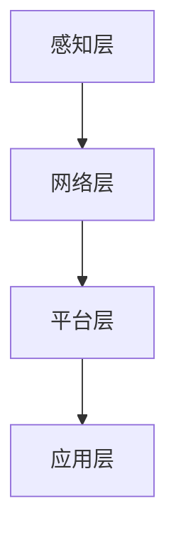

                 

### 1.1 IoT概述

#### IoT的定义、发展历程及未来趋势

物联网（Internet of Things，简称IoT）是指通过互联网将各种设备连接起来，实现设备与设备之间、设备与用户之间以及设备与服务之间的信息交换和通信。IoT的概念最早可以追溯到20世纪80年代，但直到21世纪初，随着传感器技术、无线通信技术和云计算技术的迅速发展，IoT才真正开始兴起。

#### IoT的关键技术

1. **传感器技术**：传感器是IoT的核心组成部分，它们能够检测和测量物理环境中的各种参数，如温度、湿度、光线、压力等，并将这些参数转换为电信号。

2. **无线通信技术**：无线通信技术是实现设备互联的关键技术。常见的无线通信技术包括Wi-Fi、蓝牙、ZigBee、LoRa等。

3. **边缘计算**：边缘计算是指将计算任务从云端转移到网络边缘，即靠近数据源的地方进行处理。这有助于减少延迟，提高系统的响应速度。

4. **云计算**：云计算提供了大规模的数据存储和处理能力，是IoT系统的重要支撑。

#### IoT架构

IoT的架构通常包括以下层次：

1. **感知层**：由各种传感器组成，负责数据采集。
2. **网络层**：由传输网络组成，负责数据的传输和通信。
3. **平台层**：由数据处理平台组成，负责数据的处理、存储和分析。
4. **应用层**：由各种应用系统组成，提供具体的应用场景。

#### IoT的应用场景

IoT的应用场景非常广泛，包括但不限于以下领域：

1. **智能家居**：通过IoT技术，可以实现家电设备之间的智能联动，提高生活的便捷性和舒适度。
2. **智能城市**：利用IoT技术，可以实现城市管理的智能化，提高城市的运行效率。
3. **工业互联网**：通过IoT技术，可以实现设备的远程监控和智能维护，提高生产效率。
4. **健康医疗**：利用IoT技术，可以实现对病人的远程监控，提高医疗服务质量。

### 1.2 IoT架构与通信协议

#### IoT架构的层次结构

IoT的架构通常包括感知层、网络层、平台层和应用层。以下是每个层次的简要描述：

1. **感知层**：由各种传感器组成，负责数据采集。
2. **网络层**：由传输网络组成，负责数据的传输和通信。网络层可以分为有线网络和无线网络两种。
3. **平台层**：由数据处理平台组成，负责数据的处理、存储和分析。
4. **应用层**：由各种应用系统组成，提供具体的应用场景。

#### IoT常用的通信协议

1. **ZigBee**：ZigBee是一种短距离、低功耗的无线通信协议，适用于智能家居、智能照明等应用。
2. **Wi-Fi**：Wi-Fi是一种广泛使用的无线局域网协议，适用于需要高速数据传输的物联网应用。
3. **LoRa**：LoRa是一种长距离、低功耗的无线通信协议，适用于远程监控、环境监测等应用。

## Mermaid流程图

以下是一个简单的Mermaid流程图，展示IoT架构的层次结构：

### <此处插入Mermaid流程图代码>

---

在下一节中，我们将介绍大型语言模型（LLM）的基本概念及其在IoT中的应用。

