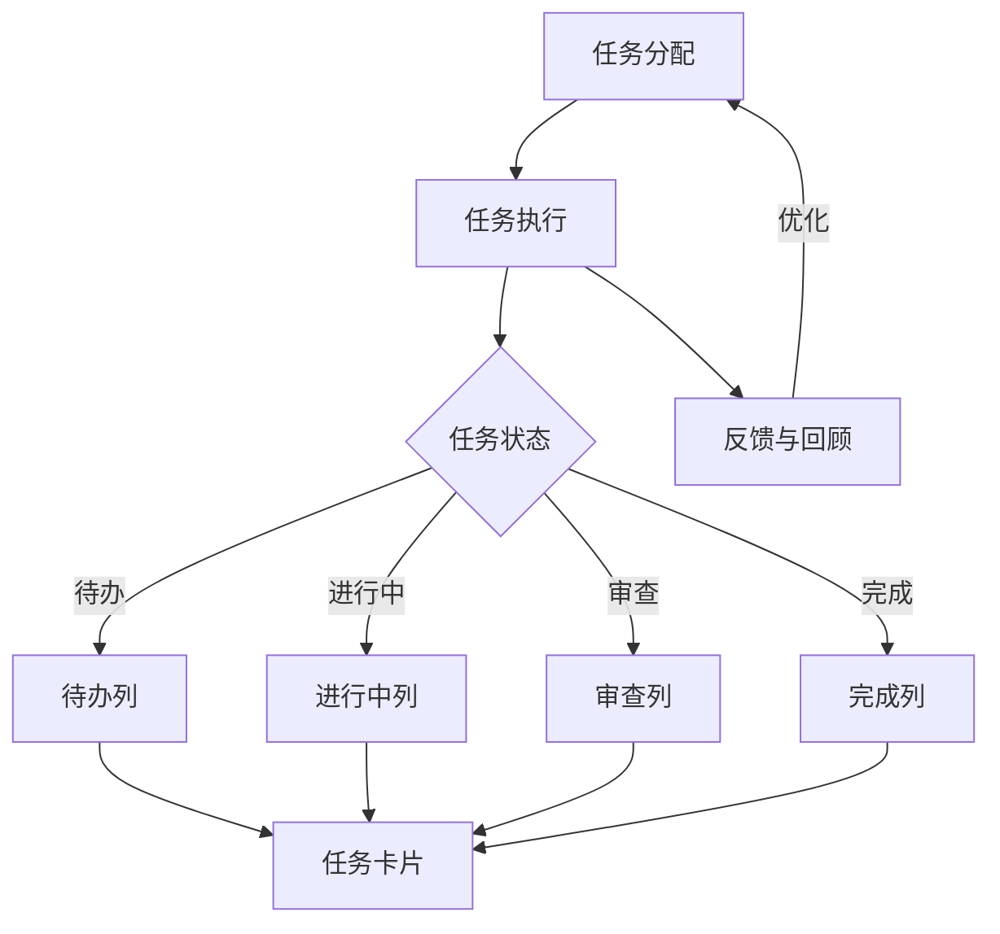
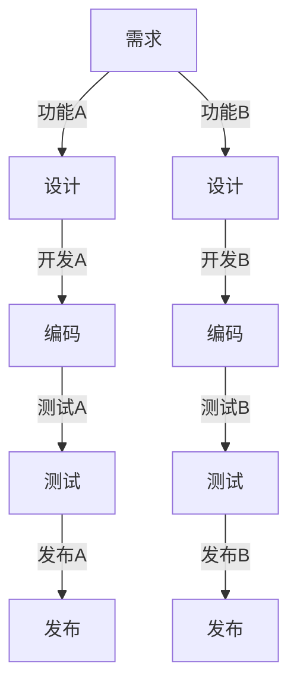

                 

### 关键词

- Kanban Method
- LLM Development Workflow
- Optimization
- Visual Management
- Work in Process (WIP) Limit
- Pull System
- Kanban Metrics
- Communication and Collaboration
- Project Management
- Organizational Culture

### 摘要

本文旨在深入探讨Kanban方法在优化大型语言模型（LLM）开发流程中的应用。Kanban方法是一种基于可视化管理的敏捷开发框架，通过限制工作在过程中的数量、采用拉动系统以及定期回顾，帮助企业更高效地管理开发任务。本文首先介绍了Kanban方法的起源和核心原则，然后详细阐述了其在LLM开发中的优势与挑战。接下来，文章通过具体的概念解析和实施步骤，展示了如何将Kanban方法应用于LLM开发工作流程的各个环节。最后，通过实际案例分析和最佳实践，总结了Kanban方法在提升开发效率、增强团队协作和优化项目管理方面的作用。通过本文的阅读，读者将能够理解并掌握Kanban方法在LLM开发中的实际应用价值。

## 1.1.1 Overview of Kanban Method

Kanban Method是一种源自日本精益生产（Lean Production）理论的敏捷开发框架，最初由丰田汽车公司的工程师在20世纪50年代开发。精益生产理论的核心思想是通过消除浪费和最大化价值流动来优化生产流程。这一理念在软件开发领域得到了广泛应用，尤其是在应对复杂和不断变化的项目需求时。

Kanban方法的关键在于其可视化管理和基于需求的拉动系统。通过使用看板（Kanban Board），团队成员可以将任务状态可视化为不同列和泳道，从而直观地了解项目的进展情况。看板上的每个卡片代表了一项具体的工作任务，其状态会随着任务的进行而移动。

Kanban方法的核心理念包括：

1. **可视性（Visibility）**：通过可视化任务状态和流程，提高团队对项目进展的认识和透明度。
2. **工作在过程限制（Work in Process Limit, WIP）**：限制正在处理中的任务数量，以减少工作堆积和过度工作，提高工作效率。
3. **拉动系统（Pull System）**：根据需求来启动新任务，而不是一次性分配大量任务，从而减少工作量。
4. **持续改进（Continuous Improvement）**：通过定期回顾和反馈，不断优化工作流程。

这些理念使得Kanban方法特别适用于需要快速迭代和高度灵活的软件开发项目，如大型语言模型（LLM）的开发。LLM项目通常涉及大量数据和复杂算法，需求变化频繁，因此需要高效的流程管理和团队协作。

总之，Kanban方法通过其独特的可视化、限制工作和拉动系统，为开发团队提供了一种灵活且高效的流程管理工具，使其能够更好地应对复杂多变的项目需求，从而提升开发效率和质量。

## 1.1.2 Origins and Evolution of Kanban

Kanban方法起源于日本丰田汽车公司，由丰田公司的工程师在20世纪50年代开发。其创始人是一位名叫Taiichi Ohno的工程师，他在精益生产理论的基础上，通过观察和分析丰田生产系统的运作，提出了一系列以减少浪费、提高效率为核心的管理原则。Ohno认为，通过确保每一步都在适当的时机进行，可以避免过量生产和等待时间，从而优化整个生产流程。

Kanban一词本身源自日本词汇“看板”，意为“卡片”或“信号板”。在丰田生产系统中，Kanban卡片被用作一种传递工作指令的信号。当生产线上的一个工作站完成其任务后，它会将Kanban卡片放在下一个工作站，通知该工作站可以开始新的工作。这种方法确保了每个工作站都有足够的工作量，同时避免了工作过度堆积和资源浪费。

随着时间的推移，Kanban方法逐渐从制造业扩展到服务业和其他行业。20世纪80年代，Kanban开始被引入到软件开发领域。当时，软件项目经理David Anderson在研究如何将精益生产理念应用于软件开发时，首次提出了“Kanban Method”。Anderson在其著作《Kanban: Successful Evolutionary Change for Your Technology Business》（2007年）中详细阐述了Kanban在软件开发中的应用。

Kanban在软件开发中的发展可以分为几个重要阶段：

1. **早期阶段（2000年代初）**：在这一阶段，Kanban主要被视为一种简单的任务跟踪工具，用于管理软件开发中的需求和任务。

2. **成熟阶段（2007-2013年）**：随着David Anderson的《Kanban》一书的出版，Kanban方法在软件开发社区中逐渐得到认可和普及。越来越多的人开始了解并采用Kanban，尤其是在需要快速迭代和高度灵活性的项目中。

3. **扩展阶段（2013年至今）**：Kanban方法的应用范围进一步扩大，不仅限于软件开发，还被广泛应用于产品管理、项目管理、运营管理等多个领域。此外，Kanban工具和技术也在不断进化，如引入看板电子化、集成自动化流程等。

在LLM开发领域，Kanban方法的应用尤为显著。LLM项目通常涉及大规模数据处理和复杂算法设计，需求变化频繁且复杂。Kanban的可视化管理、工作在过程限制和拉动系统等特点，使其成为管理LLM开发项目的理想工具。通过Kanban，开发团队能够更清晰地了解项目的进展情况，灵活应对需求变化，并持续优化工作流程，从而提高开发效率和项目成功率。

总的来说，Kanban方法从其制造业的起源，逐步演变并扩展到多个行业和领域，特别是在软件开发中的应用取得了显著的成功。通过不断演进，Kanban方法已经发展成为现代敏捷开发的重要工具之一，为团队提供了高效、灵活和透明的项目管理工作流程。

### 1.1.3 Key Principles of Kanban

Kanban方法之所以在软件开发和其他领域取得了成功，关键在于其背后的核心原则。这些原则旨在通过优化工作流程和提高效率，实现更高质量的项目交付。以下是Kanban方法的主要原则及其具体应用：

1. **可视性（Visibility）**：
   - **概念与联系**：可视性是Kanban方法的基础，通过将工作流程和工作任务可视化，使团队能够清晰地看到项目的进展、瓶颈和潜在问题。
   - **应用实例**：在LLM开发项目中，团队能够通过Kanban看板实时跟踪每个任务的进展状态。从“待办”（To Do）到“进行中”（In Progress）、“审查”（Review）和“完成”（Done），每个状态的卡片都清晰地展示在板上，使团队成员和项目经理能够随时了解项目的当前状态。

2. **工作在过程限制（Work in Process Limit, WIP）**：
   - **概念与联系**：WIP限制旨在通过限制同时进行中的任务数量，减少任务堆积和过度工作，提高工作质量和效率。
   - **应用实例**：在LLM开发中，WIP限制可以帮助团队避免过度负荷，确保每个团队成员都有足够的时间和精力专注于当前任务。例如，如果开发某个算法模块的WIP限制是3个任务，那么在任一时点，最多只能有3个相关任务处于进行中状态。

3. **拉动系统（Pull System）**：
   - **概念与联系**：拉动系统与传统的推动系统相对，它基于需求来启动新任务，而不是一次性分配大量任务。这种做法可以减少工作量和等待时间，提高工作效率。
   - **应用实例**：在LLM开发中，当某个任务完成并通过审查后，团队会根据当前需求和工作量，选择下一个任务开始工作。这种基于需求的任务选择机制，有助于确保团队始终专注于最重要的任务，并减少资源浪费。

4. **持续改进（Continuous Improvement）**：
   - **概念与联系**：持续改进是Kanban方法的一个核心理念，它强调通过定期回顾和反馈，不断优化工作流程和团队协作。
   - **应用实例**：在LLM开发项目中，团队定期举行回顾会议，讨论项目的进展情况、遇到的问题以及改进措施。通过这些回顾，团队能够发现并解决流程中的瓶颈和问题，从而提高整体开发效率。

5. **最小化变动（Minimize Workforce Variability）**：
   - **概念与联系**：这一原则强调通过最小化团队成员的工作负荷变化，提高团队稳定性和工作效率。
   - **应用实例**：在LLM开发中，通过合理的任务分配和工作量管理，确保团队成员的工作负荷保持稳定，从而避免因工作压力过大导致的效率下降和质量问题。

6. **标准化工作流程（Standard Work）**：
   - **概念与联系**：标准化工作流程意味着将最佳实践和标准操作程序文档化，确保每个团队成员都按照统一的方法执行任务。
   - **应用实例**：在LLM开发中，通过制定标准化的工作流程，团队可以确保每个开发阶段都有明确的步骤和标准，从而提高工作效率和任务交付的一致性。

通过以上关键原则的应用，Kanban方法为LLM开发团队提供了一种高效、灵活和透明的项目管理工具。这些原则不仅帮助团队更好地管理任务和资源，还促进了团队协作和持续改进，从而提高了开发效率和质量。下面将通过一个具体的Mermaid流程图，展示Kanban方法中这些核心概念之间的关系和实际应用。



在这个流程图中，任务从任务分配开始，进入待办列等待执行。任务执行后，根据任务状态移动到相应的列。同时，团队通过反馈与回顾，不断优化工作流程，确保任务得以高效、有序地完成。通过这种可视化和流程化的管理方式，Kanban方法在LLM开发中发挥了重要作用。

### 1.1.4 Importance of Kanban in LLM Development

Kanban方法在大型语言模型（LLM）开发中的重要性不可忽视。首先，LLM项目通常涉及海量的数据预处理、复杂算法设计和多次迭代优化，这使得项目开发过程具有高度复杂性和不确定性。在这种背景下，Kanban方法通过其可视化管理、工作在过程限制和拉动系统等核心原则，为团队提供了一种高效、透明和灵活的流程管理工具。

**提升开发效率**：Kanban方法通过可视化管理，使得团队成员能够实时了解项目进展和任务状态，从而及时识别和解决瓶颈。工作在过程限制（WIP）原则确保了团队在任一时点不会承担过多的任务，从而避免了因过度工作而导致的效率低下。此外，拉动系统使得团队可以根据实际需求来安排新任务，避免了资源的浪费，从而提高了整体开发效率。

**增强团队协作**：Kanban方法通过明确的任务状态和流程，促进了团队成员之间的沟通和协作。团队成员可以看到任务的进展情况，以及每个任务的状态和责任人，这有助于减少信息不对称和误解。定期的回顾和反馈会议则提供了交流和学习的机会，使团队能够共同探讨和解决项目中的问题，从而增强团队协作和凝聚力。

**灵活应对需求变化**：在LLM开发过程中，需求往往会出现频繁变化。Kanban方法通过其灵活的流程管理和基于需求的任务选择机制，使团队能够快速适应这些变化。团队成员可以根据当前需求和工作量，选择优先级最高的任务进行开发，从而确保项目能够持续前进，并在变化中保持稳定性。

**提高项目质量**：Kanban方法强调持续改进和标准化工作流程，这有助于团队在开发过程中遵循最佳实践和标准操作程序。通过定期的回顾和反馈，团队能够及时发现和解决潜在问题，从而提高项目质量。此外，通过限制工作在过程中的任务数量，团队能够更加专注和细致地完成每个任务，减少了因任务过多而导致的疏漏和错误。

**减少开发周期**：通过Kanban方法，团队能够更好地管理任务和资源，从而缩短项目的开发周期。工作在过程限制和拉动系统原则确保了团队始终专注于最重要的任务，避免了资源的浪费。此外，定期的回顾和反馈会议有助于快速识别和解决项目中的问题，从而减少开发周期。

**具体案例分析**：以某大型互联网公司的一个LLM项目为例，该公司采用了Kanban方法来管理其自然语言处理（NLP）模型的开发。在采用Kanban方法之前，该团队经常面临任务积压、进度延误和质量问题。通过引入Kanban看板、实施工作在过程限制和定期回顾，该团队显著提高了开发效率，项目周期从原来的12个月缩短到了8个月。此外，项目的质量也得到了显著提升，用户反馈和内部评估均显示项目质量得到了改善。

总之，Kanban方法通过其独特的管理原则和工具，为LLM开发团队提供了一种高效、灵活和透明的流程管理方法。它不仅提高了开发效率和质量，还增强了团队协作和项目管理能力，使团队能够更好地应对复杂多变的项目需求。

### 1.2 Comparison with Other Development Methodologies

在软件开发领域，Kanban方法与其他主流开发方法论如Waterfall、Agile和Scrum有着显著的区别和联系。这些方法论各有其独特的优点和适用场景，理解它们之间的差异和联系对于选择合适的方法来优化LLM开发流程至关重要。

**Waterfall Method**

- **特点**：Waterfall方法是一种线性顺序的开发方法，其各个阶段（需求分析、设计、开发、测试、部署）依次进行，前一阶段完成后才能开始下一阶段。
- **优点**：结构清晰，适用于需求明确且稳定的项目。
- **缺点**：灵活性差，难以适应需求变化，项目周期长。
- **与Kanban的比较**：Waterfall方法缺乏灵活性，难以应对LLM开发中频繁的需求变化。Kanban方法通过其可视化和拉动系统，能够更好地适应变化，提高开发效率。

**Agile Methodology**

- **特点**：Agile方法强调迭代开发和持续交付，通常以两周或一个月为一个迭代周期（Sprint）。每个迭代周期结束后，团队会进行回顾和改进。
- **优点**：灵活性强，适应变化，持续交付有价值的软件。
- **缺点**：可能因为迭代周期较短而导致开发过程过于碎片化，难以实现大规模和复杂项目的有效管理。
- **与Kanban的比较**：Kanban方法与Agile方法在迭代和持续交付上有相似之处，但Kanban方法更加灵活，没有固定的迭代周期，适用于需求变化更为频繁的项目。

**Scrum Methodology**

- **特点**：Scrum是一种基于Agile的方法论，强调团队协作和迭代开发。每个迭代周期称为冲刺（Sprint），通常为30天。Scrum有明确的角色（产品负责人、Scrum Master、开发团队）和会议（每日站立会议、冲刺规划会议、回顾会议）。
- **优点**：有明确的流程和角色分工，团队协作效率高。
- **缺点**：较为严格的结构可能导致灵活性不足，特别是在应对大规模项目时。
- **与Kanban的比较**：Kanban方法在流程上更加灵活，没有固定的角色和会议安排，但同样强调持续交付和团队协作。Kanban的WIP限制和可视化工具能够提供更精细的任务管理。

**Kanban Method**

- **特点**：Kanban方法注重流程可视化和工作流优化，通过看板（Kanban Board）来管理任务。核心原则包括可视性、工作在过程限制和拉动系统。
- **优点**：灵活性强，能够适应不断变化的需求，可视化管理有助于实时监控项目进展。
- **缺点**：在严格的项目管理结构和角色分工上可能不如Scrum，需要团队成员具备较高的自我管理能力。

**总结与选择建议**

- **Waterfall方法**：适用于需求明确且稳定的项目，不适用于LLM开发，因为需求变化频繁。
- **Agile方法**：适用于需要快速迭代和适应变化的项目，但可能对于大规模和复杂项目过于碎片化。
- **Scrum方法**：适合需要明确流程和角色分工的中大型项目，但在灵活性和任务管理上不如Kanban。
- **Kanban方法**：最适合需要高度灵活性和快速响应需求的LLM开发项目，特别是在任务和需求变化频繁的场景下。

在选择开发方法论时，应综合考虑项目的具体需求、团队规模、资源情况和项目复杂度。Kanban方法以其灵活性和高效的任务管理工具，在LLM开发中表现出色，尤其适用于那些需要高度协作和快速适应需求变化的团队。通过合理选择和灵活应用这些方法论，团队可以更好地管理LLM开发流程，提高项目交付的成功率和质量。

### 1.3 Kanban for LLM Development

在大型语言模型（LLM）开发中，Kanban方法的应用不仅能够提升开发效率，还能够优化团队协作和项目管理。以下将详细讨论Kanban方法在LLM开发中的具体优势，并探讨在实施过程中可能遇到的一些挑战。

**优势**

1. **灵活应对需求变化**：LLM开发过程中，需求变化往往非常频繁。Kanban方法的拉动系统（Pull System）允许团队根据实际需求来选择和启动新任务，从而灵活应对需求变化。这种基于需求的任务管理方式有助于确保团队能够优先处理最重要和最紧急的任务，避免了任务堆积和资源浪费。

2. **可视化管理和任务追踪**：通过使用Kanban看板，团队成员可以直观地看到每个任务的状态和进展情况。这有助于提高团队的透明度和责任感，同时也能够及时发现和解决潜在的问题。在LLM开发中，复杂的任务和依赖关系常常需要清晰的管理和追踪，Kanban方法通过可视化管理工具提供了有效的解决方案。

3. **优化资源利用**：Kanban方法中的工作在过程限制（WIP）原则有助于团队避免过度工作，确保每个成员都有足够的时间和精力来专注于当前任务。在LLM开发中，数据预处理、模型训练和优化等任务通常需要大量计算资源和时间，通过限制同时进行中的任务数量，团队能够更有效地利用资源，提高整体效率。

4. **持续改进和反馈机制**：Kanban方法强调通过定期的回顾和反馈会议来不断优化工作流程。在LLM开发中，团队可以利用这些会议来讨论项目的进展、遇到的问题和改进措施。这种持续改进的文化有助于团队在面对复杂性和不确定性时保持灵活性和高效性。

**挑战**

1. **组织文化适应**：Kanban方法需要团队成员具备较高的自我管理能力和对变化的适应性。在一些传统的组织中，这种文化转变可能会遇到阻力。团队成员可能需要时间来适应新的工作方式和责任分配，因此，组织文化适应是实施Kanban方法的一个关键挑战。

2. **工具和资源需求**：Kanban方法的成功实施依赖于适当的工具和技术支持。虽然有许多Kanban工具可供选择，但选择合适的工具并确保其能够满足团队需求可能需要额外的资源和时间投入。特别是在大规模的LLM项目中，工具的集成和配置可能是一项复杂的任务。

3. **初始培训和教育**：团队成员需要接受Kanban方法的培训和教育，以充分理解其原理和实践。对于一些经验不足的团队成员来说，可能需要额外的培训和支持来掌握Kanban工具和流程。因此，初始的培训和教育是成功实施Kanban方法的重要保障。

**实际案例**

以某知名互联网公司的一个自然语言处理（NLP）项目为例，该公司采用Kanban方法来管理其LLM开发。在项目初期，团队面临着任务积压、进度延误和质量问题。通过引入Kanban看板、实施WIP限制和定期回顾，团队显著提高了任务管理效率，项目周期从原来的12个月缩短到了8个月。此外，项目的质量也得到了显著提升，用户反馈和内部评估均显示项目质量得到了改善。

总结来说，Kanban方法在LLM开发中的应用能够显著提升开发效率、优化团队协作和项目管理。然而，成功实施Kanban方法需要团队成员的积极参与和组织的文化适应。通过克服这些挑战，团队能够充分利用Kanban方法的优势，实现更高效和高质量的LLM开发。

### 2.1.1 What is a Kanban Board?

Kanban Board是Kanban方法的核心工具，它通过可视化方式帮助团队管理和跟踪项目任务。一个标准的Kanban Board通常包括以下几个基本组成部分：列（Columns）、泳道（Swimlanes）和卡片（Cards）。

**列（Columns）**：列是Kanban Board上最明显的元素，用于表示任务的不同状态。常见的列包括：

- **待办列（To Do）**：用于存放尚未开始的任务。
- **进行中列（In Progress）**：存放正在进行的任务。
- **审查列（Review）**：用于存放等待审查的任务。
- **完成列（Done）**：用于存放已经完成的任务。

**泳道（Swimlanes）**：泳道将Kanban Board垂直划分为不同的区域，用于区分不同的任务类别或团队。例如，一个泳道可以代表某个功能模块或团队成员。

**卡片（Cards）**：卡片代表具体的工作任务。每个卡片上通常包含以下信息：

- **任务名称**：简要描述任务的内容。
- **负责人**：任务的当前负责人。
- **开始和完成日期**：任务的预计开始和完成时间。
- **任务描述**：详细的任务描述，包括任务目标和相关要求。

**实际应用场景**：

1. **软件开发**：在软件开发项目中，Kanban Board可以用于管理需求、功能点、bug修复等任务。每个需求或bug可以对应一张卡片，并在卡片上记录详细的任务信息。

2. **产品管理**：产品经理可以使用Kanban Board来跟踪产品的开发进度，从概念验证、设计、开发到测试和发布，每个阶段都对应一个列。

3. **运营管理**：在运营管理中，Kanban Board可以用于跟踪日常任务、用户反馈和问题解决等。

通过这些组成部分，Kanban Board提供了清晰的视觉线索，帮助团队成员随时了解任务状态和项目进展，从而实现更高效的项目管理。

### 2.1.2 Columns and Swimlanes

在Kanban方法中，列（Columns）和泳道（Swimlanes）是两个关键组成部分，它们共同构成了Kanban Board的基本结构，并帮助团队清晰地管理和跟踪项目任务。以下是它们的具体定义及其在Kanban系统中的应用。

**列（Columns）**：

列是Kanban Board上水平划分的任务状态区域，每个列代表任务在开发流程中的不同阶段。常见的列包括：

- **待办列（To Do）**：用于存放尚未开始的任务。所有新的任务最初都会出现在待办列中，等待团队分配和启动。
- **进行中列（In Progress）**：存放正在进行的任务。任务从待办列移动到进行中列，表示任务已经开始处理。
- **审查列（Review）**：用于存放等待审查的任务。在这个阶段，任务可能会经过代码审查、设计评审或功能测试，确保达到质量标准。
- **完成列（Done）**：用于存放已经完成的任务。一旦任务完成并通过所有审查，它将被移至此列，表示任务已最终交付。

**泳道（Swimlanes）**：

泳道是Kanban Board上垂直划分的区域，用于区分不同的任务类别或团队。泳道的引入使得Kanban Board能够同时展示多个类别的任务，帮助团队成员专注于特定任务类别或团队职责。常见的应用场景包括：

- **功能模块泳道**：根据不同的功能模块（如前端开发、后端开发、测试）划分泳道，每个泳道对应一个任务类别，有助于团队集中精力完成特定功能。
- **团队成员泳道**：根据团队成员或团队角色（如项目经理、开发人员、测试人员）划分泳道，每个泳道对应一个责任区域，确保任务分配清晰明确。
- **优先级泳道**：根据任务的优先级划分泳道，高优先级任务在前面处理，确保重要任务优先完成。

**实际应用实例**：

1. **软件开发**：在软件开发项目中，可以将列设置为“需求”、“设计”、“编码”、“测试”和“发布”，而泳道可以设置为不同的功能模块或开发团队。每个团队负责自己的泳道，从需求列到发布列，清晰地展示任务进展。

2. **产品管理**：在产品管理中，可以将列设置为“概念验证”、“设计”、“开发”、“测试”和“上市”，而泳道可以按照产品功能或阶段划分。这种设置有助于跟踪每个产品的开发进度。

3. **客户服务**：在客户服务中，可以将列设置为“客户请求”、“处理中”、“解决方案”、“确认”和“完成”，而泳道可以设置为不同的服务类型或区域，确保每个请求都能得到有效处理。

通过合理的列和泳道设置，Kanban Board能够提供清晰的视觉线索，使团队成员能够快速了解任务的状态和职责分工，从而提高工作效率和团队协作。下面通过一个简单的Mermaid流程图，展示列和泳道在Kanban系统中的应用。



在这个流程图中，A表示待办列，B和C表示设计泳道，D和E表示编码泳道，F和G表示测试泳道，H和I表示发布泳道。每个任务从待办列开始，根据泳道的不同阶段逐步推进，最终到达发布列。通过这种结构，团队可以清晰地看到任务的状态和流程，从而实现高效的项目管理。

### 2.1.3 Visual Management in Kanban

可视化管理是Kanban方法的核心要素之一，通过直观的视觉工具，如Kanban Board，帮助团队清晰地了解项目进展、任务状态和团队协作。以下是Kanban中视觉管理的几个关键方面及其在优化工作流程中的作用：

**1. 任务状态可视化**：

通过Kanban Board，任务状态以列的形式直观展示。例如，任务从“待办列”（To Do）开始，经过“进行中列”（In Progress）、“审查列”（Review）最终到达“完成列”（Done）。这种直观的视觉表示使得团队成员和项目经理能够实时查看任务的状态，及时了解任务的进展情况，从而更好地协调工作和资源分配。

**2. 优先级和依赖关系可视化**：

在Kanban Board中，可以使用不同颜色的卡片来表示任务的优先级，高优先级的任务通常会放在较显眼的位置，以确保这些任务能够得到优先处理。此外，通过在卡片上标记依赖关系，团队可以清晰地看到任务之间的依赖关系，从而合理安排任务的执行顺序，避免因依赖关系处理不当而导致的工作停滞。

**3. 资源利用率可视化**：

Kanban Board可以帮助团队监控资源的使用情况。通过在卡片上显示任务的负责人和预计完成时间，团队能够一目了然地看到每个团队成员的工作负荷，及时发现资源过度使用或不足的情况。这样，团队能够根据实际情况进行合理的资源调配，提高工作效率。

**4. 工作流程瓶颈可视化**：

可视化管理有助于团队识别和解决工作流程中的瓶颈。通过观察Kanban Board上任务流动的情况，团队可以发现哪些列上的任务堆积较多，从而识别出工作流程中的瓶颈点。针对这些瓶颈点，团队能够采取相应的措施，如调整任务分配、优化流程等，以减少等待时间和提高整体工作效率。

**5. 持续改进可视化**：

Kanban Board不仅用于当前任务的管理，还可以记录历史数据。通过定期回顾和总结，团队可以从Kanban Board上分析任务完成情况、团队协作效率等指标，识别流程中的问题和改进点。这些数据和分析结果可以通过可视化图表展示出来，为团队提供持续改进的依据。

**示例**：

假设一个LLM开发项目团队使用Kanban Board来管理其项目，Kanban Board的布局如下：

```
----------------------
| 待办列（To Do）    |
----------------------
| 进行中列（In Progress）|
----------------------
| 审查列（Review）    |
----------------------
| 完成列（Done）     |
----------------------
```

**任务A**：任务A处于“进行中列”，由开发者张三负责，预计3天后完成。

**任务B**：任务B处于“审查列”，由测试人员李四负责，等待审查。

**任务C**：任务C处于“待办列”，由产品经理王五分配，预计明天开始。

通过这个Kanban Board，团队成员可以看到：

- 任务A正在进行，且剩余工作量不大，可能需要重点关注。
- 任务B等待审查，审查完成后将移至“完成列”。
- 任务C即将开始，需要安排相关人员负责。

这种可视化的任务管理方式不仅提高了团队的透明度和责任感，还帮助团队更好地协调工作，优化资源分配，从而提升项目开发效率。

总之，通过Kanban方法中的可视化工具，团队可以更直观、高效地管理任务和项目进展，发现并解决流程中的问题，实现持续改进和优化，从而在复杂的项目环境中保持高效和灵活。

### 2.2 Kanban Rules and Practices

Kanban方法之所以能够提高工作效率和团队协作，离不开其严格的规则和实践。以下将详细介绍Kanban方法中的核心规则，包括工作在过程限制（Work in Process Limit, WIP）、拉动系统（Pull System）和Kanban节奏（Kanban Cadence）。

#### 2.2.1 Work in Process (WIP) Limit

**概念**：工作在过程限制（WIP限制）是指在一个阶段或任务中，同时允许进行中的任务数量上限。这一限制的目的是避免任务过多导致的资源浪费、工作堆积和效率低下。

**作用**：WIP限制有助于团队专注于当前任务，减少任务切换和上下文切换的成本，从而提高工作效率。此外，WIP限制还可以确保团队在资源有限的情况下，能够更好地利用现有资源，提高任务完成率。

**实施方法**：

1. **确定WIP限制**：根据团队的具体情况，如人员数量、任务复杂度和资源分配，确定每个阶段或任务的WIP限制值。这个值通常是一个合理的数量，以确保团队不会过度工作，同时也能充分利用资源。

2. **监控WIP限制**：在Kanban Board上，通过标识符或颜色区分当前进行中的任务数量，以便团队成员和项目经理实时监控WIP限制。当任务数量接近或超过限制时，团队需要评估是否需要增加资源或调整任务优先级。

3. **调整WIP限制**：根据项目进展和反馈，定期评估和调整WIP限制。如果发现某些阶段或任务的WIP限制过于宽松或过于严格，需要根据实际情况进行调整。

**案例**：在一个LLM开发项目中，团队设定了每个开发人员的WIP限制为3个任务。当某个开发人员的任务数达到3个时，他们将暂停接受新的任务，直到当前任务完成或重新分配。这种做法确保了每个开发人员都有足够的时间和精力专注于当前任务，从而提高了整体开发效率。

#### 2.2.2 Pull System

**概念**：拉动系统是一种基于需求的任务分配机制，与传统的推动系统相对。在拉动系统中，任务不是一次性分配给团队，而是根据当前的需求和资源状况动态分配。

**作用**：拉动系统能够更好地适应需求变化，减少任务堆积和资源浪费。它鼓励团队根据实际情况来选择和启动新任务，从而确保资源被充分利用，避免过度工作和任务积压。

**实施方法**：

1. **确定需求**：团队需要明确当前的需求和优先级，这些需求可以来自于客户、产品经理或其他利益相关者。通过明确需求，团队可以更有针对性地进行任务分配。

2. **任务分配**：当有新的任务需求时，团队不是立即分配给所有成员，而是根据当前的任务状态、资源和优先级，选择最适合的成员来启动任务。

3. **监控任务进展**：通过Kanban Board监控任务的进展，确保任务在适当的时间内完成。如果某个任务在预定时间内无法完成，团队需要重新评估任务分配和资源利用。

**案例**：在一个LLM模型训练项目中，团队根据实际需求设定了每周的任务量。每周，团队根据Kanban Board上的任务进展情况，选择合适的成员来启动新的任务。这种方法确保了每个任务都能在合理时间内完成，同时避免了过度分配和资源浪费。

#### 2.2.3 Kanban Cadence

**概念**：Kanban节奏（Cadence）是指团队在执行任务和会议等方面的固定时间安排。Kanban节奏有助于团队保持一致的工作步调和节奏，提高工作效率和团队协作。

**作用**：Kanban节奏能够提供稳定的工作环境和预期，使团队成员能够更好地规划和管理时间。它还包括定期的回顾和反馈会议，帮助团队不断优化工作流程。

**实施方法**：

1. **设定固定时间**：团队需要设定固定的会议时间，如每日站立会议、每周回顾会议等。这些时间安排应尽可能固定，以便团队成员可以提前规划。

2. **执行会议**：在设定的时间举行会议，如每日站立会议用于快速交流和问题解决，每周回顾会议用于总结和改进。

3. **定期回顾**：通过定期回顾，团队可以总结经验和教训，识别和解决流程中的问题，从而不断提高工作效率。

**案例**：在一个LLM开发团队中，每周固定举行一次回顾会议，每次会议持续两个小时。在回顾会议中，团队成员讨论过去一周的工作进展、遇到的问题和改进措施。这种固定的时间安排和回顾机制，有助于团队保持持续改进和高效工作。

通过实施WIP限制、拉动系统和Kanban节奏，Kanban方法为团队提供了一种灵活且高效的流程管理工具。这些规则和实践不仅有助于团队更好地管理任务和资源，还促进了团队协作和持续改进，从而提高项目开发效率和质量。

### 2.3 Kanban Metrics and Metrics Management

在Kanban方法中，度量指标（Metrics）是评估流程绩效和指导改进的重要工具。通过定期收集和分析这些指标，团队可以深入了解项目进展、资源利用和工作效率，从而不断优化流程。以下是Kanban中几个关键指标及其计算方法：

#### 2.3.1 Lead Time

**定义**：Lead Time是指从任务启动到任务完成的整个过程所花费的时间。

**计算方法**：Lead Time = 任务完成时间 - 任务启动时间。

**应用场景**：Lead Time用于评估任务的整体处理时间，帮助团队了解任务处理效率和流程中的瓶颈。

#### 2.3.2 Cycle Time

**定义**：Cycle Time是指从任务开始执行到任务完成的时间。

**计算方法**：Cycle Time = 完成时间 - 开始时间。

**应用场景**：Cycle Time用于评估任务的实际执行时间，帮助团队了解任务处理效率和工作流程中的潜在问题。

#### 2.3.3 Throughput

**定义**：Throughput是指在一个特定时间段内完成的任务数量。

**计算方法**：Throughput = 完成的任务数量 / 时间段。

**应用场景**：Throughput用于评估团队的工作效率和产出能力，帮助团队了解资源利用情况。

#### 2.3.4 How to Calculate and Use These Metrics

**计算和使用的步骤**：

1. **数据收集**：定期收集任务的状态变化数据，如任务开始时间、任务完成时间和任务完成状态。

2. **计算指标**：使用上述定义和计算方法，计算Lead Time、Cycle Time和Throughput。

3. **分析指标**：分析计算出的指标，了解流程中的瓶颈、任务处理效率和资源利用率。

4. **制定改进措施**：根据分析结果，制定和实施改进措施，如调整WIP限制、优化流程和改进任务分配。

5. **持续监控**：持续监控这些指标，确保改进措施的有效性，并不断调整和优化工作流程。

**实际应用案例**：

在一个LLM开发项目中，团队使用Kanban看板来跟踪任务状态，并定期计算Lead Time、Cycle Time和Throughput。以下是一个简化的例子：

- **Lead Time**：一个任务从“进行中”状态完成，记录了任务完成时间和任务开始时间。通过计算，得到Lead Time。
- **Cycle Time**：记录任务从开始到完成的时间，计算得到Cycle Time。
- **Throughput**：每周统计完成的任务数量，计算得到Throughput。

通过这些指标，团队发现某些任务的Cycle Time较长，分析后发现这些任务通常涉及复杂的数据处理和算法优化。为了解决这一问题，团队决定增加计算资源并优化算法，从而显著缩短了后续任务的Cycle Time。

总之，Kanban指标提供了定量化的方法来评估和管理项目进展，通过合理的计算和分析，团队可以持续优化工作流程，提高开发效率和质量。

### 3.1.1 Assessing Readiness for Kanban Implementation

在将Kanban方法应用于LLM开发项目之前，对团队的准备情况进行全面评估至关重要。这不仅有助于确保团队能够有效实施Kanban，还能减少潜在的实施障碍。以下是一些关键的评估步骤和考虑因素：

**1. 团队文化和协作能力**：

- **文化适应性**：Kanban方法强调透明度和协作，因此，团队的文化是否支持这种工作方式是关键。如果团队文化较为保守，对变化和反馈持保留态度，可能需要先进行文化转型。
- **协作能力**：团队是否有良好的协作和沟通机制，能够开放地分享信息和解决问题。评估团队是否具备协作能力，可以通过观察团队的日常沟通和工作模式。

**2. 工作流程和任务管理**：

- **流程清晰度**：评估现有工作流程是否清晰、标准化，是否存在大量的手动操作和重复工作。Kanban方法要求工作流程高度可视化和自动化，因此，需要确保现有流程能够适应这种要求。
- **任务管理能力**：评估团队在任务分配、跟踪和管理方面的能力。如果团队经常出现任务积压、资源浪费和沟通不畅等问题，Kanban方法可能会提供有效的解决方案。

**3. 工具和技术支持**：

- **现有工具适应性**：评估团队当前使用的工具和技术是否支持Kanban方法。例如，是否能够轻松地创建和更新Kanban Board，以及是否具备集成自动化流程的能力。
- **技术支持**：确保团队有足够的技术支持，能够解决在实施Kanban过程中遇到的技术问题。如果团队缺乏相关技术背景，可能需要培训或引入外部专家。

**4. 成员意愿和技能**：

- **成员参与度**：评估团队成员对Kanban方法的接受程度和参与意愿。如果团队成员对新的工作方式持怀疑态度或缺乏参与热情，可能需要通过沟通和教育来提高他们的积极性。
- **技能水平**：评估团队成员的技能和知识水平，确保他们具备实施Kanban方法所需的基本技能。例如，需要熟悉Kanban Board的使用、理解关键指标的计算方法等。

**5. 项目特性和需求**：

- **项目规模和复杂性**：评估项目规模和复杂性是否适合采用Kanban方法。Kanban方法在中小型项目和复杂项目中表现尤为出色，但对于规模非常庞大的项目，可能需要更严格的规划和控制。
- **需求变动频率**：如果项目需求频繁变动，Kanban方法的灵活性将有助于团队快速适应变化。评估需求变动频率和幅度，确保Kanban方法能够满足项目需求。

**6. 领导层支持**：

- **领导层承诺**：Kanban方法的成功实施需要领导层的坚定支持和参与。评估领导层对Kanban方法的理解和支持程度，确保他们能够为团队提供必要的资源和指导。
- **变更管理**：领导层需要具备良好的变更管理能力，能够协调各部门的资源和利益，确保Kanban方法能够顺利实施。

通过上述评估步骤，团队能够全面了解自身在实施Kanban方法中的优势和不足，制定针对性的改进计划，从而提高Kanban方法的实施成功率。同时，这些评估也为后续的实施步骤提供了重要的参考，确保团队能够有效应用Kanban方法，提高LLM开发的效率和质量。

### 3.1.2 Organizational Culture and Kanban

Kanban方法的有效实施离不开组织文化的支持。组织文化是指企业或团队在长期运营过程中形成的价值观、行为准则和工作习惯。一个开放、协作和创新的组织文化对于Kanban方法的成功至关重要。以下是Kanban方法与组织文化之间的紧密联系及其对团队协作的促进作用：

**1. 开放性沟通**：Kanban方法强调透明度和可视化，这要求组织具备开放性沟通的文化。在这种文化中，团队成员能够自由地分享信息、讨论问题和提出建议。开放性沟通有助于减少信息不对称和误解，促进团队成员之间的协作和信任。通过定期的回顾和反馈会议，团队可以公开讨论项目进展、遇到的问题和改进措施，从而实现更高效的协作。

**2. 团队协作**：Kanban方法鼓励团队成员共同参与任务管理和决策过程。这种协作文化有助于打破部门壁垒，促进不同职能团队之间的合作。在Kanban方法中，每个团队成员都清楚自己的任务和职责，同时也要关注整个项目的进展和目标。通过协作，团队可以更好地利用各自的专长和资源，共同推动项目向前发展。

**3. 持续改进**：Kanban方法的核心原则之一是持续改进。这一原则要求组织具备持续学习和改进的文化。在这种文化中，团队成员不仅关注任务的完成情况，还注重从经验中学习，不断优化工作流程和提升效率。定期的回顾和反馈机制为团队提供了反思和改进的机会，使得组织能够持续适应变化，提高整体竞争力。

**4. 容忍失败**：在Kanban方法中，失败被视为学习和成长的机会。一个容忍失败的文化有助于团队成员在尝试新方法和解决复杂问题时敢于冒险。在这种文化中，失败不是惩罚，而是激励。通过从失败中吸取教训，团队可以更好地应对未来的挑战，提高创新能力和问题解决能力。

**5. 简化流程**：Kanban方法强调通过简化流程来提高效率。这要求组织具备简约文化的支持，即关注核心价值，去除不必要的复杂性和浪费。简化流程有助于团队更专注于关键任务，减少非生产性工作，从而提高工作效率和项目质量。

**实际案例**：

以某互联网公司为例，该公司在实施Kanban方法之前，组织文化相对保守，团队成员之间存在沟通障碍，工作效率较低。通过引入Kanban方法，公司逐步建立了开放性沟通、团队协作和持续改进的文化。具体措施包括：

- **建立可视化看板**：通过Kanban看板，团队成员可以实时了解项目进展和任务状态，减少了信息不对称和误解。
- **定期回顾会议**：团队每周举行回顾会议，讨论项目进展、遇到的问题和改进措施，提高了团队协作和问题解决能力。
- **鼓励试错**：公司鼓励团队成员在项目实施过程中敢于尝试新方法，从失败中学习，逐步优化工作流程。

通过这些措施，公司的项目交付效率显著提高，团队协作和创新能力也得到了增强。

总之，Kanban方法与组织文化密切相关。一个开放、协作和创新的文化为Kanban方法的实施提供了坚实的基础，有助于提高团队协作效率和项目质量。通过培养和优化组织文化，企业可以更好地应用Kanban方法，实现持续改进和业务增长。

### 3.1.3 Team Structure and Roles in Kanban

在Kanban方法中，明确的团队结构和角色分配是确保项目顺利进行和高效协作的关键。以下将介绍Kanban团队中常见的角色及其职责，以及如何根据Kanban原则调整团队结构。

**常见角色**：

1. **产品负责人（Product Owner）**：
   - **职责**：负责定义产品愿景和需求，确保团队能够按照正确的方向进行开发。产品负责人需要与客户和利益相关者保持密切沟通，了解他们的需求和期望。
   - **在Kanban中的调整**：在Kanban方法中，产品负责人通常不负责具体的任务分配和进度管理，而是更多地关注需求管理。他们可以参与定期的回顾和规划会议，确保需求的持续更新和优化。

2. **Scrum Master**：
   - **职责**：在Scrum方法论中，Scrum Master负责确保团队遵循敏捷开发原则，提供必要的培训和支持。他们帮助团队消除障碍，促进高效协作。
   - **在Kanban中的调整**：在Kanban方法中，Scrum Master的角色可能更偏向于团队教练和流程改进者。他们负责确保团队遵循Kanban原则，优化工作流程，并组织定期的回顾和反馈会议。

3. **开发团队成员**：
   - **职责**：开发团队成员负责实际的任务执行，如编码、测试和设计。每个成员都有明确的任务和责任。
   - **在Kanban中的调整**：在Kanban方法中，开发团队成员需要具备更高的自我管理能力和责任感。他们需要根据Kanban Board上的任务状态和优先级，自主安排和调整自己的工作。

**团队结构调整建议**：

1. **去除固定角色分工**：在Kanban方法中，强调团队成员的灵活性和适应性。团队可以采用跨职能团队结构，使得每个成员不仅擅长自己的领域，还能参与其他任务的执行。这种结构有助于提高团队的整体协作效率和问题解决能力。

2. **任务所有权**：在Kanban方法中，任务所有权是动态的。每个任务都有一个负责人，但在需要时，其他成员可以协助完成该任务。这种做法有助于提高任务完成速度，并减少依赖单一成员的风险。

3. **定期角色轮换**：定期进行角色轮换可以增强团队成员的多技能和适应性。例如，每个成员可以在一定时间内担任产品负责人的角色，以更好地理解需求和产品管理。

4. **自我管理**：在Kanban方法中，团队成员需要具备自我管理的能力。他们需要根据自己的任务状态和工作量，合理分配时间和资源，确保任务按时完成。

总之，Kanban方法对团队结构和角色分配提出了新的要求。通过去除固定角色分工、强调任务所有权和自我管理，团队可以更好地适应变化，提高协作效率和任务完成质量。

### 3.2.1 Creating a Kanban Board

创建Kanban Board是实施Kanban方法的第一步，一个有效的Kanban Board能够帮助团队清晰地管理和跟踪项目任务，提高协作效率和任务完成质量。以下将详细描述创建Kanban Board的步骤和注意事项：

**1. 确定任务类别和阶段**：

首先，团队需要明确项目的任务类别和开发阶段。例如，对于LLM开发项目，常见的任务类别包括需求分析、数据预处理、模型设计、编码实现、测试和部署。开发阶段则可以包括“需求”、“设计”、“开发”、“测试”和“发布”等。根据项目特点，团队可以进一步细化这些类别和阶段。

**2. 设计Kanban Board布局**：

Kanban Board的基本布局通常包括列（Columns）和泳道（Swimlanes）。列表示任务的不同状态，如“待办”（To Do）、“进行中”（In Progress）、“审查”（Review）和“完成”（Done）。泳道则用于区分不同的任务类别或团队成员。

以下是创建Kanban Board的步骤：

- **步骤1**：确定列。根据项目需求，为每个列命名，例如“待办”、“进行中”、“审查”和“完成”。
- **步骤2**：确定泳道。泳道可以根据任务类别、团队角色或项目阶段划分。例如，可以设置“需求”、“设计”、“编码”、“测试”和“发布”等泳道。
- **步骤3**：布局Kanban Board。使用一个平面布局工具（如白板、纸质看板或电子看板），将列和泳道按照上述命名和分类布局。

**3. 确定任务卡片内容**：

每个任务卡片（Card）需要包含以下关键信息：

- **任务名称**：简要描述任务的内容。
- **负责人**：任务当前负责人的姓名或标识。
- **开始和结束日期**：任务的预计开始和结束日期。
- **任务描述**：详细的任务描述，包括任务目标和相关要求。
- **优先级**：任务的优先级，可以使用颜色标签或其他标记来表示。
- **备注**：任务的备注信息，如任务的状态更新、问题记录等。

**4. 规定WIP限制**：

工作在过程限制（WIP）原则是Kanban方法的核心之一，有助于团队避免任务积压和过度工作。在创建Kanban Board时，需要为每个阶段和泳道设定合理的WIP限制。例如，对于一个有5名开发人员的团队，可以将每个“进行中”泳道的WIP限制设置为3个任务。

**5. 确定任务流动规则**：

明确任务在不同列和泳道之间的流动规则，以确保任务能够顺利推进。例如，任务可以从“待办”列移动到“进行中”列，然后经过“审查”列，最终到达“完成”列。团队需要制定具体的移动规则，如任务完成条件、审查标准和任务交接流程。

**6. 定期更新和优化**：

Kanban Board不是一次性的创建，而是一个动态的管理工具。团队需要定期更新Kanban Board，确保任务状态和优先级等信息的准确性。同时，根据项目进展和反馈，团队可以调整WIP限制、列和泳道的布局，以优化任务管理。

**注意事项**：

- **保持简洁**：Kanban Board应保持简洁，避免过多的信息冗余。每个卡片上的信息应简洁明了，易于理解。
- **可视化**：Kanban Board应具有高度的视觉吸引力，使团队成员能够快速了解项目进展。
- **易于更新**：选择易于更新的工具或方法，确保Kanban Board能够实时反映项目状态。
- **定期回顾**：定期回顾Kanban Board，讨论任务进展、遇到的问题和改进措施，以确保Kanban方法的持续有效性。

通过以上步骤，团队可以创建一个高效的Kanban Board，为项目提供清晰的任务管理和协作平台。一个设计合理的Kanban Board不仅有助于提高团队的工作效率和任务完成质量，还能促进团队协作和持续改进。

### 3.2.2 Defining Columns and Swimlanes

在Kanban方法中，列（Columns）和泳道（Swimlanes）是两个关键的布局元素，它们共同构成了Kanban Board的结构，并帮助团队有效地管理和跟踪任务。以下将详细介绍如何定义这些列和泳道，包括常见的设置和优化建议。

**列（Columns）**

列通常代表任务在不同阶段的状态，是Kanban Board上的水平划分。常见的列包括以下几种：

1. **待办列（To Do）**：用于存放尚未开始的任务。所有新的任务首先出现在待办列中，等待团队成员选择和分配。

2. **进行中列（In Progress）**：用于存放正在进行的任务。任务从待办列移动到进行中列，表示任务已经开始处理。

3. **审查列（Review）**：用于存放等待审查的任务。在这个阶段，任务可能会经过代码审查、设计评审或功能测试，确保达到质量标准。

4. **完成列（Done）**：用于存放已经完成的任务。一旦任务完成并通过所有审查，它将被移至此列，表示任务已最终交付。

**泳道（Swimlanes）**

泳道则是Kanban Board上的垂直划分，用于区分不同的任务类别或团队。常见的泳道设置包括：

1. **功能模块泳道**：根据不同的功能模块（如前端开发、后端开发、测试）划分泳道。每个泳道对应一个任务类别，有助于团队集中精力完成特定功能。

2. **团队成员泳道**：根据团队成员或团队角色（如项目经理、开发人员、测试人员）划分泳道。每个泳道对应一个责任区域，确保任务分配清晰明确。

3. **优先级泳道**：根据任务的优先级划分泳道，高优先级任务在前面处理，确保重要任务优先完成。

**常见设置**

在定义列和泳道时，团队需要考虑以下几个因素：

1. **项目需求**：根据项目的需求，确定任务的不同状态和类别，以设置合适的列和泳道。

2. **团队规模和职责**：考虑团队规模和职责分工，为每个成员或角色分配相应的泳道。

3. **任务类型**：根据任务类型和优先级，设置优先级泳道，确保重要任务优先处理。

4. **可视化**：保持Kanban Board的可视化和易读性，避免过多的列和泳道导致信息冗余。

**优化建议**

1. **动态调整**：根据项目进展和团队反馈，定期调整列和泳道的设置。例如，如果某个阶段的工作量增加，可以增加相应的列。

2. **明确责任**：确保每个泳道都有明确的负责人或责任团队，避免责任不清导致的工作延误。

3. **定期回顾**：定期回顾Kanban Board的设置和任务流动情况，根据实际情况进行优化和调整。

4. **反馈机制**：建立反馈机制，鼓励团队成员提出改进建议，并根据这些建议优化列和泳道的设置。

**示例**

假设一个LLM开发项目团队，他们定义了以下列和泳道：

- **列**：
  - 待办列（To Do）
  - 进行中列（In Progress）
  - 审查列（Review）
  - 完成

列（Done）

- **泳道**：
  - 前端开发泳道
  - 后端开发泳道
  - 测试泳道
  - 数据处理泳道

在这个示例中，团队根据项目需求设置了四个列，分别代表任务的不同状态，而泳道则根据团队职责和任务类型划分，确保任务管理清晰明确。

通过合理的列和泳道设置，Kanban Board能够提供清晰的视觉线索，帮助团队成员随时了解任务状态和进展，从而实现高效的任务管理和团队协作。

### 3.2.3 Prioritizing Tasks

在Kanban方法中，任务优先级的管理至关重要。通过合理的任务优先级设置，团队可以确保在有限的时间和资源下，优先处理最重要和最紧急的任务。以下将详细讨论任务优先级的管理策略和方法。

**1. 优先级分类**

常见的任务优先级分类方法包括“高”、“中”和“低”三个等级。这种分类方法简单直观，适用于大多数项目。在某些情况下，还可以增加“紧急”这一分类，以区分需要立即处理的高优先级任务。

- **高优先级（High Priority）**：这些任务通常对项目的成功和客户满意度有重大影响，或者有严格的时间限制。例如，关键功能模块的实现、重要的客户需求或即将到来的重要发布会。
- **中优先级（Medium Priority）**：这些任务对于项目的进展有一定影响，但没有高优先级任务那么紧迫。例如，非关键功能模块的实现、非紧急的客户需求或项目的中期里程碑。
- **低优先级（Low Priority）**：这些任务通常对项目的影响较小，可以在其他任务完成后处理。例如，辅助功能模块的实现、不太重要的客户需求或项目的长期目标。

**2. 优先级设置策略**

以下是一些常用的任务优先级设置策略：

- **需求驱动的优先级**：根据客户需求和业务目标来确定任务优先级。高优先级任务通常是那些能够直接满足客户需求和提升业务价值的功能。
- **风险优先级**：根据任务的风险程度来确定优先级。高优先级任务通常是那些风险高、影响大的任务，例如涉及安全问题的功能或技术挑战。
- **时间敏感度**：根据任务的完成时间来设置优先级。时间敏感的任务，如即将发布的功能和即将到期的合同，通常会被分配更高的优先级。
- **资源可用性**：根据团队资源和任务依赖关系来设置优先级。如果某些任务需要特定的资源和技能，而这些资源有限，那么这些任务可能会被设置为高优先级。

**3. 优先级管理方法**

以下是一些有效的优先级管理方法：

- **每日任务清单**：每天开始工作前，团队可以列出当天的任务清单，并按照优先级对任务进行排序。高优先级任务应首先完成，以确保关键任务的及时处理。
- **看板上的优先级指示**：在Kanban看板上，可以使用不同颜色或标签来标识任务的优先级。这有助于团队成员快速识别高优先级任务，并优先处理。
- **滚动优先级**：随着项目的进展，任务优先级可能会发生变化。团队需要定期回顾和调整任务优先级，确保任务能够及时、准确地反映项目需求。
- **反馈循环**：通过定期的回顾和反馈，团队可以了解任务优先级设置的合理性和有效性。根据反馈，团队可以进一步优化优先级管理策略。

**示例**

假设一个LLM开发项目团队正在开发一个语音识别系统，以下是一些任务的优先级设置：

- **高优先级任务**：
  - 实现关键语音识别算法
  - 确保系统在关键场景下的准确性
  - 准备即将到来的产品发布会演示
- **中优先级任务**：
  - 优化系统性能
  - 支持不同语言和方言的识别
  - 设计用户界面和操作流程
- **低优先级任务**：
  - 添加额外的语音识别功能
  - 支持特殊硬件平台的适配
  - 完善文档和用户手册

通过合理的任务优先级设置和管理，团队可以确保在有限的时间和资源下，优先处理最重要的任务，从而提高项目交付的成功率和质量。

### 3.3.1 Managing LLM Development Tasks

在Kanban方法中，任务管理是确保项目顺利进行和高效交付的关键环节。针对大型语言模型（LLM）开发项目，有效的任务管理不仅能够提高开发效率，还能确保项目质量和按时交付。以下是Kanban方法在任务管理中的应用和实践。

**1. 任务分解**

首先，将大型任务分解为较小的子任务。对于LLM开发项目，通常可以按功能模块、算法部分或数据处理阶段来分解任务。例如：

- **功能模块**：语音识别、自然语言处理、文本生成等。
- **算法部分**：特征提取、模型训练、模型优化等。
- **数据处理**：数据收集、数据预处理、数据清洗等。

通过任务分解，可以更清晰地了解每个任务的具体内容和完成标准，有助于后续的任务分配和进度跟踪。

**2. 任务分配**

在任务分配过程中，团队可以根据任务的特点和成员的专长进行合理的分配。以下是几个关键步骤：

- **评估任务需求**：了解每个任务的技能要求、时间需求和依赖关系。
- **确定团队成员**：根据团队成员的能力和兴趣，选择最适合的任务负责人。
- **明确任务责任**：确保每个任务都有明确的负责人，负责人需要承担任务完成的责任。
- **沟通与确认**：与任务负责人沟通任务的具体要求和时间安排，确保他们理解任务目标和预期结果。

**3. 任务跟踪**

使用Kanban Board跟踪任务状态是Kanban方法的重要特点。以下是几个关键步骤：

- **任务卡片**：每个任务都对应一张卡片，卡片上包含任务名称、负责人、开始和结束日期等信息。
- **任务状态更新**：任务负责人需要定期更新任务状态，从“待办”到“进行中”、“审查”和“完成”。
- **任务进度监控**：通过Kanban Board上的任务流动，团队成员和项目经理可以实时了解任务进度和项目整体进展。
- **问题识别与解决**：如果发现任务出现延误或遇到问题，及时识别并采取措施解决，确保项目顺利进行。

**4. 任务依赖管理**

在LLM开发项目中，任务之间通常存在复杂的依赖关系。有效的依赖管理能够确保任务按计划顺序执行，避免工作冲突和资源浪费。以下是几个关键步骤：

- **识别依赖关系**：明确任务之间的依赖关系，例如某些任务需要其他任务的结果或资源。
- **安排任务顺序**：根据依赖关系，合理安排任务的执行顺序，确保前置任务完成后才能开始后续任务。
- **监控依赖进度**：定期检查依赖任务的进展，确保依赖关系得到满足。
- **调整任务计划**：根据实际情况，灵活调整任务计划，以应对依赖关系中的变化。

**5. 任务反馈与改进**

Kanban方法强调持续改进，通过定期的回顾和反馈，团队可以不断优化任务管理流程。以下是几个关键步骤：

- **定期回顾**：每周或每月举行回顾会议，讨论任务管理中的问题和改进机会。
- **收集反馈**：鼓励团队成员提出改进建议，包括流程优化、工具改进和团队协作等方面。
- **实施改进措施**：根据反馈，制定和实施改进措施，以提高任务管理的效率和效果。
- **监控效果**：评估改进措施的效果，确保问题得到有效解决。

通过以上任务管理实践，Kanban方法能够帮助团队更高效地管理LLM开发任务，确保项目按时、高质量地完成。在任务分解、分配、跟踪、依赖管理和反馈改进等环节中，Kanban方法提供了系统性的方法和工具，使得任务管理更加透明、灵活和高效。

### 3.3.2 Handling Dependencies and Risks

在Kanban方法中，处理任务依赖和风险是确保项目顺利进行和按时交付的关键环节。LLM开发项目通常涉及复杂的任务依赖和高风险因素，因此，有效的依赖管理和风险管理至关重要。以下将详细讨论如何在Kanban方法中处理这些依赖和风险。

**1. 识别任务依赖**

任务依赖是指在项目执行过程中，某些任务需要依赖其他任务的完成才能开始或继续。以下是几个识别任务依赖的方法：

- **分析任务关系**：通过项目计划书、任务分解结构（WBS）和流程图，分析每个任务之间的关系，识别哪些任务需要其他任务的输出作为输入。
- **访谈和讨论**：与团队成员讨论任务流程，了解每个任务的具体内容和所需资源，识别潜在的依赖关系。
- **使用工具**：利用项目管理软件和Kanban工具，可视化任务依赖关系，便于团队跟踪和管理。

**2. 管理任务依赖**

一旦识别出任务依赖，团队需要采取以下措施来管理这些依赖：

- **明确依赖关系**：在Kanban Board上明确标记任务依赖关系，例如使用箭头或注释来表示任务的先后顺序。
- **顺序安排**：根据任务依赖关系，合理安排任务顺序，确保前置任务完成后才能开始后续任务。
- **监控进度**：定期检查依赖任务的进展情况，确保依赖关系得到满足，及时解决依赖冲突。

**3. 识别和评估风险**

在Kanban方法中，识别和评估项目风险是确保项目顺利进行的重要步骤。以下是几个识别和评估风险的方法：

- **历史数据**：分析过去类似项目的历史数据，识别常见风险和潜在的威胁。
- **专家评估**：邀请项目经验丰富的专家对项目进行风险评估，提供专业的意见和建议。
- **风险矩阵**：使用风险矩阵（Risk Matrix）对潜在风险进行定量评估，确定风险的严重程度和概率。

**4. 风险管理策略**

以下是一些有效的风险管理策略：

- **风险规避**：通过调整项目计划、增加资源或改变任务顺序，避免潜在的风险。
- **风险减轻**：采取预防措施，减少风险发生的概率或降低风险影响。例如，通过提前测试和验证，减少技术风险。
- **风险转移**：将风险转移到第三方，如购买保险或与供应商签订合同。
- **风险接受**：对于一些无法规避或减轻的风险，团队需要准备相应的应对策略，确保在风险发生时能够快速应对。

**5. 定期回顾和改进**

Kanban方法强调持续改进，通过定期的回顾和反馈，团队可以不断优化依赖管理和风险管理：

- **定期回顾**：每周或每月举行回顾会议，讨论任务依赖和风险管理的有效性，识别新的问题和改进机会。
- **记录和共享**：将依赖管理和风险管理过程中的经验教训记录下来，并与团队成员共享，以提高整体项目管理的成熟度。
- **持续优化**：根据回顾和反馈，不断优化依赖管理和风险管理策略，确保项目能够持续、高效地推进。

通过以上方法，Kanban方法为团队提供了一种系统化的依赖管理和风险管理框架，帮助团队更好地应对复杂的项目环境，确保项目按时、高质量地交付。

### 3.3.3 Adapting Kanban to the Project's Needs

在将Kanban方法应用于具体项目时，需要根据项目的特点和需求对其进行适当的调整，以确保Kanban能够最大程度地发挥作用。以下是一些常见的调整策略和方法：

**1. 灵活调整Kanban Board布局**

不同的项目可能需要不同的任务类别和阶段。团队可以根据项目需求灵活调整Kanban Board的布局，增加或删除列和泳道。例如，对于LLM开发项目，团队可以根据具体功能模块（如语音识别、自然语言处理、文本生成等）来设置泳道，以便更好地管理和跟踪任务。

**2. 确定合理的WIP限制**

WIP限制是Kanban方法的核心原则之一，但具体的WIP限制值需要根据项目规模和团队资源来设定。对于大型LLM项目，团队可以通过以下步骤确定合理的WIP限制：

- **评估团队资源**：根据团队成员的数量和技能，确定每个团队成员的最大工作负载。
- **分析历史数据**：根据项目历史数据和团队实际工作情况，确定不同阶段的WIP限制值。
- **定期调整**：根据项目进展和反馈，定期评估和调整WIP限制，以确保其适应性。

**3. 针对性引入额外规则**

在某些项目中，可能需要引入额外的规则来确保任务的有效管理。例如：

- **任务优先级规则**：对于某些关键任务，可以设置更高的优先级，以确保这些任务得到优先处理。
- **任务反馈规则**：在任务完成后，要求任务负责人提供详细的反馈，包括任务完成情况、遇到的问题和改进建议，以便团队持续优化流程。

**4. 融合其他方法论**

Kanban方法可以与其他方法论（如Scrum、敏捷等）结合使用，以更好地满足项目需求。例如：

- **引入迭代周期**：对于需要固定迭代周期的项目，团队可以在Kanban方法的基础上引入迭代周期管理，确保每个迭代周期都有明确的目标和交付物。
- **使用故事地图**：在项目初期，团队可以使用故事地图来规划和可视化整个项目，确保任务分配和进度管理更加有序。

**5. 定期回顾和改进**

定期回顾和反馈是Kanban方法持续改进的关键。团队应定期举行回顾会议，讨论项目进展、遇到的问题和改进机会。以下是一些回顾和改进的实践：

- **数据驱动改进**：通过收集和分析Kanban指标（如Lead Time、Cycle Time和Throughput），识别流程中的瓶颈和改进点。
- **团队成员参与**：鼓励团队成员参与回顾和改进过程，确保他们能够提出具体的改进建议。
- **持续调整**：根据回顾和反馈，不断调整Kanban方法和流程，确保其与项目需求保持一致。

通过以上调整策略，团队可以灵活地应用Kanban方法，确保其在不同项目中的有效性和适应性。灵活调整、合理设定WIP限制、引入额外规则和融合其他方法论，以及持续回顾和改进，都是确保Kanban方法在项目中发挥作用的关键步骤。

### 4.1 Enhancing Communication and Collaboration

在Kanban方法中，增强团队沟通和协作是确保项目成功的关键因素。有效的沟通和协作能够提高任务透明度、减少误解和冲突，从而提升整体项目效率。以下将详细探讨如何在Kanban方法中实现这一目标。

**1. 利用可视化工具**

Kanban Board作为Kanban方法的核心可视化工具，能够直观地展示任务状态、优先级和任务分配情况。通过Kanban Board，团队成员可以实时了解项目进展和各自的任务情况，从而提高信息透明度和沟通效率。

- **任务状态可视化**：每个任务卡片上的状态标签（如“待办”、“进行中”、“审查”和“完成”）能够清晰地展示任务的进展情况。
- **优先级可视化**：通过不同颜色的卡片或标签，可以突出显示高优先级任务，帮助团队成员优先处理关键任务。
- **任务分配可视化**：任务卡片上的负责人标识，使得每个成员都清楚自己的任务和责任，减少任务重复和遗漏。

**2. 定期站立会议**

每日站立会议（Daily Stand-up）是Kanban方法中的常规活动，旨在快速交流和解决团队协作中的问题。以下是一些有效的站立会议实践：

- **简短而集中**：站立会议应保持简洁，通常不超过15分钟，确保所有团队成员都能参与。
- **提问和回答**：每个团队成员简要汇报自己的任务进展、遇到的困难和当天计划，其他成员可以提问和提供帮助。
- **聚焦问题解决**：在站立会议中，团队应集中讨论和解决当前面临的问题，避免将会议时间用于讨论无关内容。

**3. 定期回顾和反馈**

定期的回顾和反馈会议是Kanban方法持续改进的核心。通过这些会议，团队可以总结经验教训，识别流程中的瓶颈和改进机会。

- **全面回顾**：回顾会议应涵盖项目进展、任务完成情况、资源利用和团队协作等方面。
- **开放讨论**：鼓励团队成员自由发言，提出问题和建议，促进团队成员之间的交流和合作。
- **行动计划**：根据回顾和反馈的结果，制定具体的改进措施和行动计划，确保改进措施能够得到有效执行。

**4. 跨职能团队协作**

在Kanban方法中，跨职能团队协作是提高项目效率的重要手段。通过跨职能团队，不同职能团队成员可以共同参与项目任务，提高任务的完成速度和整体项目质量。

- **明确角色和责任**：确保每个团队成员都清楚自己的角色和责任，避免工作重复和责任不清。
- **共享资源**：跨职能团队可以共享资源，如工具、数据和知识，提高整体项目效率。
- **定期沟通**：跨职能团队应定期进行沟通和协作，确保任务能够顺利推进。

**5. 技术支持与工具**

有效的沟通和协作还需要适当的技术支持和工具。以下是一些常用的工具：

- **电子化Kanban Board**：使用电子化Kanban Board（如Trello、JIRA等），便于团队成员远程访问和实时更新任务状态。
- **即时通讯工具**：使用即时通讯工具（如Slack、Microsoft Teams等），方便团队成员快速交流和解决问题。
- **视频会议工具**：使用视频会议工具（如Zoom、Microsoft Teams等），便于团队成员进行远程会议和协作。

通过以上方法，团队可以在Kanban方法中实现有效的沟通和协作，提高项目效率和质量。可视化工具、定期站立会议、定期回顾和反馈、跨职能团队协作以及技术支持与工具，都是实现这一目标的关键要素。

### 4.2 Improving Project Management with Kanban

在Kanban方法中，项目管理的改善是一个持续的过程，通过优化流程和提升效率，团队能够更好地控制项目进展，确保按时交付高质量的产品。以下将详细讨论如何在Kanban方法中提升项目管理，并提供一些最佳实践和改进建议。

**1. 实施可视化流程**

可视化是Kanban方法的核心原则之一，通过将项目流程可视化为Kanban Board，团队可以实时监控项目进展，识别潜在问题，并及时采取行动。以下是一些最佳实践：

- **创建详细的Kanban Board**：确保Kanban Board包含所有关键任务和阶段，每个任务都应标记清晰的开始和结束日期，以及负责人。
- **定期更新**：团队成员应定期更新Kanban Board上的任务状态，确保信息的准确性和实时性。
- **任务卡片上的详细信息**：每个任务卡片都应包含详细信息，如任务描述、依赖关系、优先级和状态，以便团队成员快速了解任务情况。

**2. 优化工作流程**

优化工作流程是提高项目管理效率的关键步骤。以下是一些最佳实践：

- **减少工作在过程（WIP）**：通过实施WIP限制，团队可以减少任务堆积，避免过度工作，从而提高工作效率。应根据项目需求和团队规模调整WIP限制。
- **消除瓶颈**：定期分析Kanban Board上的任务流动情况，识别流程中的瓶颈，如任务积压或等待时间过长。针对瓶颈点采取改进措施，如调整任务顺序、增加资源或优化流程。
- **标准化流程**：制定标准操作流程（SOP），确保所有团队成员都遵循统一的方法执行任务。这有助于提高任务的一致性和可重复性。

**3. 确保定期回顾和反馈**

定期回顾和反馈是Kanban方法持续改进的核心。以下是一些最佳实践：

- **每周回顾会议**：定期举行回顾会议，讨论项目进展、遇到的问题和改进措施。这有助于团队识别和解决潜在问题，提高项目效率。
- **透明化反馈机制**：建立一个透明的反馈机制，鼓励团队成员提出问题和建议。确保所有反馈都能得到及时处理和回复，以提高团队协作和信任。
- **记录和跟踪改进措施**：将每次回顾会议的结果和改进措施记录下来，并跟踪其执行情况。确保改进措施得到有效执行，以持续优化项目流程。

**4. 提高资源利用率**

提高资源利用率是项目管理的重要目标，以下是一些最佳实践：

- **资源平衡**：根据项目的需求和团队资源，合理分配任务和资源，确保任务分配均衡，避免资源过度集中或浪费。
- **实时监控资源使用**：使用Kanban Board和项目管理工具实时监控资源使用情况，及时发现资源不足或过剩的情况，并采取相应措施。
- **灵活调整任务分配**：根据项目进展和资源情况，灵活调整任务分配，确保资源能够高效利用。

**5. 整合其他方法论**

Kanban方法可以与其他方法论（如Scrum、敏捷等）相结合，以实现更好的项目管理效果。以下是一些最佳实践：

- **引入迭代周期**：结合迭代周期的管理，确保项目能够按照计划有序推进，并及时交付可用的功能。
- **使用故事地图**：在项目初期使用故事地图，帮助团队理解项目范围和优先级，确保任务分配和资源利用合理。
- **跨职能团队协作**：鼓励跨职能团队协作，提高团队的整体效率和创新能力。

通过实施以上最佳实践和改进建议，团队能够在Kanban方法中实现项目管理的持续改进，提高项目效率和质量，确保按时交付高质量的产品。

### 4.3 Enhancing Team Collaboration with Kanban

Kanban方法不仅提高了任务管理和项目效率，还在团队协作方面发挥了重要作用。通过Kanban方法，团队能够更紧密地协作，提高沟通效率，减少误解和冲突。以下将详细探讨如何在Kanban方法中增强团队协作。

**1. 明确角色和责任**

在Kanban方法中，明确的角色和责任分配是协作的基础。每个团队成员都清楚自己的任务和责任，有助于减少任务重复和责任不清的情况。以下是一些最佳实践：

- **任务卡片上的角色标识**：在任务卡片上明确标注负责人的姓名或标识，使团队成员了解任务的具体负责人。
- **团队角色划分**：根据任务需求，将团队成员划分为不同的角色，如开发人员、测试人员、产品经理等，确保每个角色都有明确的职责。
- **定期角色轮换**：定期进行角色轮换，使团队成员有机会体验不同角色的职责，提高团队的灵活性和协作能力。

**2. 提高沟通效率**

有效的沟通是团队协作的关键，以下是一些提高沟通效率的方法：

- **每日站立会议**：每日站立会议是Kanban方法中的一项常规活动，团队成员在此期间分享进展、讨论问题和计划。这有助于快速识别和解决团队协作中的问题。
- **即时通讯工具**：使用即时通讯工具（如Slack、Microsoft Teams等），便于团队成员随时进行沟通和协作，提高沟通的及时性和效率。
- **可视化任务状态**：通过Kanban Board，团队成员可以实时了解任务的状态和进展，减少不必要的沟通和误解。

**3. 简化工作流程**

简化工作流程有助于提高团队协作效率，以下是一些最佳实践：

- **消除冗余任务**：定期审查和简化流程，消除不必要的任务和步骤，减少团队成员的工作负担。
- **标准化流程**：制定标准操作流程（SOP），确保所有团队成员遵循统一的方法执行任务，减少因流程不同导致的协作障碍。
- **使用自动化工具**：利用自动化工具（如JIRA、Trello等），简化任务分配和状态更新，提高团队的协作效率。

**4. 定期回顾和反馈**

定期的回顾和反馈是Kanban方法中团队协作的重要组成部分。以下是一些最佳实践：

- **回顾会议**：定期举行回顾会议，讨论项目进展、团队成员的表现和协作中的问题。通过回顾，团队可以识别和解决协作中的障碍，持续改进。
- **透明化反馈**：建立透明化的反馈机制，鼓励团队成员提出问题和建议。确保所有反馈都能得到及时处理和回复，以提高团队协作和信任。
- **记录和跟踪改进措施**：将每次回顾会议的结果和改进措施记录下来，并跟踪其执行情况，确保改进措施得到有效执行。

**5. 融合其他协作工具**

Kanban方法可以与其他协作工具相结合，以实现更好的团队协作效果。以下是一些最佳实践：

- **项目管理工具**：使用项目管理工具（如Asana、JIRA等），帮助团队跟踪任务进展、资源使用和项目进度。
- **共享文档平台**：使用共享文档平台（如Google Docs、Microsoft OneDrive等），便于团队成员共享和编辑文档，提高协作效率。
- **视频会议工具**：使用视频会议工具（如Zoom、Microsoft Teams等），便于团队成员进行远程协作和沟通。

通过以上方法，团队可以在Kanban方法中实现更高效的协作，提高项目交付的成功率和团队的整体效率。

### 4.4 Applying Kanban Method to Real-World Projects

在现实世界中，Kanban方法已被广泛应用于各种项目和团队中，取得了显著的成效。以下将通过实际案例，展示Kanban方法在不同类型项目中的应用，并分析其成功因素和挑战。

#### 案例一：软件开发公司

**背景**：一家软件开发公司负责开发一个大型企业级应用程序，项目周期长、任务复杂，且需求频繁变化。

**应用**：公司采用了Kanban方法来管理项目开发流程。他们创建了一个详细的Kanban Board，包括“需求”、“设计”、“开发”、“测试”和“发布”等列。每个任务卡片上详细记录了任务的名称、负责人、开始和结束日期，以及任务描述。

**成功因素**：

- **可视化流程**：通过Kanban Board，团队成员可以实时了解任务状态和项目进展，减少了信息不对称和误解。
- **WIP限制**：通过实施WIP限制，公司避免了任务堆积和过度工作，提高了工作效率。
- **持续改进**：通过定期的回顾会议，公司能够识别和解决流程中的问题，不断优化开发流程。

**挑战**：

- **文化适应**：团队成员需要时间来适应新的工作方式，公司需要通过培训和文化建设来推动文化变革。
- **资源管理**：在需求变化频繁的情况下，资源管理变得复杂，公司需要灵活调整资源分配，以应对需求变化。

#### 案例二：产品开发团队

**背景**：一个产品开发团队负责研发一款智能语音助手，项目涉及多个技术模块和团队协作。

**应用**：团队采用Kanban方法来管理产品开发过程。他们根据功能模块（如语音识别、自然语言处理、用户界面等）设置了不同的泳道，并在Kanban Board上明确了每个任务的状态。

**成功因素**：

- **跨职能团队协作**：通过Kanban方法，团队成员能够更紧密地协作，快速响应需求变化。
- **定期回顾**：团队定期回顾项目进展，讨论遇到的问题和改进措施，确保项目按照计划推进。
- **任务透明度**：所有团队成员都能通过Kanban Board了解任务状态，提高了任务透明度和责任感。

**挑战**：

- **技术难题**：智能语音助手涉及复杂的技术实现，团队需要不断解决技术难题，以确保项目顺利进行。
- **沟通障碍**：不同团队之间可能存在沟通障碍，需要建立有效的沟通机制，确保信息传递畅通。

#### 案例三：客户服务部门

**背景**：一家大型企业的客户服务部门需要处理大量的客户请求和问题，工作流程复杂且任务繁多。

**应用**：客户服务部门采用Kanban方法来管理日常工作。他们设置了“客户请求”、“处理中”、“解决方案”和“完成”等列，并在Kanban Board上明确记录每个客户请求的状态。

**成功因素**：

- **高效任务管理**：通过Kanban Board，客户服务团队能够高效地管理任务，快速响应客户请求。
- **任务追踪**：每个客户请求的状态都在Kanban Board上清晰可见，客户服务团队可以实时监控任务进展。
- **持续改进**：通过定期回顾和反馈，客户服务团队能够持续优化工作流程，提高服务质量。

**挑战**：

- **客户需求变化**：客户需求变化频繁，需要灵活调整任务优先级和资源分配。
- **客户满意度**：确保客户满意度是客户服务部门的重要目标，需要不断提高服务质量和响应速度。

通过以上实际案例，可以看出Kanban方法在各类项目中的应用能够显著提升团队协作效率、任务管理和项目交付质量。然而，成功实施Kanban方法需要克服文化适应、资源管理和沟通障碍等挑战。通过持续改进和优化，团队能够充分发挥Kanban方法的优势，实现项目成功。

### 4.5 Best Practices, Summary, and Precautions

在实施Kanban方法时，总结最佳实践、注意事项和潜在挑战是确保其成功应用的关键。以下是一些关键建议和总结，以帮助团队在LLM开发项目中有效应用Kanban方法。

**最佳实践**

1. **明确任务和责任**：确保每个任务都有明确的负责人，任务描述清晰，避免模糊的任务和责任分配。

2. **合理设定WIP限制**：根据团队资源和任务复杂度，设定合理的WIP限制，以避免任务堆积和过度工作。

3. **可视化任务状态**：使用Kanban Board直观地展示任务状态和进展，提高任务透明度和团队协作效率。

4. **定期回顾和反馈**：定期举行回顾会议，讨论项目进展、遇到的问题和改进措施，确保持续优化流程。

5. **跨职能团队协作**：鼓励跨职能团队成员之间的协作，共享资源和知识，提高整体项目效率。

6. **灵活调整**：根据项目需求和实际情况，灵活调整Kanban Board的布局和WIP限制，确保方法与项目需求保持一致。

**注意事项**

1. **文化适应**：在引入Kanban方法时，需要确保团队文化能够适应新的工作方式，通过培训和沟通推动文化变革。

2. **技术支持**：确保团队有适当的技术工具支持，如电子化Kanban Board和即时通讯工具，以提升沟通和协作效率。

3. **任务优先级管理**：合理设置任务优先级，确保关键任务得到优先处理，避免资源浪费。

4. **定期更新和监控**：确保Kanban Board上的任务状态和数据得到定期更新和监控，避免信息滞后和误导。

**潜在挑战**

1. **沟通障碍**：不同团队之间可能存在沟通障碍，需要建立有效的沟通机制，确保信息传递畅通。

2. **资源管理**：需求变化和资源限制可能导致任务优先级和资源分配的不确定，需要灵活调整资源管理策略。

3. **任务依赖管理**：复杂的任务依赖关系可能增加项目管理难度，需要仔细识别和管理依赖关系，确保任务顺利进行。

4. **文化变革**：在传统文化中引入Kanban方法可能遇到阻力，需要通过持续教育和培训来推动文化变革。

通过总结最佳实践、注意事项和潜在挑战，团队可以更好地应用Kanban方法，提高LLM开发项目的效率和质量。持续改进和灵活调整是Kanban方法成功的关键，通过不断优化流程，团队能够实现更高的项目交付成功率和团队协作效率。

### 4.6 Further Reading

对于希望深入了解Kanban方法和LLM开发流程优化的读者，以下推荐几本经典书籍和资源，以提供更全面的视角和实用的指导。

**1. 《Kanban: Successful Evolutionary Change for Your Technology Business》**
作者：David J. Anderson
推荐理由：这是Kanban方法的权威指南，详细介绍了Kanban的基本原理和实践步骤，适合初学者和专业人士。

**2. 《敏捷开发实践指南》**
作者：布鲁斯·A·雷奇（Bruce A. Eckel）
推荐理由：本书系统地介绍了敏捷开发的方法论，包括Kanban方法，提供了丰富的实际案例和最佳实践。

**3. 《Kanban in Software Development: From Start to Finish》**
作者：Raphael C. da Silva
推荐理由：本书专注于软件开发中的Kanban应用，通过具体案例展示了Kanban方法在实际项目中的操作细节。

**4. 《Building Microservices》**
作者：Sam Newman
推荐理由：虽然本书主要讨论微服务架构，但其中关于Kanban在服务开发和协作中的应用同样具有很高的参考价值。

**5. 《Designing Data-Intensive Applications》**
作者：Martin Kleppmann
推荐理由：本书详细介绍了大型语言模型和数据系统设计，包括如何使用Kanban方法来优化数据流和开发流程。

**在线资源**

- **Kanbanize**：提供丰富的Kanban资源和培训课程，包括博客、视频教程和在线研讨会。
- **Atlassian JIRA**：JIRA是流行的Kanban工具，官网提供了详细的使用教程和社区支持。
- **LeSS（Large-Scale Scrum）**：LeSS是一个扩展Scrum方法的大型项目框架，适用于LLM等大型项目的开发。

通过阅读这些书籍和资源，读者可以深入了解Kanban方法的理论和实践，并学会如何将其应用于LLM开发中，以实现更高的开发效率和项目质量。这些推荐资源涵盖了从基本原理到实际应用的各个方面，为读者提供了丰富的学习和实践机会。

