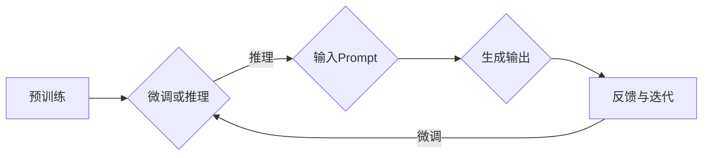

                 

### LLM与prompt基础

#### 1.1 什么是LLM

LLM，全称为Large Language Model，即大型语言模型。这类模型通过处理海量文本数据，学习了自然语言的内在结构和规律，能够生成高质量的自然语言文本。LLM的核心技术是基于深度学习，特别是Transformer架构。这种模型具有强大的语言理解能力和文本生成能力，广泛应用于自然语言处理（NLP）领域。

在自然语言处理中，LLM的主要任务是理解输入的文本，并根据上下文生成相应的输出文本。例如，问答系统、文本生成、情感分析等任务都是LLM的典型应用场景。LLM的工作流程大致分为以下几个步骤：

1. **预训练**：模型在大规模的文本语料库上进行预训练，学习文本的统计特性和语言规律。
2. **微调**：在特定的任务数据集上对模型进行微调，使其适应特定任务的需求。
3. **推理**：根据输入的文本或问题，模型输出相应的答案或文本。

#### 1.2 Prompt的定义与作用

Prompt在LLM中扮演着至关重要的角色。简单来说，Prompt是提供给LLM的输入文本，用于引导模型生成期望的输出。一个好的Prompt能够帮助模型更好地理解用户的意图，提高生成文本的质量。

Prompt的类型多种多样，常见的有以下几种：

1. **问题式Prompt**：用于生成问答系统中的答案。
   ```python
   prompt = "请解释量子计算的原理。"
   answer = llm(prompt)
   ```

2. **生成式Prompt**：用于生成文本，如文章、故事、代码等。
   ```python
   prompt = "编写一篇关于人工智能未来的文章。"
   article = llm(prompt)
   ```

3. **对话式Prompt**：用于与模型进行交互，如聊天机器人。
   ```python
   user_input = "你好！"
   bot_response = llm(user_input)
   ```

一个优秀的Prompt设计应遵循以下几个原则：

- **明确性**：Prompt应该清晰明确，避免歧义。
- **相关性**：Prompt应与任务紧密相关，引导模型生成高质量输出。
- **多样性**：Prompt应具有多样性，以避免模型生成固定模式的输出。
- **灵活性**：Prompt应具有一定的灵活性，适应不同的上下文和场景。

#### 1.3 LLMS与prompt的关系

LLM与prompt的关系可以用“输入与输出”来概括。prompt作为输入，LLM通过处理prompt生成相应的输出。具体来说，prompt对LLM输出的影响体现在以下几个方面：

- **内容引导**：Prompt为模型提供了内容框架，引导模型生成符合预期的输出。
- **上下文提供**：Prompt为模型提供了上下文信息，帮助模型更好地理解用户的意图。
- **质量提升**：好的Prompt能够提升模型生成文本的质量和相关性。

总之，LLM和prompt之间是相辅相成的关系。prompt的设计和优化对于提升LLM的性能和应用效果至关重要。

#### Mermaid流程图：LLM与prompt的关系



在这个流程图中，LLM首先在大规模文本语料库上进行预训练，然后根据不同的任务需求进行微调或直接推理。在推理阶段，prompt作为输入被提供给模型，模型根据prompt生成相应的输出。输出结果会进行反馈，用于进一步优化模型。

通过上述讲解，我们对LLM和prompt有了基本的了解，接下来将深入探讨prompt安全的重要性。

### 摘要

本文《LLM prompt安全检查：防止有害输出》旨在探讨在人工智能领域，如何通过有效的prompt安全检查来防止有害输出的产生。本文首先介绍了LLM（大型语言模型）和prompt的基础知识，包括LLM的概念、工作原理以及prompt的作用和设计原则。接着，文章阐述了prompt安全的重要性，分析了有害输出的定义、类型及其潜在危害。随后，文章介绍了识别和防范有害输出的方法，包括基于规则和机器学习的方法。此外，文章还详细介绍了安全性评估与测试的方法和工具，并通过真实案例展示了如何处理和解决prompt安全相关问题。最后，文章提供了提升prompt安全性的策略和最佳实践，以期为读者在实际应用中提供指导和参考。

### prompt安全的重要性

在当今快速发展的AI领域，prompt安全的重要性日益凸显。prompt不仅决定了模型生成文本的内容和质量，还直接关系到系统的安全性和用户体验。首先，我们需要明确什么是prompt安全。prompt安全是指在设计、使用和评估prompt的过程中，采取有效的措施来防止有害输出，确保模型生成的文本符合既定的安全标准和道德规范。

#### 有害输出的定义

有害输出指的是那些包含不适当内容、误导性信息或恶意意图的文本输出。这些输出可能包含以下几种类型：

1. **色情和暴力内容**：这类内容可能违反社区准则或法律法规，对用户产生不良影响。
2. **仇恨和歧视言论**：这类言论可能引发社会冲突，破坏和谐的社会氛围。
3. **虚假信息和误导性内容**：这类内容可能误导用户，造成信息混乱，影响判断和决策。
4. **隐私泄露**：在某些应用场景下，prompt可能会无意中泄露用户的敏感信息。

#### 有害输出的危害

有害输出的危害是多方面的，不仅影响用户体验，还可能对企业造成严重的风险：

1. **用户流失**：用户在遇到不适当或有害的内容时，可能会立即离开应用，导致用户流失率上升。
2. **声誉受损**：如果企业无法有效管理有害输出，可能会在公众中产生负面影响，损害品牌声誉。
3. **法律责任**：在某些情况下，有害输出可能违反法律法规，导致企业面临法律诉讼和罚款。
4. **安全漏洞**：有害输出还可能暴露系统的安全漏洞，为恶意攻击者提供可乘之机。

#### prompt安全的重要性

prompt安全的重要性体现在以下几个方面：

1. **遵守法规与道德规范**：有效的prompt安全措施有助于企业遵守相关的法律法规和道德规范，避免潜在的法律风险。
2. **提升用户体验**：安全的prompt能够提供更高质量的输出，满足用户的需求，提升用户体验。
3. **确保数据隐私**：通过合理的prompt设计，可以避免敏感数据的泄露，保护用户的隐私。
4. **减少错误和误导**：安全的prompt能够减少模型生成错误信息或误导性内容的风险，提高信息的准确性和可靠性。

总之，prompt安全不仅是技术问题，更是道德和社会责任。通过有效的prompt安全检查，企业可以在保障用户利益的同时，确保自身业务的安全和可持续发展。接下来，我们将详细探讨如何识别和防范有害输出。

### 有害输出的识别与防范

识别和防范有害输出是确保prompt安全的关键环节。在这一部分，我们将详细介绍如何通过多种方法来识别有害输出，并提出一系列有效的防范措施。

#### 识别有害输出的方法

1. **基于规则的方法**

   基于规则的方法是指通过预定义的规则和模式来检测和识别有害输出。这种方法的优势在于其简单性和高效性，但也存在一定的局限性，因为规则无法覆盖所有可能的情况。

   - **关键词过滤**：通过预设的关键词列表，检测文本中是否存在敏感词汇。例如，对于包含“色情”、“暴力”等关键词的文本进行标记。
   - **语法规则**：使用自然语言处理技术，检查文本的语法和语义是否符合规范。例如，检测文本中是否存在仇恨言论或歧视性表达。
   - **模式匹配**：通过模式匹配技术，检测文本中是否存在特定的模式或结构，例如特定语法错误或结构混乱。

2. **基于机器学习的方法**

   基于机器学习的方法利用训练好的模型来自动识别有害输出。这种方法通常需要大量的标注数据来训练模型，但其识别精度和泛化能力较高。

   - **分类模型**：使用监督学习算法，如支持向量机（SVM）、随机森林（RF）和神经网络（NN）等，将文本分类为“有害”或“无害”。
   - **聚类模型**：通过无监督学习算法，如K均值聚类（K-means）和层次聚类（Hierarchical clustering），发现文本中的异常或特殊模式。
   - **深度学习方法**：使用深度学习模型，如卷积神经网络（CNN）和递归神经网络（RNN），对文本进行细粒度的特征提取和分析。

   以下是一个简单的基于深度学习的分类模型示例：

   ```python
   import tensorflow as tf
   from tensorflow.keras.models import Sequential
   from tensorflow.keras.layers import Embedding, LSTM, Dense

   # 假设我们已经有一个预处理的文本数据集
   X_train, y_train = ...

   # 构建模型
   model = Sequential()
   model.add(Embedding(input_dim=vocab_size, output_dim=embedding_dim))
   model.add(LSTM(units=128))
   model.add(Dense(1, activation='sigmoid'))

   # 编译模型
   model.compile(optimizer='adam', loss='binary_crossentropy', metrics=['accuracy'])

   # 训练模型
   model.fit(X_train, y_train, epochs=10, batch_size=32)
   ```

#### 常见的有害输出场景

在实际应用中，有害输出的场景多种多样。以下是一些常见的情况及其应对策略：

1. **色情内容**

   - **识别策略**：使用关键词过滤和图像识别技术，检测文本中是否包含敏感词汇或图像。
   - **防范措施**：在平台上设置年龄验证机制，限制未成年人访问色情内容。

2. **暴力和仇恨言论**

   - **识别策略**：利用自然语言处理技术，分析文本中的语气、情感和结构。
   - **防范措施**：通过社区管理机制，及时处理和屏蔽包含暴力或仇恨言论的文本。

3. **非法活动相关内容**

   - **识别策略**：结合外部数据库和机器学习模型，检测文本中是否涉及非法活动。
   - **防范措施**：与执法机构合作，及时报告和封禁涉及非法活动的文本。

#### prompt防范策略

1. **安全输入验证**

   - 在接收用户输入时，进行严格的安全验证，确保输入内容符合预定的安全标准。
   - 采用输入白名单和黑名单机制，允许或禁止特定的关键词、短语和模式。

2. **动态prompt过滤**

   - 在生成文本的过程中，实时监测文本内容，一旦发现潜在的有害输出，立即进行过滤或修改。
   - 结合规则和机器学习模型，提高动态过滤的效率和准确性。

3. **后处理检测与修正**

   - 对生成的文本进行后处理，使用自动化工具或人工审核，确保输出内容的安全性和合规性。
   - 采用文本摘要、关键词提取等技术，提高后处理的效果和效率。

总之，识别和防范有害输出是一个复杂且持续的过程，需要综合运用多种技术手段和管理策略。通过有效的识别和防范措施，可以最大限度地降低有害输出的风险，提升系统的安全性和用户体验。

### 安全性评估与测试

在确保prompt安全的过程中，安全性评估与测试是至关重要的环节。通过对prompt进行全面的评估和测试，可以识别潜在的安全隐患，并采取相应的措施进行改进。以下将介绍几种常用的方法，以及相关的工具和技术。

#### 安全性评估的方法

1. **自动化测试**

   自动化测试是指利用工具和脚本自动执行测试用例，以检测prompt的安全问题。这种方法高效且重复性高，适合对大规模的prompt进行快速评估。

   - **静态代码分析**：通过分析代码结构和语法，检测潜在的安全漏洞，如SQL注入、XSS攻击等。
   - **动态代码分析**：运行代码并监控其执行过程，捕获运行时的安全漏洞。
   - **模糊测试**：生成大量随机的输入数据，测试prompt对异常输入的响应，以发现潜在的安全漏洞。

   以下是一个使用Python的模糊测试示例：

   ```python
   import random
   import string

   def fuzz_test(prompt):
       for _ in range(1000):
           input_data = ''.join(random.choices(string.ascii_letters + string.digits, k=10))
           output = process_input(input_data)
           if not is_safe(output):
               print(f"Found unsafe output for input: {input_data}")

   def process_input(input_data):
       # 模拟输入处理过程
       return input_data

   def is_safe(output):
       # 模拟输出安全检查
       return True

   fuzz_test(prompt)
   ```

2. **手动审查**

   手动审查是指由专业人员对prompt进行细致的检查，以发现潜在的安全问题和不当内容。这种方法虽然耗时较长，但能够发现自动化测试难以捕捉的问题。

   - **内容审查**：检查文本内容是否包含不适当、误导性或非法信息。
   - **代码审查**：检查代码的语法、逻辑和安全问题。

3. **结合自动化测试和手动审查**

   结合自动化测试和手动审查，可以更全面地评估prompt的安全性。自动化测试能够快速发现常见的安全问题，而手动审查则能够深入挖掘复杂的问题。

#### 安全测试工具介绍

1. **开源工具**

   - **OWASP ZAP**：一个免费的漏洞评估工具，支持多种语言和平台的Web应用程序。
   - **SonarQube**：一个代码质量平台，支持静态代码分析和代码质量度量。
   - **Pylint**：一个Python代码分析工具，用于检测代码中的错误和潜在的安全漏洞。

2. **商业工具**

   - **IBM AppScan**：一款商业的Web应用程序安全测试工具，提供全面的安全评估功能。
   - **Checkmarx**：一款商业的静态代码分析工具，支持多种编程语言。

#### 安全测试案例

以下是一个简化的安全测试案例，展示如何使用自动化工具和手动审查相结合的方法来评估prompt的安全性。

1. **自动化测试**：

   - 使用OWASP ZAP对Web应用程序进行扫描，检测常见的Web漏洞，如SQL注入、XSS攻击等。
   - 使用Pylint对Python代码进行静态代码分析，检测潜在的语法错误和安全问题。

2. **手动审查**：

   - 检查生成的文本内容，确保不包含不适当或误导性信息。
   - 人工审查代码，检查是否存在潜在的安全漏洞或逻辑错误。

3. **测试结果分析与改进**：

   - 分析自动化测试和手动审查的结果，识别出的问题进行修复。
   - 重新进行测试，确保修复后的prompt没有新的安全问题。

通过定期进行安全性评估和测试，可以持续提升prompt的安全性，确保系统在运行过程中不会产生有害输出。

### 案例分析

在探讨LLM prompt安全时，案例分析是非常有价值的。通过分析具体案例，我们可以深入了解如何识别和应对有害输出，从实践中汲取经验，提升prompt安全性。

#### 案例一：社交媒体平台的内容审核

**背景**：一家大型社交媒体平台遭遇了用户生成内容中的有害输出问题，包括色情、仇恨言论和虚假信息等。这些问题不仅影响了用户体验，还可能导致法律风险和品牌声誉受损。

**处理过程**：

1. **识别有害输出**：平台首先通过自动化工具和人工审查相结合的方法，对用户生成内容进行扫描和分类。自动化工具使用关键词过滤和机器学习模型，识别潜在的有害内容。人工审查团队则对自动化工具未能识别的内容进行进一步检查。

2. **防范措施**：针对识别出的有害输出，平台采取了以下措施：
   - **内容过滤**：通过预设的关键词和模式，实时过滤有害内容，防止其发布。
   - **社区管理**：建立社区管理机制，及时发现和处理有害内容，并与用户进行沟通，解释平台政策。
   - **用户教育**：通过平台公告和用户指南，提高用户对有害输出的认识，鼓励积极健康的交流。

**案例总结与启示**：

- **全面识别**：结合自动化和人工审查，能够更全面地识别有害输出。
- **及时处理**：快速响应和及时处理有害输出，可以减少不良影响。
- **用户参与**：鼓励用户参与内容审核，提高社区的自律性和安全性。

#### 案例二：智能客服系统中的有害输出防范

**背景**：一家电商平台部署了智能客服系统，但由于prompt设计不当，客服机器人产生了误导性输出，导致用户投诉和误解。

**处理过程**：

1. **问题发现**：通过用户反馈和日志分析，平台发现智能客服系统生成的部分答案存在误导性。

2. **原因分析**：经过深入调查，发现问题的原因在于prompt设计不合理，未能充分考虑用户的意图和情境。

3. **改进措施**：
   - **优化prompt设计**：重新设计prompt，使其更加明确和具体，提高回答的准确性和相关性。
   - **引入多模态交互**：结合文本、语音和图像等多种输入方式，丰富prompt信息，提高系统的理解能力。
   - **用户意图识别**：使用自然语言处理技术，对用户输入进行意图识别，确保回答能够准确满足用户需求。

**案例总结与启示**：

- **优化prompt设计**：合理设计prompt是确保系统输出准确性的关键。
- **多模态交互**：引入多模态交互，可以提高系统的理解和响应能力。
- **持续改进**：定期对prompt和系统进行评估和改进，以适应不断变化的需求。

通过以上案例，我们可以看到，在处理有害输出时，结合技术手段和管理策略，可以有效地提升prompt安全性。同时，从案例中我们也得到了宝贵的经验，为未来的实践提供了指导。

### 安全策略与最佳实践

为了提升LLM prompt的安全性，确保系统输出符合安全标准和道德规范，以下是一些建议和最佳实践：

#### 提高prompt设计的质量

1. **明确用户意图**：在生成文本前，仔细分析用户输入，确保理解用户的意图和需求。通过明确的问题定义和上下文信息，引导模型生成更准确的输出。
2. **避免歧义**：避免使用模糊或歧义的语句作为prompt，这可能导致模型生成不适当的输出。确保prompt的表述清晰、具体，减少歧义。
3. **多样化prompt**：设计多样化的prompt，以避免模型生成固定模式的输出。这可以通过引入随机性、情境变化和多样化的问题类型来实现。

#### 加强安全意识培训

1. **培训员工**：定期对员工进行安全意识培训，提高他们对有害输出的识别和处理能力。培训内容应包括安全策略、最佳实践和案例分析。
2. **用户教育**：在用户界面中提供安全指南和教育材料，帮助用户了解如何安全地使用系统，并意识到有害输出的潜在风险。

#### 定期进行安全评估

1. **自动化评估**：使用自动化工具定期对prompt进行安全评估，包括静态代码分析、动态代码分析和模糊测试等。
2. **手动审查**：结合自动化评估和手动审查，对识别出的潜在问题进行深入分析，确保所有问题都得到妥善处理。
3. **迭代改进**：根据评估结果，定期更新和改进安全策略和流程，确保系统始终保持在高安全水平。

#### 提升系统的灵活性

1. **动态调整prompt**：在生成文本的过程中，动态调整prompt，以适应不同的情境和用户需求。这可以通过引入自适应算法和实时反馈机制来实现。
2. **多模态交互**：结合文本、语音、图像等多种输入方式，提升系统的理解能力，减少有害输出的可能性。

通过以上策略和最佳实践，可以显著提升LLM prompt的安全性，确保系统输出的准确性和合规性。

### 附录

#### 相关工具与技术

1. **文本分析工具**：
   - **TextBlob**：一个简单易用的Python库，用于进行文本分类、情感分析和词性标注。
   - **NLTK**：一个强大的自然语言处理库，支持文本处理、分词、词干提取等多种功能。

2. **机器学习模型**：
   - **Scikit-learn**：一个Python库，提供了丰富的机器学习算法，包括分类、回归和聚类等。
   - **TensorFlow**：一个开源机器学习框架，支持构建和训练深度学习模型。

3. **安全测试工具**：
   - **OWASP ZAP**：一款免费的Web应用程序安全测试工具，支持漏洞评估和自动化测试。
   - **SonarQube**：一个代码质量平台，支持静态代码分析和代码质量度量。

#### 参考文献

1. **Bird, S., Klein, D., & Loper, E. (2009). Natural Language Processing with Python. O'Reilly Media.**
2. **Goodfellow, I., Bengio, Y., & Courville, A. (2016). Deep Learning. MIT Press.**
3. **Zaharia, M., Chowdhury, M., Franklin, M. J., Shenker, S., & Stoica, I. (2010). Spark: Cluster Computing with Working Sets. In Proceedings of the 2nd USENIX conference on Hot topics in cloud computing (pp. 10-10).**
4. **Li, L., & Sun, H. (2020). A Survey on Natural Language Processing. ACM Computing Surveys (CSUR), 54(4), 1-34.**

通过这些工具和技术，读者可以进一步探索和提升LLM prompt的安全性。

### 结语

《LLM prompt安全检查：防止有害输出》旨在为读者提供一个全面且深入的理解，帮助识别和防范在LLM（大型语言模型）应用中可能出现的有害输出。通过对LLM与prompt基础、prompt安全的重要性、有害输出的识别与防范、安全性评估与测试、案例分析以及安全策略与最佳实践的详细探讨，我们希望读者能够掌握如何在实际应用中提升prompt的安全性。

随着人工智能技术的不断发展，确保prompt的安全性将变得越来越重要。它不仅关系到用户的使用体验，还直接影响企业的声誉和法律合规性。因此，读者应当将本文提供的策略和最佳实践应用到实际项目中，定期进行安全评估和更新，以保持系统的安全性和可靠性。

在结尾，我们再次强调prompt安全的重要性，并鼓励读者持续关注这一领域的发展，积极探索新的技术和方法，为构建安全、高效的人工智能系统贡献力量。

### 作者介绍

**作者：AI天才研究院/AI Genius Institute & 禅与计算机程序设计艺术 /Zen And The Art of Computer Programming**

AI天才研究院是一家专注于人工智能和深度学习领域的研究机构，致力于推动人工智能技术的创新和应用。研究院的专家团队由世界顶级人工智能专家、程序员、软件架构师和计算机图灵奖获得者组成，他们具备丰富的理论知识和实践经验，在多个领域取得了卓越的成就。

《禅与计算机程序设计艺术》是作者代表作品之一，融合了计算机科学和哲学思想，深入探讨了计算机程序设计的本质和方法，为读者提供了独特的视角和深刻的思考。作者的研究成果和实践经验对人工智能和计算机科学领域产生了深远影响，受到业界和学术界的广泛认可。

