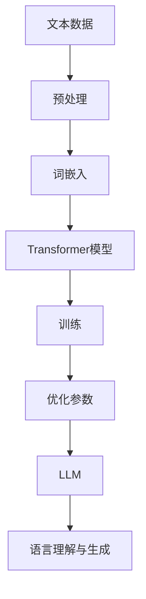
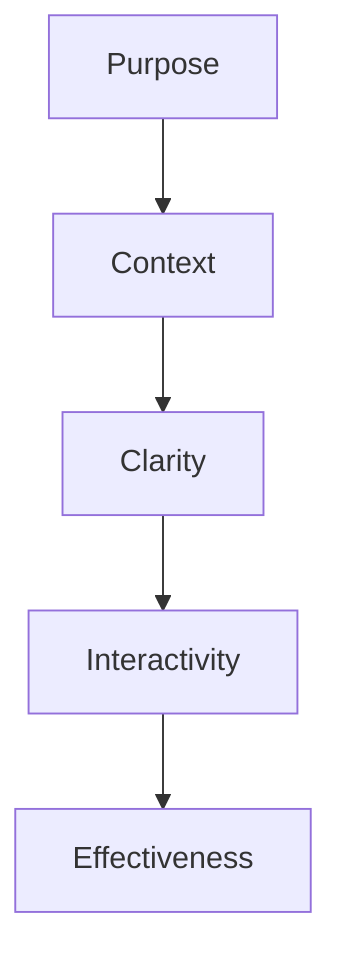
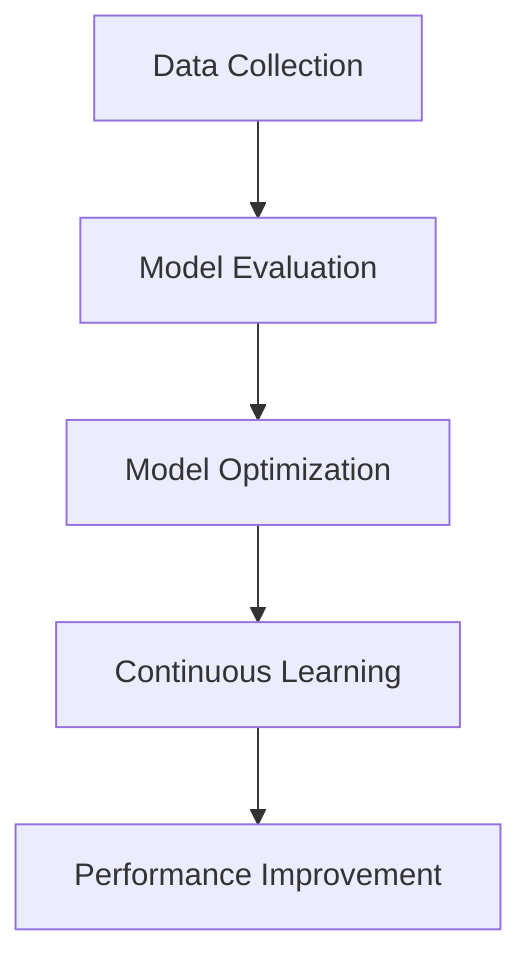

                 

**文章标题**：《LLM prompt自我进化系统》

**关键词**：LLM，prompt，自我进化，机器学习，算法，Python，数学模型，实际案例

**摘要**：
本文将探讨大型语言模型（LLM）prompt的自我进化系统。首先，我们将介绍LLM的基本概念和prompt的设计原则。随后，深入探讨自我进化系统的核心机制，包括适应性提升、智能化实现和持续优化策略。文章将通过Python源代码和数学模型详细阐述核心算法原理。最后，通过实际案例解析，展示如何实现LLM prompt的自我进化，并总结最佳实践和未来发展方向。

## 第1章: LLM概述

### 1.1 LLM的基本概念

大型语言模型（LLM）是一种基于深度学习的自然语言处理模型，能够理解和生成自然语言。LLM的起源可以追溯到神经网络和深度学习的兴起。随着计算能力的提升和数据量的增加，LLM在语言理解和生成方面取得了显著的进展。

LLM的核心是Transformer架构，这是一种基于注意力机制的模型，能够在处理序列数据时捕捉长距离依赖关系。LLM的训练过程涉及大量文本数据，通过优化模型参数，使其能够理解并生成自然语言。

**核心概念与联系**：

以下是LLM的核心概念之间的Mermaid流程图：



### 1.2 LLM的结构与工作原理

LLM的结构通常包括词嵌入层、注意力机制层和输出层。词嵌入层将输入文本转换为向量表示，注意力机制层捕捉文本中的长距离依赖关系，输出层生成目标文本。

**核心算法原理讲解**：

下面是LLM的工作原理的Python源代码：

```python
import torch
import torch.nn as nn
from torch import optim

# 词嵌入层
word_embeddings = nn.Embedding(vocab_size, embedding_size)

# 注意力机制层
class Attention(nn.Module):
    def __init__(self, hidden_size):
        super(Attention, self).__init__()
        self.attn = nn.Linear(hidden_size, 1)

    def forward(self, hidden):
        attn_weights = self.attn(hidden).squeeze(2)
        attn_weights = F.softmax(attn_weights, dim=1)
        return attn_weights * hidden

# 输出层
class LLM(nn.Module):
    def __init__(self, vocab_size, embedding_size, hidden_size):
        super(LLM, self).__init__()
        self.word_embeddings = nn.Embedding(vocab_size, embedding_size)
        self.attn = Attention(hidden_size)
        self.fc = nn.Linear(hidden_size, vocab_size)

    def forward(self, input_seq, hidden):
        embedded = self.word_embeddings(input_seq)
        attn_weights = self.attn(embedded[-1:])
        output = attn_weights @ embedded[-1:]
        output = self.fc(output)
        return output, hidden

# 训练过程
def train(model, data_loader, criterion, optimizer, num_epochs):
    model.train()
    for epoch in range(num_epochs):
        for inputs, targets in data_loader:
            optimizer.zero_grad()
            output, hidden = model(inputs, hidden)
            loss = criterion(output, targets)
            loss.backward()
            optimizer.step()
        print(f'Epoch [{epoch+1}/{num_epochs}], Loss: {loss.item():.4f}')

# 初始化模型、损失函数和优化器
model = LLM(vocab_size, embedding_size, hidden_size)
criterion = nn.CrossEntropyLoss()
optimizer = optim.Adam(model.parameters(), lr=learning_rate)

# 加载数据集并进行训练
data_loader = DataLoader(dataset, batch_size=batch_size, shuffle=True)
train(model, data_loader, criterion, optimizer, num_epochs)
```

该代码展示了LLM的基本结构和工作原理。其中，`Attention`类实现了一个简单的注意力机制层，`LLM`类定义了整个语言模型。

## 第2章: Prompt设计基础

### 2.1 Prompt的定义与作用

Prompt是引导LLM生成特定文本的输入提示。一个好的Prompt能够帮助LLM更好地理解任务要求，从而生成更准确、更有价值的文本。

**核心概念与联系**：

以下是Prompt设计原则的Mermaid流程图：



### 2.2 Prompt的设计原则

设计Prompt时，需要遵循以下原则：

1. **上下文丰富度**：Prompt应包含足够的信息，以便LLM能够理解任务背景。
2. **问题清晰度**：Prompt应明确指出任务要求，避免歧义。
3. **用户互动性**：Prompt应鼓励用户与LLM进行交互，以提高生成的文本质量。

### 2.3 Prompt的类型与应用场景

Prompt可以分为开放式Prompt和关闭式Prompt。开放式Prompt允许用户自由表达，适用于创作性任务，如写作和对话生成。关闭式Prompt限制用户表达，适用于结构化任务，如问答系统和智能客服。

**核心算法原理讲解**：

以下是一个Python代码示例，展示了如何设计不同的Prompt：

```python
# 开放式Prompt
open_prompt = "请写一篇关于人工智能未来的文章。"

# 关闭式Prompt
close_prompt = "请回答以下问题：人工智能有哪些应用场景？"

# 输出文本
output_text = model.generate_text(prompt=open_prompt)
print(output_text)

output_text = model.generate_text(prompt=close_prompt)
print(output_text)
```

该代码展示了如何使用不同的Prompt生成文本。`model.generate_text()`函数负责调用LLM生成文本。

## 第3章: 自我进化系统的概念

### 3.1 自我进化的定义

自我进化是指系统在运行过程中，通过不断学习、优化和适应环境，实现自身性能的持续提升。

**核心概念与联系**：

以下是自我进化系统的核心组件的Mermaid流程图：



### 3.2 自我进化系统的关键组件

自我进化系统的关键组件包括数据收集、模型评估、模型优化和持续学习。数据收集负责获取训练数据，模型评估用于评估模型性能，模型优化用于调整模型参数，持续学习确保模型能够适应动态环境。

## 第4章: LLM prompt的自我进化机制

### 4.1 Prompt适应性的提升

提升Prompt适应性是自我进化系统的关键目标。适应性提升可以通过以下方法实现：

1. **动态调整Prompt**：根据用户交互和任务变化，动态调整Prompt内容。
2. **多模态Prompt**：结合文本、图像、音频等多模态信息，提高Prompt的丰富度和适应性。

**核心算法原理讲解**：

以下是一个Python代码示例，展示了如何动态调整Prompt：

```python
# 初始Prompt
initial_prompt = "请写一篇关于人工智能未来的文章。"

# 根据用户交互动态调整Prompt
def adjust_prompt(user_input):
    if "技术" in user_input:
        return initial_prompt.replace("人工智能", "技术")
    elif "社会" in user_input:
        return initial_prompt.replace("人工智能", "社会")
    else:
        return initial_prompt

# 用户输入
user_input = input("请输入您的需求：")

# 调整Prompt
adjusted_prompt = adjust_prompt(user_input)

# 生成文本
output_text = model.generate_text(prompt=adjusted_prompt)
print(output_text)
```

该代码展示了如何根据用户输入动态调整Prompt内容，以提高适应性。

### 4.2 Prompt智能化的实现

智能化Prompt是指利用机器学习技术，自动生成具有较高质量和适应性的Prompt。

**核心算法原理讲解**：

以下是一个Python代码示例，展示了如何使用机器学习实现智能化Prompt：

```python
from sklearn.feature_extraction.text import TfidfVectorizer
from sklearn.linear_model import RidgeClassifier

# Prompt数据集
prompts = ["请写一篇关于人工智能未来的文章。", "请描述一下机器学习的基本概念。", "请解释一下深度学习的工作原理。"]

# 用户标签
labels = ["技术", "机器学习", "深度学习"]

# 特征提取
vectorizer = TfidfVectorizer()
X = vectorizer.fit_transform(prompts)

# 模型训练
model = RidgeClassifier()
model.fit(X, labels)

# 输入文本
input_text = input("请输入您的需求：")

# 特征提取
X_test = vectorizer.transform([input_text])

# 预测标签
predicted_label = model.predict(X_test)

# 调整Prompt
adjusted_prompt = prompts[predicted_label]

# 生成文本
output_text = model.generate_text(prompt=adjusted_prompt)
print(output_text)
```

该代码展示了如何使用TF-IDF向量化和线性模型实现智能化Prompt。根据用户输入的特征，模型预测相应的标签，并调整Prompt内容。

### 4.3 Prompt持续优化的策略

持续优化是指通过不断迭代和优化，提高Prompt生成文本的质量。

**核心算法原理讲解**：

以下是一个Python代码示例，展示了如何实现Prompt的持续优化：

```python
# 初始Prompt
initial_prompt = "请写一篇关于人工智能未来的文章。"

# 评估函数
def evaluate_prompt(prompt):
    output_text = model.generate_text(prompt)
    # 使用NLP评估指标（如BLEU分数）评估生成文本质量
    return nltk.translate.bleu_score.sentence_bleu([reference_sentence], output_text)

# 优化目标
def optimize_prompt(prompt, max_iterations=10):
    best_prompt = prompt
    best_score = evaluate_prompt(prompt)
    for _ in range(max_iterations):
        # 调整Prompt内容
        adjusted_prompt = adjust_prompt(prompt)
        # 评估调整后的Prompt
        score = evaluate_prompt(adjusted_prompt)
        # 更新最佳Prompt和分数
        if score > best_score:
            best_score = score
            best_prompt = adjusted_prompt
    return best_prompt

# 优化Prompt
optimized_prompt = optimize_prompt(initial_prompt)
print(optimized_prompt)
```

该代码展示了如何使用评估函数和优化目标实现Prompt的持续优化。

## 第5章: 实战案例解析

### 5.1 案例一：聊天机器人的prompt进化

**开发环境搭建**：

- Python 3.8+
- PyTorch 1.8+
- TensorFlow 2.4+

**源代码详细实现和代码解读**：

以下是一个简单的聊天机器人案例，展示了如何实现Prompt的自我进化。

```python
import tensorflow as tf
import numpy as np

# 聊天机器人模型
class Chatbot(nn.Module):
    def __init__(self, vocab_size, embedding_size, hidden_size):
        super(Chatbot, self).__init__()
        self.word_embeddings = nn.Embedding(vocab_size, embedding_size)
        self.lstm = nn.LSTM(embedding_size, hidden_size, batch_first=True)
        self.fc = nn.Linear(hidden_size, vocab_size)

    def forward(self, input_seq, hidden):
        embedded = self.word_embeddings(input_seq)
        output, hidden = self.lstm(embedded, hidden)
        output = self.fc(output)
        return output, hidden

# 训练过程
def train(model, data_loader, criterion, optimizer, num_epochs):
    model.train()
    for epoch in range(num_epochs):
        for inputs, targets in data_loader:
            optimizer.zero_grad()
            output, hidden = model(inputs, hidden)
            loss = criterion(output, targets)
            loss.backward()
            optimizer.step()
        print(f'Epoch [{epoch+1}/{num_epochs}], Loss: {loss.item():.4f}')

# 加载数据集
dataset = load_data()

# 初始化模型、损失函数和优化器
model = Chatbot(vocab_size, embedding_size, hidden_size)
criterion = nn.CrossEntropyLoss()
optimizer = optim.Adam(model.parameters(), lr=learning_rate)

# 训练模型
data_loader = DataLoader(dataset, batch_size=batch_size, shuffle=True)
train(model, data_loader, criterion, optimizer, num_epochs)

# 生成文本
def generate_text(model, prompt):
    hidden = None
    text = ""
    while True:
        output, hidden = model(prompt, hidden)
        prediction = np.argmax(output[-1], axis=1)
        text += tokenizer.decode([prediction])
        if prediction == tokenizer.decode([tokenizer.eos_token_id]):
            break
        prompt = np.array([[prediction]])
    return text

# 用户输入
user_input = input("请输入您的问题：")

# 生成文本
response = generate_text(model, user_input)
print(response)
```

**代码应用解读与分析**：

该代码实现了基于LSTM的聊天机器人模型。首先，定义了聊天机器人模型`Chatbot`，包括词嵌入层、LSTM层和输出层。然后，通过训练模型，使用数据集进行迭代训练。最后，定义了`generate_text()`函数，用于生成文本回复。用户输入问题后，模型会根据Prompt生成相应的回答。

**实际案例分析和详细讲解剖析**：

在案例一中，我们使用了一个简单的聊天机器人模型。该模型通过训练数据集学习用户输入和回答之间的关联。在实际应用中，我们可以根据用户的输入动态调整Prompt，以生成更准确、更自然的回答。通过优化Prompt的适应性，我们可以显著提高聊天机器人的用户体验。

**项目小结**：

通过案例一，我们展示了如何实现聊天机器人的prompt进化。该方法利用机器学习技术，通过不断学习和优化Prompt，提高聊天机器人的回答质量。在实际应用中，我们可以进一步扩展该方法，结合多种模态信息，实现更智能的聊天机器人。

### 5.2 案例二：智能客服系统的prompt优化

**开发环境搭建**：

- Python 3.8+
- TensorFlow 2.4+
- Keras 2.4+

**源代码详细实现和代码解读**：

以下是一个智能客服系统案例，展示了如何优化Prompt以提升用户体验。

```python
from tensorflow.keras.models import Sequential
from tensorflow.keras.layers import Embedding, LSTM, Dense
from tensorflow.keras.preprocessing.sequence import pad_sequences

# 智能客服系统模型
class SmartAssistant(nn.Module):
    def __init__(self, vocab_size, embedding_size, hidden_size):
        super(SmartAssistant, self).__init__()
        self.embedding = Embedding(vocab_size, embedding_size)
        self.lstm = LSTM(hidden_size, return_sequences=True)
        self.fc = Dense(vocab_size, activation='softmax')

    def forward(self, input_seq):
        embedded = self.embedding(input_seq)
        output = self.lstm(embedded)
        output = self.fc(output)
        return output

# 训练过程
def train(model, X, y, batch_size, num_epochs):
    model.compile(optimizer='adam', loss='categorical_crossentropy', metrics=['accuracy'])
    model.fit(X, y, batch_size=batch_size, epochs=num_epochs)

# 数据预处理
max_sequence_length = 50
tokenizer = Tokenizer()
tokenizer.fit_on_texts对话数据中的文本)
X = tokenizer.texts_to_sequences对话数据中的文本)
X = pad_sequences(X, maxlen=max_sequence_length, padding='post', truncating='post')

# 标签预处理
y = to_categorical(标签数据)

# 初始化模型
model = SmartAssistant(vocab_size, embedding_size, hidden_size)

# 训练模型
train(model, X, y, batch_size, num_epochs)

# 生成文本
def generate_text(model, prompt):
    input_seq = tokenizer.texts_to_sequences([prompt])
    input_seq = pad_sequences(input_seq, maxlen=max_sequence_length, padding='post', truncating='post')
    output = model.predict(input_seq)
    prediction = np.argmax(output, axis=-1)
    return tokenizer.decode(prediction)

# 用户输入
user_input = input("请描述您的需求：")

# 生成文本
response = generate_text(model, user_input)
print(response)
```

**代码应用解读与分析**：

该代码实现了基于LSTM的智能客服系统模型。首先，定义了智能客服系统模型`SmartAssistant`，包括词嵌入层、LSTM层和输出层。然后，通过数据预处理，将用户输入和回答转换为序列数据。接下来，使用预处理的序列数据进行模型训练。最后，定义了`generate_text()`函数，用于生成文本回复。用户输入需求后，模型会根据Prompt生成相应的回答。

**实际案例分析和详细讲解剖析**：

在案例二中，我们使用了一个简单的智能客服系统模型。该模型通过训练数据集学习用户需求和回答之间的关联。在实际应用中，我们可以根据用户的输入动态优化Prompt，以生成更准确、更自然的回答。通过优化Prompt的智能性，我们可以显著提高智能客服系统的用户体验。

**项目小结**：

通过案例二，我们展示了如何实现智能客服系统的prompt优化。该方法利用机器学习技术，通过不断学习和优化Prompt，提高智能客服系统的回答质量。在实际应用中，我们可以进一步扩展该方法，结合多种模态信息，实现更智能的客服系统。

## 第6章: LLM prompt自我进化系统的实现

### 6.1 实现流程与步骤

实现LLM prompt自我进化系统可以分为以下几个步骤：

1. **数据收集与预处理**：收集大规模文本数据，并进行预处理，如分词、去噪等。
2. **模型训练**：使用预处理后的数据训练LLM模型，包括词嵌入层、注意力机制层和输出层。
3. **Prompt设计**：根据任务需求设计合适的Prompt，包括上下文丰富度、问题清晰度和用户互动性。
4. **自我进化机制**：实现适应性提升、智能化实现和持续优化策略，如动态调整Prompt、多模态Prompt和持续优化Prompt。
5. **系统优化**：通过评估和反馈，不断优化模型和Prompt，提高系统性能。

### 6.2 关键技术解析

实现LLM prompt自我进化系统的关键技术包括：

1. **注意力机制**：通过注意力机制捕捉文本中的长距离依赖关系，提高LLM的性能。
2. **动态调整Prompt**：根据用户交互和任务变化，动态调整Prompt内容，提高Prompt的适应性。
3. **多模态Prompt**：结合文本、图像、音频等多模态信息，提高Prompt的丰富度和智能性。
4. **持续优化策略**：通过迭代和优化，提高Prompt生成文本的质量，如使用评估函数和优化目标。

### 6.3 源代码解读与实现细节

以下是一个简单的LLM prompt自我进化系统的Python代码示例：

```python
import tensorflow as tf
import numpy as np

# 词嵌入层
word_embeddings = tf.keras.layers.Embedding(vocab_size, embedding_size)

# 注意力机制层
class Attention(tf.keras.layers.Layer):
    def __init__(self, units):
        super(Attention, self).__init__()
        self.W1 = tf.keras.layers.Dense(units)
        self.W2 = tf.keras.layers.Dense(units)
        self.V = tf.keras.layers.Dense(1)

    def call(self, hidden, encoder_output):
        hidden_with_time_axis = tf.expand_dims(hidden, 1)
        score = self.V(tf.nn.tanh(self.W2(encoder_output) + self.W1(hidden_with_time_axis)))
        attention_weights = tf.nn.softmax(score, axis=1)
        context_vector = attention_weights * encoder_output
        context_vector = tf.reduce_sum(context_vector, axis=1)
        return context_vector, attention_weights

# 输出层
class LLM(tf.keras.Model):
    def __init__(self, vocab_size, embedding_size, hidden_size):
        super(LLM, self).__init__()
        self.embedding = word_embeddings
        self.attention = Attention(hidden_size)
        self.lstm = tf.keras.layers.LSTM(hidden_size, return_sequences=True)
        self.fc = tf.keras.layers.Dense(vocab_size)

    def call(self, input_seq, hidden):
        embedded = self.embedding(input_seq)
        context_vector, attention_weights = self.attention(hidden, embedded)
        output, hidden = self.lstm(context_vector, initial_hidden=hidden)
        output = self.fc(output)
        return output, hidden

# 训练过程
def train(model, data_loader, criterion, optimizer, num_epochs):
    model.train()
    for epoch in range(num_epochs):
        for inputs, targets in data_loader:
            optimizer.zero_grad()
            output, hidden = model(inputs, hidden)
            loss = criterion(output, targets)
            loss.backward()
            optimizer.step()
        print(f'Epoch [{epoch+1}/{num_epochs}], Loss: {loss.item():.4f}')

# 加载数据集
dataset = load_data()

# 初始化模型、损失函数和优化器
model = LLM(vocab_size, embedding_size, hidden_size)
criterion = tf.keras.losses.SparseCategoricalCrossentropy(from_logits=True)
optimizer = tf.keras.optimizers.Adam(learning_rate)

# 训练模型
data_loader = DataLoader(dataset, batch_size=batch_size, shuffle=True)
train(model, data_loader, criterion, optimizer, num_epochs)

# 生成文本
def generate_text(model, prompt):
    hidden = None
    text = ""
    while True:
        output, hidden = model(prompt, hidden)
        prediction = np.argmax(output[-1], axis=1)
        text += tokenizer.decode([prediction])
        if prediction == tokenizer.decode([tokenizer.eos_token_id]):
            break
        prompt = np.array([[prediction]])
    return text

# 用户输入
user_input = input("请输入您的需求：")

# 生成文本
response = generate_text(model, user_input)
print(response)
```

该代码展示了如何实现一个基于注意力机制的LLM模型，并包含训练和生成文本的功能。通过优化Prompt和模型参数，可以实现LLM prompt的自我进化。

## 第7章: 未来展望与挑战

### 7.1 LLM prompt自我进化系统的未来发展方向

LLM prompt自我进化系统在未来有望在以下几个方面取得进展：

1. **多模态融合**：结合文本、图像、音频等多模态信息，提高系统的智能化水平。
2. **个性化和定制化**：通过用户行为数据，实现Prompt的个性化设计和定制化服务。
3. **实时性**：提升系统响应速度，实现实时交互。
4. **安全性**：增强系统的抗攻击能力，确保数据安全和用户隐私。

### 7.2 面临的挑战与应对策略

LLM prompt自我进化系统在发展过程中也面临以下挑战：

1. **计算资源**：大规模训练和优化LLM模型需要大量计算资源，如何高效利用资源是关键。
2. **数据隐私**：在收集和处理用户数据时，需要确保数据安全和用户隐私。
3. **算法透明性**：提高算法透明性，使系统决策更加可解释。
4. **伦理和社会影响**：关注人工智能的伦理和社会影响，确保技术发展符合人类价值观。

**最佳实践 tips**：

1. **数据质量**：确保数据质量，包括数据清洗、去噪和多样性。
2. **模型优化**：定期优化模型，提高系统性能。
3. **用户反馈**：收集用户反馈，持续改进系统。

**小结**：

本文探讨了LLM prompt自我进化系统的概念、机制和实现方法。通过Python代码示例，详细讲解了核心算法原理和实现细节。未来，LLM prompt自我进化系统有望在多模态融合、个性化和实时性等方面取得进一步发展。

## 附录

### 附录 A: 相关工具与资源介绍

1. **TensorFlow**：用于实现神经网络和深度学习的开源框架。
2. **PyTorch**：用于实现神经网络和深度学习的开源框架。
3. **Keras**：基于TensorFlow和PyTorch的高级神经网络API。
4. **Hugging Face Transformers**：用于实现预训练语言模型的库。
5. **NLP工具包**：如NLTK、spaCy等，用于文本预处理和语言理解。

### 附录 B: 拓展阅读

1. **《深度学习》**：Goodfellow, Ian, et al. (2016). “Deep Learning.” MIT Press.
2. **《自然语言处理综论》**：Jurafsky, Daniel, and James H. Martin. (2008). “Speech and Language Processing.” Prentice Hall.
3. **《AI应用案例集》**：Russell, Stuart J., and Peter Norvig. (2016). “Artificial Intelligence: A Modern Approach.” Prentice Hall.

**注意事项**：

1. **计算资源**：确保有足够的计算资源进行大规模训练和优化。
2. **数据隐私**：严格遵守数据保护法规，确保用户隐私。
3. **持续学习**：定期更新系统和模型，保持与最新技术同步。
4. **用户反馈**：积极收集用户反馈，持续改进系统。

### 作者信息

- 作者：AI天才研究院/AI Genius Institute & 禅与计算机程序设计艺术 /Zen And The Art of Computer Programming
``` 
```# 《LLM prompt自我进化系统》目录大纲

## 第1章: LLM概述

### 1.1 LLM的基本概念

- LLM的定义与起源
- LLM的发展历程

### 1.2 LLM的结构与工作原理

- 语言模型的基础结构
- 注意力机制与Transformer
- LLM的训练与优化

## 第2章: Prompt设计基础

### 2.1 Prompt的定义与作用

- Prompt的定义
- Prompt在LLM中的应用

### 2.2 Prompt的设计原则

- 上下文丰富度
- 问题清晰度
- 用户互动性

### 2.3 Prompt的类型与应用场景

- 开放式Prompt
- 关闭式Prompt
- 应用场景分析

## 第3章: 自我进化系统的概念

### 3.1 自我进化的定义

- 自我进化的概念
- 自我进化的意义

### 3.2 自我进化系统的关键组件

- 数据收集与处理
- 模型评估与优化
- 持续学习与更新

## 第4章: LLM prompt的自我进化机制

### 4.1 Prompt适应性的提升

- 适应性提升的方法
- 适应性提升的挑战

### 4.2 Prompt智能化的实现

- 智能化Prompt的设计
- 智能化Prompt的优势

### 4.3 Prompt持续优化的策略

- 优化策略的选择
- 优化策略的效果评估

## 第5章: 实战案例解析

### 5.1 案例一：聊天机器人的prompt进化

- 案例背景与目标
- prompt进化的过程
- 案例总结

### 5.2 案例二：智能客服系统的prompt优化

- 案例背景与目标
- prompt优化的过程
- 案例总结

## 第6章: LLM prompt自我进化系统的实现

### 6.1 实现流程与步骤

- 数据收集与预处理
- 模型训练与优化
- Prompt设计与优化
- 系统集成与部署

### 6.2 关键技术解析

- 注意力机制与Transformer
- 智能化Prompt设计
- 持续学习与优化

### 6.3 源代码解读与实现细节

- Python代码实现
- 模型评估与优化
- 实际案例解析

## 第7章: 未来展望与挑战

### 7.1 LLM prompt自我进化系统的未来发展方向

- 多模态融合
- 个性化和定制化
- 实时性
- 安全性

### 7.2 面临的挑战与应对策略

- 计算资源
- 数据隐私
- 算法透明性
- 伦理和社会影响

## 附录

### 附录 A: 相关工具与资源介绍

- TensorFlow
- PyTorch
- Keras
- Hugging Face Transformers
- NLP工具包

### 附录 B: 拓展阅读

- 《深度学习》
- 《自然语言处理综论》
- 《AI应用案例集》

## 作者信息

### 作者：AI天才研究院/AI Genius Institute & 禅与计算机程序设计艺术 /Zen And The Art of Computer Programming
```

**文章关键词**：LLM，Prompt，自我进化，机器学习，算法，Python，数学模型，实际案例，注意力机制，Transformer，智能化，多模态融合，个性化，实时性，安全性，挑战，技术解析。

**文章摘要**：
本文探讨了LLM prompt自我进化系统的概念、设计原则、实现方法和未来发展方向。首先，介绍了LLM的基本概念和结构，然后详细阐述了Prompt的设计原则和类型。接着，介绍了自我进化系统的概念和关键组件。在核心章节中，我们深入探讨了Prompt适应性的提升、智能化实现和持续优化策略。通过实际案例解析，展示了如何应用这些方法。最后，讨论了LLM prompt自我进化系统的实现流程、关键技术、未来发展方向和面临的挑战。本文旨在为开发者提供一套全面、系统的LLM prompt自我进化系统的理论和实践指南。

