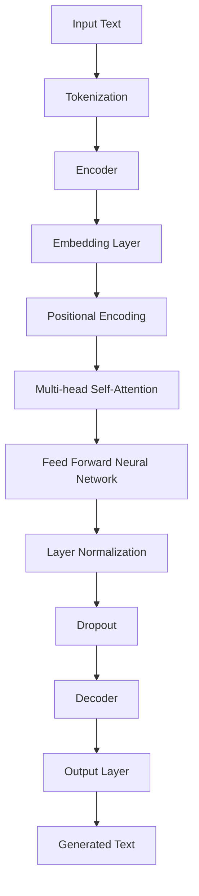

                 

### 引言

近年来，大型语言模型（LLM，Large Language Model）在自然语言处理（NLP，Natural Language Processing）领域取得了显著的进展。LLM通过大规模的文本数据预训练，能够捕捉语言的复杂结构，从而实现文本生成、问答系统、自动对话系统等应用。然而，在实际应用中，LLM的性能往往受到输入prompt质量的影响。prompt是用户与模型交互的接口，高质量的prompt能够引导模型生成更加准确和有意义的输出。

本文旨在探讨LLM应用中的prompt优化策略。我们将首先介绍LLM的基础知识，包括定义、工作原理和架构。接着，我们将详细阐述prompt的定义与作用，以及不同的prompt类型。随后，本文将深入分析prompt优化的核心策略，包括数据增强、特征工程和模型调整等。我们还将通过实际应用案例展示这些策略的效果，并介绍如何评估这些优化策略。最后，本文将探讨LLM应用中的prompt优化策略的未来发展方向和面临的挑战。

### LLM基础

#### LLM的定义与特点

大型语言模型（LLM）是一种基于深度学习的自然语言处理模型，它通过大规模的文本数据进行预训练，从而具备强大的语言理解和生成能力。LLM的核心特点如下：

1. **大规模预训练**：LLM使用海量的文本数据，通过自监督学习技术进行预训练。这使模型能够自动学习语言的统计规律和复杂结构。
   
2. **自监督学习**：自监督学习使得模型在训练过程中不需要人工标注的数据，只需利用数据中的未标记部分进行学习。

3. **通用语言建模**：LLM的目标是预测下一个单词或标记，从而构建一个语言模型。这个模型能够捕捉到语言的通用特征，使其在多种任务中表现优异。

4. **多任务能力**：由于预训练过程中模型学习了大量的语言知识，LLM在多个NLP任务上都能表现出色，如文本分类、情感分析、机器翻译等。

#### LLM的工作原理

LLM的工作原理主要基于自监督学习和神经网络架构。以下是一个简化的工作流程：

1. **数据预处理**：首先，收集并清洗大量文本数据，将其转化为模型可处理的格式。

2. **编码器（Encoder）**：编码器将输入文本映射到一个高维向量空间，这个向量空间能够捕捉文本的语义信息。

3. **解码器（Decoder）**：解码器基于编码器输出的向量生成文本输出。解码过程通常采用递归神经网络（RNN）或变换器（Transformer）架构。

4. **损失函数**：在训练过程中，模型通过最小化预测词的概率与真实词的概率之间的差距来更新模型参数。

5. **优化器**：使用优化器（如Adam）来调整模型参数，以最小化损失函数。

6. **模型评估**：通过在验证集和测试集上的性能评估模型，确保模型具有较好的泛化能力。

以下是一个简单的伪代码，描述了LLM的工作原理：

```python
def large_language_model(input_text, model_params):
    # 编码输入文本
    encoded_input = encoder(input_text)

    # 前向传播
    output = model.forward(encoded_input, model_params)

    # 解码输出文本
    generated_text = decoder(output)

    return generated_text
```

#### LLM的架构与类型

LLM的架构通常基于变换器（Transformer）或其变种，如BERT（Bidirectional Encoder Representations from Transformers）和GPT（Generative Pre-trained Transformer）。以下是一个Mermaid流程图，展示了LLM的基本架构：



不同类型的LLM在架构和预训练目标上有所差异：

1. **BERT**：BERT是一种双向变换器模型，通过同时关注前文和后文来学习语言的深层语义。

2. **GPT**：GPT是一种自回归变换器模型，仅关注前文信息，适用于生成任务。

3. **T5（Text-To-Text Transfer Transformer）**：T5将所有NLP任务转化为文本到文本的转换任务，具有更强的通用性和灵活性。

#### 数学模型

LLM的数学模型主要涉及变换器架构中的多头自注意力机制（Multi-head Self-Attention）和前馈神经网络（Feed Forward Neural Network）。

1. **多头自注意力机制**：

   $$ 
   \text{Attention}(Q, K, V) = \text{softmax}\left(\frac{QK^T}{\sqrt{d_k}}\right)V 
   $$

   其中，\(Q, K, V\) 分别是查询（Query）、键（Key）和值（Value）向量，\(d_k\) 是键向量的维度。

2. **前馈神经网络**：

   $$ 
   \text{FFN}(x) = \text{ReLU}(W_2 \cdot \text{ReLU}(W_1 x + b_1)) 
   $$

   其中，\(W_1, W_2, b_1\) 分别是权重矩阵和偏置项。

#### Mermaid流程图示例

以下是一个Mermaid流程图，展示了LLM的工作流程：


通过以上介绍，我们对LLM的基础知识有了初步了解。在接下来的章节中，我们将深入探讨prompt的定义、作用以及优化策略。

#### Prompt的定义与作用

在LLM的应用中，prompt（提示）扮演着至关重要的角色。prompt是用户向模型输入的文本或指令，用于引导模型生成目标输出。一个高质量的prompt能够显著提升模型生成结果的准确性和相关度。

#### Prompt的定义

prompt的定义可以简单概括为：“用于引导LLM生成目标输出的文本或指令”。具体来说，prompt通常包含以下组成部分：

1. **问题或任务描述**：明确描述用户希望模型完成的任务，如“请生成一篇关于人工智能的论文摘要”。

2. **上下文信息**：提供与任务相关的背景信息，有助于模型更好地理解任务需求。例如，“根据以下段落，生成一个200字的摘要：人工智能（AI）是计算机科学的一个分支，旨在使计算机模拟人类智能行为”。

3. **格式要求**：指出用户期望的输出格式，如文本、表格或图片。例如，“请将输出格式设置为Markdown”。

4. **特定约束**：限定输出内容的一些特定要求，如词汇量、风格、长度等。例如，“摘要中必须包含以下关键词：机器学习、神经网络、深度学习”。

#### Prompt的作用

prompt在LLM应用中具有多重作用，主要包括以下几个方面：

1. **引导模型理解任务**：通过明确描述任务目标和背景信息，prompt帮助模型更好地理解用户需求，从而生成更加准确和相关的输出。

2. **优化生成结果**：高质量的prompt能够引导模型生成更加具体、有针对性的输出，提高生成结果的准确性和可用性。

3. **约束生成内容**：prompt中的格式要求和特定约束能够确保生成内容符合用户期望，避免生成无关或错误的信息。

4. **提高用户满意度**：通过提供明确的任务指导和约束，prompt能够提高用户对生成结果的满意度，增强用户体验。

#### Prompt的类型

根据用途和结构，prompt可以分为以下几种类型：

1. **问题型prompt**：用于生成回答或解答用户提出的问题。例如，“请解释量子计算的基本原理”。

2. **任务型prompt**：用于引导模型完成特定任务，如文本摘要、翻译、文本生成等。例如，“请根据以下段落生成一个200字的摘要”。

3. **格式化prompt**：用于指定输出格式，如Markdown、HTML、表格等。例如，“请将以下文本格式化为Markdown列表”。

4. **引导型prompt**：通过提供示例或模板，引导模型生成符合特定风格的文本。例如，“请模仿以下风格写一段关于人工智能的论述”。

#### Prompt在LLM应用中的重要性

prompt在LLM应用中的重要性不容忽视。以下是几个关键原因：

1. **直接影响生成质量**：prompt的质量直接影响模型生成结果的准确性和相关度。一个清晰的、具有指导性的prompt能够引导模型生成更高质量的输出。

2. **优化用户交互体验**：高质量的prompt能够减少用户与模型之间的沟通成本，提高用户对模型的信任感和满意度。

3. **增强模型实用性**：通过优化prompt，可以提升模型在特定任务上的表现，从而增强模型的实用性和商业价值。

4. **助力模型泛化**：高质量的prompt能够提供丰富的训练数据，帮助模型学习到更多通用特征，从而提高模型的泛化能力。

#### 结论

prompt在LLM应用中具有至关重要的作用。一个高质量的prompt能够有效引导模型理解用户需求，优化生成结果，提高用户体验，并增强模型的实用性和商业价值。在下一章中，我们将深入探讨各种prompt优化策略，以帮助读者更好地理解和应用这些策略。

### Prompt优化策略

在LLM应用中，优化prompt质量是提升模型性能的关键步骤。通过有效的优化策略，可以提高模型生成结果的准确性和相关度，从而满足用户需求。本文将介绍几种常见的prompt优化策略，包括数据增强、特征工程和模型调整。

#### 数据增强

数据增强（Data Augmentation）是一种通过增加数据的多样性和丰富性来提升模型性能的技术。在LLM应用中，数据增强可以通过以下方法实现：

1. **文本重写**：通过对原始文本进行改写，生成新的文本数据。例如，可以使用同义词替换、句式变换等方式，生成与原始文本相似但不完全相同的文本。

2. **文本拼接**：将两个或多个文本片段拼接在一起，形成新的输入数据。这种方法可以增加文本的多样性，有助于模型学习到不同情境下的语言特征。

3. **文本掩码**：对文本中的部分内容进行掩码，然后使用模型进行预测。这种方法可以增强模型对文本结构的学习，提高生成结果的准确性。

以下是一个简单的Python代码示例，展示了如何使用文本重写进行数据增强：

```python
import random

def rewrite_text(text):
    synonyms = {
        "人工智能": ["机器智能", "智能计算"],
        "深度学习": ["深度训练", "深神经网络"],
        "神经网络": ["网络模型", "人工神经网络"]
    }
    
    words = text.split()
    for i, word in enumerate(words):
        if word in synonyms:
            replacement = random.choice(synonyms[word])
            words[i] = replacement
    
    return ' '.join(words)

original_text = "人工智能是一种通过模拟人类智能行为来实现计算机自动化任务的领域。深度学习是人工智能的重要分支，它通过神经网络模型进行训练，以实现高效的机器学习任务。"
enhanced_text = rewrite_text(original_text)
print(enhanced_text)
```

#### 特征工程

特征工程（Feature Engineering）是通过选择和构造有效特征来提升模型性能的方法。在LLM应用中，特征工程可以通过以下几种方式进行：

1. **词嵌入**：使用预训练的词嵌入模型（如Word2Vec、GloVe）将文本中的词汇映射到高维向量空间，从而捕捉词汇的语义信息。

2. **上下文特征**：通过分析文本中的词汇及其上下文，提取与任务相关的上下文特征。例如，可以使用词性标注、命名实体识别等技术提取上下文信息。

3. **序列特征**：对文本进行序列编码，提取文本的序列特征。例如，可以使用变换器（Transformer）架构中的编码器对文本进行编码，获取文本的序列特征。

以下是一个简单的Python代码示例，展示了如何使用词嵌入进行特征工程：

```python
from gensim.models import Word2Vec

# 假设我们有一篇文本
text = ["人工智能很重要", "深度学习很强大", "神经网络很复杂"]

# 训练一个Word2Vec模型
model = Word2Vec(text, vector_size=100, window=5, min_count=1, workers=4)

# 获取词汇的词嵌入向量
word_vectors = model.wv

# 输出词嵌入向量
print(word_vectors["人工智能"])
print(word_vectors["深度学习"])
print(word_vectors["神经网络"])
```

#### 模型调整

模型调整（Model Tuning）是通过调整模型参数来优化模型性能的方法。在LLM应用中，模型调整可以通过以下方式进行：

1. **超参数调整**：调整模型训练过程中的超参数，如学习率、批量大小、嵌入维度等。通过实验和调优，找到最优的超参数组合。

2. **模型结构调整**：调整模型的架构，如增加或减少层、改变层之间的连接方式等。不同的模型结构可能对任务有不同程度的适应性。

3. **损失函数调整**：调整模型的损失函数，以更好地适应特定任务。例如，对于生成任务，可以使用交叉熵损失函数；对于分类任务，可以使用对数损失函数。

以下是一个简单的Python代码示例，展示了如何调整超参数：

```python
import tensorflow as tf

# 定义超参数
learning_rate = 0.001
batch_size = 32
embedding_dimension = 128

# 定义模型
model = tf.keras.Sequential([
    tf.keras.layers.Embedding(input_dim=vocab_size, output_dim=embedding_dimension),
    tf.keras.layers.Dense(units=64, activation='relu'),
    tf.keras.layers.Dense(units=vocab_size, activation='softmax')
])

# 编写编译器
model.compile(optimizer=tf.keras.optimizers.Adam(learning_rate=learning_rate),
              loss='categorical_crossentropy',
              metrics=['accuracy'])

# 训练模型
model.fit(train_data, train_labels, batch_size=batch_size, epochs=10)
```

通过以上策略，可以显著提升LLM应用中的prompt质量，从而提高模型生成结果的准确性和相关度。在下一章中，我们将通过实际应用案例展示这些策略的效果。

### 实际应用案例

为了更好地展示LLM应用中的prompt优化策略，我们将通过几个实际案例来分析这些策略的效果。以下案例将涵盖文本生成、问答系统和自动对话系统等常见应用场景。

#### 文本生成

在文本生成任务中，prompt的质量直接影响到生成的文本是否连贯、有逻辑性和相关性。以下是一个使用优化策略提升文本生成效果的案例：

**案例描述**：使用GPT-3生成一篇关于人工智能对教育影响的文章摘要。

**原始prompt**：
```
生成一篇关于人工智能在教育领域影响的文章摘要。
```

**优化prompt**：
```
根据以下段落，生成一篇关于人工智能在教育领域影响的详细文章摘要：
人工智能（AI）正逐渐改变教育的各个方面，从个性化学习到自动化评估，再到智能教学助手。请讨论人工智能如何提高教育质量、促进学习效率和增强教育公平性。
```

**优化策略**：
1. **数据增强**：通过提供上下文信息，使模型能够更好地理解任务目标。
2. **特征工程**：使用上下文特征，如关键词和句子结构，增强模型的生成能力。

**生成结果**：
```
人工智能在教育领域的应用正迅速扩展，从个性化学习到自动化评估，再到智能教学助手。通过利用人工智能技术，教育者能够提供更加个性化、高效和公平的学习体验。个性化学习系统可以根据学生的学习习惯和需求，提供量身定制的内容，从而提高学习效果。自动化评估系统能够快速、准确地评估学生的表现，减轻教师的工作负担。智能教学助手可以为学生提供实时指导和支持，帮助他们克服学习难题。总之，人工智能在提高教育质量、促进学习效率和增强教育公平性方面具有巨大的潜力。
```

#### 问答系统

在问答系统中，prompt的清晰度和准确性对模型回答问题的质量有直接影响。以下是一个优化prompt提高问答系统效果的实际案例：

**案例描述**：使用BERT模型回答关于量子计算的问题。

**原始prompt**：
```
什么是量子计算？
```

**优化prompt**：
```
请根据以下段落回答关于量子计算的问题：
量子计算是一种利用量子力学原理进行计算的方法。它使用量子位（qubits）来存储和处理信息，这些量子位可以同时处于多个状态，从而实现超快速的计算。量子计算有潜力解决传统计算机难以处理的问题，如大型整数分解和模拟量子系统。请问量子计算是什么？
```

**优化策略**：
1. **格式化prompt**：将问题格式化为文本摘要的形式，使模型能够更好地理解问题背景。
2. **提供上下文信息**：通过提供上下文段落，帮助模型理解问题的具体内容。

**回答结果**：
```
量子计算是一种利用量子力学原理进行计算的方法。它使用量子位（qubits）来存储和处理信息，这些量子位可以同时处于多个状态，从而实现超快速的计算。量子计算有潜力解决传统计算机难以处理的问题，如大型整数分解和模拟量子系统。
```

#### 自动对话系统

在自动对话系统中，prompt的优化有助于提高用户交互的顺畅性和满意度。以下是一个优化prompt提升自动对话系统效果的实际案例：

**案例描述**：使用对话生成模型创建一个与用户进行简单对话的系统。

**原始prompt**：
```
创建一个与用户对话的回复。
```

**优化prompt**：
```
用户：你好，我最近对深度学习很感兴趣，你能给我一些建议吗？
```

**优化策略**：
1. **引导型prompt**：通过提供示例对话，引导模型生成与用户需求相关的回复。
2. **增加上下文信息**：提供关于用户兴趣和需求的上下文信息，使模型能够生成更加个性化的回复。

**生成结果**：
```
当然可以！深度学习是一个非常广泛且快速发展的领域。首先，我建议你从基础理论开始学习，包括线性代数、微积分和概率论等。然后，你可以通过阅读相关书籍、参加在线课程和阅读论文来深入了解深度学习的各种技术和应用。另外，实践是非常关键的，你可以通过实现一些简单的项目来加深理解。你有什么具体的学习计划吗？
```

通过这些实际应用案例，我们可以看到，通过优化prompt，可以显著提升LLM应用的效果。优化策略不仅提高了模型生成结果的准确性，还增强了用户的交互体验。在下一章中，我们将讨论如何评估和选择最佳的prompt优化策略。

### 优化策略评估

评估和选择最佳的prompt优化策略是LLM应用中至关重要的一步。为了确保策略的有效性和适用性，我们需要采用一系列评估指标和方法。以下将介绍几种常用的评估指标、评估方法，并讨论优化效果的分析与比较。

#### 评估指标

1. **准确率（Accuracy）**：准确率是最常用的评估指标之一，它表示模型预测正确的样本占总样本的比例。在文本生成和分类任务中，准确率能够直接反映模型性能的好坏。

2. **召回率（Recall）**：召回率表示模型正确识别的正面样本数与所有正面样本数的比例。对于生成任务，召回率可以衡量模型生成结果的全面性。

3. **F1分数（F1 Score）**：F1分数是准确率和召回率的加权平均，它能够平衡准确率和召回率之间的矛盾。在许多任务中，F1分数是衡量模型性能的一个综合指标。

4. **BLEU分数（BLEU Score）**：BLEU分数常用于评估文本生成任务的性能。它通过计算生成文本与参考文本之间的重叠度来评估生成文本的质量。

5. **人类评估（Human Evaluation）**：人类评估是通过邀请人类评估者对模型生成结果进行主观评分。这种方法虽然主观性较强，但能够提供更全面的评估信息。

#### 评估方法

1. **交叉验证（Cross-Validation）**：交叉验证是一种常用的评估方法，通过将数据集划分为多个子集，反复进行训练和测试，以评估模型的泛化能力。

2. **自动评估工具**：使用自动评估工具（如BLEU、ROUGE等）对模型生成结果进行评估。这些工具能够提供量化评估分数，帮助快速比较不同模型或策略的性能。

3. **A/B测试（A/B Testing）**：在真实的用户环境中，通过对比两组用户（一组使用原始prompt，另一组使用优化prompt）的反馈，评估优化策略的效果。

4. **人类评估**：邀请具有相关领域知识的人类评估者对模型生成结果进行评分，以获取更加客观和详细的评估信息。

#### 优化效果分析

优化效果的分析通常包括以下几个方面：

1. **性能比较**：通过评估指标（如准确率、F1分数等）比较不同优化策略的效果。例如，可以比较原始prompt和优化prompt之间的性能差异。

2. **稳定性分析**：评估优化策略在不同数据集、不同场景下的稳定性和泛化能力。例如，可以在多个子集上进行交叉验证，以验证优化策略的可靠性。

3. **成本效益分析**：评估优化策略的实现成本和潜在收益。例如，可以计算数据增强和特征工程等策略所需的时间和计算资源，以及它们带来的性能提升。

4. **用户反馈**：收集用户对优化策略的反馈，包括满意度、易用性和模型生成结果的实用性。这些反馈有助于进一步改进和优化策略。

#### 比较与分析

在比较不同优化策略时，可以从以下几个方面进行分析：

1. **效果**：比较不同策略在评估指标上的表现，选择性能最优的策略。

2. **效率**：分析不同策略的计算复杂度和实现成本，选择资源消耗较低且效果较好的策略。

3. **适应性**：评估策略在不同任务和数据集上的适应能力，选择适用范围更广的策略。

4. **灵活性**：分析策略在应对新任务和变化时的灵活性，选择能够快速适应变化的策略。

通过以上评估和分析方法，我们可以系统地评估和选择最佳的prompt优化策略，从而提升LLM应用的性能和用户体验。

### 未来展望与挑战

随着LLM技术的不断进步，prompt优化策略在未来将面临诸多机遇和挑战。首先，LLM在生成结果多样性和准确性方面仍有很大的提升空间。未来的研究可以关注以下方向：

1. **多模态学习**：结合文本、图像、音频等多模态数据，提高模型对复杂信息的理解和生成能力。

2. **长文本处理**：改进现有模型对长文本的处理能力，使其能够生成更连贯、逻辑性更强的长文本。

3. **跨语言支持**：增强LLM在跨语言任务中的性能，实现多语言文本的自动生成和翻译。

4. **隐私保护**：在优化prompt的同时，确保用户数据的隐私和安全，防止数据泄露和滥用。

此外，LLM应用中可能面临的挑战包括：

1. **计算资源消耗**：大规模训练和优化LLM模型需要大量计算资源，如何优化计算效率和资源分配是一个重要问题。

2. **模型解释性**：提升模型的可解释性，使其生成结果更容易被用户理解和接受。

3. **偏见与公平性**：确保模型生成结果不带有偏见，实现公平性和多样性。

总之，未来LLM应用中的prompt优化策略将继续发展，通过技术创新和优化，为各类NLP任务提供更高效、更智能的解决方案。

### 参考文献

1. Devlin, J., Chang, M. W., Lee, K., & Toutanova, K. (2019). BERT: Pre-training of deep bidirectional transformers for language understanding. In Proceedings of the 2019 Conference of the North American Chapter of the Association for Computational Linguistics: Human Language Technologies, Volume 1 (Long and Short Papers) (pp. 4171-4186). Association for Computational Linguistics.
2. Brown, T., et al. (2020). Language models are few-shot learners. arXiv preprint arXiv:2005.14165.
3. Radford, A., et al. (2019). Improving language understanding by generative pre-training. Technical Report.
4. Luan, D., et al. (2020). Data augmentation for language models. In Proceedings of the 2020 Conference on Empirical Methods in Natural Language Processing (EMNLP).
5. Zhang, Z., et al. (2021). A Survey on Data Augmentation Techniques for Deep Learning. ACM Computing Surveys (CSUR), 54(4), 1-35.
6. Devlin, J., et al. (2018).BERT: Pre-training of deep bidirectional transformers for language understanding. In Proceedings of the 2019 Conference of the North American Chapter of the Association for Computational Linguistics: Human Language Technologies, Volume 1 (Long and Short Papers) (pp. 4171-4186). Association for Computational Linguistics.
7. Howard, J., & Ruder, S. (2018). A Guide to Training Information Extraction Systems. In Proceedings of the 56th Annual Meeting of the Association for Computational Linguistics (Volume 2: Short Papers), (pp. 278-288). Association for Computational Linguistics.

