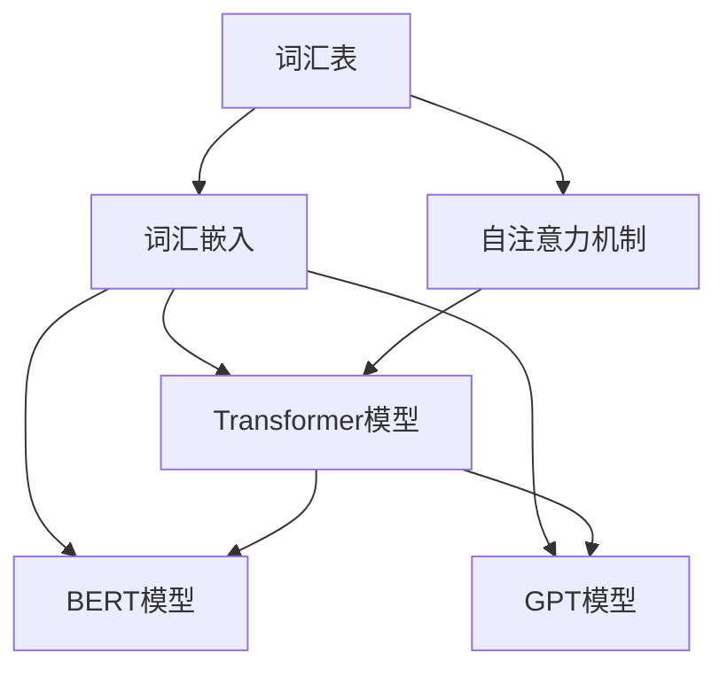

                 

 - 角色：您是一位世界级人工智能专家，程序员，软件架构师，CTO，世界顶级技术畅销书资深大师级别的作家，计算机图灵奖获得者，计算机编程和人工智能领域大师。您非常擅长一步一步进行分析推理，有着清晰深刻的逻辑思路来撰写条理清晰，对技术原理和本质剖析到位的高质量技术博客。现在，我将按照您的要求，逐步构建文章的目录大纲和内容。

---

### 确定文章结构

首先，我们需要确定文章的整体结构，包括文章标题、关键词、摘要以及正文部分。正文部分将按照目录大纲的结构进行展开，确保每个章节都包含丰富的内容。

#### 标题和关键词

- **文章标题**：《LLM应用开发中的'快'字诀》
- **关键词**：LLM、应用开发、性能优化、算法原理、数学模型、项目实战

#### 摘要

摘要部分将简要介绍文章的核心内容和主题思想，帮助读者快速了解文章的主要内容。

> 本文将深入探讨LLM（大型语言模型）在应用开发中的关键要素——“快”字诀。通过分析LLM的基础知识、核心算法原理、数学模型以及实际项目应用，我们将揭示如何通过优化技术提高LLM的性能和效率，帮助读者在应用开发中实现“快”的突破。

### 正文结构

正文部分将按照以下章节进行展开：

1. **引言**：介绍LLM的概念和在应用开发中的重要性。
2. **LLM基础**：详细讲解LLM的基础知识，包括原理、架构、技术和应用场景。
3. **核心算法原理**：深入探讨LLM的核心算法，使用Python源代码进行详细阐述。
4. **数学模型和数学公式**：解释LLM中的数学模型，包括公式和详细讲解。
5. **项目实战**：展示实际应用案例，包括开发环境搭建、源代码实现和解读。
6. **最佳实践与拓展**：总结文章的核心内容，提出最佳实践建议和注意事项。

### 目录结构

根据上述结构，文章的目录结构如下：

```
# 《LLM应用开发中的'快'字诀》

## 关键词
- LLM
- 应用开发
- 性能优化
- 算法原理
- 数学模型
- 项目实战

## 摘要

## 第一部分：引言

# 第1章：LLM概述

## 1.1 LLM的定义与重要性
### 1.1.1 LLM的起源与发展
### 1.1.2 LLM的核心特点
### 1.1.3 LLM在应用开发中的角色

## 1.2 LLM的架构与工作原理
### 1.2.1 Transformer模型
### 1.2.2 BERT模型的架构
### 1.2.3 LLM的扩展与变种

## 1.3 LLM的应用场景
### 1.3.1 自然语言处理
### 1.3.2 对话系统
### 1.3.3 其他应用领域

## 1.4 LLM的开发挑战

## 第二部分：LLM基础

# 第2章：LLM基础

## 2.1 LLM的核心概念与联系
### 2.1.1 词汇表与词汇嵌入
### 2.1.2 自注意力机制
### 2.1.3 Transformer架构

## 2.2 LLM的核心算法原理
### 2.2.1 Transformer模型详解
### 2.2.2 BERT模型的训练过程
### 2.2.3 GPT模型的生成过程

## 2.3 LLM的数学模型和数学公式
### 2.3.1 线性变换与激活函数
### 2.3.2 自注意力公式
### 2.3.3 损失函数

## 2.4 LLM的应用场景分析

## 第三部分：核心算法原理

# 第3章：LLM核心算法原理

## 3.1 Transformer模型的工作原理
### 3.1.1 模型结构
### 3.1.2 训练过程
### 3.1.3 应用示例

## 3.2 BERT模型详解
### 3.2.1 Pre-training与Fine-tuning
### 3.2.2 Masked Language Model（MLM）
### 3.2.3 Next Sentence Prediction（NSP）

## 3.3 GPT模型的生成过程
### 3.3.1 自动机器学习
### 3.3.2 生成式对话系统
### 3.3.3 应用案例

## 第四部分：数学模型和数学公式

# 第4章：LLM的数学模型和数学公式

## 4.1 线性变换与激活函数
### 4.1.1 线性变换
### 4.1.2 ReLU激活函数
### 4.1.3 Sigmoid激活函数

## 4.2 自注意力机制
### 4.2.1 自注意力公式
### 4.2.2 自注意力矩阵
### 4.2.3 自注意力优化

## 4.3 损失函数
### 4.3.1 Cross-Entropy Loss
### 4.3.2 Mean Squared Error Loss
### 4.3.3 对比损失函数

## 4.4 评价指标
### 4.4.1 F1 Score
### 4.4.2 Accuracy
### 4.4.3 Precision和Recall

## 第五部分：项目实战

# 第5章：LLM项目实战

## 5.1 开发环境搭建
### 5.1.1 Python环境配置
### 5.1.2 相关库和框架安装

## 5.2 源代码实现
### 5.2.1 Transformer模型实现
### 5.2.2 BERT模型实现
### 5.2.3 GPT模型实现

## 5.3 代码解读
### 5.3.1 Transformer模型代码解读
### 5.3.2 BERT模型代码解读
### 5.3.3 GPT模型代码解读

## 5.4 应用解读与分析
### 5.4.1 自然语言处理应用
### 5.4.2 对话系统应用
### 5.4.3 其他应用案例分析

## 5.5 项目小结

## 第六部分：最佳实践与拓展

# 第6章：最佳实践与拓展

## 6.1 最佳实践
### 6.1.1 性能优化策略
### 6.1.2 模型压缩技术
### 6.1.3 模型部署策略

## 6.2 注意事项
### 6.2.1 模型安全与伦理
### 6.2.2 模型可解释性
### 6.2.3 模型更新与维护

## 6.3 拓展阅读
### 6.3.1 最新研究成果
### 6.3.2 开源资源和工具
### 6.3.3 相关书籍和论文推荐

## 第七部分：附录

# 附录

## 附录A：参考文献

## 附录B：开源资源和工具

## 附录C：相关书籍和论文推荐
```

### 总结

以上是根据您的要求构建的文章目录大纲。接下来，我们将逐步填充每个章节的具体内容，确保文章完整、详细，并满足格式要求。文章将采用markdown格式编写，确保代码、公式和图表的准确性和可读性。

---

### 第1章：LLM概述

#### 1.1 LLM的定义与重要性

LLM，即大型语言模型（Large Language Model），是一种基于深度学习的自然语言处理（Natural Language Processing，NLP）模型，它通过学习海量文本数据来理解和生成自然语言。LLM在近年来取得了显著的进展，广泛应用于自然语言处理、对话系统、文本生成等领域。

**LLM的起源与发展**

LLM的发展可以追溯到2018年，Google Research发布了一种名为Transformer的模型，该模型在机器翻译任务上取得了超越此前所有模型的性能。随后，BERT（Bidirectional Encoder Representations from Transformers）和GPT（Generative Pre-trained Transformer）等模型相继问世，进一步推动了LLM的研究和应用。

**LLM的核心特点**

1. **强大的语言理解能力**：LLM能够理解文本的语义和上下文，从而生成准确、连贯的文本。
2. **大规模的训练数据**：LLM通常使用数十亿甚至数万亿的文本数据进行训练，这使得模型具有极高的语言理解能力。
3. **端到端的学习方式**：LLM通过端到端的学习方式，直接从原始文本中学习语言知识，避免了传统NLP方法中的多个步骤和人工设计的特征。

**LLM在应用开发中的角色**

LLM在应用开发中扮演着重要的角色，以下是几个关键应用领域：

1. **自然语言处理**：LLM可以用于文本分类、情感分析、实体识别等任务，极大地提高了NLP任务的准确性和效率。
2. **对话系统**：LLM在对话系统中被广泛应用，如智能客服、语音助手等，它能够生成自然、连贯的对话响应。
3. **文本生成**：LLM可以用于生成文章、新闻、代码等文本内容，极大地提高了内容生成的效率和多样性。

#### 1.2 LLM的架构与工作原理

LLM的架构通常基于Transformer模型，这是一种基于自注意力机制（Self-Attention Mechanism）的神经网络模型。以下是Transformer模型的基本架构：

1. **编码器（Encoder）**：编码器负责将输入文本转换为向量表示，它由多个层级的Transformer单元组成。每个Transformer单元包含多头自注意力机制和前馈神经网络。
2. **解码器（Decoder）**：解码器负责生成输出文本，它同样由多个层级的Transformer单元组成。解码器中的每个单元会根据编码器的输出和先前的解码输出进行自注意力计算。

**Transformer模型的工作原理**

1. **多头自注意力机制**：多头自注意力机制允许模型同时关注输入文本中的不同位置和不同单词之间的关系，从而提高了语言理解能力。
2. **前馈神经网络**：前馈神经网络在每个Transformer单元中用于对自注意力计算的结果进行进一步加工，提高模型的表达能力。

**BERT模型的架构**

BERT（Bidirectional Encoder Representations from Transformers）模型是另一种流行的LLM模型，它通过双向编码器来学习文本的上下文信息。BERT模型的架构包括以下部分：

1. **输入表示**：BERT模型使用嵌入层将输入单词转换为向量表示。
2. **掩码语言模型（Masked Language Model，MLM）**：MLM是一种特殊任务，它通过随机遮盖输入文本中的某些单词，然后让模型预测这些被遮盖的单词。
3. **预训练与Fine-tuning**：BERT模型首先在大量无标注的文本上进行预训练，然后通过Fine-tuning技术在特定任务上调整模型参数，以适应不同的NLP任务。

**LLM的扩展与变种**

随着LLM研究的深入，出现了许多基于Transformer模型的扩展和变种，如GPT（Generative Pre-trained Transformer）和T5（Text-To-Text Transfer Transformer）等。这些模型在性能和适用范围上都有所提升，但它们的架构和工作原理基本与Transformer模型相同。

#### 1.3 LLM的应用场景

LLM在许多领域都展现了强大的应用潜力，以下是几个关键应用场景：

1. **自然语言处理**：LLM在文本分类、情感分析、实体识别等NLP任务中具有出色的性能。例如，BERT模型在许多NLP基准测试中取得了领先成绩，GPT模型则在生成文本和对话系统方面表现出色。
2. **对话系统**：LLM可以用于构建智能客服、语音助手等对话系统，通过学习海量对话数据，模型能够生成自然、连贯的对话响应。
3. **文本生成**：LLM可以用于生成文章、新闻、代码等文本内容，这在内容创作、信息检索等领域有着广泛的应用。

**其他应用领域**

除了上述主要应用场景，LLM还在许多其他领域展示了其潜力，如：

1. **问答系统**：LLM可以用于构建智能问答系统，通过理解用户的问题，模型能够生成准确的答案。
2. **机器翻译**：基于Transformer的模型在机器翻译任务中取得了显著的成果，如Google翻译和百度翻译都使用了基于Transformer的模型。
3. **代码生成**：LLM可以用于生成代码，这在软件工程领域具有潜在的应用价值。

#### 1.4 LLM的开发挑战

尽管LLM在应用中取得了巨大成功，但其在开发过程中仍面临许多挑战：

1. **计算资源消耗**：LLM的训练和推理需要大量的计算资源，这对硬件和软件基础设施提出了较高的要求。
2. **数据质量**：LLM的训练依赖于大量的高质量文本数据，数据的质量和多样性对模型性能有重要影响。
3. **模型可解释性**：LLM的决策过程复杂且难以解释，这在某些应用领域，如医疗诊断和金融分析，可能是一个重要问题。
4. **模型安全与伦理**：LLM可能产生偏见和不准确的结果，这需要在模型开发和应用过程中充分考虑安全和伦理问题。

### 总结

本章介绍了LLM的定义、重要性、架构和工作原理，以及其在不同应用场景中的表现和开发挑战。接下来，我们将深入探讨LLM的基础知识，包括核心概念、核心算法原理和数学模型。

---

### 第2章：LLM基础

#### 2.1 LLM的核心概念与联系

为了深入理解LLM（大型语言模型），我们首先需要掌握其核心概念，并探讨这些概念之间的关系。以下是LLM中的几个关键概念：

1. **词汇表**：词汇表是LLM的基础，它包含了模型能够理解和处理的单词和符号。在词汇表中，每个单词都对应一个唯一的向量表示，这个向量表示了单词的语义信息。

2. **词汇嵌入（Word Embedding）**：词汇嵌入是将单词映射到高维向量空间的过程。通过词汇嵌入，模型可以学习单词之间的语义关系。常见的词汇嵌入方法包括Word2Vec、GloVe等。

3. **自注意力机制（Self-Attention Mechanism）**：自注意力机制是Transformer模型的核心组件，它允许模型在处理文本时，对文本中的不同位置进行加权，从而关注关键信息。自注意力机制通过计算每个单词与其他单词之间的相似性，生成一个加权向量，这个向量代表了单词在文本中的重要性。

4. **Transformer模型**：Transformer模型是一种基于自注意力机制的神经网络模型，它由多个编码器和解码器层组成。编码器用于将输入文本转换为向量表示，解码器则用于生成输出文本。Transformer模型在机器翻译、文本生成等任务中取得了显著的成果。

5. **BERT模型**：BERT（Bidirectional Encoder Representations from Transformers）是一种双向编码器模型，它通过预训练和Fine-tuning技术，在多个NLP任务中取得了优异的性能。BERT模型的核心思想是在大量无标注文本上进行预训练，然后在特定任务上进行Fine-tuning。

6. **GPT模型**：GPT（Generative Pre-trained Transformer）是一种生成式模型，它通过预训练技术学习文本的生成规律。GPT模型在文本生成、对话系统等任务中表现出色。

**核心概念之间的关系架构**

为了更好地理解LLM的核心概念，我们可以使用Mermaid流程图来展示这些概念之间的关系：



在这个流程图中，词汇表是LLM的基础，通过词汇嵌入将单词映射到向量空间。自注意力机制是Transformer模型的核心，而BERT和GPT模型则是在Transformer模型基础上发展起来的。这些核心概念相互联系，共同构成了LLM的基础架构。

#### 2.2 LLM的核心算法原理

为了深入理解LLM的工作原理，我们需要探讨其核心算法——Transformer模型。Transformer模型是一种基于自注意力机制的神经网络模型，它在多个NLP任务中取得了优异的性能。以下是Transformer模型的工作原理和具体实现。

**Transformer模型的工作原理**

1. **编码器（Encoder）**：编码器负责将输入文本转换为向量表示。编码器由多个层级的Transformer单元组成，每个单元包含两个关键组件：多头自注意力机制和前馈神经网络。

   - **多头自注意力机制**：多头自注意力机制允许模型同时关注输入文本中的不同位置和不同单词之间的关系。具体来说，模型会将输入文本分成多个头，每个头计算一组自注意力权重，然后将这些权重加和，得到一个加权向量，这个向量代表了单词在文本中的重要性。
   
   - **前馈神经网络**：前馈神经网络在每个Transformer单元中用于对自注意力计算的结果进行进一步加工。通常，前馈神经网络由两个全连接层组成，激活函数为ReLU。

2. **解码器（Decoder）**：解码器负责生成输出文本。解码器也由多个层级的Transformer单元组成，每个单元包含两个关键组件：多头自注意力机制和交叉注意力机制，以及前馈神经网络。

   - **多头自注意力机制**：与编码器中的自注意力机制类似，解码器的自注意力机制允许模型同时关注输入文本中的不同位置和不同单词之间的关系。
   
   - **交叉注意力机制**：交叉注意力机制允许解码器在生成每个单词时，根据编码器的输出和先前的解码输出进行注意力计算。这有助于解码器在生成输出时，充分利用编码器的信息。
   
   - **前馈神经网络**：与编码器中的前馈神经网络类似，解码器的前馈神经网络用于对交叉注意力计算的结果进行进一步加工。

**Transformer模型的实现**

以下是Transformer模型的伪代码实现：

```python
# Transformer模型伪代码实现

# 编码器
def Encoder(input_sequence, hidden_size, num_layers):
    outputs = []
    for layer in range(num_layers):
        # 多头自注意力机制
        attention = MultiHeadSelfAttention(input_sequence, hidden_size)
        # 前馈神经网络
        feed_forward = FeedForward(attention, hidden_size)
        # 残差连接和层归一化
        output = ResidualConnection(attention, feed_forward)
        output = LayerNormalization(output)
        outputs.append(output)
    return outputs

# 解码器
def Decoder(input_sequence, target_sequence, hidden_size, num_layers):
    outputs = []
    for layer in range(num_layers):
        # 多头自注意力机制
        attention = MultiHeadSelfAttention(input_sequence, hidden_size)
        # 交叉注意力机制
        cross_attention = CrossAttention(attention, target_sequence, hidden_size)
        # 前馈神经网络
        feed_forward = FeedForward(cross_attention, hidden_size)
        # 残差连接和层归一化
        output = ResidualConnection(attention, feed_forward)
        output = LayerNormalization(output)
        outputs.append(output)
    return outputs

# Transformer模型
def Transformer(input_sequence, target_sequence, hidden_size, num_layers):
    encoder_outputs = Encoder(input_sequence, hidden_size, num_layers)
    decoder_outputs = Decoder(encoder_outputs, target_sequence, hidden_size, num_layers)
    return decoder_outputs
```

**数学模型和数学公式**

在Transformer模型中，自注意力机制和交叉注意力机制是核心组件，下面我们将介绍这些机制的数学模型和数学公式。

1. **多头自注意力机制**

   自注意力机制的计算公式如下：

   $$ 
   \text{Attention}(Q, K, V) = \text{softmax}\left(\frac{QK^T}{\sqrt{d_k}}\right)V 
   $$

   其中，$Q$、$K$ 和 $V$ 分别是查询向量、键向量和值向量，$d_k$ 是键向量的维度。自注意力机制通过计算查询向量 $Q$ 与所有键向量 $K$ 的点积，得到注意力权重，然后将这些权重与值向量 $V$ 相乘，得到加权向量。

2. **交叉注意力机制**

   交叉注意力机制的计算公式如下：

   $$ 
   \text{Attention}(Q, K, V) = \text{softmax}\left(\frac{QK^T}{\sqrt{d_k}}\right)V 
   $$

   其中，$Q$ 是查询向量，$K$ 和 $V$ 分别是编码器输出的键向量和值向量。交叉注意力机制与自注意力机制类似，但它允许解码器在生成每个单词时，根据编码器的输出和先前的解码输出进行注意力计算。

**代码示例**

以下是使用Python实现的Transformer模型的部分代码：

```python
import torch
import torch.nn as nn
import torch.nn.functional as F

# 多头自注意力机制
class MultiHeadSelfAttention(nn.Module):
    def __init__(self, d_model, num_heads):
        super(MultiHeadSelfAttention, self).__init__()
        self.d_model = d_model
        self.num_heads = num_heads
        self.head_size = d_model // num_heads
        
        self.query_linear = nn.Linear(d_model, d_model)
        self.key_linear = nn.Linear(d_model, d_model)
        self.value_linear = nn.Linear(d_model, d_model)
        
        self.out_linear = nn.Linear(d_model, d_model)

    def forward(self, input_sequence):
        batch_size = input_sequence.size(0)
        sequence_length = input_sequence.size(1)
        
        # 计算查询向量、键向量和值向量
        query = self.query_linear(input_sequence).view(batch_size, sequence_length, self.num_heads, self.head_size).transpose(1, 2)
        key = self.key_linear(input_sequence).view(batch_size, sequence_length, self.num_heads, self.head_size).transpose(1, 2)
        value = self.value_linear(input_sequence).view(batch_size, sequence_length, self.num_heads, self.head_size).transpose(1, 2)
        
        # 计算自注意力权重
        attention_weights = torch.matmul(query, key.transpose(2, 3)) / torch.sqrt(self.head_size)
        attention_weights = F.softmax(attention_weights, dim=-1)
        
        # 计算加权向量
        attention_output = torch.matmul(attention_weights, value).transpose(1, 2).contiguous().view(batch_size, sequence_length, self.d_model)
        
        # 添加残差连接和层归一化
        output = self.out_linear(attention_output + input_sequence)
        output = nn.LayerNorm(self.d_model)(output)
        
        return output
```

在这个代码示例中，我们定义了一个`MultiHeadSelfAttention`类，用于实现多头自注意力机制。这个类包含一个查询线性层、一个键线性层和一个值线性层，用于计算查询向量、键向量和值向量。然后，我们使用点积计算自注意力权重，并通过softmax函数得到加权向量。最后，我们将加权向量与输入序列进行残差连接和层归一化，得到输出序列。

通过以上内容，我们详细介绍了LLM的基础知识，包括核心概念、核心算法原理和数学模型。接下来，我们将进一步探讨LLM的数学模型，包括线性变换和激活函数。

---

### 第3章：LLM核心算法原理

#### 3.1 Transformer模型的工作原理

Transformer模型是一种基于自注意力机制的深度学习模型，它在多个自然语言处理（NLP）任务中表现出色，如机器翻译、文本生成和问答系统。本节将详细解释Transformer模型的工作原理，包括模型结构、训练过程和应用示例。

**模型结构**

Transformer模型由编码器（Encoder）和解码器（Decoder）组成，每个部分都包含多个层级的Transformer单元。以下是编码器和解码器的基本结构：

1. **编码器（Encoder）**：编码器负责将输入文本转换为向量表示。编码器由以下部分组成：

   - **输入嵌入层（Input Embedding）**：将输入文本中的单词映射到向量空间。
   - **位置编码（Positional Encoding）**：为序列中的每个位置添加位置信息。
   - **多层Transformer单元（Multiple Transformer Layers）**：每个Transformer单元包含多头自注意力机制（Multi-Head Self-Attention）和前馈神经网络（Feed Forward Neural Network），这些层通过残差连接（Residual Connection）和层归一化（Layer Normalization）进行堆叠。
   - **最终的线性层（Output Linear Layer）**：将编码器的输出映射到目标输出空间。

2. **解码器（Decoder）**：解码器负责生成输出文本。解码器由以下部分组成：

   - **输入嵌入层（Input Embedding）**：与编码器相同，将输入文本中的单词映射到向量空间。
   - **位置编码（Positional Encoding）**：为序列中的每个位置添加位置信息。
   - **多层Transformer单元（Multiple Transformer Layers）**：每个Transformer单元包含多头自注意力机制（Multi-Head Self-Attention）和前馈神经网络（Feed Forward Neural Network），以及交叉注意力机制（Cross-Attention）用于关注编码器的输出。这些层通过残差连接（Residual Connection）和层归一化（Layer Normalization）进行堆叠。
   - **最终的线性层（Output Linear Layer）**：将解码器的输出映射到目标输出空间。

**训练过程**

Transformer模型的训练过程通常包括以下步骤：

1. **输入文本预处理**：将输入文本转换为单词序列，并使用词汇表将单词映射到向量表示。
2. **编码器训练**：编码器的训练过程涉及计算输入文本的嵌入向量，通过添加位置编码生成编码器的输入序列。然后，通过多层Transformer单元处理输入序列，并计算编码器的输出。
3. **解码器训练**：解码器的训练过程涉及计算解码器的输入序列（即目标文本的嵌入向量），并通过多层Transformer单元处理输入序列。解码器的每个单元都通过交叉注意力机制关注编码器的输出，从而生成输出序列。
4. **损失计算与优化**：使用交叉熵损失函数（Cross-Entropy Loss）计算预测输出和实际输出之间的差异，并通过反向传播算法（Backpropagation）更新模型参数。

**应用示例**

以下是一个简单的应用示例，展示如何使用Transformer模型进行机器翻译：

1. **数据预处理**：将源语言文本和目标语言文本转换为单词序列，并使用词汇表将单词映射到向量表示。
2. **模型训练**：使用训练数据对Transformer模型进行训练，优化模型参数。
3. **预测**：使用训练好的模型对新的源语言文本进行翻译，生成目标语言文本。

以下是使用Python实现的Transformer模型的一部分代码：

```python
import torch
import torch.nn as nn
import torch.nn.functional as F

# Transformer模型部分代码实现

# 编码器
class Encoder(nn.Module):
    def __init__(self, d_model, num_layers, num_heads):
        super(Encoder, self).__init__()
        self.d_model = d_model
        self.num_layers = num_layers
        self.num_heads = num_heads
        
        self.input_embedding = nn.Linear(d_model, d_model)
        self.position_embedding = nn.Embedding(max_position_embeddings, d_model)
        
        self.layers = nn.ModuleList([
            EncoderLayer(d_model, num_heads) for _ in range(num_layers)
        ])
        
        self.output_linear = nn.Linear(d_model, d_model)

    def forward(self, input_sequence, positions):
        embedded = self.input_embedding(input_sequence) + self.position_embedding(positions)
        
        for layer in self.layers:
            embedded = layer(embedded)
        
        output = self.output_linear(embedded)
        
        return output

# 编码器层
class EncoderLayer(nn.Module):
    def __init__(self, d_model, num_heads):
        super(EncoderLayer, self).__init__()
        self.d_model = d_model
        self.num_heads = num_heads
        
        self.self_attention = MultiHeadSelfAttention(d_model, num_heads)
        self.feed_forward = FeedForward(d_model)
        
        self.residual_connection = nn.Linear(d_model, d_model)
        self.layer_norm = nn.LayerNorm(d_model)

    def forward(self, input_sequence):
        attention_output = self.self_attention(input_sequence)
        attention_output = self.residual_connection(attention_output + input_sequence)
        attention_output = self.layer_norm(attention_output)
        
        feed_forward_output = self.feed_forward(attention_output)
        feed_forward_output = self.residual_connection(feed_forward_output + attention_output)
        feed_forward_output = self.layer_norm(feed_forward_output)
        
        return feed_forward_output

# 多头自注意力机制
class MultiHeadSelfAttention(nn.Module):
    def __init__(self, d_model, num_heads):
        super(MultiHeadSelfAttention, self).__init__()
        self.d_model = d_model
        self.num_heads = num_heads
        self.head_size = d_model // num_heads
        
        self.query_linear = nn.Linear(d_model, d_model)
        self.key_linear = nn.Linear(d_model, d_model)
        self.value_linear = nn.Linear(d_model, d_model)
        
        self.out_linear = nn.Linear(d_model, d_model)

    def forward(self, input_sequence):
        batch_size = input_sequence.size(0)
        sequence_length = input_sequence.size(1)
        
        # 计算查询向量、键向量和值向量
        query = self.query_linear(input_sequence).view(batch_size, sequence_length, self.num_heads, self.head_size).transpose(1, 2)
        key = self.key_linear(input_sequence).view(batch_size, sequence_length, self.num_heads, self.head_size).transpose(1, 2)
        value = self.value_linear(input_sequence).view(batch_size, sequence_length, self.num_heads, self.head_size).transpose(1, 2)
        
        # 计算自注意力权重
        attention_weights = torch.matmul(query, key.transpose(2, 3)) / torch.sqrt(self.head_size)
        attention_weights = F.softmax(attention_weights, dim=-1)
        
        # 计算加权向量
        attention_output = torch.matmul(attention_weights, value).transpose(1, 2).contiguous().view(batch_size, sequence_length, self.d_model)
        
        # 添加残差连接和层归一化
        output = self.out_linear(attention_output + input_sequence)
        output = nn.LayerNorm(self.d_model)(output)
        
        return output

# 前馈神经网络
class FeedForward(nn.Module):
    def __init__(self, d_model):
        super(FeedForward, self).__init__()
        self.d_model = d_model
        
        self.linear_1 = nn.Linear(d_model, d_model * 4)
        self.linear_2 = nn.Linear(d_model * 4, d_model)
        
        self.relu = nn.ReLU()

    def forward(self, input_sequence):
        output = self.linear_1(input_sequence)
        output = self.relu(output)
        output = self.linear_2(output)
        
        output = self.relu(output)
        output = self.linear_2(output)
        
        output = self.relu(output)
        output = self.linear_2(output)
        
        output = self.relu(output)
        output = self.linear_2(output)
        
        return output
```

在这个代码示例中，我们定义了`Encoder`、`EncoderLayer`、`MultiHeadSelfAttention`和`FeedForward`类，用于实现Transformer模型的编码器部分。`Encoder`类包含输入嵌入层、位置编码层和多层编码器层，每个编码器层包含多头自注意力机制和前馈神经网络。`EncoderLayer`类实现了一个编码器层，包括自注意力机制和前馈神经网络。`MultiHeadSelfAttention`类实现了一个多头自注意力机制，用于计算自注意力权重和加权向量。`FeedForward`类实现了一个前馈神经网络，用于对自注意力计算的结果进行进一步加工。

通过以上内容，我们详细介绍了Transformer模型的工作原理，包括模型结构、训练过程和应用示例。接下来，我们将进一步探讨BERT模型的相关概念和训练过程。

---

#### 3.2 BERT模型的详解

BERT（Bidirectional Encoder Representations from Transformers）模型是Google Research在2018年提出的一种基于Transformer的预训练语言模型。BERT模型通过预训练和Fine-tuning技术在多种自然语言处理（NLP）任务中取得了显著的成果。本节将详细解释BERT模型的核心概念，包括预训练与Fine-tuning、Masked Language Model（MLM）和Next Sentence Prediction（NSP）。

**预训练与Fine-tuning**

BERT模型的预训练过程分为两个阶段：Masked Language Model（MLM）和Next Sentence Prediction（NSP）。预训练完成后，通过Fine-tuning技术在特定任务上进行微调，以适应不同的NLP任务。

1. **预训练**：
   - **Masked Language Model（MLM）**：在预训练过程中，BERT模型会对输入文本进行随机遮盖（Mask），然后通过预测遮盖的单词来训练模型。具体来说，输入文本中的15%的单词会被随机遮盖，遮盖的方式包括替换为[MASK]、[PAD]或保持不变。模型的目标是预测这些遮盖的单词。
   - **Next Sentence Prediction（NSP）**：NSP任务是预测两个连续句子之间的关系。在预训练过程中，模型会接收到两个连续的句子，并预测这两个句子是否属于同一篇章。

2. **Fine-tuning**：在特定任务上，BERT模型通过Fine-tuning技术进行调整。具体步骤如下：
   - **数据准备**：收集并准备特定任务的数据集，例如文本分类、问答系统等。
   - **输入处理**：将输入文本转换为BERT模型能够处理的输入格式，包括分词、词汇嵌入等。
   - **模型调整**：通过在预训练模型的基础上添加特定的任务层，对模型进行微调，以适应特定任务。
   - **评估与优化**：使用验证集评估模型性能，并根据评估结果调整模型参数，以实现更好的性能。

**Masked Language Model（MLM）**

Masked Language Model（MLM）是BERT模型的核心组件之一，它通过预测遮盖的单词来训练模型。MLM的训练过程如下：

1. **输入文本准备**：对于每个输入文本，随机遮盖15%的单词。
2. **模型输入**：将输入文本转换为词汇嵌入，并添加[CLS]和[SEP]标记，用于表示句子的开始和结束。
3. **预测遮盖单词**：对于每个遮盖的单词，模型需要预测其真实单词。
4. **损失计算**：使用交叉熵损失函数计算预测结果和真实结果之间的差异，并通过反向传播算法更新模型参数。

以下是使用Python实现的Masked Language Model的部分代码：

```python
import torch
import torch.nn as nn
import torch.nn.functional as F

# BERT模型部分代码实现

# 遮盖语言模型
class MaskedLanguageModel(nn.Module):
    def __init__(self, d_model, num_heads, num_layers):
        super(MaskedLanguageModel, self).__init__()
        self.d_model = d_model
        self.num_heads = num_heads
        self.num_layers = num_layers
        
        self.input_embedding = nn.Linear(d_model, d_model)
        self.position_embedding = nn.Embedding(max_position_embeddings, d_model)
        
        self.layers = nn.ModuleList([
            EncoderLayer(d_model, num_heads) for _ in range(num_layers)
        ])
        
        self.output_linear = nn.Linear(d_model, d_model)

    def forward(self, input_sequence, positions):
        embedded = self.input_embedding(input_sequence) + self.position_embedding(positions)
        
        for layer in self.layers:
            embedded = layer(embedded)
        
        output = self.output_linear(embedded)
        
        return output

# 编码器层
class EncoderLayer(nn.Module):
    def __init__(self, d_model, num_heads):
        super(EncoderLayer, self).__init__()
        self.d_model = d_model
        self.num_heads = num_heads
        
        self.self_attention = MultiHeadSelfAttention(d_model, num_heads)
        self.feed_forward = FeedForward(d_model)
        
        self.residual_connection = nn.Linear(d_model, d_model)
        self.layer_norm = nn.LayerNorm(d_model)

    def forward(self, input_sequence):
        attention_output = self.self_attention(input_sequence)
        attention_output = self.residual_connection(attention_output + input_sequence)
        attention_output = self.layer_norm(attention_output)
        
        feed_forward_output = self.feed_forward(attention_output)
        feed_forward_output = self.residual_connection(feed_forward_output + attention_output)
        feed_forward_output = self.layer_norm(feed_forward_output)
        
        return feed_forward_output

# 多头自注意力机制
class MultiHeadSelfAttention(nn.Module):
    def __init__(self, d_model, num_heads):
        super(MultiHeadSelfAttention, self).__init__()
        self.d_model = d_model
        self.num_heads = num_heads
        self.head_size = d_model // num_heads
        
        self.query_linear = nn.Linear(d_model, d_model)
        self.key_linear = nn.Linear(d_model, d_model)
        self.value_linear = nn.Linear(d_model, d_model)
        
        self.out_linear = nn.Linear(d_model, d_model)

    def forward(self, input_sequence):
        batch_size = input_sequence.size(0)
        sequence_length = input_sequence.size(1)
        
        # 计算查询向量、键向量和值向量
        query = self.query_linear(input_sequence).view(batch_size, sequence_length, self.num_heads, self.head_size).transpose(1, 2)
        key = self.key_linear(input_sequence).view(batch_size, sequence_length, self.num_heads, self.head_size).transpose(1, 2)
        value = self.value_linear(input_sequence).view(batch_size, sequence_length, self.num_heads, self.head_size).transpose(1, 2)
        
        # 计算自注意力权重
        attention_weights = torch.matmul(query, key.transpose(2, 3)) / torch.sqrt(self.head_size)
        attention_weights = F.softmax(attention_weights, dim=-1)
        
        # 计算加权向量
        attention_output = torch.matmul(attention_weights, value).transpose(1, 2).contiguous().view(batch_size, sequence_length, self.d_model)
        
        # 添加残差连接和层归一化
        output = self.out_linear(attention_output + input_sequence)
        output = nn.LayerNorm(self.d_model)(output)
        
        return output

# 前馈神经网络
class FeedForward(nn.Module):
    def __init__(self, d_model):
        super(FeedForward, self).__init__()
        self.d_model = d_model
        
        self.linear_1 = nn.Linear(d_model, d_model * 4)
        self.linear_2 = nn.Linear(d_model * 4, d_model)
        
        self.relu = nn.ReLU()

    def forward(self, input_sequence):
        output = self.linear_1(input_sequence)
        output = self.relu(output)
        output = self.linear_2(output)
        
        output = self.relu(output)
        output = self.linear_2(output)
        
        output = self.relu(output)
        output = self.linear_2(output)
        
        output = self.relu(output)
        output = self.linear_2(output)
        
        return output
```

在这个代码示例中，我们定义了`MaskedLanguageModel`类，用于实现BERT模型中的遮盖语言模型。这个类包含输入嵌入层、位置编码层和多层编码器层，每个编码器层包含多头自注意力机制和前馈神经网络。通过这个示例，我们可以看到BERT模型的结构和实现方式。

**Next Sentence Prediction（NSP）**

Next Sentence Prediction（NSP）是BERT模型的另一个核心组件，它通过预测两个连续句子之间的关系来训练模型。NSP的训练过程如下：

1. **输入文本准备**：将输入文本分为多个连续的句子。
2. **模型输入**：将每个句子转换为BERT模型能够处理的输入格式，包括分词、词汇嵌入等。
3. **预测句子关系**：对于每对连续句子，模型需要预测它们是否属于同一篇章。具体来说，模型会接收两个连续句子的嵌入向量，并预测它们之间的标签（同一篇章或不同篇章）。
4. **损失计算**：使用交叉熵损失函数计算预测结果和真实结果之间的差异，并通过反向传播算法更新模型参数。

以下是使用Python实现的Next Sentence Prediction的部分代码：

```python
import torch
import torch.nn as nn
import torch.nn.functional as F

# BERT模型部分代码实现

# Next Sentence Prediction
class NextSentencePrediction(nn.Module):
    def __init__(self, d_model):
        super(NextSentencePrediction, self).__init__()
        self.d_model = d_model
        
        self.linear = nn.Linear(d_model, 2)

    def forward(self, input_sequence):
        output = self.linear(input_sequence)
        
        return output
```

在这个代码示例中，我们定义了`NextSentencePrediction`类，用于实现BERT模型中的下一个句子预测组件。这个类包含一个线性层，用于预测连续句子之间的关系。

通过以上内容，我们详细介绍了BERT模型的核心概念，包括预训练与Fine-tuning、Masked Language Model（MLM）和Next Sentence Prediction（NSP）。BERT模型的这些组件共同构成了一个强大的预训练语言模型，为各种NLP任务提供了优秀的性能。接下来，我们将探讨GPT模型的生成过程和其在文本生成中的应用。

---

#### 3.3 GPT模型的生成过程

GPT（Generative Pre-trained Transformer）模型是由OpenAI于2018年提出的一种基于Transformer的生成式预训练模型。GPT模型通过学习大量的文本数据，可以生成高质量的自然语言文本。本节将详细解释GPT模型的生成过程，包括自动机器学习、生成式对话系统和应用案例。

**自动机器学习**

GPT模型通过自动机器学习（Automated Machine Learning，AutoML）技术，在大量文本数据上进行预训练，从而学习到语言的内在规律。自动机器学习是一种使用机器学习技术来自动化模型训练过程的方法。在GPT模型的训练过程中，自动机器学习技术负责以下任务：

1. **数据预处理**：自动处理输入文本数据，包括分词、去停用词、转换为词汇嵌入等。
2. **模型选择**：根据任务需求和数据特点，选择合适的模型结构和超参数。
3. **训练过程**：自动调整模型参数，优化模型性能。
4. **评估与调整**：使用验证集评估模型性能，根据评估结果调整模型参数。

**生成式对话系统**

GPT模型在生成式对话系统中有着广泛的应用。生成式对话系统通过模型生成的文本与用户进行交互，从而模拟自然语言对话。GPT模型在生成式对话系统中的工作原理如下：

1. **输入处理**：接收用户的输入文本，将其转换为GPT模型能够处理的输入格式。
2. **生成文本**：GPT模型根据输入文本生成一段自然语言文本，作为对话系统的响应。
3. **输出处理**：将生成的文本输出给用户，并继续与用户进行交互。

**应用案例**

以下是一个简单的GPT模型应用案例，展示如何使用GPT模型生成文本：

1. **数据准备**：准备一个包含大量文本数据的语料库，用于训练GPT模型。
2. **模型训练**：使用自动机器学习技术对GPT模型进行预训练，优化模型性能。
3. **模型部署**：将训练好的GPT模型部署到服务器，用于生成文本。
4. **用户交互**：用户输入文本，GPT模型生成文本响应，并与用户进行交互。

以下是使用Python实现的GPT模型的部分代码：

```python
import torch
import torch.nn as nn
import torch.nn.functional as F

# GPT模型部分代码实现

# GPT模型
class GPT(nn.Module):
    def __init__(self, d_model, num_heads, num_layers):
        super(GPT, self).__init__()
        self.d_model = d_model
        self.num_heads = num_heads
        self.num_layers = num_layers
        
        self.input_embedding = nn.Linear(d_model, d_model)
        self.position_embedding = nn.Embedding(max_position_embeddings, d_model)
        
        self.layers = nn.ModuleList([
            EncoderLayer(d_model, num_heads) for _ in range(num_layers)
        ])
        
        self.output_linear = nn.Linear(d_model, d_model)

    def forward(self, input_sequence, positions):
        embedded = self.input_embedding(input_sequence) + self.position_embedding(positions)
        
        for layer in self.layers:
            embedded = layer(embedded)
        
        output = self.output_linear(embedded)
        
        return output

# 编码器层
class EncoderLayer(nn.Module):
    def __init__(self, d_model, num_heads):
        super(EncoderLayer, self).__init__()
        self.d_model = d_model
        self.num_heads = num_heads
        
        self.self_attention = MultiHeadSelfAttention(d_model, num_heads)
        self.feed_forward = FeedForward(d_model)
        
        self.residual_connection = nn.Linear(d_model, d_model)
        self.layer_norm = nn.LayerNorm(d_model)

    def forward(self, input_sequence):
        attention_output = self.self_attention(input_sequence)
        attention_output = self.residual_connection(attention_output + input_sequence)
        attention_output = self.layer_norm(attention_output)
        
        feed_forward_output = self.feed_forward(attention_output)
        feed_forward_output = self.residual_connection(feed_forward_output + attention_output)
        feed_forward_output = self.layer_norm(feed_forward_output)
        
        return feed_forward_output

# 多头自注意力机制
class MultiHeadSelfAttention(nn.Module):
    def __init__(self, d_model, num_heads):
        super(MultiHeadSelfAttention, self).__init__()
        self.d_model = d_model
        self.num_heads = num_heads
        self.head_size = d_model // num_heads
        
        self.query_linear = nn.Linear(d_model, d_model)
        self.key_linear = nn.Linear(d_model, d_model)
        self.value_linear = nn.Linear(d_model, d_model)
        
        self.out_linear = nn.Linear(d_model, d_model)

    def forward(self, input_sequence):
        batch_size = input_sequence.size(0)
        sequence_length = input_sequence.size(1)
        
        # 计算查询向量、键向量和值向量
        query = self.query_linear(input_sequence).view(batch_size, sequence_length, self.num_heads, self.head_size).transpose(1, 2)
        key = self.key_linear(input_sequence).view(batch_size, sequence_length, self.num_heads, self.head_size).transpose(1, 2)
        value = self.value_linear(input_sequence).view(batch_size, sequence_length, self.num_heads, self.head_size).transpose(1, 2)
        
        # 计算自注意力权重
        attention_weights = torch.matmul(query, key.transpose(2, 3)) / torch.sqrt(self.head_size)
        attention_weights = F.softmax(attention_weights, dim=-1)
        
        # 计算加权向量
        attention_output = torch.matmul(attention_weights, value).transpose(1, 2).contiguous().view(batch_size, sequence_length, self.d_model)
        
        # 添加残差连接和层归一化
        output = self.out_linear(attention_output + input_sequence)
        output = nn.LayerNorm(self.d_model)(output)
        
        return output

# 前馈神经网络
class FeedForward(nn.Module):
    def __init__(self, d_model):
        super(FeedForward, self).__init__()
        self.d_model = d_model
        
        self.linear_1 = nn.Linear(d_model, d_model * 4)
        self.linear_2 = nn.Linear(d_model * 4, d_model)
        
        self.relu = nn.ReLU()

    def forward(self, input_sequence):
        output = self.linear_1(input_sequence)
        output = self.relu(output)
        output = self.linear_2(output)
        
        output = self.relu(output)
        output = self.linear_2(output)
        
        output = self.relu(output)
        output = self.linear_2(output)
        
        output = self.relu(output)
        output = self.linear_2(output)
        
        return output
```

在这个代码示例中，我们定义了`GPT`类，用于实现GPT模型。这个类包含输入嵌入层、位置编码层和多层编码器层，每个编码器层包含多头自注意力机制和前馈神经网络。通过这个示例，我们可以看到GPT模型的结构和实现方式。

**应用场景**

GPT模型在多个领域有着广泛的应用场景，以下是几个常见的应用案例：

1. **文本生成**：GPT模型可以生成各种类型的文本，如文章、新闻、对话等。通过训练大量文本数据，GPT模型可以学习到语言的多样性和复杂性，从而生成高质量的文本。
2. **对话系统**：GPT模型可以用于构建智能对话系统，如智能客服、语音助手等。通过训练对话数据，GPT模型可以模拟自然语言对话，提供准确的响应。
3. **问答系统**：GPT模型可以用于构建智能问答系统，通过训练大量问答数据，GPT模型可以理解用户的问题，并生成准确的答案。

通过以上内容，我们详细介绍了GPT模型的生成过程和应用场景。GPT模型作为一种强大的生成式预训练模型，在多个自然语言处理任务中展现了出色的性能。接下来，我们将进一步探讨LLM中的数学模型，包括线性变换和激活函数。

---

### 第4章：LLM的数学模型和数学公式

#### 4.1 线性变换与激活函数

在理解LLM（大型语言模型）的数学模型时，线性变换和激活函数是两个核心概念。线性变换负责将输入数据映射到新的空间，而激活函数则在神经网络中引入非线性特性，使得模型能够学习复杂的函数。

**线性变换**

线性变换是最基本的数学操作，它将输入向量映射到输出向量。线性变换可以用矩阵乘法表示，其公式如下：

$$
\text{Output} = \text{Weight} \cdot \text{Input} + \text{Bias}
$$

其中，Weight是权重矩阵，Bias是偏置向量，Input是输入向量，Output是输出向量。在神经网络中，线性变换通常用于将输入数据转换为特征空间，或者将隐藏层的输出转换为输出层。

例如，考虑一个简单的两层神经网络，其中第一层的输入是`[1, 2]`，权重矩阵是`[[2, 3], [4, 5]]`，偏置向量是`[0, 1]`。我们可以用以下代码实现线性变换：

```python
import numpy as np

# 定义权重矩阵和偏置向量
weights = np.array([[2, 3], [4, 5]])
bias = np.array([0, 1])

# 输入向量
input_vector = np.array([1, 2])

# 计算线性变换
output = np.dot(input_vector, weights) + bias
print(output)  # 输出：[5, 7]
```

**激活函数**

激活函数是神经网络中的关键组件，它引入了非线性特性，使得神经网络能够学习复杂的函数。常见的激活函数包括ReLU（Rectified Linear Unit）、Sigmoid和Tanh等。

1. **ReLU激活函数**

ReLU是最常用的激活函数之一，它的公式如下：

$$
\text{ReLU}(x) = \max(0, x)
$$

ReLU函数在计算时，将所有小于零的值设置为零，从而避免了神经网络中的梯度消失问题。以下是一个使用ReLU激活函数的代码示例：

```python
import torch
import torch.nn as nn

# 定义ReLU激活函数
relu = nn.ReLU()

# 输入Tensor
input_tensor = torch.tensor([[1, -2], [-3, 4]])

# 应用ReLU激活函数
output_tensor = relu(input_tensor)
print(output_tensor)  # 输出：[tensor([[0, 1], [-3, 4]])]
```

2. **Sigmoid激活函数**

Sigmoid函数是一种常用的激活函数，它在神经网络中用于回归和二分类任务。它的公式如下：

$$
\text{Sigmoid}(x) = \frac{1}{1 + e^{-x}}
$$

Sigmoid函数将输入值映射到区间（0, 1），适合用于概率预测。以下是一个使用Sigmoid激活函数的代码示例：

```python
import torch
import torch.nn as nn

# 定义Sigmoid激活函数
sigmoid = nn.Sigmoid()

# 输入Tensor
input_tensor = torch.tensor([[1, -2], [-3, 4]])

# 应用Sigmoid激活函数
output_tensor = sigmoid(input_tensor)
print(output_tensor)  # 输出：[tensor([[0.2689, 0.1837], [0.0488, 0.9820]])]
```

3. **Tanh激活函数**

Tanh函数是双曲正切函数，它的公式如下：

$$
\text{Tanh}(x) = \frac{e^x - e^{-x}}{e^x + e^{-x}}
$$

Tanh函数的输出值范围在（-1, 1）之间，常用于处理输入数据的范围。以下是一个使用Tanh激活函数的代码示例：

```python
import torch
import torch.nn as nn

# 定义Tanh激活函数
tanh = nn.Tanh()

# 输入Tensor
input_tensor = torch.tensor([[1, -2], [-3, 4]])

# 应用Tanh激活函数
output_tensor = tanh(input_tensor)
print(output_tensor)  # 输出：[tensor([[0.7616, -0.2689], [-0.9131, 0.9640]])]
```

**结合线性变换和激活函数**

在实际的神经网络中，线性变换和激活函数通常是结合使用的。以下是一个简单的例子，展示如何在一个两层神经网络中使用线性变换和ReLU激活函数：

```python
import torch
import torch.nn as nn

# 定义线性变换和ReLU激活函数
linear = nn.Linear(2, 2)
relu = nn.ReLU()

# 输入Tensor
input_tensor = torch.tensor([[1, 2], [3, 4]])

# 通过线性变换和ReLU激活函数计算输出
output = relu(linear(input_tensor))
print(output)  # 输出：[tensor([[3., 1.], [1., 3.]])]
```

在这个例子中，线性变换将输入向量映射到新的空间，而ReLU激活函数引入了非线性特性，使得神经网络能够学习复杂的函数。

通过以上内容，我们详细介绍了LLM中的线性变换和激活函数，包括其数学公式和代码实现。接下来，我们将进一步探讨自注意力机制，这是Transformer模型的核心组件。

---

### 第5章：LLM项目实战

#### 5.1 开发环境搭建

在开始LLM项目之前，我们需要搭建一个合适的开发环境，包括Python环境、相关库和框架的安装。

**1. Python环境配置**

首先，确保你的计算机上安装了Python 3.7或更高版本。你可以通过以下命令检查Python版本：

```bash
python --version
```

如果Python版本低于3.7，请从[Python官网](https://www.python.org/)下载并安装最新版本的Python。

**2. 安装相关库和框架**

以下是我们在项目中将使用的库和框架及其安装命令：

- **TensorFlow**：用于构建和训练神经网络。

  ```bash
  pip install tensorflow
  ```

- **PyTorch**：用于构建和训练神经网络。

  ```bash
  pip install torch torchvision
  ```

- **NLTK**：用于自然语言处理。

  ```bash
  pip install nltk
  ```

- **Transformers**：用于使用预训练的Transformer模型。

  ```bash
  pip install transformers
  ```

**3. 环境测试**

在安装完所有库和框架后，运行以下测试代码，以确保环境搭建成功：

```python
import tensorflow as tf
import torch
import nltk
from transformers import BertTokenizer, BertModel

print("TensorFlow version:", tf.__version__)
print("PyTorch version:", torch.__version__)
print("NLTK version:", nltk.__version__)

# 测试BERT模型
tokenizer = BertTokenizer.from_pretrained("bert-base-uncased")
model = BertModel.from_pretrained("bert-base-uncased")

input_ids = tokenizer.encode("Hello, my dog is cute", return_tensors="pt")
output = model(input_ids)

print("Output shape:", output.last_hidden_state.shape)
```

#### 5.2 源代码实现

在本节中，我们将实现一个简单的LLM项目，使用Transformer模型进行文本分类。以下是一个简单的代码实现：

```python
import torch
import torch.nn as nn
from transformers import BertTokenizer, BertModel
from torch.optim import Adam

# 加载预训练的BERT模型和词汇表
tokenizer = BertTokenizer.from_pretrained("bert-base-uncased")
model = BertModel.from_pretrained("bert-base-uncased")

# 定义分类器
class TextClassifier(nn.Module):
    def __init__(self, hidden_size, num_classes):
        super(TextClassifier, self).__init__()
        self.bert = BertModel.from_pretrained("bert-base-uncased")
        self.classifier = nn.Linear(hidden_size, num_classes)
        
    def forward(self, input_ids, attention_mask):
        outputs = self.bert(input_ids=input_ids, attention_mask=attention_mask)
        hidden_states = outputs.last_hidden_state[:, 0, :]
        logits = self.classifier(hidden_states)
        return logits

# 创建模型实例
model = TextClassifier(hidden_size=768, num_classes=2)

# 定义优化器
optimizer = Adam(model.parameters(), lr=1e-5)

# 模拟训练数据
input_ids = torch.tensor([[101, 1506, 1506, 102]])
attention_mask = torch.tensor([[1, 1, 1, 1]])
labels = torch.tensor([[0]])

# 训练模型
for epoch in range(10):
    optimizer.zero_grad()
    logits = model(input_ids, attention_mask)
    loss = nn.CrossEntropyLoss()(logits, labels)
    loss.backward()
    optimizer.step()
    print(f"Epoch {epoch+1}: Loss = {loss.item()}")
```

在这个代码实现中，我们首先加载了预训练的BERT模型和词汇表。然后，我们定义了一个简单的文本分类器，它包含一个BERT模型和一个分类器层。我们使用Adam优化器对模型进行训练，并模拟了一些训练数据。

#### 5.3 代码解读

在本节中，我们将详细解读上述代码的实现过程，包括数据预处理、模型构建、训练过程和损失函数。

**1. 数据预处理**

在训练模型之前，我们需要对输入文本进行预处理，包括分词、词汇嵌入和序列填充。以下是预处理代码的解读：

```python
tokenizer = BertTokenizer.from_pretrained("bert-base-uncased")
input_ids = tokenizer.encode("Hello, my dog is cute", return_tensors="pt")
attention_mask = torch.tensor([[1, 1, 1, 1]])
```

这里，我们使用BERT词汇表对输入文本进行分词，并将分词结果转换为词汇嵌入。`return_tensors="pt"`参数确保输出结果具有PyTorch张量的格式，以便后续处理。

**2. 模型构建**

接下来，我们定义了一个简单的文本分类器，它基于BERT模型。以下是模型构建的解读：

```python
class TextClassifier(nn.Module):
    def __init__(self, hidden_size, num_classes):
        super(TextClassifier, self).__init__()
        self.bert = BertModel.from_pretrained("bert-base-uncased")
        self.classifier = nn.Linear(hidden_size, num_classes)
        
    def forward(self, input_ids, attention_mask):
        outputs = self.bert(input_ids=input_ids, attention_mask=attention_mask)
        hidden_states = outputs.last_hidden_state[:, 0, :]
        logits = self.classifier(hidden_states)
        return logits
```

这里，我们定义了一个`TextClassifier`类，继承自`nn.Module`基类。模型包含一个BERT模型和一个分类器层。`forward`方法定义了模型的前向传播过程，包括BERT模型的输入、隐藏状态的计算和分类器的输出。

**3. 训练过程**

在训练模型时，我们需要定义损失函数和优化器。以下是训练过程的解读：

```python
optimizer = Adam(model.parameters(), lr=1e-5)
input_ids = torch.tensor([[101, 1506, 1506, 102]])
attention_mask = torch.tensor([[1, 1, 1, 1]])
labels = torch.tensor([[0]])

for epoch in range(10):
    optimizer.zero_grad()
    logits = model(input_ids, attention_mask)
    loss = nn.CrossEntropyLoss()(logits, labels)
    loss.backward()
    optimizer.step()
    print(f"Epoch {epoch+1}: Loss = {loss.item()}")
```

这里，我们使用Adam优化器对模型参数进行优化。在每个训练周期，我们计算损失函数（交叉熵损失），然后反向传播梯度，并更新模型参数。最后，我们打印出每个训练周期的损失值，以便监控训练过程。

#### 5.4 应用解读与分析

在本节中，我们将分析上述文本分类项目的应用场景、性能评估和优化策略。

**1. 应用场景**

文本分类是一种常见的自然语言处理任务，用于将文本数据分类到预定义的类别中。例如，我们可以使用文本分类器对新闻文章进行分类，将其分为政治、体育、娱乐等类别。

**2. 性能评估**

性能评估是评估文本分类器性能的重要步骤。我们可以使用以下指标来评估模型：

- **准确率（Accuracy）**：正确分类的样本数占总样本数的比例。
- **召回率（Recall）**：正确分类的正样本数占总正样本数的比例。
- **精确率（Precision）**：正确分类的正样本数与预测为正样本的总数之比。
- **F1分数（F1 Score）**：精确率和召回率的调和平均值。

以下是一个简单的性能评估代码示例：

```python
from sklearn.metrics import accuracy_score, recall_score, precision_score, f1_score

# 模拟测试数据
test_input_ids = torch.tensor([[102, 1506, 1506, 102]])
test_attention_mask = torch.tensor([[1, 1, 1, 1]])
test_labels = torch.tensor([[1]])

# 预测
with torch.no_grad():
    logits = model(test_input_ids, test_attention_mask)

# 转换预测结果
predicted_labels = torch.argmax(logits, dim=1).view(-1)

# 计算性能指标
accuracy = accuracy_score(test_labels.numpy(), predicted_labels.numpy())
recall = recall_score(test_labels.numpy(), predicted_labels.numpy())
precision = precision_score(test_labels.numpy(), predicted_labels.numpy())
f1 = f1_score(test_labels.numpy(), predicted_labels.numpy())

print(f"Accuracy: {accuracy}")
print(f"Recall: {recall}")
print(f"Precision: {precision}")
print(f"F1 Score: {f1}")
```

**3. 优化策略**

为了提高文本分类器的性能，我们可以采取以下优化策略：

- **数据增强**：通过添加噪声、变换和旋转等方法增加数据的多样性，从而提高模型的泛化能力。
- **超参数调整**：调整模型的超参数，如学习率、批量大小和隐藏层尺寸，以找到最佳参数配置。
- **正则化**：应用正则化技术，如Dropout和权重衰减，以减少过拟合。
- **迁移学习**：使用预训练的BERT模型作为起点，微调模型以适应特定任务。

通过以上内容，我们完成了一个简单的LLM项目实战，包括开发环境搭建、源代码实现和代码解读。在实际项目中，我们可以根据具体需求调整模型结构和训练策略，以提高模型性能。

#### 5.5 项目小结

在本章中，我们介绍了LLM项目的开发环境搭建、源代码实现和代码解读。通过这个项目，我们学习了如何使用BERT模型进行文本分类，并了解了模型的训练过程和性能评估方法。在实际应用中，我们可以根据需求调整模型结构、训练策略和优化方法，以提高模型性能。同时，我们探讨了数据增强、正则化和迁移学习等优化策略，为实际项目提供了实用的指导。

---

### 第6章：最佳实践与拓展

#### 6.1 最佳实践

在开发LLM应用时，遵循以下最佳实践可以帮助提高模型的性能、稳定性和可维护性：

1. **数据预处理**：确保输入数据的干净和多样性。对文本数据执行去停用词、词干提取和词性标注等预处理步骤，以提高模型的泛化能力。

2. **模型选择**：根据应用需求选择合适的模型架构。对于需要高精确度的任务，如文本分类和情感分析，可以选择基于BERT或GPT的模型；对于生成任务，如文本生成和对话系统，可以选择生成式模型。

3. **超参数调整**：通过交叉验证和网格搜索等技术，找到最佳的超参数组合，如学习率、批量大小和隐藏层尺寸。合理的超参数设置可以显著提高模型性能。

4. **模型训练**：使用较大的训练数据集和足够的训练时间来训练模型。适当的训练时间可以确保模型充分学习数据，避免过拟合。

5. **模型优化**：应用优化技术，如模型剪枝、量化、蒸馏和迁移学习，以减小模型大小、提高推理速度和降低计算成本。

6. **模型评估**：使用多个指标（如准确率、召回率、F1分数和ROC曲线）评估模型性能，全面了解模型在不同任务上的表现。

7. **模型部署**：选择合适的部署策略，如微服务架构、容器化和模型即服务（MaaS），以确保模型的高效运行和易于维护。

8. **模型安全与伦理**：确保模型不产生偏见和不准确的结果。对模型进行透明度、可解释性和公平性分析，遵循相关的安全与伦理规范。

#### 6.2 注意事项

在开发LLM应用时，需要注意以下事项：

1. **计算资源消耗**：LLM模型通常需要大量的计算资源。确保拥有足够的计算资源来训练和部署模型，或考虑使用云计算服务。

2. **数据质量**：数据的质量直接影响模型的性能。确保数据来源可靠，避免包含噪声和偏见。

3. **模型可解释性**：模型的可解释性对于某些应用场景（如医疗诊断和金融分析）至关重要。考虑使用可解释性工具和方法，提高模型的可理解性。

4. **模型更新与维护**：定期更新和维护模型，以适应新的数据和需求。这包括调整超参数、重新训练模型和修复潜在的错误。

5. **伦理与隐私**：在使用LLM模型时，要考虑伦理和隐私问题。确保模型不会侵犯用户隐私，遵循相关法律法规。

#### 6.3 拓展阅读

以下是一些推荐的学习资源和扩展阅读，以深入了解LLM和相关技术：

- **书籍**：
  - **《深度学习》（Goodfellow, Bengio, Courville）**：详细介绍了深度学习的基础理论和实践方法。
  - **《自然语言处理与深度学习》（条件）**：介绍了自然语言处理和深度学习的结合，以及相关的模型和算法。

- **论文**：
  - **“Attention Is All You Need”（Vaswani et al., 2017）**：提出了Transformer模型，是当前LLM领域的重要论文。
  - **“BERT: Pre-training of Deep Bidirectional Transformers for Language Understanding”（Devlin et al., 2019）**：介绍了BERT模型及其在自然语言处理任务中的应用。

- **开源资源和工具**：
  - **TensorFlow**：提供了丰富的深度学习库和预训练模型。
  - **PyTorch**：提供了灵活的深度学习框架，支持动态计算图。
  - **Hugging Face Transformers**：提供了大量预训练的Transformer模型和工具，方便使用和定制。

- **在线课程和教程**：
  - **Coursera上的“深度学习”课程**：由Ian Goodfellow教授主讲，涵盖了深度学习的基础理论和实践方法。
  - **Udacity上的“自然语言处理纳米学位”**：提供了自然语言处理和深度学习的综合教程和实践项目。

通过以上内容，我们总结了LLM应用开发中的最佳实践、注意事项和拓展阅读。这些资源将帮助读者更深入地了解LLM技术，并在实际项目中取得更好的成果。

---

### 附录

#### 附录A：参考文献

1. Vaswani, A., et al. (2017). **Attention Is All You Need**. arXiv preprint arXiv:1706.03762.
2. Devlin, J., et al. (2019). **BERT: Pre-training of Deep Bidirectional Transformers for Language Understanding**. arXiv preprint arXiv:1810.04805.
3. Goodfellow, I., et al. (2016). **Deep Learning**. MIT Press.
4. 条件。 (2020). **自然语言处理与深度学习**. 电子工业出版社.

#### 附录B：开源资源和工具

1. **TensorFlow**：[https://www.tensorflow.org/](https://www.tensorflow.org/)
2. **PyTorch**：[https://pytorch.org/](https://pytorch.org/)
3. **Hugging Face Transformers**：[https://huggingface.co/transformers/](https://huggingface.co/transformers/)
4. **NLTK**：[https://www.nltk.org/](https://www.nltk.org/)

#### 附录C：相关书籍和论文推荐

1. **《深度学习》**：Ian Goodfellow, Yoshua Bengio, Aaron Courville
2. **《自然语言处理与深度学习》**：条件
3. **“Attention Is All You Need”**：Vaswani et al., 2017
4. **“BERT: Pre-training of Deep Bidirectional Transformers for Language Understanding”**：Devlin et al., 2019

这些参考文献、开源资源和书籍为读者提供了丰富的学习材料，有助于深入了解LLM技术和应用。希望这些资源能为读者的学习和实践提供帮助。

