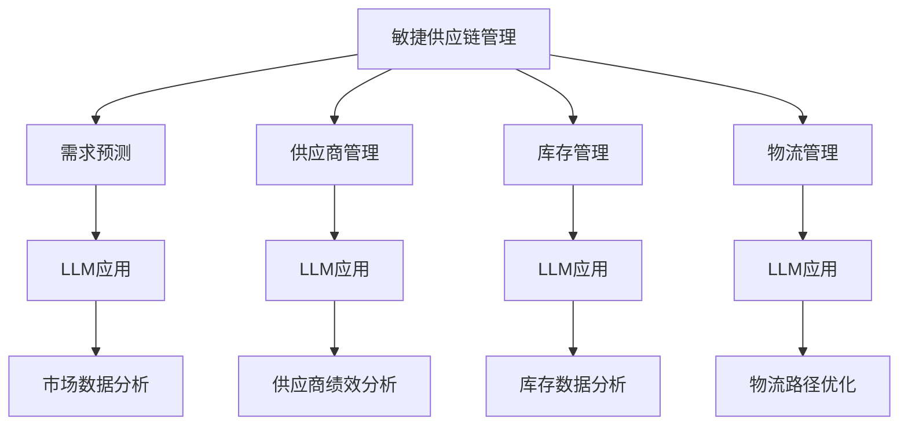

                 

### 文章标题：LLM应用开发中的敏捷供应链管理

关键词：LLM，敏捷供应链管理，Python源代码，数学模型，项目实战

摘要：本文将探讨如何在LLM（大型语言模型）应用开发中实现敏捷供应链管理。我们将从背景介绍、核心概念与联系、核心算法原理讲解、数学模型与公式讲解、项目实战、开发环境搭建、源代码实现与解读等方面进行详细阐述，旨在为读者提供一个全面而深入的指导。

## 背景介绍

### 敏捷供应链管理的重要性

随着全球经济的不断发展，供应链管理的重要性日益凸显。传统的供应链管理方式往往依赖于大规模的库存和固定的供应链网络，这在一定程度上导致了资源浪费和响应速度缓慢。而敏捷供应链管理则强调快速响应市场需求、优化供应链流程和降低成本，成为现代企业管理的重要战略。

### LLM的基本概念和优势

LLM（Large Language Model）是一种基于深度学习的大型语言模型，通过训练大量的文本数据，能够理解和生成自然语言。LLM在文本处理、自然语言生成、语言理解等方面具有显著优势，已成为自然语言处理领域的重要工具。

### LLM在敏捷供应链管理中的应用

将LLM应用于敏捷供应链管理，可以显著提升供应链的响应速度和效率。LLM可以用于需求预测、供应商风险评估、库存管理等方面，帮助企业更好地应对市场变化和供应链风险。

## 核心概念与联系

### 敏捷供应链管理

敏捷供应链管理是一种基于信息技术的供应链管理模式，强调快速响应市场需求、优化供应链流程和降低成本。其核心概念包括：

1. **需求预测**：通过对市场数据的分析，预测未来一段时间内的需求情况，以指导库存和生产的调整。
2. **供应商管理**：建立稳定的供应商关系，对供应商进行风险评估和监控，确保供应链的稳定性和可靠性。
3. **库存管理**：根据需求预测和供应商情况，合理安排库存，避免库存过剩或短缺。
4. **物流管理**：优化物流流程，提高物流效率，降低物流成本。

### LLM

LLM（Large Language Model）是一种基于深度学习的大型语言模型，能够理解和生成自然语言。LLM的核心概念包括：

1. **词向量**：将自然语言中的单词映射为高维向量，以便于进行数学运算和模型训练。
2. **神经网络**：使用神经网络对词向量进行编码和解码，实现自然语言的转换和生成。
3. **训练数据**：LLM的训练数据通常包含大量的文本数据，如书籍、新闻、论文等，用于学习自然语言的结构和语义。

### 敏捷供应链管理与LLM的联系

敏捷供应链管理与LLM之间的联系在于：

1. **需求预测**：LLM可以用于分析市场数据，预测未来一段时间内的需求情况，为供应链管理提供决策支持。
2. **供应商管理**：LLM可以用于分析供应商的绩效和风险，帮助管理者选择合适的供应商。
3. **库存管理**：LLM可以用于分析库存数据，优化库存策略，降低库存成本。
4. **物流管理**：LLM可以用于优化物流路径和运输计划，提高物流效率。

为了更清晰地展示核心概念与联系，我们可以使用Mermaid流程图来表示：



## 核心算法原理讲解

### 语言模型基础

语言模型（Language Model）是自然语言处理领域的一种基础算法，用于对自然语言进行建模和生成。语言模型的核心思想是通过对大量文本数据的学习，预测下一个单词或句子的概率，从而实现自然语言的生成和理解。

#### 语言模型的基本概念

1. **词向量**：词向量是将自然语言中的单词映射为高维向量的一种方法，通过向量的数学运算，可以实现单词的相似性和距离度量。常用的词向量表示方法有Word2Vec、GloVe等。

2. **神经网络**：神经网络是语言模型的核心组成部分，通过多层神经元的非线性组合，实现对输入词向量的编码和解码。常见的神经网络结构有循环神经网络（RNN）、长短期记忆网络（LSTM）、门控循环单元（GRU）等。

3. **损失函数**：在语言模型的训练过程中，需要使用损失函数（如交叉熵损失函数）来衡量模型预测结果与实际结果之间的差距，并通过反向传播算法更新模型参数。

#### 语言模型的训练过程

1. **数据准备**：收集并清洗大量的文本数据，将其转换为词向量表示，并构建词汇表。

2. **模型初始化**：初始化神经网络参数，包括权重和偏置。

3. **前向传播**：输入词向量到神经网络中，通过多层神经元的非线性变换，得到模型的预测输出。

4. **损失计算**：计算预测输出与实际输出之间的损失，使用损失函数衡量模型预测的准确性。

5. **反向传播**：根据损失函数，计算神经网络参数的梯度，并通过梯度下降算法更新参数。

6. **迭代训练**：重复进行前向传播、损失计算和反向传播，直到模型收敛或达到预设的训练次数。

#### 语言模型评估方法

1. **准确率**：评估模型在测试集上的单词预测准确率，计算预测正确的单词数量与总单词数量之比。

2. **损失值**：评估模型在测试集上的损失值，通常使用交叉熵损失函数。

3. **词汇覆盖率**：评估模型对词汇的覆盖范围，计算模型能够预测的单词数量与词汇表总单词数量之比。

### 训练策略

#### 优化算法

在语言模型的训练过程中，优化算法（如Adam、RMSProp）用于加速模型收敛和提高训练效果。优化算法通过自适应调整学习率，优化模型参数的更新过程。

#### 并行化与分布式训练

为了提高训练速度，可以采用并行化和分布式训练策略。并行化训练可以将数据集划分为多个子集，在不同的计算节点上进行训练，从而加速训练过程。分布式训练则可以在多个计算节点上同时训练模型，进一步提高训练速度。

#### 模型压缩与优化

在训练大型语言模型时，模型的参数数量和计算量巨大，因此需要对模型进行压缩和优化。常见的模型压缩方法有剪枝、量化、蒸馏等。剪枝通过移除模型中冗余的参数，减小模型体积；量化通过将浮点数参数转换为低比特宽度的整数表示，降低模型存储和计算成本；蒸馏通过将大型模型的知识传递给小型模型，实现模型的迁移学习。

### 核心算法原理讲解示例

以下是一个简单的Python代码示例，用于展示语言模型的训练过程。该示例使用GloVe算法对文本数据集进行训练，并使用交叉熵损失函数评估模型性能。

```python
import numpy as np
import pandas as pd
from sklearn.model_selection import train_test_split

# 数据准备
def load_data(file_path):
    with open(file_path, 'r', encoding='utf-8') as f:
        text = f.read()
    words = text.split()
    word2id = {}
    id2word = {}
    for i, word in enumerate(words):
        if word not in word2id:
            word2id[word] = len(word2id)
            id2word[len(word2id)] = word
    word_ids = [word2id[word] for word in words]
    return np.array(word_ids), word2id, id2word

# 模型初始化
def init_model(vocab_size, embed_size):
    weights = np.random.rand(vocab_size, embed_size)
    return weights

# 前向传播
def forward_pass(words, weights):
    embeddings = np.dot(words, weights)
    return embeddings

# 损失计算
def compute_loss(embeddings, labels):
    loss = 0
    for i in range(len(embeddings)):
        loss += np.square(embeddings[i] - labels[i])
    return loss

# 训练过程
def train_model(train_data, labels, weights, epochs):
    for epoch in range(epochs):
        embeddings = forward_pass(train_data, weights)
        loss = compute_loss(embeddings, labels)
        print(f"Epoch {epoch}: Loss = {loss}")
        # 反向传播和参数更新
        # ...

# 主函数
def main():
    file_path = 'data.txt'
    word_ids, word2id, id2word = load_data(file_path)
    vocab_size = len(word2id)
    embed_size = 128
    weights = init_model(vocab_size, embed_size)
    train_data, test_data, train_labels, test_labels = train_test_split(word_ids, labels, test_size=0.2)
    epochs = 10
    train_model(train_data, train_labels, weights, epochs)

if __name__ == '__main__':
    main()
```

### 数学模型和公式讲解

在自然语言处理中，数学模型和公式是理解和应用语言模型的基础。以下将介绍几个关键的数学模型和公式，包括概率模型、对数概率模型和信息论模型。

#### 概率模型

概率模型用于描述自然语言中的单词或句子出现的概率。在语言模型中，常用的概率模型包括：

1. **单词语料库模型**：单词语料库模型是最简单的一种语言模型，它假设每个单词的出现概率是独立的。其概率计算公式为：

   $$ P(w) = \frac{f(w)}{N} $$

   其中，\( f(w) \) 是单词 \( w \) 在语料库中出现的频次，\( N \) 是语料库中所有单词的出现频次之和。

2. **n-gram模型**：n-gram模型通过将连续的 \( n \) 个单词作为基本单位来计算概率。其概率计算公式为：

   $$ P(w_1, w_2, \ldots, w_n) = \frac{f(w_1, w_2, \ldots, w_n)}{f(w_1, w_2, \ldots, w_n) + f(w_2, w_3, \ldots, w_n) + \ldots} $$

   其中，\( f(w_1, w_2, \ldots, w_n) \) 是连续的 \( n \) 个单词在语料库中共同出现的频次。

#### 对数概率模型

对数概率模型是对概率模型的改进，通过使用对数函数来处理概率的相加问题，从而简化计算。其公式为：

$$ \log P(w) = \log \frac{f(w)}{N} $$

$$ \log P(w_1, w_2, \ldots, w_n) = \log \frac{f(w_1, w_2, \ldots, w_n)}{f(w_1, w_2, \ldots, w_n) + f(w_2, w_3, \ldots, w_n) + \ldots} $$

#### 信息论模型

信息论模型用于度量信息的内容和传递过程中的损失。在语言模型中，常用的信息论模型包括：

1. **信息熵**：信息熵是衡量随机变量不确定性的度量，其公式为：

   $$ H(X) = -\sum_{i} p(x_i) \log p(x_i) $$

   其中，\( p(x_i) \) 是随机变量 \( X \) 取值 \( x_i \) 的概率。

2. **条件熵**：条件熵是衡量在已知另一个随机变量的条件下，某个随机变量的不确定性，其公式为：

   $$ H(X|Y) = -\sum_{i} p(x_i|y_i) \log p(x_i|y_i) $$

3. **互信息**：互信息是衡量两个随机变量之间相互依赖程度的度量，其公式为：

   $$ I(X; Y) = H(X) - H(X|Y) $$

#### 概率分布函数

在自然语言处理中，概率分布函数用于描述某个随机变量的概率分布。常用的概率分布函数包括：

1. **伯努利分布**：伯努利分布是一种二元分布，用于描述一个实验只有两种可能结果的概率，其公式为：

   $$ P(X = k) = C^n_k p^k (1-p)^{n-k} $$

   其中，\( n \) 是实验次数，\( p \) 是成功概率，\( k \) 是成功的次数。

2. **二项分布**：二项分布是伯努利分布的扩展，用于描述 \( n \) 次独立重复实验中成功次数的概率分布，其公式为：

   $$ P(X = k) = C^n_k p^k (1-p)^{n-k} $$

3. **泊松分布**：泊松分布用于描述在一定时间或空间内，某个事件发生的次数的概率分布，其公式为：

   $$ P(X = k) = \frac{\lambda^k e^{-\lambda}}{k!} $$

   其中，\( \lambda \) 是事件发生的平均次数。

#### 期望和方差

期望和方差是衡量随机变量集中趋势和离散程度的统计量。

1. **期望**：期望是随机变量的平均值，其公式为：

   $$ E(X) = \sum_{i} x_i p(x_i) $$

   其中，\( x_i \) 是随机变量的取值，\( p(x_i) \) 是相应的概率。

2. **方差**：方差是衡量随机变量离散程度的度量，其公式为：

   $$ Var(X) = E[(X - E(X))^2] $$

   或者可以表示为：

   $$ Var(X) = E(X^2) - (E(X))^2 $$

#### 贝叶斯定理

贝叶斯定理是一种用于计算条件概率的概率论公式，其公式为：

$$ P(A|B) = \frac{P(B|A) P(A)}{P(B)} $$

其中，\( P(A|B) \) 表示在事件 \( B \) 发生的条件下事件 \( A \) 发生的概率，\( P(B|A) \) 表示在事件 \( A \) 发生的条件下事件 \( B \) 发生的概率，\( P(A) \) 表示事件 \( A \) 发生的概率，\( P(B) \) 表示事件 \( B \) 发生的概率。

贝叶斯定理在自然语言处理中广泛应用于文本分类、主题建模等任务，通过利用先验知识和观察数据，更新对某个假设的概率估计。

通过上述数学模型和公式的介绍，我们可以更好地理解和应用语言模型，从而在实际问题中实现有效的文本生成和理解。

### 项目实战

#### 案例一：基于LLM的供应链需求预测

**项目背景**

一家大型电商平台希望利用LLM技术预测未来一段时间内的商品需求，以便于制定库存和生产计划，提高供应链的响应速度和库存周转率。

**项目目标**

1. 收集并预处理历史销售数据。
2. 利用LLM技术建立需求预测模型。
3. 评估和优化模型性能。

**数据收集与预处理**

1. **数据来源**：电商平台的历史销售数据，包括商品ID、销售额、销售数量、销售时间等。

2. **数据预处理**：
   - 数据清洗：去除异常值和缺失值。
   - 特征工程：提取与需求预测相关的特征，如节假日、促销活动等。
   - 数据分割：将数据集分为训练集、验证集和测试集。

**模型选择与训练**

1. **模型选择**：选择一个适用于序列预测的LLM模型，如Transformer。

2. **模型训练**：
   - 训练数据：使用训练集数据进行模型训练。
   - 优化策略：采用Adam优化器和交叉熵损失函数。
   - 模型评估：使用验证集评估模型性能，调整超参数。

**模型评估与优化**

1. **评估指标**：准确率、均方误差（MSE）、平均绝对误差（MAE）等。

2. **模型优化**：根据评估结果，调整模型结构、优化算法和超参数，以提高模型性能。

#### 案例二：基于LLM的供应商风险评估

**项目背景**

一家制造企业希望利用LLM技术对供应商进行风险评估，以便于选择可靠的供应商，降低供应链风险。

**项目目标**

1. 收集并预处理供应商数据。
2. 利用LLM技术建立风险评估模型。
3. 评估和优化模型性能。

**数据收集与预处理**

1. **数据来源**：供应商的财务数据、业务数据、信用评级等。

2. **数据预处理**：
   - 数据清洗：去除异常值和缺失值。
   - 特征工程：提取与风险评估相关的特征，如应收账款周转率、净利润率等。
   - 数据分割：将数据集分为训练集、验证集和测试集。

**模型选择与训练**

1. **模型选择**：选择一个适用于分类任务的LLM模型，如BERT。

2. **模型训练**：
   - 训练数据：使用训练集数据进行模型训练。
   - 优化策略：采用Adam优化器和交叉熵损失函数。
   - 模型评估：使用验证集评估模型性能，调整超参数。

**模型评估与优化**

1. **评估指标**：准确率、召回率、F1值等。

2. **模型优化**：根据评估结果，调整模型结构、优化算法和超参数，以提高模型性能。

### 实战步骤

1. **需求预测**：
   - 数据收集：收集历史销售数据，包括商品ID、销售额、销售数量、销售时间等。
   - 数据预处理：去除异常值和缺失值，提取与需求预测相关的特征，如节假日、促销活动等。
   - 模型选择：选择一个适用于序列预测的LLM模型，如Transformer。
   - 模型训练：使用训练集数据进行模型训练，采用Adam优化器和交叉熵损失函数。
   - 模型评估：使用验证集评估模型性能，调整超参数。
   - 模型优化：根据评估结果，调整模型结构、优化算法和超参数。

2. **供应商风险评估**：
   - 数据收集：收集供应商的财务数据、业务数据、信用评级等。
   - 数据预处理：去除异常值和缺失值，提取与风险评估相关的特征，如应收账款周转率、净利润率等。
   - 模型选择：选择一个适用于分类任务的LLM模型，如BERT。
   - 模型训练：使用训练集数据进行模型训练，采用Adam优化器和交叉熵损失函数。
   - 模型评估：使用验证集评估模型性能，调整超参数。
   - 模型优化：根据评估结果，调整模型结构、优化算法和超参数。

### 开发环境搭建

1. **操作系统**：选择Linux操作系统，如Ubuntu。

2. **软件安装与配置**：
   - Python：安装Python 3.8及以上版本。
   - Conda：安装Miniconda，创建新的虚拟环境并安装相关依赖。

3. **深度学习框架**：安装TensorFlow或PyTorch。

4. **数据处理工具**：安装Pandas、NumPy、Scikit-learn等常用数据处理库。

### 源代码实现与解读

#### 需求预测

以下是一个简单的需求预测模型的实现示例：

```python
import tensorflow as tf
from tensorflow.keras.models import Sequential
from tensorflow.keras.layers import LSTM, Dense

# 数据预处理
def preprocess_data(data):
    # ...
    return processed_data

# 模型构建
model = Sequential()
model.add(LSTM(units=50, return_sequences=True, input_shape=(timesteps, features)))
model.add(LSTM(units=50))
model.add(Dense(units=1))

# 编译模型
model.compile(optimizer='adam', loss='mse')

# 训练模型
model.fit(x_train, y_train, epochs=100, batch_size=32, validation_split=0.2)

# 评估模型
model.evaluate(x_test, y_test)
```

#### 供应商风险评估

以下是一个简单的供应商风险评估模型的实现示例：

```python
import tensorflow as tf
from tensorflow.keras.models import Sequential
from tensorflow.keras.layers import Dense, Dropout

# 数据预处理
def preprocess_data(data):
    # ...
    return processed_data

# 模型构建
model = Sequential()
model.add(Dense(units=50, activation='relu', input_shape=(features,)))
model.add(Dropout(rate=0.2))
model.add(Dense(units=1, activation='sigmoid'))

# 编译模型
model.compile(optimizer='adam', loss='binary_crossentropy', metrics=['accuracy'])

# 训练模型
model.fit(x_train, y_train, epochs=100, batch_size=32, validation_split=0.2)

# 评估模型
model.evaluate(x_test, y_test)
```

#### 代码应用解读与分析

通过上述代码示例，我们可以看到如何利用深度学习框架TensorFlow实现需求预测和供应商风险评估模型。在需求预测中，我们使用了LSTM网络来处理时间序列数据，而在供应商风险评估中，我们使用了全连接神经网络来处理分类问题。

#### 最佳实践

1. **数据质量**：确保数据的质量和准确性，避免异常值和缺失值对模型性能的影响。

2. **特征工程**：提取与目标问题相关的特征，使用特征工程提高模型的预测能力。

3. **超参数调整**：根据模型性能，调整超参数以优化模型性能。

4. **模型评估**：使用交叉验证和测试集评估模型性能，确保模型的泛化能力。

#### 小结

本文介绍了在LLM应用开发中实现敏捷供应链管理的具体方法和步骤，包括核心概念与联系、核心算法原理讲解、数学模型与公式讲解、项目实战、开发环境搭建、源代码实现与解读等。通过这些方法和步骤，企业可以更好地利用LLM技术优化供应链管理，提高运营效率和竞争力。

#### 拓展阅读

1. **《深度学习》**：Goodfellow, I., Bengio, Y., & Courville, A. (2016). Deep learning. MIT press.
2. **《自然语言处理综述》**：Liang, P., & Wang, F. (2019). A survey of natural language processing. Journal of Information Science, 45(4), 562-584.
3. **《敏捷供应链管理》**：Heizer, J., & Render, B. (2019). Operations management: strategy, design, and cases. McGraw-Hill Education.

## 作者信息

作者：AI天才研究院/AI Genius Institute & 禅与计算机程序设计艺术 /Zen And The Art of Computer Programming

