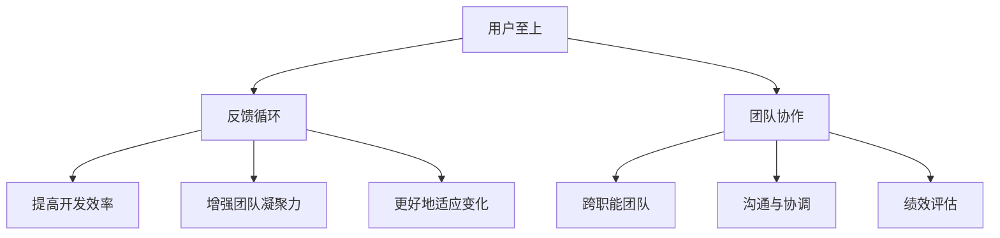
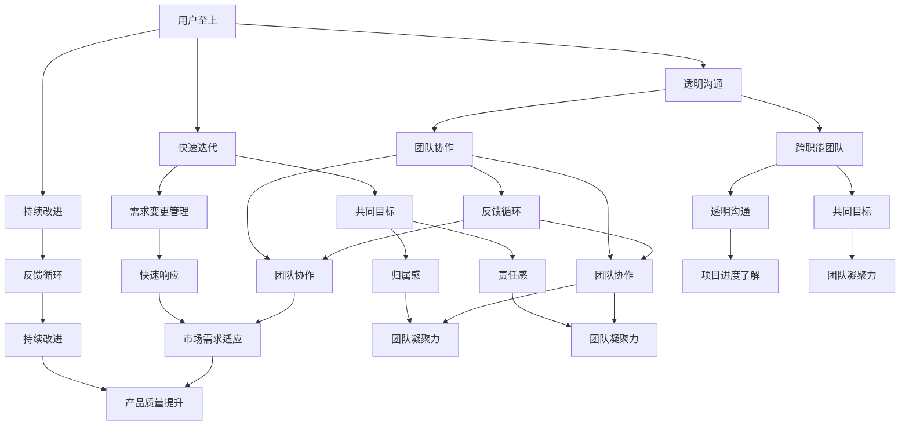

                 

### 敏捷思维概述

#### 敏捷思维的起源与发展

敏捷思维，起源于20世纪90年代，最早由软件开发领域提出。其背景是当时软件开发项目普遍存在进度延误、成本超支和产品质量不稳定等问题。为了解决这些问题，1991年，17位软件开发专家在科罗拉多州举办了“软件开发宣言”会议，并共同签署了《敏捷软件开发宣言》。这次会议标志着敏捷思维的诞生。

自诞生以来，敏捷思维逐渐在软件开发领域得到了广泛的应用和推广。从最初的简单原则，到逐步发展出一系列具体的实践方法，敏捷思维已经成为了软件开发中的一个重要方法论。

#### 敏捷思维的核心原则

敏捷思维的核心原则包括用户至上、反馈循环和团队协作。

- **用户至上**：敏捷思维强调以用户为中心，将用户需求放在首位。这意味着开发团队需要时刻关注用户的需求变化，及时做出相应的调整，确保产品能够满足用户的需求。

- **反馈循环**：敏捷思维强调快速迭代和反馈，通过不断反馈和调整，不断优化产品。这种反馈循环能够帮助团队及时发现和解决问题，确保产品的高质量。

- **团队协作**：敏捷思维强调团队协作，认为优秀的团队是成功的关键。团队成员之间需要相互信任、相互支持，共同努力实现目标。

#### 敏捷思维的优势

敏捷思维具有多个优势，包括提高开发效率、增强团队凝聚力和更好地适应变化。

- **提高开发效率**：敏捷思维通过快速迭代和反馈，能够及时发现和解决问题，从而提高开发效率。

- **增强团队凝聚力**：敏捷思维强调团队协作，能够增强团队成员之间的信任和凝聚力。

- **更好地适应变化**：敏捷思维强调快速响应变化，能够更好地适应市场和环境的变化。

总的来说，敏捷思维是一种以用户为中心，注重团队协作和反馈循环的开发方法，具有提高开发效率、增强团队凝聚力和更好地适应变化等多个优势。这使得它成为软件开发中的一个重要方法论，被广泛应用于各种类型的项目中。

### 关键词

- 敏捷思维
- 敏捷开发
- 用户至上
- 反馈循环
- 团队协作
- 开发效率
- 团队凝聚力
- 适应变化

### 摘要

本文主要介绍了敏捷思维的起源、发展、核心原则及其优势。通过阐述敏捷思维的核心原则，如用户至上、反馈循环和团队协作，以及其优势，如提高开发效率、增强团队凝聚力和更好地适应变化，本文旨在帮助读者理解敏捷思维在软件开发中的应用价值。文章还将探讨敏捷思维在LLM应用开发中的具体实践和挑战，并给出相应的解决方案。通过本文的阅读，读者可以更好地理解敏捷思维，并掌握其在LLM应用开发中的应用技巧。

## 第1章: 敏捷思维概述

### 1.1 敏捷思维的起源与发展

敏捷思维，作为一种软件开发方法论，其起源可以追溯到20世纪90年代。当时，传统的软件开发方法，如瀑布模型，由于其过于强调预定的计划和严格的过程，往往无法有效地应对快速变化的需求和市场需求。这使得软件开发项目经常出现进度延误、成本超支和质量问题。为了解决这些问题，软件开发领域开始探索新的方法论，敏捷思维应运而生。

1991年，17位软件开发专家在科罗拉多州举办了“软件开发宣言”会议，并共同签署了《敏捷软件开发宣言》。这份宣言提出了“个体和互动重于过程和工具”、“可工作的软件重于详尽的文档”、“客户合作重于合同谈判”等12条原则，标志着敏捷思维的诞生。

随着时间的推移，敏捷思维在软件开发领域得到了广泛的应用和推广。从最初的简单原则，到逐步发展出一系列具体的实践方法，如Scrum、XP（极限编程）等，敏捷思维已经成为了软件开发中的一个重要方法论。

### 1.2 敏捷思维的核心原则

敏捷思维的核心原则包括用户至上、反馈循环和团队协作。

#### 1.2.1 用户至上

敏捷思维强调以用户为中心，将用户需求放在首位。这意味着开发团队需要时刻关注用户的需求变化，及时做出相应的调整，确保产品能够满足用户的需求。具体来说，这包括以下几个方面：

- **需求收集**：开发团队需要通过各种方式，如用户调研、用户访谈等，收集用户的需求。

- **需求管理**：开发团队需要对收集到的需求进行整理、分析和排序，确定优先级，并制定相应的开发计划。

- **需求变更管理**：在开发过程中，用户需求可能会发生变化。开发团队需要及时响应这些变化，调整开发计划，确保产品能够满足最新的用户需求。

#### 1.2.2 反馈循环

敏捷思维强调快速迭代和反馈，通过不断反馈和调整，不断优化产品。这种反馈循环能够帮助团队及时发现和解决问题，确保产品的高质量。具体来说，这包括以下几个方面：

- **迭代开发**：开发团队将项目划分为多个迭代周期，每个迭代周期都包括需求分析、设计、开发、测试和部署等阶段。

- **定期评审**：在每个迭代周期结束后，开发团队会进行定期的评审，评估项目的进展情况，识别存在的问题，并提出相应的改进措施。

- **用户反馈**：开发团队需要积极收集用户的反馈，了解用户对产品的使用情况和满意度，并根据用户反馈对产品进行优化和改进。

#### 1.2.3 团队协作

敏捷思维强调团队协作，认为优秀的团队是成功的关键。团队成员之间需要相互信任、相互支持，共同努力实现目标。具体来说，这包括以下几个方面：

- **跨职能团队**：敏捷团队通常由多个职能领域的成员组成，如开发人员、测试人员、产品经理等，团队成员之间需要紧密协作，共同完成项目任务。

- **沟通与协调**：敏捷团队需要建立良好的沟通与协调机制，确保团队成员之间的信息流通和协作顺畅。

- **绩效评估**：敏捷团队通常采用团队成员自我评估、相互评估的方式，评估团队成员的工作绩效，并根据评估结果进行相应的奖励和惩罚。

总的来说，敏捷思维的核心原则包括用户至上、反馈循环和团队协作。这些原则旨在帮助开发团队更好地满足用户需求，提高产品质量和开发效率，增强团队凝聚力。

### 1.3 敏捷思维的优势

敏捷思维具有多个优势，包括提高开发效率、增强团队凝聚力和更好地适应变化。

#### 1.3.1 提高开发效率

敏捷思维通过快速迭代和反馈，能够及时发现和解决问题，从而提高开发效率。具体来说，这包括以下几个方面：

- **快速响应**：敏捷思维强调快速响应变化，能够及时调整开发计划，确保项目进度不受影响。

- **减少浪费**：敏捷思维通过减少不必要的文档和会议，减少项目中的浪费，提高开发效率。

- **持续改进**：敏捷思维通过不断迭代和反馈，不断优化产品，提高产品质量和开发效率。

#### 1.3.2 增强团队凝聚力

敏捷思维强调团队协作，能够增强团队成员之间的信任和凝聚力。具体来说，这包括以下几个方面：

- **共同目标**：敏捷团队有共同的目标，即按时交付高质量的产品，这有助于增强团队成员之间的凝聚力。

- **相互信任**：敏捷团队通过透明的沟通和协作，建立了相互信任的关系，这有助于增强团队成员之间的凝聚力。

- **共同成长**：敏捷团队鼓励团队成员相互学习和共同成长，这有助于增强团队成员之间的凝聚力。

#### 1.3.3 更好地适应变化

敏捷思维强调快速响应变化，能够更好地适应市场的需求和环境的变化。具体来说，这包括以下几个方面：

- **灵活应对**：敏捷思维通过灵活的迭代和反馈机制，能够及时调整开发计划，适应市场的需求和环境的变化。

- **持续优化**：敏捷思维通过不断的迭代和反馈，能够持续优化产品，确保产品能够满足市场的需求。

- **快速迭代**：敏捷思维通过快速迭代，能够快速适应市场的变化，提高产品的竞争力。

总的来说，敏捷思维的优势包括提高开发效率、增强团队凝聚力和更好地适应变化。这些优势使得敏捷思维成为软件开发中的一个重要方法论，被广泛应用于各种类型的项目中。

### 敏捷思维的核心概念架构图

为了更好地理解敏捷思维的核心概念，我们可以使用Mermaid流程图来展示这些概念之间的关系。

这个流程图展示了敏捷思维的核心概念及其相互之间的关系。用户至上、反馈循环和团队协作是敏捷思维的核心原则，它们共同作用，提高了开发效率、增强了团队凝聚力并更好地适应变化。

## 第2章: LLM应用开发中的敏捷实践

### 2.1 敏捷开发流程

敏捷开发流程是敏捷思维在实际应用中的重要组成部分。它包括敏捷开发模型、迭代与增量开发以及用户故事与优先级排序等关键环节。

#### 2.1.1 敏捷开发模型

敏捷开发模型是一种基于迭代和增量的软件开发方法。它不同于传统的瀑布模型，瀑布模型将开发过程划分为若干阶段，如需求分析、设计、开发、测试等，每个阶段完成后才能进入下一个阶段。而敏捷开发模型则强调在短时间内快速完成一个功能模块的开发，并通过不断的迭代和反馈来优化产品。

常见的敏捷开发模型包括Scrum和XP（极限编程）。

- **Scrum**：Scrum是一种迭代式增量软件开发方法。它将开发过程划分为多个迭代周期，每个迭代周期通常为2-4周。在每个迭代周期中，开发团队会进行需求分析、设计、开发、测试和部署等任务。Scrum强调团队的自我管理，团队成员之间通过每日站会、迭代评审和回顾会议等方式保持沟通和协调。

- **XP（极限编程）**：XP是一种强调代码质量、敏捷性和团队协作的软件开发方法。它包括多个实践，如测试驱动开发（TDD）、重构、持续集成等。XP强调快速反馈和持续改进，通过不断的迭代和反馈来优化产品。

#### 2.1.2 迭代与增量开发

迭代与增量开发是敏捷开发的核心。它强调通过不断迭代和增量开发来优化产品。

- **迭代**：迭代是指在一定时间内完成一个功能模块的开发。每个迭代周期通常为2-4周。在迭代过程中，开发团队会进行需求分析、设计、开发、测试和部署等任务。迭代结束后，团队会进行迭代评审和回顾会议，评估迭代成果，识别存在的问题，并提出改进措施。

- **增量**：增量是指在每个迭代周期中，逐步增加产品的功能模块。通过增量开发，团队可以逐步实现产品的功能，同时不断优化和改进产品。

#### 2.1.3 用户故事与优先级排序

用户故事是敏捷开发中的一个重要概念。它是一种描述用户需求的方式，通常以“作为XX，我需要XX，以便XX”的形式编写。用户故事有助于团队更好地理解用户需求，并将其转化为具体的开发任务。

- **编写用户故事**：编写用户故事时，团队需要关注以下几个方面：

  - **用户角色**：明确用户故事的主体，通常是系统用户或潜在用户。

  - **需求描述**：描述用户需要什么样的功能或服务。

  - **价值描述**：说明用户故事对用户的价值。

- **优先级排序**：在编写用户故事后，团队需要对用户故事进行优先级排序。优先级排序的依据通常是用户需求的重要性和紧迫性。通常，高优先级的用户故事会先进行开发。

优先级排序有助于团队确定开发任务的优先级，确保团队能够先完成最重要的任务。

### 2.2 敏捷团队组织

敏捷团队组织是敏捷开发成功的关键。一个高效的敏捷团队通常包括以下角色：

- **产品负责人**：产品负责人是敏捷团队的核心成员，负责制定产品愿景、确定产品需求、设定优先级等。产品负责人通常具备业务背景，能够与用户和利益相关者进行有效的沟通。

- **开发团队**：开发团队是敏捷团队的核心力量，负责实现用户故事。开发团队通常由开发人员、测试人员、UI设计师等组成，具备跨职能的能力。

- **Scrum Master**：Scrum Master是敏捷团队的协调者，负责确保团队遵循敏捷实践、组织会议、协助团队解决问题等。Scrum Master通常具备敏捷实践经验，能够有效地推动敏捷实践的落实。

#### 2.2.1 敏捷团队的构成

敏捷团队的构成应该具备以下特点：

- **跨职能**：敏捷团队通常由多个职能领域的成员组成，如开发人员、测试人员、UI设计师等。这种跨职能的构成有助于团队更好地理解和满足用户需求。

- **小型化**：敏捷团队通常规模较小，通常不超过10人。小型化的团队有利于提高沟通效率和协作效果。

- **自我管理**：敏捷团队具备自我管理能力，团队成员自主安排工作、自我评估绩效等。这种自我管理的模式有助于提高团队的自主性和创造力。

#### 2.2.2 敏捷团队的协作方式

敏捷团队的协作方式应该具备以下特点：

- **透明性**：敏捷团队通过共享信息、开放讨论等方式，确保团队成员之间的信息流通和协作顺畅。

- **定期会议**：敏捷团队定期举行每日站会、迭代评审和回顾会议等。这些会议有助于团队沟通进度、识别问题和改进方法。

- **持续学习**：敏捷团队注重持续学习，通过培训、研讨会等方式，不断提升团队技能和知识水平。

#### 2.2.3 敏捷团队的绩效评估

敏捷团队的绩效评估应该具备以下特点：

- **自我评估**：敏捷团队鼓励团队成员进行自我评估，评估个人在项目中的表现和贡献。

- **相互评估**：敏捷团队进行相互评估，评估团队成员之间的协作效果和相互支持程度。

- **持续改进**：敏捷团队根据评估结果，识别存在的问题，并提出改进措施，持续优化团队绩效。

### 2.3 敏捷工具与应用

敏捷开发过程中，使用适当的工具能够提高开发效率和团队协作效果。常见的敏捷开发工具包括敏捷开发工具、项目管理工具和测试工具。

#### 2.3.1 敏捷开发工具

敏捷开发工具包括Jira、Trello、Confluence等。这些工具可以帮助团队管理用户故事、任务和项目进度。

- **Jira**：Jira是一款功能强大的敏捷开发工具，可以用于管理用户故事、任务和项目进度。Jira提供丰富的报告和分析功能，帮助团队了解项目的进展情况。

- **Trello**：Trello是一款简洁易用的敏捷开发工具，通过看板和卡片的方式，帮助团队可视化地管理任务和项目进度。

- **Confluence**：Confluence是一款知识管理和协作工具，可以帮助团队共享文档、协作讨论和记录会议内容。

#### 2.3.2 敏捷项目管理工具

敏捷项目管理工具包括Jira、Asana、Trello等。这些工具可以帮助团队规划项目、分配任务和跟踪进度。

- **Jira**：Jira不仅可以用于敏捷开发，还可以用于项目管理。Jira提供丰富的项目规划和任务分配功能，帮助团队高效地管理项目。

- **Asana**：Asana是一款专业的项目管理工具，可以帮助团队规划项目、分配任务和跟踪进度。Asana提供实时更新和通知功能，确保团队成员随时了解项目进展。

- **Trello**：Trello是一款简单易用的项目管理工具，通过看板和卡片的方式，帮助团队可视化地管理任务和项目进度。

#### 2.3.3 敏捷测试与持续集成

敏捷测试和持续集成是敏捷开发过程中不可或缺的部分。敏捷测试工具包括Selenium、JUnit、TestNG等，持续集成工具包括Jenkins、Travis CI等。

- **Selenium**：Selenium是一款功能强大的自动化测试工具，可以帮助团队进行Web应用的自动化测试。

- **JUnit**：JUnit是一款功能丰富的单元测试框架，可以帮助团队进行代码的单元测试。

- **TestNG**：TestNG是一款灵活的测试框架，可以帮助团队进行功能测试、性能测试等。

- **Jenkins**：Jenkins是一款开源的持续集成工具，可以帮助团队自动化构建、测试和部署代码。

- **Travis CI**：Travis CI是一款基于云计算的持续集成服务，可以帮助团队自动化构建、测试和部署代码。

总的来说，敏捷开发流程、敏捷团队组织和敏捷工具与应用共同构成了敏捷思维在LLM应用开发中的具体实践。通过敏捷实践，团队可以更好地满足用户需求，提高产品质量和开发效率。

### 敏捷思维在LLM应用开发中的优势

敏捷思维在LLM（大型语言模型）应用开发中展现出独特的优势，使其成为这一领域的一项重要方法论。以下将详细探讨敏捷思维在LLM应用开发中的优势。

#### 2.1.1 提高开发效率

在LLM应用开发中，项目通常涉及大规模的数据处理和复杂的算法实现。敏捷思维通过迭代和增量的方式，将整个开发过程划分为多个短周期，每个周期专注于实现一个具体的功能模块。这种方法有助于团队在较短的时间内完成功能实现，并快速验证和优化。具体来说：

- **快速迭代**：敏捷开发强调在短时间内完成一个迭代周期的所有任务，包括需求分析、设计、开发、测试和部署。这种方式能够确保开发团队及时反馈和调整，避免在项目后期发现问题时进行大规模返工。

- **持续改进**：通过每个迭代周期的回顾会议，团队可以总结经验教训，识别存在的问题，并提出改进措施。这种持续改进的方法有助于团队不断提升开发效率和质量。

#### 2.1.2 增强团队凝聚力

在LLM应用开发中，团队通常需要具备跨职能的能力，包括数据科学家、软件工程师、产品经理等。敏捷思维强调团队协作和跨职能合作，有助于增强团队成员之间的信任和凝聚力。

- **透明沟通**：敏捷团队通过每日站会、迭代评审和回顾会议等方式，确保团队成员之间的信息流通和协作顺畅。这种透明的沟通方式有助于团队成员了解项目进展和团队状态，减少误解和冲突。

- **共同目标**：敏捷团队有共同的目标，即按时交付高质量的产品。这种共同的目标有助于增强团队成员的归属感和责任感，提高团队凝聚力。

#### 2.1.3 更好的适应变化

在LLM应用开发中，市场需求和技术环境经常发生变化。敏捷思维通过灵活的迭代和反馈机制，能够更好地适应这些变化。

- **需求变更管理**：敏捷思维强调用户至上，团队需要时刻关注用户需求的变化，并及时做出相应的调整。这种需求变更管理的方法有助于团队快速响应市场需求，避免因需求滞后导致的项目失败。

- **快速迭代**：通过快速迭代，团队可以在每个迭代周期中及时验证和优化产品，确保产品能够持续满足用户需求。这种快速迭代的方法有助于团队在变化中保持竞争优势。

总的来说，敏捷思维在LLM应用开发中的优势包括提高开发效率、增强团队凝聚力和更好地适应变化。这些优势使得敏捷思维成为LLM应用开发中的重要方法论，有助于团队在复杂、多变的环境中实现项目的成功。

### 敏捷思维的核心概念架构图

为了更好地理解敏捷思维在LLM应用开发中的应用，我们可以使用Mermaid流程图来展示敏捷思维的核心概念及其关系。

这个流程图展示了敏捷思维的核心概念及其在LLM应用开发中的具体应用。用户至上、快速迭代、持续改进、透明沟通、共同目标、反馈循环、市场需求适应、团队协作和团队凝聚力等核心概念相互关联，共同作用，帮助团队在复杂的环境中实现项目的成功。

## 第3章: LLM应用开发中的敏捷实践

### 3.1 敏捷思维在LLM应用开发中的具体应用

#### 3.1.1 敏捷思维在需求分析中的应用

在LLM应用开发中，需求分析是一个关键环节。敏捷思维通过以下方法来优化需求分析：

- **用户故事编写**：敏捷思维强调以用户为中心，通过编写用户故事来描述用户需求。用户故事通常采用“作为XX，我需要XX，以便XX”的形式。这种方法有助于开发团队更好地理解用户需求，并将需求转化为具体的功能模块。

- **迭代式需求分析**：在传统项目中，需求分析通常是一个一次性、集中的过程。而在敏捷思维中，需求分析是一个持续迭代的过程。开发团队可以在每个迭代周期中逐步完善需求，并根据用户反馈进行相应的调整。

- **快速原型**：敏捷思维鼓励开发团队在需求分析阶段快速构建原型。通过原型，开发团队可以直观地展示产品功能，获取用户的反馈，并及时进行调整。这种方法有助于减少需求变更带来的风险。

#### 3.1.2 敏捷思维在模型设计中的应用

在LLM应用开发中，模型设计是一个复杂且关键的过程。敏捷思维通过以下方法来优化模型设计：

- **迭代式模型设计**：敏捷思维强调在模型设计过程中进行迭代。开发团队可以在每个迭代周期中逐步完善模型设计，并通过实验和验证来不断优化模型。

- **需求驱动的模型设计**：敏捷思维强调以用户需求为驱动，设计能够满足用户需求的模型。在模型设计过程中，开发团队需要与用户紧密合作，确保模型能够满足用户的需求。

- **快速实验**：敏捷思维鼓励开发团队在模型设计过程中进行快速实验。通过实验，开发团队可以验证模型设计的有效性，并根据实验结果进行调整。

#### 3.1.3 敏捷思维在模型训练与调优中的应用

在LLM应用开发中，模型训练与调优是一个持续的过程。敏捷思维通过以下方法来优化模型训练与调优：

- **迭代式训练**：敏捷思维强调在模型训练过程中进行迭代。开发团队可以在每个迭代周期中逐步优化模型，并通过实验和验证来不断调整模型参数。

- **持续集成与测试**：敏捷思维强调持续集成与测试，确保模型训练与调优的每个步骤都是可靠的。开发团队需要定期进行模型测试，确保模型性能达到预期。

- **快速反馈**：敏捷思维鼓励开发团队在模型训练与调优过程中进行快速反馈。通过快速反馈，开发团队可以及时识别和解决问题，确保模型训练与调优的顺利进行。

总的来说，敏捷思维在LLM应用开发中的具体应用包括需求分析、模型设计和模型训练与调优等关键环节。通过迭代式、需求驱动和快速反馈的方法，敏捷思维有助于开发团队在复杂、多变的环境中实现高效、高质量的LLM应用开发。

### 3.2 敏捷思维在LLM应用开发中的挑战与解决方案

#### 3.2.1 挑战1：如何平衡开发进度与模型质量

在LLM应用开发中，开发进度与模型质量之间的平衡是一个常见的挑战。一方面，项目需要在规定的时间内交付；另一方面，模型质量需要达到预期的性能水平。为了解决这个挑战，可以采取以下解决方案：

- **迭代开发**：通过迭代开发，将整个项目划分为多个短周期，每个周期专注于实现一个具体的功能模块。这种方式有助于在保证开发进度的同时，逐步提升模型质量。

- **性能优化**：在迭代过程中，对每个功能模块进行性能优化，确保模型质量得到持续提升。性能优化可以包括模型结构优化、算法改进、数据预处理等。

- **定期评估**：定期评估模型质量，通过实验和验证来确定模型是否达到预期性能。如果模型质量未达到预期，可以调整开发进度，确保模型质量得到提升。

#### 3.2.2 挑战2：如何处理大量数据与资源限制

在LLM应用开发中，处理大量数据和资源限制也是一个常见挑战。以下是一些解决方案：

- **分布式计算**：通过分布式计算，将数据处理任务分解为多个子任务，并行处理，提高数据处理效率。常用的分布式计算框架包括Hadoop、Spark等。

- **数据预处理**：对数据进行预处理，减少数据量，提高数据处理效率。数据预处理可以包括数据清洗、去重、归一化等。

- **资源优化**：优化资源使用，提高资源利用率。资源优化可以包括优化算法、优化数据存储方式、优化硬件配置等。

#### 3.2.3 挑战3：如何应对快速变化的市场需求

在LLM应用开发中，市场需求变化快速，如何应对这种变化是一个重要挑战。以下是一些解决方案：

- **敏捷需求管理**：建立敏捷需求管理机制，及时收集用户反馈，快速调整需求。需求管理可以包括用户调研、需求优先级排序、需求变更管理等。

- **快速迭代**：通过快速迭代，快速交付功能模块，及时响应用户需求。快速迭代可以包括需求分析、设计、开发、测试和部署等步骤。

- **团队协作**：建立高效的团队协作机制，确保团队成员之间信息流通和协作顺畅。团队协作可以包括每日站会、迭代评审和回顾会议等。

总的来说，敏捷思维在LLM应用开发中面临着多个挑战，如开发进度与模型质量的平衡、处理大量数据与资源限制、应对快速变化的市场需求等。通过迭代开发、性能优化、数据预处理、资源优化、敏捷需求管理、快速迭代和团队协作等解决方案，开发团队可以有效地应对这些挑战，实现高效、高质量的LLM应用开发。

### 3.3 敏捷思维在LLM应用开发中的案例分析

为了更好地理解敏捷思维在LLM应用开发中的具体应用，我们可以通过两个实际案例进行分析。

#### 案例一：某公司基于LLM的智能客服系统开发

某公司计划开发一款基于LLM的智能客服系统，旨在提高客户服务效率和用户体验。以下为该项目的实施过程：

1. **需求分析**：通过用户调研和访谈，收集用户对智能客服系统的需求和期望。根据调研结果，编写用户故事，明确系统需要实现的功能。

2. **迭代开发**：将整个项目划分为多个迭代周期，每个迭代周期专注于实现一个具体的功能模块。例如，第一个迭代周期实现基本的问答功能，第二个迭代周期实现多轮对话功能。

3. **模型训练与调优**：在每个迭代周期中，对LLM模型进行训练和调优，确保模型能够准确理解用户问题和提供合适的回答。通过实验和验证，调整模型参数，优化模型性能。

4. **用户反馈**：在每个迭代周期结束后，邀请用户进行测试和反馈，根据用户反馈对系统进行优化和改进。

5. **迭代与回顾**：通过定期的迭代评审和回顾会议，评估项目的进展情况，识别存在的问题，并提出改进措施。根据评估结果，调整后续迭代计划。

6. **交付与部署**：在所有迭代周期完成后，将智能客服系统部署到生产环境，并上线运行。

通过敏捷思维的应用，该项目在短时间内成功开发并上线了基于LLM的智能客服系统，显著提高了客户服务效率和用户体验。

#### 案例二：某企业基于LLM的个性化推荐系统构建

某企业计划构建一款基于LLM的个性化推荐系统，旨在提高用户满意度并增加用户粘性。以下为该项目的实施过程：

1. **需求分析**：通过用户调研和访谈，收集用户对个性化推荐系统的需求和期望。根据调研结果，编写用户故事，明确系统需要实现的功能。

2. **迭代开发**：将整个项目划分为多个迭代周期，每个迭代周期专注于实现一个具体的功能模块。例如，第一个迭代周期实现基础推荐功能，第二个迭代周期实现基于用户行为的推荐功能。

3. **数据预处理**：对用户数据和行为数据进行预处理，包括数据清洗、去重和归一化等。通过数据预处理，提高数据质量，为后续模型训练提供高质量的输入。

4. **模型训练与调优**：在每个迭代周期中，对LLM模型进行训练和调优，确保模型能够准确识别用户兴趣并提供合适的推荐。通过实验和验证，调整模型参数，优化模型性能。

5. **用户反馈**：在每个迭代周期结束后，邀请用户进行测试和反馈，根据用户反馈对系统进行优化和改进。

6. **迭代与回顾**：通过定期的迭代评审和回顾会议，评估项目的进展情况，识别存在的问题，并提出改进措施。根据评估结果，调整后续迭代计划。

7. **交付与部署**：在所有迭代周期完成后，将个性化推荐系统部署到生产环境，并上线运行。

通过敏捷思维的应用，该项目在短时间内成功构建并上线了基于LLM的个性化推荐系统，显著提高了用户满意度和用户粘性。

总的来说，通过上述两个案例，我们可以看到敏捷思维在LLM应用开发中的具体应用。通过迭代开发、用户故事、模型训练与调优、用户反馈和迭代回顾等方法，开发团队可以快速响应市场需求，高效地实现LLM应用开发。

### 3.4 敏捷思维在LLM应用开发中的实践总结

通过以上案例的分析，我们可以总结出敏捷思维在LLM应用开发中的具体实践方法及其优势。

#### 3.4.1 实践方法

1. **用户故事**：通过编写用户故事，明确系统需要实现的功能和用户需求，有助于开发团队更好地理解用户需求。

2. **迭代开发**：将整个项目划分为多个迭代周期，每个迭代周期专注于实现一个具体的功能模块，有助于快速响应市场需求，提高开发效率。

3. **模型训练与调优**：在每个迭代周期中，对LLM模型进行训练和调优，确保模型能够准确理解和满足用户需求。

4. **用户反馈**：通过用户反馈，及时了解用户对系统的使用情况和满意度，有助于持续优化产品。

5. **迭代回顾**：通过定期的迭代回顾，评估项目进展，识别问题，提出改进措施，有助于不断优化开发流程。

#### 3.4.2 优势

1. **快速响应**：通过迭代开发和用户反馈，开发团队能够快速响应市场需求，确保产品能够及时满足用户需求。

2. **高效开发**：迭代开发有助于减少开发周期，提高开发效率。

3. **持续优化**：通过迭代回顾和用户反馈，开发团队能够持续优化产品，提高产品质量。

4. **团队协作**：敏捷思维强调团队协作，有助于增强团队成员之间的信任和凝聚力。

总的来说，敏捷思维在LLM应用开发中具有显著的实践价值。通过迭代开发、用户故事、模型训练与调优、用户反馈和迭代回顾等方法，开发团队能够高效地实现LLM应用开发，快速响应市场需求，提高产品质量和用户满意度。

### 3.5 敏捷思维在LLM应用开发中的未来展望

#### 3.5.1 技术发展趋势

随着技术的不断进步，敏捷思维在LLM应用开发中也将面临新的机遇和挑战。

1. **人工智能技术的进步**：随着深度学习、自然语言处理等人工智能技术的发展，LLM的应用场景将更加丰富，开发难度也将进一步降低。这为敏捷思维在LLM应用开发中的应用提供了更广阔的空间。

2. **云计算与分布式计算**：云计算和分布式计算技术的普及，使得大规模数据处理和模型训练变得更加高效。这有助于开发团队更好地应对数据量和计算资源的需求，提高开发效率。

3. **区块链技术的应用**：区块链技术以其去中心化、不可篡改的特点，在保障数据安全、隐私保护等方面具有优势。未来，区块链技术有望在LLM应用开发中得到更广泛的应用。

#### 3.5.2 市场需求变化

随着市场的不断发展，LLM应用开发也将面临新的市场需求变化。

1. **个性化需求**：随着消费者个性化需求的增加，基于LLM的个性化推荐系统、智能客服等应用将越来越受到重视。

2. **实时响应**：在快节奏的市场环境中，实时响应用户需求变得至关重要。敏捷思维在LLM应用开发中的应用，有助于开发团队快速响应市场需求，提高用户满意度。

3. **跨行业应用**：随着技术的普及，LLM应用将从传统的互联网行业逐步扩展到金融、医疗、教育等多个领域，为各行业提供智能化的解决方案。

#### 3.5.3 未来挑战与机遇

未来，敏捷思维在LLM应用开发中也将面临一些挑战和机遇。

1. **数据隐私与安全**：随着数据量的增加，数据隐私和安全问题将愈发突出。开发团队需要采取有效的措施，确保用户数据的安全和隐私。

2. **技术复杂性**：随着应用场景的扩展，LLM应用开发的技术复杂性也将增加。开发团队需要不断提升技术水平，应对日益复杂的开发任务。

3. **市场需求变化**：市场需求的快速变化，对开发团队的应变能力提出了更高的要求。敏捷思维在LLM应用开发中的应用，将有助于团队快速适应市场需求，抓住发展机遇。

总的来说，敏捷思维在LLM应用开发中具有广阔的发展前景。通过不断优化和实践，开发团队可以更好地应对技术发展趋势、市场需求变化和未来挑战，实现高效、高质量的LLM应用开发。

### 3.6 敏捷思维在LLM应用开发中的持续改进

#### 3.6.1 敏捷思维的迭代与优化

敏捷思维强调持续改进，通过不断的迭代和优化，开发团队可以不断提升开发效率和产品质量。以下是一些具体的改进方法：

1. **迭代周期优化**：根据项目特点和团队能力，调整迭代周期，确保每个迭代周期都能有效地完成具体的功能模块。

2. **需求管理优化**：优化需求收集、分析和优先级排序的过程，确保用户需求能够及时、准确地转化为开发任务。

3. **团队协作优化**：加强团队协作，提高沟通效率，确保团队成员之间的信息流通和协作顺畅。

4. **模型训练与调优优化**：优化模型训练与调优的过程，提高模型性能，确保模型能够准确理解和满足用户需求。

5. **用户反馈优化**：建立高效的用户反馈机制，确保用户反馈能够及时传递给开发团队，并指导后续迭代和优化工作。

#### 3.6.2 敏捷思维在LLM应用开发中的持续实践

为了确保敏捷思维在LLM应用开发中的持续实践，开发团队可以采取以下措施：

1. **培训与学习**：定期组织培训和学习活动，提升团队成员的技能和知识水平，确保团队具备持续改进的能力。

2. **工具与平台**：引入和应用敏捷开发工具和平台，如Jira、Trello、Confluence等，提高团队协作效率和项目管理效果。

3. **经验总结与分享**：定期总结项目经验和教训，分享最佳实践和改进措施，促进团队之间的经验交流和共享。

4. **持续改进文化**：建立持续改进的文化氛围，鼓励团队成员积极参与改进工作，共同推动项目的持续优化。

通过以上措施，开发团队可以确保敏捷思维在LLM应用开发中的持续实践，不断提升开发效率和产品质量，实现项目的成功。

### 3.7 敏捷思维在LLM应用开发中的实战技巧

在实际的LLM应用开发过程中，运用敏捷思维需要掌握一些具体的实战技巧。以下将介绍在需求分析、模型设计和模型训练等关键环节中，如何运用敏捷思维来提高开发效率和质量。

#### 3.7.1 敏捷思维在需求分析中的实战技巧

1. **用户故事编写**：编写用户故事是需求分析的重要技巧。用户故事应该简洁明了，以“作为XX，我需要XX，以便XX”的形式描述用户需求。具体步骤如下：

   - **确定用户角色**：明确用户故事面向的用户角色，如普通用户、管理员等。

   - **描述需求**：详细描述用户需要的功能或服务，确保需求具体、可实施。

   - **明确价值**：说明用户故事对用户的价值，确保需求具有实际意义。

2. **需求优先级排序**：在编写用户故事后，需要对需求进行优先级排序。优先级排序的依据通常包括用户需求的重要性、紧急性和实现成本。具体步骤如下：

   - **识别关键需求**：确定项目中最为关键的几项需求，确保这些需求能够优先实现。

   - **评估需求价值**：评估每个需求对用户和项目的价值，优先实现价值较高的需求。

   - **排序需求**：根据关键性、价值和实现成本，对需求进行排序。

3. **用户反馈**：在需求分析过程中，积极收集用户反馈，了解用户对需求的理解和期望。具体步骤如下：

   - **用户访谈**：与用户进行面对面的访谈，了解他们的需求和意见。

   - **问卷调查**：通过问卷调查，收集大量用户的反馈意见。

   - **原型验证**：构建原型，邀请用户进行体验和反馈，根据反馈调整需求。

#### 3.7.2 敏捷思维在模型设计中的实战技巧

1. **迭代式模型设计**：在模型设计过程中，采用迭代式方法，逐步完善模型。具体步骤如下：

   - **初始设计**：基于需求分析，初步设计模型框架和结构。

   - **实验验证**：通过实验验证模型的有效性，调整模型参数和结构。

   - **反复迭代**：根据实验结果，不断调整和优化模型，提高模型性能。

2. **需求驱动的设计**：在模型设计过程中，始终以用户需求为驱动，确保模型能够满足用户需求。具体步骤如下：

   - **需求分析**：详细分析用户需求，明确模型需要实现的功能。

   - **模型设计**：根据需求分析结果，设计满足用户需求的模型。

   - **需求验证**：通过实验和用户反馈，验证模型是否满足用户需求，并进行相应调整。

3. **快速原型**：在模型设计初期，快速构建原型，以便尽早验证和调整模型。具体步骤如下：

   - **原型设计**：基于初步设计，构建功能简单的原型。

   - **原型验证**：邀请用户进行原型体验，收集反馈意见。

   - **原型优化**：根据用户反馈，对原型进行优化和改进。

#### 3.7.3 敏捷思维在模型训练与调优中的实战技巧

1. **迭代式训练**：在模型训练过程中，采用迭代式方法，逐步优化模型。具体步骤如下：

   - **数据准备**：清洗和预处理数据，确保数据质量。

   - **模型训练**：训练初始模型，并进行性能评估。

   - **模型优化**：根据模型性能评估结果，调整模型结构和参数，重新训练模型。

   - **持续迭代**：重复训练和优化过程，直至模型性能达到预期。

2. **快速反馈**：在模型训练与调优过程中，建立快速反馈机制，确保能够及时发现和解决问题。具体步骤如下：

   - **定期评估**：定期对模型进行性能评估，识别存在的问题。

   - **用户反馈**：收集用户对模型使用效果的反馈，了解用户满意度。

   - **问题诊断**：根据评估和反馈结果，诊断模型存在的问题。

   - **快速调整**：根据诊断结果，快速调整模型参数和结构。

3. **模型测试与验证**：在模型训练完成后，进行全面的测试和验证，确保模型在多种场景下都能稳定运行。具体步骤如下：

   - **单元测试**：对模型的基本功能进行单元测试，确保模型能够正常运行。

   - **集成测试**：将模型集成到系统中，进行集成测试，确保模型与其他组件能够协同工作。

   - **性能测试**：在模拟的真实场景下，对模型进行性能测试，确保模型能够满足系统性能要求。

   - **用户测试**：邀请用户对模型进行实际使用测试，收集用户反馈，评估模型在实际应用中的效果。

通过以上实战技巧，开发团队可以更好地运用敏捷思维，提高LLM应用开发的效率和质量。在实际开发过程中，团队需要根据项目特点和需求，灵活运用这些技巧，确保项目能够顺利实施并达到预期目标。

### 3.8 敏捷思维在LLM应用开发中的实战案例解析

为了更深入地理解敏捷思维在LLM应用开发中的实际应用，我们将通过两个具体的实战案例来详细解析。

#### 案例一：某金融公司基于LLM的智能风控系统开发

某金融公司计划开发一款基于LLM的智能风控系统，以自动化识别和防范金融欺诈行为。以下是该项目从需求分析到模型训练的全过程。

1. **需求分析**：
   - **用户故事编写**：团队编写了一系列用户故事，如“作为反欺诈专家，我需要一个实时分析用户行为的模型，以便快速识别潜在欺诈行为”。
   - **需求优先级排序**：通过用户访谈和数据分析，确定了需求的优先级，确保关键需求（如用户行为实时监控、交易异常检测）优先实现。

2. **迭代开发**：
   - **迭代1**：团队首先开发了一个基本的LLM模型，用于处理用户交易数据，并进行初步的风险评分。
   - **迭代2**：根据用户反馈，团队优化了模型，增加了对特定欺诈行为的识别能力，并提升了模型的响应速度。

3. **模型训练与调优**：
   - **数据准备**：团队收集并清洗了大量金融交易数据，用于训练模型。
   - **迭代训练**：通过不断迭代，团队调整了模型的参数，优化了模型结构，提高了模型对欺诈行为的识别准确性。

4. **用户反馈**：
   - **定期评估**：团队定期评估模型的性能，并通过用户反馈调整模型。
   - **用户测试**：邀请内部风险管理人员测试模型，收集反馈，并根据反馈进行调整。

5. **交付与部署**：
   - **生产部署**：在所有迭代完成后，模型被部署到生产环境，开始实时监控交易行为，防范金融欺诈。

#### 案例二：某电商平台基于LLM的智能客服系统构建

某电商平台希望利用LLM技术提升客服体验，构建一款能够提供24/7在线客服的智能系统。以下是该项目的主要步骤。

1. **需求分析**：
   - **用户故事编写**：团队编写了多个用户故事，如“作为用户，我需要一个能够理解我问题的智能客服，以便快速得到解答”。
   - **需求优先级排序**：通过用户调研，确定了优先实现的功能，如常见问题自动回答、个性化推荐等。

2. **迭代开发**：
   - **迭代1**：团队开发了一个基本的LLM模型，用于处理用户咨询，并实现简单的自动回答功能。
   - **迭代2**：团队根据用户反馈，优化了模型，增加了对复杂问题的理解能力，并提高了回复的准确性和人性化程度。

3. **模型训练与调优**：
   - **数据准备**：团队收集并整理了大量用户咨询数据，用于训练模型。
   - **迭代训练**：团队通过不断迭代，调整模型参数，优化模型结构，提升了模型对用户问题的理解和回答能力。

4. **用户反馈**：
   - **定期评估**：团队定期评估模型的性能，通过用户反馈不断优化模型。
   - **用户测试**：邀请用户进行测试，收集反馈，并根据反馈进行调整。

5. **交付与部署**：
   - **生产部署**：在所有迭代完成后，智能客服系统被部署到生产环境，用户可以随时通过平台获得智能客服的在线帮助。

通过以上两个案例，我们可以看到敏捷思维在LLM应用开发中的具体应用。从需求分析到迭代开发，再到模型训练和用户反馈，敏捷思维帮助开发团队快速响应市场需求，不断优化产品，确保了项目的成功实施。

### 3.9 敏捷思维在LLM应用开发中的实战技巧与注意事项

在实际的LLM应用开发中，敏捷思维的运用不仅需要掌握一系列实战技巧，还需要注意一些关键事项，以确保项目的顺利进行和最终的成功。以下是一些实用的实战技巧和注意事项：

#### 实战技巧

1. **快速原型验证**：
   - 在模型设计初期，快速构建原型，以便尽早验证和调整模型。这有助于提前发现潜在问题，减少后续返工。

2. **持续的用户反馈**：
   - 建立高效的用户反馈机制，定期收集用户意见，根据反馈进行模型调整和优化。这有助于确保模型始终满足用户需求。

3. **数据驱动决策**：
   - 在模型训练和调优过程中，依赖数据来驱动决策。通过数据分析，识别模型性能瓶颈，并针对性地进行调整。

4. **自动化测试**：
   - 采用自动化测试工具，对模型进行持续测试，确保模型的稳定性和可靠性。自动化测试可以提高测试效率，减少人工干预。

5. **团队协作**：
   - 强调跨职能团队的合作，确保团队成员之间的信息流通和协作顺畅。良好的团队协作有助于快速解决问题，提高开发效率。

#### 注意事项

1. **明确需求**：
   - 在需求分析阶段，务必确保需求明确、具体，避免模糊不清的需求导致后续的开发问题。

2. **资源分配**：
   - 在项目初期，合理分配开发资源，确保每个迭代周期都有足够的时间和人力来完成任务。资源不足可能导致进度延误和模型质量下降。

3. **风险管理**：
   - 识别和评估项目风险，制定相应的应对措施。敏捷开发过程中，灵活应对变化是关键，但也要确保有计划地处理风险。

4. **时间管理**：
   - 严格管理项目时间，确保每个迭代周期都能按时完成。时间管理有助于提高开发效率，避免拖延。

5. **持续学习**：
   - 鼓励团队成员持续学习和提升技能，以应对不断变化的技术环境和市场需求。持续学习有助于团队保持竞争力和创新力。

通过以上实战技巧和注意事项，开发团队可以更有效地运用敏捷思维，在LLM应用开发中实现高效、高质量的成果。在实际操作中，团队应根据项目特点和需求，灵活运用这些技巧，确保项目的成功实施。

### 3.10 敏捷思维与LLM应用开发中的最佳实践

在实际应用敏捷思维于LLM（大型语言模型）开发中，以下最佳实践可以帮助团队更高效地推进项目，并确保最终的成果符合预期。

#### 1. **用户故事驱动的开发**

- **具体实践**：编写简明扼要的用户故事，明确每个用户故事的目标和优先级。例如，“作为用户，我需要一个能够实时回答我问题的智能客服，以便我能够快速获得帮助。”
- **优势**：用户故事可以帮助团队聚焦于用户需求，确保开发工作始终围绕用户价值进行。

#### 2. **迭代和增量开发**

- **具体实践**：将整个项目划分为多个短周期（Sprint），每个周期专注于实现具体的功能模块。例如，每个Sprint为期两周，完成用户故事的分析、设计、开发和测试。
- **优势**：迭代和增量开发有助于快速反馈和调整，提高开发效率和产品质量。

#### 3. **持续集成与持续部署**

- **具体实践**：使用工具如Jenkins或GitLab CI进行自动化测试和部署。例如，每次代码提交后，自动触发测试流程，确保代码质量。
- **优势**：持续集成和持续部署可以减少手动操作，提高代码质量和发布效率。

#### 4. **敏捷团队组织**

- **具体实践**：建立跨职能的敏捷团队，包括数据科学家、软件工程师、产品经理等。每个团队成员都有明确的角色和责任。
- **优势**：跨职能团队能够快速响应需求变化，提高团队协作效率。

#### 5. **用户反馈和性能评估**

- **具体实践**：在每个迭代周期结束后，邀请用户进行测试和反馈，通过性能评估工具（如AB测试）评估模型效果。
- **优势**：用户反馈和性能评估可以帮助团队及时发现问题并进行改进，提高用户满意度。

#### 6. **数据质量和预处理**

- **具体实践**：在模型训练之前，对数据进行清洗、去重和归一化处理，确保数据质量。
- **优势**：高质量的数据可以提升模型性能，减少错误率和偏差。

#### 7. **代码管理和版本控制**

- **具体实践**：使用Git等版本控制系统管理代码，确保代码的可追溯性和可维护性。例如，每次提交代码时，附上详细的变更说明。
- **优势**：版本控制有助于团队协作和代码管理，提高开发效率。

通过上述最佳实践，开发团队可以在LLM应用开发中更好地运用敏捷思维，提高项目效率和质量，实现敏捷开发的目标。

### 附录：相关资源与参考资料

#### 7.1 敏捷思维与LLM应用开发相关书籍推荐

1. **《敏捷软件开发：原则、实践与模式》**
   - 作者：Alistair Cockburn
   - 简介：这是一本经典的敏捷开发书籍，详细介绍了敏捷开发的原则、实践和模式，适合初学者和有经验的开发人员。

2. **《LLM应用开发：大规模语言模型的实践指南》**
   - 作者：Llion Thomas
   - 简介：本书深入介绍了LLM的应用开发，包括模型选择、数据处理、训练和调优等关键环节，适合对LLM应用开发感兴趣的读者。

3. **《敏捷项目管理：高效团队的工作方法》**
   - 作者：Michael D. Gruber
   - 简介：本书重点介绍了敏捷项目管理的方法和实践，帮助项目经理和团队提高项目效率和质量。

#### 7.2 敏捷思维与LLM应用开发相关网站与论坛推荐

1. **Scrum.org**
   - 简介：Scrum.org是敏捷开发权威机构Scrum Alliance的官方网站，提供了丰富的敏捷开发资源和认证信息。

2. **Stack Overflow**
   - 简介：Stack Overflow是全球最大的开发者社区，提供了大量的编程问题和解决方案，是学习敏捷思维和LLM应用开发的优秀资源。

3. **arXiv.org**
   - 简介：arXiv.org是一个开放的学术预印本资源库，涵盖了计算机科学、人工智能等领域的最新研究成果，是了解LLM相关技术的重要渠道。

#### 7.3 敏捷思维与LLM应用开发相关工具推荐

1. **Jira**
   - 简介：Jira是一款功能强大的敏捷项目管理工具，适用于团队管理用户故事、任务和项目进度。

2. **Confluence**
   - 简介：Confluence是Atlassian公司开发的团队协作工具，适用于知识管理和文档共享。

3. **TensorFlow**
   - 简介：TensorFlow是Google开发的开源机器学习框架，适用于构建和训练LLM。

4. **PyTorch**
   - 简介：PyTorch是Facebook开发的开源机器学习框架，以其灵活性和易用性受到广泛使用。

5. **Jenkins**
   - 简介：Jenkins是一款开源的持续集成工具，适用于自动化构建、测试和部署代码。

这些书籍、网站和工具为学习敏捷思维和LLM应用开发提供了丰富的资源，有助于读者更好地理解和实践相关概念和技术。通过利用这些资源，开发团队可以更加高效地推进项目，实现敏捷开发和高质量的产品交付。

