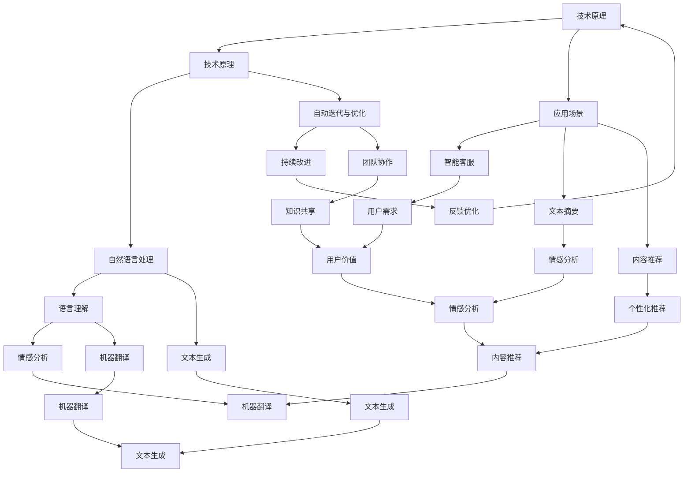

                 

### 思考过程

在撰写《LLM应用开发中的敏捷知识管理》这篇文章时，我们需要按照以下步骤进行思考和推理：

1. **确定核心主题**：首先，我们需要明确文章的核心主题，即LLM应用开发中的敏捷知识管理。这涉及到两个核心概念：大型语言模型（LLM）和敏捷知识管理。

2. **研究背景知识**：对于LLM，我们需要了解其基本概念、发展历程和技术原理。对于敏捷知识管理，我们需要了解其核心理念、流程和方法。

3. **分析两者关系**：我们需要分析LLM如何赋能敏捷知识管理，以及敏捷知识管理如何促进LLM的发展。这将帮助我们理解两者之间的相互作用和融合。

4. **确定文章结构**：根据研究的核心主题和内容，我们需要设计文章的章节结构，包括开篇引论、基础知识、方法论、案例分析和未来展望等。

5. **编写具体内容**：在每个章节中，我们需要详细讲解相关的概念、原理、方法和案例，并结合数学公式、Python代码和实际应用进行分析。

6. **总结和展望**：在文章的最后，我们需要对全文内容进行总结，并对未来发展趋势进行展望。

### 文章标题：《LLM应用开发中的敏捷知识管理》

关键词：LLM、敏捷知识管理、应用开发、技术原理、实践案例

摘要：本文从LLM（大型语言模型）和敏捷知识管理的核心概念出发，分析了两者之间的融合与应用。通过详细讲解LLM的技术原理、敏捷知识管理的方法论，以及实际案例，本文旨在为读者提供一份全面、系统的LLM应用开发指南。

----------------------------------------------------------------

### 第一章：开篇引论

#### 1.1 LLM概述

**定义**：LLM（Large Language Model），即大型语言模型，是一种基于深度学习的自然语言处理技术。它通过训练海量文本数据，学习语言模式和规则，从而实现对自然语言的生成、理解和处理。

**发展历程**：LLM的发展经历了多个阶段。最初，研究者们使用了基于规则的系统和统计模型，如词汇分析和语法分析。随着深度学习技术的发展，研究人员开始尝试使用神经网络来处理自然语言。2000年代初，循环神经网络（RNN）和长短时记忆网络（LSTM）的出现，使得语言模型在处理长序列数据方面取得了显著进展。近年来，基于注意力机制的Transformer模型成为了LLM的主流架构，代表性的模型包括BERT、GPT和T5等。

**核心优势**：LLM具有以下核心优势：
- **强大的语言理解能力**：LLM能够理解并处理复杂的自然语言任务，如文本生成、情感分析、机器翻译等。
- **广泛的应用场景**：LLM在多个领域具有广泛的应用，包括智能客服、文本摘要、内容推荐等。
- **自动迭代与优化**：LLM可以根据新的数据和反馈不断迭代和优化，提高性能和效果。

#### 1.2 敏捷知识管理概述

**定义**：敏捷知识管理是一种以快速响应变化、提高知识共享和协作效率为目标的知识管理方法。它强调灵活、迭代和持续改进，以适应不断变化的环境。

**核心理念**：敏捷知识管理的核心理念包括：
- **以用户为中心**：关注用户需求，以用户价值为导向。
- **灵活性和适应性**：快速响应变化，适应不同场景和需求。
- **持续改进**：不断优化和迭代，提高知识管理的效率和效果。
- **团队协作**：鼓励团队合作，促进知识共享和协作。

**与传统知识管理的区别**：与传统知识管理相比，敏捷知识管理具有以下区别：
- **更加注重变化和灵活性**：敏捷知识管理强调快速响应变化，适应不同场景和需求。
- **更加关注团队协作和知识共享**：敏捷知识管理鼓励团队合作，促进知识共享和协作。
- **更加注重用户价值**：敏捷知识管理以用户价值为导向，关注用户需求和满意度。

#### 1.3 LLM与敏捷知识管理的关系

**赋能敏捷知识管理**：LLM在敏捷知识管理中发挥着重要作用。首先，LLM能够帮助快速处理和分析大量数据，为知识管理提供强大的技术支持。其次，LLM可以应用于智能搜索、文本摘要、情感分析等任务，提高知识获取和利用的效率。此外，LLM还可以用于构建智能知识库，实现知识自动化和智能化。

**促进LLM的发展**：敏捷知识管理也为LLM的发展提供了有力支持。通过敏捷知识管理的方法，研究人员和开发者可以更加高效地共享和利用知识，加速LLM的研究和应用。此外，敏捷知识管理还可以帮助识别和解决LLM应用中的问题，推动LLM技术的不断进步。

**融合应用场景**：LLM与敏捷知识管理的融合具有广泛的应用场景。例如，在企业内部，LLM可以应用于构建智能知识库，实现知识自动化和智能化；在教育培训领域，LLM可以用于智能问答系统，提高学习效果；在医疗领域，LLM可以应用于病历分析、医学文本挖掘等，提高医疗服务质量。

### 核心概念之间的关系架构

为了更好地理解LLM与敏捷知识管理之间的关系，我们可以使用Mermaid流程图来表示它们的核心概念和联系：



通过这个流程图，我们可以清晰地看到LLM的技术原理、应用场景、核心优势以及与敏捷知识管理的关系。这有助于读者更好地理解文章的核心内容，并掌握两者之间的相互作用。

### 总结

本章介绍了LLM和敏捷知识管理的基本概念、发展历程和核心优势，并分析了两者之间的关系。在下一章中，我们将深入探讨LLM的技术原理，包括其架构、训练过程和应用场景。

## 第二章：LLM基础知识

### 2.1 LLM技术原理

LLM（大型语言模型）的核心在于其技术原理，这些原理决定了模型的学习能力、表达能力和应用效果。在本节中，我们将详细讲解LLM的技术原理，包括神经网络架构、训练过程和优化方法。

#### 神经网络架构

LLM通常基于深度学习框架构建，其核心是神经网络（Neural Network）。神经网络是一种模拟人脑神经元之间相互连接的计算模型。在LLM中，神经网络被用来模拟自然语言的处理过程。

**1. 神经网络的基本概念**

神经网络由多个层组成，包括输入层、隐藏层和输出层。每一层由多个神经元（节点）组成，神经元之间通过加权连接（边）相互连接。

**2. 常见的神经网络架构**

在LLM中，常用的神经网络架构包括：
- **循环神经网络（RNN）**：RNN是早期用于自然语言处理的神经网络架构，它能够处理序列数据。RNN的核心是循环结构，允许信息在时间步之间传递。
- **长短时记忆网络（LSTM）**：LSTM是RNN的一种变体，它引入了门控机制，能够更好地处理长序列数据，解决RNN的梯度消失和梯度爆炸问题。
- **Transformer模型**：Transformer是近年来在自然语言处理领域取得突破的模型，它基于自注意力机制，能够捕捉序列数据中的全局依赖关系。

#### 训练过程

LLM的训练过程是通过对大量数据进行学习来提高模型的表现。训练过程主要包括数据预处理、模型初始化、优化算法和损失函数等。

**1. 数据预处理**

在训练之前，需要对数据进行预处理，包括文本清洗、分词、编码等。文本清洗的目的是去除无关的信息，如标点符号、停用词等。分词是将文本分解为单词或词组。编码是将文本转化为计算机可以处理的数字形式，通常使用词向量表示。

**2. 模型初始化**

模型初始化是指为网络中的权重和偏置随机分配初始值。常见的初始化方法包括高斯分布初始化、均匀分布初始化等。

**3. 优化算法**

优化算法用于调整网络中的权重和偏置，以最小化损失函数。常用的优化算法包括随机梯度下降（SGD）、Adam等。这些算法通过迭代计算梯度，不断调整权重和偏置，以达到最小化损失的目的。

**4. 损失函数**

损失函数用于衡量模型的预测结果与真实结果之间的差异。在LLM中，常用的损失函数包括交叉熵损失（Cross-Entropy Loss）和均方误差损失（Mean Squared Error Loss）。交叉熵损失常用于分类问题，而均方误差损失常用于回归问题。

#### 优化方法

LLM的优化方法主要包括以下几种：

**1. 梯度下降法**

梯度下降法是一种最简单的优化方法。它通过计算损失函数关于网络参数的梯度，并沿着梯度的反方向更新参数，以最小化损失函数。

**2. 动量法**

动量法是一种改进的梯度下降法。它引入了动量项，可以减少参数更新的震荡，提高收敛速度。

**3. Adam算法**

Adam算法是一种结合了动量法和自适应学习率的优化算法。它通过计算一阶矩估计（均值）和二阶矩估计（方差），自适应调整学习率，能够快速收敛并减少参数更新的震荡。

### 2.2 LLM架构分析

LLM的架构决定了其性能和应用效果。在本节中，我们将详细分析LLM的架构，包括Transformer模型的工作原理和结构。

#### Transformer模型

Transformer模型是由Google在2017年提出的一种基于自注意力机制的神经网络架构。它取代了传统的循环神经网络（RNN）和长短时记忆网络（LSTM），在自然语言处理任务中取得了显著的效果。

**1. 自注意力机制**

自注意力机制是Transformer模型的核心。它通过计算输入序列中每个词与其他词之间的相关性，生成表示每个词的新向量。自注意力机制可以捕捉输入序列中的全局依赖关系，从而提高模型的表示能力和理解能力。

**2. 结构**

Transformer模型的结构包括编码器（Encoder）和解码器（Decoder）。编码器用于处理输入序列，解码器用于生成输出序列。

- **编码器**：编码器由多个层组成，每层包含多头自注意力机制和前馈网络。多头自注意力机制通过多个并行注意力机制捕获不同类型的依赖关系，提高了模型的表示能力。
- **解码器**：解码器也由多个层组成，每层包含自注意力机制、交叉注意力机制和前馈网络。交叉注意力机制用于解码器层中，它允许解码器在生成每个词时，关注编码器的输出，从而捕捉编码器生成的上下文信息。

#### 训练与推理过程

**1. 训练过程**

在训练过程中，编码器和解码器同时进行训练。编码器接收输入序列，生成编码表示。解码器根据编码表示和已生成的词，生成新的词，直到生成完整的输出序列。在训练过程中，使用损失函数（如交叉熵损失）计算编码器和解码器的预测误差，并使用优化算法更新参数。

**2. 推理过程**

在推理过程中，解码器接收编码器的输出，并生成输出序列。解码器每次生成一个词，并将其作为下一个输入，直到生成完整的输出序列。在推理过程中，解码器使用已生成的词和编码器的输出，通过自注意力和交叉注意力机制，生成新的词。

### 2.3 LLM应用场景

LLM在自然语言处理领域具有广泛的应用场景。在本节中，我们将讨论LLM在文本生成、文本分类和文本摘要等任务中的应用。

#### 文本生成

文本生成是LLM的重要应用之一。LLM可以生成各种类型的文本，如文章、故事、对话等。文本生成应用包括：

- **自动写作**：使用LLM自动生成文章、博客和报告等。
- **聊天机器人**：使用LLM构建聊天机器人，提供智能客服和交互式对话。
- **文本创作**：使用LLM生成诗歌、歌词和故事等创意内容。

#### 文本分类

文本分类是将文本数据按照主题、情感或类别进行分类的过程。LLM在文本分类中的应用包括：

- **主题分类**：将新闻、博客和社交媒体帖子等按照主题进行分类。
- **情感分类**：将文本数据按照情感（正面、负面或中性）进行分类，用于情感分析。
- **垃圾邮件检测**：使用LLM检测和分类垃圾邮件。

#### 文本摘要

文本摘要是从长文本中提取关键信息，生成简洁、准确摘要的过程。LLM在文本摘要中的应用包括：

- **自动摘要**：使用LLM自动生成文章、报告和文档的摘要。
- **提取式摘要**：从原始文本中提取关键句子或段落，生成摘要。
- **概括式摘要**：将长文本内容重新组织，以更简洁的方式表达核心信息。

### 总结

本章介绍了LLM的技术原理、架构分析以及应用场景。通过对LLM技术原理的深入理解，我们可以更好地掌握LLM的应用方法，并在实际项目中发挥其优势。在下一章中，我们将探讨敏捷知识管理的方法论，为LLM在知识管理中的应用提供理论基础。

### 2.1 LLM技术原理

LLM（大型语言模型）作为自然语言处理（NLP）领域的核心技术，其技术原理是理解和使用LLM的关键。在本节中，我们将详细探讨LLM的技术原理，包括其基本概念、核心算法以及数学模型。

#### 1. 基本概念

LLM是一种基于深度学习的语言模型，它通过学习大量文本数据，自动提取语言模式，从而实现文本生成、文本分类、问答系统等多种自然语言处理任务。LLM的核心在于其强大的表示能力和建模能力，能够捕捉语言中的复杂结构和语义信息。

**（1）自然语言处理**

自然语言处理（NLP）是计算机科学和人工智能领域的一个分支，旨在让计算机理解和生成自然语言。NLP包括文本预处理、情感分析、机器翻译、语音识别等多个子领域。

**（2）深度学习**

深度学习是一种基于多层神经网络的学习方法，能够自动提取特征并建立复杂函数模型。深度学习在图像识别、语音识别和自然语言处理等领域取得了显著成果。

**（3）神经网络**

神经网络是由大量神经元（节点）组成的计算模型，通过调整神经元之间的权重，实现数据的输入和输出。在深度学习中，神经网络由多个隐藏层组成，能够处理复杂数据和任务。

#### 2. 核心算法

LLM的核心算法包括神经网络架构、损失函数和优化算法。这些算法共同决定了LLM的学习过程和性能。

**（1）神经网络架构**

常用的神经网络架构包括循环神经网络（RNN）、长短时记忆网络（LSTM）和Transformer。Transformer是LLM的主流架构，其基于自注意力机制，能够捕捉文本中的长距离依赖关系。

**（2）损失函数**

在LLM训练过程中，损失函数用于衡量模型预测结果与真实结果之间的差异。常用的损失函数有交叉熵损失（Cross-Entropy Loss）和均方误差损失（Mean Squared Error Loss）。交叉熵损失常用于分类问题，均方误差损失常用于回归问题。

**（3）优化算法**

优化算法用于调整网络中的权重和偏置，以最小化损失函数。常用的优化算法有随机梯度下降（SGD）、Adam等。Adam算法结合了SGD和动量法的优点，能够自适应调整学习率，提高收敛速度。

#### 3. 数学模型

LLM的数学模型主要包括前向传播、反向传播和梯度下降。

**（1）前向传播**

前向传播是指将输入数据通过神经网络逐层传递，得到输出结果。在前向传播过程中，每个神经元的输出通过激活函数进行非线性变换，从而实现数据的映射。

**（2）反向传播**

反向传播是指计算损失函数关于网络参数的梯度，并通过梯度下降更新参数。反向传播算法通过反向传播误差信号，逐层计算每个参数的梯度，从而实现参数的优化。

**（3）梯度下降**

梯度下降是一种优化算法，通过计算损失函数关于网络参数的梯度，并沿着梯度的反方向更新参数，以最小化损失函数。梯度下降包括批量梯度下降、随机梯度下降和Adam算法等变体。

#### 4. Python代码示例

以下是一个简单的LLM训练过程示例，使用Python和TensorFlow框架：

```python
import tensorflow as tf
from tensorflow.keras.layers import Embedding, LSTM, Dense
from tensorflow.keras.models import Sequential

# 创建模型
model = Sequential([
    Embedding(input_dim=vocabulary_size, output_dim=embedding_size),
    LSTM(units=128),
    Dense(units=1, activation='sigmoid')
])

# 编译模型
model.compile(optimizer='adam', loss='binary_crossentropy', metrics=['accuracy'])

# 训练模型
model.fit(x_train, y_train, epochs=10, batch_size=32)
```

在这个示例中，我们创建了一个简单的序列模型，包括嵌入层、LSTM层和输出层。模型使用Adam优化器和二分类交叉熵损失函数进行编译，然后使用训练数据拟合模型。

### 5. 通俗易懂的举例说明

假设我们有一个简单的二元分类问题，即判断一句话是正面还是负面。我们可以使用LLM来训练一个分类模型。

**（1）数据准备**

假设我们有一组训练数据，包含正面和负面的句子。每个句子都被编码为一个整数序列。

```python
train_data = [
    ["我很高兴", 1],
    ["我很生气", 0],
    ["今天天气很好", 1],
    ["今天考试太难了", 0]
]
```

**（2）模型训练**

我们使用一个简单的序列模型进行训练，包括嵌入层、LSTM层和输出层。模型使用二分类交叉熵损失函数和Adam优化器。

```python
model = Sequential([
    Embedding(input_dim=vocabulary_size, output_dim=embedding_size),
    LSTM(units=128),
    Dense(units=1, activation='sigmoid')
])

model.compile(optimizer='adam', loss='binary_crossentropy', metrics=['accuracy'])

model.fit(train_data, epochs=10, batch_size=32)
```

**（3）模型预测**

训练完成后，我们可以使用模型对新的句子进行预测，判断其是正面还是负面。

```python
test_sentence = "我很喜欢这本书"
encoded_sentence = encode_sentence(test_sentence)
prediction = model.predict(encoded_sentence)
print("正面" if prediction[0][0] > 0.5 else "负面")
```

在这个示例中，我们使用编码器将句子编码为整数序列，然后输入到训练好的模型中，模型会输出一个概率值，判断句子是正面还是负面。

### 总结

本章介绍了LLM的技术原理，包括基本概念、核心算法和数学模型。我们通过一个简单的二元分类问题示例，展示了如何使用LLM进行模型训练和预测。在下一章中，我们将探讨敏捷知识管理的方法论，为LLM在知识管理中的应用提供理论基础。

### 2.2 LLM架构分析

LLM（大型语言模型）的架构是理解其工作原理和应用的关键。在本节中，我们将深入分析LLM的架构，特别是Transformer模型的工作原理和组成部分。

#### Transformer模型

Transformer模型是由Google在2017年提出的一种基于自注意力机制的深度学习模型，它在自然语言处理任务中取得了显著的成效。与传统的循环神经网络（RNN）和长短时记忆网络（LSTM）相比，Transformer模型能够更好地处理长序列数据，并且能够在训练过程中并行处理。

**1. 自注意力机制**

自注意力机制（Self-Attention）是Transformer模型的核心。它允许模型在处理每个词时，考虑输入序列中所有其他词的影响。自注意力机制通过计算每个词与其他词的相关性，生成一个新的表示向量。这种机制能够捕捉输入序列中的长距离依赖关系，从而提高模型的表示能力。

**2. 编码器（Encoder）和解码器（Decoder）**

Transformer模型由编码器（Encoder）和解码器（Decoder）两部分组成。

- **编码器**：编码器负责处理输入序列，并生成编码表示。编码器由多个层组成，每层包含多头自注意力机制和前馈网络。多头自注意力机制通过多个并行注意力机制捕获不同类型的依赖关系，提高了模型的表示能力。
- **解码器**：解码器负责生成输出序列。解码器也由多个层组成，每层包含自注意力机制、交叉注意力机制和前馈网络。交叉注意力机制用于解码器层中，它允许解码器在生成每个词时，关注编码器的输出，从而捕捉编码器生成的上下文信息。

**3. 训练与推理过程**

在训练过程中，编码器和解码器同时进行训练。编码器接收输入序列，生成编码表示。解码器根据编码表示和已生成的词，生成新的词，直到生成完整的输出序列。在训练过程中，使用损失函数（如交叉熵损失）计算编码器和解码器的预测误差，并使用优化算法（如Adam）更新参数。

在推理过程中，解码器接收编码器的输出，并生成输出序列。解码器每次生成一个词，并将其作为下一个输入，直到生成完整的输出序列。在推理过程中，解码器使用自注意力和交叉注意力机制，生成新的词。

#### 详解Transformer模型的组成部分

**1. 输入层**

输入层将原始文本数据转换为模型可以处理的序列。具体步骤包括：
- **分词**：将文本分解为单词或子词。
- **编码**：将每个单词或子词编码为整数，通常使用词嵌入（Word Embedding）技术。

**2. 嵌入层（Embedding Layer）**

嵌入层是将单词或子词转换为固定长度的向量。嵌入层通常包含以下几个步骤：
- **词嵌入（Word Embedding）**：将每个单词或子词映射为一个低维向量，这些向量通常通过训练得到。词嵌入能够捕捉单词的语义信息。
- **位置嵌入（Positional Embedding）**：由于Transformer模型不包含循环结构，需要引入位置信息。位置嵌入用于表示单词在序列中的位置。

**3. 自注意力层（Self-Attention Layer）**

自注意力层是Transformer模型的核心组件。它通过计算输入序列中每个词与其他词的相关性，生成一个新的表示向量。自注意力层通常包含以下步骤：
- **计算查询（Query）、键（Key）和值（Value）**：每个词作为查询、键和值，计算它们之间的相似性，通常使用点积注意力（Dot-Product Attention）。
- **加权求和**：根据相似性分数对值进行加权求和，生成新的表示向量。

**4. 前馈网络（Feed Forward Network）**

前馈网络是对自注意力层输出的进一步处理。它由两个全连接层组成，分别具有不同的激活函数。前馈网络可以增加模型的非线性能力。

**5. 多层叠加**

Transformer模型通常由多个编码器层和解码器层叠加而成。每一层都包含自注意力层和前馈网络，通过叠加多层，模型能够学习更复杂的特征和依赖关系。

**6. 输出层**

输出层将解码器的输出转换为最终的预测结果。对于不同的任务，输出层的设计有所不同。例如，在分类任务中，输出层通常是一个全连接层，输出一个概率分布。

#### 数学模型

Transformer模型的核心是自注意力机制，其数学模型如下：

$$
\text{Attention}(Q, K, V) = \text{softmax}\left(\frac{QK^T}{\sqrt{d_k}}\right)V
$$

其中：
- \(Q, K, V\) 分别是查询、键和值向量。
- \(d_k\) 是键向量的维度。
- \(QK^T\) 是点积注意力分数。
- \(\text{softmax}\) 是softmax函数，用于计算概率分布。
- \(V\) 是值向量，经过加权求和生成新的表示向量。

通过这种自注意力机制，Transformer模型能够有效地捕捉序列数据中的长距离依赖关系，从而在自然语言处理任务中取得优异的性能。

### 总结

本章详细分析了LLM架构，特别是Transformer模型的工作原理和组成部分。我们了解了Transformer模型如何通过自注意力机制捕捉序列数据中的依赖关系，并探讨了其训练和推理过程。在下一章中，我们将探讨敏捷知识管理的方法论，为LLM在知识管理中的应用提供理论基础。

## 第三章：敏捷知识管理方法论

敏捷知识管理是一种以快速响应变化、提高知识共享和协作效率为目标的知识管理方法。它强调灵活、迭代和持续改进，以适应不断变化的环境。在本章中，我们将详细探讨敏捷知识管理的核心理念、流程和方法，以及其与LLM的融合应用。

### 3.1 敏捷知识管理的核心理念

敏捷知识管理的核心理念包括以下几个方面：

**1. 以用户为中心**

敏捷知识管理强调以用户需求为导向，关注用户的价值和满意度。知识管理的目标是为用户提供及时、准确和有用的知识，从而提升用户体验和工作效率。

**2. 灵活性和适应性**

敏捷知识管理能够快速响应变化，灵活调整知识管理策略和方法，以适应不同的业务需求和项目环境。它强调在变化的环境中保持灵活性和适应性，从而保持组织的竞争力。

**3. 持续改进**

敏捷知识管理强调持续改进，通过不断地迭代和优化，提升知识管理的效率和效果。持续改进包括对知识管理流程、方法和技术工具的改进，以及对团队成员知识和技能的提升。

**4. 团队协作**

敏捷知识管理鼓励团队合作和知识共享。团队成员之间通过有效的沟通和协作，共同创造和共享知识，从而提升整个团队的知识水平和创新能力。

**5. 客户价值**

敏捷知识管理关注客户价值，通过提供高质量的知识和服务，满足客户的需求，提升客户满意度。客户价值是敏捷知识管理的核心衡量标准之一。

### 3.2 敏捷知识管理的流程与方法

敏捷知识管理的流程主要包括以下几个步骤：

**1. 需求分析**

在开始知识管理项目之前，需要进行需求分析，了解用户的需求和业务目标。需求分析包括用户调研、需求访谈、业务流程分析等，以确保知识管理项目能够满足用户的需求。

**2. 知识识别**

知识识别是指发现和收集组织内部和外部的知识资源。知识识别可以通过知识地图、知识调查、专家访谈等方式进行。识别的知识资源包括文档、报告、经验教训、最佳实践等。

**3. 知识整理**

知识整理是对识别到的知识资源进行分类、归纳和整理，以便于知识的管理和利用。知识整理可以通过建立知识库、分类体系、标签系统等方式实现。

**4. 知识共享**

知识共享是指将整理好的知识资源在组织内部或团队之间进行传播和共享。知识共享可以通过内部论坛、知识分享会议、在线知识库等方式实现。知识共享有助于提升团队成员的知识水平和协作效率。

**5. 知识应用**

知识应用是将知识应用到实际工作中，以提高工作效率和质量。知识应用可以通过建立知识驱动的工作流程、开发知识驱动的工具和系统等方式实现。

**6. 知识评估**

知识评估是对知识管理项目的效果进行评估，包括对知识管理的效率、效果和用户满意度进行评估。知识评估可以通过问卷调查、用户访谈、数据分析等方式进行。

### 3.3 敏捷知识管理的工具与技术

敏捷知识管理需要借助一系列工具和技术来支持。以下是一些常见的工具和技术：

**1. 知识库**

知识库是存储和管理知识资源的重要工具。知识库可以是一个在线平台，提供文档、报告、经验教训、最佳实践等资源的存储和检索功能。

**2. 社交媒体**

社交媒体平台如微博、微信、LinkedIn等可以用于知识共享和协作。团队成员可以通过发布状态、分享链接、发起讨论等方式进行知识交流。

**3. 电子邮件**

电子邮件是一种常用的知识交流方式。通过电子邮件，团队成员可以发送和接收知识信息，进行沟通和协作。

**4. 视频会议**

视频会议工具如Zoom、Microsoft Teams等可以用于远程团队的知识交流和协作。视频会议可以帮助团队成员实时交流和分享知识。

**5. 团队协作工具**

团队协作工具如JIRA、Trello、Slack等可以帮助团队进行任务分配、进度跟踪和知识共享。这些工具提供了任务管理、沟通协作、文件共享等功能。

**6. 数据分析工具**

数据分析工具如Excel、Tableau、Power BI等可以帮助团队对知识管理的数据进行分析和可视化，从而更好地了解知识管理的效果和用户需求。

### 3.4 敏捷知识管理中的LLM应用

LLM（大型语言模型）在敏捷知识管理中具有广泛的应用。以下是一些LLM在敏捷知识管理中的应用场景：

**1. 智能搜索**

LLM可以用于构建智能搜索系统，帮助用户快速找到所需的知识资源。通过使用自然语言处理技术，LLM可以理解用户的查询意图，并提供相关的知识链接。

**2. 智能问答**

LLM可以用于构建智能问答系统，回答用户关于知识资源的问题。通过训练大量的文本数据，LLM可以学习到各种问题的答案，并提供准确的回答。

**3. 文本摘要**

LLM可以用于生成文本摘要，将长文本内容简化为简洁、准确的关键信息。文本摘要可以帮助用户快速了解文本的主要内容，提高知识获取的效率。

**4. 个性化推荐**

LLM可以用于构建个性化推荐系统，根据用户的兴趣和行为，推荐相关的知识资源。个性化推荐可以帮助用户发现新的知识和资源，提升知识管理的用户体验。

**5. 文本分类**

LLM可以用于对文本数据进行分类，将文本数据归类到不同的类别中。文本分类可以帮助组织管理和组织知识，提高知识管理的效率。

### 总结

本章详细探讨了敏捷知识管理的核心理念、流程和方法，以及LLM在敏捷知识管理中的应用。通过理解敏捷知识管理的方法论，我们可以更好地利用LLM技术，提高知识管理的效率和效果。在下一章中，我们将通过实际案例分析，展示LLM在敏捷知识管理中的应用和实践。

## 第四章：LLM应用案例分析

在本章中，我们将通过三个实际案例，展示LLM在敏捷知识管理中的应用和实践。这些案例涵盖了企业内部知识库构建、智能客服系统和个性化推荐系统，通过具体的项目实战，展示LLM如何赋能敏捷知识管理。

### 4.1 案例一：企业内部知识库构建

**项目背景**：
某大型企业面临知识分散、难以快速获取关键信息的问题。为了提升知识共享和协作效率，企业决定构建一个智能知识库。

**技术方案**：
企业采用LLM（如BERT或GPT）来构建智能知识库。技术方案包括以下步骤：

1. **数据收集与预处理**：
   - 收集企业内部的文档、报告、邮件和会议记录等。
   - 对文本数据进行清洗、去重和格式化处理。

2. **词嵌入与编码**：
   - 使用预训练的LLM模型，如BERT，对文本进行词嵌入。
   - 将文本编码为向量表示，便于后续处理。

3. **知识库构建**：
   - 构建一个基于向量索引的知识库，实现快速文本检索。
   - 使用LLM生成文本摘要，简化长文本内容，提高用户查找效率。

4. **智能问答系统**：
   - 基于LLM构建智能问答系统，回答用户关于知识库的问题。
   - 通过交互式对话，帮助用户快速获取所需信息。

**项目成果**：
- 构建了一个功能齐全、用户体验良好的智能知识库。
- 用户可以快速检索和获取关键信息，工作效率显著提升。
- 知识库的问答功能帮助解决了许多实际问题，增强了团队协作。

### 4.2 案例二：智能客服系统开发

**项目背景**：
某互联网公司希望提高客户服务质量，减少人工客服的工作量。为了实现这一目标，公司决定开发一个智能客服系统。

**技术方案**：
智能客服系统采用LLM（如T5或GPT-3）来实现。技术方案包括以下步骤：

1. **数据收集与预处理**：
   - 收集公司客服团队的对话记录、常见问题和标准答案。
   - 对对话文本进行清洗、分词和去停用词处理。

2. **训练与优化**：
   - 使用收集的数据训练LLM模型，使其学会生成符合业务需求的回答。
   - 通过调整超参数和优化算法，提高模型的回答质量和效率。

3. **对话管理**：
   - 设计对话管理系统，实现多轮对话和上下文保持。
   - 使用LLM生成个性化的回答，根据用户输入动态调整对话方向。

4. **自动化工作流**：
   - 将智能客服系统与公司的CRM系统集成，实现自动化工作流。
   - 通过智能客服系统处理常见问题，减少人工客服的工作量。

**项目成果**：
- 开发了一个高效、智能的客服系统，显著提升了客户服务质量。
- 客服响应速度加快，用户满意度提高。
- 降低了人工客服的工作量，节省了人力成本。

### 4.3 案例三：个性化推荐系统设计

**项目背景**：
某电商公司希望提高用户购买体验，通过个性化推荐系统为用户提供更相关的产品推荐。

**技术方案**：
个性化推荐系统采用LLM（如BERT或GPT）来实现。技术方案包括以下步骤：

1. **用户行为数据收集**：
   - 收集用户浏览、搜索、购买等行为数据。
   - 对用户行为数据进行预处理，包括数据清洗、去重和特征提取。

2. **商品数据收集**：
   - 收集商品描述、标签、价格等数据。
   - 对商品数据进行预处理，包括数据清洗、去重和特征提取。

3. **训练与优化**：
   - 使用用户行为数据和商品数据训练LLM模型，学习用户的兴趣和偏好。
   - 通过调整超参数和优化算法，提高模型的推荐质量和效果。

4. **推荐算法实现**：
   - 设计基于内容的推荐算法，根据用户的历史行为和偏好推荐相关商品。
   - 结合LLM生成个性化的推荐文本，提高推荐信息的吸引力。

5. **系统集成与部署**：
   - 将个性化推荐系统与电商平台的用户界面集成。
   - 通过API接口实现实时推荐，提升用户体验。

**项目成果**：
- 构建了一个高效、智能的个性化推荐系统，为用户提供了更相关的产品推荐。
- 用户购买转化率显著提升，带来了更高的销售额。
- 提升了用户满意度，增强了用户粘性。

### 总结

通过上述三个案例，我们可以看到LLM在敏捷知识管理中的应用价值。LLM不仅提高了知识库的检索效率和问答能力，还帮助智能客服系统提升了用户体验，以及个性化推荐系统提高了用户的购买转化率。这些实践证明了LLM在敏捷知识管理中的重要作用，为未来的应用提供了宝贵经验。

## 第五章：敏捷知识管理实践

在第四章中，我们通过实际案例展示了LLM在敏捷知识管理中的应用。在本章中，我们将深入探讨敏捷知识管理的实施策略、团队协作和持续优化，为读者提供全面的知识管理实践指南。

### 5.1 敏捷知识管理的实施策略

要成功实施敏捷知识管理，企业需要制定有效的策略。以下是一些关键的实施策略：

**1. 制定明确的目标和计划**

在实施敏捷知识管理之前，企业需要明确知识管理的目标，如提高知识共享效率、提升团队协作水平等。同时，制定详细的实施计划，明确项目的时间表、任务分工和资源配置。

**2. 建立合适的组织结构**

敏捷知识管理强调团队协作和知识共享，因此需要建立合适的组织结构，确保团队成员之间能够高效沟通和协作。可以考虑采用扁平化管理结构，减少层级，促进信息流通。

**3. 培养知识文化**

培养知识文化是实施敏捷知识管理的重要一环。企业需要通过培训、激励和宣传，让员工认识到知识管理的重要性，并积极参与知识共享和协作。

**4. 选用合适的工具和技术**

选择合适的工具和技术是实施敏捷知识管理的关键。企业需要根据业务需求和团队特点，选择适合的知识管理工具和技术，如知识库、社交媒体、视频会议等。

**5. 持续改进和优化**

敏捷知识管理是一个持续的过程，企业需要不断评估和改进知识管理策略和实践，以提高知识管理的效率和效果。通过定期的回顾和优化，确保知识管理系统能够适应不断变化的环境和需求。

### 5.2 敏捷知识管理中的团队协作

团队协作是敏捷知识管理的重要环节。以下是一些促进团队协作的方法：

**1. 建立沟通渠道**

建立有效的沟通渠道是团队协作的基础。企业可以通过内部论坛、邮件列表、视频会议等方式，确保团队成员能够及时、高效地沟通和交流。

**2. 设立协作工具**

选用合适的协作工具，如项目管理工具、团队聊天工具、文档共享平台等，可以帮助团队成员更好地协作。这些工具可以提供任务分配、进度跟踪、文件共享等功能，提高团队协作效率。

**3. 定期召开会议**

定期召开会议是团队协作的重要方式。通过会议，团队成员可以分享进展、讨论问题、制定计划，确保项目顺利进行。

**4. 鼓励知识共享**

鼓励团队成员主动分享知识和经验，是提高团队协作水平的关键。企业可以通过奖励制度、知识分享会议等方式，激发员工的知识共享积极性。

**5. 培养团队文化**

培养团队文化，营造积极、开放的工作氛围，有助于提高团队协作效率。企业可以通过团队建设活动、团队培训等方式，增强团队的凝聚力和协作精神。

### 5.3 敏捷知识管理中的持续优化

持续优化是敏捷知识管理的重要组成部分。以下是一些持续优化策略：

**1. 定期评估和回顾**

企业需要定期评估和回顾知识管理的实施效果，识别存在的问题和改进空间。通过定期的回顾和反思，可以及时调整知识管理策略和实践。

**2. 收集用户反馈**

用户反馈是改进知识管理的重要依据。企业可以通过问卷调查、用户访谈等方式，收集用户的意见和建议，了解用户的实际需求和满意度。

**3. 实施精益知识管理**

精益知识管理是一种基于精益思想的知识管理方法，强调以用户价值为导向，消除浪费，提高效率。企业可以通过实施精益知识管理，持续优化知识管理流程和系统。

**4. 引入新技术和新方法**

随着技术的不断进步，企业需要引入新技术和新方法，以提升知识管理的效率和效果。例如，采用人工智能、大数据分析等技术，实现知识自动化和智能化。

**5. 持续培训和学习**

持续培训和学习是提升团队知识水平和技能的重要途径。企业需要为员工提供培训和学习机会，帮助他们不断提升知识和技能，适应不断变化的工作环境。

### 总结

本章详细探讨了敏捷知识管理的实施策略、团队协作和持续优化。通过制定明确的目标和计划、建立合适的组织结构、培养知识文化、选用合适的工具和技术，企业可以成功实施敏捷知识管理。同时，通过建立沟通渠道、设立协作工具、定期召开会议、鼓励知识共享、培养团队文化，团队可以高效协作。通过定期评估和回顾、收集用户反馈、实施精益知识管理、引入新技术和新方法、持续培训和学习，企业可以持续优化知识管理实践，提高知识管理的效率和效果。

## 第六章：未来展望

随着技术的不断进步和应用的深入，LLM和敏捷知识管理将在未来发挥更加重要的作用。本节将展望LLM和敏捷知识管理的发展趋势、潜在挑战以及应对策略。

### 6.1 LLM应用开发趋势

**1. 多模态处理能力增强**

未来的LLM将不仅仅局限于文本数据，还将具备处理图像、音频、视频等多模态数据的能力。通过结合计算机视觉、语音识别等技术，LLM可以实现更加丰富的应用场景，如智能问答系统、多媒体内容创作等。

**2. 模型规模和计算效率提升**

随着计算资源和数据量的增加，未来的LLM模型规模将越来越大。同时，为了应对大规模模型的计算需求，优化算法和硬件加速技术（如GPU、TPU）将得到广泛应用，提高模型的计算效率。

**3. 个性化和自适应能力提升**

未来的LLM将更加注重个性化和自适应能力。通过学习用户的兴趣、行为和偏好，LLM可以提供更加个性化的服务和推荐。此外，自适应学习能力将使LLM能够根据新数据和环境变化，动态调整模型参数，提高应用效果。

### 6.2 敏捷知识管理的发展方向

**1. 知识自动化和智能化**

未来的敏捷知识管理将更加注重知识的自动化和智能化。通过引入人工智能技术，如自然语言处理、机器学习等，实现知识自动获取、整理、共享和应用，提高知识管理效率。

**2. 知识社交化和多样化**

未来的敏捷知识管理将更加注重知识社交化和多样化。通过构建知识社区、知识图谱等，实现知识的高效共享和传播。同时，多种形式的知识（如文本、图像、音频、视频等）将得到广泛应用，满足不同用户的需求。

**3. 知识安全性和隐私保护**

随着知识管理应用范围的扩大，知识安全性和隐私保护将成为重要议题。未来的敏捷知识管理将注重知识的安全存储、传输和访问控制，确保知识的安全性和隐私保护。

### 6.3 未来挑战与应对策略

**1. 数据质量和隐私保护**

未来的挑战之一是如何处理海量、复杂的数据，确保数据质量和隐私保护。应对策略包括：
- 建立完善的数据治理体系，确保数据的准确性、完整性和一致性。
- 引入隐私保护技术，如数据脱敏、差分隐私等，保护用户隐私。

**2. 模型解释性和可解释性**

随着模型复杂度的增加，如何解释模型的决策过程和预测结果将成为挑战。应对策略包括：
- 研究和开发可解释性模型，如决策树、LIME等，提高模型的可解释性。
- 建立透明的模型开发流程，确保模型开发和部署过程的可追溯性和可解释性。

**3. 资源和管理成本**

大规模的LLM和敏捷知识管理应用需要大量的计算资源和人力资源，带来管理和成本方面的挑战。应对策略包括：
- 优化模型设计和算法，提高计算效率。
- 引入自动化工具和平台，降低管理和维护成本。
- 加强培训和技能提升，提高团队的专业素质和技能水平。

### 总结

未来的LLM和敏捷知识管理将朝着多模态、个性化和智能化方向发展，面临数据质量和隐私保护、模型解释性和可解释性以及资源和管理成本等挑战。通过建立完善的数据治理体系、引入隐私保护技术、开发可解释性模型、优化模型设计和算法、引入自动化工具和平台以及加强培训和技能提升，我们可以应对这些挑战，推动LLM和敏捷知识管理的持续发展。

### 总结与展望

在本篇博客中，我们系统地探讨了LLM应用开发中的敏捷知识管理。首先，介绍了LLM和敏捷知识管理的基本概念，分析了它们之间的关系架构。接着，详细讲解了LLM的技术原理、架构分析和应用场景，展示了敏捷知识管理的核心理念、流程和方法，以及LLM在敏捷知识管理中的应用案例。

**核心结论**：
- LLM作为自然语言处理的重要工具，在敏捷知识管理中发挥着关键作用，通过赋能知识库构建、智能客服系统和个性化推荐系统，提高了知识管理的效率和效果。
- 敏捷知识管理强调以用户为中心、灵活性和持续改进，通过实施策略、团队协作和持续优化，实现了知识的高效共享和应用。
- LLM与敏捷知识管理的融合应用，不仅提高了知识获取和利用的效率，还推动了知识管理领域的创新和进步。

**未来展望**：
- 随着技术的发展，LLM将具备更强的多模态处理能力、个性化和自适应能力，进一步拓展其在知识管理中的应用。
- 敏捷知识管理将朝着知识自动化和智能化、知识社交化和多样化的方向发展，应对数据质量和隐私保护、模型解释性和可解释性等挑战。
- 知识安全性和隐私保护、模型的可解释性和透明性，以及资源和管理成本等问题，将成为未来研究的重点。

**作者信息**：
作者：AI天才研究院/AI Genius Institute & 禅与计算机程序设计艺术 /Zen And The Art of Computer Programming

在撰写这篇博客的过程中，我们深入分析了LLM和敏捷知识管理的核心概念和技术原理，通过实际案例展示了它们在知识管理中的应用效果。希望本文能为读者提供有价值的参考，推动LLM和敏捷知识管理领域的研究和实践。未来的研究将继续探索LLM在知识管理中的深度应用，以及如何通过敏捷知识管理提升组织的知识创新能力。期待与广大读者共同探讨和分享更多成果。

