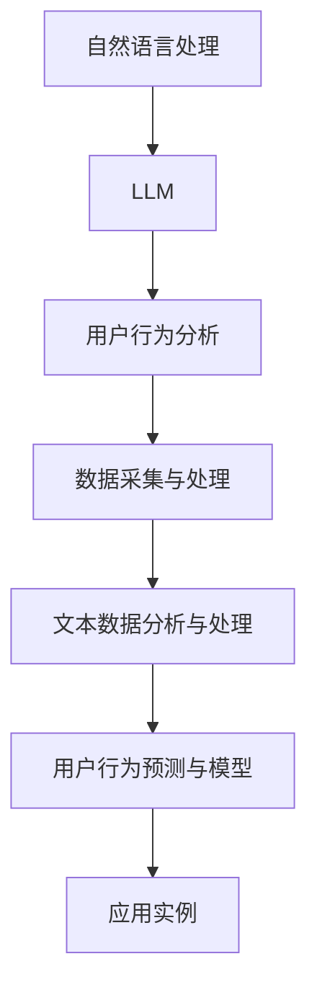

                 

### 第一部分：背景与核心概念

#### 第1章：自然语言处理与LLM

自然语言处理（Natural Language Processing，NLP）是计算机科学和人工智能领域的一个分支，旨在让计算机理解和处理人类自然语言。NLP技术的发展经历了多个阶段，从早期的规则驱动方法，到基于统计的方法，再到如今深度学习的广泛应用，每一个阶段都推动了人工智能技术的发展。

近年来，大型语言模型（Large Language Models，LLM）成为NLP领域的一个重要突破。LLM通过学习海量的文本数据，能够生成流畅的自然语言文本，进行文本分类、情感分析、机器翻译等多种任务。其中，最为代表性的LLM是GPT（Generative Pre-trained Transformer）系列，它通过自回归的方式生成文本，并在多个NLP任务上取得了显著的成果。

#### 第2章：用户行为分析的基础

用户行为分析（User Behavior Analysis，UBA）是通过对用户在应用程序中的行为进行数据采集、分析和解释，以了解用户需求和优化产品体验的一种技术。用户行为分析的基础包括以下几个方面：

1. **数据采集**：用户行为数据通常来源于日志文件、用户界面事件、社交媒体互动等。数据采集的关键在于确保数据的准确性和完整性。
   
2. **数据处理**：数据清洗、数据整合和特征提取是数据处理的关键步骤。通过这些步骤，可以从原始数据中提取出有用的信息，用于后续分析。

3. **数据分析**：数据分析包括描述性分析、预测分析和相关性分析等。描述性分析用于了解用户行为的总体趋势；预测分析用于预测用户的未来行为；相关性分析用于发现用户行为之间的关系。

#### 概念实体之间的关系架构

为了更清晰地展示自然语言处理与用户行为分析之间的关系，我们可以使用Mermaid流程图来表示：

在上述流程图中，自然语言处理通过LLM模型生成文本，而用户行为分析则利用这些文本数据对用户行为进行采集、处理和分析，最终应用于实际场景，如个性化推荐、用户画像等。

### 总结

本章节介绍了自然语言处理与用户行为分析的基本概念，并使用Mermaid流程图展示了两者之间的关系。在接下来的章节中，我们将进一步探讨用户行为分析的技术细节、核心算法原理以及实际项目应用。

---

**下一篇：第3章 用户行为数据采集与处理**

