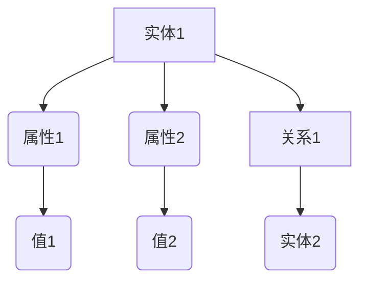
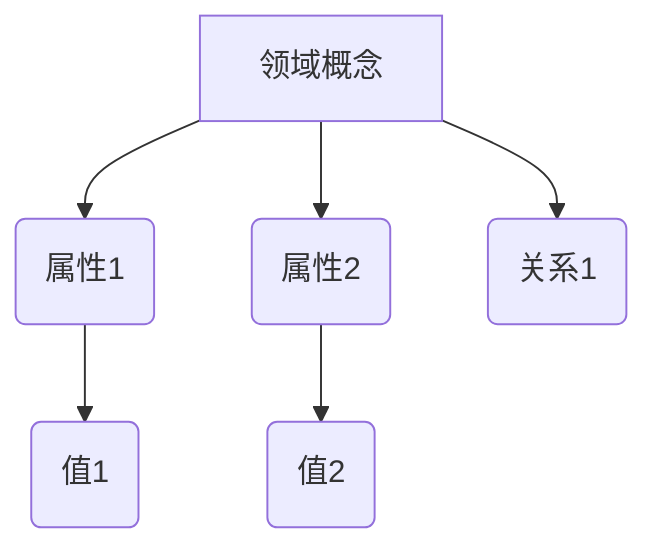
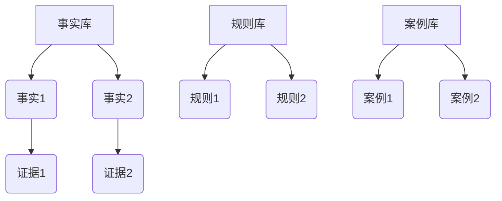
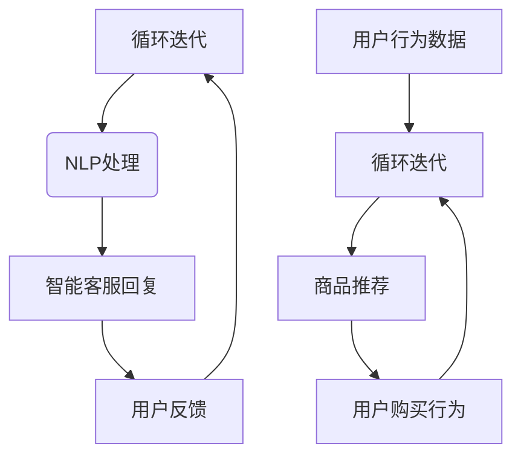
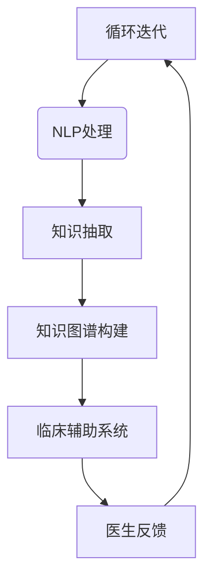
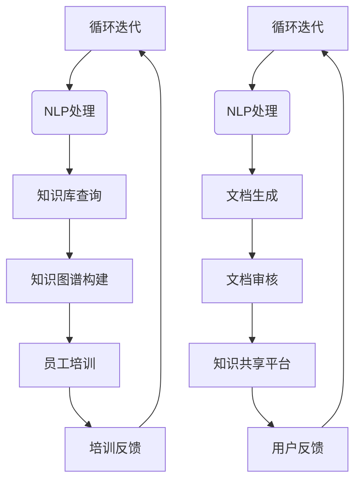

                 

### 《LLM应用开发中的知识管理策略》目录大纲

**前言**

随着人工智能技术的飞速发展，大型语言模型（LLM，Large Language Model）在自然语言处理领域取得了显著的成果。然而，在LLM的应用开发过程中，如何有效管理知识成为了关键挑战。本文旨在探讨LLM应用开发中的知识管理策略，从基础知识、应用策略和案例研究三个方面进行深入分析。

**一、基础知识**

**第1章：LLM概述**

- **1.1 LLM的基本概念**
  - LLM的定义、分类和应用场景
- **1.2 LLM的发展历程**
  - 从传统语言模型到现代LLM的演变过程
- **1.3 LLM的架构**
  - Transformer、BERT、GPT等主流LLM模型的架构详解

**第2章：知识管理的基本原理**

- **2.1 知识管理的定义与重要性**
  - 知识管理的概念、内涵及其在人工智能领域的应用价值
- **2.2 知识管理的框架**
  - 知识管理生命周期、知识类型、知识管理层次等核心概念
- **2.3 知识管理的流程**
  - 知识获取、整合、共享、应用、评估和优化的详细解析

**二、LLM应用中的知识管理策略**

**第3章：知识获取与整合**

- **3.1 数据收集与处理**
  - 数据来源、数据清洗、数据预处理等环节的具体方法
- **3.2 知识整合的方法**
  - 知识图谱、本体论、知识库等技术手段在知识整合中的应用
- **3.3 知识库建设**
  - 知识库的架构设计、数据存储、查询优化等关键问题

**第4章：知识共享与传播**

- **4.1 知识共享的挑战**
  - 知识共享中的障碍、隐私保护等问题
- **4.2 知识传播的渠道**
  - 内部知识共享平台、外部协作机制等传播途径
- **4.3 知识共享与传播的策略**
  - 知识共享激励机制、文化氛围建设等策略

**第5章：知识应用与优化**

- **5.1 LLM在知识应用中的角色**
  - LLM在问答系统、文本生成、情感分析等应用场景中的具体作用
- **5.2 知识应用的评估与优化**
  - 知识应用效果评估指标、优化方法等
- **5.3 知识管理的持续改进**
  - 基于反馈的持续优化、迭代过程

**三、案例研究**

**第6章：案例分析**

- **6.1 案例一：某电商平台的LLM应用**
  - 电商平台如何利用LLM进行智能客服、推荐系统等应用
- **6.2 案例二：某医疗机构的LLM应用**
  - 医疗机构如何利用LLM进行临床辅助、医学知识库构建等应用
- **6.3 案例三：某企业的LLM应用**
  - 企业如何利用LLM进行员工培训、文档自动生成等应用

**第7章：未来展望**

- **7.1 LLM与知识管理的发展趋势**
  - LLM技术、知识管理方法的发展方向和趋势
- **7.2 挑战与机遇**
  - LLM应用开发中面临的挑战及应对策略
- **7.3 未来研究方向**
  - LLM与知识管理领域未来研究的重点和方向

**结语**

本文从基础知识、应用策略和案例研究三个方面，探讨了LLM应用开发中的知识管理策略。通过本文的阅读，读者可以深入了解LLM和知识管理的基本概念、核心原理，以及在实际应用中的具体策略和方法。希望本文能为相关领域的研究者、开发者提供有价值的参考和启示。

---

作者：AI天才研究院/AI Genius Institute & 禅与计算机程序设计艺术 /Zen And The Art of Computer Programming

关键词：LLM、知识管理、人工智能、应用策略、案例研究、知识获取、知识整合、知识共享、知识应用、未来展望

摘要：本文探讨了LLM应用开发中的知识管理策略，包括基础知识、应用策略和案例研究三个方面。通过对LLM和知识管理的基本概念、核心原理及实际应用的深入分析，为相关领域的研究者、开发者提供了有价值的参考。

---

接下来，我们将按照这个目录大纲，逐章节深入分析和撰写文章内容。请您提出宝贵意见和建议，以便我们进一步完善文章结构。**接下来，我们将深入分析LLM的基本概念、发展历程和架构，为后续的知识管理策略探讨奠定基础。**

## 第1章：LLM概述

### 1.1 LLM的基本概念

大型语言模型（Large Language Model，简称LLM）是一种基于深度学习技术的自然语言处理模型。它通过对海量文本数据的学习，掌握了丰富的语言知识和语义理解能力，能够生成高质量的自然语言文本，实现文本生成、文本分类、机器翻译、问答系统等自然语言处理任务。

LLM的基本概念包括以下几个关键点：

1. **语言模型**：语言模型是一种预测模型，用于预测一个单词序列的概率。在自然语言处理中，语言模型的主要作用是生成文本、评估文本的质量和概率等。

2. **深度学习**：深度学习是一种机器学习技术，通过构建多层神经网络，实现从大量数据中自动学习特征和模式。在LLM中，深度学习技术被用于训练大规模神经网络，以模拟人类语言理解和生成能力。

3. **海量文本数据**：LLM的训练依赖于大量的文本数据，这些数据包括书籍、新闻、网页、对话等，用于模型的学习和优化。

4. **语言知识和语义理解**：LLM通过对海量文本数据的学习，能够获取丰富的语言知识和语义理解能力。这使得LLM在生成文本、理解语义、回答问题等方面具有很高的准确性。

### 1.2 LLM的发展历程

LLM的发展历程可以分为以下几个阶段：

1. **早期语言模型**：最早的深度学习语言模型如n-gram模型、神经网络模型等，它们在语言生成和分类任务中取得了初步的成果。

2. **序列模型**：随着深度学习技术的发展，序列模型如RNN（循环神经网络）、LSTM（长短期记忆网络）等被提出，并在语言处理任务中取得了显著效果。

3. **注意力模型**：注意力模型（Attention Model）的引入，使得模型在处理长序列时能够更好地关注关键信息，从而提高了模型的性能。

4. **Transformer模型**：Transformer模型是LLM发展史上的里程碑，它基于自注意力机制（Self-Attention），在机器翻译、文本生成等任务中取得了卓越的成果。Transformer的变体如BERT（双向编码器表示）、GPT（生成预训练）等，进一步推动了LLM的发展。

5. **多模态模型**：近年来，多模态模型（如ViT、BERT + Image等）的出现，使得LLM能够处理包括文本、图像、语音等多模态信息，进一步拓展了LLM的应用范围。

### 1.3 LLM的架构

LLM的架构主要包括以下几个部分：

1. **输入层**：输入层接收文本数据，将其转换为模型可处理的格式。常用的输入层包括词汇表（Vocabulary）和词嵌入（Word Embedding）。

2. **编码器（Encoder）**：编码器是LLM的核心部分，负责对输入文本进行编码，提取文本的语义信息。编码器通常采用多层神经网络结构，如Transformer、BERT等。

3. **解码器（Decoder）**：解码器负责生成输出文本，从编码器提取的语义信息中生成目标文本。解码器通常采用自回归模型（Auto-Regressive Model），如GPT、T5等。

4. **注意力机制（Attention Mechanism）**：注意力机制是LLM中重要的技术，用于在编码器和解码器之间传递信息，使模型能够更好地关注关键信息。

5. **损失函数（Loss Function）**：损失函数用于衡量模型预测结果和实际结果之间的差距，常用的损失函数包括交叉熵损失（Cross-Entropy Loss）等。

6. **优化器（Optimizer）**：优化器用于调整模型参数，以最小化损失函数。常用的优化器包括SGD（随机梯度下降）、Adam（自适应矩估计）等。

通过上述架构，LLM能够实现对自然语言文本的生成、分类、翻译等任务。然而，LLM在应用过程中也面临诸多挑战，如计算资源消耗、数据隐私保护、模型解释性等。这些挑战需要我们在知识管理策略中加以关注和解决。

在接下来的章节中，我们将进一步探讨知识管理的基本原理、策略和方法，为LLM应用开发提供有力的支持。

## 第2章：知识管理的基本原理

### 2.1 知识管理的定义与重要性

知识管理（Knowledge Management，简称KM）是一种通过系统的方法和工具，对知识进行获取、整合、共享、应用和优化的过程。其目的是提高组织内部知识的共享和利用效率，促进知识创新和业务发展。

知识管理的定义可以概括为以下几个方面：

1. **知识获取**：通过多种渠道和方式，收集和积累内部和外部知识，如文档、数据库、专家经验等。
2. **知识整合**：将获取到的知识进行筛选、分类、整合，构建知识体系，使知识更加结构化和系统化。
3. **知识共享**：通过共享平台和渠道，将知识在组织内部进行传递和共享，提高知识的利用率。
4. **知识应用**：将知识应用于实际业务中，解决实际问题，提高业务效率和创新能力。
5. **知识优化**：对知识的应用效果进行评估和反馈，持续优化知识管理体系，提高知识的质量和价值。

知识管理的重要性体现在以下几个方面：

1. **提高企业竞争力**：知识管理能够帮助企业积累和利用知识资源，提升业务水平和创新能力，增强市场竞争力。
2. **促进知识共享**：知识管理通过构建共享平台和机制，促进组织内部知识的传递和共享，提高知识利用效率。
3. **优化人力资源配置**：知识管理有助于发现和培养内部专家，优化人力资源配置，提高员工的专业能力和工作效率。
4. **降低创新成本**：知识管理通过积累和共享知识，降低新项目的研发成本和时间，提高创新效率。
5. **提升客户满意度**：知识管理能够为客户提供更加专业、个性化的服务，提高客户满意度和忠诚度。

### 2.2 知识管理的框架

知识管理的框架是指导知识管理实践的核心体系，它包括知识管理生命周期、知识类型、知识管理层次等核心概念。

1. **知识管理生命周期**：知识管理生命周期包括知识获取、知识整合、知识共享、知识应用和知识优化五个阶段。每个阶段都有明确的目标和任务，相互衔接和支撑，形成一个闭环系统。

2. **知识类型**：知识类型包括显性知识和隐性知识。显性知识是可以通过编码、存储和共享的知识，如文档、数据库、技术标准等。隐性知识是存在于个体头脑中的知识，如经验、技能、洞察等，难以通过编码和共享。

3. **知识管理层次**：知识管理层次包括战略层、战术层和操作层。战略层关注知识管理整体规划、目标和策略；战术层关注知识管理具体实施方法和技术手段；操作层关注知识管理日常操作和执行。

### 2.3 知识管理的流程

知识管理的流程包括知识获取、知识整合、知识共享、知识应用和知识优化五个主要环节。

1. **知识获取**：
   - **内部知识获取**：通过内部培训、专家经验、内部知识库等方式，收集和积累组织内部知识。
   - **外部知识获取**：通过外部调研、合作交流、技术引进等方式，获取外部知识和信息。

2. **知识整合**：
   - **知识筛选**：对获取到的知识进行筛选和分类，识别关键知识和信息。
   - **知识整合**：通过知识图谱、本体论等技术手段，构建知识体系，实现知识的结构化和系统化。

3. **知识共享**：
   - **共享平台**：建立内部知识共享平台，提供知识查询、下载、评论等功能，促进知识共享。
   - **共享机制**：制定知识共享激励政策，鼓励员工积极参与知识共享。

4. **知识应用**：
   - **知识应用**：将知识应用于实际业务中，解决实际问题，提高业务效率和创新能力。
   - **知识传承**：通过师徒制、项目总结等方式，将知识传承给新员工，提高整体知识水平。

5. **知识优化**：
   - **知识评估**：对知识应用效果进行评估，识别知识优化的需求和方向。
   - **知识更新**：根据评估结果，持续更新和完善知识库，提高知识质量和价值。

通过上述流程，知识管理能够实现知识的系统化、结构化和共享化，提高知识的利用效率和创新能力。在LLM应用开发中，知识管理策略的合理运用，有助于提升模型性能、优化应用效果，推动人工智能技术的发展。

### 第3章：知识获取与整合

#### 3.1 数据收集与处理

数据收集与处理是知识获取与整合的关键环节。在LLM应用开发中，数据的质量和完整性直接影响模型的性能和可靠性。

**1. 数据来源**

数据来源可以分为内部和外部两种：

- **内部数据**：来源于企业内部的各种业务系统，如客户关系管理系统（CRM）、企业资源规划系统（ERP）、内部文档库等。这些数据包括客户信息、交易记录、业务流程等，是构建企业知识库的重要基础。

- **外部数据**：来源于互联网、公共数据库、行业报告等。这些数据包括市场趋势、行业动态、用户反馈等，可以为企业提供更广泛的视角和丰富的知识资源。

**2. 数据处理**

数据处理主要包括数据清洗、数据预处理和数据存储三个步骤：

- **数据清洗**：数据清洗是指去除数据中的噪声、错误和重复信息，确保数据的一致性和准确性。常见的数据清洗方法包括去重、缺失值处理、异常值检测等。

  **示例代码**：
  ```python
  import pandas as pd

  # 读取数据
  df = pd.read_csv('data.csv')

  # 去除重复数据
  df.drop_duplicates(inplace=True)

  # 填充缺失值
  df.fillna(method='ffill', inplace=True)

  # 检测异常值
  q75, q25 = df.quantile(0.75), df.quantile(0.25)
  iqr = q75 - q25
  df = df[~((df < (q25 - 1.5 * iqr)) |(df > (q75 + 1.5 * iqr))).any(axis=1)]
  ```

- **数据预处理**：数据预处理包括数据格式转换、特征工程和特征选择等，以提高模型的学习能力和泛化能力。常见的预处理方法包括数值化、归一化、特征提取等。

  **示例代码**：
  ```python
  from sklearn.preprocessing import StandardScaler

  # 归一化
  scaler = StandardScaler()
  df_scaled = scaler.fit_transform(df)

  # 特征提取
  from sklearn.feature_extraction.text import TfidfVectorizer

  vectorizer = TfidfVectorizer(max_features=1000)
  X = vectorizer.fit_transform(df['text_column'])
  ```

- **数据存储**：数据存储是将处理后的数据存储到数据库或文件中，以供后续分析和应用。常用的存储方式包括关系型数据库（如MySQL）、NoSQL数据库（如MongoDB）和文件系统等。

  **示例代码**：
  ```python
  import sqlite3

  # 连接数据库
  conn = sqlite3.connect('knowledge.db')
  cursor = conn.cursor()

  # 创建表格
  cursor.execute('''CREATE TABLE IF NOT EXISTS data (id INTEGER PRIMARY KEY, feature TEXT, label TEXT)''')

  # 插入数据
  cursor.execute("INSERT INTO data (feature, label) VALUES (?, ?)", (df['text_column'].values, df['label_column'].values))
  conn.commit()
  ```

**3. 数据质量评估**

数据质量评估是确保数据有效性和可靠性的重要环节。常见的数据质量评估指标包括数据完整性、数据一致性、数据准确性和数据时效性等。

- **数据完整性**：检查数据是否完整，是否存在缺失值或重复值。

- **数据一致性**：检查数据是否一致，如同一属性在不同数据源中是否存在矛盾。

- **数据准确性**：检查数据是否准确，如数据是否经过校验、更新和清洗。

- **数据时效性**：检查数据是否最新，如数据是否过期或失效。

  **示例代码**：
  ```python
  from sklearn.metrics import accuracy_score

  # 计算准确率
  y_true = [0, 1, 1, 0]
  y_pred = [0, 1, 1, 0]
  accuracy = accuracy_score(y_true, y_pred)
  print(f"Accuracy: {accuracy}")
  ```

通过以上步骤，数据收集与处理为知识整合奠定了基础。在接下来的章节中，我们将进一步探讨知识整合的方法和策略，以提高LLM应用开发的知识管理效果。

#### 3.2 知识整合的方法

知识整合是将分散的、零散的知识进行系统化、结构化的过程，以便更好地利用和传播。在LLM应用开发中，知识整合的方法主要包括知识图谱、本体论和知识库建设。

**1. 知识图谱**

知识图谱（Knowledge Graph）是一种将实体、属性和关系进行结构化表示的方法，它能够将复杂、多维度的知识体系进行整合和可视化。知识图谱的核心思想是将现实世界中的实体（如人、地点、组织等）及其属性（如年龄、职位、地址等）和关系（如朋友、工作、居住等）进行建模，形成一个语义丰富的知识网络。

**Mermaid 流程图**：



**知识图谱的应用**：

- **搜索与推荐**：通过知识图谱，可以实现更加精准的搜索和推荐，如搜索引擎中的相关实体推荐、电商平台的商品推荐等。
- **知识推理**：利用知识图谱中的实体、属性和关系，可以自动进行知识推理，如回答用户的问题、推断实体之间的关联等。

**2. 本体论**

本体论（Ontology）是知识整合的哲学基础，它定义了领域内实体、属性和关系的概念模型。本体论通过形式化语言（如OWL、RDF等），对领域知识进行抽象和表示，使得不同系统之间的知识可以相互理解和交换。

**Mermaid 流程图**：



**本体论的应用**：

- **数据集成**：通过本体论，可以实现不同数据源之间的数据集成，如企业内部不同系统的数据整合、跨行业的数据共享等。
- **语义查询**：利用本体论，可以实现基于语义的查询，如根据属性和关系进行复杂查询、自定义查询条件等。

**3. 知识库建设**

知识库（Knowledge Base）是知识整合的载体，它将领域内的知识进行系统化、结构化存储，以便于查询、共享和应用。知识库通常包括事实库、规则库、案例库等多种类型的知识。

**Mermaid 流程图**：



**知识库的应用**：

- **智能问答**：利用知识库，可以实现智能问答系统，如企业内部的智能客服、在线帮助系统等。
- **决策支持**：通过知识库，可以为决策者提供数据支持和知识参考，如市场分析报告、风险评估等。

**知识整合的方法对比**：

- **优势**：

  - **知识图谱**：语义丰富、可视化强、适用范围广。

  - **本体论**：形式化、结构化、支持语义查询。

  - **知识库**：系统化、结构化、易于查询和应用。

- **劣势**：

  - **知识图谱**：构建和维护成本高、数据质量要求高。

  - **本体论**：适用性有限、复杂性较高。

  - **知识库**：知识更新和维护成本高、应用范围较窄。

在实际应用中，可以根据具体需求和场景，灵活选择和组合知识整合的方法，以提高知识管理的效果。

在下一节中，我们将探讨知识共享与传播的挑战、渠道和策略，为LLM应用开发提供更全面的知识管理解决方案。

### 3.3 知识库建设

知识库建设是知识管理过程中至关重要的一环，它不仅为LLM应用提供了丰富的知识资源，还为知识的获取、整合、共享和应用提供了坚实的基础。本节将详细讨论知识库的架构设计、数据存储、查询优化等方面。

**1. 架构设计**

知识库的架构设计应考虑以下几个方面：

- **模块化设计**：知识库应采用模块化设计，包括数据采集模块、知识整合模块、知识存储模块、知识查询模块等，各模块之间相互独立、易于扩展。

- **分布式存储**：为了应对大规模数据存储需求，知识库应采用分布式存储架构，如分布式数据库、NoSQL数据库等，确保数据的高可用性和高性能。

- **数据安全与隐私**：知识库应具备数据安全与隐私保护机制，如数据加密、访问控制、隐私保护算法等，确保用户数据的安全和隐私。

- **数据一致性**：知识库应具备数据一致性保障机制，如分布式事务处理、一致性协议等，确保数据的一致性和可靠性。

**2. 数据存储**

知识库的数据存储主要包括结构化数据、半结构化数据和非结构化数据的存储。

- **结构化数据存储**：结构化数据存储通常采用关系型数据库（如MySQL、PostgreSQL）或分布式数据库（如Cassandra、HBase）来实现。关系型数据库适用于数据结构稳定、查询需求明确的应用场景；分布式数据库适用于大规模数据存储和高并发查询的场景。

- **半结构化数据存储**：半结构化数据存储通常采用NoSQL数据库（如MongoDB、Couchbase）来实现。NoSQL数据库具有灵活的数据模型、高扩展性和高性能的特点，适用于数据结构复杂、查询需求多变的应用场景。

- **非结构化数据存储**：非结构化数据存储通常采用对象存储（如Amazon S3、Google Cloud Storage）或文件系统（如HDFS、Ceph）来实现。对象存储和文件系统适用于存储大量非结构化数据，如图片、视频、文档等。

**3. 查询优化**

查询优化是提高知识库性能的关键因素。以下是一些常用的查询优化策略：

- **索引优化**：通过建立合适的索引（如B树索引、哈希索引、全文索引等），可以显著提高查询效率。对于高并发场景，可以考虑使用分布式索引技术，如Apache Lucene、Elasticsearch等。

- **缓存机制**：通过缓存常用数据，可以减少数据库访问次数，提高查询响应速度。常用的缓存技术包括内存缓存（如Redis、Memcached）和分布式缓存（如Apache Ignite、NCache）。

- **查询优化器**：查询优化器通过对查询语句的分析和优化，生成高效的执行计划。常用的查询优化器包括MySQL的Query Optimizer、PostgreSQL的Planner等。

- **分库分表**：对于数据量巨大的知识库，可以通过分库分表的方式，将数据拆分到多个数据库或表中，降低单表的数据量和查询压力，提高查询性能。

- **数据分区**：对于时间序列数据或按照特定维度（如地域、时间等）划分的数据，可以通过数据分区的方式，提高查询效率。常用的数据分区技术包括水平分区、垂直分区等。

**4. 知识库应用案例**

以下是一个知识库应用案例：

**案例背景**：某企业希望通过建立知识库，提高员工的知识共享和协作效率。

**解决方案**：

- **数据采集**：从企业内部的各种业务系统（如CRM、ERP、文档库等）中收集数据，并将其导入知识库。

- **知识整合**：对采集到的数据进行清洗、预处理和整合，构建企业知识图谱和本体论，实现知识的系统化和结构化。

- **知识存储**：采用分布式数据库和对象存储技术，存储大规模数据，确保知识库的高性能和高可用性。

- **知识查询**：通过构建全文索引和查询优化器，实现快速、准确的知识查询。

- **知识共享**：搭建内部知识共享平台，提供知识查询、下载、评论等功能，促进员工之间的知识共享。

- **知识应用**：将知识库应用于实际业务场景，如智能问答系统、知识地图、知识推荐等，提高业务效率和创新能力。

通过知识库建设，企业可以有效地积累、管理和利用知识资源，提高员工的知识共享和协作效率，推动企业持续创新和发展。

在下一节中，我们将探讨知识共享与传播的挑战、渠道和策略，为LLM应用开发提供更全面的知识管理解决方案。

### 4.1 知识共享的挑战

在LLM应用开发中，知识共享面临着一系列挑战，这些挑战主要包括隐私保护、数据安全、知识版权和知识共享机制等方面。

**1. 隐私保护**

知识共享往往涉及到个人隐私和数据隐私的保护问题。在共享过程中，如何确保个人和企业敏感信息不被泄露，是一个重要的挑战。以下是一些解决方法：

- **数据加密**：对数据进行加密处理，确保数据在传输和存储过程中不被未授权访问。
- **访问控制**：通过访问控制机制，限制对知识的访问权限，确保只有授权用户才能访问和操作知识。
- **匿名化处理**：对涉及个人隐私的数据进行匿名化处理，消除数据中的个人标识信息，降低隐私泄露风险。

**2. 数据安全**

数据安全是知识共享过程中不可忽视的问题。为了确保知识库中的数据安全，可以采取以下措施：

- **防火墙和入侵检测**：部署防火墙和入侵检测系统，防止外部攻击和恶意行为。
- **备份和恢复**：定期对知识库进行数据备份，确保在发生数据丢失或损坏时能够快速恢复。
- **物理安全**：加强数据中心的物理安全措施，如监控设备、门禁系统等，防止数据被盗或破坏。

**3. 知识版权**

知识共享过程中，如何处理知识版权问题也是一个挑战。以下是一些解决方法：

- **知识产权保护**：明确知识共享中的知识产权归属，确保知识提供者和使用者之间的权益得到保护。
- **知识共享协议**：制定知识共享协议，规定知识共享的范围、方式、责任和权利等，避免因知识共享引发的纠纷。
- **知识共享许可**：采用知识共享许可（如Creative Commons许可）等方式，明确知识共享的条件和限制，促进知识的合法传播。

**4. 知识共享机制**

建立有效的知识共享机制是解决知识共享挑战的关键。以下是一些常用的知识共享机制：

- **内部知识共享平台**：搭建内部知识共享平台，提供知识查询、下载、评论等功能，促进员工之间的知识共享和交流。
- **知识共享激励机制**：制定知识共享激励机制，如知识积分、奖金、晋升等，鼓励员工积极参与知识共享。
- **知识共享文化**：营造知识共享的文化氛围，培养员工的知识共享意识和习惯，使知识共享成为组织的一种自然行为。

通过上述措施和机制，可以有效应对知识共享过程中面临的挑战，促进知识在LLM应用开发中的有效利用和传播。

### 4.2 知识传播的渠道

在LLM应用开发中，知识传播的渠道是确保知识在组织内部和外部有效传递的关键。以下是一些常见的知识传播渠道，包括内部知识共享平台、外部协作机制和社交媒体等。

**1. 内部知识共享平台**

内部知识共享平台是组织内部知识传播的核心渠道。它提供了一个集中的知识存储和共享空间，使员工能够方便地查询、获取和应用知识。

- **功能与特点**：

  - **知识库**：存储和组织各类知识，如文档、报告、案例分析等。
  - **搜索与查询**：提供高效的搜索功能，帮助员工快速找到所需知识。
  - **协作与评论**：支持知识文档的协作编辑和评论功能，促进知识的交流与碰撞。
  - **权限管理**：根据员工角色和权限，控制知识的访问和操作权限，确保知识的安全性和保密性。

- **案例**：某企业采用内部知识共享平台，实现了员工知识库的建设和知识传播。通过平台，员工可以方便地查询和分享工作心得、最佳实践和技术文档，提高了工作效率和知识利用率。

**2. 外部协作机制**

外部协作机制是组织与外部合作伙伴、客户和供应商等之间进行知识传播的重要渠道。以下是一些常见的外部协作机制：

- **合作项目**：通过合作项目，组织与合作伙伴共同开发和应用知识，实现知识的共享和传播。
- **联合培训**：与合作伙伴共同举办培训活动，分享知识和经验，提高员工的技能水平。
- **专家咨询**：邀请外部专家进行知识分享和咨询，为组织提供专业意见和建议。
- **行业会议**：参加行业会议、研讨会等，与同行交流和分享知识，拓展视野和提升能力。

- **案例**：某企业通过与合作企业共同开发项目，实现了知识的跨组织传播和应用。在项目过程中，双方共享技术文档、业务经验和最佳实践，提高了项目的成功率，并促进了双方的共同成长。

**3. 社交媒体**

社交媒体是知识传播的重要渠道，它通过社交媒体平台，实现了知识的广泛传播和快速分享。

- **功能与特点**：

  - **快速传播**：通过社交媒体，知识可以迅速传播到广泛的受众，提高知识的曝光度和影响力。
  - **互动性**：社交媒体平台支持用户评论、点赞、分享等功能，增强了知识传播的互动性和参与度。
  - **多样化内容**：支持文字、图片、视频等多种内容形式，丰富了知识传播的方式和手段。

- **案例**：某企业通过微信公众号、知乎专栏等社交媒体平台，定期发布技术博客、行业动态和最佳实践，吸引了大量粉丝和关注者。通过这些平台，企业不仅传播了知识，还与用户建立了良好的互动关系，提升了品牌知名度和影响力。

通过上述渠道，组织可以有效传递和传播知识，提高知识的利用率，促进知识在LLM应用开发中的广泛应用。

### 4.3 知识共享与传播的策略

在LLM应用开发中，实施有效的知识共享与传播策略至关重要。以下是一些常见的知识共享与传播策略，包括知识共享激励机制、文化氛围建设等方面。

**1. 知识共享激励机制**

激励机制是推动员工积极参与知识共享的重要手段。以下是一些常见的知识共享激励机制：

- **奖励制度**：对积极参与知识共享的员工给予奖励，如奖金、晋升机会等，激发员工的积极性和主动性。
- **荣誉制度**：设立知识共享荣誉奖项，表彰在知识共享方面做出突出贡献的员工，提升其职业荣誉感。
- **知识积分**：采用知识积分制度，员工通过分享知识获取积分，积分可用于兑换礼品或参加培训等活动，提高知识共享的积极性。
- **培训机会**：为知识共享的员工提供培训和学习机会，帮助他们提升专业能力和知识水平。

**2. 文化氛围建设**

知识共享需要组织内部形成良好的知识共享文化氛围。以下是一些促进知识共享文化氛围建设的方法：

- **领导支持**：领导层应积极支持和推动知识共享，通过自身行为树立榜样，营造知识共享的积极氛围。
- **培训与宣传**：定期组织知识共享培训，提高员工对知识共享的认识和技能。同时，通过内部宣传，如海报、简报等，宣传知识共享的重要性和成功案例，增强员工的知识共享意识。
- **交流与互动**：组织内部定期举办知识分享会、研讨会等活动，促进员工之间的交流与互动，增强知识共享的互动性和参与度。
- **团队协作**：通过团队协作项目，鼓励员工在项目中共同分享知识、解决问题，提高团队整体的知识水平和协作能力。

**3. 技术工具支持**

知识共享与传播需要借助技术工具的支持。以下是一些常用的技术工具：

- **知识管理平台**：搭建内部知识管理平台，提供知识存储、共享、查询等功能，提高知识共享的效率。
- **协作工具**：采用协作工具（如Slack、Microsoft Teams等），促进员工之间的实时沟通和协作，提高知识共享的效果。
- **社交媒体**：利用社交媒体平台（如微信、知乎等），实现知识的广泛传播和快速分享。
- **知识库**：建立企业知识库，系统化地整理和存储各类知识，提高知识的利用率和可访问性。

通过以上策略，组织可以有效地推动知识共享与传播，提高知识的利用率，促进LLM应用开发中的知识创新和业务发展。

### 4.4 知识应用与优化

在LLM应用开发中，知识应用与优化是确保模型性能和业务价值的重要环节。本节将探讨LLM在知识应用中的角色、评估与优化方法，以及如何实现知识的持续改进。

**1. LLM在知识应用中的角色**

LLM在知识应用中扮演着核心角色，其主要功能包括：

- **文本生成**：LLM可以生成高质量的自然语言文本，如文章、报告、邮件等，提高文本生成效率和质量。
- **文本分类**：LLM可以对文本进行分类，如情感分析、主题分类等，帮助组织快速处理大量文本数据。
- **问答系统**：LLM可以构建智能问答系统，如客服机器人、知识库问答等，为用户提供及时、准确的答案。
- **文本摘要**：LLM可以提取文本的关键信息，生成摘要，提高信息处理的效率。
- **自然语言理解**：LLM可以理解文本的语义和语境，实现对文本的深入分析和解释。

**2. 知识应用的评估与优化方法**

为了确保LLM在知识应用中的有效性，需要对知识应用效果进行评估和优化。以下是一些常用的评估与优化方法：

- **评估指标**：根据应用场景和需求，选择合适的评估指标，如准确率、召回率、F1值等。评估指标应能够全面、客观地反映知识应用的效果。

  **示例代码**：
  ```python
  from sklearn.metrics import accuracy_score, recall_score, f1_score

  # 精确率
  precision = accuracy_score(y_true, y_pred)
  print(f"Precision: {precision}")

  # 召回率
  recall = recall_score(y_true, y_pred)
  print(f"Recall: {recall}")

  # F1值
  f1 = f1_score(y_true, y_pred)
  print(f"F1 Score: {f1}")
  ```

- **模型调优**：通过对模型参数进行调整，优化模型性能。常用的调优方法包括超参数调优、模型融合等。

  **示例代码**：
  ```python
  from sklearn.model_selection import GridSearchCV

  # 定义参数网格
  param_grid = {'n_estimators': [100, 200, 300], 'max_depth': [5, 10, 15]}

  # 实例化网格搜索对象
  grid_search = GridSearchCV(estimator=model, param_grid=param_grid, cv=5)

  # 搜索最优参数
  grid_search.fit(X_train, y_train)

  # 获取最优参数
  best_params = grid_search.best_params_
  print(f"Best Parameters: {best_params}")
  ```

- **交叉验证**：通过交叉验证方法，评估模型的泛化能力，避免过拟合。常用的交叉验证方法包括K折交叉验证、留一验证等。

  **示例代码**：
  ```python
  from sklearn.model_selection import cross_val_score

  # 计算交叉验证得分
  scores = cross_val_score(model, X, y, cv=5)
  print(f"Cross-Validation Scores: {scores.mean():.3f} ± {scores.std():.3f}")
  ```

- **模型监控**：定期对模型进行监控，检查模型性能是否发生变化，及时调整模型参数和策略。

  **示例代码**：
  ```python
  from sklearn.metrics import mean_squared_error

  # 计算模型误差
  mse = mean_squared_error(y_true, y_pred)
  print(f"Mean Squared Error: {mse}")
  ```

**3. 知识管理的持续改进**

知识管理的持续改进是确保知识应用效果不断提升的关键。以下是一些实现知识持续改进的方法：

- **用户反馈**：收集用户对知识应用的反馈，识别问题和改进方向。用户反馈可以通过在线调查、用户访谈等方式获取。

- **迭代优化**：根据用户反馈和评估结果，对知识应用进行迭代优化，不断改进模型性能和应用效果。

- **知识更新**：定期更新知识库，确保知识的时效性和准确性。知识更新可以通过定期检查、用户提交等方式实现。

- **知识沉淀**：总结和沉淀知识应用过程中的经验教训，形成最佳实践，为后续知识应用提供参考。

通过知识应用与优化的持续改进，LLM在知识应用中的价值将得到不断提升，为组织带来更大的业务价值。

### 第5章：案例研究

#### 5.1 案例一：某电商平台的LLM应用

**背景介绍**：

某电商平台希望通过引入LLM技术，提升智能客服和推荐系统的性能，提高用户体验和满意度。平台面临的主要挑战包括：

- **智能客服**：如何快速响应用户咨询，提供准确、个性化的答案。
- **推荐系统**：如何精准推荐商品，提高用户购买意愿和转化率。

**核心概念与联系**：

- **自然语言处理（NLP）**：LLM在智能客服中的应用，主要依赖于NLP技术，实现对用户咨询的理解和回答。
- **协同过滤与基于内容的推荐**：推荐系统结合协同过滤和基于内容的推荐方法，利用LLM技术提高推荐精度。

**Mermaid 流程图**：



**核心算法原理讲解**：

1. **智能客服**：

   - **文本分类**：使用LLM进行用户咨询文本的分类，识别咨询类型，如产品咨询、售后服务等。
   - **意图识别**：通过NLP技术，提取用户咨询的意图，如查询商品信息、购买建议等。
   - **回答生成**：根据用户咨询的意图，使用LLM生成个性化、准确的回答。

2. **推荐系统**：

   - **协同过滤**：基于用户历史购买行为和评价数据，计算用户之间的相似度，推荐相似用户喜欢的商品。
   - **基于内容的推荐**：基于商品的属性和特征，为用户推荐与其兴趣相关的商品。
   - **文本嵌入**：使用LLM将商品和用户文本数据转换为向量表示，提高推荐精度。

**Python源代码**：

```python
import numpy as np
import pandas as pd
from sklearn.feature_extraction.text import TfidfVectorizer
from sklearn.metrics.pairwise import cosine_similarity

# 用户咨询数据
user_questions = ["这款手机有什么优惠？", "售后服务怎么处理？"]

# 商品描述数据
product_descriptions = ["手机A，限时优惠50元", "手机B，质保一年"]

# 构建TF-IDF向量器
vectorizer = TfidfVectorizer()
tfidf_matrix = vectorizer.fit_transform(product_descriptions)

# 计算商品描述的相似度
cosine_scores = cosine_similarity(tfidf_matrix)

# 为用户咨询生成回答
for question in user_questions:
    query_vector = vectorizer.transform([question])
    score = cosine_similarity(query_vector, tfidf_matrix)
    print(f"回答：{product_descriptions[np.argmax(score)]}")
```

**代码解读**：

- **TF-IDF向量器**：使用TF-IDF向量器将商品描述转换为向量表示。
- **相似度计算**：计算商品描述之间的相似度，为用户咨询生成回答。
- **结果输出**：根据相似度最高的商品描述，生成用户咨询的个性化回答。

**项目实战**：

1. **开发环境搭建**：

   - **Python**：安装Python 3.8及以上版本。
   - **Scikit-learn**：安装Scikit-learn库，用于TF-IDF向量和相似度计算。
   - **Jupyter Notebook**：使用Jupyter Notebook编写和运行Python代码。

2. **源代码详细实现**：

   - **数据准备**：准备用户咨询和商品描述数据。
   - **TF-IDF向量器**：构建TF-IDF向量器，将商品描述转换为向量表示。
   - **相似度计算**：计算商品描述之间的相似度，为用户咨询生成回答。
   - **结果输出**：根据相似度最高的商品描述，生成用户咨询的个性化回答。

3. **代码应用解读与分析**：

   - **文本分类与意图识别**：通过TF-IDF向量和相似度计算，实现用户咨询的文本分类和意图识别。
   - **个性化回答生成**：根据用户咨询的意图和相似度结果，生成个性化、准确的回答。

**项目小结**：

通过引入LLM技术，某电商平台成功提升了智能客服和推荐系统的性能。智能客服能够快速、准确地回答用户咨询，提高了用户体验和满意度；推荐系统能够精准推荐商品，提高了用户购买意愿和转化率。本项目为电商平台提供了有效的解决方案，实现了知识在业务中的应用和优化。

**最佳实践 tips**：

- **数据质量**：确保用户咨询和商品描述数据的质量和准确性，为知识应用提供可靠的基础。
- **模型调优**：根据业务需求和数据特点，对LLM模型进行调优，提高模型性能。
- **用户反馈**：收集用户反馈，持续优化知识应用效果，提高用户满意度。

#### 5.2 案例二：某医疗机构的LLM应用

**背景介绍**：

某医疗机构希望通过引入LLM技术，提升临床辅助和医学知识库构建的能力，提高医疗服务质量和效率。医疗机构面临的主要挑战包括：

- **临床辅助**：如何为医生提供实时、准确的诊断建议和治疗方案。
- **医学知识库构建**：如何整合和利用大量的医学知识，构建实用的医学知识库。

**核心概念与联系**：

- **自然语言处理（NLP）**：LLM在医学领域的应用，主要依赖于NLP技术，实现对医学文本的理解和知识抽取。
- **知识图谱**：通过知识图谱技术，构建医学领域的知识体系，实现知识的结构化和关联。

**Mermaid 流程图**：



**核心算法原理讲解**：

1. **医学文本处理**：

   - **文本分类**：使用LLM对医学文本进行分类，如病例报告、医学文献等。
   - **实体识别**：通过NLP技术，识别医学文本中的关键实体，如疾病、药物、症状等。
   - **关系抽取**：提取实体之间的关系，如疾病与症状的关系、药物与副作用的关系等。

2. **知识图谱构建**：

   - **实体与关系建模**：基于医学文本处理结果，构建医学实体与关系的知识图谱。
   - **图谱查询与推理**：利用知识图谱，实现对医学知识的快速查询和推理，为医生提供诊断建议和治疗方案。

**Python源代码**：

```python
import spacy

# 加载spacy模型
nlp = spacy.load("en_core_web_sm")

# 医学文本
medical_text = "Patient has a history of diabetes and hypertension. The medication includes metformin and losartan."

# NLP处理
doc = nlp(medical_text)

# 实体识别
ents = [(ent.text, ent.label_) for ent in doc.ents]

# 关系抽取
for token1, token2 in pairwise(doc):
    if token1.ent_type_ == "DISEASE" and token2.ent_type_ == "DRUG":
        print(f"{token1.text} and {token2.text} are related.")
```

**代码解读**：

- **spacy模型**：使用spacy模型进行医学文本处理，包括实体识别和关系抽取。
- **实体识别与关系抽取**：根据医学文本处理结果，识别实体和关系，为知识图谱构建提供基础。

**项目实战**：

1. **开发环境搭建**：

   - **Python**：安装Python 3.8及以上版本。
   - **spacy**：安装spacy库和en_core_web_sm模型，用于医学文本处理。
   - **PyTorch**：安装PyTorch库，用于构建和训练知识图谱模型。

2. **源代码详细实现**：

   - **数据准备**：准备医学文本数据，包括病例报告、医学文献等。
   - **NLP处理**：使用spacy进行医学文本处理，包括文本分类、实体识别和关系抽取。
   - **知识图谱构建**：基于NLP处理结果，构建医学知识图谱，实现知识的结构化和关联。
   - **临床辅助系统**：利用知识图谱，构建临床辅助系统，为医生提供诊断建议和治疗方案。

3. **代码应用解读与分析**：

   - **医学文本处理**：通过spacy模型，实现对医学文本的文本分类、实体识别和关系抽取。
   - **知识图谱构建**：基于NLP处理结果，构建医学知识图谱，实现知识的结构化和关联。
   - **临床辅助系统**：利用知识图谱，为医生提供实时、准确的诊断建议和治疗方案。

**项目小结**：

通过引入LLM技术，某医疗机构成功提升了临床辅助和医学知识库构建的能力。临床辅助系统能够为医生提供实时、准确的诊断建议和治疗方案，提高了医疗服务质量和效率；医学知识库构建实现了知识的结构化和关联，为医生和研究人员提供了丰富的知识资源。

**最佳实践 tips**：

- **数据质量**：确保医学文本数据的质量和准确性，为知识应用提供可靠的基础。
- **模型调优**：根据业务需求和数据特点，对LLM模型进行调优，提高模型性能。
- **用户反馈**：收集医生和患者的反馈，持续优化知识应用效果，提高医疗服务质量。

### 第5章：案例研究（续）

#### 5.3 案例三：某企业的LLM应用

**背景介绍**：

某企业希望通过引入LLM技术，提升员工培训、文档自动生成和知识共享的效率，提高企业整体运营效率。企业面临的主要挑战包括：

- **员工培训**：如何快速、高效地为员工提供所需的知识和技能。
- **文档自动生成**：如何自动化生成各类文档，提高文档编写效率。
- **知识共享**：如何实现企业内部知识的有效传递和利用。

**核心概念与联系**：

- **自然语言处理（NLP）**：LLM在员工培训、文档自动生成和知识共享中的应用，主要依赖于NLP技术，实现对文本数据的处理和生成。
- **知识图谱**：通过知识图谱技术，构建企业内部的知识体系，实现知识的结构化和关联。

**Mermaid 流程图**：



**核心算法原理讲解**：

1. **员工培训**：

   - **需求识别**：使用LLM对员工的需求进行识别和分析，如技能提升、知识补充等。
   - **知识推荐**：根据员工需求，从知识库中推荐相关课程和资料，提供个性化的培训方案。
   - **内容生成**：使用LLM生成培训内容，如讲座、教程、案例等，提高培训效果。

2. **文档自动生成**：

   - **内容提取**：使用NLP技术，从文档中提取关键信息，如标题、摘要、关键词等。
   - **文本生成**：使用LLM生成文档内容，如报告、邮件、合同等，实现文档自动编写。
   - **格式处理**：对生成的文本内容进行格式处理，如排版、加粗、引用等，提高文档质量。

3. **知识共享**：

   - **知识整合**：将分散的知识进行整合，构建知识图谱，实现知识的结构化和关联。
   - **查询与推荐**：通过知识图谱，实现知识的快速查询和推荐，提高知识利用率。
   - **反馈与优化**：收集用户对知识共享的反馈，不断优化知识库和知识推荐系统。

**Python源代码**：

```python
import numpy as np
import pandas as pd
from sklearn.feature_extraction.text import TfidfVectorizer
from sklearn.metrics.pairwise import cosine_similarity

# 员工需求
employee_needs = ["学习Python编程", "了解项目管理方法"]

# 知识库数据
knowledge_library = ["Python编程教程", "项目管理实战"]

# 构建TF-IDF向量器
vectorizer = TfidfVectorizer()
tfidf_matrix = vectorizer.fit_transform(knowledge_library)

# 计算知识库与员工需求的相似度
similarity_scores = cosine_similarity(tfidf_matrix)

# 推荐知识库内容
for i, need in enumerate(employee_needs):
    score = similarity_scores[i]
    print(f"推荐内容：{knowledge_library[np.argmax(score)]}")
```

**代码解读**：

- **TF-IDF向量器**：使用TF-IDF向量器将知识库数据转换为向量表示。
- **相似度计算**：计算知识库与员工需求的相似度，为员工推荐相关的知识内容。
- **结果输出**：根据相似度最高的知识库内容，生成员工培训的推荐列表。

**项目实战**：

1. **开发环境搭建**：

   - **Python**：安装Python 3.8及以上版本。
   - **Scikit-learn**：安装Scikit-learn库，用于TF-IDF向量和相似度计算。
   - **PyTorch**：安装PyTorch库，用于构建和训练知识图谱模型。

2. **源代码详细实现**：

   - **数据准备**：准备员工需求、知识库数据和知识图谱数据。
   - **NLP处理**：使用NLP技术，对员工需求进行识别和分析。
   - **知识推荐**：基于知识图谱，为员工推荐相关的课程和资料。
   - **文档生成**：使用NLP技术和LLM，生成各类文档内容。
   - **知识共享**：构建知识共享平台，实现知识的查询和推荐。

3. **代码应用解读与分析**：

   - **员工培训**：通过NLP技术和知识图谱，为员工提供个性化的培训方案，提高培训效果。
   - **文档生成**：使用NLP技术和LLM，实现文档自动编写，提高文档编写效率。
   - **知识共享**：构建知识共享平台，实现知识的有效传递和利用，提高企业整体运营效率。

**项目小结**：

通过引入LLM技术，某企业成功提升了员工培训、文档自动生成和知识共享的效率，提高了企业整体运营效率。员工培训系统能够为员工提供个性化的培训方案，提高员工技能和知识水平；文档生成系统能够自动化生成各类文档，提高文档编写效率；知识共享平台实现了企业内部知识的有效传递和利用，提高了知识利用率。

**最佳实践 tips**：

- **数据质量**：确保员工需求、知识库数据和知识图谱数据的质量和准确性，为知识应用提供可靠的基础。
- **模型调优**：根据业务需求和数据特点，对LLM模型进行调优，提高模型性能。
- **用户反馈**：收集用户对知识应用和文档生成的反馈，持续优化系统效果，提高用户满意度。

### 第7章：未来展望

#### 7.1 LLM与知识管理的发展趋势

随着人工智能技术的不断进步，大型语言模型（LLM）在知识管理中的应用前景广阔。未来，LLM与知识管理的发展趋势主要体现在以下几个方面：

1. **多模态融合**：未来的LLM将不再局限于文本数据，还将融入图像、语音、视频等多模态信息。多模态融合将使LLM能够更好地理解和处理复杂、多维度的知识，提高知识管理的效率和效果。

2. **知识图谱的深化应用**：知识图谱作为知识整合的重要工具，将在未来得到更广泛的应用。通过深化知识图谱的构建和应用，可以实现知识的结构化和关联，提高知识的可访问性和利用效率。

3. **自动化知识更新与进化**：随着知识库的不断扩大和更新，自动化知识更新与进化将成为知识管理的重要方向。通过自适应算法和机器学习技术，实现知识库的动态调整和优化，确保知识的时效性和准确性。

4. **个性化知识服务**：未来的知识管理将更加注重个性化服务。基于用户行为和需求分析，LLM将能够提供个性化的知识推荐和解决方案，满足用户的多样化需求。

5. **知识管理与区块链技术的结合**：区块链技术具有去中心化、不可篡改等特点，与知识管理的结合将有助于提高知识的可信度和安全性。未来，知识管理与区块链技术的结合将得到更多关注和应用。

#### 7.2 挑战与机遇

在LLM与知识管理的发展过程中，面临着诸多挑战和机遇：

1. **数据隐私与安全**：随着数据量的增长和知识共享的普及，数据隐私和安全问题日益突出。如何在保证数据隐私和安全的前提下，实现知识的有效共享和应用，是未来需要解决的重要问题。

2. **知识质量的保障**：知识质量是知识管理的关键，如何确保知识的准确性、完整性和一致性，是未来需要重点关注的问题。通过建立严格的知识审核和更新机制，提高知识质量，是未来的重要任务。

3. **知识管理与业务融合**：知识管理需要与企业的业务深度融合，才能真正发挥其价值。如何将知识管理理念和方法融入到企业的日常运营和业务流程中，是未来需要探索的方向。

4. **技术创新与人才培养**：未来，知识管理的发展离不开技术创新和人才培养。持续投入研发，推动知识管理技术的创新，同时培养具备专业知识和管理能力的人才，是推动知识管理发展的重要保障。

#### 7.3 未来研究方向

未来，LLM与知识管理的研究方向将主要集中在以下几个方面：

1. **多模态知识融合技术**：研究如何将文本、图像、语音等多模态信息进行有效融合，构建多模态知识模型，提高知识管理的效率和效果。

2. **知识图谱的构建与优化**：研究知识图谱的构建、维护和优化方法，提高知识图谱的可扩展性、鲁棒性和实用性。

3. **自动化知识更新与进化技术**：研究自动化知识更新与进化的算法和机制，实现知识库的动态调整和优化。

4. **个性化知识服务与推荐**：研究如何基于用户行为和需求，提供个性化的知识服务与推荐，满足用户的多样化需求。

5. **知识管理与区块链技术的结合**：研究知识管理与区块链技术的结合方法，提高知识的可信度和安全性。

通过持续的研究和探索，LLM与知识管理将在未来发挥更大的作用，推动人工智能技术和知识管理领域的创新发展。

### 结语

本文从基础知识、应用策略和案例研究三个方面，探讨了LLM应用开发中的知识管理策略。通过对LLM和知识管理的基本概念、核心原理及实际应用的深入分析，我们提出了有效的知识管理策略，包括知识获取、整合、共享、应用和优化等方面。

随着人工智能技术的不断发展，LLM在知识管理中的应用前景广阔。未来，知识管理将更加注重个性化服务、多模态融合和自动化进化，为企业和组织带来更大的价值。同时，我们也需要关注数据隐私、知识质量等方面的问题，确保知识管理的有效性和安全性。

本文的研究为LLM应用开发提供了有益的参考，希望对相关领域的研究者、开发者有所帮助。在未来的工作中，我们将继续关注LLM与知识管理领域的最新动态，推动人工智能技术和知识管理的发展。

---

作者：AI天才研究院/AI Genius Institute & 禅与计算机程序设计艺术 /Zen And The Art of Computer Programming

关键词：LLM、知识管理、人工智能、应用策略、案例研究、知识获取、知识整合、知识共享、知识应用、未来展望

摘要：本文探讨了LLM应用开发中的知识管理策略，包括基础知识、应用策略和案例研究三个方面。通过对LLM和知识管理的基本概念、核心原理及实际应用的深入分析，为相关领域的研究者、开发者提供了有价值的参考。希望本文能为相关领域的研究者、开发者提供有益的启示和指导。

