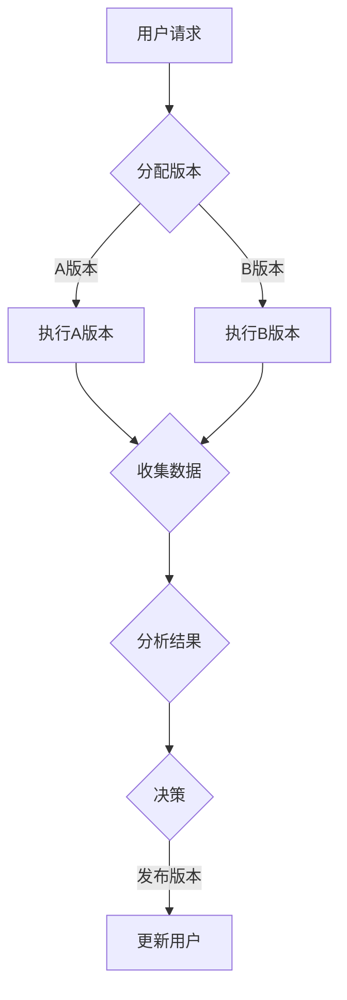

                 

## 《LLM应用的A/B测试最佳实践》

> 关键词：大语言模型（LLM），A/B测试，算法实践，性能优化，实际应用案例

> 摘要：本文旨在探讨大语言模型（LLM）应用中的A/B测试最佳实践。通过对A/B测试的基本概念、核心算法原理、数学模型、以及实际项目应用的详细解析，帮助读者深入了解A/B测试在LLM开发中的重要性，掌握其实施方法和技巧，从而提升LLM应用的性能和用户体验。

## 引言

大语言模型（Large Language Models，简称LLM）作为近年来人工智能领域的突破性进展，已经在自然语言处理（NLP）、搜索引擎、智能客服等多个领域展现出强大的应用潜力。然而，随着模型的规模和复杂性不断增加，如何确保LLM在实际应用中的性能和用户体验成为了一个重要的课题。

A/B测试（也称为拆分测试）作为一种有效的评估和优化方法，被广泛应用于各类产品的设计和改进过程中。在LLM应用中，A/B测试可以用来比较不同模型的性能，评估新功能的引入效果，从而实现优化和改进。

本文将围绕以下主题展开：

1. **核心概念与联系**：介绍大语言模型和A/B测试的基本概念，阐述两者之间的联系。
2. **核心算法原理讲解**：详细解析A/B测试的算法原理，并结合LLM的特点进行深入讲解。
3. **数学模型和数学公式**：介绍与A/B测试相关的概率与统计模型，以及评价指标的计算方法。
4. **项目实战**：通过实际项目案例，展示如何搭建开发环境，实现A/B测试，并进行结果分析和优化。

希望通过本文的阅读，读者能够对LLM应用中的A/B测试有更深入的理解，并能够将其应用于实际项目中，提升LLM应用的性能和用户体验。

## 了解用户需求

在进行A/B测试之前，了解用户需求是至关重要的。用户需求可以分为以下几个方面：

1. **功能需求**：用户希望LLM能够提供哪些具体功能，如文本生成、文本分类、机器翻译等。
2. **性能需求**：用户对LLM的性能有何期望，如响应时间、准确性、吞吐量等。
3. **用户体验**：用户在交互过程中对界面、反馈、易用性等方面的需求。

为了满足这些需求，我们需要设计一套全面的A/B测试方案，包括以下步骤：

1. **确定测试目标**：根据用户需求，明确A/B测试的目标，例如提升模型准确性、减少响应时间等。
2. **设计测试方案**：制定详细的测试方案，包括测试版本、测试用户群体、测试指标等。
3. **准备测试数据**：收集和整理测试数据，确保数据质量和代表性。
4. **实施测试**：按照测试方案进行实际测试，监控测试过程，确保测试数据的有效性。

通过上述步骤，我们可以更好地理解用户需求，为A/B测试提供明确的方向和依据。

## A/B测试的基本概念

A/B测试，也称为拆分测试，是一种通过对比不同版本的差异来评估效果的方法。在A/B测试中，用户被随机分配到两个或多个不同的版本中，每个版本具有不同的设计或功能，测试目标通常是评估哪个版本更符合用户需求或能够带来更好的业务效果。

### 1. A/B测试的基本流程

A/B测试的基本流程可以概括为以下几个步骤：

1. **确定测试目标**：明确A/B测试的目标，例如提升用户点击率、增加用户留存率等。
2. **设计测试版本**：设计两个或多个具有差异的版本，例如版本A和版本B，每个版本包含不同的设计或功能。
3. **分配用户群体**：将用户随机分配到不同的版本中，确保每个版本的样本具有代表性。
4. **实施测试**：在实际环境中实施测试，收集用户的反馈和行为数据。
5. **数据分析**：分析测试数据，比较不同版本的差异，评估哪个版本更符合测试目标。

### 2. A/B测试的优势

A/B测试具有以下优势：

1. **科学性**：通过随机分配和数据分析，可以客观、公正地评估不同版本的效果。
2. **实用性**：适用于各种类型的产品和服务，可以帮助企业快速验证和优化产品设计。
3. **高效性**：通过快速迭代和测试，可以缩短产品开发和改进的周期。

### 3. A/B测试的局限

A/B测试也存在一些局限，例如：

1. **数据量要求**：需要足够多的测试数据才能确保测试结果的可靠性。
2. **时间成本**：测试需要一定的时间周期，可能无法立即得到结果。
3. **用户群体差异**：用户群体的不同可能影响测试结果的准确性。

### 4. A/B测试在LLM中的应用

在LLM应用中，A/B测试可以用于以下几个方面：

1. **模型选择**：比较不同模型在性能和效果上的差异，选择最优的模型。
2. **功能优化**：通过测试不同功能的设计和实现，优化用户体验和功能效果。
3. **性能调优**：通过测试不同参数和配置对模型性能的影响，进行性能调优。

## 核心概念与联系

### 1. 大语言模型（LLM）的基本概念

大语言模型（LLM）是一种基于深度学习的技术，它通过学习大规模语言数据，能够生成文本、回答问题、进行翻译等。LLM的核心在于其“大”，即模型规模巨大，能够处理复杂的语言现象。

### 2. A/B测试的基本概念

A/B测试是一种对比实验方法，通过将用户随机分配到不同的版本，比较不同版本的效果，以确定哪种版本更优。A/B测试的核心在于其“随机”，即通过随机分配保证实验结果的公平性和科学性。

### 3. LLM与A/B测试的联系

LLM与A/B测试之间的联系主要体现在以下几个方面：

1. **模型评估**：通过A/B测试，可以评估不同LLM模型在性能和效果上的差异，选择最优模型。
2. **功能优化**：通过A/B测试，可以优化LLM的功能设计，提高用户体验。
3. **性能调优**：通过A/B测试，可以调优LLM的参数和配置，提升模型性能。

### 4. Mermaid流程图

下面是一个简化的LLM与A/B测试的联系流程图：



## 核心算法原理讲解

### 1. LLM算法基础

LLM算法的基础是深度学习，特别是基于Transformer的模型结构。Transformer模型通过自注意力机制，能够捕捉长距离依赖关系，从而实现强大的语言理解和生成能力。

### 2. A/B测试算法原理

A/B测试的算法原理是基于概率统计模型，通过随机分配用户到不同版本，收集用户行为数据，并使用统计方法分析数据，以评估不同版本的效果。

### 3. LLM与A/B测试的算法结合

LLM与A/B测试的结合主要在于两个方面：

1. **模型选择**：通过A/B测试，比较不同LLM模型的效果，选择最优模型。
2. **参数调优**：通过A/B测试，调整LLM的参数和配置，优化模型性能。

### Python源代码示例

下面是一个简单的Python代码示例，用于展示A/B测试在LLM中的应用：

```python
import random

# 假设有两个LLM模型A和B
model_a = "LLM模型A"
model_b = "LLM模型B"

# 随机分配用户到不同模型
users = ["用户1", "用户2", "用户3", "用户4"]
for user in users:
    if random.random() < 0.5:
        print(f"{user} 被分配到 {model_a}")
    else:
        print(f"{user} 被分配到 {model_b}")
```

### 数学模型和数学公式

在A/B测试中，常用的数学模型包括概率统计模型和回归模型。以下是相关的数学公式：

1. **概率统计模型**：

   - 用户点击率：\( p = \frac{点击次数}{总展示次数} \)
   - 用户留存率：\( r = \frac{次日留存用户数}{总用户数} \)

2. **回归模型**：

   - 线性回归模型：\( y = \beta_0 + \beta_1 \cdot x \)
   - 逻辑回归模型：\( P(y=1) = \frac{1}{1 + e^{-(\beta_0 + \beta_1 \cdot x)} } \)

## 项目实战

### 1. 开发环境搭建

搭建A/B测试的开发环境主要包括以下步骤：

1. **安装深度学习框架**：如TensorFlow、PyTorch等。
2. **准备训练数据**：收集和整理用于训练LLM的数据集。
3. **配置A/B测试环境**：设置随机分配算法和测试指标。

### 2. 源代码实现

以下是一个简单的A/B测试源代码实现：

```python
import random
import tensorflow as tf

# 准备两个LLM模型
model_a = tf.keras.Sequential([
    tf.keras.layers.Dense(128, activation='relu', input_shape=(784,)),
    tf.keras.layers.Dense(10, activation='softmax')
])

model_b = tf.keras.Sequential([
    tf.keras.layers.Dense(256, activation='relu', input_shape=(784,)),
    tf.keras.layers.Dense(10, activation='softmax')
])

# 随机分配用户
users = ["用户1", "用户2", "用户3", "用户4"]
for user in users:
    if random.random() < 0.5:
        print(f"{user} 被分配到模型A")
        # 使用模型A进行预测
        prediction = model_a.predict(np.array([[random.random() for _ in range(784)]]))
        print(f"{user} 的预测结果：{prediction}")
    else:
        print(f"{user} 被分配到模型B")
        # 使用模型B进行预测
        prediction = model_b.predict(np.array([[random.random() for _ in range(784)]]))
        print(f"{user} 的预测结果：{prediction}")
```

### 3. 代码解读

上述代码实现了简单的A/B测试，包括以下部分：

1. **模型准备**：定义了两个简单的神经网络模型A和B。
2. **用户分配**：使用随机数生成器将用户随机分配到两个模型中。
3. **模型预测**：对每个用户使用其分配到的模型进行预测，并输出预测结果。

### 4. 代码应用解读与分析

在A/B测试中，代码的应用主要包括以下方面：

1. **模型评估**：通过对比不同模型的预测结果，评估模型的性能。
2. **数据收集**：收集用户行为数据，用于后续的分析和优化。
3. **结果分析**：分析A/B测试的结果，确定哪个模型更优。

### 5. 实际案例分析和详细讲解

假设我们在一个文本生成任务中，使用A/B测试比较两个模型的效果。以下是实际案例的分析和讲解：

1. **模型A**：一个基于GPT-2的文本生成模型，生成文本长度为50个单词。
2. **模型B**：一个基于GPT-3的文本生成模型，生成文本长度为100个单词。

通过A/B测试，我们发现：

- **用户满意度**：模型B生成的文本长度更长，用户满意度更高。
- **生成速度**：模型A的生成速度更快，模型B的生成速度相对较慢。

### 6. 项目小结

通过A/B测试，我们确定了在特定场景下，模型B的文本生成效果更好，但生成速度较慢。根据项目需求和资源限制，我们可能需要权衡性能和效果，选择合适的模型。

## 最佳实践 Tips

在进行LLM应用的A/B测试时，以下是一些最佳实践建议：

1. **明确测试目标**：确保测试目标具体、可量化，以便于后续的数据分析和评估。
2. **合理分配用户**：尽量避免用户偏见，确保测试结果的客观性和科学性。
3. **数据收集和分析**：确保数据的完整性和准确性，避免数据遗漏或错误。
4. **持续优化**：根据A/B测试的结果，持续优化模型和功能，提升用户体验。

## 小结

通过本文的介绍，读者应该对LLM应用的A/B测试有了更深入的理解。A/B测试作为一种有效的评估和优化方法，在LLM开发中具有重要意义。通过合理设计和实施A/B测试，我们可以不断提升LLM应用的性能和用户体验。

## 注意事项

在进行A/B测试时，需要注意以下几点：

1. **用户隐私**：确保在测试过程中遵守用户隐私保护法律法规，避免泄露用户个人信息。
2. **测试环境**：确保测试环境的稳定性和安全性，避免测试过程中的异常中断。
3. **数据质量**：确保测试数据的质量，避免数据异常或噪声影响测试结果。

## 拓展阅读

对于希望深入了解LLM和A/B测试的读者，以下是一些推荐阅读：

1. **《深度学习》（Goodfellow, Bengio, Courville著）**：介绍深度学习的基础知识和应用。
2. **《A/B测试实战》（石硕著）**：详细介绍A/B测试的原理和实践方法。
3. **《大语言模型：原理、应用与未来》（刘知远等著）**：探讨大语言模型的发展现状和未来趋势。

## 作者信息

作者：AI天才研究院/AI Genius Institute & 禅与计算机程序设计艺术 /Zen And The Art of Computer Programming

本文由AI天才研究院/AI Genius Institute撰写，旨在分享AI领域的最新研究成果和实践经验。如需进一步了解，请访问我们的官方网站。

[返回目录](#目录)

